# Description

<!--- Describe your changes in detail -->

# API change

For any API change we need to document code examples. At the time of writing,
SDK supports four tier 1 languages and we need to have code examples for each
one of them.

If you modify API and documenting a `curl` example inside `{: codeblock}` please
make sure that you follow the checklist.

## Workflow

### The PR journey diagram

<!--the mermaid source is in the .svg file-->

### Git diagram

<!--the mermaid source is in the .svg file-->

## Developer checklist

- [ ] Notify integration team about the PR so they contribute `{: codeblock}`
      for other languages in the same PR in separate commit.
- [ ] Code examples are written for each tier 1 language
- [ ] Notify documentation team that PR is ready for review

## Reviewer checklist (documentations team)

- [ ] Verify `{: codeblock}` sections for each of the following are included in the PR
    - `{: codeblock} {: curl}`
    - `{: codeblock} {: java}`
    - `{: codeblock} {: javascript}`
    - `{: codeblock} {: python}`
    - `{: codeblock} {: go}`
- [ ] Improve API documentation if required
- [ ] Follow up with author of the PR if needed
- [ ] Merge when the PR is in the good shape (do not squash into single commit).