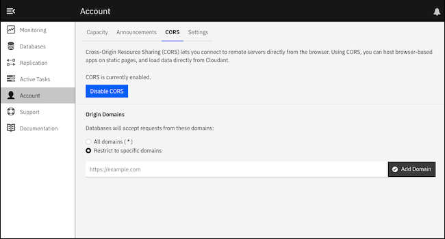

---

copyright:
  years: 2015, 2022
lastupdated: "2022-11-11"

keywords: cross-domain, security, configuration endpoints, json format, dashboard, set CORS configuration, read CORS configuration, IBM Cloudant Dashboard, same origin security policy

subcollection: Cloudant

---

{{site.data.keyword.attribute-definition-list}}

# How Cross-origin resource sharing (CORS) works
{: #cross-origin-resource-sharing}

[CORS](https://www.w3.org/wiki/CORS){: external} is a mechanism that allows resources
such as JSON documents in an {{site.data.keyword.cloudantfull}} database to be requested
from JavaScript.
{: shortdesc}

In this case, the JavaScript is running on a website that is loaded from another domain.

These "cross-domain" requests would normally be forbidden by web browsers. The requests use the [same origin security policy](https://en.wikipedia.org/wiki/Same-origin_policy){: external}.

CORS defines a way in which the browser and the server interact to determine whether or not to allow the request.
For {{site.data.keyword.cloudant_short_notm}},
CORS might be a good solution in the following use cases.

1.	You have a website on `https://www.example.com`, and you want scripts on this website that can access data from `https://example.cloudant.com`.

	To make this access possible,
	add `https://www.example.com` to your list of allowed origins.
	The effect is that scripts that are loaded from this domain are then
	permitted to make Ajax requests to your {{site.data.keyword.cloudant_short_notm}} databases.
	By using HTTP authorization with CORS requests,
	users of your application can access only their database.

2.	You want to allow third parties access to your database.

	For example, if you have a database that includes product information, add their domain to your list of allowed origins. After that, you can give sales partners access to the information from JavaScript running on their domain.
	The effect is that scripts that run on their website can access your {{site.data.keyword.cloudant_short_notm}} database.

## Browser support
{: #browser-support}

CORS is supported by all current versions of commonly used browsers.

Versions of Microsoft&trade; Internet Explorer before version 10 offer partial support for CORS. Versions of Microsoft&trade; Internet Explorer before version 8 don't support CORS.
{: note}

## Security
{: #security-overview}

Storing sensitive data in databases that can be accessed by using CORS is a potential security risk.
When you place a domain in the list of allowed origins,
you're trusting all the JavaScript from the domain.
If the web application that runs on the domain is running malicious code or has security vulnerabilities,
sensitive data in your database might be exposed.

Also,
allowing scripts to be loaded by using HTTP rather than HTTPS,
and then accessing data by using CORS,
introduces the risk that a man-in-the-middle attack might modify the scripts.

To reduce the risk of man-in-the-middle attacks, follow these guidelines:

-	Don't allow CORS requests from all origins.
	In other words,
	do not set `"origins": ["*"]` unless you're certain that you want to meet the following conditions:
	-	You want to allow all data in your databases to be publicly accessible.
	-	User credentials that give permission to modify data are never used in a browser.
-	Allow CORS requests only from HTTPS origins, not HTTP.
-	Ensure that web applications that run on allowed origin domains are trusted
	and do not have security vulnerabilities.

For more information, see the [API and SDK documentation](/apidocs/cloudant#getcorsinformation){: external} about the configuration endpoints for CORS.

## Dashboard
{: #dashboard}

CORS support is available in the {{site.data.keyword.cloudant_short_notm}} Dashboard.

You can update your CORS settings by using the CORS tab within the dashboard. See the following screenshot:

{: caption="CORS dashboard" caption-side="bottom"}

To see the current CORS configuration,
open **Account** > **CORS** in the dashboard.

You can enable or disable CORS by using `Enable CORS`.
This setting corresponds to the [`enable_cors` option](/apidocs/cloudant#putcorsconfiguration){: external}.
when you change the CORS configuration from within an application.

To specify that CORS is enabled for all domains,
select the `All domains (*)` option.

To specify that CORS is enabled only for exact origin domains,
list each of the domains or subdomains by using the `Restrict to specific domains` option.
For each domain,
provide a full URL,
preferably by using the `https` prefix for better security.
