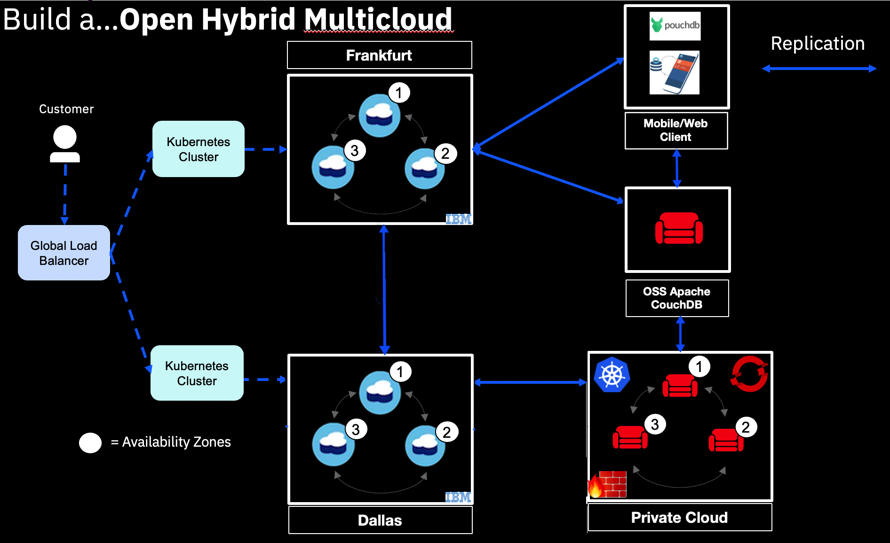

---

copyright:
  years: 2019, 2021
lastupdated: "2021-10-29"

keywords: compare, open source, replication protocol, database ecosystem, features, high availability, security

subcollection: Cloudant

---

{:new_window: target="_blank"}
{:shortdesc: .shortdesc}
{:screen: .screen}
{:codeblock: .codeblock}
{:pre: .pre}
{:tip: .tip}
{:note: .note}
{:important: .important}
{:deprecated: .deprecated}
{:external: target="_blank" .external}

<!-- Acrolinx: 2021-04-14 -->

# Overview of Apache CouchDB and the Operator
{: #apache-couchdb-overview}

[Apache CouchDB](http://couchdb.apache.org/){: external} is a powerful and scalable database with an intuitive HTTP API that scales from a developer's laptop to production database clusters. 
{: shortdesc}

Apache CouchDb is an Apache-licensed open source database. Furthermore, the Apache CouchDB replication protocol allows data to be synchronized between clusters spread across the globe, to devices in your customers' pockets, and to {{site.data.keyword.cloudantfull}} managed service instances. It is proven for production and is available at no charge to download and use for any purpose.

{{site.data.keyword.IBM}} recommends the use of Apache CouchDB for any self-managed installations to pair alongside {{site.data.keyword.cloudant_short_notm}}. Using {{site.data.keyword.cloudant_short_notm}} and Apache CouchDB together provides teams with the following functions:

- From inception, {{site.data.keyword.cloudant_short_notm}} was built with Apache CouchDB and maintains API compatibility for core features. The common replication protocol between these technologies enables hybrid multicloud architectures.
- Combine {{site.data.keyword.cloudant_short_notm}} and Apache CouchDB as an open data layer for your applications to build once and run anywhere. 
- Developers can use both the Apache CouchDB and {{site.data.keyword.cloudant_short_notm}} database ecosystem to store data wherever they need it. For example, you could use {{site.data.keyword.cloudant_short_notm}} in the {{site.data.keyword.cloud_notm}} and synchronize data with Apache CouchDB running at an edge location like an oil rig or tablet device. Alternatively, you could use {{site.data.keyword.cloudant_short_notm}} for a large-scale production environment while you use Apache CouchDB for local development and testing.  

{: caption="Figure 1. IBM Cloudant and Apache CouchDB Hybrid Cloud architecture" caption-side="bottom"}

## Apache CouchDB Operator
{: #apache-couchdb-operator-overview}

An [Operator](https://kubernetes.io/docs/concepts/extend-kubernetes/operator/){: external} is a method of packaging, deploying, and managing a Kubernetes-native application. 

The Operator for Apache CouchDB helps you deploy and manage an Apache CouchDB cluster on Kubernetes. 

### Operator Features
{: #operator-features-apache-couchdb}

The following list shows the features of an Operator: 

- Fully automated deployment and configuration of Apache CouchDB clusters.
- Single Operator deployment can support single, multiple, or all Kubernetes namespaces.

### Default settings used by Apache CouchDB Operator
{: #apache-couchdb-features}

The Operator for Apache CouchDB uses the following defaults when it deploys a new Apache CouchDB cluster to ensure a secure and highly available configuration.

#### Security
{: #security-overview-operator}

TLS 
:   The Operator leverages the Red Hat OpenShift cert-manager to create certificates and enable HTTPS/SSL on the cluster. On other Kubernetes distributions, TLS is supported by using user-provided certificates. You can review Apache CouchDB HTTPS (SSL/TLS) Options, or install Jetstack cert-manager to manage TLS elsewhere.

Encryption 
:   Encrypted intra-cluster communication, which means that the communication between database nodes is encrypted in addition to TLS on the HTTPS API.

Authentication 
:   The parameter `require_valid_user` is set to `true`, which means that no requests are allowed from anonymous users. Every request must be authenticated.

Authorization 
:   Databases are initially accessible by Apache CouchDB admins only.

#### High Availability
{: #high-availability-overview-operator}

Nodes 
:   Each database node in an Apache CouchDB cluster requires its own Kubernetes node. You can run it with a minimum of three nodes for any production deployment.

Zones 
:   The Apache CouchDB cluster database nodes are spread across available Kubernetes fault zones where available.

Replicas 
:   The default configuration for each database is eight shards (Q=8) and three shard copies (N=3), where each shard copy is deployed on a separate node in the cluster.

### Supported Apache CouchDB Versions
{: #couchdb-supported-versions}

The currently supported Apache CouchDB version is [Apache CouchDB 3.x](https://docs.couchdb.org/en/3.1.1/){: external}.
 
### Using the Operator
{: #using-operator}

Follow these steps to use Operator for Apache CouchDB to deploy a CouchDB Cluster on Kubernetes:

1. Install the Operator for Apache CouchDB once.
2. Configure the CouchDB cluster.
3. Deploy the CouchDB cluster.
4. Access the CouchDB cluster.

### What to do next
{: #what-to-do-next}

Follow the instructions available about how to continue with installing, configuring, deploying, accessing, and troubleshooting the Operator for Apache CouchDB. Instructions vary between Kubernetes distributions and versions. You must follow different steps for Kubernetes and Red Hat OpenShift 3.x versus Red Hat OpenShift 4.x.
