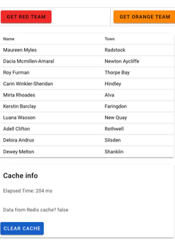

---

copyright:
  years: 2022
lastupdated: "2022-05-18"

keywords: combine ibm services, example, create a database, populate database, queries, retrieve data,  query data, create query, web application, add documents, caching, redis

subcollection: Cloudant

content-type: tutorial
services: Cloudant
account-plan: lite
completion-time: 1hr

---

{{site.data.keyword.attribute-definition-list}}

# Combining {{site.data.keyword.cloudant_short_notm}} with other {{site.data.keyword.IBM_notm}} services
{: #combine-ibm-services}
{: toc-content-type="tutorial"}
{: toc-services="Cloudant"}
{: toc-completion-time="1hr"}

Each database technology has its own strengths and weaknesses. Some are built for high availability and data durability (at the expense of more hardware and extra cost). Others favor speed and can churn out blazingly fast queries (but might lose data in a sudden power failure).
{: shortdesc}

In this tutorial, you combine two {{site.data.keyword.IBM}} services, {{site.data.keyword.cloudantfull}} and {{site.data.keyword.databases-for-redis_full}} to optimize for speed and cost by implementing a caching system for database queries.

This tutorial takes less than an hour to complete. It is not entirely cost-free because the {{site.data.keyword.databases-for-redis}} service does not come with a free tier. However, if you deprovision the services after you finish with them, you should not have to pay more than a few dollars.

## The Project - Team Directory
{: #the-project-team-directory}

**Team Directory** is a web app that contains the details of all divisional employees. These employees are assigned to six different color-coded teams (Red, Orange, Green, Blue, Yellow, and Purple). When you visit the app, you can select one team and see the names of all the members of that team. The app also shows you whether this list of team members was obtained from the {{site.data.keyword.cloudant_short_notm}} database or from the {{site.data.keyword.databases-for-redis}} cache and how long the query took. You can see just how much quicker cached data is to retrieve.


## Objectives
{: #objectives-combine}

- Learn how to provision multiple services on the {{site.data.keyword.cloud}} by using Terraform.
- Learn how to use the {{site.data.keyword.cloudant_short_notm}} NodeJS SDK to access your {{site.data.keyword.cloud}} services.

## Prerequisites
{: #prerequisites-combine}

You need the following items:

- An [{{site.data.keyword.cloud}}](https://cloud.ibm.com/login) pay-as-you-go account
- Access to a Mac or Linux&trade; terminal
- [Git](https://git-scm.com/downloads)
- [Node.js and npm](https://docs.npmjs.com/downloading-and-installing-node-js-and-npm)
- [Terraform](https://www.terraform.io/downloads.html)
- [Jq](https://stedolan.github.io/jq/), a command-line tool to process JSON data

## Step 1. Obtain an API key to deploy infrastructure to your account
{: #obtain-credentials-combine}

Follow the steps in [this document](https://cloud.ibm.com/docs/account?topic=account-userapikey&interface=ui#create_user_key) to create an API key and make a note of it.

## Step 2. Clone the code repo and cd into the Terraform directory
{: #clone-repo-combine}

Now, you get the code and create a credentials file.

1. In a terminal window, type the following command:

   ```sh
   git clone https://github.com/IBM-Cloud/team-directory.git
   cd team-directory
   ```
   {: codeblock}

1. Create a document called `terraform.tfvars` with the following fields:

   ```sh
   ibmcloud_api_key = "<your_api_key_from_step_1>"
   region = "eu-gb"
   redis_password  = "<make_up_a_password>"
   ```
   {: codeblock}

## Step 3. Create the infrastructure
{: #create-infra-combine}

1. Create all the infrastructure that you need by running the Terraform script:

   ```sh
   terraform apply --auto-approve
   ```
   {: codeblock}

   The Terraform folder contains a number of simple scripts, which you can see in the following list:

      `main.tf` 
      : Tells Terraform to use the IBM Cloud.

      `variables.tf`
      : Contains the variable definitions whose values are populated from terraform.tfvars.

      `redis.tf` 
      : Creates a {{site.data.keyword.databases-for-redis}} instance and some credentials to access it.

      `cloudant.tf` 
      : Creates an {{site.data.keyword.cloudant_short_notm}} free-tier instance and some credentials to access it.

   It takes several minutes for the resources to be ready. Now you have an {{site.data.keyword.cloudant_short_notm}} instance and a {{site.data.keyword.databases-for-redis}} instance that you can access.

   You can have only one free-tier instance per account. If you already have one, you must delete it, or change the `plan` variable to `standard`.
   {: note}

1. Check out these instances by visiting the Resources section of your {{site.data.keyword.cloud}} account.

The Terraform script outputs several bits of information that you use in the next steps.


## Step 4. Run the service
{: #run-combine}

In this step, you run a script that creates all the environment variables that your service needs and then runs the service.

In the terminal, type the following command:

```sh
./build.sh
```
{: codeblock}

When you run this script, it takes the data output from the Terraform script and uses the `jq` facility to parse the content and create the environment variables needed. It then runs the script (`server.js`) that initializes the database and populates it with data.

## Step 5. Visit your website 
{: #visit-combine}


1. Open a browser and visit `http://localhost:8080`. 
   See the button for each team in the following screen capture:

   {: caption="Team Directory team selectors" caption-side="bottom"}

1. Click any of the colored buttons and obtain a list of team members.

1.  Look at where the data came from, {{site.data.keyword.cloudant_short_notm}} (cache = false) or {{site.data.keyword.databases-for-redis}} (cache = true) and how long it took.

1. Click the same button that you clicked in step two.
   You can see the data that comes from the {{site.data.keyword.databases-for-redis}} cache and takes a lot less time to execute in the following screen capture:

   {: caption="Team Directory team list and cache information" caption-side="bottom"}

   In a real cloud-based application, the application server and the {{site.data.keyword.databases-for-redis}} instance would be close to each other (in the same data center) so latency between the two would be only a few milliseconds. In this example, extra network hops exist between your locally hosted application server and the cloud-hosted {{site.data.keyword.databases-for-redis}} cache so latency gains aren't as good as in production.
   {: note}

   The cached data is set to expire within 60 seconds. So if you return to one of the teams after 60 seconds, the data is again retrieved from the database and not the cache.

1. Use the **Clear Cache** button to remove all cached data from {{site.data.keyword.databases-for-redis}} if necessary.

## About the Code
{: #about-the-code-redis}

The application is a simple Node.js application. It uses three main packages:

- [`@ibm-cloud/cloudant`](https://github.com/IBM/cloudant-node-sdk) to connect to {{site.data.keyword.cloudant_short_notm}} and read/write data.
- [`redis`](https://www.npmjs.com/package/redis) to connect to the {{site.data.keyword.databases-for-redis}} instance and read/write data.
- [Express](https://expressjs.com/) to enable a simple web server that allows users to interact with the data.

The following sections describe the two main files.

### server.js 
{: #server-js-redis}

This `server.js` file runs the web server and communicates with {{site.data.keyword.cloudant_short_notm}} and {{site.data.keyword.databases-for-redis}}. When the front end submits a team selection to the `team` route (see [`index.html`](#index-html-redis)), the `app.route` function first checks the cache to see whether it has the data already. If it does, then it returns that. Otherwise, it makes a query to {{site.data.keyword.cloudant_short_notm}} to retrieve team data, store it in the cache, and return it to the front end. 

The read operation uses an {{site.data.keyword.cloudant_short_notm}} design document and a MapReduce view to select documents. This selection is beyond the scope of this tutorial, but you can read more about [views and design documents](/docs/Cloudant?topic=Cloudant-creating-views-mapreduce) in the documentation.

This script also contains some code that uploads test data (contained in the `directorydata.json` file) to the database the first time it runs. 


### index.html
{: #index-html-redis}

The index.html page is the only page of the application that is using the [Vue.js framework](https://vuejs.org/). When it loads, it shows you the available teams.

When you select a team, it makes an HTTP POST request with your choice to the `/team` route of the application (see [`redis.js`](#server-js-redis)). A successful return from the application contains all the data for the team members. We are displaying only their names and town for simplicity.


### Summary
{: #summary-redis}

Today, we combined two {{site.data.keyword.cloud_notm}} services to optimize cost and user experience: {{site.data.keyword.cloudant_short_notm}} as a document store and query engine and {{site.data.keyword.databases-for-redis}} as a content cache. Cached documents can be retrieved more quickly and more cheaply, but the tradeoff is that your application might be showing old data to your users for a time.

If you followed this tutorial, you must deprovision your resources to stop incurring charges. You can deprovision from the `terraform` directory on your terminal by typing the following command, `terraform destroy --auto-approve`.
{: important}
