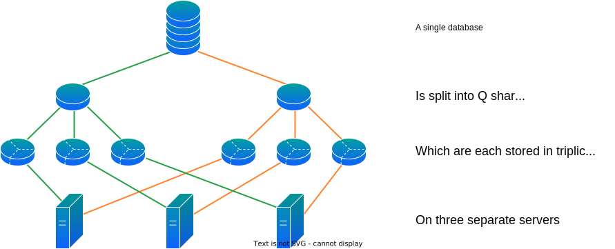

---

copyright:
  years: 2017, 2025
lastupdated: "2025-08-11"

keywords: how data is stored, sharding and performance, work with shards, shard count, replica count

subcollection: Cloudant

---

{{site.data.keyword.attribute-definition-list}}

# How is data stored in {{site.data.keyword.cloudant_short_notm}}?
{: #how-is-data-stored-in-ibm-cloudant-}

Every database in {{site.data.keyword.cloudantfull}} consists of one or more distinct _shards_, where the number of shards is referred to as `Q`. A shard contains a distinct subset of documents from the database.
{: shortdesc}

## Database sharding
{: #sharding}

As noted above, every {{site.data.keyword.cloudantfull}} database is formed of `Q` shards, and all `Q` shards together contain the data within a database. Further, each shard is replicated three times. Each replica is stored on a different server, and replicas are spread across availability zones within a single region. These _shard replicas_ are used to provide high availability within a region.
 
{: caption="Data storage" caption-side="bottom"}

{{site.data.keyword.cloudantfull}} creates databases with a default value for `Q` based on typical workloads, and may update this default over time. The number of replicas for each shard is always three, chosen to balance performance and data safety.

## Document ID and shard mapping explained
{: #how-are-documents-assigned-to-shards}

Documents are assigned to shards differently depending on whether the database is a _partitioned_ or _non-partitioned_ database. You select the type of database when creating it. The default type is non-partitioned.

In a non-partitioned database, the full document `id` is treated as an opaque
string by the database. In contrast, the document `id` in a partitioned database
is split into two parts, separated by a colon (`:`). The first part is called
the _partition key_. The second part is again treated as an opaque string by the
database. This difference in how the database handles document `id` fields is
key to how documents are assigned to shards.

| Database type | Document ID format | Document assignment |
|---|---|---|
| Non-partitioned | Single opaque string | Assigned to shard using hash of entire ID  |
| Partitioned | Two-part: first part is partition key | Assigned to shard using hash of partition key only |
{: caption="How database type affects document shard placement" caption-side="top"}

When using a partitioned database, the partition key gives
applications greater control of document co-placement on
shards. Read about this feature in more detail in [Database
partitioning](/docs/Cloudant?topic=Cloudant-database-partitioning).

Regardless of the database type, the way a document is assigned to a shard is
deterministic, so the same document will always be assigned to the same shard.
This is the case even if the document is deleted and re-created.

{: caption="Document assignment using hashing" caption-side="bottom"}

## How sharding affects database performance
{: #how-does-sharding-affect-performance-}

The number of shards for a database can affect the database's performance in a number of ways:

1. Each document in the database is stored on a single shard. In a partitioned database, all documents sharing a partition key are stored on a single shard. Each shard hosts multiple partitions.

	When reading data, for workloads that read documents by ID and restrict their querying to partition-scoped queries, having more shards enables greater parallelism within the database. This is because the database is able to retrieve data from a single shard rather than needing to access every database shard. 

	When writing documents, greater shard counts also tend to improve performance. Data is written directly to the shards involved. As database indexes are local to each shard, index building can benefit from extra parallelism.

	Bulk document reads and writes also benefit from larger shard counts because the database is able to determine the exact shards needed for the request.

2. To respond to a global query request, a database must process the results from all the shards. 

    Therefore, having more shards introduces a greater processing demand for global queries. The reason is that the database retrieves data from all database shards, then combines the results before it returns the response to the client. This currently scales greater than linearly with the number of shards, so is important to avoid with more than 16 shards in latency-sensitive request paths.

## Advanced sharding topics
{: #advanced-sharding-topics}

As changing the number of shards for a database is an advanced topic, most customers should keep the default values. The defaults have been tuned over time to balance database performance across the different considerations discussed below.

### Selecting a shard count for a database
{: #selecting-a-shard-count-for-a-database}

The tension when choosing a shard count is between data volume and the types of requests used by an application:

- Larger data volumes and document counts benefit from greater numbers of shards.
- Performance of global queries decreases with the number of shards.

We need to take account of both data size and the application's required data access patterns to decide on a good sharding strategy. To start calculating an appropriate shard count, first evaluate your expected number of documents and the data volume. Then refer to these guidelines:

- Use power-of-two steps to increase shard count --- 4, 8, 16 and so on.
- Select a shard count that will keep each shard beneath both 20GB _and_ 50 million documents for your long term estimated data needs.

Now you have an estimate for the number of shards your data requires, the next step is to understand whether your data model allows your data to be in one database or needs to be spread over several databases:

- If your data requires 16 or fewer shards, most data models will be successful. Single document read/write, partitioned queries and global queries will perform well.
- If your data requires more than 16 shards, evaluate whether your application needs to execute global queries in latency-sensitive paths:
	- If the data model naturally supports partitioned queries, then using a larger shard count (eg, 32 or 64) in a single database is recommended.
	- If the data model requires the ability to execute global queries, then the application will need to use several databases with 16 or fewer shards. The application will need to handle merging query responses from several databases.

The numbers in these guidelines are derived from observation and experience rather than precise calculation.

Regardless of shard count, both partitioned and global queries must ensure they use appropriate indexes and selective queries to avoid significant latency increases as your data set grows. Good indexes allow scanning consistent amounts of data to respond to queries, regardless of how large your data grows.
{: tip}

#### Setting shard count when creating a database
{: #setting-shard-count}

The number of shards,
`Q`, for a database is set when the database is created. The `Q` value cannot be changed later.

To specify the `Q` when you create a database, use the `q` query string parameter. 
