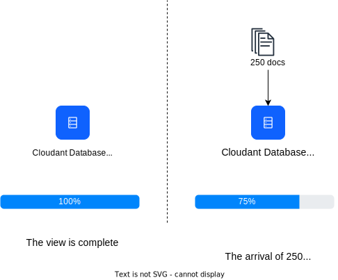

---

copyright:
  years: 2015, 2023
lastupdated: "2023-03-17"

keywords: multiple views, changes, versioned design documents, move and switch, the stale parameter, indexing

subcollection: Cloudant

---

{{site.data.keyword.attribute-definition-list}}

# Design document management
{: #design-document-management}

The scalable JSON data store for {{site.data.keyword.cloudant_short_notm}} has several querying mechanisms,
all of which generate indices that are created and maintained separately from the core data.
{: shortdesc}

*Article contributed by Glynn Bird, Developer Advocate at {{site.data.keyword.cloudant_short_notm}}, glynn@cloudant.com.*

Indexing isn't performed immediately when a document is saved.
Instead,
indexing is scheduled to happen later, providing a faster,
non-blocking write throughput.

-   MapReduce views are indexes into the data set
    with key value pairs that are stored in a BTree for efficient retrieval by key or range of keys.
-   Search Indexes are constructed by using Apache Lucene to allow free-text search, faceting, and complex ad hoc queries.

{{site.data.keyword.cloudantfull}}'s [search indexes](/docs/Cloudant?topic=Cloudant-cloudant-search) and [MapReduce views](/docs/Cloudant?topic=Cloudant-creating-views-mapreduce)
are configured by adding design documents to a database.
Design documents are JSON documents that include the instructions about how the view or index is to be built.
Let's take a simple example.
Assume that you have a simple collection of data documents,
similar to the following example.

See an example of a simple data document:

```json
{
    "_id": "23966717-5A6F-E581-AF79-BB55D6BBB613",
    "_rev": "1-96daf2e7c7c0c277d0a63c49b57919bc",
    "doc_name": "Markdown Reference",
    "body": "Lorem Ipsum",
    "ts": 1422358827
}
```
{: codeblock}

Each data document includes a name,
a body,
and a timestamp.
You create a [MapReduce view](/docs/Cloudant?topic=Cloudant-creating-views-mapreduce) to sort your documents by timestamp.

You can sort your documents by timestamp by creating a Map function.

See an example map function that returns a document's timestamp field, if present:

```javascript
function(doc) {
    if (doc.ts) {
        emit( doc.ts, null);
    }
}
```
{: codeblock}

The function emits the document's timestamp so that you can use it as the key to the index.
Since we're not interested in the value in the index,
`null` is emitted.
The effect is to provide a time-ordered index into the document set.

We're going to call this view `by_ts` and put it into a design document that is called `fetch`.

See an example design document that defines a view by using a map function:

```json
{
    "_id": "_design/fetch",
    "views": {
      "by_ts": {
        "map": "function(doc) {
          if (doc.ts) {
            emit( doc.ts, null);
          }
        }"
      }
    },
    "language": "javascript"
}
```
{: codeblock}

The result is that the map code is turned into a JSON-compatible string,
and included in a design document.

Once the design document is saved,
{{site.data.keyword.cloudant_short_notm}} triggers server-side processes to build the `fetch/by_ts` view.
It creates this view by iterating over every document in the database,
and sending each one to the JavaScript map function.
The function returns the emitted `key-value` pair.
As the iteration continues,
each `key-value` pair is stored in a B-Tree index.
After the index is built for the first time,
subsequent reindexing is performed only against new and updated documents.
Deleted documents are de-indexed.
This time-saving process is known as incremental MapReduce,
as shown in the following diagram:

{: caption="Illustration of Incremental MapReduce" caption-side="bottom"}

It's worth remembering the following points:

-   The construction of an index happens asynchronously.
    {{site.data.keyword.cloudant_short_notm}} confirms that the design document was saved. To check on the progress of the construction of the index,
    you must poll {{site.data.keyword.cloudant_short_notm}}'s [`_active_tasks`](/docs/Cloudant?topic=Cloudant-active-tasks#active-tasks) endpoint.
-   The more data that you have,
    the longer it takes before the index is ready.
-   While the initial index build is in progress,
    any queries made against the index are blocked.
-   Querying a view triggers the 'mapping' of any documents that aren't incrementally indexed.
    This practice ensures that you get an up-to-date view of the data.
    See the following [`stale` parameter](#the-stale-parameter) discussion
    for exceptions to this rule.

## Multiple views in the same design document
{: #multiple-views-in-the-same-design-document}

If you define several views in the same design document,
then they're built efficiently at the same time.
Each document is read only once,
and passed through each view's Map function.
If you use this approach, keep in mind that modifying a design document invalidates all of the existing MapReduce views that are defined in the document. This process invalidates MapReduce views even if some of the views stay unaltered. 

If MapReduce views must be altered independently of each other,
place their definitions in separate design documents. 

This behavior doesn't apply to Lucene search indexes. They can be altered within the same design document without invalidating other unchanged indexes in the same document. 
{: note}

{: caption="Design document version change" caption-side="bottom"}

## Managing changes to a design document
{: #managing-changes-to-a-design-document}

Imagine at some point in the future you decide to change the design of the view.
Now,
instead of returning the actual timestamp result,
we're only interested in the count of how many documents match the criteria.
To achieve this count,
the map function stays the same,
but you now use a `reduce` of `_count`.

See an example design document that uses a reduce function:

```json
{
    "_id": "_design/fetch",
    "_rev": "2-a2324c9e74a76d2a16179c56f5315dba",
    "views": {
        "by_ts": {
            "map": "function(doc) {
                if (doc.ts) {
                  emit( doc.ts, null);
                }
            }
        }",
        "reduce": "_count"
    },
    "language": "javascript"
}
```
{: codeblock}

When this design document is saved,
{{site.data.keyword.cloudant_short_notm}} completely invalidates the old index and begins building the new index from scratch,
iterating over every document in turn.
As with the original build,
the time that it takes depends on how many documents are in the database.
The build also blocks incoming queries on that view until it's complete.

But there's a problem...

If you have an application that is accessing this view in real time,
then you might experience a deployment dilemma:

-   Version 1 of the code,
    which relied on the original design document,
    might no longer work because the old view is invalidated.
-   Version 2 of the code uses the new design document. This version can't be released immediately because the new view isn't finished building yet. Remember the build process takes longer if the database includes many documents.
-   A more subtle problem that affects the code is that versions 1 and 2 expect different result data from the view:
    Version 1 expects a list of matching documents,
    while version 2 expects a 'reduced' count of results.

## Coordinating changes to design documents
{: #coordinating-changes-to-design-documents}

You can deal with this change control problem in two ways.

### Versioned design documents
{: #versioned-design-documents}

One solution is to use versioned design document names:

-   The code is initially written to use a view called `_design/fetchv1`.
-   When you release a new version,
    you create a new view that is called `_design/fetchv2`,
    and query the view to ensure that it builds.
-   {{site.data.keyword.cloudant_short_notm}} polls `_active_tasks` until the work of building the new index is complete.
-   Now, you're ready to release the code that depends on the second view.
-   Delete `_design/fetchv1` when we're sure it's no longer needed.

Using versioned design documents is a simple way to manage change control in your design documents, but you must remember to remove the older versions later.

### `Move and switch` design documents
{: #move-and-switch-design-documents}

Another approach relies on the fact that {{site.data.keyword.cloudant_short_notm}} recognizes when it has two identical design documents,
and doesn't waste time and resources to rebuild views that it already has.
In other words,
if you take your design document `_design/fetch` and create an exact duplicate `_design/fetch_OLD`,
then both endpoints would work interchangeably without triggering any reindexing.

To switch to the new view, follow these steps:

1.  Create a duplicate copy of the design document that you want to change,
    for example by adding `_OLD` to its name:
    `_design/fetch_OLD`.
2.  Put the new or "incoming" design document into the database
    by using a name with the suffix `_NEW`: `_design/fetch_NEW`.
3.  Query the `fetch_NEW` view
    to ensure that it starts to build.
4.  Poll the `_active_tasks` endpoint and wait until the index is finished building.
5.  Put a duplicate copy of the new design document into `_design/fetch`.
6.  Delete design document `_design/fetch_NEW`.
7.  Delete design document `_design/fetch_OLD`.

## `Move and switch` tooling
{: #move-and-switch-tooling}

The command-line, Node.js, `couchmigrate` script automates the `Move and switch` procedure. It can be installed by using the following command:

```sh
npm install -g couchmigrate
```
{: codeblock}

To use the `couchmigrate` script,
first define the URL of the CouchDB/{{site.data.keyword.cloudant_short_notm}} instance by setting an environment variable called `COUCH_URL`. Run the following command to define the URL for the {{site.data.keyword.cloudant_short_notm}} instance:

```sh
export COUCH_URL=https://127.0.0.1:5984
```
{: codeblock}

The URL must start with `https://` and can include authentication credentials. Run the following command to define the URL of the {{site.data.keyword.cloudant_short_notm}} instance with authentication credentials:

```sh
export COUCH_URL="https://$ACCOUNT:$PASSWORD@$HOST.cloudant.com"
```
{: codeblock}

If you assume that you have a design document in JSON format, which is stored in a file, you can then run the migrate command.

In this example,
`db` specifies the name of the database to change,
and `dd` specifies the path to the design document file. Run the `couchmigrate` command:

```sh
couchmigrate --db mydb --dd /path/to/my/dd.json
```
{: pre}

The script coordinates the `Move and switch` procedure,
waiting until the view is built before it returns.
If the incoming design document is the same as the incumbent one,
then the script returns almost immediately.

The source code for the script is available here:
[`couchmigrate`](https://github.com/glynnbird/couchmigrate){: external}.

## The '`stale`' parameter
{: #the-stale-parameter}

If an index is complete,
but new records are added into the database,
then the index is scheduled to be updated in the background.
The state of the database is shown in the following diagram:

{: caption="Index scheduled for update" caption-side="bottom"}

When querying the view, you have the following choices.

-   The default behavior is to ensure that the index is up to date,
    with the latest documents in the database,
    before it returns the answer.
    When you query the view,
    {{site.data.keyword.cloudant_short_notm}} first indexes the 250 new documents,
    and then returns the answer.
-   An alternative is adding the `stale=ok` parameter to the API call.
    This parameter means, `return me the data that is already indexed.
    I don't care about the latest updates.`
    In other words,
    when you query the view with `stale=ok`,
    {{site.data.keyword.cloudant_short_notm}} returns the answer immediately,
    without any additional reindexing.
-   A second alternative is to add the `stale=update_after` parameter to the API call.
    This parameter means, `return me the data that is already indexed, 
    and then reindex any new documents.`
    In other words,
    when you query the view with `stale=update_after`,
    {{site.data.keyword.cloudant_short_notm}} returns the answer immediately,
    and then schedules a background task to index the new data.

Adding `stale=ok` or `stale=update_after` can be a good way of getting answers more quickly from a view,
but at the expense of freshness. 

The default behavior distributes load evenly across nodes in the {{site.data.keyword.cloudant_short_notm}} cluster. If you use the alternative `stale=ok` or `stale=update_after` options, these options might favor a subset of cluster nodes in order to return consistent results from across the eventually consistent set. The `stale` parameter isn't a perfect solution for all use cases. However, it can provide timely responses on fast-changing data sets if your application is happy to accept stale results. If your data's change rate is small, adding `stale=ok` or `stale=update_after` doesn't bring a performance benefit, and might unevenly distribute the load on larger clusters.

Avoid `stale=ok` or `stale=update_after` whenever possible because the default behavior provides the freshest data,
and distributes data within the cluster.
You can make a client app aware that a large data processing task is in progress (during a regular bulk data update, for example) by switching to `stale=ok` temporarily during these times. The app can revert to the default behavior afterward.

The `stale` option is still available, but the more useful options `stable` and `update` are available and must be used instead. For more information, see [Accessing a stale view](/docs/Cloudant?topic=Cloudant-using-views#view-freshness).
{: note}
