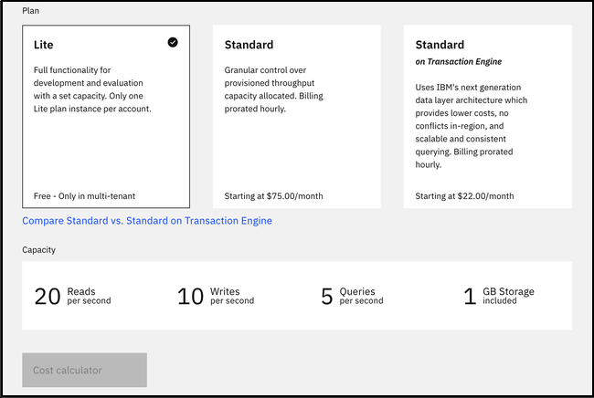
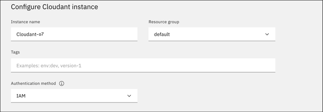

---

copyright:
  years: 2015, 2021
lastupdated: "2021-03-30"

keywords: getting started, example, connect to service instance, create a database, populate database, retrieve data, queries, retrieve data, api endpoint, delete database, close connection, create database, retrieve data, query data, create query, monitor active tasks, replicate database, add documents

subcollection: Cloudant

content-type: tutorial
services: Cloudant
account-plan: lite 
completion-time: 20m

---

{:new_window: target="_blank"}
{:shortdesc: .shortdesc}
{:codeblock: .codeblock}
{:pre: .pre}
{:screen: .screen}
{:tip: .tip}
{:note: .note}
{:important: .important}
{:deprecated: .deprecated}
{:external: target="_blank" .external}
{:step: data-tutorial-type='step'}

<!-- Acrolinx: 2020-12-21 -->

# Getting started with {{site.data.keyword.cloudant_short_notm}}
{: #getting-started-with-cloudant}
{: toc-content-type="tutorial"}
{: toc-services="Cloudant"}
{: toc-completion-time="20m"}

In this {{site.data.keyword.cloudantfull}} getting started tutorial, we use the {{site.data.keyword.cloud}} dashboard to create an {{site.data.keyword.cloudant_short_notm}} service instance, and find essential information to enable your application to work with the database. With the {{site.data.keyword.cloudant_short_notm}} dashboard, we learn how to perform different tasks, such as how to create a database, populate a database with documents, replicate a database, and so on. 
{: shortdesc}

You can also create an {{site.data.keyword.cloudant_short_notm}} database, populate the database with data, retrieve data by using queries or API endpoints, and many other tasks from the command line. For more information, see the [API and SDK reference](/apidocs/cloudant#introduction){: new_window}{: external}. 

## Objectives
{: #objectives-get-started}

- Create a service instance. 
- Create an {{site.data.keyword.cloudant_short_notm}} service credential. 
- Open the {{site.data.keyword.cloudant_short_notm}} dashboard. 
- Create a database. 
- Add JSON documents to the database and run a query. 
- Replicate a database. 
- Monitor active tasks. 
- Monitor with {{site.data.keyword.cloudant_short_notm}}. 

## Creating a service instance
{: #creating-an-ibm-cloudant-instance-on-ibm-cloud}
{: step}

1.  Log in to your {{site.data.keyword.cloud_notm}} account, and click the `Create resource` button. 

    {: caption="Figure 1. {{site.data.keyword.cloud_notm}} dashboard" caption-side="bottom"}

    The {{site.data.keyword.cloud_notm}} dashboard can be found at:
    [https://cloud.ibm.com/](https://cloud.ibm.com/){: new_window}{: external}.
    After you authenticate with your user name and password,
    you're presented with the {{site.data.keyword.cloud_notm}} dashboard. 
    {: note}
    
2.  Type `Cloudant` in the Search bar, and click to open it:

    {: caption="Figure 2. {{site.data.keyword.cloud_notm}} database services" caption-side="bottom"}

3.  Select an offering and an environment.

    {: caption="Figure 3. {{site.data.keyword.cloudant_short_notm}} offering and environment" caption-side="bottom"}

4.   Enter an instance name. </br>
    (In this example, the instance name is `Cloudant-o7`.) Verify that the resource group and authentication methods are correct. </br>
    Add a tag if you like. </br>
    The authentication methods that are available include `IAM` or `IAM and legacy credentials`.</br> 
    For more information, see [authentication methods](/docs/Cloudant?topic=Cloudant-managing-access-for-cloudant){: new_window}. 

5.  Select your pricing plan. </br>
    See the capacity in the table that follows.

    {: caption="Figure 4. Pricing plans and capacity" caption-side="bottom"}

6. To create the service, click the `Create` button:

    {: caption="Figure 5. {{site.data.keyword.cloudant_short_notm}} service name and credentials" caption-side="bottom"}

    The {{site.data.keyword.cloudant_short_notm}} team recommends that you use IAM access controls over {{site.data.keyword.cloudant_short_notm}} legacy authentication whenever possible.
    {: important}

    After you click `Create`, the system displays a message to say that the instance is being provisioned, which returns you to the Resource list. From the Resource list, you see the status for your instance is, `Provision in progress.` 

7. When the status changes to Active, click the instance, and click the `Service Credentials` tab. 

    {: caption="Figure 6. Create {{site.data.keyword.cloudant_short_notm}} service credentials" caption-side="bottom"}

The service credentials in this example were defined when a demonstration {{site.data.keyword.cloudant_short_notm}} service was created on {{site.data.keyword.cloudant_short_notm}}. The credentials are reproduced here to show how they would appear in the dashboard. However, the demonstration {{site.data.keyword.cloudant_short_notm}} service was removed, so these credentials are no longer valid. You *must* supply and use your own service credentials.
{: note}

## Creating service credentials
{: #creating-service-credentials}
{: step}

1.  To create the connection information that your application needs to connect to the instance, click the `New credential` button.

    {: caption="Figure 7. Create service credentials" caption-side="bottom"}

2.  Enter a name for the new credential in the Add new credential window. 

3.  Accept the Manager role.

4.  (Optional) Create a service ID or have one automatically generated for you. 

5.  (Optional) Add inline configuration parameters. This parameter isn't used by {{site.data.keyword.cloudant_short_notm}} service credentials, so ignore it. 

6.  Click the `Add` button.

    {: caption="Figure 8. Add a service credential" caption-side="bottom"}
 
    Your new credential appears in the table.

7.  To see the credentials that are required to access the service,
    click the chevron:

    {: caption="Figure 11. Viewing the {{site.data.keyword.cloudant_short_notm}} service credentials" caption-side="bottom"}

    The details for the service credentials open:

    {: caption="Figure 12. The {{site.data.keyword.cloudant_short_notm}} service credentials" caption-side="bottom"}

For more information about the fields in your credentials, see [Locating your service credentials](/docs/Cloudant?topic=Cloudant-locating-your-service-credentials).

## Opening your service instance on {{site.data.keyword.cloudant_short_notm}} dashboard
{: #using-the-ibm-cloudant-dashboard}
{: step}

Open your {{site.data.keyword.cloudant_short_notm}} service instance by following these steps.

1.  Go to the {{site.data.keyword.cloud_notm}} dashboard. 
    
2.  Click **Services** in the Resource list.

3.  From the Services section, click the `Cloudant-o7` instance you created in the first step, and click **Launch Dashboard**.
    The {{site.data.keyword.cloudant_short_notm}} dashboard opens.

Now, we can create a database, and run queries against that database.  

## Creating a database
{: #creating-a-database-dt}
{: step}

In this exercise, you create the `dashboard-demo` [database](/apidocs/cloudant#putdatabase){: new_window}{: external}, which 
is the database that we use in this tutorial.

1. From the {{site.data.keyword.cloudant_short_notm}} dashboard, click **Create database**.

   The Create database window opens. 

2. Enter the database name `dashboard-demo`.

3. Select **Non-partitioned**, and click **Create**.

   The `dashboard-demo` database opens automatically.

  Now, we can create some documents. 

## Adding documents to the database
{: #creating-documents-in-the-database-dt}
{: step}

The [documents](/docs/Cloudant?topic=Cloudant-documents#documents)
that you create in this exercise include the data that you use to query the `dashboard-demo` database in later exercises.

1.  Click **Create document**. 

    The New Document window opens.

2.  Copy the following sample text and replace the existing text in the new document.<br>
  Use the following sample text for document 1:

  ```json
  {
    "firstname": "Sally",
    "lastname": "Brown",
    "age": 16,
    "location": "New York City, NY",
    "_id": "doc1"
  }
  ```
  {: codeblock}

3.  Repeat steps 1 and 2 to add the remaining four documents to the database.<br>
  Use the following sample text for document 2:

  ```json
  {
    "firstname": "John",
    "lastname": "Brown",
    "age": 21,
    "location": "New York City, NY",
    "_id": "doc2"
  }
  ```
  {: codeblock}

  Use the following sample text for document 3:

  ```json
  {
    "firstname": "Greg",
    "lastname": "Greene",
    "age": 35,
    "location": "San Diego, CA",
    "_id": "doc3"
  }
  ```
  {: codeblock}

  Use the following sample text for document 4:

  ```json
  {
    "firstname": "Anna",
    "lastname": "Greene",
    "age": 44,
    "location": "Baton Rouge, LA",
    "_id": "doc4"
  }
  ```
  {: codeblock}

  Use the following sample text for document 5:

  ```json
  {
    "firstname": "Lois",
    "lastname": "Brown",
    "age": 33,
    "location": "New York City, NY",
    "_id": "doc5"
  }
  ```
  {: codeblock}

  You populated the `dashboard-demo` with five documents. You can see the documents from the Table view in the following screen capture:

   {: caption="Figure 2. Sample documents" caption-side="bottom"} 

### Running a simple query
{: #running-a-simple-query-dt}
{: step}

This example demonstrates how {{site.data.keyword.cloudant_short_notm}} Query finds documents based on the `lastname` and the `firstname`.   

1.  Click the **Query** tab.
2.  Copy the following sample JSON and replace the existing text in the new query window:
  ```json
   {
      "selector": {
            "lastname" : "Greene",
            "firstname" : "Anna"            
         }        
   }
  ```
  {: codeblock}

3.  Click **`Run Query`**.

    The query displays the results. You can see them from the Table view in the following screen capture:

    {: caption="Figure 3. Results from the query" caption-side="bottom"}

For more information, see the [{{site.data.keyword.cloudant_short_notm}} Query](/docs/Cloudant?topic=Cloudant-creating-an-ibm-cloudant-query) tutorial or the API reference on [{{site.data.keyword.cloudant_short_notm}} Query](/apidocs/cloudant#getindexesinformation){: new_window}{: external}.

## Replicating a database
{: #replicate-database-dt}
{: step}

When you replicate a database, it synchronizes the state of two databases: source and target. A replication copies all the changes that happened in the source database to the target database. When a document is deleted from the source database, the document is also deleted from the target database.

For more information, see [Replication](/docs/Cloudant?topic=Cloudant-replication-api#replication-operation) in the API reference.

To create a replication job, follow these steps:

1. Click the **Replication** tab.

2. Click **New Replication**. 

   The Job configuration page opens.  

   {: caption="Figure 4. Job configuration page" caption-side="bottom"} 
   
   Additionally, you can create a replication from the databases page by clicking the **Replicate** button in the Actions column.
   {: note} 

3. Enter the following information for your replication job. <br>
   Use the following information in the Source section:
      - Type - Select **Remote database**.
      - Name - Enter the database URL:
        ```http
        https://examples.cloudant.com/query-movies
        ``` 
        {: codeblock}

      - Authentication - Leave as `None`.

   Use the following information in the Target section:
      - Type - Select **New local database**.
      - New database - Enter the name for the new database, **`query-movies`**. 
      - New database options - Do not select the Partitioned option.
      - Authentication - Select **IAM Authentication**. 
      - IAM API Key - Enter the `apikey` from the Service credentials for your instance.
        
        For more information, see the section on [Locating your service credentials](/docs/Cloudant?topic=Cloudant-locating-your-service-credentials).

   Use the following information in the Options section:
     - Replication type - Leave as `One time`. 
     - Replication document - Leave as `Custom ID (optional)`.  

    {: caption="Figure 5. Replication configuration page" caption-side="bottom"}

4. Click **Start Replication**. 

   The Replication page opens where you can see that your replication job is running.  

   {: caption="Figure 6. Status of your replication job" caption-side="bottom"} 

5. See the status when your job finishes.  

   {: caption="Figure 7. Completed job status" caption-side="bottom"} 

6. Check that the database was created on the databases page.  

   {: caption="Figure 8. Databases page" caption-side="bottom"} 

## Monitoring active tasks
{: #monitoring-active-tasks-dt}
{: step}

The Active tasks page displays a list of all running tasks. When you monitor your system's performance, this list can help you find potential issues. You can see a list of active tasks, which includes compaction, replication, and indexing. For more information, see the [Managing tasks](/docs/Cloudant?topic=Cloudant-managing-tasks) guide. 

If your instance does not have any active tasks, you can return to the previous step, delete the query-movies database, and then replicate it again. If you open the Active Tasks page immediately, you can see your replication. 
{: tip}

1. Click **Active Tasks** in the menu. 

   The Active Tasks page opens.  

   {: caption="Figure 9. Monitor active tasks" caption-side="bottom"} 

2. Navigate to task-specific information by clicking the associated tab. 

## Monitoring with {{site.data.keyword.cloudant_short_notm}}
{: #monitoring-with-cloudant-dt}
{: step}

Monitor your usage with a graph that shows your throughput by reads, writes, and global queries. You can see your current operations, denied requests, and storage usage. 

Since your service instance is for demonstration purposes only, this page is not populated with data. However, you can see what monitoring information is available to you. 

1. Click the **Monitoring** tab in the navigation. 

   The Monitoring page opens to the Current Operations tab. 
   Review recent consumption of provisioned throughput capacity by looking at requests broken down by reads, writes, and global queries. The dotted line is the peak capacity that is allowed for your instance. Peak capacity is based on what is set for your provisioned throughput capacity.  

   {: caption="Figure 10. Current Operations tab opens" caption-side="bottom"}

2. Click the **Denied Requests** tab. 

   Review the number of denied requests from a given second that are shown by the number of `429: too many requests.` responses. Requests are denied when they exceed the provisioned throughput capacity set for the instance. The graph shows the denied requests that are broken down by reads, writes, and global queries.  

   {: caption="Figure 11. Denied Requests tab opens" caption-side="bottom"}

3. Click the **Storage** tab.

   Periodically review your storage, so you are prepared if your plan's provisioning needs to be changed.  

   {: caption="Figure 12. Storage tab" caption-side="bottom"}

For more information, see [Plans and provisioning](/docs/Cloudant?topic=Cloudant-ibm-cloud-public).
