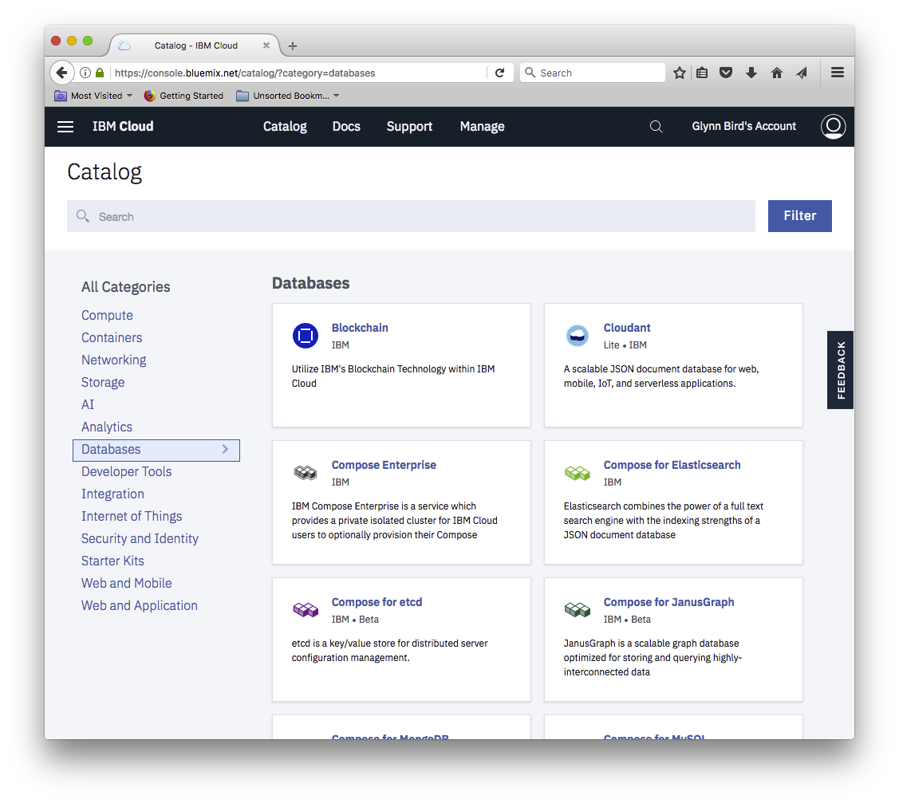

---

copyright:
  years: 2015, 2018
lastupdated: "2018-08-09"

---

{:new_window: target="_blank"}
{:shortdesc: .shortdesc}
{:screen: .screen}
{:codeblock: .codeblock}
{:pre: .pre}
{:tip: .tip}

<!-- Acrolinx: 2018-05-07 -->

# Migrating to {{site.data.keyword.cloudant_short_notm}} on {{site.data.keyword.cloud_notm}}
 
[{{site.data.keyword.cloudantfull}}](https://www.ibm.com/cloud/cloudant)'s database-as-a-service offering on [{{site.data.keyword.cloud}}](https://www.ibm.com/cloud/) is a JSON document store that runs on multi-tenant clusters. The service is available with a choice of geographical locations with predictable costs, scalability, and a service level agreement (SLA).

This document describes how to migrate to an {{site.data.keyword.cloudant_short_notm}} Lite or Standard plan instance on {{site.data.keyword.cloud_notm}} from one of the following plans:

Plan | Description
-----|------------
{{site.data.keyword.cloudant_short_notm}} Enterprise | Dedicated, single-tenant clusters
{{site.data.keyword.cloudant_short_notm}} Shared Plan | A legacy pay-as-you-go, multi-tenant {{site.data.keyword.cloudant_short_notm}} service. The `cloudant.com` Shared plan was retired on March 2018. The {{site.data.keyword.cloudant_short_notm}} Shared plan on {{site.data.keyword.cloudant_short_notm}} was deprecated for new signups in October 2016 and is being retired in Q4 2018.
{{site.data.keyword.cloudant_localfull} | The self-hosted, packaged installation of {{site.data.keyword.cloudant_short_notm}}.
Apache CouchDB | The self-hosted, open-source database on which {{site.data.keyword.cloudant_short_notm}} is based.

## What are the benefits of the {{site.data.keyword.cloudant_short_notm}} Lite and Standard plans?

The Standard plan allows you to *reserve throughput capacity* for your database service, that is, to specify how much throughput your application's database is going to need to handle demand. Capacity is measured by using the following metrics:

Metric | Description
-------|------------
Lookups per second | The rate at which simple document fetches are performed, for example, retrieving a document by its `_id`.
Writes per second | The rate at which data is written to the database. A "write" counts as API calls dealing with document creation, update, or deletion.
Queries per second | The rate at which the database is queried, typically by accessing the `_find` endpoint or by using secondary MapReduce indices.
Storage | The amount of disk space occupied by your JSON data, attachments, and secondary indices.

As an example, the Lite plan offers 20 lookups per second, 10 writes per second, 5 queries per second, and 1 GB of storage for free. This plan is ideal when you are "kicking the tires" of the product and during product development. When your application goes into production, you must switch to the Standard plan. The Standard plan's smallest package has 100 lookups per second, 50 writes per second, 5 queries per second, and 20 GB of storage (extra storage charged per GB) for $76.65 per month. 

A slider in the {{site.data.keyword.cloudant_short_notm}} dashboard allows you to reserve a smaller or larger capacity for your {{site.data.keyword.cloudant_short_notm}} service whenever you need it:

The amount that you can change the throughput capacity is limited to a maximum of 10 units per change (notice the "change limit" point on the slider), and maximum of one change per hour. Changes downward are unlimited in magnitude, but still subject to the time limit.
{: tip}

You are billed on the highest capacity that is selected in any given hourly window. Your database throughput can scale up to deal with seasonal demands and scale down again for the quiet times. At all times, your monthly bill is predictable; upgrades are automatic; and your SLA is [99.95%](http://www-03.ibm.com/software/sla/sladb.nsf/sla/bm-6627-03).

If you exceed your quota of lookups/writes/queries in a given second, the {{site.data.keyword.cloudant_short_notm}} cluster responds with an `HTTP 429` response. Your application might retry the request later - our official libraries offer the option of retrying such requests with an exponential back off. 

## Which type of {{site.data.keyword.cloudant_short_notm}} plan do I have?

If you are using {{site.data.keyword.cloudant_short_notm}}, the {{site.data.keyword.cloudant_short_notm}} dashboard shows all your {{site.data.keyword.cloudant_short_notm}} instances along with a Plan column. The Lite, Standard, and Dedicated Hardware plans are called out specifically. Any {{site.data.keyword.cloudant_short_notm}} instance that is lacking a plan name in that column will be using the deprecated Shared plan. In the following example, the 'Cloudant NoSQL DB-ix' and 'Cloudant_NewConsole' instances are on the deprecated Shared plan. 

You can also drill into a specific instance and look at the Plan tab. {{site.data.keyword.cloudant_short_notm}} instances on the deprecated Shared plan do not have a plan that is highlighted. An instance on the {{site.data.keyword.cloudant_short_notm}} Standard plan looks like this example: 

You can also open the {{site.data.keyword.cloudant_short_notm}} dashboard. Click the **Account** tab. A Lite plan looks like the following example:

If you are using a legacy `cloudant.com` account, you can log in to your {{site.data.keyword.cloudant_short_notm}} dashboard and go to the Account tab. A legacy `cloudant.com` Shared plan has a Usage tab with graphs and billing estimates for the current month like the following example. 

A `cloudant.com` Enterprise user on a dedicated cluster does not have the Usage tab in their Account tab. It looks like the following example:

If your Account tab already indicates that you are on the Standard plan, you need not read any further. You are already on a paid SLA-backed {{site.data.keyword.cloudant_short_notm}} service. No further action is required.

## Migrating from {{site.data.keyword.cloudant_short_notm}} Lite > {{site.data.keyword.cloudant_short_notm}} Standard

Migrate from the free Lite plan to the Standard plan by following these steps: 

1.  Select the **Standard** check box in your {{site.data.keyword.cloudant_short_notm}} Service's Plan pane in the {{site.data.keyword.cloudant_short_notm}} dashboard. 
See the following example:

2.  After you click **Upgrade**, you can adjust the Throughput Capacity slider as needed in your {{site.data.keyword.cloudant_short_notm}} dashboard. 
All of your existing data is retained for you. 

Now, you are ready to go!

## Migrating everything else > {{site.data.keyword.cloudant_short_notm}} Lite or Standard plan

Migration from Shared or Enterprise plans to {{site.data.keyword.cloudant_short_notm}} Lite or Standard plans includes the following tasks, which are broken down into seven steps. 

- Create an {{site.data.keyword.cloudant_short_notm}} service on {{site.data.keyword.cloudant_short_notm}}.
- Replicate your data from the old service to the new service.
- Reconfigure your application to use the new service.
- Turn off the old service.

### 1. Sign up for {{site.data.keyword.cloudant_short_notm}}

If you have not signed up already, [sign up for an {{site.data.keyword.cloudant_short_notm}} account](https://www.ibm.com/cloud/). 

### 2. Create an {{site.data.keyword.cloudant_short_notm}} instance

After you log in to your {{site.data.keyword.cloudant_short_notm}} account, add an {{site.data.keyword.cloudant_short_notm}} service to your account. 

You can find {{site.data.keyword.cloudant_short_notm}} in the Databases section of the catalog.

### 3. Find out whether your application is ready for {{site.data.keyword.cloudant_short_notm}}

If you are moving from an {{site.data.keyword.cloudant_short_notm}} Enterprise service, you must revisit your application to make sure it is ready to handle the capacity limits of the Standard plan. For more information, see the [{{site.data.keyword.cloudant_short_notm}} documentation](../offerings/bluemix.html#provisioned-throughput-capacity) about how the {{site.data.keyword.cloudant_short_notm}} API works. Most importantly, you must make surethat your application can handle a `429: too many requests` HTTP response if you exceed your provisioned throughput capacity. 

Retrying requests that get a `429` response is acceptable for occasional traffic spikes that exceed your plan's capacity. If your application traffic is routinely generating `429` responses, there is a good chance that you need to upgrade to a bigger plan.

Additionally, it is worth noting that the maximum individual document size is 1 MB on {{site.data.keyword.cloudant_short_notm}}, and you will receive a `413: request entity too large` message if the limit is exceeded. Review the [{{site.data.keyword.cloudant_short_notm}} documentation](../offerings/bluemix.html#request-and-document-size-limits) about request and document size limits. 

### 4. Migrate data from the old service to the new service 

Set up continuous replications from your existing service to your {{site.data.keyword.cloudant_short_notm}} account. For more information, see the [Replication guide](../guides/replication_guide.html#replication) and [API documentation](../api/replication.html#replication) about how to set up and monitor replication tasks.

Alternatively, check out the [`couchreplicate`](https://www.npmjs.com/package/couchreplicate) tool, which is a command-line utility that helps you coordinate the transfer of data from one {{site.data.keyword.cloudant_short_notm}} account to another. It sets up multiple replication jobs between the source and target accounts, ensuring that only so many replication jobs proceed at one time. If you need to migrate hundreds of databases, then `couchreplicate` can help coordinate the replication jobs.

Ensure that all your data replicates to the new service and that indexes are built.

### 5. Testing

Conduct load and functional testing on your application to ensure that there are no issues before you migrate your production functionality.

### 6. Ready to move to the new instance?

When you are ready to move to the new instance, update your application with the new auto-generated account URL and credentials for the {{site.data.keyword.cloudant_short_notm}} instance. For more information, see the [provisioning tutorial](../tutorials/create_service.html#creating-a-cloudant-instance-on-bluemix) about how to obtain the service credentials for an {{site.data.keyword.cloudant_short_notm}} instance.

### 7. Turn off the old service

 When your application is fully migrated to the {{site.data.keyword.cloudant_short_notm}} instance, contact {{site.data.keyword.cloudant_short_notm}} support and inform them you no longer need your old {{site.data.keyword.cloudant_short_notm}} account. This step ensures that you will not be charged for your old account. 

 Delete all the data from your old instance before you ask {{site.data.keyword.cloudant_short_notm}} support to delete your account. 
 {: tip}

## FAQ - Frequently asked questions

Frequently asked questions (FAQs) are published by the {{site.data.keyword.cloudant_short_notm}} organization to help {{site.data.keyword.IBM_notm}} customers migrate to an {{site.data.keyword.cloudant_short_notm}} Lite or Standard plan instance on {{site.data.keyword.cloud_notm}}.

## Can I back up my data before doing anything?

{{site.data.keyword.cloudant_short_notm}} recommends that you use the [couchbackup](../guides/backup-cookbook.html#cloudant-nosql-db-backup-and-recovery) utility to export data to disk. [{{site.data.keyword.cloudant_short_notm}} Object Storage](https://www.ibm.com/cloud/object-storage) is an inexpensive, scalable solution for storing the exported files. 

## Can I keep my `username.cloudant.com` domain and redirect it to the new service on {{site.data.keyword.cloudant_short_notm}}?

No, it is not possible to keep your domain. You must plan to update your applications to use the new account URL and credentials that are generated for the {{site.data.keyword.cloudant_short_notm}} instances.

## Who do I contact if I have questions?

Contact [{{site.data.keyword.cloudant_short_notm}} support](mailto:support@cloudant.com) or open a ticket from within the {{site.data.keyword.cloudant_short_notm}} dashboard if you have any questions about the migration. {{site.data.keyword.cloudant_short_notm}} support is happy to provide more details.