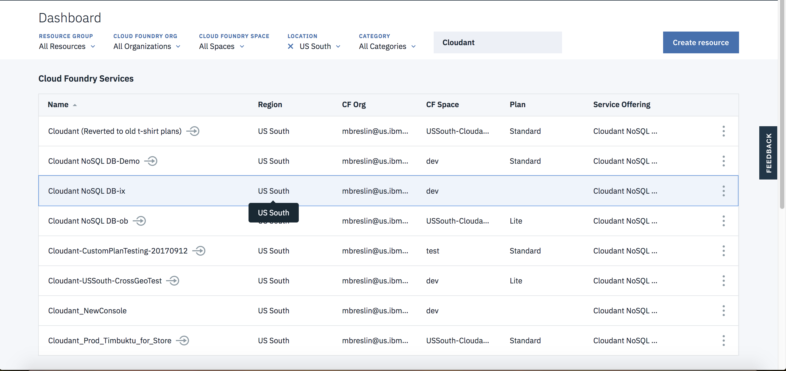
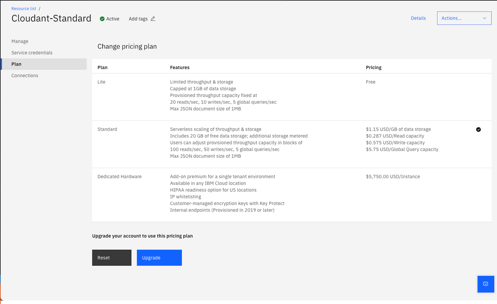
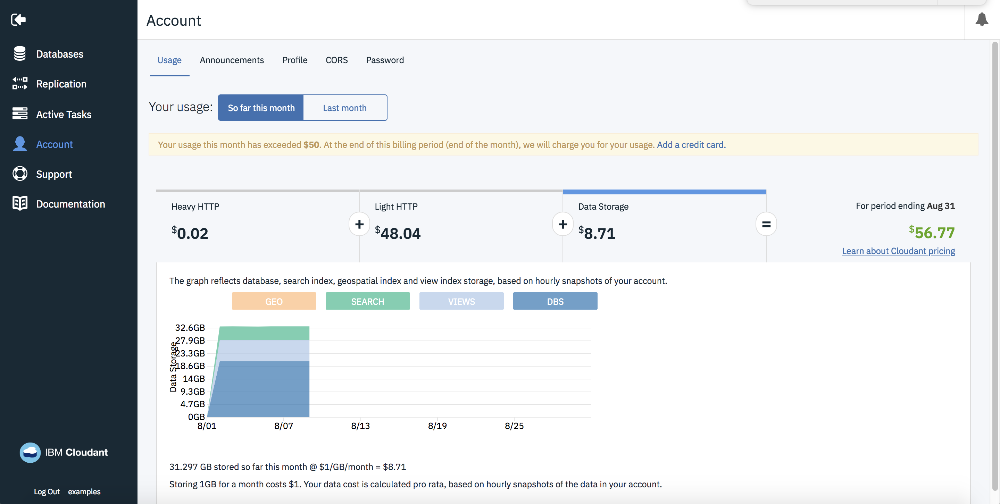
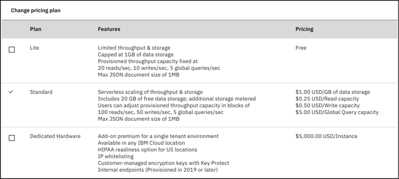

---

copyright:
  years: 2015, 2019
lastupdated: "2019-02-27"

keywords: curl and jq basics, monitor view builds and search indexes, estimate time to complete task, monitor replication, troubleshooting

subcollection: cloudant

---

{:new_window: target="_blank"}
{:shortdesc: .shortdesc}
{:screen: .screen}
{:codeblock: .codeblock}
{:pre: .pre}
{:tip: .tip}
{:note: .note}
{:important: .important}
{:deprecated: .deprecated}

<!-- Acrolinx: 2018-08-14 -->

# Migrating to {{site.data.keyword.cloudant_short_notm}} on {{site.data.keyword.cloud_notm}}
{: #migrating-to-ibm-cloudant-on-ibm-cloud}

[{{site.data.keyword.cloudantfull}}](https://www.ibm.com/cloud/cloudant)'s database-as-a-service offering is a JSON document store that runs on multi-tenant clusters. The service is available with a choice of geographical locations with predictable costs, scalability, and a service level agreement (SLA).

This document describes how to migrate to an {{site.data.keyword.cloudant_short_notm}} Lite or Standard plan instance on {{site.data.keyword.cloud_notm}} from one of the following plans:

Plan | Description
-----|------------
{{site.data.keyword.cloudant_short_notm}} Enterprise | Dedicated, single-tenant clusters
{{site.data.keyword.cloudant_short_notm}} Shared Plan | A legacy pay-as-you-go, multi-tenant {{site.data.keyword.cloudant_short_notm}} service. The `cloudant.com` Shared plan was retired on March 2018. The {{site.data.keyword.cloudant_short_notm}} Shared plan was deprecated for new signups in October 2016 and is being retired in Q4 2018.
{{site.data.keyword.cloudant_localfull}} | The self-hosted, packaged installation of {{site.data.keyword.cloudant_short_notm}}.
Apache CouchDB | The self-hosted, open-source database on which {{site.data.keyword.cloudant_short_notm}} is based.

## What are the benefits of the {{site.data.keyword.cloudant_short_notm}} Lite and Standard plans?
{: #what-are-the-benefits-of-the-ibm-cloudant-lite-and-standard-plans-}

The Standard plan allows you to *reserve throughput capacity* for your database service, that is, to specify how much throughput your application's database is going to need to handle demand. The Standard plan also charges for the amount of storage you use. Capacity is measured by using the following metrics:

Metric | Description
-------|------------
Reads per second | The rate at which simple document fetches are performed, for example, retrieving a document by its `_id`, or queries against a partitioned database using a partition key.
Writes per second | The rate at which data is written to the database. API calls dealing with document creation, update, or deletion count as 'writes'.
Global Queries per second | The rate at which the database is queried using global indexes, typically by accessing the `_find` endpoint or by using secondary MapReduce, search, or geospatial indices.
Storage | The amount of disk space occupied by your JSON data, attachments, and secondary indices.

As an example, the Lite plan offers 20 reads per second, 10 writes per second, 5 global queries per second, and 1 GB of storage for free. This plan is ideal when you are 'kicking the tires' of the product and during product development. When your application goes into QA or production, switch to the Standard plan to scale the instance. The Standard plan's smallest capacity has 100 reads per second, 50 writes per second, 5 global queries per second, and 20 GB of storage (extra storage is charged by GB) for ~USD$76.65 per month. 

By using the slider in the {{site.data.keyword.cloudant_short_notm}} dashboard, you can reserve a smaller or larger capacity for your {{site.data.keyword.cloudant_short_notm}} service whenever you need it:

The amount that you can change the throughput capacity is limited to a maximum of 10 units per change (notice the 'change limit' point on the slider) with a maximum of one change per hour. Changes downward are unlimited in magnitude, but still subject to the time limit.
{: tip}

You are billed on the highest capacity that is selected in any given hourly window. Your database throughput can scale up to deal with seasonal demands and scale down again for the quiet times. At all times, your monthly bill is predictable; upgrades are automatic; and your SLA is [99.95%](http://www-03.ibm.com/software/sla/sladb.nsf/sla/bm?OpenDocument).

If you exceed your quota of reads, writes, and global queries in a given second, the {{site.data.keyword.cloudant_short_notm}} API responds with an `HTTP 429 too many requests` response. Your application might retry the request later - our official libraries offer the option of retrying such requests with an exponential back off. 

## Which type of {{site.data.keyword.cloudant_short_notm}} plan do I have?
{: #which-type-of-ibm-cloudant-plan-do-i-have-}

If you are using {{site.data.keyword.cloudant_short_notm}}, go to the {{site.data.keyword.cloud_notm}} dashboard, and click the **Menu** icon > **Resource List** to see all your service instances. 

You can also drill down into a specific instance and look at the Plan tab for more information. {{site.data.keyword.cloudant_short_notm}} instances on the deprecated Shared plan do not have a plan that is highlighted. An instance on the {{site.data.keyword.cloudant_short_notm}} Standard plan looks like this example: 

You can also open the {{site.data.keyword.cloudant_short_notm}} dashboard, and click the **Account** tab. A Lite plan looks like the following example:

If you are using a legacy `cloudant.com` account, you can log in to your {{site.data.keyword.cloudant_short_notm}} dashboard, and go to the Account tab. A legacy `cloudant.com` Shared plan has a Usage tab with graphs and billing estimates for the current month, like the following example:

A `cloudant.com` Enterprise user on a dedicated cluster does not have the Usage tab in their Account tab. It looks like the following example:

If your Account tab already indicates that you are on the Standard plan, you do not need to read any further. You are already on a paid SLA-backed {{site.data.keyword.cloudant_short_notm}} service. No further action is required.

## Migrating from {{site.data.keyword.cloudant_short_notm}} Lite to {{site.data.keyword.cloudant_short_notm}} Standard
{: #migrating-from-ibm-cloudant-lite-to-ibm-cloudant-standard}

Migrate from the free Lite plan to the Standard plan by following these steps: 

1.  Go to the {{site.data.keyword.cloud_notm}} dashboard.
2.  Go to the **Menu** icon > **Resource List** to see all your service instances. 
3.  Select the {{site.data.keyword.cloudant_short_notm}} instance you want to migrate. 
4.  Select the **Plan** tab on the left navigation. 
5.  From the list of pricing plans, select the **Standard** check box. 

6.  Click **Upgrade** at the bottom of the page.
All of your existing data is retained for you.

Adjust your capacity by using the Throughput Capacity slider to increase or decrease capacity as needed.
{: tip} 
 
Now, you are ready to go!

## Migrating everything else to {{site.data.keyword.cloudant_short_notm}} Lite or Standard plan
{: #migrating-everything-else-to-ibm-cloudant-lite-or-standard-plan}

Migration from the Shared or Enterprise plans to {{site.data.keyword.cloudant_short_notm}} Lite or Standard plans includes these tasks, which are described in the following steps. 

You cannot directly change a Shared plan instance to a Lite or Standard plan instance. Migration requires that you create a new Lite or Standard plan instance and replicate the data over from the Shared plan instance. 
{: tip}

### Step 1: Sign up for {{site.data.keyword.cloud_notm}}
{: #step-1-sign-up-for-ibm-cloud}

If you have not signed up already, [sign up for an {{site.data.keyword.cloud_notm}} account](https://www.ibm.com/cloud/). 

### Step 2: Create an {{site.data.keyword.cloudant_short_notm}} instance
{: #step-2-create-an-ibm-cloudant-instance}

After you log in to your {{site.data.keyword.cloud_notm}} account, add an {{site.data.keyword.cloudant_short_notm}} service. Click the `Create resource ` button on the dashboard and then click `Databases` and `Cloudant`. For more information, see [how to create an {{site.data.keyword.cloudant_short_notm}} instance on {{site.data.keyword.cloud_notm}}](/docs/services/Cloudant/tutorials/create_service.html#creating-an-ibm-cloudant-instance-on-ibm-cloud). 

### Step 3: Find out whether your application is ready for {{site.data.keyword.cloudant_short_notm}}
{: #step-3-find-out-whether-your-application-is-ready-for-ibm-cloudant}

If you are moving from an {{site.data.keyword.cloudant_short_notm}} Enterprise service or an {{site.data.keyword.cloudant_short_notm}} Shared plan, you must revisit your application’s usage of {{site.data.keyword.cloudant_short_notm}} to make sure it is ready to handle the capacity limits of the Standard plan. For more information, see [how the {{site.data.keyword.cloudant_short_notm}} API works](/docs/services/Cloudant/offerings/bluemix.html#provisioned-throughput-capacity). Most importantly, you must make sure that your application can handle a `429: too many requests` HTTP response if you exceed your provisioned throughput capacity. 

Retrying requests that get a `429` response is acceptable for occasional traffic spikes that exceed your plan's capacity. If your application traffic is routinely generating `429` responses, there is a good chance that you need to upgrade to a bigger plan.

Additionally, it is worth noting that the maximum individual document size is 1 MB on {{site.data.keyword.cloudant_short_notm}}, and you will receive a `413: request entity too large` message if the limit is exceeded. For more information, see [request and document size limits](/docs/services/Cloudant/offerings/bluemix.html#request-and-document-size-limits). 

### Step 4: Migrate data from the old service to the new service 
{: #step-4-migrate-data-from-the-old-service-to-the-new-service}

Set up continuous replications from your existing service to your {{site.data.keyword.cloudant_short_notm}} account. For more information, see the [Replication guide](/docs/services/Cloudant/guides/replication_guide.html#replication) and [API documentation](/docs/services/Cloudant/basics/index.html##ibm-cloudant-basics) about how to set up and monitor replication tasks.

Alternatively, check out the [`couchreplicate`](https://www.npmjs.com/package/couchreplicate) tool, which is a command-line utility that helps you coordinate the transfer of data from one {{site.data.keyword.cloudant_short_notm}} account to another. It sets up multiple replication jobs between the source and target accounts, ensuring that only so many replication jobs proceed at one time. If you need to migrate hundreds of databases, then `couchreplicate` can help coordinate the replication jobs.

Verify that all your data replicates to the new service and that indexes are built.

### Step 5: Testing
{: #step-5-testing}

Conduct load and functional testing on your application to ensure that there are no issues before you migrate to production.

### Step 6: Ready to move to the new instance?
{: #step-6-ready-to-move-to-the-new-instance-}

When you are ready to move to the new instance, update your application to use  the new account URL and credentials for the {{site.data.keyword.cloudant_short_notm}} instance. For more information, see the [provisioning tutorial](/docs/services/Cloudant/tutorials/create_service.html#creating-an-ibm-cloudant-instance-on-ibm-cloud) about how to obtain the service credentials for an {{site.data.keyword.cloudant_short_notm}} instance.

### Step 7: Turn off the old service
{: #step-7-turn-off-the-old-service}

 When your application is fully migrated to the {{site.data.keyword.cloudant_short_notm}} Lite or Standard instance, you can delete the old {{site.data.keyword.cloudant_short_notm}} Shared plan instance from your {{site.data.keyword.cloud_notm}} console to ensure you are no longer charged for the service.

## FAQ - Frequently asked questions
{: #faq-frequently-asked-questions}

Frequently asked questions (FAQs) are published by the {{site.data.keyword.cloudant_short_notm}} organization to help {{site.data.keyword.IBM_notm}} customers migrate to an {{site.data.keyword.cloudant_short_notm}} Lite or Standard plan instance on {{site.data.keyword.cloud_notm}}.

## Can I back up my data before doing anything?
{: #can-i-back-up-my-data-before-doing-anything-}

{{site.data.keyword.cloudant_short_notm}} recommends that you use the [couchbackup](/docs/services/Cloudant/guides/backup-cookbook.html#cloudant-nosql-db-backup-and-recovery) utility to export data to disk. [{{site.data.keyword.cloud_notm}} Object Storage](https://www.ibm.com/cloud/object-storage) is an inexpensive, scalable solution for storing the exported files. 

## Can I keep my `username.cloudant.com` domain and redirect it to the new service on {{site.data.keyword.cloudant_short_notm}}?
{: #can-i-keep-my-username-cloudant-com-domain-and-redirect-it-to-the-new-service-on-ibm-cloudant-}

No, it is not possible to keep your domain. You must plan to update your applications to use the new account URL and credentials that are generated for the {{site.data.keyword.cloudant_short_notm}} instances.

## Who do I contact if I have questions?
{: #who-do-i-contact-if-i-have-questions-}

Contact [{{site.data.keyword.cloudant_short_notm}} support](mailto:support@cloudant.com) or open a ticket from within the {{site.data.keyword.cloudant_short_notm}} dashboard if you have any questions about migration. {{site.data.keyword.cloudant_short_notm}} support is happy to provide more details.
