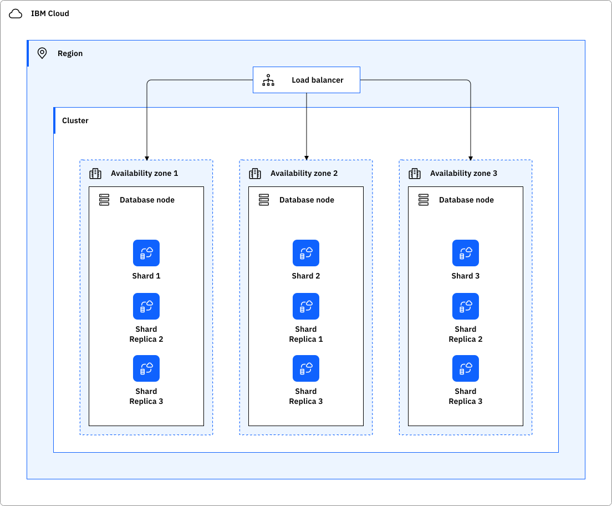
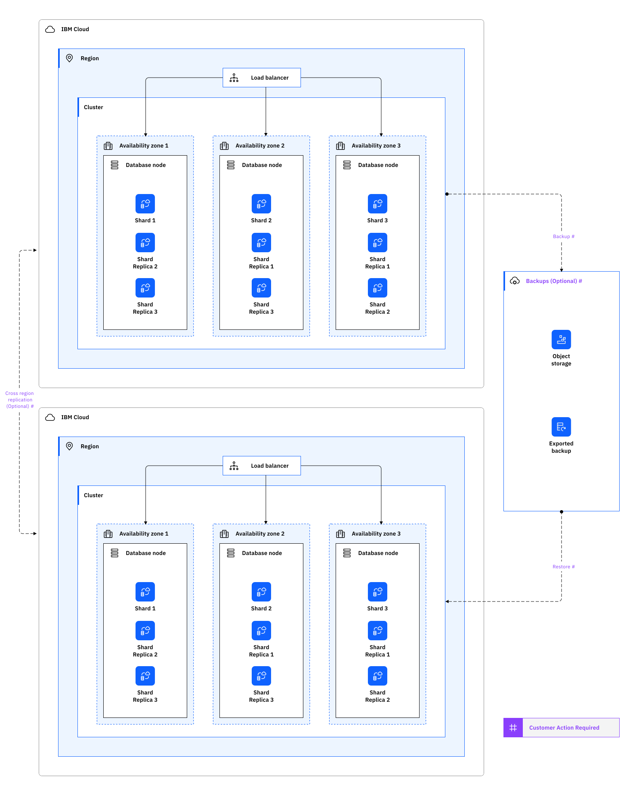

---

copyright:
  years: 2026
lastupdated: "2026-01-21"

keywords: HA for Cloudant, DR for Cloudant, Cloudant recovery time objective, Cloudant recovery point objective

subcollection: content-kit

---

{{site.data.keyword.attribute-definition-list}}

# Understanding high availability and disaster recovery for {{site.data.keyword.cloudant_short_notm}}
{: #service-name-ha-dr}

{{site.data.keyword.cloudantfull}} is designed for applications requiring very high availability. Customer data remains readable and writable during zone outages, with no need for customer action, such as failover.
{: shortdesc}

[High availability](#x2284708){: term} (HA) is the ability for a service to remain operational and accessible in the presence of unexpected failures. [Disaster recovery](#x2113280){: term} is the process of recovering the service instance to a working state.

{{site.data.keyword.cloudant_short_notm}} meets the [Service Level Objectives (SLO)](/docs/resiliency?topic=resiliency-slo) with the Standard plan.

For more information about the available region and data center locations, see [Service and infrastructure availability by location](/docs/overview?topic=overview-services_region).

## High availability architecture
{: #ha-architecture}

{: caption="Cloudant architecture" caption-side="bottom"}

{{site.data.keyword.cloudant_short_notm}} provides high-availability by replicating all data across three zones in a region. By doing this, {{site.data.keyword.cloudant_short_notm}} keeps your data fully available during infrastructure maintenance, database upgrades, machine failures and zone-level outages.

### High availability features
{: #ha-features}

{{site.data.keyword.cloudant_short_notm}} supports the following high availability features:

| Feature | Description | Consideration |
| -------------- | -------------- | -------------- |
| Resilient to complete zone outages | Standard on all instances and data remains fully available during a zone or machine failure. |  |
| Shard replication | Data is replicated to three zones in a region, ensuring data availability.  |  |
| Cross-region high availability | {{site.data.keyword.cloudant_short_notm}} enables cross-region data redundancy and failover. | Optional. Customers must configure cross-region high availability when needed. |
{: caption="HA features for {{site.data.keyword.cloudant_short_notm}}" caption-side="bottom"}

## Disaster recovery architecture
{: #disaster-recovery-intro}

{: caption="Cloudant recovery architecture" caption-side="bottom"}

Although data is stored redundantly within an {{site.data.keyword.cloudant_short_notm}} cluster, it's important to consider extra backup measures. {{site.data.keyword.cloudant_short_notm}} provides a supported tool for snapshot backup and restore. The tool is called *CouchBackup*, and is open source. For more information, see [Introducing CouchBackup](/docs/Cloudant?topic=Cloudant-ibm-cloudant-backup-and-recovery#introducing-couchbackup).

To implement resilience to full region outages, you can create replication to another {{site.data.keyword.cloudant_short_notm}} instance in a different region with bidirectional continuous replication. This supports either active-passive or active-active configuration. For more information, see [replication setup for cross-region disaster recovery](/docs/Cloudant?topic=Cloudant-configuring-ibm-cloudant-for-cross-region-disaster-recovery).

### Disaster recovery features
{: #dr-features}

{{site.data.keyword.cloudant_short_notm}} supports the following disaster recovery features:

| Feature | Description | Consideration |
| -------------- | -------------- | -------------- |
| Backup and restore | Restore a database from previously created backup; see {{site.data.keyword.cloudant_short_notm}} [backup and recovery](/docs/Cloudant?topic=Cloudant-ibm-cloudant-backup-and-recovery). | Open source tool. Customer configured. |
| Cross-region failover | {{site.data.keyword.cloudant_short_notm}} [replication](https://cloud.ibm.com/docs/Cloudant?topic=Cloudant-configuring-ibm-cloudant-for-cross-region-disaster-recovery) helps you build a complete disaster recovery capability. |  Customer configured.  |
| Live data synchronization | {{site.data.keyword.cloudant_short_notm}} bidirectional active-active replication feature helps you build a complete disaster recovery capability. |  Customer configured. |
{: caption="DR features for {{site.data.keyword.cloudant_short_notm}}" caption-side="bottom"}

### Planning for DR
{: #features-for-disaster-recovery}

The DR steps must be practiced regularly. As you build your plan, consider the following failure scenarios and resolutions.

| Failure | Resolution |
| -------------- | -------------- |
| Hardware failure (single point) | {{site.data.keyword.cloudant_short_notm}} is resilient to single point of hardware failure; data remains online. No customer configuration required. |
| Zone failure | {{site.data.keyword.cloudant_short_notm}} is resilient to zone failures; data remains fully available for read and write during zone failures. |
| Data corruption |  {{site.data.keyword.cloudant_short_notm}} checks data checksums for when data is read. In the case of corruption, the customer needs to restore from backup. Use the restored database in production. |
| Regional failure | Restore backup to new region. Use the restored database in production.   Cross-region replication: failover to replicated instance and continue reads/writes as normal. |
{: caption="DR scenarios for {{site.data.keyword.cloudant_short_notm}}" caption-side="bottom"}

## Your responsibilities for HA and DR
{: #feature-responsibilities}

It is your responsibility to continuously test your plan for HA and DR.

Interruptions in network connectivity and short periods of unavailability of a service might occur. It is your responsibility to make sure that application source code includes [client availability retry logic](/docs/resiliency?topic=resiliency-high-availability-design#client-retry-logic-for-ha) to maintain high availability of the application.
{: note}

For more information about responsibility ownership between you and {{site.data.keyword.cloud_notm}} for {{site.data.keyword.cloudant_short_notm}}, see [Understanding your responsibilities when you use {{site.data.keyword.cloudant_short_notm}}](/docs/Cloudant?topic=Cloudant-cloudant-responsibilities).

## Stay informed: IBM notifications
{: #ibm-notifications}

Updates affecting customer workloads are communicated through IBM Cloud notification. Changes that impact customer workloads are detailed in {{site.data.keyword.cloud_notm}} notifications. For more information about planned maintenance, announcements, and release notes that impact this service, see [Monitoring notifications and status](/docs/account?topic=account-viewing-cloud-status).

## How {{site.data.keyword.IBM_notm}} maintains services
{: #ibm-service-maintenance}

Stay updated with [Service changes and deprecations](https://cloud.ibm.com/docs/Cloudant?topic=Cloudant-deprecations-for-ibm-cloudant) and [Release notes](https://cloud.ibm.com/docs/Cloudant?topic=Cloudant-classic-release-notes) of {{site.data.keyword.cloudant_short_notm}}.
