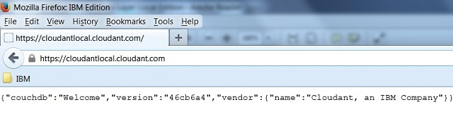
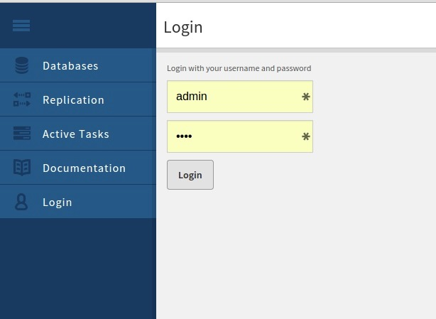

---

copyright:
  years: 2015, 2021
lastupdated: "2021-04-20"

keywords: ssl, rsa private key, csr, self-signed certificate, generate, combine rsa certificate and key, security, haproxy for ssl connections, validate ssl connection, connect load balancer, connect database nodes, generate certificates, ldap authenticate, logging, remote logging, failover load balancers, ioq, firewall ports

subcollection: Cloudant

---

{:new_window: target="_blank"}
{:shortdesc: .shortdesc}
{:screen: .screen}
{:codeblock: .codeblock}
{:pre: .pre}
{:tip: .tip}
{:note: .note}
{:important: .important}
{:deprecated: .deprecated}
{:external: target="_blank" .external}

<!-- Acrolinx: 2021-04-19 -->

# Configure 
{: #configure-ibm-cloudant-data-layer-local-edition}

{{site.data.keyword.IBM}} Cloudant&reg; Data Layer Local Edition ({{site.data.keyword.cloudant_local_notm}}) reached end of market on 31 December 2019. {{site.data.keyword.cloudant_local_notm}} reaches [end of support on 30 April 2021](https://www-01.ibm.com/common/ssi/ShowDoc.wss?docURL=/common/ssi/rep_ca/5/897/ENUS920-045/index.html&request_locale=en){: new_window}. Instead, {{site.data.keyword.IBM_notm}} is offering enterprise-class support for open source Apache CouchDB for on-site, hybrid, or multi-cloud use cases to pair with the fully managed {{site.data.keyword.cloudant_short_notm}} service. {{site.data.keyword.cloudant_local_notm}} users can migrate to open source Apache CouchDB. For more information, see the [Apache CouchDB documentation](/docs/services/Cloudant?topic=Cloudant-apache-couchdb-overview) for more details.
{: deprecated}

To customize {{site.data.keyword.IBM}} Cloudant&reg; Data Layer Local Edition ({{site.data.keyword.cloudant_local_notm}}), you often need to configure
security, logging, and other functions that help you manage your
systems after you complete the installation or upgrade process.
{: shortdesc}

## Configuring SSL
{: #configuring-ssl-ibm-cloudant-local}

Use these instructions to configure Secure Sockets Layer (SSL)
for your {{site.data.keyword.cloudant_local_notm}} installation, especially if you access
the {{site.data.keyword.cloudant_short_notm}} database across an untrusted network. If your
network is trusted, configuring SSL/HTTPS is optional. You can
use HTTP requests (port 80) instead.

SSL is a standard security technology for establishing an
encrypted link between a server and a client, such as between a
website and a browser. SSL is used to ensure that sensitive
information is transmitted securely over the internet. SSL uses a
cryptographic system that uses two keys to encrypt data: a public
key that is available to anyone, and a secret key that is known
only to the recipient of the message.

### Configure SSL on your load balancers
{: #configure-ssl-on-your-load-balancers}

Configure SSL for {{site.data.keyword.cloudant_local_notm}} on each load balancer in your
cluster. If you use SSL, and you use two load balancers (a primary and failover load balancer), you must configure SSL on
both load balancers.

#### Generating an RSA private key
{: #generating-an-rsa-private-key}

RSA is a public-key cryptosystem and is widely used for secure
data transmission. RSA involves a public key and a private key.
The public key is available to anyone and is used to encrypt
messages, while the private key is required to decrypt the
messages. RSA also signs a Certificate Signing Request or CSR.

This example shows how this command is used to generate an RSA
key.

``` sh
[root@lb1centos haproxy]# openssl genrsa -out rsa.key 1024
Generating RSA private key, 1024 bit long modulus
.++++++
...................++++++
e is 65537 (0x10001)
[root@lb1centos haproxy]#
```
{: codeblock}

1.  Generate an RSA private key in the `/etc/haproxy` directory by
    using the openssl toolkit.

    The key is 1024 bit and is stored in PEM format, which is
    readable as ASCII text.
    
    PEM is a container format that can include just the public certificate, or it can include an entire certificate chain, including a public key, private key, and root certificates. PEM was originally developed to secure email, and the PEM acronym was derived from the phrase Privacy Enhanced email.
    {: note}
    
2.  Generate an RSA key by using the openssl `genrsa` command.

    ``` sh
    openssl genrsa -out rsa.key 1024
    ```
    {: codeblock}

    This example shows how this command is used to generate an RSA
    key.

    ``` sh
    [root@lb1centos haproxy]# openssl genrsa -out rsa.key 1024
    Generating RSA private key, 1024 bit long modulus
    .++++++
    ...................++++++
    e is 65537 (0x10001)
    [root@lb1centos haproxy]#
    ```
    {: codeblock}

#### Generating a CSR
{: #generating-a-csr}

Generate a certificate signing request (CSR) by using the RSA
private key. In a production environment, the CSR is sent to a
certificate authority (CA) who supplies a signed certificate to
reassure users that the certificate is valid. In the {{site.data.keyword.cloudant_local_notm}} environment, the CSR is self-signed because the certificate
is for internal use only. The **openssl** toolkit is used to generate
the CSR.

1.  Generate a CSR by using the `openssl req` command.

    ``` sh
    openssl req -new -key rsa.key -out rsa.csr
    ```
    {: codeblock}

    During the CSR generation process, you are prompted for
    several pieces of information, such as your company name,
    email address, and a "challenge password." When prompted for a
    Common Name, enter the domain name for the system where you
    want to install the certificate, for example a load balancer.

2.  Reply to the prompts with information for your environment.

    The following example shows how this command generates a CSR.

    ``` sh
    [root@lb1centos haproxy]# openssl req -new -key rsa.key -out rsa.csr
    You are about to be asked to enter information that will be incorporated into your certificate request.
    Enter a Distinguished Name or a DN.
    There are a number of fields, but you can leave some blank.
    Some fields have a default value, if you enter '.', the field remains blank.
    -----
    Country Name (2 letter code) [XX]:US
    State or Province Name (full name) []:New Jersey
    Locality Name (eg, City) [Default City]:Princeton
    Organization Name (eg, company) [Default Company Ltd]:IBM
    Organizational Unit Name (eg, section) []:Cloudant
    Common Name (for example, your name or the host name for your server) []:lb1centos.princeton.usnj.ibm.com
    Email Address []:smith at us dot ibm dot com
    
    Enter the following 'extra' attributes to be sent with your certificate request.
    A challenge password []:
    An optional company name []:
    [root@lb1centos haproxy]#
    ```
    {: codeblock}

#### Generating a self-signed certificate
{: #generating-a-self-signed-certificate}

If required, create a self-signed certificate for your internal
use.

When a self-signed certificate is used for a website, an error
message is displayed in the browser when a user attempts to
connect to the site. The message warns the user that the
certificate for the specified website is signed by an unknown and
untrusted certificate authority. In a production environment, a
CSR is sent to a certificate authority (CA) for certification.
After the CA confirms that the site is valid, the CA returns a
signed certificate to reassure users that the certificate for the
site is valid.

Use this command to generate a self-signed certificate that is
valid for 365 days, and that is suitable for testing.

``` sh
openssl x509 -req -days 365 -in rsa.csr -signkey rsa.key -out rsa.crt
```
{: codeblock}

This example shows how this command is used to generate a
self-signed certificate.

``` sh
[root@lb1centos haproxy]# openssl x509 -req -days 365 -in rsa.csr -signkey rsa.key -out rsa.crt
Signature ok
subject=/C=US/ST=New Jersey/L=Princeton/O=IBM/OU=Cloudant/CN=lb1centos.princeton.usnj.ibm.com/
emailAddress=silvagni at us dot ibm dot com
Getting Private key
[root@lb1centos haproxy]# 
```
{: codeblock}

#### Combining the RSA certificate and key
{: #combining-the-rsa-certificate-and-key}

The RSA certificate and key must be combined into a single file
for use in HAProxy 1.5 and higher.

Combine the RSA certificate (`/etc/haproxy/rsa.crt`) and RSA key
(`/etc/haproxy/rsa.key`) into a new single file
(`/etc/haproxy/certificate.pem`) for use in HAProxy. Put the
certificate in the `certificate.pem` file first, with the key as
the final portion of the file.

Use this command to combine the files in the correct order.

``` sh
cat /etc/haproxy/rsa.crt /etc/haproxy/rsa.key > /etc/haproxy/certificate.pem
```
{: codeblock}

#### Securing the RSA key and certificate
{: #securing-the-rsa-key-and-certificate}

The RSA key and certificate must be protected by using
appropriate access permissions.

Ensure that the RSA key and certificate are owned by `root`, belong
to group `root`, and have permissions set to `0400`.

``` sh
chown root:root /etc/haproxy/rsa.* /etc/haproxy/certificate.pem
chmod 0400 /etc/haproxy/rsa.* /etc/haproxy/certificate.pem
```
{: codeblock}

This example shows how these commands are used to ensure that the
RSA key and certificate are owned by `root`, group `root`, and
permissions are set to `0400`.

``` sh
[root@lb1centos haproxy]# chown root:root /etc/haproxy/rsa.* /etc/haproxy/certificate.pem
[root@lb1centos haproxy]# chmod 0400 /etc/haproxy/rsa.* /etc/haproxy/certificate.pem
[root@lb1centos haproxy]# ls -la
total 44
drwxr-xr-x.  2 root root 4096 Sep 29 15:35 .
drwxr-xr-x. 89 root root 4096 Sep 29 15:35 ..
-r--------.  1 root root 1884 Sep 29 15:26 certificate.pem
-rw-r--r--.  1 root root 8552 Sep 25 02:23 haproxy.cfg
-rwxrwx---.  1 root root 7471 Sep 19 01:35 haproxy-cloudant.cfg
-r--------.  1 root root  997 Sep 29 15:25 rsa.crt
-r--------.  1 root root  781 Sep 29 15:24 rsa.csr
-r--------.  1 root root  887 Sep 29 15:23 rsa.key
[root@lb1centos haproxy]# 
```
{: codeblock}

#### Configuring HAProxy for SSL connections
{: #configuring-haproxy-for-ssl-connections}

Configure HAProxy for SSL connections. The RSA key and
certificate must be protected by using appropriate access
permissions. HAProxy 1.5 includes native support for SSL
connections.

The `haproxy.cfg` file that is delivered with {{site.data.keyword.cloudant_local_notm}}
includes commented-out configuration lines. You must uncomment
those lines to enable SSL.

After you modify the `haproxy.cfg` file, you must restart HAProxy.

1.  As root, open the `haproxy.cfg` file on each load balancer.

    ``` sh
    /etc/haproxy/haproxy.cfg
    ```
    {: codeblock}

2. In the `haproxy.cfg` file, uncomment the two lines in the
   example by removing the `#` at the start of the line.

    ``` sh
    #bind :443 ssl crt /etc/haproxy/certificate.pem
    #redirect scheme https if dashboard_assets !{ ssl_fc }
    ```
    {: codeblock}

#### Validating your SSL connection
{: #validating-your-ssl-connection}

Check that your SSL connection is working correctly.

1.  Connect to a load balancer with a browser by using the https
    protocol.

    ``` sh
    https://lb1centos.princeton.usnj.ibm.com/dashboard.html
    ```
    {: codeblock}

2.  Enter your database administration credentials at the
    {{site.data.keyword.cloudant_local_notm}} Dashboard.

    If your SSL connection is working correctly, the {{site.data.keyword.cloudant_local_notm}} dashboard opens in your browser.
    
    If you are using self-signed security certificates, your browser warns you that the SSL certificates are not from a recognized certificate authority.
    {: note}

#### Confirming your untrusted certificate
{: #confirming-your-untrusted-certificate}

If you use a certificate that was validated by a certificate
authority (CA), this step is not needed.


1. If you use a self-signed certificate, confirm your certificate
    when the following untrusted connection message opens. 
 
   {: caption="Figure 1. Example of an untrusted connection message" caption-side="bottom"}

2. Click `Add Exception` on the `This Connection is Untrusted` message.
    
   To add a security exception, perform the follow steps when the Add Security Exception window opens.
   
   a. Select the `Permanently store this exception` check box so the exception is stored for future use.

   b. Click `Confirm Security Exception` to confirm the exception. 
 
   {: caption="Figure 2. Untrusted site exception" caption-side="bottom"}

#### Viewing the load balancer
{: #viewing-the-load-balancer}

Check that you can view the load balancer correctly.

If you are using a properly signed certificate, or you accepted
an "untrusted" certificate, one of the following screens open.

*   If you specified `https://cloudantlocal.cloudant.com` or a
    similar URL, a load balancer welcome message opens, similar to
    the example. 
 
    {: caption="Figure 3. Example of load balancer welcome message" caption-side="bottom"}

*   If you specified a URL that includes the Dashboard component,
    `/dashboard.html`, the {{site.data.keyword.cloudant_short_notm}} Dashboard (or the Login screen
    for the dashboard) opens. This example shows the
    user-specified `dashboard.html` as part of the URL. 

    {: caption="Figure 4. Example of the {{site.data.keyword.cloudant_short_notm}} Dashboard Login screen" caption-side="bottom"}

#### Connecting load balancer and database nodes by using SSL
{: #connecting-lb-and-db-nodes-by-using-ssl-config-ssl-lb}

If you use SSL for communication between your {{site.data.keyword.cloudant_local_notm}}
load balancer and database nodes, enable the secure communication
on each load balancer node by making these load balancer
configuration changes.

1. Copy the `ca.pem` file to each load balancer node.

   For more information about creating the `ca.pem` file, see
    [Generating the certificate authority file for a database node](#generating-the-certificate-authority-file-for-a-database-node).
    
2. Update the `haproxy.cfg` file.

   a. Find the section label, and specify the appropriate host names and IP addresses.

      Verify that all the database nodes are included in the list.
   
   b. For each server, change the port from `5984` to 6984.
   
   c. Add the following text to the end of each 'server' line.   Enter the path for your `ca.pem` file as shown in the example. 

   ```sh
   ssl verify required ca-file /path/to/ca.pem
   ```
   {: codeblock}

3. Save and close the `haproxy.cfg` file.
4. Restart `haproxy`.


### Configure SSL on your database nodes
{: #configure-ssl-on-your-database-nodes}

Configure Secure Sockets Layer (SSL) for {{site.data.keyword.cloudant_local_notm}} on each
database node in your cluster. This method enables SSL
communication between load balancers and database nodes.

#### Generating the certificate authority file for a database node
{: #generating-the-certificate-authority-file-for-a-database-node}

If you are using self-signed certificates, generate a certificate
authority file for the database nodes.

If you are using certificates that are provided by a third party,
you can proceed directly to [Copying the SSL security files to the database node](#copying-the-ssl-security-files-to-the-database-node).

To use self-signed certificates on database nodes, you must
generate a certificate authority (CA) file. Only one CA file is
required. The same file is used by all the database nodes and all
the load balancer nodes within your cluster. The file can be
generated on any server.

To generate a self-signed CA file, use the following commands:

``` sh
openssl genrsa -out privkey.key
openssl req -new -x509 -key privkey.key -out ca.pem
```
{: codeblock}

The resulting `ca.pem` file is used on each database node and each
load balancer node.

To use the `ca.pe` file on a load balancer node, follow the instructions in [Connecting load balancer and database nodes by using SSL](#connecting-lb-and-db-nodes-by-using-ssl-config-ssl-db).
{: note}

#### Generating the server certificate file for a database node
{: #generating-the-server-certificate-file-for-a-database-node}

If you are using self-signed certificates, generate a unique
server certificate file for each database node.

If you are using certificates that are provided by a third party,
you can proceed directly to [Copying the SSL security files to the
database node](#copying-the-ssl-security-files-to-the-database-node).

Each database node requires its own server certificate file to
identify itself. A unique name is required for each server
certificate. In the instructions that follow, replace each
instance of the phrase `serverX` with whatever name you choose. You
can use any name that is unique to your cluster.

To generate server certificate file, use the following commands.

``` sh
openssl genrsa -out serverX.key 
openssl req -new -key serverX.key -out serverX.req
openssl x509 -req -in serverX.req -CA ca.pem -CAkey privkey.key -set_serial 01 -out serverX.pem
```
{: codeblock}

The `ca.pem` file was generated while [Generating the certificate
authority file for a database node](#generating-the-certificate-authority-file-for-a-database-node).

The `serverX.key` file is the "secret" necessary to unlock self-generated certificates. Be careful to protect this file with appropriate access controls and security permissions.
{: note}

#### Copying the SSL security files to the database node
{: #copying-the-ssl-security-files-to-the-database-node}

To enable SSL security, the prerequisite security certificate
files must be available on the database node.

Copy the following files to any convenient location within the
file system of the respective database node.

``` sh
ca.pem
serverX.key
serverX.pem
```
{: codeblock}

The `serverX.key` file is the "secret" necessary to unlock self-generated certificates. Be careful to protect this file with appropriate access controls and security permissions.
{: note}

The `ca.pem` file is the certificate authority (CA) file, generated in the [Generating the certificate authority file for a database node](#generating-the-certificate-authority-file-for-a-database-node) step, or provided by a third party. The same `ca.pem` file is used by all the database nodes.

The `serverX.key` and `serverX.pem` files are unique and specific to each database node. The files were generated while
[Generating the server certificate file for a database node](#generating-the-server-certificate-file-for-a-database-node), or provided by a third party.

#### Enabling SSL security on the database node
{: #enabling-ssl-security-on-the-database-node}

Configure the database node to use the SSL security files.

1. Update the `/opt/cloudant/etc/local.ini` file on each database node.

   a. Enable the `https` daemon by modifying the `httpsd` line in the `[daemons]` section.

   `[daemons]`

   ```sh
   httpsd = {chttpd, start_link, [https]}
   ```
   {: codeblock}

   b. Provide links to the `ca.pem`, `serverX.key`, and `serverX.pem` files. 

   ```sh
   [ssl]
   cacert_file = /<filelocation>/ca.pem
   cert_file = /<filelocation>/serverX.pem
   key_file = /<filelocation>/serverX.key
   ```
   {: codeblock}

2. Save and close the `/opt/cloudant/etc/local.ini` file.
3. Restart {{site.data.keyword.cloudant_local_notm}} on the database node.

   For more information about configuring {{site.data.keyword.cloudant_local_notm}} for SSL-based secure connections, see [Secure Socket Level Options](http://docs.couchdb.org/en/latest/config/http.html#secure-socket-level-options){: new_window}{: external}.

#### Connecting load balancer and database nodes by using SSL
{: #connecting-lb-and-db-nodes-by-using-ssl-config-ssl-db}

If you use SSL for communication between your {{site.data.keyword.cloudant_local_notm}}
load balancer and database nodes, enable the secure communication
on each load balancer node by making these load balancer
configuration changes.

1. Copy the `ca.pem` file to each load balancer node.

   For more information about creating the `ca.pem` file, see
    [Generating the certificate authority file for a database node](#generating-the-certificate-authority-file-for-a-database-node).

2. Update the `haproxy.cfg` file.

   a. Find the section label, and specify the appropriate host names and IP addresses.

   b. Verify that all the database nodes are included in the list.

   c. For each server, change the port from `5984` to `6984`.

   d. Add the following text to the end of each 'server' line.
   
   `ssl verify required ca-file /path/to/ca.pem`

3. Save and close the `haproxy.cfg` file.
4. Restart `haproxy`.

## Authenticating with LDAP
{: #authenticating-with-ldap}

Use these instructions to configure Lightweight Directory Access
Protocol (LDAP) authentication and authorization for {{site.data.keyword.cloudant_local_notm}}.

{{site.data.keyword.cloudant_local_notm}} has its own security model with a self-contained
authentication and authorization system. The authentication and
authorization system relies on ini files and user databases to
store user data, including user names (uids), passwords, and user
roles for accessing resources in the database. If your
organization uses an LDAP service for access control, you can
delegate authentication and authorization services to LDAP when
you access an {{site.data.keyword.cloudant_local_notm}} database. Enable LDAP and {{site.data.keyword.cloudant_local_notm}} by using the `ldap_auth` configuration. 

At a high level, when `ldap_auth` is configured, it replaces the default basic and cookie authentication and authorization. It
ignores any administrator users who are configured in the `ini`
files and user databases. Instead, `ldap_auth` validates user
credentials by using the configured LDAP service. After you
authenticate your credentials with the LDAP service, `ldap_auth`
determines the user roles. The user roles determine what the user
is authorized to access, based on the LDAP groups where the user
is a member.

You can use LDAP and the Metrics application together. However, the Metrics application requires that specific authentication credentials and roles exist in the LDAP database so that LDAP and the Metrics application work properly.
{: important}

The Metrics application stores its authentication credentials in
the `metrics.ini` file. The Metrics application's default
authentication credentials include user name admin and password
pass. You must create a user in your LDAP database that has both
`_admin` and `server_admin` roles and whose credentials match the
credentials set in the `metrics.ini` file. For more information, see the [{{site.data.keyword.cloudant_short_notm}} Metrics
application](/docs/Cloudant?topic=Cloudant-diagnose-troubleshoot#ibm-cloudant-metrics-application).

### Configuring LDAP authentication
{: #configuring-ldap-authentication}

You configure LDAP authentication and authorization in the `ini`
configuration file under the `ldap_auth` section.

See the following configuration information example in the
`local.ini` file in `/opt/cloudant/etc`.

```sh
[ldap_auth]
use_ssl = false
servers = 10.35.186.185
searcher_dn = cn=Manager,dc=example,dc=com
searcher_password = secretsanta
group_base_dn = dc=example,dc=com
```
{: codeblock}


1.  (Required) Configure at least one of the available parameters inside the
    `ldap_auth` section of an `ini` configuration file.

2.  Modify the parameters and their associated default values (in
    parentheses) in the following list.

    The default values for parameters marked '&raquo;' are only useful for testing. Change the parameter's value to match your environment.
    {: note}

    -   &raquo; `servers`* (127.0.0.1)

        Supports one or more LDAP servers, which default to a
    single host, but might also be a comma-separated
    list.

        All servers must use the same port, which is a limitation of the underlying `eldap` library.
        {: note}

    -   `port` (389)

        LDAP server port for decrypted communication.

    -   `ssl_port` (636)

        LDAP server port for encrypted communication.

    -   `use_ssl` (true)

        If true, use TLS to encrypt traffic to LDAP servers.

    -   `timeout` (5000)

        Milliseconds to wait for a response from an LDAP
    server before an error occurs.

    -  &raquo; `user_base_dn`* (ou=users,dc=example,dc=com)

        Defines a directory location to use during a search
    for users.

    -   `user_classes` (person)

        Defines which `objectClasses` indicate a particular
    entry as a user during search.

    -   `user_uid_attribute` (uid)

        Defines which attribute maps to a user name.

    -   &raquo; `group_base_dn`* (ou=groups,dc=example,dc=com)

        Defines a directory location to use during a search
    for groups.

    -   `group_classes` (posixGroup)

        Defines which `objectClasses` indicate a particular
    entry as a group during search.

    -   `group_member_attribute` (memberUid)

        Defines which group attribute maps to user uid.

    -   `group_role_attribute` (description)

        Defines which group attribute maps to a particular
    role.

    -   &raquo; `searcher_dn`* (uid=ldapsearch,ou=users,dc=example,dc=com)

        Defines the distinguished name (DN) to use while
    `ldap_auth` searches for users and groups.

    -   &raquo; `searcher_password`* (secret)

        Defines the password for the `searcher_dn` parameter.

    -   `user_bind_dns` ([ ])

        Defines one or more base DNs into which the
    authenticating user's user name can be inserted as
    the `user_uid_attribute` and used to bind to the base DN
    directly.

        *The default values for this parameter are only useful for testing. Change the parameter's value to match your environment.

### Setting up `ldap_auth` to work with  {{site.data.keyword.cloudant_local_notm}}
{: #setting-up-ldap_auth-to-work-with-ibm-cloudant-local}

{{site.data.keyword.cloudant_local_notm}} LDAP authentication, `ldap_auth`, implements basic
and cookie-based authentication handlers to obtain the roles that
are associated with a particular user. Using `ldap_auth` with basic
authentication requires no client-side changes.

A properly configured database automatically attempts to
authenticate with LDAP by using the supplied credentials.

1.  For cookie authentication, `POST` credentials to the `_session`
    endpoint to obtain an `AuthSession` cookie, which contains a
    signed hash of its contents: name, time issued, and authorized
    roles. Subsequent requests that use that cookie automatically
    use the roles in the cookie until it expires.

2.  Modify the following configuration parameter in the
    `[couch_httpd_auth]` section.

    `secret`

    The shared secret that is used to sign the
    `AuthSession` cookie that is created when the cluster
    is provisioned.

    `timeout` (600)

    Seconds until the `AuthSession` cookie expires.
    The default is 600 seconds.

### Optimizing LDAP Authentication and Authorization
{: #optimizing-ldap-authentication-and-authorization}

The `ldap_auth` function uses two different modes of operation that
depend on whether the `user_bind_dns` parameter is defined. Both
modes return a list of roles that are associated with a user upon
successful authentication.

By default, `ldap_auth` opens a connection to an LDAP server and
binds the connection handle with the `searcher_dn` and `searcher_password`. It
then uses that connection to search for a user record with the
authenticating user name. If a matching user DN is found, it
opens a second connection to the server and attempts to bind that
connection by using the user name and password credentials. If
the bind is successful, it closes the connection and uses the
original "`searcher`" bound connection to search for groups that
contain the `group_member_attribute` parameter that matches the
user's user name. Those groups have a `group_role_attribute`
parameter that indicates the actual roles for the user.

If you know in advance that all your users' DNs can be
constructed by inserting their user names into the following
pattern, `$uid_attribute=$username,$user_bind_dn` (for example,
`uid=jay,ou=users,dc=example,dc=com`), you can configure multiple
`user_bind_dns` parameters. The `ldap_auth` function does not use the
`searcher` DN or `user_base_dn`. Instead, `ldap_auth` binds directly to
the constructed user DNs. If the bind is successful, the bound
connection is used again to make the same group search as
described earlier. This technique can eliminate extra network traffic.

### Defining LDAP groups and roles
{: #defining-ldap-groups-and-roles}

The method for defining groups and roles varies based on your
LDAP server. However, before {{site.data.keyword.cloudant_local_notm}} and LDAP function
together, you must define groups for each {{site.data.keyword.cloudant_local_notm}} role.


Each role defines the tasks that a user can do. Some of
the available roles are defined in the following list.

   `_reader` 
   
   Read from a database.

   `_writer` 
   
   Update a database.

After the groups are defined, you must determine the users that
can perform the tasks in each role.

## Configuring logging
{: #configuring-logging}

Use these instructions to configure logging for your {{site.data.keyword.cloudant_local_notm}} installation.


### Overview
{: #overview-about-logging}

Several components within an {{site.data.keyword.cloudant_local_notm}} installation generate
log files. These log files are valuable for monitoring
performance, troubleshooting, and other administrative tasks. In
particular, the database node and load balancer node components of
your {{site.data.keyword.cloudant_local_notm}} cluster generate log information.

By default, an {{site.data.keyword.cloudant_local_notm}} installation configures local
logging for these components. The effect is that all the log
information is stored on the same system as the active component.

For database nodes, the default of local logging is suitable only
for test or non-production environments.

For a production environment, you must configure the database node for remote logging.
{: note}

Remote logging helps ensure optimum system performance because
local logging adversely affects performance. Remote logging also
makes it easier to combine logs from all database nodes.

For the load balancer node, you can keep the default value: local
logging. For heavy load, or to log to a separate logging server,
the load balancer logs can be configured for remote logging.

As an option for managing the logs of your {{site.data.keyword.cloudant_local_notm}}
cluster, you might choose to use the load balancer node as the
central logging server for your cluster. In other words, all the
database nodes can be configured to use the load balancer server
as the remote logging server. The load balancer itself continues
to use the default local logging configuration. This option has
the advantage that all the key logs from the cluster nodes are
available on the load balancer server.

### Summary of logs and locations
{: #summary-of-logs-and-locations}

Information about the logs for database nodes and load balancer nodes is shown in the following tables. 

| Log type | Purpose | Configuration file | Local logging default log files location | Remote logging default `rsyslog` `facility` |
|----------|-----------|-----------|-----------|----------|
| {{site.data.keyword.cloudant_short_notm}} database core logs | Contains data about events such as runtime errors, warnings, or crashes that were encountered by the {{site.data.keyword.cloudant_short_notm}} database. | `/opt/cloudant/etc/local.ini` | `/var/log/cloudant/cloudant.log` <br> `/var/log/cloudant/cloudant-crash.log` | `local2.*` <br> `/var/log/cloudant/cloudant.log` |
| Clouseau Search Service log | Contains information after the search indexes are built and committed. Also includes service start or stop status, and any errors encountered. | `/opt/cloudant/etc/log4j.properties` | `/var/log/cloudant/clouseau.log`<br> **Note**: Uses `rsyslog` `facility` `local5`  for local logging. | `local5.*` <br> `/var/log/cloudant/clouseau.log` |
| Metrics Service log | Contains information about service start and stop status, and any errors in the {{site.data.keyword.cloudant_short_notm}} Metrics data gathering service. | `/opt/cloudant/etc/metrics.ini` | `/var/log/cloudant/metrics.log` <br> **Note**: Uses `rsyslog` `facility` `local3` for local logging. | `local3.*` > `/var/log/cloudant/metrics.log` |
| Apache CouchDB Service log | Contains information about service start or stop status, and any errors in the {{site.data.keyword.cloudant_short_notm}} Apache CouchDB. | `/opt/cloudant/etc/local.ini` | `/var/log/cloudant/cloudant-svlogd/current` | None. |
{: caption="Table 1. Database nodes" caption-side="top"}

| Log type | Purpose | Configuration file | Local logging default log file location | Remote logging default `rsyslog` `facility` |
|--------|---------|---------|---------|--------|
| HAProxy logs | Contains information about service start or stop status, and runtime errors. Can be extended to record access and other request information. | `/etc/haproxy/haproxy.cfg` | `/var/log/haproxy.log` <br> **Note**: Uses `rsyslog` `facility` `local4` for local logging. | `local4.*` <br> `/var/log/haproxy.log`|
| NGINX logs | Contains information about service start or stop status, any errors, and access details. | `/etc/nginx/nginx.conf` | `/var/log/nginx/access.log` <br> `/var/log/nginx/error.log` | None. |
{: caption="Table 2. Load balancer nodes" caption-side="top"}

| Log type | Purpose | Local logging default log file location | Remote logging default `rsyslog` `facility` |
|----------|----------|---------|---------|
| System logs | General system and security logs on the server. | On Debian and Ubuntu <br>`/var/log/auth.log` <br> `/var/log/syslog` <br>On Red Hat-derived Linux&trade; distributions only <br>`/var/log/secure` <br>`/var/log/messages` | None. |
{: caption="Table 3. All nodes" caption-side="top"}

### Configuring the remote logging server to use `rsyslog`
{: #configuring-the-remote-logging-server-to-use-rsyslog-}

Before you configure remote logging, you must set up the remote
logging server and verify that it is operational. The remote
logging server can be a separate enterprise log server that is
used by operations for centralized logging.

Alternatively, you might choose to use the {{site.data.keyword.cloudant_local_notm}} load
balancer server as the remote log server to centralize the logs
from all the nodes. Confirm or enable a remote logging server by
following these steps.

1. Check whether the `syslog` daemon is running on the `syslog` server.

   ```sh
   [root@lb1 tmp]# ps -ef | grep syslog
   root      6306     1  0 11:15 ?        00:00:00 /sbin/rsyslogd -i /var/run/syslogd.pid -c 5
   [root@lb1 tmp]# service rsyslog status
   rsyslogd (pid  6306) is running...
   ```
   {: codeblock}

   If the service is not running, start `rsyslog`.

   `service rsyslog start`

   a. If `rsyslog` is not already installed, install it on the remote log server.

   - To install `rsyslog` on Debian or Ubuntu, use `apt-get`.
   - To install `rsyslog` on Red Hat-derived Linux&trade; distributions only, use `yum`.

   b. Start `rsyslog`.

2. Check the configuration in `/etc/rsyslog.conf`.
3. Ensure that the `ModLoad` and `UDPServerRun` entries are not
    commented out.

   ```sh
   # Provides UDP syslog reception`
   $ModLoad imudp
   $UDPServerRun 514
   ```
   {: codeblock}

4. Create a file `cloudant.conf` in the `/etc/rsyslog.d` directory and add the following lines.

   ```sh
   local2.*   /var/log/cloudant/cloudant.log
   local3.*   /var/log/cloudant/metrics.log
   local5.*   /var/log/cloudant/clouseau.log
   ```
   {: codeblock}

   This configuration ensures that `rsyslog` receives the log messages according to the different facility configurations.

   A sample of the `cloudant.conf` file is available in `/etc/rsyslog.d` on any of the database nodes.
   {: note}

4. For the HAproxy, create a file `haproxy.conf` in the `/etc/rsyslog.d` directory. The file must contain the following line.

   `local4.* /var/log/haproxy.log`

   This configuration ensures that `rsyslog` receives the log messages according to the different facility configurations.

   A sample of the `haproxy.conf` file is available in `/etc/rsyslog.d` on the load balancer nodes.
   {: note}

5. Restart `syslog` with the following command.

   `service rsyslog restart`

6. Check that the `syslog` daemon is running, as described in step 1.

## Troubleshooting a remote logging configuration
{: #troubleshooting-a-remote-logging-configuration}

If the source is configured to send log messages to a remote
logging server, but the messages are not seen in the logs, run
the following checks.

1. Ensure that the `syslog` facility property is configured on the source by checking the source log configuration file.

   a. Check the configuration on the remote logging server by inspecting the `/etc/rsyslog.conf` or `/etc/rsyslog.d/*.conf` files to see where facility writes the log.

   b. Ensure that the facility values are not in conflict with the different types of logs.

   You can use different facility values from `local2` through to `local7` inclusive. For more information about facility values, see [RFC 3164](http://tools.ietf.org/html/rfc3164#section-4.1.1). See the following Facility values table that lists the values that are used by {{site.data.keyword.cloudant_local_notm}}.

2. Change the logging level, on the source nodes, to `info` temporarily to generate more logging activity.

3. After you complete your verification checks, remember to change the logging level back to the default or your preferred level.

4. Confirm that the UDP port (default port = 514) that is used for remote logging is open on the remote syslog server.

   a. Modify the port by changing the value of the `UDPServerRun` entry in the `/etc/rsyslog.conf` file.

   b. Confirm that the port value is the same port that the source nodes use to send log messages.

5. Verify that log messages are sent by the source node, and received by the log server, through the configured port.
 
   a. Use a network monitoring tool such as `tcpdump` to check.

   b. Use the tool on the source and log servers, and monitor or sniff the logging port. If you use `tcpdump` to monitor outgoing traffic on the default log port, 514, you can expect to see results similar to the following example.
    
   ```sh
   [root@db2 tmp]# sudo tcpdump -n -s 1500 -X port 514
    
   14:33:01.995812 IP 104.131.89.154.58467 > 104.131.35.26.syslog: SYSLOG local2.notice, length: 221
   0x0000:  4500 00f9 0000 4000 4011 ec39 6883 599a  E.....@.@..9h.Y.
   0x0010:  6883 231a e463 0202 00e5 4eb1 3c31 3439  h.#..c....N.&lt;149
   .....
   0x0090:  5d20 636c 6f75 6461 6e74 4064 6232 2e61  ].cloudant@db2.a
   0x00a0:  6e75 6a2e 6365 6e74 6f73 2e63 6c6f 7564  nuj.centos.cloud
   0x00b0:  616e 742d 6c6f 6361 6c2e 636f 6d20 3c30  ant-local.com.&lt;0
   0x00d0:  6120 3130 342e 3133 312e 3335 2e32 3620  a.104.131.35.26.
   0x00e0:  756e 6465 6669 6e65 6420 4745 5420 2f20  undefined.GET./.
   0x00f0:  3230 3020 6f6b 2033 0a                   200.ok.3.
   ```
   {: codeblock}

   In this example, the database node logs are being monitored, by watching for traffic that is associated with the facility `local2`.

   If you are monitoring the incoming traffic on the log server at the same time, you can expect to see results similar to the following example.

   ```sh
   [root@lb1 tmp]# sudo tcpdump -n -s 1500 -X port 514
   tcpdump: verbose output suppressed, use -v or -vv for full protocol decode
   listening on eth0, link-type EN10MB (Ethernet), capture size 1500 bytes
   14:33:02.193469 IP 104.131.89.154.58467 > 104.131.35.26.syslog: SYSLOG local2.notice, length: 221
   0x0000:  4500 00f9 0000 4000 3f11 ed39 6883 599a  E.....@.?..9h.Y.
   0x0010:  6883 231a e463 0202 00e5 777d 3c31 3439  h.#..c....w}&lt;149
   ......
   0x0070:  2032 3031 342d 3130 2d30 3320 3134 3a33  .2014-10-03.14:3
   0x0090:  5d20 636c 6f75 6461 6e74 4064 6232 2e61  ].cloudant@db2.a
   0x00a0:  6e75 6a2e 6365 6e74 6f73 2e63 6c6f 7564  nuj.centos.cloud
   0x00b0:  616e 742d 6c6f 6361 6c2e 636f 6d20 3c30  ant-local.com.&lt;0
   0x00e0:  756e 6465 6669 6e65 6420 4745 5420 2f20  undefined.GET./.
   0x00f0:  3230 3020 6f6b 2033 0a                   200.ok.3.
   ```
   {: codeblock}

   Other enterprise services might be sending messages to the log server through the same port. When you verify incoming traffic on the logging server, check which node or server the message came from.
   {: note}

6. Edit `/etc/rsyslog.conf` and disable any other default rules that can cause log duplication. Log duplication occurs when log messages are written to multiple files.

7. If it is not configured, enable automatic log rotation by using  `logrotate`.

   For more information, see [`logrotate`](http://linux.die.net/man/8/logrotate). Use output channel scripts instead of `logrotate`. For more information, see [log rotation fix size](https://www.rsyslog.com/doc/v8-stable/tutorials/log_rotation_fix_size.html). 

The Facility values table lists the values that are used by {{site.data.keyword.cloudant_local_notm}}.

|Facility | Purpose |
|---------|---------|
| local2 | {{site.data.keyword.cloudant_short_notm}} database logs |
| local3 | Metrics logs |
| local4 | HAProxy logs |
| local5 | Clouseau logs |
{: caption="Table 4. Facility values" caption-side="top"}

## Configuring local system logs
{: #configuring-local-system-logs}

In addition to the {{site.data.keyword.cloudant_local_notm}} database node and load
balancer node logs, you must enable and capture local system
logs.

After you enable these logs, you can see security audit and system level information. Logs are enabled on your OS platform by default. If the logs are not enabled on your OS platform by default, refer to platform-specific information for details about configuring them.

Enable logs on your OS platform by referring to platform-specific
information for details about configuring them.

Debian and Ubuntu use the following logs:

*   `/var/log/auth.log`
*   `/var/log/syslog`

Red Hat-derived Linux&trade; distributions use the following logs:

*   `/var/log/secure`
*   `/var/log/messages`    

## Configuring failover load balancers
{: #configuring-failover-load-balancers}

Configure load balancing to eliminate downtime if a load balancer
fails to respond.

A load balancer node assists with distributing {{site.data.keyword.cloudant_local_notm}}
requests to enable rapid response. It is possible for a load
balancer node to become unavailable, for example, as part of a
system administration activity. This task describes how to
configure extra or replacement load balancer nodes for an {{site.data.keyword.cloudant_local_notm}} system. Assume that each load balancer has its own unique and public IP
address. A single, separate IP address is used as the actual
front-end address where all requests are directed from outside
the {{site.data.keyword.cloudant_local_notm}} system.

| IP address | System |
|----------|---------|
| 10.10.50.5 | Front-end system |
| 10.10.50.6 | Load balancer 0 |
| 10.10.50.7 | Load balancer 1 |
{: caption="Table 5. Example load balancer configuration" caption-side="top"}

1. Perform the load balancer installation task for each of the load balancer systems (Load Balancer 0 and Load Balancer 1).

   For more information, see [Installing load balancer nodes](/docs/Cloudant?topic=Cloudant-install-ibm-cloudant-local#installing-load-balancer-nodes).

2. Log in to each load balancer node as the root user.

3. Modify the `haproxy.cfg` file to identify the front-end address.

4. Change the following line:

   ```sh
   listen dbfarm 0.0.0.0:80
    to:
    listen dbfarm 10.10.50.5:80
    ```
    {: codeblock}

    The new IP address is that of the front-end system.

5. Install the `keepalived` application on each load balancer node as the root user.

   a. Install `keepalived` on CentOS or RHEL by running the command:
        
      `yum install keepalived`

   b. Install `keepalived` on Debian or Ubuntu by running the command:
        
      `apt-get install keepalived`

6. Create a `/etc/keepalived/keepalived.conf` file on each load balancer by using the following lines.

   ```sh
    ! Configuration file for keepalived

    global_defs {
      notification_email {
        failover@domain.com
      }
      notification_email_from lb@domain.com
      smtp_server localhost
      smtp_connect_timeout 30
    }
    
    vrrp_instance VI_1 {
       state MASTER
       interface eth1
       virtual_router_id 51
       priority 100
       advert_int 1
       authentication {
           auth_type PASS
           auth_pass 1111
       }
       virtual_ipaddress {
    10.10.50.5
        }
    }
    ```
    {: pre}

7. Ensure that each load balancer has a unique priority value.  

   For example, Load Balancer 0 might be set to priority 100 while Load Balancer 1 might be set to priority 101.

8. Set the `virtual_ipaddress` IP to the IP address for the front-end server.
9. Configure `keepalived` so that it runs automatically when the server starts.  

   a. Run the `chkconfig keepalived` then `service keepalived start` commands to install `keepalived` on CentOS or RHEL.

   b. Run the `service keepalived start` command to install `keepalived` on Debian or Ubuntu.

10. Verify that the front-end IP address can be accessed successfully by going to the IP address in a browser.
11. Verify that load balancing is working correctly.  

   a. Disconnect the highest priority load balancer.
   
   b. Revisit the front-end IP address.

12. Reconnect the highest priority load balancer.
13. Disconnect the lowest priority load balancer.
14. Recheck that you can access the front-end IP address successfully by going to the IP address in a browser.

## Database-level security
{: #database-level-security}

{{site.data.keyword.cloudant_local_notm}} uses the CouchDB security model for
database-level security. You are not required to configure
database-level security for {{site.data.keyword.cloudant_local_notm}}.


For more information about the security model, see the following
documents on the Apache CouchDB website.

*  [Security](http://docs.couchdb.org/en/latest/intro/security.html){: new_window}{: external}
*  [`/db/_security`](http://docs.couchdb.org/en/latest/api/database/security.html){: new_window}{: external}
*  [Security in CouchDB, The Definitive Guide](http://guide.couchdb.org/draft/security.html){: new_window}{: external}

### Configuring database-level security
{: #configuring-database-level-security}

If global read and write access is unacceptable, and user- and
role-based authorization to individual databases is required, do
the following steps.


1.  Create a `_users` database.

2.  Create a document in the `_users` database for each
    non-administrator account that requires access to your
    databases.

3.  For each database that you create, add a `_security` document
    that identifies who is allowed to access that database as a
    member or reader.

    For more information about the syntax that is used in that
    document and the API call, see
    [`PUT /<db>/_security`](http://docs.couchdb.org/en/stable/api/database/security.html#put--db-_security){: new_window}{: external}.

4.  Validate the security settings on each database.

    ``` sh
    curl -u username:password https://hostname.customer.com/dbname
    ```
    {: codeblock}

    Replace the following variables in this command.

    *   Replace `hostname.customer.com` with the host name of the
        configured cluster load balancer.
    *   Replace `dbname` with the name of the database.
    *   To test anonymous access, omit the `-u` flag.
    *   Replace `username:password` with the user ID and password for
        any non-administrator account that you create.
        
### Database-level security example
{: #database-level-security-example}

If you are not familiar with the CouchDB model for database-level
security, the following example illustrates how it works.

In the sample commands in this exercise, replace the following variables:
-   Replace `admin:password` with the user ID and password for your admin user.
-   Replace `loadbalancer.example.com` with the host name of your configured cluster load balancer.
-   Replace `db1` with the name of your database.

Follow these steps to create the example:

1. Confirm that the admin user is specified in the `local.ini` file in the `[admins]` section.

2. Create the `db1` and `db2` databases.

   ```sh
   $ curl -X PUT -u admin:password https://loadbalancer.example.com/db1

   $ curl -X PUT -u admin:password https://loadbalancer.example.com/db2
   ```
   {: codeblock}

   You receive an `{"ok":true}` message after the databases
    are created.

3. Create a test document in the `db2` database by running these
    commands as an unauthenticated user.

    ```sh
    $ curl -X POST https://loadbalancer.example.com/db2 \
    > -H "Content-Type: application/json" \
    > -d "{\"likes\": \"turtles\"}"
    ```
    {: codeblock}
    
    You receive an `{"ok":true}` message after the document is
    created, and the message includes the document ID and revision
    number for the document.

    `{"ok":true,"id":"171806ad7968475970bf5450e91a5259","rev":"1-e6accc814683c1cadf6c74b492570c42"}`
    
    The unauthorized user was allowed to add the test document because no database-level security is in place for Db2. By default, CouchDB and {{site.data.keyword.cloudant_local_notm}} allow anonymous reads and writes, which are called "admin party" mode. Many CouchDB users choose to use this approach and put their databases behind a firewall without configuring any additional database-level security.

4. Create a `_users` database and two test users who are named
    `member` and `outsider` by using your administrator credentials.

5. Replace all variables in these examples. 

    a. Create the `_users` database.

    ```sh
    $ curl -X PUT https://loadbalancer.example.com/_users -u admin:password
    ```
    {: codeblock}
   
    After the database is created, you receive an `{"ok":true}` message.

    b. Create the `member` user.

    ```sh
    $ curl -X PUT https://loadbalancer.example.com/_users/org.couchdb.user:member \
    > -H "Accept: application/json" \
    > -H "Content-Type: application/json" \
    > -d '{"name": "member", "password": "f1wu8tvp5gGe", "type": "user"}' \
    > -u admin:password
    ```
    {: codeblock}
       
    The password for the `member` user is specified on the fourth line.

    After the document is created, you receive an `{"ok":true}` message that includes the document ID and revision number for that user document as seen in this example. 

    `{"ok":true,"id":"org.couchdb.user:member","rev":"1-d9bdb39bac9288b154cdf5cc4d643ce9"}`

    c. Create the `outsider` user.
    
    ```sh
        $ curl -X PUT https://loadbalancer.example.com/_users/org.couchdb.user:outsider \
        > -H "Accept: application/json" \
        > -H "Content-Type: application/json" \
        > -d '{"name": "outsider", "password": "ncGfv9bcDBn0", "type": "user"}' \
        > -u admin:password
    ```
    {: codeblock}

    The password for the `outsider` user is specified on the fourth line. 
        
    For example, after the document is created, the message `{"ok":true}` appears that includes the document ID and revision number for that user document.
        
    `{"ok":true,"id":"org.couchdb.user:outsider","rev":"1-7d2b68aca9a2634fee51c49e4d7d39ca"}`

    Both users are now listed as valid users in the `_users` database and were granted permission to create JSON documents. However, neither user has the authority to add documents to a database that includes database-level security.
        
6. Add database-level security by adding the `_security` object on
    one of your test databases.

7. Replace all variables in this example. 

    ```sh
    $ curl -X PUT https://loadbalancer.example.com/db1/_security \
    > -u admin:password \
    > -H "Content-Type: application/json" \
    > -d "{"admins": {"names": ["admin"], "roles": []}, "members": {"names": ["member"], "roles": []}}"
    ```
    {: codeblock}

    You receive an `{"ok":true}` message after the security is set up.

    In the preceding example, security is set up for the `db1` database only. Moreover, only the `member` user is granted authority to create JSON documents in that database, other than the `admin` user, who always has authority to create JSON documents.

8. Confirm that access to the `db1` database is restricted to
    authorized users only.
    
    a. Run this command to access the `db1` database as an unauthorized user.

    `$ curl https://loadbalancer.example.com/db1`

    An unauthorized user is a user who is not in the `_users` database. When the user is not authorized to access the `db1` database, you receive the following error message.
    
    `{"error":"unauthorized","reason":"You are not authorized to access this db."}`
    
    b. Run this command to access the `db1` database as the `outsider` user.
    
    `$ curl https://loadbalancer.example.com/db1 -u  outsider:ncGfv9bcDBn0`

    When the `outsider` user is not authorized to access the `db1` database, you receive the following error message.
        
    `{"error":"unauthorized","reason":"You are not authorized to access this db."}`
    
    c. Run this command to access the `db1` database as the `member` user.

    `$ curl https://loadbalancer.example.com/db1 -u member:f1wu8tvp5gGe`

    When the `member` user is authorized to access the database, you receive a message like the one in this example.

    ```sh
    {"db_name":"db1","update_seq":"10-g1AAAAIDeJzLYWBg4MhgTmFQT87JL01JzCtxSEky1INxc 
    vKTE3PgPL281JIcoAamRIYk-f___2clMpKsNUkBSCbZk6vbAaQ7nlzdCSDd9WTqzmMBkgwNQApowPysR GYyTVgAMWE_
    -W44ADHhPvkmPICYAAqHLABhzbHo","sizes":{"file":107887,"external":76," active":1942},
    "purge_seq":0,"other":{"data_size":76},"doc_del_count":1,"doc_coun t":0,"disk_size":107887,
    "disk_format_version":6,"data_size":1942,"compact_runnin g":false,"instance_start_time":"0"}
    ```
    {: codeblock}

    d. Run this command to access the `db1` database as the `admin` user.

    `$ curl https://loadbalancer.example.com/db1 -u admin:password`

    When the `admin` user is authorized to access any database, including `db1`, you receive a message like the one in this example.

    ```sh
    {"db_name":"db1","update_seq":"11-g1AAAAIDeJzLYWBg4MhgTmFQT87JL01JzCtxSEky1INxc 
    vKTE3PgPL281JIcoAamRIYk-f___2clMpKsNUkBSCbZk6vbAaQ7nlzdCSDd9WTqzmMBkgwNQApowPysR BYyTVgAMWE_
    -W44ADHhPvkmPICYAAqHLABilbHp","sizes":{"file":128367,"external":175, "active":2282},
    "purge_seq":0,"other":{"data_size":175},"doc_del_count":1,"doc_co unt":1,"disk_size":128367,
    "disk_format_version":6,"data_size":2282,"compact_runn ing":false,"instance_start_time":"0"}
    ```
    {: codeblock}

9. Confirm that only authorized users can add JSON documents to the `db1` database. 

    a. Add a document to the `db1` database as the `outsider` user.

    ```sh
    $ curl -X PUT https://loadbalancer.example.com/db1/foo \
    > -H "Accept: application/json" \
    > -H "Content-Type: application/json" \
    > -d '{"bar": "baz"}' \
    > -u outsider:ncGfv9bcDBn0
    ```
    {: codeblock}

    When the `outsider` user is not authorized to access the database, you receive a message like the one in this example.

    `{"error":"unauthorized","reason":"You are not authorized to access this db."}`
    
    b. Add a document to the `db1` database as the `member` user. 

    ```sh
    $ curl -X PUT https://loadbalancer.example.com/db1/foo \
    > -H "Accept: application/json" \
    > -H "Content-Type: application/json" \
    > -d '{"bar": "baz"}' \
    > -u member:f1wu8tvp5gGe
    ```
    {: codeblock}

    When the member user is authorized to add documents to the database, you receive a `{"ok":true}` message like the one in this example.

    `{"ok":true,"id":"foo","rev":"1-c86e975fffb4a635eed6d1dfc92afded"}`

    The message includes the following information about the document: document ID, which is foo, and revision number.

    c. Add a document to the `db1` database as the `admin` user. 
 
    ```sh
    $ curl -X PUT https://loadbalancer.example.com/db1/foo2 \
    > -H "Accept: application/json" \
    > -H "Content-Type: application/json" \
    > -d '{"bar": "baz"}' \
    > -u admin:password
    ```
    {: codeblock}

    When the `admin` user is authorized to add documents to the database, you receive an `{"ok":true}` message like the one in this example.

    `{"ok":true,"id":"foo2","rev":"1-c86e975fffb4a635eed6d1dfc92afded"}`

    The message includes the following information about the document: document ID, which is foo2, and revision number.

10. Confirm that only authorized users can create design documents. 

    Design documents are similar to materialized views or indexes in a relational database management system (RDBMS). In CouchDB and {{site.data.keyword.cloudant_local_notm}}, only admin-level users can create design functions like views, shows, and others, as illustrated in the following step. 
    
    a. Create a design document in the `db1` database as the `outsider` user. 

    ```sh
    $ curl -X PUT https://loadbalancer.example.com/db1/_design/all \
    > -H "Accept: application/json" \
    > -H "Content-Type: application/json" \
    > -d '{"language":"javascript", \
    "views":{"all":"mapin ":function(doc){emit(doc._id, 1)};","reduce": "_count"}}' \
    > -u outsider:ncGfv9bcDBn0
    ```
    {: codeblock}

    When the `outsider` user is not authorized to create a design document, you receive a message like the one in this example.   
    
    `{"error":"unauthorized","reason":"You are not authorized to access this db."}`

    b. Create a design document in the `db1` database as the `member` user. 
    
    ```sh
    $ curl -X PUT https://loadbalancer.example.com/db1/_design/all \
    > -H "Accept: application/json" \
    > -H "Content-Type: application/json" \
    > -d '{"language":"javascript", \
      "views":{"all":{"map":"function(doc){emit(doc._id, 1)};","reduce":"_count"}}}' \
    > -u member:f1wu8tvp5gGe
    ```
    {: codeblock}

    When the `member` user is not authorized to create a design document, you receive a message like the one in this example.
    
    `{"error":"unauthorized","reason":"You are not a db or server admin."}`

    As the message indicates, you must be an administrator user to create a design document.
    
    c. Create a design document in the `db1` database as the `admin` user.
    
    ```sh
    $ curl -X PUT https://loadbalancer.example.com/db1/_design/all \
    > -H "Accept: application/json" -H "Content-Type: application/json" \
    > -d '{"language":"javascript", \
     "views":{"all":{"map":"function(doc){emit(doc._id,1)};","reduce":"_count"}}}'\
    > -u admin:password
    ```
    {: codeblock}

    When the admin user is authorized to create a design document, you receive a message like the one in this example.

    `{"ok":true,"id":"_design/all","rev":"1-5c0878a3c1cabf82004ed85113fa59c6"}`

    The message includes the following information about the design document: document ID, which is `_design/all`, and revision number.


## Configuring IOQ
{: #configuring-ioq}

{{site.data.keyword.cloudant_local_notm}} IO queue (IOQ) handles the prioritization of IO
operations in the database works and how you can configure and
tune it. IOQ provides configurable prioritization of interactive
requests and background tasks such as compaction and internal
replication, and equal prioritization for interactive requests by
the backend or database.


From an operational perspective, IOQ carries out the following
fundamental operations.

1. Enqueuing requests into one of a number of available channels.

2. Selecting and submitting a request from the available channels
   according to configured priorities.

IOQ categorizes IO requests by class and by priority. The class
of a request dictates the channel into which it is enqueued and
the priority influences the probability that a request is
dequeued and run. The following table lists the IOQ classes and
the corresponding priorities.

Mapping of IOQ classes to class priorities is not 1:1.
{: note}

| IOQ class | IOQ priority | Description |
|-----------|--------------|-------------|
| `interactive` | Reads, writes | IO requests related to requests made by users through the HTTP layer. |
| `db_update` | Writes | Interactive IO requests that are database write operations. |
| `view_update` | Views | IO requests related to view index builds. |
| `db_compact` | Compaction | IO requests related to database compactions. |
| `view_compact` | Compaction  | IO requests related to view compactions. |
| `internal_rep`l | Replication | IO requests related to internal replication, that is, replication between nodes in a cluster. |
| `low` | Low | IO requests related to requests made by users through the HTTP layer where the `x-cloudant-priority` header is set to `low`. |
| `other` | Undefined | IO requests that do not fit any of the previous classes, including search IO requests. |
{: caption="Table 6. Mapping of IOQ classes and IOQ priorities" caption-side="top"}

### Internals
{: #internals}

To understand the relationship between the IOQ classes and the
IOQ priorities, it is useful to understand the channels into
which IO requests are enqueued. IOQ uses the following channels.

*  Compaction
*  Internal replication
*  Low
*  Customer

The Customer channel is effectively a meta-channel where each
item in the queue represents a backend and database name combination
that consists of more channels.

*  Interactive
*  DB update
*  View update

Requests are enqueued according to the following scheme.

*  Requests with class `internal_repl`, `low`, `db_compact`, or
   `view_compact` are enqueued into Internal replication, Low, or
   Compaction channels.
*  Requests with class `interactive`, `db_update`, or `view_update` are
   enqueued into the Interactive, DB update, or View update
   channel of the relevant Customer channel for the
   backend and database combination.
*  Requests with class `other` are enqueued into the Interactive
   queue of a Customer channel that is reserved for other IOQ
   requests.

Requests are submitted by using the following processes.

*  The next item is selected from either the Compaction, Internal
   replication, Low, or Customer channel according to the
   configured priorities (compaction, replication, low, and
   customer).
*  If the item is obtained from the Compaction, Internal
   replication, or Low channels, the request is submitted for
   execution.
*  If the item is obtained from the Customer channel, the request
   is selected from either the Interactive, DB update, or View
   update channel according to the configured priorities (reads,
   writes, and views).

### Configuring IOQ settings
{: #configuring-ioq-settings}

Initially, use the default IOQ configuration values. As more
becomes known about the behavior of a cluster under load, the IOQ
settings can be tuned to provide optimal performance for the
production workload. Tuning IOQ is not always the solution to
performance problems. You must also consider the total load on
the cluster, the capabilities of the underlying hardware, and the
usage patterns and design of the applications that sit on the data layer.

#### Priorities
{: #priorities}

The default IOQ configuration gives interactive
reads and writes and view builds a high priority (1.0) and
background requests a much lower priority (0.001 for
compaction and 0.0001 for replication and low). You can
set the priorities to other values with the `config` app
in a `remsh` session, as shown here.

``` sh
config:set("ioq", "views", "0.5", "FBXXXXX reduce views IOQ priority").
```
{: codeblock}

To return to the default value, delete the configuration
value.

``` sh
config:delete("ioq", "views", "FBXXXXX revert to default priority").
```
{: codeblock}

#### Internal replication backlog
{: #internal-replication-backlog}

If cluster nodes are frequently exhibiting an internal
replication backlog, consider increasing the replication
priority. You can confirm a backlog by checking the logs
for `erlang.internal_replication_jobs`.

If this value is consistently elevated by more than a
few hundred changes, try increasing the replication IOQ
priority.

``` sh
config:set("ioq", "replication", "0.5", \
"FBXXXXX speed up internal replication").
```
{: codeblock}

When you increase the replication IOQ priority is
effective, you see a change in the rate at which the
metric decreases. It is worth experimenting with values
as high as 1.0. However, keep an eye on HTTP request
latencies to verify no adverse impact on other aspects
of cluster performance.

#### Compactions not completing quickly enough
{: #compactions-not-completing-quickly-enough}

If disk usage is rising on cluster nodes and a
corresponding backlog in compaction work exists, consider
increasing the compaction priority. Check the volume of
pending changes for ongoing compaction in the logs by
looking for `changes_pending.*compaction`.

Increase the priority for compaction.

``` sh
config:set("ioq", "compaction", "0.5", \
"FBXXXXX speed up compaction").
```
{: codeblock}

Now, monitor the `changes_pending` metrics to see whether
changes processing speed increased. Experiment with values as high as 1.0, if
necessary, and keep an eye on cluster performance.

#### Interactive requests and views compete for IO resources
{: #interactive-requests-and-views-compete-for-io-resource}

Metrics might show that read/write performance worsens
when views are building or conversely that view build
performance slows when read/write load increases. If the
performance requirements of the cluster are such that a
particular type of request is more critical to the
application it supports, consider reducing the other IOQ
priorities. See the following example.

``` sh
config:set("ioq", "views", "0.1", \
"FBXXXXX attempt to improve read/write performance").
```
{: codeblock}

#### Concurrency
{: #concurrency}

Concurrency defines the total number of concurrent IO
operations that are allowed by IOQ. The default value is
20, but you might want to increase this number in the
following circumstances.

1.  The number of active requests or IOQ latency is
    consistently elevated.
2.  Disk usage is significantly less than 100%.

If performance is impacted by requests that are waiting
in the queues, consider increasing IOQ concurrency
(sensible values to try are 30, 50, and 100) and
observing the resulting effect. However, be aware that
increasing this value beyond a certain point can overload the disks and degrade overall performance. The exact point depends on the cluster
workload and hardware, so it is important to monitor the
cluster when you make changes.

#### Bypasses
{: #bypasses}

In extreme cases, it is possible that IOQ is the
bottleneck for certain request classes. If so, you can
bypass IOQ for that request class as shown in the
following example for interactive requests.

``` sh
config:set("ioq.bypass", "interactive", "true", \
"FBXXXXX attempt to improve interactive performance").
```
{: codeblock}

Bypasses are set for IOQ classes, not IOQ priorities.
Therefore, if you want to bypass all compaction
requests, set a bypass for `db_compact` and `view_compact`.
When you consider setting an IOQ bypass, be aware of the
following possibilities.

*   Other request classes continue to be routed through
    IOQ and are not able to compete with the bypassed
    requests. Monitor the cluster carefully to determine
    whether overall performance is acceptable. In
    particular, keep an eye on compaction (unless it is
    being bypassed) because, if the rate of compaction
    slows too much, the disk might start filling up.
*   The bypass effectively shifts the bottleneck to
    another part of the system, which is typically
    evident in `couch_file` and `couch_db_updater` message
    queue backups.
*   Disk performance might also become saturated, which
    might lead to performance degradation.

Generally, it is a good idea to avoid IOQ bypasses.

## Configuring firewall ports
{: #configuring-firewall-ports}

{{site.data.keyword.cloudant_local_notm}} requires that specific ports must be open before the 
load balancer and  database nodes can communicate with each other.
If you plan to use a firewall, you must  explicitly open the 
ports that are required by {{site.data.keyword.cloudant_local_notm}}.
You can use Linux&trade; network configuration commands, 
such as `iptables` and `yast`, 
or {{site.data.keyword.cloudant_local_notm}}'s Cluster Admin and Support Tool (CAST).

For more information, see [{{site.data.keyword.cloudant_local_notm}} architecture and ports](/docs/Cloudant?topic=Cloudant-install-ibm-cloudant-local#ibm-cloudant-local-architecture-and-ports).

Running the CAST firewall command enables the firewall on your server if it is not already on. As a result, you might be locked out of your SSH session if you do not open the SSH ports first. If you use SUSE Linux&trade; Enterprise Server (SLES) platform, you must take special precautions and ensure SSH port 22 is open before you run the CAST firewall commands. These ports are not open by default on this platform. From the command line, you can run the commands in the following example to open the SSH ports on SLES platform. 
{: tip}

```sh
systemctl enable SuSEfirewall2.service
systemctl start SuSEfirewall2.service
yast firewall services add tcpport=22 zone=EXT
```
{: codeblock}

Alternatively, you can run the `yast firewall` command on SLES and add the SSH Service to open the SSH ports.

Open or remove the {{site.data.keyword.cloudant_local_notm}} ports by running the following commands:

1.  Open the {{site.data.keyword.cloudant_local_notm}} ports in the firewall.

    ``` sh
    cast system firewall --open
    ```
    {: codeblock}

2.  Remove any previously added {{site.data.keyword.cloudant_local_notm}} ports from the firewall.

    ``` sh
    cast system firewall --close
    ```
    {: codeblock}

