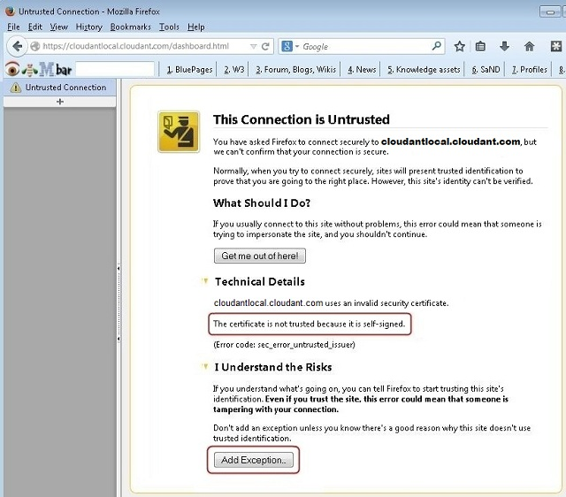
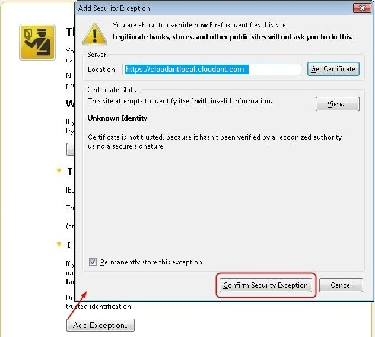

---

copyright:
  years: 2015, 2017
lastupdated: "2017-02-09"

---

{:new_window: target="_blank"}
{:shortdesc: .shortdesc}
{:screen: .screen}
{:codeblock: .codeblock}
{:pre: .pre}

# Confirming your untrusted certificate

If you use a certificate that was validated by a certificate
authority (CA), this step is not needed.
{:shortdesc}

<ol><li>If you use a self-signed certificate, confirm your certificate
    when the following untrusted connection message opens.

 
</li>
<li>Click `Add Exception` on the `This Connection is Untrusted` message.</li>
<li>To add a security exception, perform the follow steps when the
    `Add Security Exception` window opens.
<ol type="a">
<li>Select the `Permanently store this exception` check box so the exception is stored for future use.</li>
<li>Click `Confirm Security Exception` to confirm the exception.</li>

</ol>   
</li></ol>