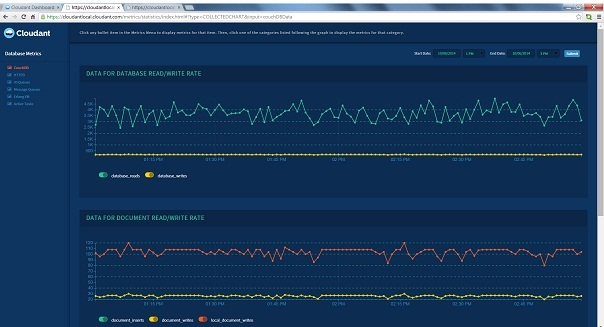

---

copyright:
  years: 2015, 2020
lastupdated: "2020-09-09"

keywords: elevated request latencies, cluster configuration, hardware failure, ioq latency, load average, erlang run queue, ibm cloudant metrics application, ibm cloudant mustgather tool, monitoring, weatherreport, high throughput, concurrent replication, background replication

subcollection: Cloudant

---

{:new_window: target="_blank"}
{:shortdesc: .shortdesc}
{:screen: .screen}
{:codeblock: .codeblock}
{:pre: .pre}
{:tip: .tip}
{:note: .note}
{:important: .important}
{:deprecated: .deprecated}
{:external: target="_blank" .external}

<!-- Acrolinx: 2019-12-20 -->

# Diagnose and troubleshoot
{: #diagnose-troubleshoot}

Troubleshoot and resolve problems on your own by using the tools
that are provided with  {{site.data.keyword.cloudant_local_notm}} Data Layer Local Edition ({{site.data.keyword.cloudant_local_notm}}). Identify the source of a
problem, gather diagnostic information, and download fixes.
{: shortdesc}

## Elevated request latencies
{: #elevated-request-latencies}

Latencies on any cluster vary in response to various internal and
external factors. In this context, 'elevated' means 'elevated
beyond an acceptable tolerance'. The level of latencies that is
acceptable to you depends on your application. Elevated latencies
are difficult to debug. While a predefined solution is
impossible, the following sections offer some guidance.


### Is there a wider context?
{: #is-there-a-wider-context-}

The increased latency might be related to ongoing work. Determine
whether any other operations' work is ongoing and be aware of the
following issues.

*   Cluster expansions or contractions
*   Node replacements
*   Planned maintenance

### Did anything change?
{: #did-anything-change-}

It is unusual for latencies to increase of their own accord. The
following examples show changes that can affect request latency.

#### Workload
{: #workload}

Determine whether a correlation exists between request
volume and latency. Request volume alone does not give a
clear picture of the workload. It is worth breaking down
the traffic by HTTP request type and request size when
you are looking for changes. You can derive this
information from the logs that are generated for each
node. Also, look for changes in the number of
`active_tasks` ongoing on the cluster. For example, a
correlating increase in `changes_pending` for an indexer
job might indicate that a new design document was
uploaded and the cluster is undertaking an extra
indexing workload. You can find information about
indexing tasks in the logs and through the
`/_active_tasks` endpoint. If the workload profile
changed, you might be able to manage the increased
latency by using IOQ priorities.

#### Cluster configuration
{: #cluster-configuration}

Determine whether any changes were made recently to the
cluster configuration. You can get a list of recent
configuration changes for a cluster from the logs. If
any changes were made that correlate with increased
latency, determine the context in which those changes
were made to determine whether they can be reverted.

#### Hardware failure
{: #hardware-failure}

This problem might be the result of the full or partial
failure of servers, disks, networking components, or
related failures. When you diagnose the problem, watch
for the following changes.

*   Disk errors on cluster nodes
*   Changes in disk operation times
*   Unexpected volumes on one or more cluster nodes
*   Recently unavailable cluster nodes

### Are elevated latencies isolated to a particular account, database, or request type?
{: #are-elevated-latencies-isolated-to-a-particular-account-database-or-request-type-}

Check whether the elevated latencies are isolated to a particular
account, database, or request type.

*   Logs show that most requests go to one or a few databases.
*   Have the same request type (such as the same HTTP method).
*   Have the same backend name.

#### Latencies for a specific database
{: #latencies-for-a-specific-database}

If latencies are only elevated for a specific database,
confirm whether a corresponding change in the traffic
profile for that database exists.

Check that the database is evenly balanced across the
cluster by inspecting the shard map.

``` sh
ssh db1.cluster001.cloudant.com curl \
    -X GET http://localhost:5986/dbs/backend_name%2Fdatabase_name | python -m json.tool | less
```
{: codeblock}

Look at the `by_node` key and determine whether the shards
are spread evenly across the cluster. If the shards are
not evenly distributed, rebalancing the shards might
improve the situation. For more information, see the
documentation about rebalancing a cluster.

#### Latencies for view requests
{: #latencies-for-view-requests}

If latencies are elevated only for a specific view (or
view group or design_doc), check whether the affected
requests are using `stale=ok`. If they are using `stale=ok`,
check the distribution of ushards for that view by
running the following command in remsh.
 
``` sh
> mem3:ushards("db_name").
```
{: codeblock}

If the ushards are not evenly distributed (meaning every
node has the same number of ushards), you can change the
order of the nodes for each range under `by_range`.

If they are not using `stale=ok`, check for ongoing view
builds for the related design documents. If index builds
are ongoing, which might be a result of a new design
document version or a large volume of data ingress,
increased latency for `stale=false` queries is expected.
You might be able to speed up the index builds by
increasing the IOQ priority or setting an IOQ bypass.
However, this approach can cause other changes in
cluster performance, so proceed carefully. For example,
change one thing at a time and monitor the situation
closely.

To change IOQ priority for views, do the following steps
in a remsh.

``` sh
> rpc:multicall(config, set, ["ioq", "views", "1", "Speed up index builds"]).
```
{: codeblock}

Set an IOQ bypass.

``` sh
> rpc:multicall(config, set, ["ioq.bypass", "view_update", "true", "Speed up index builds"]).
```
{: codeblock}

### Are the elevated latencies converging on a specific value?
{: #are-the-elevated-latencies-converging-on-a-specific-value-}

If the request times for affected requests are converging around
specific values, an internal timeout might be triggering. Typical
timeout values are 5000 ms, 60000 ms, and 3600000 ms, though check
`/opt/cloudant/etc/local.ini` to see whether any custom timeout
values are set.

If a timeout is triggering, that might help you determine which
part of the system is slowing down the requests. If you can
determine that one node is responsible for the timeouts, put that
node into maintenance mode to see whether performance improves.
However, first do the appropriate checks to determine whether
maintenance mode is safe.

Set maintenance mode in remsh.

``` sh
> config:set("cloudant", "maintenance_mode", "true").
```
{: codeblock}

### Do any recorded metrics correlate with latency increases?
{: #do-any-recorded-metrics-correlate-with-latency-increases-}

Increased IOQ latencies (check the metrics application) often
correlate with increased HTTP request latencies. However, this
metric alone is not enough to determine whether requests are IOQ
bound or IO bound.

#### IOQ latency
{: #ioq-latency}

If `disk.sdb.disk_time` is not elevated, the request might
be genuinely IOQ bound, in which case you might achieve
some gains by tuning IOQ. Consider increasing
IOQ and concurrency.

``` sh
> rpc:multicall(config, set, ["ioq", "concurrency", "50", "Attempt to reduce IOQ latency"]).
```
{: codeblock}

Also, consider doing the following steps.

Increase IOQ priority for a particular request class.

``` sh
> rpc:multicall(config, set, ["ioq", "writes", "1", "Attempt to reduce IOQ latency"]).
```
{: codeblock}

Decrease IOQ priority for a competing request class, but
first verify in metrics whether another class of request
is competing.

``` sh
> rpc:multicall(config, set, ["ioq", "views", "0.1", "Attempt to reduce IOQ latency"]).
```
{: codeblock}

Set an IOQ bypass for a particular request class.

``` sh
> rpc:multicall(config, set, \
    ["ioq.bypass", "interactive", "true", "Attempt to reduce IOQ latency"]).
```
{: codeblock}

#### Load average and the Erlang run queue
{: #load-average-and-the-erlang-run-queue}

These metrics are analogous. Load average is the number
of processes in a runnable state that is waiting to run
or display by `top` or `uptime`. Erlang run queue length is
the number of processes in the Erlang VM in a runnable
state (available in the Metrics application).

If correlating increases exist here, the system might be
overloaded. Check whether the metrics are elevated
across the cluster or whether the problem is limited to
one node. If the problem is local to a subset of nodes,
investigate those nodes and check the shard distribution
on the cluster.

If load average is growing, but the Erlang run queue is
not, check the affected nodes for other processes. The
JVM or the `collectd` process might be using too many
resources, leading to poor performance of the Erlang VM.
If no obvious signs of a specific problem exist, the
cluster is balanced and the increases are not limited to
a single node, the cluster might be overloaded. Verify
that a correlating increase in requests exists and
consider adding more nodes to the cluster.

## {{site.data.keyword.cloudant_short_notm}} Metrics application
{: #ibm-cloudant-metrics-application}

The {{site.data.keyword.cloudant_short_notm}} Metrics web application shows statistics and data
about the health of your {{site.data.keyword.cloudant_local_notm}} cluster. You can use the
Metrics application to spot potential problems in your {{site.data.keyword.cloudant_short_notm}}
cluster before they become serious issues and adversely affect
performance.


### Displaying the Metrics application
{: #displaying-the-metrics-application}

This example shows how to create the Metrics web application URL
and display the Metrics application.


1. Replace the variables in the following default URL for the
    Metrics application.
    `protocol://loadbalancer.company.com/metrics_app/statistics/index.html`
2. If {{site.data.keyword.cloudant_local_notm}} is configured to use Secure Sockets
    Layer (SSL), replace protocol with `http` or `https`.
    For more information about SSL, see [Configuring SSL](/docs/Cloudant?topic=Cloudant-configure-ibm-cloudant-data-layer-local-edition#configuring-ssl-ibm-cloudant-local).
3. Replace `loadbalancer.company.com` with your load balancer
    host name, such as `cloudantlocal.cloudant.com`.
4. If needed, replace `metrics_app` with the `METRICS_DBNAME`
    you entered in the `metrics.ini` file and append `_app` to
    it.
    The default value for the `METRICS_DBNAME` field is
    `metrics_app`. Therefore, if you did not change the default
    value, enter the literal value `metrics_app` as part of the
    URL.

    This example shows a Metrics application URL, with a user
    specified, to display the Metrics application:
    `https://cloudantlocal.cloudant.com/metrics_app/statistics/index.html`
5. When you log in to the Metrics application for the first time,
    the Metrics login page opens.

The following screen capture shows the data that appears on the Metrics application for Database Read/Write Rate and Document Read/Write Rate in graph form.

{: caption="Figure 1. Example shows the graphical information that is displayed for database and document read/write rates" caption-side="bottom"}


#### Adding non-administrator users
{: #adding-non-administrator-users}

Administrators can create accounts with limited,
non-administrator, permissions. To do so, an administrator
creates users who access the Metrics application without
administrator permissions. To add a user, an administrator
updates the metrics database security document.


1. Create a user for the Metrics application.
   The new user in this example is `metuser3`.

   ```sh
   curl -X PUT http://localhost/_users/org.couchdb.user:metuser3 -H "Accept: application/json" -H "Content-Type: application/json" -d '{"name": "metuser3", "password": "metpass3", "type": "user", "roles":[]}' -u admin
   ```
   {: codeblock}

2. Get the list of current Metrics application users from the
    metrics security document.

    `curl -X GET http://localhost/metrics/_security -u admin`
    
    When you add a user for the first time, this list might be empty.
    {: note}

3. Add or append a new user to the `members:names` list in the
    metrics `_security` document.

    The `_security` document is overwritten. If you want to keep existing users, you must add them, and the new users, to the list.
    {: note}
4. Run the following command to add a user to the original security document when the `members:names` list is  empty.
    
    ```sh
    curl -X PUT http://localhost/metrics/_security -Hcontent-type:application/json -d '{"admins":{"names":[],"roles":[]},"members":{"names":["metuser3"],"roles":[]}}' -u admin
    ```
    {: codeblock}

5. Run the following command to add a user to the original security document when the `members:names` list is not empty and contains existing users, for example, `metuser1` and `metuser2`.

   ```sh
   curl -X PUT http://localhost/metrics/_security -Hcontent-type:application/json -d '{"admins":{"names":[],"roles":[]},"members":{"names":["metuser1","metuser2","metuser3"],"roles":[]}}' -u admin
   ```
   {: codeblock}

6. The new user can log in to the Metrics application and view
    metrics with their new ID, `metuser3`.

## {{site.data.keyword.cloudant_short_notm}} MustGather tool
{: #cloudant-mustgather-tool}

The MustGather tool is a lightweight diagnostic tool that
collects system data, including {{site.data.keyword.cloudantfull}} cluster data, logs, and
other data you can use for diagnosing issues. With the MustGather
Tool, you consolidate your collected system data into a
compressed file to send to {{site.data.keyword.IBM_notm}} Support.


The MustGather tool creates a snapshot of the local {{site.data.keyword.cloudant_short_notm}}
clusters that can be used to diagnose issues more quickly. The
MustGather tool is available on all database and load balancer
nodes. You can run the tool from any node. You specify the nodes
within the cluster in the `mustgather.ini` file. The MustGather
tool collects the relevant files from different nodes and
consolidates them into one compressed file that you send to IBM
Support to help them diagnose issues with {{site.data.keyword.cloudant_local_notm}}.

### Modifying the `mustgather.ini` file
{: #modifying-the-mustgather-ini-file}

The `mustgather.ini` file is configured when you run the MustGather
tool. However, if you need to, you can update certain information
in the `mustgather.ini` file after you run the MustGather tool.

The following example of the `mustgather.ini` file is in the
`/opt/cloudant/etc` directory.

```
# Properties file
#
# Enter a comma-separated list of the cluster nodes in the NODES field.
#
# This example shows how to specify a cluster that includes three databases and one load balancer node.
#
# NODES: lb.your_locale.your_company.com,
#   db1.your_locale.your_company.com,
#   db2.your_locale.your_company.com,
#   db3.your_locale.your_company.com

[cluster]
nodes:
os_messages: /var/log/messages*
haproxy_cfg: /etc/haproxy/haproxy.cfg
haproxy_logs: /var/log/haproxy*
nginx_cfg: /etc/nginx/nginx.conf
nginx_dashboard_cfg: /etc/nginx/conf.d/cloudant-dashboard.conf
nginx_logs: /var/log/nginx*
cloudant_properties_cfg: /opt/cloudant/etc
cloudant_version: /root/cloudant/version.txt
cloudant_logs: /var/log/cloudant
```
{: codeblock}

To collect log files from different nodes, port 22 must be open.
{: note}

### Editing the mustgather.ini file
{: #editing-the-mustgather-ini-file}

Edit the `mustgather.ini` file and update the information on the
node where you want to run the tool.

1. Open the `mustgather.ini` file.
2. Update the following information on the node where you want to run the tool.

   a. Update the nodes in the `[cluster]` section of the file with the information for your cluster nodes.

   b. Specify multiple nodes in the cluster by entering a comma-separated node name. The node name can either be the host name or the IP address. If you specify a host name, make sure to update the `hosts` file as shown in the example.

   ```sh
   nodes: db1.cloudant-local.com,db2.cloudant-local.com,db3.cloudant-local.com,lb1.cloudant-local.com
   ```
   {: codeblock}

   ```sh
   nodes: 192.168.1.100,192.168.1.101,192.168.1.102,192.168.1.103
   ```
   {: codeblock}

   (Optional) Update the other information in the `[cluster]` section.

### Running the MustGather tool
{: #running-the-mustgather-tool}

If you have an issue with {{site.data.keyword.cloudant_local_notm}}, run the MustGather
tool to collect your system data and send it to {{site.data.keyword.IBM_notm}} Support.

You must have root privileges to run the MustGather tool.
{: important}

1. Run the MustGather tool by using the following command.

   a. Add the root SSH private keys to all nodes, including
        database nodes and load-balancer nodes.

   b. Copy the SSH public keys to the
        `/root/.ssh/authorized_keys` file.

   c. Turn off `StrictHostChecking`.

   ``` sh
    mustgather --help
    usage: mustgather [-h] [-n NODES] [-o OUTPUT_DIR]
                   
    mustgather - Gathers diagnostic data for an {{site.data.keyword.cloudant_short_notm}} cluster.
    optional arguments:
    -h, --help       Show this help message and exit.
    -n  NODES        Comma-separated list of host names for the cluster nodes that you can configure as the list of nodes for MustGather to use.
    -k KEY_FILE      The SSH private key file. If the SSH key is not in the default ~/.ssh directory, you can specify this option, for example, ~/sample/id_rsa.
    -o  OUTPUT_DIR   Directory where the output tar file is created.
    ```
    {: pre}

2. Run the MustGather tool with option `-n` or option `-o`.

   a. Update the `mustgather.ini` file to specify the nodes with
        option `-n`. 

   - Specify the `-n` option the first time you run the
            MustGather tool.

   - Do not specify option `-n` for any subsequent runs
            unless the node information changes from the previous
            run.

   b. Update the `mustgather.ini` file to specify the nodes with
        option `-o`.

   - The `mustgather.tar` file is saved to the output
           directory when option `-o` is specified.

   - The `mustgather.tar` file is saved to the current
            directory when option `-o` is not specified.
            
3. After you run the tool, send the `tar` file to {{site.data.keyword.IBM_notm}} support.

## Monitor cluster health with Weatherreport
{: #monitor-cluster-health-with-weatherreport}

Use these instructions to use the Weatherreport utility to check
the health of your {{site.data.keyword.cloudant_short_notm}} cluster. Weatherreport is a
command-line application that provides information about the
status of a dbcore node or cluster. It is useful in
troubleshooting cluster issues, such as increased latencies, low
disk space, or node failures.


### Running Weatherreport
{: #running-weatherreport}

Run the Weatherreport utility to check your cluster health. By default, Weatherreport carries out checks for the local node. If you run it with the `--all-nodes` option, the whole cluster is checked.

1. As `root` or `cloudant` user, update that user profile file
   with the following PATH or set the PATH in your current SSH
   session by running the following command.

    ```sh
    export PATH=$PATH:/opt/cloudant/bin
    ```
    {: codeblock}

2. SSH into a dbcore node and use this command to run
   Weatherreport.

    ```sh
    /opt/cloudant/bin/weatherreport
    ```
    {: codeblock}

### Weatherreport checks
{: #weatherreport-checks}

The Weatherreport utility reviews your cluster based on the
checks you specify when you run it.

```sh
$ /opt/cloudant/bin/weatherreport --list

Weatherreport check list

custodian            Shard safety/liveness checks
disk                 Data directory permissions and atime
internal_replication Check the number of pending internal replication jobs
ioq                  Check the total number of active IOQ requests
mem3_sync            Check there is a registered mem3_sync process
membership           Cluster membership validity
memory_use           Measure memory usage
message_queues       Check for processes with large mailboxes
node_stats           Check useful erlang statistics for diagnostics
nodes_connected      Cluster node liveness
process_calls        Check for large numbers of processes with the same current/initial call
process_memory       Check for processes with large mailboxes
safe_to_rebuild      Check whether the node can safely be taken out of service
search               Check the local search node is responsive
tcp_queues           Measure the length of tcp queues in the kernel			
```
{: codeblock}

To run one check, you can run Weatherreport with the name of the
check as the first parameter. For instance, you can check for
memory use issues on all nodes.

```sh 
$ /opt/cloudant/bin/weatherreport --all-nodes memory_use
```
{: codeblock}

A list of the command-line options and their meanings is
available by using this command.

``` sh 
$ /opt/cloudant/bin/weatherreport --help
```
{: codeblock}

### `memory_use`
{: #-memory_use-}

*What does it check?*

You can check the amount of free RAM on a dbcore node with `memory_use`.

*What does an error for this check mean?*

A node is running out of RAM. The `oom` might stop dbcore
soon, which can cause externally visible errors.

*How can I fix it?*

It is worth attending to this problem quickly. You can
check the memory graphs in the metrics application to
see how urgent it is and whether memory use is
increasing quickly or slowly.

#### Fast increase

If it is a sharp increase, a process might be getting a
long message queue backup. That probably means you can
stop the process. However, before you do that, use
`process_info` to find out more about the process. To find
processes that are using too much memory within dbcore,
log in to the node and start a `remsh` session. Find the
processes that are using the most memory.

```sh 
# Size is in bytes
(dbcore@db6.bigpark002.cloudant.net)1> recon:proc_count(memory, 10).
[{<0.101.0>,16365344,
  [lager_event,
   {current_function,{gen_event,fetch_msg,5}},
   {initial_call,{proc_lib,init_p,5}}]},
 {<0.267.0>,13090216,
  [rexi_server,
   {current_function,{gen_server,loop,6}},
   {initial_call,{proc_lib,init_p,5}}]},
 {<0.14538.4675>,9210944,
  [{current_function,{gen,do_call,4}},
   {initial_call,{erlang,apply,2}}]},
 {<0.25.0>,2917752,
  [file_server_2,
   {current_function,{gen_server,loop,6}},
   {initial_call,{proc_lib,init_p,5}}]},
....
```
{: codeblock}

The second parameter to `proc_count` is the number of
processes to show, in this case 10. So here <0.101.0> is
using 16 MB of memory, which is typically nothing to
worry about. It is possible for individual processes to
use several gigabytes of memory. As a rule, if the top
few processes are using more memory than others, it is
worth looking into whether you can stop those processes.

Use `process_info` to find out what process is running.

``` sh 
(dbcore@db1.slqs002.cloudant.net)3> process_info(pid(0,9900,0), [current_function,message_queue_len,initial_call]).
[{current_function,{couch_key_tree,merge_at,3}}, {message_queue_len,2270}, {initial_call,{proc_lib,init_p,5}}]
```
{: codeblock}

Now, use your judgment or contact support to see whether
it is safe to stop the process.

#### Slower increase

It might be that "garbage" is building up. Check the
different types of memory for the node.

``` sh 
> recon:node_stats_print(1,1). 
{[{process_count,1362},
  {run_queue,0},
  {error_logger_queue_len,0},
  {memory_total,168628304},
  {memory_procs,83944688},
  {memory_atoms,486930},
  {memory_bin,19389792},
  {memory_ets,4410896}],
 [{bytes_in,76984},
  {bytes_out,275},
  {gc_count,25},
  {gc_words_reclaimed,17015},
  {reductions,11983462}]}
ok
```
{: codeblock}

Run a garbage collection from a remsh on the node.

``` sh 
[erlang:garbage_collect(Pid) || Pid <- processes()]
```
{: codeblock}

If that does not change the situation, check whether the
lines in the provided memory information add up to the
memory the OS is reporting for beam.smp by using `top` on
the node. If a significant discrepancy exists, the node
is probably leaking memory, and if the server is close
to running out, restart cloudant with this command.

``` sh
sv restart cloudant
```
{: codeblock}

### `message_queues`
{: #-message_queues-}

The `message_queues` checks monitor the message queues for various
processes as you can see in the following list.

*  `couch_db_updater`
*  `couch_file`
*  `couch_server`
*  `custodian`
*  `ddoc_cache_opener`
*  `disk`
*  `global_changes_server`
*  `ioq`
*  `mem3_shards`
*  `rexi_server`
*  `search`

#### `couch_db_updater`
{: #-couch_db_updater-}

*What does it check?*

This check monitors the message queues of the various
`couch_db_updater` processes. These processes manage
access to a logical database; one `couch_db_updater`
process exists for each open database shard and one for
each open view shard. In general, `couch_db_updater`
processes do not exhibit the same pathological failure
modes that `couch_file` processes do. Regardless, a
failing or backed up `couch_db_updater` process is likely
to cause externally visible problems and must be acted
upon.

*How can I confirm the failure?*

SSH to the node where the failure occurred and create
the following function in a remsh.

``` sh 
FindTiredPids = fun(Mod, N) ->
    {monitors, M} = process_info(whereis(couch_stats_process_tracker), monitors),
    Candidates = [Pid || {process, Pid} <- M],
    lists:foldl(
        fun(Pid, Acc) ->
            case process_info(Pid, [message_queue_len, dictionary]) of
                undefined -> PI = [];
                PI -> ok
            end,
            case proplists:get_value('$initial_call', proplists:get_value(dictionary, PI, [])) of
                {Mod, init, 1} ->
                    case proplists:get_value(message_queue_len, PI) of
                        Len when Len > N -> [Pid|Acc];
                        _ -> Acc
                    end;
                _  ->
                    Acc
            end
        end,
        [],
        Candidates
    )
end.
```
{: codeblock}

Next, get a list of PIDs.

``` sh 
> Pids = FindTiredPids(couch_db_updater, 1000).
[<0.31017.4673>,<0.28837.3289>]
```
{: codeblock}

This command returns a list of PIDs with long > 1000
message queues.

*How can I remediate the failure?*

It is worthwhile to be patient in remediating this type
of failure because it is possible for the processes to
recover on their own. If you observe a process with a
message queue that is spiraling out of control (for
example, the mailbox has more than 100,000 messages),
stop the process immediately. If not, wait a few minutes
and see whether the system recovers.

If the process does not recover on its own, run this
remsh command to stop all backed-up CouchDB updaters.

``` sh 
> [exit(Pid, kill) || Pid <- Pids].
[true,true]
```
{: codeblock}

*How can I verify the remediation?*

Confirm that the list of backed up CouchDB updaters is
empty.

``` sh 
> FindTiredPids(couch_db_updater, 1000).
[]
```
{: codeblock}

#### `couch_file`
{: #-couch_file-}

*What does it check?*

This check monitors the message queues of the various
couch_file processes. These processes manage access to a logical database. One `couch_file` process exists for each open database shard, and one `couch_file` process exists for each open view shard.

Under heavy load, a `couch_file` process might be unable
to process messages as fast as it receives them. When
this problem occurs, you must stop the process because
the process might not recover.

*How can I confirm the failure?*

SSH to the node where the failure occurred and create
the following function in a remsh.

``` sh
FindTiredPids = fun(Mod, N) ->
    {monitors, M} = process_info(whereis(couch_stats_process_tracker), monitors),
    Candidates = [Pid || {process, Pid} <- M],
    lists:foldl(
        fun(Pid, Acc) ->
            case process_info(Pid, [message_queue_len, dictionary]) of
                undefined -> PI = [];
                PI -> ok
            end,
            case proplists:get_value('$initial_call', proplists:get_value(dictionary, PI, [])) of
                {Mod, init, 1} ->
                    case proplists:get_value(message_queue_len, PI) of
                        Len when Len > N -> [Pid|Acc];
                        _ -> Acc
                    end;
                _  ->
                    Acc
            end
        end,
        [],
        Candidates
    )
end.

```            
{: codeblock}

Next, get a list of PIDs with long > 1000 message
queues.

``` sh
> Pids = FindTiredPids(couch_file, 1000).
[<0.31017.4673>,<0.28837.3289>]
```
{: codeblock}

*How can I remediate the failure?*

In remsh, run this command to stop all processes in the
list.

``` sh
> [exit(Pid, kill) || Pid <- Pids].
[true,true]
```
{: codeblock}

*How can I verify the remediation?*

Use the same remsh function that you used to identify
the tired processes. This command returns an empty list.

``` sh
> FindTiredPids(couch_file, 1000).
[]
```
{: codeblock}

*When do I escalate the page?*

If you are paged multiple times for a cluster, that is,
the issue is recurring, escalate the page.

#### `couch_server`
{: #-couch_server-}

*What does it check?*

This function checks whether the `couch_server` message
queues are growing larger, which indicates that they are
backing up.

*What does it mean when it fails?*

The `couch_server` is on the critical path for many RPC
calls. The overall effect of a backed up `couch_server` is
dramatically increased latency on a subset of requests.
For example, requests that are on a critical path.

*How can I fix it?*

First, use the metrics application and check whether the
incident is ongoing or a spike. If it is a spike that is
subsiding, no further action is required. If it is not
decreasing, restart `couch_server` with this command.

``` sh
exit(whereis(couch_server), kill). src
```
{: codeblock}

#### `ddoc_cache_opener`
{: #-ddoc_cache_opener-}

*What does it check?*

The `ddoc_cache_opener` message queue is backing up. Use
this command from a remsh to monitor the queue directly.

``` sh
process_info(whereis(ddoc_cache_opener), message_queue_len).
```
{: codeblock}

*What does it means when it fails?*

If it continues to back up, the server might not be able
to process HTTP requests.

*How can I fix it?*

If the message_queue size is not recovering on its own,
restart the ddoc_cache_opener process.

``` sh
exit(whereis(ddoc_cache_opener), kill).
```
{: codeblock}

If this approach does not resolve the problem, contact
support.

#### `global_changes_server`
{: #-global_changes_server-}

*What does it check?*

This command check monitors the number of messages in
the `global_changes_server` message queue.

*How can I fix it?*

Check the logs for entries that mention
`erlang.message_queues.global_changes_server`. If the
total does not drop to zero, an ongoing problem exists.
If the number of messages is decreasing, but peaking
often, more action might be needed.

It is possible to reduce the pressure on the
`global_changes` server by increasing the
`global_changes/max_event_delay` and
`global_changes/max_write_delay` parameters. The default
value is 500 ms, although values as high as 10000 ms might
be useful.

In a remsh, run the following commands to increase the
intervals (in this case to 5000 ms).

``` sh 
> rpc:multicall(config, set, ["global_changes", "max_event_delay", "5000",
    "Alleviate global_changes_server message queue pain"]).
```
{: codeblock}

It is also possible that the global_changes_server
message queue is a side effect of another issue. Watch
for the values in the logs to return to zero. If the
message queue size is not decreasing, contact support.

### `mem3_shards`
{: #-mem3_shards-}

*What does it check?*

The length of the `mem3_shards` message queue. The
`mem3_shards` process acts as a cache of the `/dbs`
database.

*What does it mean when it fails?*

As it is a cache, the node probably still functions
correctly, although more slowly, as it reads from the
disk more often.

*How can I fix it?*

You can watch the increase on the node by using the
following process.

``` sh
> process_info(whereis(mem3_shards), message_queue_len)
```
{: codeblock}

This process shows a speedy increase in the message
queue length, such as 1000 per second.

First, put the node into maintenance_mode with this
command.

``` sh
> config:set("cloudant", "maintenance_mode", "true")
```
{: codeblock}

Next, see whether the message queue length decreases. If
it does decrease, wait for it to go to zero and bring
the node back up with this command.

``` sh
> config:set("cloudant", "maintenance_mode", "false")
```
{: codeblock}

Now, check whether the queue starts increasing or stays
at zero. If it starts to increase again, the final fix
is to stop the process.

``` sh
exit(whereis(mem3_shards), kill).
```
{: codeblock}

If it is still increasing, call support.

### `rexi_server`
{: #-rexi_server-}

*What does it check?*

This check monitors the number of messages in the
various `rexi_server` message queues. Depending on cluster
configuration, this process might be a single Erlang
process, or a set of processes, one for each node in the
cluster.

These processes manage all inter-node communication. If
inter-node communication is not processing their
mailboxes correctly, communication is delayed.

*How do I confirm the failure?*

SSH to the node where the failure occurred and create
the following function in a remsh.

``` sh
ShowRexiServerMailboxes = fun() ->
    Names = case config:get("rexi", "server_per_node") of
        "true" ->
            [element(1, C) || C <- supervisor:which_children(rexi_server_sup)];
        _ ->
            [rexi_server]
    end,
    Mailboxes = lists:map(
        fun(Name) ->
            Pid = whereis(Name),
            {message_queue_len, Len} = process_info(Pid, message_queue_len),
            {Name, Len}
        end,
        Names
    ),
    lists:sort(fun(A, B) -> element(2, A) =< element(2, B) end, Mailboxes)
end,
```
{: codeblock}

Calling the function gives you a list of mailboxes and
their sizes.

``` sh
> ShowRexiServerMailboxes().
[{rexi_server,0}]
```
{: codeblock}

This function returns a list of
`{registered_process_name, mailbox_size}` tuples. The sum
of the message queue length values exceeds the alert
threshold.

*How can I fix it?*

As indicated previously, you can configure rexi
communication patterns in two ways. You probably need to
switch over to the newer server-per-node configuration.

In a remsh on the relevant node, verify that the
server-per-node configuration is set to false.

``` sh
> config:get("rexi", "server_per_node", "false").
```
{: codeblock}

This function returns the string "false." If the
function returns true, contact support. If the
server-per-node configuration is turned off, enable it
in a remsh.

``` sh
> F = fun() -> supervisor:restart_child(rexi_sup, rexi_server_mon), \
    supervisor:restart_child(rexi_sup, rexi_server_sup) end.
> rpc:multicall(erlang, apply, [F, []]).
> timer:sleep(60000).
> rpc:multicall(config, set, ["rexi", "server_per_node", "true"]).
```
{: codeblock}

Calling `restart_child` might return `{error,running}`, or
something similar, which is expected. They are restarted
as a fail-safe measure, and attempting to do so multiple
times does not have a negative impact.

*How can I verify that it is fixed?*

Run `ShowRexiServerMailboxes().` again and see whether the
size is decreasing. If the cluster is already using the
server-per-node configuration, but the problem persists,
contact support.

#### `custodian`
{: #-custodian-}

*What does it check?*

This function checks the number of shard replicas that
are currently reachable for all shard ranges for any
database that is equal to the default N, usually 3.

*How is it checked?*

A program that is called Custodian runs on every
database node in the cluster and inspects the `dbs`
database. Documents in the `dbs` database are referred to
as shard maps or partition tables, and contain a mapping
of database shards to nodes.

Custodian raises an alarm if one of the following
situations occur.

*   Some shards have less than or more than the
    appropriate number of replicas that are listed in the
    shard table.
*   A shard is mapped to an unavailable node.

*What does it mean when it fails?*

If n < N, it means that a database has shards that are
under protected, with fewer than N replicas available in
one or more shards ranges in one or more databases. If n > N,
it means that some shard ranges in some databases
have too many replicas. This issue is not as serious as
having too few, but must be addressed.

Often, this warning is a proxy for a disabled database
node (such as a dbcore restart or hardware failure), as
this disabled database node renders a good number of
shard replicas unreachable. If it is not caused by a
disabled node, it might be caused by one of the
following issues.

*   Someone deliberately created a database with less
    than N replicas.
*   A shard move failed, a shard disappeared, an extra
    copy was created, or the shard map was not properly
    updated.
*   Some other shard-map issue.
*   One or more nodes are not connected to all cluster
    nodes.
*   One or more shards have an N value greater than the
    default N.

*How can I fix it?*

Make sure that the problem is not caused by a server
that is disabled, unreachable, or not connected to the
other nodes. If that is not the case, contact support.

#### `disk`
{: #-disk-}

*What does it check?*

This function checks whether the `/` and `/srv` file systems
are writable.

*How is it checked?*

This check is done by writing a temporary file to `/tmp`
and `/srv/sensu` and making sure that it succeeds. A
failure of any kind or a 15-second timeout causes the
check to fail.

*What does it mean when it breaks?*

The file system has most likely become read-only. A
read-only file system can cause dbcore to run in a
degraded mode that affects the rest of the cluster (if
it is the `/srv` file system that is read-only). If the `/`
file system is read-only, a number of other problems can
occur. At the least, chef does not run.

If a disk error occurs, this disk error can cause a file
system to be remounted as read-only.

If the disk is mounted read/write and enough space is
available, the file system uses the pool of free inodes.

*How can I fix it?*

To check the mount status, use `mount`. In the following
example, `rw` indicates mounted read/write, `ro` read-only.

``` sh
$ mount
/dev/sda1 on / type ext4 (rw)
...
/dev/sdc1 on /srv type ext4 (rw,noatime)
```
{: codeblock}

If `/srv` is read-only, stop dbcore to keep it from affecting the rest of the cluster. :

``` sh
sudo sv stop cloudant
```
{: codeblock}

You
also might investigate what is causing the check to
fail.

*   Was it remounted as read-only (possibly due to a disk
    error)? Run `mount` and check for `ro`.
*   Is there another reason the file cannot be written?
    Check for the existence of `/srv/` and that it is
    writable.
*   Check the load on the server (by using `uptime` or `top`)
    to see whether a high load is causing file system
    operations to time out.

You must restart the node. When it starts, it might work
or you might get disk errors. If you get disk errors,
you probably need to replace the drive. Then, do a
standard node replacement. If the disks are mounted
correctly, run `df -i` and look at the `IFree` column to
check the available inodes. If the number of inodes is
less than 1000, remedy the immediate situation by
disposing of unneeded and orphaned files. Additionally,
the file system might be configured incorrectly, in
which case, running the following command can help:

``` sh
sudo tune2fs -m 0 <partition>
```
{: codeblock}

However, neither of these options is a permanent
solution.

#### `ioq`
{: #-ioq-}

*What does it check?*

This check monitors the number of requests that are
waiting to be processed by IOQ.

*What does it mean when it fails?*

The IOQ has numerous pending requests, but it is not
necessarily stuck. To check, look at the volume of IOQ
requests being processed in the metrics application.

*How can I fix it?*

Verify that the situation is not caused by a sudden
"spike" in activity. Look for a relatively slow growth
in pending requests. If you see growth, do the following
steps.

Verify that the IOQ is not saturated with traffic. If
the number of IOQ reads and writes shown in the metrics
application is more than 20k, IOQ is probably saturated
with traffic. A quick fix to this problem is to bypass
interactive IOQ traffic.

``` sh
> config:set("ioq.bypass", "interactive", "true").
```
{: codeblock}

After you enable bypass, the pending request count
trends downward.

If the IOQ is not saturated, something else is
happening. As the best immediate action, put the node in
maintenance mode.

``` sh
> config:set("cloudant", "maintenance_mode", "true").
```
{: codeblock}

Next, wait approximately 30 seconds, and restart dbcore.

``` sh
$ sudo sv restart dbcore
```
{: codeblock}

If you get to this point, contact support to investigate
why IOQ failed.

#### `search`
{: #-search-}

*What does it check?*

This check monitors whether clouseau is running on the
node. Clouseau acts as a wrapper around the Lucene
library that does the generation, updating and querying
of search indexes at the shard level. If clouseau is not
running, the node cannot serve search requests.

*How can I fix it?*

Try disconnecting clouseau; it automatically reconnects.

``` sh
disconnect_node('clouseau@127.0.0.1').
```
{: codeblock}

Next, run Weatherreport search to see whether the
problem is fixed. You might need to repeat this cycle a
few times. If it is still not working, try this solution
instead.

``` sh
sudo sv restart clouseau
sudo sv restart clouseau
weatherreport search
```
{: codeblock}

## Disk space issues
{: #disk-space-issues}

Identify and resolve disk space issues by checking metrics,
compacting shards, auto-compaction, and Smoosh.

### Checking Metrics
{: #checking-metrics}

1.  Check metrics to get background information on the cluster,
    such as the current request load and the status of compaction
    tasks.

2.  Assess the space on the disk.

3.  Log in to the remote server.

    ```
    ssh db1
    ```
    {: codeblock}

4.  Run `du -h -s /srv/*` to get a basic outline of how disk space
    is distributed.

    You can see what is taking up the most space in the database
    or view data.

5.  Run `durep` to monitor disk usage.

    ``` sh
    durep -x -hs 5000M /srv | less
    ```
    {: codeblock}

    In this example, the following results returned.

    ```
    50.5G [################              ]  53.56% prod_features.1342146305.couch
    ```
    {: codeblock}

    The example output shows that the `prod_features` shards are large.

### Compacting specific, oversized shards
{: #compacting-specific-oversized-shards}

Shards can grow larger than needed. If they do, you can compact a
specific shard.

#### Compact a shard and reduce its size
{: #compact-a-shard-and-reduce-its-size-}

``` sh
durep -x -hs 5000M /srv less
```
{: codeblock}

Run this command to move the biggest shards to the beginning of the
list.

``` sh
$ pwd
/srv/db/shards/f5555546-ffffffff/foo
$ ls -lah bar.1332615163.couch
-rw-r--r-- 1 dbcore dbcore 944G Sep 30 09:01 bar.1332615163.couch
```
{: codeblock}

If a shard is large, such as 80%+ of the space, you can manually compact it.
{: note}

In `remsh`, you see the following information.

```
{ok, Db} = couch_db:open(<<"shards/f5555546-ffffffff/foo/bar.1332615163">>,
    [{user_ctx, {user_ctx, null, [<<"_admin">>], undefined}}]).
couch_db:start_compact(Db).
```
{: codeblock}

Run `_active_tasks` for the cluster and pipeline through `jq` to watch
progress.

``` sh
jq '.[] | select(contains({node: "db1", type: "database_compaction", database: "shards/f5555546-ffffffff"}))'
```
{: codeblock}

When a compaction fails, the compact files (`compact.data` and
`compact.meta`) are saved to the directory, `/srv/db/shards/`,
alongside the shard. You can see the orphaned `.compact` files by
date or by running this command:

``` sh
sudo lsof dbname.1332615163.couch.compact.data
```
{: codeblock}

This command returns
nothing if a compaction process that uses the file no longer
exists (that is, no process has an active file-handle to that
file).

### Compaction
{: #compaction}

Smoosh is the auto-compactor for the databases. If Smoosh is not
functioning properly, it can result in compactions not happening
or compacting inappropriate shards (for example, shards that do
not reclaim much space). For more information, see the guide for
compaction.

## Tune parameters for common replication cases
{: #tune-parameters-for-common-replication-cases}

Tune parameters for common replication cases by using the
following parameters to impact the performance of a replication
task. Reference the following scenarios and their recommended
values to resolve issues with performance.

The following parameters impact the performance of a replication
task.

*   `connection_timeout`  
    Number of milliseconds until an HTTP connection times
    out.
*   `http_connections`  
    Maximum total number of HTTP connections.
*   `worker_batch_size`  
    Number of documents each worker processes in a single
    batch.
*   `worker_processes`  
    Number of concurrent processes for this replication.

The optimal values for these parameters depend on several
factors.

*   Document size
*   Number and size of attachments
*   Write load of the database
*   Number of replication tasks that are running concurrently
*   Total load of the cluster

### High throughput, small documents
{: #high-throughput-small-documents}

If you want to optimize for high throughput, and most documents
in your database are small (about 1 KB), try to keep
`worker_processes` under the number of cores on the mediating
server. The `worker_batch_size` must not be larger than 500 to
avoid errors (such as dropped connections) that would lead the
replicator to retry a large write request. The `connection_timeout`
value is increased from the default of 30,000 for the same
reason.


``` json
{
    "source": "...",
    "target": "...",
    "worker_processes": 20,
    "worker_batch_size": 500,
    "http_connections": 300,
    "connection_timeout": 60000
}
```
{: codeblock}

### High throughput with attachments
{: #high-throughput-with-attachments}

A database that contains documents with large or variable numbers
of attachments requires different treatment. Increase worker
count (`worker_processes`) and decrease the amount of work that is
done by each worker (`worker_batch_size`) to avoid workers being
limited to replicating one slow attachment each.

``` json
{
    "source": "...",
    "target": "...",
    "worker_processes": 100,
    "worker_batch_size": 20,
    "http_connections": 150,
    "connection_timeout": 60000
}
```
{: codeblock}

### Many concurrent replications
{: #many-concurrent-replications}

If you want to run many replications concurrently, each
replication job must not use too many resources. Set the value
for `worker_processes` to `1`.

``` json
{
    "source": "...",
    "target": "...",
    "worker_processes": 1,
    "worker_batch_size": 100,
    "http_connections": 1,
    "connection_timeout": 60000
}
```
{: codeblock}

### Background replication
{: #background-replication}

To keep performance impact on the source or target server to a
minimum, you can use these settings. However, these settings
might not deliver much throughput. Increase the
`connection_timeout` because the server is heavily loaded and it
might push this replication into the background.

``` json
{
    "source": "...",
    "target": "...",
    "worker_processes": 1,
    "worker_batch_size": 100,
    "http_connections": 5,
    "connection_timeout": 300000
} 
```
{: codeblock}
