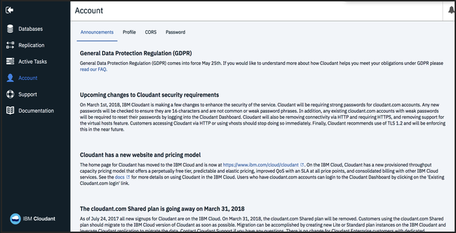

---

copyright:
  years: 2021, 2022
lastupdated: "2022-08-30"

keywords: ibm cloudant plan, standard plan, lite plan, legacy enterprise plan

subcollection: Cloudant

---

{{site.data.keyword.attribute-definition-list}}

# Finding your {{site.data.keyword.cloudant_short_notm}} plan
{: #find-your-ibm-cloudant-plan}

You can subscribe to different {{site.data.keyword.cloudant_short_notm}} plans, including the Lite, Standard, or Enterprise plans. 
{: shortdesc}

The following steps show where you can see the type of plan that you selected.   

1.  Go to the [{{site.data.keyword.cloud_notm}} dashboard](https://cloud.ibm.com/).
2. Authenticate with your username and password.  
   The {{site.data.keyword.cloud_notm}} dashboard opens to the Resource list.
3. Click an instance to find more information.
4. Click **Plan**.  
   A checkmark indicates the plan that you use as shown in the following screen capture.  
   For more information, see the [Migration FAQ](/docs/Cloudant?topic=Cloudant-faq-migration).  

   {: caption="Figure 1. Standard dashboard" caption-side="bottom"}

   If the Plan tab indicates that you're on the Standard plan, you don't need to read any further. You're already on a paid SLA-backed {{site.data.keyword.cloudant_short_notm}} service. No further action is required.
   {: note}

## Finding your legacy Enterprise plan
{: #finding-your-legacy-enterprise-plan}

You can find your Enterprise plan in the {{site.data.keyword.cloudant_short_notm}} dashboard by following these steps. 

1. Open the {{site.data.keyword.cloudant_short_notm}} dashboard.  
   For more information, see the [Getting started](/docs/Cloudant?topic=Cloudant-navigate-the-dashboard) tutorial.
2. If you're using a legacy Enterprise `cloudant.com` account, click **Account**.
3. Review your `cloudant.com` Enterprise account on a dedicated cluster.  
   The view doesn't include a Usage tab and looks like the following example:  
   {: caption="Figure 2. Enterprise plan" caption-side="bottom"}

