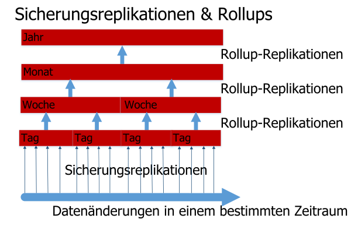

---

copyright:
  years: 2015, 2017
lastupdated: "2017-05-04"

---

{:new_window: target="_blank"}
{:shortdesc: .shortdesc}
{:screen: .screen}
{:codeblock: .codeblock}
{:pre: .pre}

# Ihre Daten sichern

>   **Hinweis**: Dieser Leitfaden bezieht sich auf ein *veraltetes* Feature zur täglichen inkrementellen Sicherung, 
    das früher nur auf Nachfrage für Unternehmenskunden verfügbar war.
    Aktuelle Informationen zu Sicherungen finden Sie im Leitfaden [Disaster-Recovery und Sicherung](disaster-recovery-and-backup.html).

Diese Funktionalität:
-   ist nicht standardmäßig aktiviert.
-   ist nur für Unternehmenskunden verfügbar, die sie spezifisch anfordern müssen.
-   muss explizit konfiguriert werden, bevor sie verwendet werden kann.
-   unterliegt [bekannten Einschränkungen](#known-limitations).
-   steht nicht für [Cloudant Local ](https://www.ibm.com/support/knowledgecenter/SSTPQH_1.0.0/com.ibm.cloudant.local.doc/SSTPQH_1.0.0_welcome.html){:new_window} zur Verfügung.
Weitere Informationen erhalten Sie vom [IBM Cloudant-Support-Team ](mailto:support@cloudant.com){:new_window}. 

>   **Hinweis**: Das Feature für tägliche inkrementelle Sicherungen steht nicht für
    [Cloudant Local ](https://www.ibm.com/support/knowledgecenter/SSTPQH_1.0.0/com.ibm.cloudant.local.doc/SSTPQH_1.0.0_welcome.html){:new_window} zur Verfügung.
    Wenn Sie Daten in Cloudant Local sichern möchten,
    verwenden Sie die [Replikation](../api/replication.html), um eine Kopie Ihrer Datenbank zu erstellen.

Um Hochverfügbarkeit sicherzustellen, erstellt
{{site.data.keyword.cloudant}} drei Kopien jedes Dokuments und speichert sie auf drei verschiedenen Servern in einem Cluster.
Diese Vorgehensweise ist der Standard für alle Cloudant-Benutzer.
Selbst wenn Ihre Daten dreifach repliziert werden, ist es dennoch wichtig, sie zu sichern. 

Warum sind Sicherungen so wichtig?
Ganz allgemein kann der Zugriff auf Daten auf viele Arten verloren gehen.
Beispielsweise kann ein Hurrikane Ihr Rechenzentrum und alle drei Knoten an diesem Standort zerstören.
Sie können den Verlust Ihrer Daten im Katastrophenfall verhindern, indem Sie Ihre Daten auf ein Cluster (dediziert oder mit mehreren Mandanten) an einem anderen geografischen Standort replizieren.
Wenn jedoch eine fehlerhafte Anwendung die Daten in Ihrer Datenbank löscht oder überschreibt, sind doppelte Daten nicht hilfreich. 

Mit einer umfassenden, getesteten Sicherung können Sie die folgende Frage selbstbewusst beantworten:
"Wie können wir Daten im Fall von Verlust oder Beschädigung wiederherstellen?" 

Mit Cloudant können Unternehmenskunden täglich inkrementelle Sicherungen durchführen. 

Wenn Sie kein Unternehmenskunde sind oder wenn Sie Ihre eigenen Sicherungsmechanismen einrichten möchten,
ziehen Sie in Betracht, [Replikation zum Durchführen von Sicherungen einzusetzen](disaster-recovery-and-backup.html). 

>   **Hinweis**: Die tägliche inkrementelle Sicherung für Unternehmenskunden ist aktuell ein *Beta*-Feature. 
    Es ist nicht standardmäßig aktiviert.

Tägliche inkrementelle Sicherungen, auch Deltas genannt, machen den Vergleich von Dokumenten
und eine einfachere Wiederherstellung einzelner Dokumente möglich.
In regelmäßigen Abständen, die konfiguriert werden können, werden die kleineren täglichen Deltas in wöchentlichen Deltas zusammengefasst. Entsprechend werden wöchentliche
Deltas in monatlichen Deltas und monatliche Deltas in jährlichen Deltas zusammengefasst.
Der Prozess des Zusammenfassens von Deltas ist ein pragmatischer Kompromiss zwischen
der Möglichkeit, genau die richtige Version eines Dokuments wiederherzustellen, und der Tatsache,
dass dafür eine Menge Speicherplatz benötigt wird. 

Die Sicherungsfunktion ermöglicht es Ihnen, einzelne Dokumente manuell wiederherzustellen.
Für den Fall, dass Sie eine ganze Datenbank wiederherstellen möchten, z. B. als Teil eines
Disaster-Recovery-Szenarios, können Sie das Support-Team kontaktieren und Ihre Daten auf den Tag, die Woche,
den Monat oder das Jahr genau wiederherstellen, abhängig von den Deltas, die verfügbar sind. 

Weitere Informationen zu Datensicherungen in Cloudant finden Sie im Rest dieses Abschnitts.
Wenden Sie sich an das Cloudant-Support-Team, wenn Sie weitere Unterstützung benötigen oder möchten, dass die Datensicherung aktiviert wird:
[support@cloudant.com ](mailto:support@cloudant.com){:new_window}.

>   **Hinweis**: Das Cloudant-Feature für Sicherungen steht nur Unternehmenskunden zur Verfügung. 

>   **Hinweis**: Standardmäßig werden
    `_design`-Dokumente nicht gesichert,
    damit Indizes _nicht_ auf den inkrementellen Sicherungsdatenbanken basieren.
    Wenn Sie Sicherungen der `_design`-Dokumente benötigen,
    müssen Sie sie in Ihrem bevorzugten Tool zur Quellcodeverwaltung aufbewahren.

## Konzepte

Es ist hilfreich, die folgenden Begriffe im Zusammenhang mit Sicherungskonzepten zu kennen: 

Begriff              | Bedeutung
---------------------|--------
Sicherungsbereinigung| Wenn ein Delta-Datenbank zusammengefasst wurde, wird sie nach einem konfigurierbaren Zeitraum entfernt. Auf diese Weise können Sie Datenaufbewahrung mit einer hohen Granularität und die Speicherkosten ausgleichen .
Sicherungsrollup     | Tägliche Sicherungen werden in wöchentlich zusammengefassten Datenbanken kombiniert. Diese fassen die täglichen Deltas in einer gröberen (weniger differenzierten) Sicherung zusammen. Entsprechend werden wöchentliche
Datenbanken in monatlichen Datenbanken und monatliche Datenbanken in jährlichen Datenbanken zusammengefasst.

Sicherungslauf       | In einem Sicherungszeitraum wird die Quellendatenbank mithilfe von Sequenzwerten repliziert, um die Dokumente zu bestimmen, die während des Sicherungszeitraums geändert wurden. Nach ihrem Abschluss wird diese Replikation als tägliche Sicherung bezeichnet. 
Baselinesicherung    | Eine Sammlung von Dokumenten, mit denen eine Delta-Datenbank verglichen werden kann .
Tägliche Sicherung   | Siehe Sicherungslauf.
Tägliches Delta      | Ein anderer Name für eine tägliche Sicherung.
Delta-Datenbank      | Die Sammlung von Dokumenten, die über einen Zeitraum geändert wurden (das Delta).
Hohe/geringe Granularität | Diese gibt an, wie genau Sie den Änderungszeitpunkt eines Dokuments angeben können. Ein Rollup mit hoher Granularität hat einen kurzen Zeithorizont für die Änderung, z. B. einen Tag im Fall einer täglichen Sicherung. Ein Rollup mit niedriger Granularität hat einen langen Zeithorizont für die Änderung, z. B. ein Jahr im Fall einer jährlichen Sicherung. 
Inkrementelle Sicherung   | Die Sammlung von Dokumenten, die seit der letzten Sicherung in der Datenbank geändert wurden. 
Rollup              | Zusammenfassung einer Sammlung inkrementeller Sicherungen in eine Sicherung mit niedrigerer Granularität, z. B. die Zusammenfassung täglicher Sicherungen einer Woche in einer wöchentlichen Sicherung. 

## Inkrementelle Sicherungen

Der erste Schritt beim Aktivieren inkrementeller Sicherungen ist das Ausführen einer vollständigen Sicherung Ihrer gesamten Datenbank.
Dies liefert eine Baseline für alle nachfolgenden inkrementellen Sicherungen. 

Jeden Tag wird nach der ersten Baseline-Sicherung eine tägliche, inkrementelle Sicherung durchgeführt.
Diese tägliche inkrementelle Sicherung enthält nur die Daten, die in der Datenbank seit der letzten Sicherung geändert wurden.
Die tägliche Sicherung ist das "tägliche Delta". 

Als Teil der Anforderung zur Aktivierung von Datensicherungen können Sie eine bestimmte Uhrzeit für die Sicherung festlegen.
Das tägliche Delta wird jeden Tag zum angegebenen Zeitpunkt erstellt. 

## Rollups

Ein Rollup kombiniert tägliche Sicherungen in wöchentlich zusammengefassten Datenbanken.
Diese Rollup-Datenbanken kombinieren die täglichen Deltas in einer weniger detaillierten oder weniger differenzierten Zeitscheibe.
Wöchentliche Datenbanken werden in monatlichen Datenbanken zusammengefasst und monatliche Datenbanken in jährlichen Datenbanken. 



Wenn Sie anfordern, dass Sicherungen aktiviert werden, müssen Sie angeben, wie viele tägliche Deltas aufbewahrt werden sollen.
Sobald diese Anzahl erreicht wurde, wird das älteste Delta in der aktuellsten wöchentlichen Datenbank zusammengefasst.
Daraufhin werden die wöchentlichen Datenbanken zusammengefasst, um die monatliche Datenbanken zu erstellen usw. 

Sobald die Delta-Datenbanken zusammengefasst wurden, werden sie entfernt, um Speicherplatz freizugeben. 

## Wiederherstellungen

Wenn Sie über Sicherungen für eine Datenbank verfügen, können Sie einzelne Dokumente in dieser Datenbank und auch die Änderungen an dem jeweiligen Dokument anzeigen.
Sie können auch die Version des Dokuments wiederherstellen, die an einem bestimmten Datum aktuell war, falls die Granularität des Deltas dies zulässt. 

>   **Hinweis**: Dokumente müssen statisch sein, bevor sie aus der Sicherung wiederhergestellt werden. 
    Mit anderen Worten: Das Dokument sollte nicht ständig geändert und aktualisiert werden.

Bitten Sie bei komplexeren Wiederherstellungen,
z. B. der Wiederherstellung ganzer Datenbanken,
den [Cloudant-Support ](mailto:support@cloudant.com){:new_window} um Unterstützung. 

## Dashboard verwenden

Unternehmenskunden können den Status und den Verlauf von Sicherungen mithilfe des Cloudant-Dashboards überprüfen. 

Sie können unter anderem folgende Tasks ausführen: 

-   Zeigen Sie den Status der letzten Sicherung an, einschließlich Datum und Uhrzeit. 
-   Zeigen Sie eine Liste der Versionen von Sicherungsdokumenten nach Datum und Uhrzeit an. 
-   Zeigen Sie ein aktuelles Dokument und den Unterschied zu einer beliebigen gesicherten Version an.
-   Stellen Sie ein Dokument aus einer gesicherten Version wieder her. 

### Datenbanksicherungsstatus anzeigen


Wenn Sie die Registerkarte 'Datenbank' im Cloudant-Dashboard auswählen,
sehen Sie eine Spalte mit dem Sicherungsstatus jeder einzelnen Datenbank. 

### Dokumentsicherungsstatus anzeigen


In einer Datenbank können Sie den Sicherungsstatus eines bestimmten Dokuments anzeigen.
Prüfen Sie dafür zunächst, ob ein Sicherungssymbol ()
für Ihr Dokument angezeigt wird.
Dies zeigt an, ob das jeweilige Dokument in die Sicherungstask eingeschlossen ist. 

Wenn Sie das Dokument auswählen, sehen Sie eine Registerkarte 'Sicherung'. 


### Unterschiede zwischen Dokumentsicherungsversionen anzeigen und Dokumente wiederherstellen


Wenn Sie auf die Registerkarte 'Sicherung' für ein Dokument klicken,
können Sie die Unterschiede zwischen der aktuellen Version des Dokuments und einer beliebigen anderen gesicherten Version sehen. 

Wenn Sie eine bestimmte Sicherungsversion dieses Dokuments wiederherstellen möchten,
wählen Sie einfach das Datum der wiederherzustellenden Sicherung aus und klicken Sie dann auf die Schaltfläche 'Wiederherstellen'. 

>   **Hinweis**: Dokumente müssen einen stabilen Zustand erreicht haben, bevor sie aus einer Sicherung wiederhergestellt werden. 
    Mit anderen Worten: Das Dokument sollte nicht ständig geändert und aktualisiert werden.

## API verwenden

Eine Reihe von REST-API-Aufrufen steht für den Einsatz mit der Cloudant-Sicherungsfunktion zur Verfügung. 

### Taskkonfiguration

Der Aufruf `task` ruft die Taskkonfiguration für den Benutzer ab. 

Sie können das in der Antwort verwendete Format mithilfe des Parameters `format` angeben. 

_Beispiel für das Anfordern der Sicherungstaskkonfiguration für den Benutzer,
bei dem Ergebnisse (standardmäßig) in einem Listenformat zurückgegeben werden, unter Verwendung von HTTP:_

```http
GET /_api/v2/backup/task HTTP/1.1
```
{:codeblock}

_Beispiel für das Anfordern der Sicherungstaskkonfiguration für den Benutzer,
bei dem Ergebnisse (standardmäßig) in einem Listenformat zurückgegeben werden, über die Befehlszeile:_

```sh
curl https://$ACCOUNT.cloudant.com/_api/v2/backup/task \
    -X GET
```
{:codeblock}

_Beispiel für das Anfordern der Sicherungstaskkonfiguration für den Benutzer,
bei dem Ergebnisse in einem Zuordnungsformat zurückgegeben werden, unter Verwendung von HTTP:_

```http
GET /_api/v2/backup/task?format=mapping HTTP/1.1
```
{:codeblock}

_Beispiel für das Anfordern der Sicherungstaskkonfiguration für den Benutzer,
bei dem Ergebnisse in einem Zuordnungsformat zurückgegeben werden, über die Befehlszeile:_

```sh
curl https://$ACCOUNT.cloudant.com/_api/v2/backup/task?format=mapping \
     -X GET
```
{:codeblock}

Das Standardantwortformat ist eine Liste.
Sie können dieses Format direkt mithilfe des Parameters `...backup/task?format=list` anfordern.
Die Antwort enthält eine einfache Liste der für den Benutzer definierten Sicherungstasks. 

Sie können beispielsweise eine Listenformatantwort mithilfe eines der folgenden Befehle anfordern: 

```http
https://$ACCOUNT.cloudant.com/_api/v2/backup/task

https://$ACCOUNT.cloudant.com/_api/v2/backup/task?format=list
```
{:codeblock}

_Beispiel einer Antwort auf eine Listenformatanforderung:_

```json
{
    "rows": [
        {
            "username": "$ACCOUNT",
            "task": "backup-0d0b0cf1b0ea42179f9c082ddc5e07cb",
            "source_db": "backmeup",
            "latest_completion": null
        },
        {
            "username": "$ACCOUNT",
            "task": "backup-d0ea6e8218074699a562af543db66615",
            "source_db": "backuptest",
            "latest_completion": "2016-01-17T05:57:44+00:00"
        },
        {
            "username": "$ACCOUNT",
            "task": "backup-24cd8359b94640be85b7d4071921e781",
            "source_db": "taskdb",
            "latest_completion": "2016-01-17T00:01:04+00:00"
        }
    ]
}
```
{:codeblock}

Eine umfassendere Antwort wird im Zuordnungsformat verfügbar gemacht. Sie können dieses Format direkt mithilfe des Parameters `...backup/task?format=mapping` anfordern. 

Sie können beispielsweise eine Zuordnungsformatantwort mithilfe des folgenden Befehls anfordern: 

```http
https://$ACCOUNT.cloudant.com/_api/v2/backup/task?format=mapping
```
{:codeblock}

_Beispiel einer Antwort auf eine Zuordnungsformatanforderung:_

```json
{
    "backmeup": {
        "username": "$ACCOUNT",
        "task": "backup-0d0b0cf1b0ea42179f9c082ddc5e07cb",
        "source_db": "backmeup",
        "latest_completion": null
    },
    "backuptest": {
        "username": "$ACCOUNT",
        "task": "backup-d0ea6e8218074699a562af543db66615",
        "source_db": "backuptest",
        "latest_completion": "2016-01-17T05:57:44+00:00"
    },
    "taskdb": {
        "username": "$ACCOUNT",
        "task": "backup-24cd8359b94640be85b7d4071921e781",
        "source_db": "taskdb",
        "latest_completion": "2016-01-17T00:01:04+00:00"
    }
}
```
{:codeblock}

### Festlegen von Sicherungstasks für bestimmte Datenbanken

Der Parameter `databases` für die Anforderung `task` wird verwendet,
um herauszufinden, welche Sicherungstasks einer bestimmten Datenbank zugeordnet sind. 

In der Antwort sind die Sicherungstaskdetails für die Datenbank im Feld `source_db` angegeben.
Die angegebene `task` kann in anderen Sicherungs-API-Aufrufen verwendet werden, z. B. zum [Auflisten von Datenbanken](#list-of-databases). 

_Beispiel eines Befehls zum Suchen von Sicherungstasks für die Datenbanken `backuptest` und `taskdb`, unter Verwendung von HTTP:_

```http
GET /_api/v2/backup/task?databases=backuptest,taskdb HTTP/1.1
```
{:codeblock}

_Beispiel eines Befehls zum Suchen von Sicherungstasks für die Datenbank `backuptest` und `taskdb`, über die Befehlszeile:_

```sh
curl https://$ACCOUNT.cloudant.com/_api/v2/backup/task?databases=backuptest,taskdb \
    -X GET
```
{:codeblock}

_Beispiel einer Antwort auf die Suche nach Sicherungstasks für bestimmte Datenbanken:_

```json
{
    "rows": [
        {
            "username": "$ACCOUNT",
            "task": "backup-d0ea6e8218074699a562af543db66615",
            "source_db": "backuptest",
            "latest_completion": "2016-01-17T05:57:44+00:00"
        },
        {
            "username": "$ACCOUNT",
            "task": "backup-24cd8359b94640be85b7d4071921e781",
            "source_db": "taskdb",
            "latest_completion": "2016-01-17T00:01:04+00:00"
        }
    ]
}
```
{:codeblock}

### Liste von Datenbanken

Die Anforderung `monitor` ruft eine Liste der Datenbanken ab, die von der Sicherungstask `$TASKNAME` erstellt wurde,
die außerdem das Dokument `$DOCID` enthält. 

Die Anforderung unterstützt ein optionales Argument: `include_docs`.
Der Standardwert ist `false`.
Wenn die Anforderung `monitor` auf `true` gesetzt ist,
gibt sie den vollständigen Dokumentinhalt für jede Sicherungsdatenbank zurück, die das Dokument `$DOCID` enthält. 

_Liste von Datenbanken abrufen, die von einer Sicherungstask erstellt werden und ein bestimmtes Dokument enthalten, unter Verwendung von HTTP:_

```http
GET /_api/v2/backup/monitor/$TASKNAME/$DOCID?include_docs=true HTTP/1.1
```
{:codeblock}

_Liste von Datenbanken abrufen, die von einer Sicherungstask erstellt werden und ein bestimmtes Dokument enthalten, über die Befehlszeile:_

```sh
curl https://$ACCOUNT.cloudant.com/_api/v2/backup/monitor/$TASKNAME/$DOCID?include_docs=true \
    -X GET
```
{:codeblock}

### Dokument wiederherstellen

Der Aufruf `restore` ersetzt ein Dokument, angegeben durch `$DOCID`,
in einer Quellendatenbank.
Die Quellendatenbank ist durch `$TASKNAME` angegeben. `$TASKDATE` ist die Zeitmarke einer bestimmten Sicherung
und gibt an, wann die Sicherung durchgeführt wurde.
`$FREQUENCY` ist einer der folgenden vier Werte: 
-   `"daily"`
-   `"weekly"`
-    `"monthly"`
-   `"yearly"`

>   **Hinweis**: Dokumente müssen einen stabilen Zustand erreicht haben, bevor sie aus einer Sicherung wiederhergestellt werden. 
    Mit anderen Worten:
    Das Dokument sollte während der Wiederherstellung nicht geändert oder aktualisiert werden.

_Beispiel einer Anforderung zum Wiederherstellen eines Dokuments, unter Verwendung von HTTP:_

```http
POST /_api/v2/backup/restore/document --data=@RESTORE.json HTTP/1.1
Content-Type: application/json
```
{:codeblock}

_Beispiel einer Anforderung zum Wiederherstellen der jüngsten Version eines Dokuments in einer bestimmten Sicherungsdatenbank, über die Befehlszeile:_

```sh
curl https://$ACCOUNT.cloudant.com/_api/v2/backup/restore/document --data=@RESTORE.json \
    -X POS \
    -H "Content-Type: application/json" \
    -d "$JSON"
```
{:codeblock}

_Beispiel eines JSON-Dokuments, das anfordert, dass die jüngste Version eines
Dokuments in einer bestimmten Sicherungsdatenbank wiederhergestellt wird:_

```json
{
    "doc_id": $DOCID,
    "task_name": $TASKNAME,
    "task_date": $TASKDATE,
    "frequency": $FREQUENCY
}
```
{:codeblock}

## Funktionsweise von Sicherungen mit inkrementeller Replikation

Eine sehr einfache Form der Sicherung ist die [Replikation](../api/replication.html) der Datenbank in einer Sicherungsdatenbank mit Datum. 

Diese Methode funktioniert und ist simpel. Aber wenn die Datenbank umfangreich ist und Sie Sicherungen für diverse Zeitpunkte benötigen,
z. B. sieben tägliche und vier wöchentliche Sicherungen,
führt das dazu, dass Sie in jeder neuen Sicherungsdatenbank eine vollständige Kopie aller Dokumente speichern.
Dafür benötigen Sie sehr wahrscheinlich viel Speicherplatz. 

Inkrementelle Sicherungen sind eine gute Lösung, um nur die Dokumente zu speichern, die sich seit der letzten Sicherung geändert haben. 

Sie müssen zunächst eine Sicherung der gesamten Datenbank durchführen.
Nach der ersten Sicherung führen Sie regelmäßig inkrementelle Sicherungen durch,
bei denen nur gesichert wird, was sich in der Datenbank seit der letzten Sicherung geändert hat.
Typischerweise finden diese inkrementellen Sicherungen einmal täglich statt, d. h. diese Replikation
ist eine tägliche Sicherung. 

Inkrementelle Sicherungen sichern nur das Delta zwischen Sicherungen.
Die Quellendatenbank wird in regelmäßigen Intervallen in eine Zieldatenbank repliziert.
Die Replikation verwendet Sequenzwerte, um die während des Intervallzeitraums geänderten Dokumente anzugeben. 

Die Sicherungsoperation verwendet Replikation, um einen Prüfpunkt abzurufen und zu speichern.
Dieser Prüfpunkt ist eine andere Datenbank mit einem internen Namen. 

Der Replikationsprozess für eine Datenbank beginnt mit dem Abrufen des Werts des Parameters `since_seq`.
Dieser Parameter gibt an, wo die letzte Replikation geendet hat. 

>   **Hinweis**: Definitionsgemäß inaktiviert die Verwendung der Option `since_seq` das normale Replikationsprüfpunktverfahren. Verwenden Sie `since_seq` deshalb nur mit großer Vorsicht.  

Die folgenden Schritte beschreiben, wie inkrementelle Sicherungen erstellt werden: 

1.  [Suchen Sie nach der ID des Prüfpunktdokuments für die letzte Replikation.](#find-the-id-of-the-checkpoint-document-for-the-last-replication)
2.  [Rufen Sie den Wert `recorded_seq` ab.](#get-the-recorded_seq-value)
3.  [Führen Sie eine inkrementelle Sicherung durch.](#run-an-incremental-backup)

### ID des Prüfpunktdokuments für die letzte Replikation suchen

Der Prüfpunkt-ID-Wert wird im Feld `_replication_id` des Replikationsdokuments in der Datenbank `_replicator` gespeichert. 

_Beispiel einer Anforderung zum Abrufen der Prüfpunkt-ID der letzten inkrementellen Sicherung
für eine Datenbank namens `original`, unter Verwendung von HTTP:_

```http
GET /_replicator/original HTTP/1.1
```
{:codeblock}

_Beispiel einer Anforderung zum Abrufen der Prüfpunkt-ID der letzten inkrementellen Sicherung
für eine Datenbank namens `original`, über die Befehlszeile:_

```sh
replication_id=$(curl "${url}/_replicator/original" | jq -r '._replication_id')
```
{:pre}

### Wert `recorded_seq` abrufen

Nachdem Sie die Prüfpunkt-ID herausgefunden haben,
verwenden Sie sie, um den Wert `recorded_seq` aus dem ersten
Element des Verlaufsarrays im Dokument `/_local/${replication_id}` in der ursprünglichen Datenbank abzurufen. 

_Beispiel für das Abrufen des Werts `recorded_seq` aus einer Datenbank namens `original`, unter Verwendung von HTTP:_

```http
GET /original/_local/${replication_id} HTTP/1.1
```
{:codeblock}

_Beispiel für das Abrufen des Werts `recorded_seq` aus einer Datenbank namens `original`, über die Befehlszeile:_

```sh
recorded_seq=$(curl "${url}/original/_local/${replication_id}" | jq -r '.history[0].recorded_seq')
```
{:pre}

### Inkrementelle Sicherung ausführen

Jetzt kennen Sie die Prüfpunkt-ID und den Wert `recorded_seq`
und können die neue inkrementelle Sicherung starten. 

_Beispiel für das Starten einer neuen inkrementellen Sicherung in einer inkrementellen Datenbank namens `newbackup`, unter Verwendung von HTTP:_

```http
PUT /_replicator/newbackup HTTP/1.1
Content-Type: application/json
```
{:codeblock}

_Beispiel für das Starten einer neuen inkrementellen Sicherung in einer inkrementellen Datenbank namens `newbackup`, über die Befehlszeile:_

```sh
curl -X PUT "${url}/_replicator/newbackup" -H "${ct}" -d @newbackup.json
```
{:codeblock}

_Beispiel einer JSON-Datei, die eine inkrementelle Sicherung angibt:_

```json
{
    "_id": "newbackup",
    "source": "${url}/original",
    "target": "${url}/newbackup",
    "since_seq": "${recorded_seq}"
}
```
{:codeblock}

## Bekannte Einschränkungen

>   **Hinweis**: Die tägliche inkrementelle Sicherung für Unternehmenskunden ist aktuell eine Beta-Funktionalität. 
    Sie ist nicht standardmäßig aktiviert.

-   IBM Cloudant Backup und die zugehörigen Wiederherstellungsfunktionalitäten
    basieren auf der zugrunde liegenden Replikationstechnologie.
    Faktoren, die sich auf die Replikation auswirken oder sie gar unterbrechen,
    wirken sich auch auf die Sicherungs- oder Wiederherstellungsprozesse aus
    bzw. blockieren diese. 
-   Sicherungs- und Wiederherstellungsprozesse können für umfangreiche Datenbanken, z. B. 100 GB,
    sehr viel Zeit in Anspruch nehmen.
    Dasselbe gilt für die Erstsicherung, die bei einer umfangreichen
    Datenbank mehrere Tage dauern kann.
    Entsprechend kann der Wiederherstellungsprozess zwischen wenigen Stunden bis zu mehreren Tagen dauern,
    auch hier abhängig von der Größe der Datenbank. 
-   Bei großen täglichen Sicherungen ist es möglich, dass der Sicherungsprozess
    nicht innerhalb eines Tages (24 Stunden) abgeschlossen werden kann.
    Der Sicherungsprozess wird üblicherweise bis zum Abschluss durchgeführt,
    d. h. er würde inkrementelle Änderungen mehrerer Tage beinhalten. 
-   Es gibt derzeit keine Unterstützung für die Sicherung eines vollständigen Benutzerkontos. Stattdessen
    müssen Sie alle Datenbanken in einem Benutzerkonto angeben, die für die Sicherung oder Wiederherstellung aktiviert werden sollen.
    Aktuell gibt es ein Limit von 50 Datenbanken, die für die Sicherung in einem beliebigen Benutzerkonto
    aktiviert werden können. 
-   Die IBM Cloudant Backup-Funktionalität unterstützt derzeit keine Sicherung oder
    Wiederherstellung für [Entwurfsdokumente](../api/design_documents.html).
    Wenn Sie Sicherungen von Entwurfsdokumenten benötigen,
    müssen Sie diese in Ihrem bevorzugten Tool zur Quellcodeverwaltung verwalten. 
-   Aktuell müssen sich die Zieldatenbank für das Ausführen einer Datenbankwiederherstellung und
    die ursprüngliche Quellendatenbank unterscheiden.
