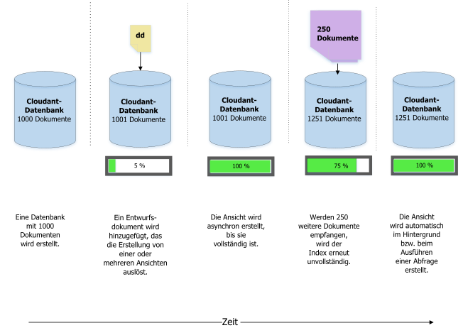
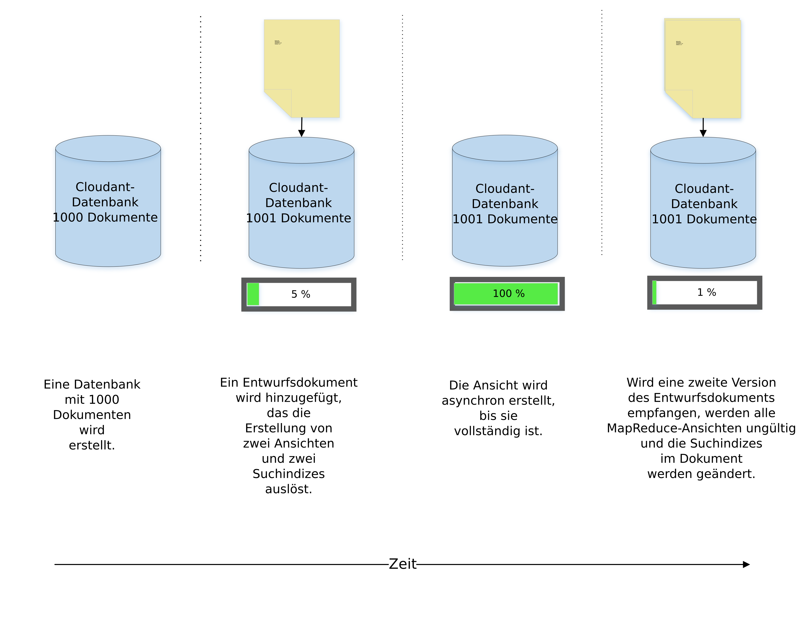
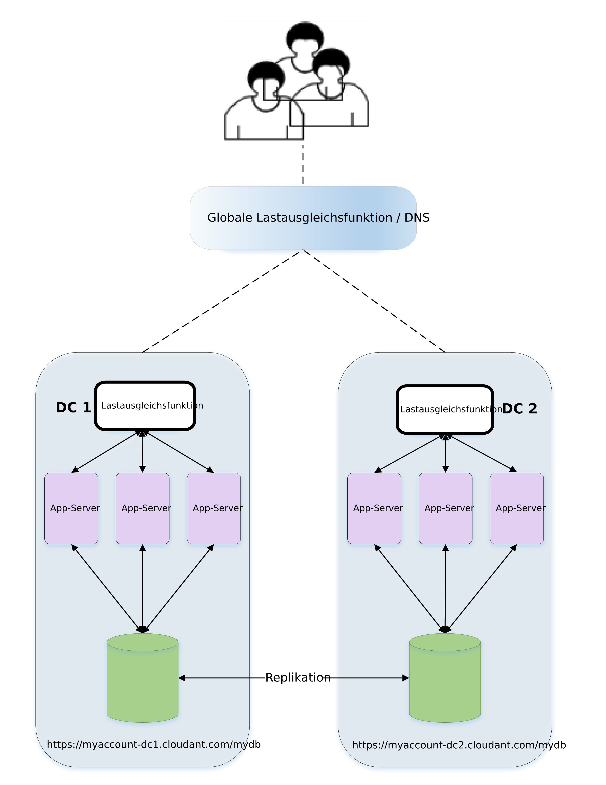

---

copyright:
  years: 2015, 2018
lastupdated: "2017-11-06"

---

{:new_window: target="_blank"}
{:shortdesc: .shortdesc}
{:screen: .screen}
{:codeblock: .codeblock}
{:pre: .pre}

# Entwurfsdokumentmanagement

*Beitrag von Glynn Bird, Developer Advocate bei IBM Cloudant,
[glynn@cloudant.com ](mailto:glynn@cloudant.com){:new_window}*

Der skalierbare JSON-Datenspeicher von {{site.data.keyword.cloudantfull}} verfügt über verschiedene Abfragemechanismen,
die allesamt Indizes generieren, die separat von den Kerndaten erstellt und verwaltet werden.
Die Indexierung wird nicht unmittelbar ausgeführt, wenn ein Dokument gespeichert wird.
Stattdessen wird das für einen späteren Zeitpunkt geplant, um einen höheren,
nicht blockierenden Schreibdurchsatz zu erzielen.

-   MapReduce-Ansichten sind Indizes zu einer Datei, deren Schlüssel/Wert-Paare in einem B-Tree gespeichert sind, damit sie einfacher nach Schlüssel oder Schlüsselbereich abgerufen werden können.
-   Suchindizes werden mithilfe von Apache Lucene erstellt, um eine Suche nach Text mit freiem Format,
    Facettierung und komplexe Ad-hoc-Abfragen zuzulassen.

Die {{site.data.keyword.cloudant_short_notm}}-[Suchindizes](../api/search.html) und [MapReduce-Ansichten](../api/creating_views.html)
werden durch Hinzufügen von Entwurfsdokumenten zu einer Datenbank konfiguriert.
Entwurfsdokumente sind JSON-Dokumente, die die Anweisungen dazu enthalten, wie die Ansicht oder der Index erstellt werden sollen.
Einfaches Beispiel:
Angenommen, wir haben eine einfache Sammlung von Datendokumenten,
ähnlich dem folgenden Beispiel.

_Beispiel eines einfachen Datendokuments:_

```json
{
    "_id": "23966717-5A6F-E581-AF79-BB55D6BBB613",
    "_rev": "1-96daf2e7c7c0c277d0a63c49b57919bc",
    "doc_name": "Markdown Reference",
    "body": "Lorem Ipsum",
    "ts": 1422358827
}
```
{:codeblock}

Jedes Datendokument enthält einen Namen, einen Hauptteil und eine Zeitmarke.
Wir möchten eine [MapReduce-Ansicht](../api/creating_views.html) erstellen, um unsere Dokumente nach Zeitmarke zu sortieren.

Dafür erstellen wird eine 'map'-Funktion ähnlich dem folgenden Beispiel.

_Beispiel einer 'map'-Funktion, die das Zeitmarkenfeld eines Dokuments zurückgibt, falls vorhanden:_

```javascript
function(doc) {
    if (doc.ts) {
        emit( doc.ts, null);
    }
}
```
{:codeblock}

Die Funktion gibt die Zeitmarke des Dokuments aus, sodass sie als Schlüssel für den Index genutzt werden kann.
Da wir nicht an dem Wert im Index interessiert sind, wird `null` ausgegeben.
So wird ein zeitlich sortierter Index in der Dokumentgruppe bereitgestellt.

Wir nennen diese Ansicht `by_ts` und fügen sie in ein Entwurfsdokument namens `fetch` ein,
wie im folgenden Beispiel.

_Beispiel eines Entwurfsdokuments, das eine Ansicht mithilfe einer 'map'-Funktion definiert:_

```json
{
    "_id": "_design/fetch",
    "views": {
      "by_ts": {
        "map": "function(doc) {
          if (doc.ts) {
            emit( doc.ts, null);
          }
        }"
      }
    },
    "language": "javascript"
}
```
{:codeblock}

Der 'map'-Code wurde in eine JSON-kompatible Zeichenfolge umgewandelt und in ein Entwurfsdokument eingefügt.

Sobald das Entwurfsdokument gespeichert wurde, löst
{{site.data.keyword.cloudant_short_notm}} serverseitige Prozesse aus, um die Ansicht `fetch/by_ts` zu erstellen.
Dies geschieht durch das Iterieren jedes Dokuments in der Datenbank und das anschließende Senden an die 'map'-Funktion von JavaScript.
Die Funktion gibt das ausgegebene Schlüssel/Wert-Paar zurück.
Im Verlauf der Iteration wird jedes Schlüssel/Wert-Paar in einem B-Tree-Index gespeichert.
Nach dem erstmaligen Erstellen des Index
werden bei allen nachfolgenden Indexierungsvorgängen nur neue und aktualisierte Dokumente einbezogen.
Gelöschte Dokumente werden aus dem Index entfernt.
Dieser zeitsparende Prozess ist als *inkrementeller MapReduce-Vorgang* bekannt,
wie im folgenden Diagramm gezeigt:



An dieser Stelle möchten wir Sie an Folgendes erinnern:

-   Die Erstellung eines Index vollzieht sich asynchron.
    {{site.data.keyword.cloudant_short_notm}} bestätigt, dass unser Entwurfsdokument gespeichert wurde,
    aber um den Fortschritt bei der Erstellung des Index zu prüfen, müssen wir den
    {{site.data.keyword.cloudant_short_notm}}-Endpunkt [`_active_tasks`](../api/active_tasks.html) abfragen.
-   Je mehr Daten vorhanden sind, desto länger dauert es, bis der Index bereit ist.
-   Während der anfänglichen Indexerstellung werden
    _alle Abfragen des Index blockiert_.
-   Die Abfrage einer Ansicht löst die Zuordnung aller Dokumente aus, die noch nicht inkrementell indiziert wurden.
    So wird sichergestellt, dass die Ansicht der Daten aktuell ist.
    In der folgenden Diskussion des [Parameters `stale`](#stale) erfahren Sie, welche
    Ausnahmen für diese Regel gelten.

## Mehrere Ansichten in demselben Entwurfsdokument

Wenn wir verschiedene Ansichten in demselben Entwurfsdokument definieren,
werden sie effektiv zum selben Zeitpunkt erstellt.
Jedes Dokument wird nur einmal gelesen und durchläuft die 'map'-Funktion jeder Ansicht.
Der Nachteil dieser Methode ist, dass durch das Ändern eines Entwurfsdokuments
_alle vorhandenen MapReduce-Ansichten_, die in diesem Dokument definiert sind, ungültig werden, selbst wenn manche Ansichten nicht geändert wurden. 

Falls MapReduce-Ansichten unabhängig voneinander geändert werden müssen, platzieren Sie ihre Definitionen in verschiedene Entwurfsdokumente. 

>   **Hinweis**: Dieses Verhalten gilt nicht für Lucene-Suchindizes.
    Sie können innerhalb desselben Entwurfsdokuments geändert werden,
    ohne dass andere, nicht geänderte Indizes in demselben Dokument ungültig werden.



## Änderungen an einem Entwurfsdokument verwalten

Angenommen, zu einem bestimmten Zeitpunkt in der Zukunft möchten wir das Design unserer Ansicht ändern.
Aber statt zum eigentlichen Zeitmarkenergebnis zurückzukehren,
sind wir nur an der Anzahl der Dokumente interessiert, die den Kriterien entsprechen.
Dafür bleibt die 'map'-Funktion unverändert,
aber wir verwenden die _reduce_-Funktion `_count`.
Unser Entwurfsdokument sieht in der Folge wie dieses Beispiel aus.

_Beispiel eines Entwurfsdokuments, das eine 'reduce'-Funktion verwendet:_

```json
{
    "_id": "_design/fetch",
    "_rev": "2-a2324c9e74a76d2a16179c56f5315dba",
    "views": {
        "by_ts": {
            "map": "function(doc) {
                if (doc.ts) {
                  emit( doc.ts, null);
                }
            }
        }",
        "reduce": "_count"
    },
    "language": "javascript"
}
```
{:codeblock}

Wenn dieses Entwurfsdokument gespeichert wird, macht
{{site.data.keyword.cloudant_short_notm}} den alten Index vollständig ungültig und startet die
Erstellung eines völlig neuen Index, wobei jedes einzelne Dokument iteriert wird.
Wie bei der ursprünglichen Erstellung hängt die dafür erforderliche Zeit von der Anzahl der Dokumente in
der Datenbank ab und alle eingehenden Abfragen dieser Ansicht werden während der Erstellung blockiert.

Aber es gibt ein Problem...

Greift eine Anwendung _in Echtzeit_ auf diese Ansicht zu,
kommt es zu einem Bereitstellungsdilemma:

-   Version 1 unseres Codes,
    die auf dem ursprünglichen Entwurfsdokument basiert,
    funktioniert unter Umständen nicht mehr, weil die alte Ansicht ungültig gemacht wurde.
-   Version 2 unseres Codes,
    die das neue Entwurfsdokument verwendet,
    kann nicht sofort freigegeben werden,
    weil die neue Ansicht noch nicht abschließend erstellt wurde,
    insbesondere bei einer hohen Anzahl von Dokumenten in der Datenbank.
-   Ein geringfügigeres Problem für unseren Code ist, dass Versionen 1 und 2 verschiedene Ergebnisdaten von der Ansicht erwarten:
    Version 1 erwartet eine Liste von passenden Dokumenten,
    während Version 2 eine durch die 'reduce'-Funktion bearbeitete Anzahl von Ergebnissen erwartet.

## Änderungen an Entwurfsdokumenten koordinieren

Es gibt zwei Arten, mit diesem Änderungsmanagementproblem umzugehen.

### Versionierte Entwurfsdokumente 

Eine Lösung ist, versionierte Entwurfsdokumentnamen zu verwenden:

-   Unser Code wurde ursprünglich geschrieben, um eine Ansicht namens `_design/fetchv1` zu verwenden.
-   Wenn wir eine neue Version freigeben, erstellen wir eine neue Ansicht namens `_design/fetchv2`
    und fragen diese Ansicht ab, um sicherzustellen, dass sie erstellt wird.
-   Wir fragen `_active_tasks` ab, bis die Erstellung des neuen Index abgeschlossen ist.
-   Jetzt können wir den Code freigeben, der von der zweiten Ansicht abhängt.
-   Löschen Sie `_design/fetchv1`, sobald Sie sicher sind, dass sie nicht mehr benötigt wird.

Die Verwendung versionierter Entwurfsdokumente ist eine einfache Methode für das Änderungsmanagement Ihrer Entwurfsdokumente,
vorausgesetzt, Sie denken daran, die älteren Versionen zu einem späteren Zeitpunkt zu entfernen.

### Entwurfsdokumente verschieben und wechseln

Eine andere Methode die
[hier ](http://wiki.apache.org/couchdb/How_to_deploy_view_changes_in_a_live_environment){:new_window}
beschrieben ist, verlässt sich darauf, dass {{site.data.keyword.cloudant_short_notm}} erkennt, wenn zwei identische Entwurfsdokumente
vorhanden sind, und keine Zeit und Ressourcen dafür verschwendet, bereits vorhandene Ansichten
ein zweites Mal zu erstellen.
Mit anderen Worten: Wenn wir von unserem Entwurfsdokument `_design/fetch` ein exaktes Duplikat `_design/fetch_OLD` erstellen,
funktionieren beide Endpunkte austauschbar, ohne eine erneute Indexierung auszulösen.

So wechseln Sie zur neuen Ansicht:

1.  Erstellen Sie eine Duplikatkopie des Entwurfsdokuments, das wir ändern möchten, z. B. indem Sie `_OLD` zum Namen hinzufügen:
    `_design/fetch_OLD`.
2.  Stellen Sie das neue oder eingehende Entwurfsdokument in die Datenbank ein,
    wobei Sie ihm einen Namen mit dem Suffix `_NEW` geben: `_design/fetch_NEW`.
3.  Fragen Sie die Ansicht `fetch_NEW` ab,
    um sicherzustellen, dass sie erstellt wird.
4.  Fragen Sie den Endpunkt `_active_tasks` ab und warten Sie, bis die Indexerstellung abgeschlossen ist.
5.  Stellen Sie eine Duplikatkopie des neuen Entwurfsdokuments in `_design/fetch` ein.
6.  Löschen Sie das Entwurfsdokument `_design/fetch_NEW`.
7.  Löschen Sie das Entwurfsdokument `_design/fetch_OLD`.

## Tools für das Verschieben und Wechseln

Es gibt ein Node.js-Befehlszeilenscript namens `couchmigrate`, das die Prozedur des Verschiebens und Wechselns automatisiert.
Es kann wie folgt installiert werden.

_Befehl für die Installation des Node.js-Scripts `couchmigrate`:_

```sh
npm install -g couchmigrate
```
{:codeblock}

Um das Script `couchmigrate` verwenden zu können, definieren Sie zunächst
die URL der CouchDB/{{site.data.keyword.cloudant_short_notm}}-Instanz, indem Sie eine
Umgebungsvariable namens `COUCH_URL` festlegen.

_Definition der URL der {{site.data.keyword.cloudant_short_notm}}-Instanz:_

```sh
export COUCH_URL=http://127.0.0.1:5984
```
{:codeblock}

Die URL kann HTTP oder HTTPS sein und Authentifizierungsnachweise enthalten.

_Definition der URL der {{site.data.keyword.cloudant_short_notm}}-Instanz mit Authentifizierungsnachweisen:_

```sh
export COUCH_URL=https://$ACCOUNT:$PASSWORD@$HOST.cloudant.com
```
{:codeblock}

Angenommen, wir verfügen über ein Entwurfsdokument im JSON-Format,
das in einer Datei gespeichert ist. Dann können wir den Befehl zum Migrieren
ausführen.

In diesem Beispiel gibt
`db` den Namen der zu ändernden Datenbank
und `dd` den Pfad zu unserer Datei mit dem Entwurfsdokument an.

_Ausführen des Befehls `couchmigrate`:_

```sh
couchmigrate --db mydb --dd /path/to/my/dd.json
```
{:pre}

Das Script koordiniert die Prozedur des Verschiebens und Wechselns,
wobei es wartet, bis die Ansicht erstellt ist, bevor es zurückkehrt.
Falls das eingehende Entwurfsdokument dem etablierten entspricht,
kehrt das Script praktisch sofort zurück.

Den Quellcode für das Script finden Sie hier:
[https://github.com/glynnbird/couchmigrate ](https://github.com/glynnbird/couchmigrate){:new_window}.

<div id="stale"></div>

## Parameter `stale`

Falls ein Index abgeschlossen wurde, aber neue Datensätze zur
Datenbank hinzugefügt werden, wird das Update des Index im Hintergrund
geplant.
Dies ist der Status der Datenbank, die im folgenden Diagramm dargestellt ist:



Bei der Abfrage der Ansicht haben wir drei Möglichkeiten:

-   Beim Standardverhalten wird sichergestellt, dass der Index aktuell ist, d. h. dass er die aktuellen Dokumente in der Datenbank enthält,
    bevor die Antwort zurückgegeben wird.
    Wenn wir die Ansicht abfragen,
    indiziert {{site.data.keyword.cloudant_short_notm}} zuerst die 250 neuen Dokumente
    und gibt dann die Antwort zurück.
-   Alternativ können Sie den Parameter `stale=ok` zum API-Aufruf hinzufügen.
    Der Parameter veranlasst, dass die bereits indizierten Daten zurückgegeben
    und neue Aktualisierungen nicht berücksichtigt werden.
    Mit anderen Worten:
    Wenn Sie die Ansicht mit `stale=ok` abfragen,
    gibt {{site.data.keyword.cloudant_short_notm}} die Antwort sofort zurück,
    ohne zusätzliche Neuindexierung.
-   Eine zweite Alternative ist das Hinzufügen des Parameters `stale=update_after` zum API-Aufruf.
    Der Parameter veranlasst, dass die bereits indizierten Daten zurückgegeben
    _und_ anschließend alle neuen Dokumente neu indiziert werden.
    Mit anderen Worten:
    Wenn Sie die Ansicht mit `stale=update_after` abfragen,
    gibt {{site.data.keyword.cloudant_short_notm}} die Antwort sofort zurück,
    und plant dann eine Hintergrundtask zum Indizieren der neuen Daten.

`stale=ok` oder `stale=update_after` hinzuzufügen, kann eine gute Methode sein, Antworten schneller von einer Ansicht zu bekommen,
aber sie geht auf Kosten der Aktualität der Daten. 

>   **Hinweise**: Das Standardverhalten verteilt die Arbeitslast gleichmäßig auf die Konten im {{site.data.keyword.cloudant_short_notm}}-Cluster.
    Wenn Sie die alternativen Optionen `stale=ok` oder `stale=update_after` nutzen,
    wird unter Umständen eine Untergruppe von Clusterknoten bevorzugt bedient,
    um konsistente Ergebnisse aus einer sukzessive konsistenten Gruppe zurückzugeben.
    Das bedeutet, dass der Parameter `stale` keine perfekte Lösung für alle Anwendungsszenarios ist.
    Er kann jedoch nützlich sein beim Bereitstellen zeitgerechter Antworten zu sich schnell ändernden Datengruppen,
    wenn Ihre Anwendung nicht aktuelle Ergebnisse akzeptiert.
    Wenn sich Ihre Daten nicht so häufig ändern,
    bietet `stale=ok` oder `stale=update_after` keinen entscheidenden Leistungsvorteil
    und verteilt die Arbeitslast unter Umständen ungleichmäßig in größeren Clustern.

Vermeiden Sie wann immer möglich, `stale=ok` oder `stale=update_after` zu verwenden.
Das Standardverhalten stellt die aktuellsten Daten bereit und verteilt sie im gesamten Cluster.
Wenn es möglich ist, eine Client-App darauf aufmerksam zu machen, dass eine umfangreiche Datenverarbeitungstask gerade ausgeführt wird
(beispielsweise eine regelmäßige Massendatenaktualisierung), könnte die App während dieser Zeit temporär zu `stale=ok` wechseln
und anschließend zum Standardverhalten zurückkehren.

>   **Hinweis**: Die Option `stale` ist noch verfügbar,
    aber die leistungsfähigeren Optionen `stable` und `update` sollten stattdessen verwendet werden.
    Genauere Angaben finden Sie unter [Auf eine veraltete Ansicht zugreifen](../api/using_views.html#accessing-a-stale-view).
