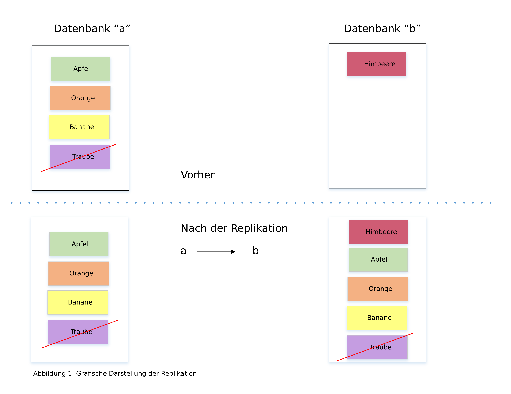
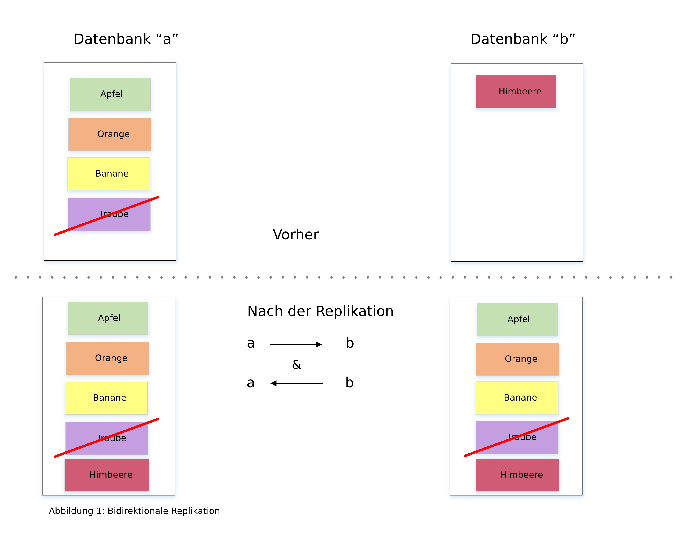

---

copyright:
  years: 2015, 2019
lastupdated: "2019-03-15"

keywords: start replicating with dashboard, run replication across different accounts, run replication on source or destination, start replication with api, checkpoints, permissions, two-way replication, continuous replication, monitoring replication, canceling replication, filtered replication, changes feed, pitfalls, tuning replication speed

subcollection: cloudant

---

{:new_window: target="_blank"}
{:shortdesc: .shortdesc}
{:screen: .screen}
{:codeblock: .codeblock}
{:pre: .pre}
{:tip: .tip}
{:note: .note}
{:important: .important}
{:deprecated: .deprecated}

<!-- Acrolinx: 2017-05-10 -->

# Leitfaden zur Replikation
{: #replication-guide}

Daten können aus einer Datenbank in eine andere Datenbank im selben {{site.data.keyword.cloudantfull}}-Konto, über Konten
und Rechenzentren hinweg, kopiert werden.
{: shortdesc}

Daten können sogar zwischen einem {{site.data.keyword.cloudant_short_notm}}-Konto und einem mobilen Gerät repliziert werden - mithilfe von [{{site.data.keyword.cloudant_short_notm}} Sync ](https://cloudant.com/product/cloudant-features/sync/){: new_window} oder [PouchDB ](http://pouchdb.com/){: new_window}.
Die Replikation kann in einer oder in beiden Richtungen erfolgen,
als einmalige oder kontinuierliche Operation,
und sie kann mithilfe von Parametern optimiert werden.

Das Replikationsprotokoll von {{site.data.keyword.cloudant_short_notm}} ist mit einer Reihe von anderen Datenbanken
und Bibliotheken kompatibel, was es zu einer hervorragenden Ergänzung des Internet of Things (IoT) und mobiler Anwendungen macht.

Dieser Leitfaden führt Sie in die Replikationsfunktionen von {{site.data.keyword.cloudant_short_notm}} ein,
erläutert gängige Anwendungsfälle und zeigt, wie Sie Ihre Anwendung einrichten können, damit sie die Replikation
erfolgreich durchführen kann.

## Was ist Replikation?
{: #what-is-replication}

{{site.data.keyword.cloudant_short_notm}} ist ein verteilter JSON-Datenspeicher mit einer HTTP-API.
{{site.data.keyword.cloudant_short_notm}} kann als Service in mehreren Clouds oder in Ihrem
Server-Rack ausgeführt werden.
Dokumente werden in Datenbanken gespeichert und können jede Größe annehmen, da {{site.data.keyword.cloudant_short_notm}} die zugehörigen
Daten über viele Knoten verteilt.
Replikation ist das Kopieren von Daten aus einer Quellendatenbank in eine Zieldatenbank.
Die Quellen- und Zieldatenbanken müssen sich nicht im selben {{site.data.keyword.cloudant_short_notm}}-Konto
und auch nicht im selben Rechenzentrum befinden.



Die Replikation ist abgeschlossen, wenn die aktuelle Version jedes Dokuments in der Quelle in die Zieldatenbank übertragen wird.
Diese Übertragungen umfassen neue Dokumente, Aktualisierungen an vorhandenen Dokumenten und Löschungen.
Nur die aktuelle Version eines Dokuments bleibt nach der Replikation bestehen. Ältere Versionen werden weggelassen.

Die Quellendatenbank bleibt durch die Replikation unverändert,
abgesehen von Prüfpunktdaten, die in die Datenbank geschrieben werden, damit partielle Replikationen an der letzten bekannten Position fortgesetzt werden können.
Alle bereits vorhandenen Daten in der Zieldatenbank bleiben bestehen.

## Vorgehensweise zum Starten der Replikation über das Dashboard
{: #how-to-start-replication-by-using-the-dashboard}

Das {{site.data.keyword.cloudant_short_notm}}-Dashboard stellt eine komfortable Benutzerschnittstelle zum Auslösen der Replikation bereit.
Klicken Sie auf die Registerkarte `Replikation` im {{site.data.keyword.cloudant_short_notm}}-Dashboard und dann auf `Replikation starten`.
Füllen Sie das Formular aus:


Aus Sicherheitsgründen empfiehlt das {{site.data.keyword.cloudant_short_notm}}-Team, dass Sie für Replikationsjobs IAM-API-Schlüssel oder [API-Schlüssel](/docs/services/Cloudant?topic=cloudant-authorization#api-keys){: new_window} der traditionellen {{site.data.keyword.cloudant_short_notm}}-Authentifizierung verwenden und keine Berechtigungsnachweise auf Kontoebene. Weitere Informationen hierzu finden Sie im [IAM-Leitfaden](/docs/services/Cloudant?topic=cloudant-ibm-cloud-identity-and-access-management-iam-#ibm-cloud-identity-and-access-management-iam-){: new_window} oder in der traditionellen Version des [Dokuments für die Authentifizierungs-API](/docs/services/Cloudant?topic=cloudant-authentication#authentication){: new_window} und in der traditionellen Version des [Dokuments für die Berechtigungs-API](/docs/services/Cloudant?topic=cloudant-authorization#authorization){: new_window}.{: important}

Definieren Sie mithilfe des Formulars die Quellen- und Zieldatenbanken und klicken Sie dann auf`Replikation starten`.


Der Status der einzelnen Replikationstasks kann angezeigt werden, indem Sie auf die Registerkarte `Replikation` klicken.
Die Statusangaben der einzelnen Jobs ändern sich im Zeitverlauf von `Aktiv` in `Abgeschlossen`.


## Replikation über verschiedene {{site.data.keyword.cloudant_short_notm}}-Konten ausführen
{: #how-to-run-replication-across-different-ibm-cloudant-accounts}

Die Quelle und das Ziel einer Replikation sind URLs von {{site.data.keyword.cloudant_short_notm}}-Datenbanken,
wie im folgenden Beispiel gezeigt.

_Beispiel für das Definieren der Quellen- und Ziel-URLs für die Replikation:_

```json
{
    "source": "https://myfirstaccount.cloudant.com/a",
    "target": "https://mysecondaccount.cloudant.com/b"
}
```
{: codeblock}

Die Quelle und das Ziel müssen sich nicht in demselben Konto befinden.
Die Quellen- und Zieldatenbankennamen müssen nicht übereinstimmen.
Sie müssen berechtigt sein, sowohl auf die Quelle, als auch auf das Ziel zuzugreifen,
und Sie müssen berechtigt sein, in das Ziel zu schreiben.

## Wird Replikation in der Quelle oder im Ziel ausgeführt?
{: #is-replication-run-on-the-source-or-the-destination}

Die Replikation kann entweder in der Quelle oder im Ziel gestartet werden.
Das heißt, Sie entscheiden, ob Konto A Daten nach Konto B schiebt oder Konto B Daten von Konto A abruft.
In manchen Fällen kann es unmöglich sein, die Replikation überhaupt auszuführen, z. B. wenn ein Konto sich hinter der Firewall befindet.
Die Replikation wird über HTTP oder HTTPS ausgeführt, deshalb müssen vom Standard abweichende Ports geöffnet werden.
Sie treffen die Entscheidung, welches Gerät die Replikation startet.

## Replikation mithilfe der {{site.data.keyword.cloudant_short_notm}}-API starten
{: #how-to-start-replication-by-using-the-ibm-cloudant-api}

Jedes {{site.data.keyword.cloudant_short_notm}}-Konto hat eine spezielle Datenbank namens `_replicator`,
in die Replikationsjobs eingefügt werden können.
Fügen Sie ein Dokument in der Datenbank `_replicator` hinzu, um die Replikation zu starten.
Das Dokument beschreibt die gewünschte Replikation und enthält die folgenden Felder:

Feld           | Zweck
----------------|--------
`_id`           | Angabe des Felds `_id` ist optional, kann aber hilfreich sein, um Replikationstasks zu identifizieren. {{site.data.keyword.cloudant_short_notm}} generiert einen Wert für Sie, falls Sie keinen angeben.
`source`        | URL der {{site.data.keyword.cloudant_short_notm}}-Quellendatenbank, einschließlich Anmeldeberechtigungsnachweisen.
`target`        | URL der {{site.data.keyword.cloudant_short_notm}}-Zieldatenbank, einschließlich Anmeldeberechtigungsnachweisen.
`create_target` | (Optional) Bestimmen Sie, ob die Zieldatenbank erstellt werden soll, falls sie nicht vorhanden ist.

_Beispiel für die Verwendung von HTTP zum Starten eines Replikationsjobs:_

```http
POST /_replicator HTTP/1.1
Content-Type: application/json
Host: $ACCOUNT.cloudant.com
Authorization: ...
```
{: codeblock}

_Beispiel für die Verwendung einer Befehlszeile zum Starten eines Replikationsjobs:_

```sh
curl -X POST \
    -H 'Content-type: application/json' \
    'https://$ACCOUNT.cloudant.com/_replicator' \
    -d '@replication.json'
```
{: codeblock}

_Beispiel für ein JSON-Dokument, das die gewünschte Replikation beschreibt:_

```json
{
    "_id": "weekly_backup",
    "source": "https://$ACCOUNT:$PASSWORD@$ACCOUNT1.cloudant.com/source",
    "target": "https://$ACCOUNT:$PASSWORD@$ACCOUNT2.cloudant.com/destination",
    "create_target": true
}
```
{: codeblock}

## Wie wirkt sich die Replikation auf die Liste von Änderungen aus?
{: #how-does-replication-affect-the-list-of-changes-}

Sie können eine Liste der Änderungen, die an einem Dokument vorgenommen wurden, mithilfe des
Endpunkts [`_changes` abrufen](/docs/services/Cloudant?topic=cloudant-databases#get-changes).
Allerdings führt die verteilte Struktur von {{site.data.keyword.cloudant_short_notm}}-Datenbanken
dazu, dass die vom Feed `_changes` bereitgestellte Antwort
keine einfache Liste von Änderungen sein kann, die nach einem bestimmten Datum und einer bestimmten Uhrzeit ausgeführt wurden.

Die Besprechung des [CAP-Theorems](/docs/services/Cloudant?topic=cloudant-cap-theorem#cap-theorem) macht deutlich, dass
{{site.data.keyword.cloudant_short_notm}} ein sukzessive konsistentes Modell einsetzt.
Das heißt in der Praxis: Wenn Sie zwei verschiedene Replikate einer Datenbank zum selben Zeitpunkt nach einem Dokument fragen,
erhalten Sie unter Umständen verschiedene Ergebnisse, falls die Replikation einer der Datenbankkopien noch aussteht oder noch nicht abgeschlossen ist.
Die Replikation der Datenbanken wird sukzessive abgeschlossen, damit alle
Änderungen an einem Dokument in allen Kopien widergespiegelt werden. 

Dieses Modell der sukzessiven Konsistenz hat zwei Merkmale, die sich auf eine Liste von Änderungen auswirken:

1.  Eine Änderung, die ein Dokument betrifft, erfolgt fast sicher an unterschiedlichen Zeitpunkten in verschiedenen Kopien der Datenbank.
2.  Die Reihenfolge, in der Änderungen Dokumente betreffen, kann sich zwischen verschiedenen Kopien der Datenbank unterscheiden,
    abhängig davon, wann und wo die Replikation gestartet wurde.

Eine Folge des ersten Merkmals ist: Wenn Sie nach einer Liste von Änderungen fragen,
spielt der Zeitpunkt der Änderungen keine Rolle.
Die Liste wird unter Umständen von einer anderen Datenbankkopie bereitgestellt,
in der Dokumentaktualisierungen zu anderen Zeitpunkten ausgeführt wurden.
Allerdings _ist_ es wichtig, nach einer Liste von Änderungen im Anschluss an eine bestimmte Änderung zu fragen,
die durch eine Sequenz-ID angegeben wird.

Eine weitere Folge des ersten Merkmals ist, dass es notwendig sein kann, einen Blick
auf frühere Änderungen zu werfen, um sich auf eine Liste von Änderungen zu einigen.
Mit anderen Worten: Um eine Liste von Änderungen abzurufen, starten Sie mit der letzten Änderung, die in beiden Datenbankkopien vorgenommen wurde.
Diese Übereinstimmung zwischen Datenbankkopien wird in
{{site.data.keyword.cloudant_short_notm}} mithilfe des [Prüfpunkt](#checkpoints)mechanismus angegeben,
der die Replikation zwischen zu synchronisierenden Datenbanken ermöglicht.

Und schließlich ist eine Folge des zweiten Merkmals, dass die individuellen Änderungen, die in
der Liste von Änderungen enthalten sind, in nachfolgenden Anforderungen, die von einer anderen Datenbankkopie
beantwortet werden, in abweichender Reihenfolge dargestellt sind.
Mit anderen Worten: Eine erste Liste von Änderungen berichtet die Änderungen `A`,
`B` und dann `C` in dieser Reihenfolge.
Aber eine nachfolgende Liste von Änderungen gibt die Änderungen `C`,
`A` und dann `B` in dieser Reihenfolge wieder.
Alle Änderungen sind aufgeführt, aber in einer anderen Reihenfolge.
Der Unterschied kommt dadurch zustande, dass die Abfolge von Änderungen, die während der Replikation
empfangen werden, zwischen verschiedenen Kopien der Datenbank abweichen kann.

### Auswirkung der sukzessiven Konsistenz auf die Liste von Änderungen
{: #what-eventual-consistency-means-for-the-list-of-changes}

Wenn Sie eine Liste von Änderungen anfordern, kann die Antwort abhängig davon variieren, von welcher Datenbankkopie die Liste bereitgestellt wird.

Wenn Sie die Option `since` nutzen, um eine Liste von Änderungen nach einer bestimmten Aktualisierungssequenz-ID abzurufen,
erhalten Sie immer eine Liste von Änderungen nach dieser Aktualisierung _und_ möglicherweise einige Änderungen von vor der Aktualisierung.
Der Grund dafür ist, dass die Datenbankkopie, die auf die Listenanforderung antwortet, sicherstellen muss, dass sie
alle Änderungen aufführt, konsistent mit allen Replikaten.
Um diese Konsistenz zu erzielen, muss die Datenbankkopie die Liste von Änderungen
ab dem Punkt beginnen, an dem alle Kopien identisch waren.
Dieser Punkt wird mithilfe von Prüfpunkten angegeben.

Deshalb muss eine Anwendung, die den Feed `_changes` verwendet, [idempotent ](http://www.eaipatterns.com/IdempotentReceiver.html){: new_window} sein.
Idempotenz bedeutet, dass die Anwendung dieselben Daten sicher mehrfach und für wiederholte Anforderungen potenziell in einer anderen Reihenfolge empfangen kann.

## Prüfpunkte
{: #checkpoints}

Intern schreibt der Replikationsprozess seinen Status in Prüfpunktdokumente, die sowohl
in den Quellen- als auch in den Zieldatenbanken gespeichert werden.
Prüfpunkte lassen zu, dass eine Replikationstask ab dem Punkt fortgesetzt wird, an der sie gestoppt wurde.
Das Erstellen von Prüfpunkten kann vermieden werden, indem Sie die Option
[`"use_checkpoints": false`](/docs/services/Cloudant?topic=cloudant-replication-api#replication-document-format) angeben, wenn Sie Replikation anfordern.
Es ist sinnvoll, die Funktion aktiviert zu lassen, wenn Ihre Replikation effizienterweise an ihrer zuletzt bekannten Position fortgesetzt werden soll.

## Berechtigungen
{: #permissions}

Administratorzugriff ist erforderlich, um ein Dokument in die Datenbank `_replicator` einzufügen.
Die Anmeldeberechtigungsnachweise, die in den Quellen- und Zielparametern angegebenen sind, benötigen keine umfassenden Administratorberechtigungen.
Es reicht aus, wenn die Berechtigungsnachweise Folgendes dürfen:

-   Dokumente im Ziel schreiben.
-   Prüfpunktdokumente in der Quelle und im Ziel schreiben.

{{site.data.keyword.cloudant_short_notm}} verfügt über die spezielle Benutzerberechtigung `_replicator`.
Mit dieser Berechtigung können Prüfpunktdokumente erstellt werden,
aber keine normalen Dokumente in einer Datenbank.
Allgemein sollten Sie
[API-Schlüssel erstellen](/docs/services/Cloudant?topic=cloudant-authorization#creating-api-keys) mit:

-   `_reader`- und `_replicator`-Zugriff auf Quellenseite.
-   `_reader`- und `_writer`-Zugriff auf Zielseite.

API-Schlüssel können im {{site.data.keyword.cloudant_short_notm}}-Dashboard pro Datenbank erstellt und
konfiguriert werden.


Sie können auch [programmgesteuert](/docs/services/Cloudant?topic=cloudant-authorization#creating-api-keys) mithilfe der {{site.data.keyword.cloudant_short_notm}}-API erstellt werden.

Aus Sicherheitsgründen empfiehlt das {{site.data.keyword.cloudant_short_notm}}-Team, dass Sie für Replikationsjobs IAM-API-Schlüssel oder [API-Schlüssel](/docs/services/Cloudant?topic=cloudant-authorization#creating-api-keys){: new_window} der traditionellen {{site.data.keyword.cloudant_short_notm}}-Authentifizierung verwenden und keine Berechtigungsnachweise auf Kontoebene. Weitere Informationen hierzu finden Sie im [IAM-Leitfaden](/docs/services/Cloudant?topic=cloudant-ibm-cloud-identity-and-access-management-iam-#ibm-cloud-identity-and-access-management-iam-){: new_window} oder in der früheren Version des [Dokuments für die Berechtigungs-API](/docs/services/Cloudant?topic=cloudant-authentication#authentication){: new_window} und in einer früheren Version des [Dokuments für die Berechtigungs-API](/docs/services/Cloudant?topic=cloudant-authorization#authorization){: new_window}.{: important}

## Bidirektionale Replikation
{: #two-way-replication}

Daten können in einem Prozess, der als bidirektionale Replikation oder Synchronisierung bekannt ist, in beide Richtungen kopiert werden.
Sie aktivieren diese Synchronisierung, indem Sie zwei separate Replikationsprozesse einrichten,
einen, bei dem die Daten von A nach B kopiert werden, und einen, bei dem die Daten von B nach A
kopiert werden.
Die beiden Replikationsprozesse arbeiten unabhängig, wobei die Daten nahtlos in beide Richtungen
bewegt werden.



## Erörterung der fortlaufenden Replikation
{: #discussion-about-continuous-replication}

Bisher haben wir uns nur mit der Einmalreplikation befasst,
die fertiggestellt ist, wenn alle Quellendaten in die Zieldatenbank geschrieben sind.
Bei einer fortlaufenden Replikation fließen die Daten kontinuierlich.
Alle nachfolgenden Änderungen an der Quellendatenbank werden in Echtzeit in die Zieldatenbank übertragen.

Eine fortlaufende Replikation wird ausgelöst, indem Sie auf das Kontrollkästchen klicken, mit dem Sie die `Replikation als fortlaufend definieren` können,
wenn Sie eine Replikationstask im {{site.data.keyword.cloudant_short_notm}}-Dashboard definieren,
oder indem Sie das Flag [`continuous`](/docs/services/Cloudant?topic=cloudant-replication-api#replication-document-format) in der
{{site.data.keyword.cloudant_short_notm}}-API festlegen.

Eine bidirektionale Replikation kann in eine der beiden Richtungen oder in beiden Richtungen als fortlaufend definiert werden,
indem Sie das Flag `continuous` festlegen.

_Beispiel für die Verwendung von HTTP zum Starten einer kontinuierlichen Replikation:_

```http
POST /_replicator HTTP/1.1
Content-Type: application/json
Host: $ACCOUNT.cloudant.com
Authorization: ...
```
{: codeblock}

_Beispiel für die Verwendung der Befehlszeile zum Starten einer fortlaufenden Replikation:_

```sh
curl -X POST \
    -H "Content-type: application/json" \
    https://$ACCOUNT.cloudant.com/_replicator \
    -d @continuous-replication.json
```
{: codeblock}

_Beispiel für ein JSON-Dokument, das eine fortlaufende Replikation definiert:_

```json
{
    "_id": "weekly_continuous_backup",
    "source": "https://$ACCOUNT:$PASSWORD@$ACCOUNT1.cloudant.com/source",
    "target": "https://$ACCOUNT:$PASSWORD@$ACCOUNT2.cloudant.com/destination",
    "continuous": true
}
```
{: codeblock}

## Replikationsstatus überwachen
{: #monitoring-replication-status}

Sie können den Status der {{site.data.keyword.cloudant_short_notm}}-Datenbank `_replicator` jederzeit mithilfe
des Dashboards oder der API prüfen.

Wenn die Replikation fehlschlägt, z. B. falls die Authentifizierungsnachweise ungültig sind, wird der Fehlerstatus im Dokument `_replicator` aufgezeichnet.
Darüber hinaus kann der Endpunkt [`/_active_tasks`](/docs/services/Cloudant?topic=cloudant-active-tasks#active-tasks)
des {{site.data.keyword.cloudant_short_notm}}-Kontos verwendet werden, um den Fortschritt der Replikation zu verfolgen.

_Beispiel für die Verwendung von HTTP zum Überwachen eines Replikationsprozesses:_

```http
GET /_replicator/weekly_backup HTTP/1.1
HOST: $ACCOUNT.cloudant.com
Authorization: ...
```
{: codeblock}

_Beispiel für die Verwendung der Befehlszeile zum Überwachen eines Replikationsprozesses:_

```sh
curl 'https://$ACCOUNT.cloudant.com/_replicator/weekly_backup'
```
{: codeblock}

_Beispielantwort auf die Anforderung des Status einer Replikation:_

```json
{
    "_id": "weekly_backup",
    "_rev": "22-c57c18f7e761f1a76fa977caa03cd098",
    "source": "https://u:p@myaccount.cloudant.com/a",
    "create_target": false,
    "target": "https://u:p@myaccount.cloudant.com/b",
    "continuous": true,
    "_replication_state": "triggered",
    "_replication_state_time": "2014-12-01T15:19:01+00:00",
    "_replication_id": "4514b08cb4c2ded7da9ab04a87182ceb"
}
```
{: codeblock}

Wenn beim Replizieren Dokumente oder Anhänge den maximalen Grenzwert für das Ziel überschreiten, schlägt die Replikation fehl. Jeder Schreibfehler für ein Dokument erhöht den Zähler für die Replikationsstatistik in `doc_write_failures`. Aus diesem Grund wird dringend empfohlen, dieses Feld zu überwachen. 

## Replikation abbrechen
{: #canceling-replication}

Um einen laufenden Replikationsjob zu stoppen, löschen Sie das
Replikationsdokument entweder über das Dashboard oder über die API aus der Datenbank `_replicator`.

_Beispiel für die Verwendung von HTTP zum Abbrechen einer Replikation:_

```http
DELETE /_replicator/weekly_backup?rev=22-c57c18f7e761f1a76fa977caa03cd098 HTTP/1.1
Host: $ACCOUNT.cloudant.com
Authorization:
```
{: codeblock}

_Beispiel für die Verwendung der Befehlszeile zum Abbrechen einer Replikation:_

```sh
curl -X DELETE 'https://$ACCOUNT.cloudant.com/_replicator/weekly_backup?rev=22-c57c18f7e761f1a76fa977caa03cd098'
```
{: codeblock}

## Weitere Replikationsanwendungsfälle
{: #other-replication-use-cases}

Das Replikationsprotokoll von {{site.data.keyword.cloudant_short_notm}} ist kompatibel mit anderen Datenbanken und Bibliotheken für verschiedene in der Praxis eingesetzte Anwendungen.

### Apache CouchDB
{: #apache-couchdb}

[Apache CouchDB ](http://couchdb.apache.org/){: new_window} ist eine Open-Source-Datenbank,
die mit {{site.data.keyword.cloudant_short_notm}} kommunizieren kann und nur eine minimale Konfiguration erfordert.
Anwendungen sind:

-   Sicherung: Replizieren Sie Ihre Daten aus {{site.data.keyword.cloudant_short_notm}} in Ihre eigenen CouchDB-Datenbanken
    und erstellen Sie nächtliche Momentaufnahmen Ihrer Daten für Archivierungszwecke.
    Senden Sie die Daten zur Aufbewahrung an einen Sicherungsservice, z. B.
    [Amazon Glacier ](https://aws.amazon.com/glacier/){: new_window}.
-   Zuerst lokale Datenerfassung: Schreiben Sie Ihre Daten zunächst in die lokale Apache CouchDB-Instanz,
    replizieren Sie sie dann für eine Langzeitspeicherung, -aggregation und -analyse nach {{site.data.keyword.cloudant_short_notm}}.

### PouchDB
{: #pouchdb}

[PouchDB ](http://pouchdb.com/){: new_window} ist eine
Open-Source-, In-Browser-Datenbank, die es ermöglicht, Daten bidirektional zwischen dem Browser und {{site.data.keyword.cloudant_short_notm}} zu replizieren.
Dank des Speicherns von Daten in einem Web-Browser auf Clientseite können Webanwendungen auch ohne Internetverbindung funktionieren.
PouchDB kann alle geänderten Daten mit {{site.data.keyword.cloudant_short_notm}} synchronisieren, wenn eine Internetverbindung besteht.
Zum Einrichten einer Replikation auf Clientseite müssen ein paar Zeilen JavaScript geschrieben werden.

_Beispiel-JavaScript, das PouchDB verwendet, um Replikation zu aktivieren:_

```javascript
var db = new PouchDB("myfirstdatabase");
var URL = "https://u:p@username.cloudant.com/my_database");
db.sync(URL, { live: true });
```
{: codeblock}

### CloudantSync
{: #cloudantsync}

[CloudantSync ](https://cloudant.com/cloudant-sync-resources/){: new_window} ist eine
Bibliothekengruppe für iOS und Android, mit der Daten lokal auf mobilen Geräten gespeichert und
mit {{site.data.keyword.cloudant_short_notm}} synchronisiert werden können, wenn das mobile Gerät verbunden ist.
Wie bei [PouchDB](#pouchdb) auch, müssen für die Konfiguration der Replikation einige Zeilen Code geschrieben werden.

_Beispiel-JavaScript, das CloudantSync verwendet, um Replikation zu aktivieren:_

```javascript
URI uri = new URI("https://u:p@username.cloudant.com/my_database");
Datastore ds = manager.openDatastore("my_datastore");
// Replikation von der lokalen zur fernen Datenbank
Replicator replicator = ReplicatorFactory.oneway(ds, uri);
// Fire-and-forget (mit einfachen Möglichkeiten, den Status zu überwachen)
replicator.start();
```
{: codeblock}

CloudantSync wird häufig in mobilen Anwendungen wie iPhone- und Android-Spielen verwendet,
wobei der Status der Anwendung in {{site.data.keyword.cloudant_short_notm}} dauerhaft eingetragen wird,
aber die Daten können auf dem Gerät auch offline verwendet werden.

## Gefilterte Replikationen
{: #filtered-replications}

Es ist nützlich, Daten während des Replikationsprozesses entfernen zu können,
wenn Sie eine Datenbank in eine andere replizieren.
Beispiele hierfür sind:

-   Entfernen aller Spuren gelöschter Dokumente,
    wodurch die Zieldatenbank kleiner als die Quelle ist.
-   Unterteilen von Daten in kleinere Blöcke, z. B. Speichern von Daten aus Großbritannien in einer Datenbank und von Daten aus USA in einer anderen.

### Replikationsfilterfunktionen
{: #replication-filter-functions}

Die gefilterte Replikation in {{site.data.keyword.cloudant_short_notm}} ermöglicht die Definition einer JavaScript-Funktion, die den
Rückgabewert verwendet, um zu bestimmen, ob die einzelnen Dokumente in einer Datenbank gefiltert werden sollen oder nicht.
[Filterfunktionen](/docs/services/Cloudant?topic=cloudant-design-documents#filter-functions) werden in [Entwurfsdokumenten](/docs/services/Cloudant?topic=cloudant-design-documents#design-documents) gespeichert.

Das folgende Beispiel ist eine Filterfunktion, die nur die Replikation von nicht gelöschten Dokumenten zulässt.

_Beispielfilterfunktion für die Replikation von nicht gelöschten Dokumenten:_

```javascript
function(doc, req) {
    if (doc._deleted) {
        return false;
    }
    return true;
}
```
{: codeblock}

Wenn ein Replikationsjob gestartet wird,
wird der Name einer Filterfunktion als Kombination des Entwurfsdokuments, in dem der Job gespeichert ist,
und dem Namen der Filterfunktion angegeben.
Sie können auch einen Wert `query_params` angeben.
Dieser Wert ist ein Objekt, das Eigenschaften enthält, die an die Filterfunktion im
Feld `query` des zweiten Arguments (`req`) weitergegeben werden.

_Beispiel für die Verwendung von HTTP zum Starten einer gefilterten Replikation:_

```http
POST /_replicator HTTP/1.1
Content-Type: application/json
Host: $ACCOUNT.cloudant.com
Authorization: ...
```
{: codeblock}

_Beispiel für die Verwendung der Befehlszeile zum Starten einer gefilterten Replikation:_

```sh
curl -X POST \
    -H "Content-type: application/json" \
    https://$ACCOUNT.cloudant.com/_replicator \
    -d @filtered-replication.json
```
{: codeblock}

_Beispiel für ein JSON-Dokument, das eine gefilterte Replikation definiert wird:_

```json
{
    "_id": "weekly_backup",
    "source": "https://$ACCOUNT:$PASSWORD@$ACCOUNT1.cloudant.com/source",
    "target": "https://$ACCOUNT:$PASSWORD@$ACCOUNT2.cloudant.com/destination",
    "filter": "mydesigndoc/myfilter",
    "query_params": {
        "foo": "bar",
        "baz": 5
    }
}
```
{: codeblock}

## Feed mit Änderungen
{: #changes-feed}

{{site.data.keyword.cloudant_short_notm}} veröffentlicht die Hinzufügungen, Bearbeitungen
und Löschungen, die sich auf die Datenbank auswirken, über einen einzelnen HTTP-Feed
vom Endpunkt [`_changes`](/docs/services/Cloudant?topic=cloudant-databases#get-changes).
Dieser Feed kann von Ihrer Anwendung verwendet werden, um Ereignisse auszulösen.
Sie können auf den Feed mithilfe von HTTP oder `curl` zugreifen,
wie in den Beispielen gezeigt.
Wenn Sie die Option `feed=continuous` verwenden, informiert Sie der Stream über jede Änderung,
die erforderlich ist, damit Sie die aktuelle Version jedes Dokuments in der Datenbank abrufen.

_Beispiel für die Verwendung von HTTP zum Abfragen des Feeds mit den Änderungen:_

```http
GET /$DATABASE/_changes?feed=continuous HTTP/1.1
Host: $ACCOUNT.cloudant.com
Authorization: ...
```
{: codeblock}

_Beispiel für die Verwendung der Befehlszeile zum Abfragen des Feeds mit den Änderungen:_

```sh
curl "https://$ACCOUNT.cloudant.com/$DATABASE/_changes?feed=continuous"
```
{: codeblock}

Die Änderungen werden in Form von einer Zeile pro Änderung beschrieben.
Jede Änderung besteht aus:

1.  Einer Zeichenfolge, die eine Sequenznummer enthält (`seq`).
2.  Einer Zeichenfolge, die die ID des geänderten Dokuments enthält.
3.  Einem Array von Änderungen.

Zum Anzeigen des Dokumenthauptteils hängen Sie `&include_docs=true` an den 'curl'-Befehl an.

Jede Änderung wird mithilfe des im folgenden (abgekürzten) Beispiel angezeigten Formats beschrieben.

_Beispielfeed mit Änderungen (`_changes`):_

```json
{
    "seq":"11-g1A...c1Q",
    "id":"6f8ab9fa52c117eb76240daa1a55827f",
    "changes":[
        {
          "rev":"1-619d7981d7027274a4b88810d318a7b1"
        }
    ]
}
```
{: codeblock}

Um den Feed mit Änderungen an einer bekannten Position zu öffnen,
übergeben Sie ein [`since`-Argument](/docs/services/Cloudant?topic=cloudant-databases#the-since-argument) mit der Sequenznummer, ab der Sie starten möchten.

_(Abgekürztes) Beispiel für die Verwendung von HTTP zum Angeben der `since`-Option, um einen `_changes`-Feed an einer bestimmten Position zu öffnen:_

```http
GET /$DATABASE/_changes?feed=continuous&include_docs=true&since=11-g1A...c1Q HTTP/1.1
HOST: $ACCOUNT.cloudant.com
Authorization: ...
```
{: codeblock}

_(Abgekürztes) Beispiel für die Verwendung der Befehlszeile zum Angeben der Option `since`, um einen Feed `_changes` an einer bestimmten Position zu öffnen:_

```sh
curl "https://$ACCOUNT.cloudant.com/$DATABASE/_changes?feed=continuous&include_docs=true&since=11-g1A...c1Q"
```
{: codeblock}

Um den Feed mit Änderungen an der aktuellen Position wieder zu öffnen, legen Sie `since=now` fest.

_Beispiel für die Verwendung von HTTP zum Angeben von `since=now`, um einen `_changes`-Feed an der aktuellen Position zu öffnen:_

```http
GET /$DATABASE/_changes?feed=continuous&include_docs=true&since=now HTTP/1.1
Host: $ACCOUNT.cloudant.com
Authorization: ...
```
{: codeblock}

_Beispiel für die Verwendung der Befehlszeile zum Angeben von `since=now`, um einen `_changes`-Feed an der aktuellen Position zu öffnen:_

```sh
curl "https://$ACCOUNT.cloudant.com/$DATABASE/_changes?feed=continuous&include_docs=true&since=now"
```
{: codeblock}

_Beispiel für die Verwendung von JavaScript zum Angeben von `since=now`, um einen `_changes`-Feed an der aktuellen Position zu öffnen:_

```javascript
var feed = db.follow({since: "now", include_docs: true})
feed.on('change', function (change) {
    console.log("change: ", change);
})
feed.follow();
```
{: codeblock}

Der programmgesteuerte Zugriff auf die `_changes`-Daten ist einfach.
Verwenden Sie z. B. die [{{site.data.keyword.cloudant_short_notm}}-Bibliothek 'Node.js'](/docs/services/Cloudant?topic=cloudant-supported-client-libraries#node-js),
um Änderungen mit wenigen Zeilen Code zu verfolgen.

Mögliche Beispielanwendungsfälle:

-   Hinzufügen von Elementen zu einer Nachrichtenwarteschlange, um Aktionen in Ihrer Anwendung auszulösen, z. B. das Senden von Kunden-E-Mail.
-   Aktualisieren einer speicherinternen Datenbank, um zeitnah die Zahl von Aktivitäten aufzuzeichnen.
-   Schreiben von Daten in eine Textdatei, um Daten per Push-Operation in eine SQL-Datenbank zu übertragen.

Der Feed mit Änderungen kann mit einer Filterfunktion gefiltert werden,
unter Einsatz einer ähnlichen Technik wie beim [Filtern während der Replikation](#filtered-replication).

_Beispiel für die Verwendung von HTTP zum Filtern des Feeds mit Änderungen:_

```http
GET /$DATABASE/_changes?feed=continuous&include_docs=true&since=now&filter=mydesigndoc/myfilter HTTP/1.1
Host: $ACCOUNT.cloudant.com
Authorization: ...
```
{: codeblock}

_Beispiel für die Verwendung der Befehlszeile zum Filtern des Feeds mit Änderungen:_

```sh
curl "https://$ACCOUNT.cloudant.com/$DATABASE/_changes?feed=continuous&include_docs=true&since=now&filter=mydesigndoc/myfilter"
```
{: codeblock}

Die Reihenfolge von Dokumenten im Feed `_changes` ist nicht immer gleich. Mit anderen Worten: Änderungen werden nicht unbedingt in streng zeitlicher Reihenfolge angezeigt. Grund ist, dass Daten von mehreren {{site.data.keyword.cloudant_short_notm}}-Knoten zurückgegeben werden
    und möglicherweise Konsistenzregeln gelten.
{: tip}

## Replikationsprobleme
{: #replication-pitfalls}

Für eine erfolgreiche Replikation muss die Summe aus Dokumentgröße und allen Anhangsgrößen kleiner als die maximale Anforderungsgröße des Zielclusters sein. Wenn die maximale HTTP-Anforderungsgröße beispielsweise 11 MB beträgt, gelten die folgenden Szenarios:

Dokumentgröße | Anhangsgröße | Gesamtgröße | Replikation möglich?
--------------|----------------------|------------|------------
1 MB | Fünf 2-MB-Anhänge | 11 MB | Ja
1 MB | Ein 10-MB-Anhang | 11 MB | Ja
0 MB | Einhundert 1-MB-Anhänge | 100 MB | Nein

Bei der Verwendung von Replikation müssen verschiedene Aspekte berücksichtigt werden.

### Falsche Benutzerberechtigungen
{: #incorrect-user-permissions}

Damit die Replikation optimal ausgeführt wird, wenn Sie von Datenbank "a" nach Datenbank "b" replizieren,
müssen die bereitgestellten Berechtigungsnachweise Folgendes aufweisen:

*   Berechtigungen `_reader` und `_replicator` für Datenbank 'a'.
*   Berechtigungen `_writer` für Datenbank 'b'.

API-Schlüssel werden im {{site.data.keyword.cloudant_short_notm}}-Dashboard oder über die [API](/docs/services/Cloudant?topic=cloudant-authorization#creating-api-keys) generiert.
Jedem Schlüssel können individuelle Berechtigungen zugewiesen werden, die sich auf eine bestimmte {{site.data.keyword.cloudant_short_notm}}-Datenbank beziehen.
{{site.data.keyword.cloudant_short_notm}} muss die zugehörigen Prüfpunktdokumente nach dem Lesevorgang der Replikation
schreiben können, sonst wird kein Status gespeichert und die Replikation kann nicht ab dem Punkt fortgesetzt werden, an dem
sie gestoppt wurde.
Wird der Status nicht gespeichert, kann dies zu Leistungsproblemen führen, wenn die Replikation großer Datenmengen fortgesetzt wird.
Denn ohne Prüfpunkte wird der Replikationsprozess jedes Mal von vorne gestartet.

### Replikationsdokument enthält Konflikte
{: #replication-document-is-conflicted}

Eine andere Folge der falschen Angabe von Benutzerberechtigungen ist, dass das Dokument `_replicator` Konflikte enthält.
Das Dokument `_replicator` zeichnet den aktuellen Status des Replikationsprozesses auf.
In extremen Fällen kann das Dokument sehr groß werden, weil es viele nicht gelöste Konflikte enthält.
Ein solches Dokument belegt einen großen Teil des verfügbaren Speicherplatzes und verursacht zusätzliche Serverauslastung.

Sie können die Größe Ihrer Datenbank `_replicator` prüfen, indem Sie eine `GET`-Anforderung an den Endpunkt `/_replicator` senden:

```http
GET https://$ACCOUNT.cloudant.com/_replicator
```
{: codeblock}

Suchen Sie in der zurückgegebenen JSON nach dem Wert `disk_size`.
Wenn der Wert größer als 1 GB ist, wenden Sie sich an das [{{site.data.keyword.cloudant_short_notm}}-Support-Team ](mailto:support@cloudant.com){: new_window} für weitere Hilfestellung.

Sie können ein einzelnes `_replicator`-Dokument auf Konflikte prüfen,
wie im folgenden Beispiel gezeigt:

```http
GET https://$ACCOUNT.cloudant.com/_replicator/<<docid>>?conflicts=true
```
{: codeblock}

Wenn Sie alle Replikationen abbrechen und mit einer neuen
sauberen Datenbank `_replicator` starten möchten,
müssen Sie die Datenbank `replicator` zunächst löschen und dann neu erstellen.

_Beispiel für die Verwendung von HTTP zum Entfernen und erneuten Erstellen der Datenbank `_replicator`:_

```http
DELETE /_replicator HTTP/1.1
HOST: $ACCOUNT.cloudant.com
Authorization: ...

PUT /_replicator HTTP/1.1
HOST: $ACCOUNT.cloudant.com
Authorization: ...
```
{: codeblock}

_Beispiel für die Verwendung der Befehlszeile zum Entfernen und erneuten Erstellen der Datenbank `_replicator`:_

```sh
curl -X DELETE 'https://$ACCOUNT.cloudant.com/_replicator'
curl -X PUT 'https://$ACCOUNT.cloudant.com/_replicator'
```
{: codeblock}

### Viele gleichzeitige Replikationen
{: #many-simultaneous-replications}

Es wird leicht vergessen, dass Sie bereits die Replikation zwischen zwei Datenbanken eingerichtet haben,
und so aus Versehen zusätzliche Replikationsprozesse erstellen.
Jeder Replikationsjob ist unabhängig von den anderen, deshalb hindert {{site.data.keyword.cloudant_short_notm}}
Sie nicht daran, zusätzliche Replikationsprozesse zu erstellen.
Aber jede Replikationstask verbraucht Systemressourcen.

Sie können Ihre aktiven Replikationen im {{site.data.keyword.cloudant_short_notm}}-Dashboard
prüfen, um sicherzustellen, dass keine unerwünschten Replikationstasks ausgeführt werden.
Löschen Sie alle `_replicator`-Dokumente, die nicht mehr benötigt werden.

## Replikationsgeschwindigkeit optimieren
{: #tuning-replication-speed}

Standardmäßig werden {{site.data.keyword.cloudant_short_notm}}-Replikationen mit einer angemessenen
Geschwindigkeit ausgeführt, um die Daten von der Quelle zum Ziel zu übertragen, ohne dass sich dies negativ auf
die Leistung auswirkt.
Die Entscheidung zwischen Replikationsrate und Clusterleistung für andere Tasks ist immer ein Kompromiss.
Ihr Anwendungsfall macht vielleicht eine schnellere Replikation auf Kosten anderer {{site.data.keyword.cloudant_short_notm}}-Services erforderlich.
Oder die Clusterleistung muss Vorrang vor der im Hintergrund ausgeführten Replikation bekommen.

[Erweiterte API-Optionen für die Replikation](/docs/services/Cloudant?topic=cloudant-advanced-replication#advanced-replication) ermöglichen eine Zunahme oder Abnahme der während der Replikation genutzten Rechenleistung. Beispiel:

*   Wenn Ihre Dokumente Anhänge enthalten,
    sollten Sie darüber nachdenken, die Stapelgröße (batch_size) zu reduzieren und die Anzahl der Worker-Prozesse (worker_processes) zu erhöhen,
    um größere Dokumente in kleineren Stapeln zusammenzufassen.
*   Wenn Sie viele sehr kleine Dokumente haben,
    sollten Sie darüber nachdenken, die Werte für
    [`worker_processes`](/docs/services/Cloudant?topic=cloudant-advanced-replication#performance-related-options) und
    [`http_connections`](/docs/services/Cloudant?topic=cloudant-advanced-replication#performance-related-options) zu erhöhen.
*   Wenn Sie eine Replikation mit minimalen Auswirkungen durchführen möchten,
    können Sie `worker_processes` und `http_connections` auf 1 festlegen.

Weitere Hilfestellung zur besten Konfiguration für Ihren Anwendungsfall erhalten Sie vom [{{site.data.keyword.cloudant_short_notm}}-Support-Team ](mailto:support@cloudant.com){: new_window}.
