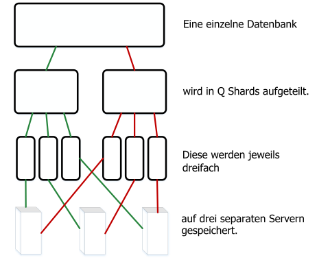
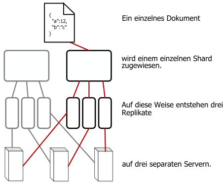

---

copyright:
  years: 2017, 2018
lastupdated: "2017-11-06"

---

{:new_window: target="_blank"}
{:shortdesc: .shortdesc}
{:screen: .screen}
{:codeblock: .codeblock}
{:pre: .pre}

<!-- Acrolinx: 2017-05-15 -->

# Wie werden Daten in {{site.data.keyword.cloudant_short_notm}} gespeichert?

## Konzepte

Jede Datenbank in {{site.data.keyword.cloudantfull}} setzt sich aus einem oder mehreren
unterschiedlichen _Shards_ zusammen. Die Anzahl dieser Shards wird mit
_Q_ bezeichnet.
Ein Shard ist eine spezifische Untergruppe von Dokumenten aus der Datenbank.
Alle _Q_ Shards zusammen enthalten die Daten in der Datenbank.
Jedes Shard wird in drei separaten Kopien gespeichert.
Jede Shard-Kopie wird als Shard-_Replikat_ bezeichnet.
Jedes Shard-Replikat wird auf einem anderen Server gespeichert.
Die Server sind in einem Rechenzentrum an einem einzelnen Standort verfügbar.
Die Sammlung von Servern in einem Rechenzentrum wird als Cluster bezeichnet.



Ein Dokument wird einem bestimmten Shard mithilfe des konsistenten Hashings seiner ID zugeordnet.
Diese Zuordnung bedeutet, dass ein Dokument immer in einem bekannten Shard und auf einer bekannten Servergruppe gespeichert wird.



Gelegentlich werden Shards _neu verteilt_.
Die Neuverteilung beinhaltet das Verschieben von Replikaten auf andere Server.
Dies kann aus mehreren Gründen passieren, z. B. wenn die Serverüberwachung meldet, dass ein Server stärker oder weniger stark ausgelastet ist als andere Server,
oder wenn ein Server aus Wartungsgründen temporär außer Betrieb genommen werden muss.
Die Anzahl der Shards und Replikate bleibt gleich und Dokumente bleiben demselben Shard zugeordnet, aber die Serverspeicherposition für ein Shard-Replikat ändert sich.

Der Standardwert für _Q_ unterscheidet sich abhängig vom Cluster.
Der Wert kann im Laufe der Zeit optimiert werden.

Die Anzahl von Replikaten (Kopien eines Shards) ist ebenfalls konfigurierbar.
In der Praxis hat die Beobachtung und Messung vieler Systeme ergeben, dass drei Replikate in den meisten Fällen eine angemessene Anzahl sind,
um eine gute Balance zwischen Leistung und Datensicherheit zu erzielen.
Es wäre sehr ungewöhnlich für ein {{site.data.keyword.cloudant_short_notm}}-System, eine andere Anzahl von Replikaten zu verwenden.

## Wie wirkt sich Sharding auf die Leistung aus?

Die Anzahl von Shards für eine Datenbank ist konfigurierbar, weil sie sich auf verschiedene Weise auf die Datenbankleistung auswirken kann.

Wenn eine Clientanwendung eine Anforderung an die Datenbank übermittelt,
wird ein Server oder Knoten in dem Cluster als _Koordinator_ der Anforderung abgestellt.
Dieser Koordinator stellt interne Anforderungen an die Knoten, auf denen sich die für die Anforderung relevanten Daten befinden,
bestimmt die Antwort auf die Anforderung und gibt diese Antwort an den Client zurück.

Die Anzahl von Shards für eine Datenbank kann sich auf zwei Arten auf die Leistung auswirken:

1.	Jedes Dokument in der Datenbank wird in einem einzelnen Shard gespeichert.
	Deshalb ermöglichen viele Shards eine höhere Parallelverarbeitung für alle Anforderungen einzelner Dokumente.
	Der Grund dafür ist, dass der Koordinator nur an die Knoten Anforderungen sendet, die das Dokument enthalten.
	Wenn also
	die Datenbank viele Shards umfasst, gibt es wahrscheinlich viele andere Knoten, die nicht auf die Anforderung
	antworten müssen.
	Diese Knoten können weiter an anderen Tasks arbeiten, ohne von der Koordinatoranforderung unterbrochen zu werden.
2.	Um auf eine Abfrageanforderung zu antworten, muss eine Datenbank die Ergebnisse von allen Shards verarbeiten.
	Je höher folglich die Anzahl von Shards ist, umso höher ist auch der Verarbeitungsbedarf.
	Der Grund dafür ist, dass der Koordinator eine Anforderung pro Shard stellen, die Ergebnisse anschließend kombinieren und die Antwort an den Client zurückgeben muss.

Bestimmen Sie eine passende Shardanzahl für Ihre Datenbank,
indem Sie die gängigsten Anforderungstypen ermitteln, die von den Anwendungen gestellt werden.
Überlegen Sie beispielsweise, ob die Anforderungen in den meisten Fällen einzelne Dokumentoperationen betreffen
oder ob es sich hauptsächlich um Abfragen handelt.
Sind die Operationen zeitkritisch?

Für alle Abfragen gibt der Koordinator Leseanforderungen an alle Replikate aus.
Diese Strategie wird gefahren, weil jedes Replikat seine eigene Kopie der Indizes verwaltet, die Antworten auf die Abfragen liefern.
Eine wichtige Folge dieser Konfiguration ist, dass mehr Shards die parallele Indexerstellung ermöglichen, _falls_ Dokumentschreibvorgänge in der Regel gleichmäßig auf die Shards im Cluster verteilt sind.

In der Praxis lässt sich die wahrscheinliche Verteilung der Arbeitslast bei der Indexierung auf die Knoten im Cluster nur schwer vorhersagen.
Außerdem ist das Vorhersagen der Arbeitslast bei der Indexierung weniger nützlich als die Adressierung von Musteranforderungen.
Denn die Indexierung kann erforderlich sein nach einem Dokumentschreibvorgang, aber nicht nach einer Dokumentanforderung.
Deshalb liefert die Indexierung alleine nicht genug Informationen, um eine angemessene Anzahl von Shards zu schätzen.

Wenn Sie die Datenmenge in Betracht ziehen, ist vor allem die Anzahl von Dokumenten pro Shard von Belang.
In jedem Shard sind die Dokumente in einem großen
[B-Tree ](https://en.wikipedia.org/wiki/B-tree){:new_window}
auf Platte gespeichert.
Indizes werden auf dieselbe Weise gespeichert.
Je mehr Dokumente zu einem Shard hinzugefügt werden, nimmt die Anzahl
von Schritten zu, die ausgeführt werden müssen, um den B-Tree während
einer typischen Dokumentsuche oder -abfrage zu durchlaufen.
Die Zunahme der Verschachtelungstiefe führt üblicherweise zu einer Verlangsamung von
Anforderungen, weil mehr Daten aus dem Cache oder von Platte gelesen werden müssen.

Vermeiden Sie grundsätzlich mehr als 10 Millionen Dokumente pro Shard.
Aus operativen Gründen ist eine Gesamtgröße für Shards von unter 10 GB empfehlenswert.
Kleinere Shards lassen sich beispielsweise während der Neuverteilung einfacher im Netz verschieben.

Angesichts der widersprüchlichen Anforderungen - zu viele Dokumente vermeiden und Shardgröße möglichst niedrig halten -
kann ein einziger _Q_-Wert nicht in allen Fällen die optimale Lösung sein.
{{site.data.keyword.cloudant_short_notm}} optimiert die Standardwerte für Cluster im Laufe der Zeit, wenn sich die Verwendungsmuster ändern.

Trotzdem ist es für eine spezifische Datenbank oft nützlich, erkannte Anforderungsmuster und Größenaspekte bei der zukünftigen Auswahl einer passenden Anzahl von Shards in Betracht zu ziehen.
Tests mit repräsentativen Daten und Anforderungsmustern sind wichtig, um realistische _Q_-Werte zu schätzen.
Aber stellen Sie sich darauf ein, dass die Praxis Sie eines Besseren belehren wird.

<div id="summary"></div>

Die folgenden einfachen Richtlinien sind möglicherweise in frühen Planungsphasen hilfreich.
Denken Sie daran, Ihre vorgeschlagene Konfiguration zu überprüfen, indem Sie Tests mit repräsentativen Daten durchführen,
insbesondere für große Datenbanken:

*	Wenn Ihre Daten nicht besonders groß sind,
	also nur im zweistelligen oder dreistelligen MB-Bereich oder mit wenigen tausend Dokumenten,
	gibt es keinen zwingenden Bedarf nach mehr als einem einzelnen Shard.
*	Für Datenbanken im GB-Bereich, also mit mehreren Millionen Dokumenten,
	ist eine einstellige Shardanzahl wie 8 wahrscheinlich ausreichend.
*	Bei größeren Datenbanken, die eine Anzahl von Dokumenten im zwei- bis dreistelligen Millionenbereich aufbewahren, also eine Größe im zweistelligen GB-Bereich haben,
	sollten Sie Ihre Datenbank für die Verwendung von 16 Shards konfigurieren.
*	Und bei noch größeren Datenbanken sollten Sie Ihre Daten auf mehrere Datenbanken verteilen.
	Wenden Sie sich in diesem Fall an den [{{site.data.keyword.cloudant_short_notm}}-Support ](mailto:support@cloudant.com){:new_window}.

>	**Hinweis:** Die in diesem Leitfaden angegebenen Zahlen sind eher Beobachtungs- und Erfahrungswerte als präzise Berechnungen.

<div id="API"></div>

## Mit Shards arbeiten

### Shardanzahl festlegen

Die Anzahl von Shards, _Q_,
für eine Datenbank wird festgelegt, wenn die Datenbank erstellt wird.
Der Wert _Q_ kann später nicht geändert werden.

Um _Q_ bei der Erstellung einer Datenbank anzugeben,
verwenden Sie den Abfragezeichenfolgeparameter `q`.

Im folgenden Beispiel wird eine Datenbank namens `mynewdatabase` erstellt.
Der Parameter `q` gibt an, dass acht Shards für die Datenbank erstellt werden.

```sh
curl -X PUT -u myusername https://myaccount.cloudant.com/mynewdatabase?q=8
```
{:codeblock}

>	**Hinweis:** Das Festlegen von _Q_ für Datenbanken ist für {{site.data.keyword.cloudant_short_notm}}-Datenbanken unter Bluemix nicht aktiviert.
	Der Wert _Q_ ist in den meisten `cloudant.com`Multi-Tenant-Clustern nicht verfügbar.

Wenn Sie versuchen, den Wert _Q_ festzulegen, falls er nocht nicht verfügbar ist,
ist das Ergebnis eine [`403`-Antwort](../api/http.html#403) mit einem JSON-Hauptteil ähnlich dem folgenden:

```json
{
	"error": "forbidden",
	"reason": "q is not configurable"
}
```
{:codeblock}

### Replikatanzahl festlegen

Ab CouchDB Version 2 können Sie [die Replikatanzahl angeben ](http://docs.couchdb.org/en/2.0.0/cluster/databases.html?highlight=replicas#creating-a-database){:new_window},
wenn Sie eine Datenbank erstellen.
Aber Sie können keinen anderen Wert als den Standardwert 3 für die Replikatanzahl angeben.
Das heißt, Sie können beim Erstellen der Datenbank keinen anderen Wert für die Replikatanzahl angeben.
Weitere Unterstützung erhalten Sie vom [{{site.data.keyword.cloudant_short_notm}}-Support ](mailto:support@cloudant.com){:new_window}.

### Was sind die Argumente _R_ und _W_?

Manche Anforderungen haben Argumente, die sich auf das Verhalten des Koordinators auswirken, wenn er die Anforderung beantwortet.
Diese Argumente heißen _R_ und _W_, in Anlehnung ihrer Namen in der Anforderungsabfragezeichenfolge.
Sie werden nur für Einzeldokumentoperationen verwendet.
Sie haben keinerlei Auswirkung auf allgemeine Anforderungen vom Typ Abfrage.

In der Praxis ist es selten hilfreich, die Werte _R_ und _W_ anzugeben.
Beispielsweise ändert sich nicht die Konsistenz für den Lese- oder Schreibvorgang, _R_ oder _W_ anzugeben.

#### Was ist _R_?

Das Argument _R_ kann nur für Einzeldokumentanforderungen angegeben werden.
_R_ wirkt sich darauf aus, wie viele Antworten vom Koordinator empfangen werden müssen, bevor er dem Client antwortet.
Die Antworten müssen von den Knoten kommen, die die Replikate des Shards hosten, das das Dokument enthält. 

Das Festlegen von _R_ auf _1_ kann die Gesamtantwortzeit verbessern,
weil der Koordinator schneller eine Antwort geben kann.
Grund ist, dass der Koordinator nur auf eine einzelne Antwort von einem der Replikate warten muss,
die das Shard hosten.

>	**Hinweis:** Wenn der Wert _R_ verkleinert wird, steigt die Wahrscheinlichkeit,
dass die zurückgegebene Antwort aufgrund des Modells der [sukzessiven Konsistenz](cap_theorem.html) von
{{site.data.keyword.cloudant_short_notm}} nicht auf den aktuellen Daten basiert.
	Die Angabe des Standardwerts _R_ mindert diesen Effekt.

Der Standardwert für _R_ ist _2_.
Dieser Wert entspricht den meisten Replikaten für eine typische Datenbank mit drei Shard-Replikaten.
Wenn die Datenbank eine Anzahl von Replikaten enthält, die höher oder niedriger als 3 ist,
ändert sich der Standardwert für _R_ entsprechend.

#### Was ist _W_?

_W_ kann nur für Schreibanforderungen für Einzeldokumente angegeben werden.

_W_ ist ähnlich wie _R_,
weil sich der Parameter darauf auswirkt, wie viele Antworten vom Koordinator empfangen werden müssen, bevor er dem Client antwortet.

>	**Hinweis:** _W_ wirkt sich nicht auf das eigentliche Schreibverhalten aus.

Der Wert von _W_ wirkt sich nicht darauf aus, ob das Dokument in der Datenbank geschrieben wird oder nicht.
Indem Sie _W_ angeben, kann der Client den HTTP-Statuscode in der Antwort überprüfen, um zu bestimmen, ob _W_-Replikate dem Koordinator geantwortet haben.
Der Koordinator wartet bis zu einem vorab festgelegten Zeitlimit auf _W_-Antworten von Knoten, die Kopien des Dokuments hosten,
bevor er die Antwort an den Client zurückgibt.
