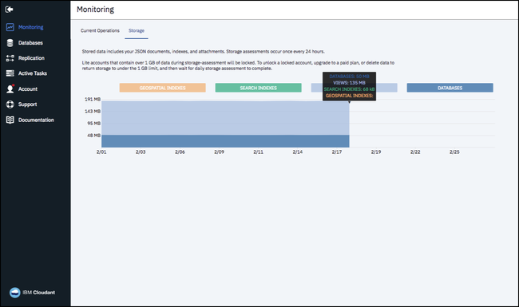

---

copyright:
  years: 2015, 2017
lastupdated: "2017-06-09"

---

{:new_window: target="_blank"}
{:shortdesc: .shortdesc}
{:screen: .screen}
{:codeblock: .codeblock}
{:pre: .pre}

<!-- Acrolinx: 2017-02-23 -->

# IBM Bluemix

{{site.data.keyword.cloudant}} ist auch als
[{{site.data.keyword.Bluemix}}-Service ](https://console.ng.bluemix.net/catalog/services/cloudant-nosql-db/){:new_window} verfügbar.
{:shortdesc}

{{site.data.keyword.Bluemix_short}} ist eine Cloudplattform mit offenen Standards für die Erstellung, Ausführung und Verwaltung von Anwendungen. Weitere Informationen zu {{site.data.keyword.Bluemix_notm}} sowie erste Schritte finden Sie auf der [Homepage ](https://console.ng.bluemix.net/){:new_window}. 

## Bluemix Public

{{site.data.keyword.cloudantfull}} ist als kostenloser [Lite-Plan](#lite-plan) und in Form
diverser Konfigurationen im kostenpflichtigen [Standard-Plan](#standard-plan) verfügbar.
Es gibt auch einen [dedizierten Plan](#dedicated-plan).
Dieser Plan bietet dieselbe Konfigurierbarkeit wie der Standard-Plan, wird aber auf dedizierter Hardware bereitgestellt. Dedizierte Hardware wird nicht mit anderen Konten gemeinsam genutzt,
sondern nur exklusiv von Ihnen.
Wenn eine Instanz eines dedizierten Plans an einem [US-amerikanischem Standort](#locations) bereitgestellt wird,
können Sie optional eine
[HIPAA-konforme ](https://en.wikipedia.org/wiki/Health_Insurance_Portability_and_Accountability_Act){:new_window} Konfiguration auswählen. 

In der folgenden Tabelle sind die Leistungskennzahlen für die einzelnen Pläne zusammengefasst. 

>   **Hinweis**: Die in der Tabelle aufgeführten Details stammen vom September 2016. 
    Aktuelle Werte erhalten Sie vom [{{site.data.keyword.cloudant_short_notm}}-Support ](mailto:support@cloudant.com){:new_window}.

>   **Hinweis**: Alle Währungswerte in diesem Dokument sind in US-Dollar ($) angegeben. 

<table border='1'>

<tr>
<th>Pläne</th><th>Lite</th><th colspan='4'>Standard <i>und</i> Dediziert</th>
</tr>
<tr>
<td>Grundpreis (pro Stunde)</td>
<td>$ 0,00</td>
<td colspan='4'>Siehe <a href="http://cloudant.com/bluemix" target="_blank">Preisdetails </a>.</td>
</tr>
<tr>
<td>Bereitgestellte Durchsatzkapazität (Suchvorgänge pro Sekunde)</td>
<td>20</td>
<td>100</td>
<td>1.000</td>
<td>5.000</td>
<td>20.000</td>
</tr>
<tr>
<td>Bereitgestellte Durchsatzkapazität (Schreibvorgänge pro Sekunde)</td>
<td>10</td>
<td>50</td>
<td>500</td>
<td>2.500</td>
<td>10.000</td>
</tr>
<tr>
<td>Bereitgestellte Durchsatzkapazität (Abfragen pro Sekunde)</td>
<td>5</td>
<td>5</td>
<td>50</td>
<td>250</td>
<td>1.000</td>
</tr>
<tr>
<td>Maximale individuelle Dokumentgröße</td>
<td>1 MB</td>
<td colspan='4'>1 MB</td>
</tr>
<tr>
<td>Inbegriffener Plattenspeicherplatz</td>
<td>1 GB</td>
<td colspan='4'>20 GB</td>
</tr>
<tr>
<td>Plattenüberschreitung (pro GB/Stunde)</td>
<td>Nicht verfügbar</td>
<td colspan='4'>Siehe <a href="http://cloudant.com/bluemix" target="_blank">Preisdetails </a>.</td>
</tr>

</table>

Sie können auswählen, welcher Plan genutzt werden soll, wenn Sie
[Ihre {{site.data.keyword.cloudant_short_notm}}-Serviceinstanz bereitstellen](#provisioning-a-cloudant-instance-on-bluemix).
Standardmäßig ist der [Lite-Plan](#lite-plan) ausgewählt. 

### Lite-Plan

Der Lite-Plan ist kostenlos, jedoch auf maximal 1 GB Datenspeicher begrenzt. Es gelten auch Begrenzungen für die bereitgestellte Durchsatzkapazität für Suchvorgänge,
Schreibvorgänge und Abfragen.  

Die Speicherbelegung wird täglich geprüft. Wenn Sie Ihren Speichergrenzwert überschreiten, empfangen HTTP-Anforderungen an das Konto einen
402-Statuscode mit der Fehlermeldung, dass die Datennutzungsquote für das Konto überschritten wurde. Und dass ein Upgrade auf einen kostenpflichtigen Plan erforderlich ist.
Es wird auch ein entsprechendes Banner im Cloudant-Dashboard angezeigt. Sie können weiterhin Daten lesen und löschen. Aber um neue Daten in den Speicher zu schreiben,
müssen Sie entweder ein Upgrade auf ein kostenpflichtiges Konto durchführen oder Daten löschen und bis zur nächsten Überprüfung Ihres Kontos warten, damit es reaktiviert wird.  

Wenn Sie mehr als 1 GB Daten speichern möchten oder sich eine höhere Durchsatzkapazität wünschen,
wechseln Sie zum [Standard-Plan](#standard-plan). 

### Standard-Plan

Der Standard-Plan umfasst 20 GB Datenspeicher.
Wenn Sie mehr als 20 GB speichern, wird Ihnen eine definierte Summe pro GB und pro Stunde berechnet. Informationen zu den aktuell anfallenden Kosten finden Sie unter [Preisstruktur ](http://cloudant.com/bluemix){:new_window}.
Im Standard-Plan können Sie auch die Menge der bereitgestellten Durchsatzkapazität für Suchvorgänge, Schreibvorgänge und Abfragen ändern. 

### Dedizierter Plan

{{site.data.keyword.cloudant_short_notm}} ist auf dedizierter Single-Tenant-Hardware als Teil einer
[{{site.data.keyword.Bluemix_notm}} Dedicated-Konfiguration ](http://www.ibm.com/cloud-computing/bluemix/dedicated/){:new_window} verfügbar. 

## Serviceebenen

Sie finden die Details der Durchsatzkapazität in den für Ihr Konto verfügbaren Plänen.
Sie können die gewünschte Ebene der Bereitstellung auf der Registerkarte 'Konto' in Ihrem {{site.data.keyword.cloudant_short_notm}}-Konto-Dashboard auswählen. 

Um zu einer anderen Durchsatzkapazität zu wechseln,
wählen Sie die gewünschte Bereitstellung aus und klicken Sie dann
auf die Optionsschaltfläche `Kapazität ändern`.
Sie werden aufgefordert, die Änderung zu bestätigen, und daran erinnert, dass es bis zu 24 Stunden dauern kann, bis sie wirksam wird. 

### Bereitgestellte Durchsatzkapazität

Die Bereitstellung des Durchsatzes wird in Form eines dieser drei Arten von Ereignissen ermittelt und gemessen: 

1.	Ein Suchvorgang, bei dem es sich um einen Lesevorgang
    eines bestimmten Dokuments handelt, auf der Basis der `_id` des Dokuments. 
2.	Ein Schreibvorgang, bei dem es sich um das Erstellen,
    Ändern oder Löschen eines einzelnen Dokuments handelt,
    oder um ein beliebiges Update aufgrund einer Indexerstellung. 
3.	Eine Abfrage, bei der es sich um einen der {{site.data.keyword.cloudant_short_notm}}-Abfrageendpunkte handelt,
    einschließlich der folgenden Typen: 
	-	Primärindex ([`_all_docs`](../api/database.html#get-documents))
	-	MapReduce-Ansicht ([`_view`](../api/creating_views.html#using-views))
	-	Suchindex ([`_search`](../api/search.html#queries))
	-	Geografisch-räumlicher Index ([`_geo`](../api/cloudant-geo.html#querying-a-cloudant-geo-index))
	-	Cloudant-Abfrage ([`_find`](../api/cloudant_query.html#finding-documents-using-an-index))
	-	Änderungen ([`_changes`](../api/database.html#get-changes))

Die Messung des Durchsatzes ist eine einfache Zählung der Anzahl von Ereignissen jedes Typs,
pro Sekunde, wobei die Sekunde ein _gleitendes_ Fenster ist.
Wenn Ihr Konto die Anzahl von Durchsatzereignissen überschreitet, die für den Plan bereitgestellt werden,
werden Anforderungen so lange zurückgewiesen, bis die Anzahl von Ereignissen im gleitenden Fenster
die festgelegte Anzahl nicht mehr überschreitet.
Vielleicht hilft es Ihnen, sich vorzustellen, dass das gleitende 1-Sekunden-Fenster ein fortlaufender Zeitraum von 1.000 Millisekunden ist.

Beispiel: Wenn Sie den Standard-Plan mit einer Bereitstellung von 200 Suchvorgängen pro Sekunde nutzen,
stellt Ihr Konto während eines fortlaufenden Zeitraums von 1.000 Millisekunden (1 Sekunde) maximal 200 Suchanforderungen.
Nachfolgende Suchanforderungen, die während des gleitenden 1.000-Millisekunden-Zeitraums gestellt werden,
werden abgelehnt, bis die Anzahl von Suchanforderungen in diesem Zeitraum wieder auf weniger als 200 sinkt. 

Wenn eine Anforderung abgelehnt wird, weil die Anzahl von Ereignissen überschritten ist,
empfangen Anwendungen eine [`429` Too Many Requests](../api/http.html#429)-Antwort. 

Aktuelle Versionen der unterstützten Clientbibliotheken (für [Java](../libraries/supported.html#java),
[Node.js](../libraries/supported.html#node-js) und [Python](../libraries/supported.html#python)) unterstützen Sie bei der Verarbeitung einer `429`-Antwort.
Die Java-Bibliothek gibt beispielsweise eine
[`TooManyRequestsException`-Ausnahme aus ](http://static.javadoc.io/com.cloudant/cloudant-client/2.5.1/com/cloudant/client/org/lightcouch/TooManyRequestsException.html){:new_window}. 

Standardmäßig versuchen die unterstützten Clientbibliotheken nicht automatisch, eine Anforderung zu wiederholen, wenn eine `429`-Antwort empfangen wird. 

Es ist sinnvoller, sicherzustellen, dass Ihre Anwendung `429`-Antworten korrekt verarbeitet.
Denn die Anzahl von erneuten Versuchen ist begrenzt. Ein regelmäßiges Überschreiten der Anzahl von Anforderungen ist ein starker Indikator, dass ein Wechsel zu einer anderen Plankonfiguration angebracht ist. 

>   **Hinweis**: Wenn Sie eine vorhandene Anwendung portieren, 
    kann sie unter Umständen keine `429`-Antwort verarbeiten.
    Als Teil der Migrationsverifizierung prüfen Sie, dass Ihre Anwendung
    `429`-Antworten korrekt verarbeitet.

Zusammenfassend lässt sich sagen, dass Sie sicherstellen müssen, dass Ihre Anwendung eine [`429`](../api/http.html#429)-Antwort korrekt verarbeiten kann. 

### Maximale individuelle Dokumentgröße

Daten werden in {{site.data.keyword.cloudant_short_notm}} als [JSON-Dokumente](../api/document.html) gespeichert.
Für Dokumente in einem {{site.data.keyword.cloudant_short_notm}}-Service unter {{site.data.keyword.Bluemix_notm}}
lautet die maximale Größe eines einzelnen Dokuments 1 MB.
Wird diese Größe überschritten, verursacht das einen [`413`-Fehler](../api/http.html#413). 

### Inbegriffener Plattenspeicherplatz

Dieser Wert ist die im Plan enthaltene Speicherkapazität. Sie gilt für den Datenspeicher und den Indexspeicher. 

### Plattenüberschreitung

Alle Serviceinstanzen von Standard- und Lite-Plänen werden auf Plattenspeicherbelegung überwacht.
Falls das Konto mehr Speicherplatz als in Ihrer Plankonfiguration vorgesehen belegt, wird der Speicher als 'überlaufend' betrachtet.
Bei einem Überlauf wird dem Konto der angegebene Preis für jedes zusätzliche GB in Rechnung gestellt. 

Dieser zusätzliche Geldbetrag, den Sie für die Verwendung von mehr Plattenspeicherplatz zahlen müssen, als im Plan vorgesehen ist, wird als Überschreitung bezeichnet.
Die Überschreitung wird auf stündlicher Basis berechnet.
Es ist nicht möglich, mehr als den im Lite-Plan verfügbaren Plattenspeicherplatz zu belegen. 

Angenommen, dass Ihre Instanz des Standard-Plans die Plattenbelegung für einen halben Tag (12 Stunden) auf 107 GB erhöht.
Diese Änderung bedeutet, dass Ihre Instanz für 12 Stunden einen Überlauf von 87 GB zusätzlich zu den im Plan vorgesehenen 20 GB verursacht hat.
Ihnen würde eine Überschreitungsgebühr basierend auf 87 GB x 12 Stunden = 1044 GB-Stunden für den zusätzlichen Speicherplatz in Rechnung gestellt. 

Die Überschreitung wird mithilfe der maximalen Anzahl von GB zusätzlich zu den im Plan zugeordneten GB während einer bestimmten Stunde im Rechnungsstellungszyklus berechnet. 

### Praxisbeispiel einer Überschreitung

Angenommen, Sie starten einen Monat mit 30 Tagen mit einer Serviceinstanz eines Standard-Plans, die 9 GB Speicher verwendet.
Dann erhöht sich Ihr Speicherbedarf um 21,5 GB für 15 Minuten während der Stunde 02:00 an Tag 3.
Die Instanz fällt zurück auf 9,5 GB für die nächsten 10 Minuten der Stunde 02:00 und steigt dann auf 108 GB für die nächsten 25 Minuten der Stunde 02:00.
Schließlich beendet die Instanz diese Stunde und den Rest des Monats bei einem Wert von 28 GB. 

Dieses Muster bedeutet, dass die maximale Anzahl von GB, die über die im Plan zugeordneten GB hinausging, während der Stunde ab 02:00 Uhr an Tag 3 bei 88 GB lag.
Für die Stunde 03:00 an Tag 3 und für den Rest des Monats belegte Ihre Instanz 8 GB mehr als im Plan zugeordnet. 

Deshalb würde für die Stunde 02:00 an Tag 3 eine Überschreitung von 88 GB x 1 Stunde = 88 GB-Stunden berechnet werden. 

Für die Stunde 03:00 von Tag 3 bis zum Ende von Tag 3 würde eine Überschreitung von 8 GB x 21 Stunden = 168 GB-Stunden berechnet werden. 

Für die Stunde 00:00 von Tag 4 bis zum Ende des Monats (30 Tage) würde eine Überschreitung von 8 GB x 24 Stunden x 27 Tage = 5184 GB-Stunden berechnet werden. 

Die Gesamtrechnung für die monatliche Überschreitung würde wie folgt berechnet werden: 88 + 168 + 5184 = 5440 GB-Stunden. 

## Standorte

Standardmäßig basieren alle Pläne mit Ausnahme des dedizierten Plans auf Multi-Tenant-Clustern.
Als Teil Ihrer Planauswahl können Sie eine der folgenden {{site.data.keyword.Bluemix_notm}} Public-Regionen auswählen: 

-   Vereinigte Staaten (Süden)
-   Großbritannien
-   Sydney
-   Deutschland

## Sicherheit, Verschlüsselung und Compliance

Alle Pläne werden auf Servern mit einer Verschlüsselung vom Typ
[at-rest ](https://en.wikipedia.org/wiki/Data_at_rest){:new_window} bereitgestellt.
Der Zugriff wird über eine Netzverbindung mithilfe von HTTPS verschlüsselt.
Weitere Details finden Sie unter [DBaaS Security ](https://cloudant.com/product/cloudant-features/dbaas-security/){:new_window}. 

Die Pläne bieten auch die
[Zertifizierung der Einhaltung von Sicherheitsbestimmungen ](https://cloudant.com/product/cloudant-features/cloudant-compliance/){:new_window}.
[HIPAA-Compliance ](https://en.wikipedia.org/wiki/Health_Insurance_Portability_and_Accountability_Act){:new_window}
erfordert eine [dedizierte Umgebung](#dedicated-plan); fordern Sie deshalb diese Umgebung als Teil des [-Bereitstellungsprozesses](#provisioning-a-cloudant-instance-on-bluemix) an. 

## Hochverfügbarkeit, Disaster-Recovery und Sicherung

Um in einem Rechenzentrum Hochverfügbarkeit und Disaster-Recovery bereitzustellen,
werden alle Daten in dreifacher Ausführung auf drei verschiedenen physischen Servern in einem Cluster gespeichert.
Sie können Konten in mehreren Rechenzentren einrichten und dann eine fortlaufende Datenreplikation nutzen, um Hochverfügbarkeit und Disaster-Recovery rechenzentrumsübergreifend bereitzustellen. 

{{site.data.keyword.cloudant_short_notm}}-Daten werden nicht automatisch gesichert.
Sie können anfordern, dass eine [inkrementelle Sicherungsfunktion](../guides/backup-guide.html)
aktiviert wird, oder alternativ Ihre eigene Lösung implementieren, indem Sie eine von mehreren
[hier ](https://developer.ibm.com/clouddataservices/2016/03/22/simple-couchdb-and-cloudant-backup/){:new_window} beschriebenen Techniken einsetzen.   

## Nutzung überwachen

Informationen zu Ihrer Nutzung finden Sie im Teilfenster 'Nutzung' auf der Registerkarte 'Aktivität' in Ihrem {{site.data.keyword.cloudant_short_notm}}-Dashboard. 

.

Dort finden Sie Details wie Ihr aktueller [Durchsatz](#throughput) und die Menge der [gespeicherten Daten](#disk-space-included). 

Dank der Überwachung können Sie ermitteln, dass eine Änderung an der Bereitstellung in Ihrem Plan ratsam sein könnte.
Wenn Sie beispielsweise regelmäßig die maximale Anzahl von Datenbanksuchvorgängen erreichen,
können Sie die Bereitstellung im [Teilfenster 'Service'](#servicetier) auf der Registerkarte 'Konto' des Dashboards ändern. 

## Hardware-Spezifikationen

Alle Pläne mit Ausnahme des dedizierten Plans werden auf Multi-Tenant-Clustern implementiert.
Alle Daten werden zum Zweck der Hochverfügbarkeit und Datenwiederherstellung in dreifacher Ausfertigung, auf drei separaten physischen Knoten gespeichert. 

## Support 

Support für Serviceinstanzen von Standard-Plänen und dedizierten Plänen ist optional.
Bei Interesse können Sie das Angebot '{{site.data.keyword.Bluemix_notm}}-Standard-Support' erwerben.
Für Lite-Pläne wird kein Support angeboten. 

Ein Preisrechner für den {{site.data.keyword.Bluemix_notm}}-Standard-Support ist
[hier ](https://console.ng.bluemix.net/?direct=classic/#/pricing/cloudOEPaneId=pricing&paneId=pricingSheet){:new_window} verfügbar.
Informationen zu den Details des Support-Service-Level-Agreements (SLA) finden Sie [hier ](http://www-03.ibm.com/software/sla/sladb.nsf/pdf/6606-08/$file/i126-6606-08_05-2016_en_US.pdf){:new_window}. 

## Cloudant-Instanz unter Bluemix bereitstellen

Sie können eine {{site.data.keyword.cloudant_short_notm}}-Instanz unter {{site.data.keyword.Bluemix_notm}} auf zwei Arten bereitstellen: 

-	Mithilfe des Dashboards. Ein Lernprogramm, das den Prozess beschreibt, können Sie [hier](../tutorials/create_service.html) abrufen. 
-	Mithilfe des Cloud Foundry-Befehlstools. Ein Lernprogramm, das den Prozess beschreibt, können Sie [hier](../tutorials/create_service_cli.html) abrufen. 
