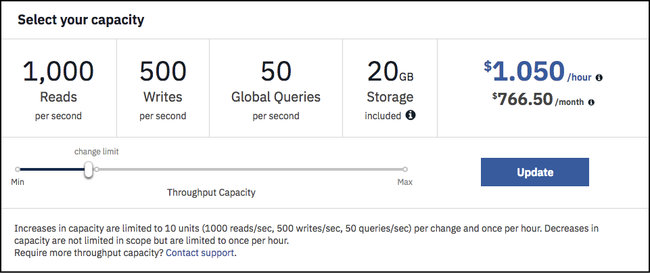

---

copyright:
  years: 2015, 2019
lastupdated: "2019-03-07"

keywords: pricing examples, data usage, ibm cloud usage dashboard

subcollection: cloudant

---

{:new_window: target="_blank"}
{:shortdesc: .shortdesc}
{:screen: .screen}
{:codeblock: .codeblock}
{:pre: .pre}
{:note: .note}
{:important: .important}
{:deprecated: .deprecated}

<!-- Acrolinx: 2019-01-11 -->

# Preisstruktur
{: #pricing}

Der Preis für {{site.data.keyword.cloudantfull}} richtet sich nach der bereitgestellten Duchsatzkapazität, die Sie für Ihre Instanz zuordnen, und nach dem genutzten Datenspeicher. {{site.data.keyword.cloudant_short_notm}} ermöglicht das Erhöhen und Reduzieren Ihrer bereitgestellten Durchsatzkapazität und die anteilmäßige stündliche Abrechnung. Die bereitgestellte Durchsatzkapazität ist eine reservierte Anzahl von Lesevorgängen pro Sekunde, Schreibvorgängen pro Sekunde und globale Abfragen pro Sekunde, die einer Instanz zugeordnet sind. Die Einstellung für die Durchsatzkapazität ist die maximale Nutzungsstufe pro Sekunde. Wenn Sie versuchen, die reservierte Kapazität für Lesevorgänge, Schreibvorgänge oder globale Abfragen zu überschreiten, weist ein HTTP-Statuscode 429 darauf hin, dass die Anwendung im Begriff ist, die bereitgestellte zulässige Durchsatzkapazität zu überschreiten.

Die folgende Tabelle zeigt Beispiele für Stundenpreise bei unterschiedlichen Einstellungen für die Durchsatzkapazität. Sie können die stündliche Kapazität in Einzelblöcken mit jeweils 100 Lesevorgängen pro Sekunde, 50 Schreibvorgängen pro Sekunde und 5 globalen Abfragen pro Sekunde erhöhen bzw. reduzieren. Außerdem wird eine näherungsweise berechnete Monatsgebühr für jede Einstellung angegeben, die für eine durchschnittliche Nutzung von 730 Stunden im Monat anfällt. Die Preise sind in US-Dollar angegeben. Mit dem {{site.data.keyword.cloud_notm}}-Preisrechner können Sie die geschätzten Kosten in anderen Währungen anzeigen, indem Sie auf die Schaltfläche `Zur Schätzung hinzufügen` in der Kachel für den {{site.data.keyword.cloudant_short_notm}}-Katalog klicken.

Sie können die Registerkarte {{site.data.keyword.cloudant_short_notm}} **Dashboard** > **Konto** > **Kapazität** öffnen, um die bereitgestellte Durchsatzkapazität anzuzeigen und zu ändern sowie die stündlich anfallenden und die geschätzten monatlichen Kosten anzuzeigen: 

## Preisbeispiele 
{: #pricing-examples}

Nehmen wir an, Sie erstellen mit {{site.data.keyword.cloudant_short_notm}} eine mobile App und kennen Ihre benötigte Kapazität noch nicht. In diesem Fall empfehlen wir, mit der niedrigsten bereitgestellten Durchsatzkapazität zu beginnen und sie je nach Bedarf im Laufe der Zeit zu erhöhen, je nachdem, wie viel Kapazität Ihre Anwendung benötigt. {{site.data.keyword.cloudant_short_notm}}-Rechnungen werden anteilmäßig pro Stunde berechnet. Die Änderung der bereitgestellten Durchsatzkapazität verursacht keine Ausfallzeiten. 

Beispiel für die mobile App: Sie beginnen mit der minimalen bereitgestellten Durchsatzkapazität für den
Standard-Plan, die 100 Lesevorgänge/Sek., 50 Schreibvorgänge/Sek. und 5 globale Abfragen/Sek. enthält. Die Kosten für diese Kapazität betragen 0,105 US-Dollar pro Stunde. Die 100 Lesevorgänge/Sek, 50 Schreibvorgänge/Sek. und 5 globalen Abfragen/Sek. sind
ein Block der bereitgestellten Durchsatzkapazität. Wenn Sie nach oben (oder unten) skalieren müssen, können Sie diese Kapazitätsblöcke schrittweise skalieren. Unter der Voraussetzung, dass die Instanz weniger als die 20 GB Speicherkapazität hat, die im Standard-Plan enthalten ist, entstehen keine Speicherkosten. Auf der Registerkarte {{site.data.keyword.cloudant_short_notm}} Dashboard > Konto > Kapazität sieht die Einstellung für die bereitgestellte Durchsatzkapazität wie in diesem Screenshot aus:

Der Schieberegler für die Kapazität zeigt die Kosten pro Stunde der bereitgestellten Durchsatzkapazität von 100 Lesevorgängen/Sek., 50 Schreibvorgängen/Sek. und 5 globalen Abfragen/Sek. in US-Dollar für 0,105 US-Dollar/Stunde an. Der Schieberegler zeigt Kosten pro Monat von etwa 76,65 US-Dollar an. Der monatliche Betrag ist eine Schätzung, die auf durchschnittliche 730 Stunden pro Monat basiert. Die Kosten pro Monat können leicht variieren, je nachdem, wie hoch die Anzahl der Stunden im Monat ist.

Beispielgleichung: 

- 0,105 US-Dollar pro Stunde \* 1 Block (mit 100 Lesevorgängen/Sek., 50 Schreibvorgängen/Sek. und 5 globalen Abfragen/Sek. bereitgestellter Durchsatzkapazität) \* 730 Stunden (ungefähre Anzahl an Stunden in einem Monat)
- Gesamtbetrag = 76,65 US-Dollar

Lesevorgänge, Schreibvorgänge und Abfragen können nicht unabhängig voneinander skaliert werden. Verwenden Sie den Schieberegler, um die Anzahl der Blöcke der bereitgestellten Durchsatzkapazität anhand der maximalen Anzahl von Lesevorgängen/Sek., Schreibvorgängen/Sek. oder Abfragen/Sek.auszuwählen, die für Ihre Anwendung erforderlich sind. Beispiel: Wenn Ihre Anwendung 1.000 Lesevorgänge pro Sekunde benötigt, wählen Sie mithilfe des Schiebereglers die Kapazität aus, die 1.000 Lesevorgänge/Sek., 500 Schreibvorgänge/Sek. und 50 globale Abfragen/Sek. anbietet, auch wenn Sie nicht die entsprechende Anzahl an Schreibvorgängen oder globalen Abfragen brauchen.

Wie schätzen Sie die Gesamtkosten für die bereitgestellte Durchsatzkapazität pro Monat mit 1.000 Lesevorgängen, 500 Schreibvorgängen und 50 globalen Abfragen? 

- 0,105 US-Dollar pro Stunde \* 10 Blöcke (mit 100 Lesevorgängen/Sek., 50 Schreibvorgängen/Sek. und 5 globalen Abfragen/Sek. bereitgestellter Durchsatzkapazität) \* 730 Stunden (ungefähre Anzahl an Stunden in einem Monat)
- Alternativ zeigt der Schieberegler die bereitgestellte Durchsatzkapazität von 1.000 Lesevorgängen/Sek., 500 Schreibvorgängen/Sek. und 50 globalen Abfragen/Sek. mit Kosten von 1,050 US-Dollar/Stunde \* 730 Stunden an
- Gesamtbetrag = 766,50 US-Dollar

## Preisstruktur für Datennutzung
{: #data-usage-pricing}

Wie sieht die Preisstruktur für Datenüberschreitungen aus?

Plan | Einschließlich Speicher | Überschreitungsgrenzwert
-----|------------------|--------------
Lite | 1 GB |  Ihr Konto wird so lange für das Schreiben neuer Daten blockiert, bis Sie durch das Löschen von Daten einen Wert unter dem Grenzwert von 1 GB erreichen oder in einen Plan mit höherem Grenzwert wechseln.
Standard | 20 GB | Weiterer Speicher kostet 0,0014 US-Dollar pro GB pro Stunde; dies entspricht etwa 1 US-Dollar/GB pro Monat.

## {{site.data.keyword.cloud_notm}}-Nutzungsdashboard 
{: #usage-dashboard}

Wie werden die Daten im {{site.data.keyword.cloud_notm}}-Nutzungsdashboard angezeigt?

Aktuelle und frühere Nutzungsabrechnungen können im {{site.data.keyword.cloud_notm}}-Dashboard unter 'Verwalten -> Abrechnung und Nutzung -> Nutzung' angezeigt werden. In dieser Ansicht werden die Gesamtsummen für die Nutzung angezeigt, die in einem bestimmten Monat bislang für den Service, den Plan oder die Instanz anfallen. Die geschätzte Gesamtsumme spiegelt den bisherigen Rechnungsbetrag für den laufenden Monat oder für abgelaufene vollständige Monate wider. Sie zeigt nur die aufgelaufenen Kosten pro Stunde bis zum aktuellen Zeitpunkt des laufenden Monats an. Am Ende des Monats wird Ihre durchschnittliche bereitgestellte Durchsatzkapazität für den Monat in den Feldern `LOOKUPS_PER_MONTH`, `WRITES_PER_MONTH` und `QUERIES_PER_MONTH` angegeben. Hinweis: 'lookups' (Suchvorgänge) werden jetzt als 'reads' (Lesevorgänge) bezeichnet und 'queries' (Abfragen) als 'global queries' (globale Abfragen). Das Feld `STORAGE_MANAGED_PER_MONTH` zeigt nur den in Rechnung gestellten Speicher, ohne die im Standard-Plan enthalten 20 GB. Die Menge '20+ GB' gibt an, dass für die Instanz in dem betreffenden Monat eine durchschnittliche Datenkapazität von 40 GB angefallen ist. Wenn Sie weniger als 20 GB Speicher verwenden, zeigt das Display 0 GB an, da Sie den Grenzwert nicht überschritten haben.   

