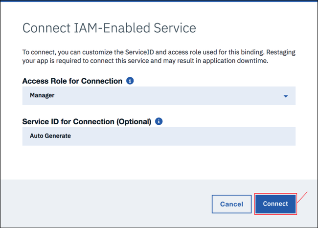

---

copyright:
  years: 2017, 2019
lastupdated: "2019-06-12"

keywords: ibm cloud application environment, ibm cloud applications and services, connect, the cloud foundry command toolkits, ibm cloud command toolkits, install the cloud foundry toolkit, install ibm cloud toolkit, the starter application

subcollection: cloudant

---

{:new_window: target="_blank"}
{:shortdesc: .shortdesc}
{:screen: .screen}
{:codeblock: .codeblock}
{:pre: .pre}
{:tip: .tip}
{:note: .note}
{:important: .important}
{:deprecated: .deprecated}

<!-- Acrolinx: 2017-05-10 -->

# Einfache {{site.data.keyword.cloud_notm}}-Anwendung für Zugriff auf {{site.data.keyword.cloudant_short_notm}}-Datenbank erstellen: Anwendungsumgebung
{: #creating-a-simple-ibm-cloud-application-to-access-an-ibm-cloudant-database-the-application-environment}

In diesem Abschnitt des Lernprogramms wird beschrieben, wie Sie die Anwendungsumgebung für das Erstellen einer {{site.data.keyword.cloud}}-Anwendung einrichten.
{: shortdesc}

## Eine {{site.data.keyword.cloud_notm}}-Anwendungsumgebung erstellen
{: #creating-an-ibm-cloud-application-environment}

1.  Melden Sie sich bei Ihrem {{site.data.keyword.cloud_notm}}-Konto an.<br/>
    Das {{site.data.keyword.cloud_notm}}-Dashboard finden Sie hier:
    [https://cloud.ibm.com/](https://cloud.ibm.com/){: new_window}.
    Nach der Authentifizierung mit Ihrem Benutzernamen und Ihrem Kennwort
    wird das {{site.data.keyword.cloud_notm}}-Dashboard angezeigt. Klicken Sie im Menü auf `Katalog`: <br/>
    

2.  Klicken Sie auf die Kategorie `Berechnen`:<br/>
    <br/>
    Eine Liste mit den Services und Apps, die unter {{site.data.keyword.cloud_notm}} verfügbar sind, wird angezeigt.

3.  Blättern Sie nach unten zum Abschnitt `Cloud Foundry` und klicken Sie auf den Eintrag `Python`:<br/>
    <br/>
    Daraufhin wird das Formular `Eine Cloud Foundry-App erstellen` angezeigt.

4.  Verwenden Sie das Formular `Eine Cloud Foundry-App erstellen`, um die Umgebung für Ihre Python Cloud Foundry-Anwendung anzugeben und zu erstellen. Geben Sie einen Namen für Ihre Anwendung ein, z. B. `Cloudant Cloud Foundry-App`. Der Hostname wird automatisch für Sie generiert, aber Sie können ihn auch anpassen:</br>
    
    
    Der Hostname muss in der {{site.data.keyword.cloud_notm}}-Domäne eindeutig sein. In diesem Beispiel heißt die Domäne `mybluemix.net`, was den vollständigen Hostnamen `Cloudant-CF-app.mybluemix.net` ergibt.
    {: tip}

5.  Klicken Sie auf `Erstellen`, um die Anwendungsumgebung zu erstellen:</br>
    

6.  Nach einer kurzen Pause wird das Fenster
    `Einführung` für Ihre neue Anwendungsumgebung geöffnet.
    Es wird automatisch eine Testanwendung in der Umgebung erstellt.
    Die Anwendung wird automatisch gestartet, wie
    durch das grüne Symbol und den Status `Aktiv` angegeben wird.
    Es handelt sich um ein Heartbeat-Programm, das ausreicht, um wiederzugeben, dass die neue Anwendungsumgebung verwendet werden kann.
    Klicken Sie auf den Link `Cloud Foundry-Apps`, um zu Ihrem {{site.data.keyword.cloud_notm}}-Dashboard zurückzukehren.<br/>
    

7.  Ihre Ressourcenliste enthält jetzt die neu erstellte Anwendungsumgebung:<br/>
    

Sie verfügen jetzt über eine einsatzbereite {{site.data.keyword.cloud_notm}} Python-Anwendungsumgebung.

Um mit einer {{site.data.keyword.cloudant_short_notm}}-Datenbankinstanz zu arbeiten,
erstellen Sie eine Verbindung zwischen der Anwendungsumgebung und der Datenbankinstanz.

## {{site.data.keyword.cloud_notm}}-Anwendungen und -Services verbinden
{: #connecting-ibm-cloud-applications-and-services}

In diesem Abschnitt des Lernprogramms wird erläutert, wie Sie
{{site.data.keyword.cloud_notm}}-Anwendungsumgebungen und -Services mithilfe des
Konfigurations- und Verwaltungsbereichs Ihrer Anwendung verbinden.

1.  Navigieren Sie im {{site.data.keyword.cloud_notm}}-Dashboard zu **Menüsymbol** > **Ressourcenliste** und öffnen Sie Ihre Serviceinstanz.<br/>
    </br>
    Der Übersichtsbereich für Konfiguration und Verwaltung für Ihre Anwendung wird geöffnet.

2.  Um die Anwendungsumgebung mit einem anderen Service zu verbinden,
    klicken Sie auf die Registerkarte `Verbindungen`:<br/>
    <br/>
    Es wird ein Bereich für die Konfiguration einer Verbindung zwischen Ihrer Anwendung und allen anderen verfügbaren Services in Ihrem Konto angezeigt.

3.  Eine [Voraussetzung](/docs/services/Cloudant?topic=cloudant-creating-a-simple-ibm-cloud-application-to-access-an-ibm-cloudant-database-prerequisites#prerequisites-create_bmxapp_prereq) für dieses Lernprogramm ist eine
    vorhandene {{site.data.keyword.cloudant_short_notm}}-Datenbankinstanz.
    Klicken Sie auf `Verbindung erstellen`, um eine Verbindung zwischen dieser Serviceinstanz und Ihrer Anwendung herzustellen:<br/>
    <br/>
    Eine Liste der vorhandenen Serviceinstanzen in Ihrem Konto wird angezeigt.

4.  Klicken Sie auf die {{site.data.keyword.cloudant_short_notm}}-Serviceinstanz, die Sie verwenden möchten.
    In diesem Lernprogramm wird die Instanz `Cloudant-service` verwendet:<br/>
    

5.  Sie müssen bestätigen, dass Sie die Datenbankinstanz wirklich mit Ihrer Anwendung verbinden möchten.
    Klicken Sie auf `Verbinden`, um die Verbindung zu bestätigen:<br>
    

6.  Bevor Sie fortfahren können, werden Sie aufgefordert, die Service-ID und die Zugriffsrolle anzupassen. Klicken Sie auf `Verbinden`, um fortzufahren.
    

6.  Das Ändern der Serviceverbindungen für eine Anwendung wirkt sich auf die gesamte Konfiguration aus. Die Änderung setzt ein erneutes Staging der Anwendung voraus, wodurch auch eine aktive Anwendung gestoppt wird. Ein Fenster wird geöffnet, in dem Sie bestätigen, dass Sie bereit sind, mit dem Staging fortzufahren.
    Klicken Sie auf `Erneutes Staging`, um fortzufahren:<br/>
    

7.  Die Seite mit den Serviceverbindungen wird erneut geöffnet.
    Sie enthält jetzt die neu verbundene Datenbankinstanz:<br/>
    

Die Anwendungsumgebung und die Datenbankinstanz sind jetzt verbunden.
Der nächste Schritt besteht darin, sicherzustellen, dass die erforderlichen Tools installiert sind, um mit {{site.data.keyword.cloud_notm}}-Anwendungen zu arbeiten.

## Die Cloud Foundry- und {{site.data.keyword.cloud_notm}}-Befehlszeilentoolkits
{: #the-cloud-foundry-and-ibm-cloud-command-toolkits}

In diesem Abschnitt des Lernprogramms werden die Toolkits beschrieben, die installiert werden müssen, um mit Ihrer {{site.data.keyword.cloud_notm}}-Umgebung, Ihren Anwendungen und Services zu arbeiten.

Das [Cloud Foundry-Toolkit ](https://en.wikipedia.org/wiki/Cloud_Foundry){: new_window}
ist eine Sammlung von Tools für die Arbeit mit Anwendungen, die in einer Cloud Foundry-kompatiblen Umgebung implementiert sind.
Führen Sie mit diesen Tools Tasks wie das Aktualisieren einer implementierten Anwendung oder das Starten und Stoppen einer aktiven Anwendung aus.

Das {{site.data.keyword.cloud_notm}}-Toolkit stellt zusätzliche Funktionen bereit, die für die Arbeit mit Anwendungen erforderlich sind, die in einer {{site.data.keyword.cloud_notm}}-Umgebung gehostet und ausgeführt werden.

Stellen Sie sicher, dass Sie sowohl die Cloud Foundry-, _als auch_ die {{site.data.keyword.cloud_notm}}-Toolkits installieren.
{: tip}

Das Herunterladen und Installieren der Toolkits ist eine einmalige Task.
Falls die Toolkits bereits installiert sind und in Ihrem System arbeiten,
müssen Sie sie nicht erneut herunterladen, es sei denn, sie werden aktualisiert.

Weitere Informationen zu Toolkits finden Sie im Lernprogramm [Einführung ](/docs/services/Cloudant?topic=cloudant-getting-started#getting-started){: new_window}.

### Installation des Cloud Foundry-Toolkits
{: #installing-the-cloud-foundry-toolkit}

Bei manchen Betriebssystemverteilungen ist die Version des Cloud Foundry-Toolkits bereits verfügbar.
Falls die unterstützte Version 6.11 oder höher ist, ist sie kompatibel mit {{site.data.keyword.cloud_notm}} und kann verwendet werden.
Sie können prüfen, welche Version installiert ist, indem Sie den folgenden Befehl ausführen.

Führen Sie alternativ die folgenden Schritte zum Herunterladen und Installieren des Cloud Foundry-Toolkits auf Ihrem System aus: 

1.  Klicken Sie auf `Einführung`, um Informationen zum Herunterladen des Cloud Foundry-Toolkits anzuzeigen.

2.  Klicken Sie auf `CLI`. Über den Link gelangen Sie zur Dokumentation für {{site.data.keyword.cloud_notm}} Developer Tools (CLI- und Dev-Tools).

3.  Klicken Sie auf `Plug-ins für Cloud Foundry CLI` und dann auf die `{{site.data.keyword.cloud_notm}}-Administrator-CLI`. 

4.  Befolgen Sie die Anweisungen auf der Seite für das Herunterladen und Ausführen der aktuellsten Version des Installationsprogramms für Ihr System.

5.  Prüfen Sie, ob Sie ein funktionierendes Cloud Foundry-Toolkit haben,
    indem Sie den folgenden Befehl in einer Eingabeaufforderung ausführen:

    ```sh
    cf --version
    ```
    {: pre}
    
    Erwarten Sie ein Ergebnis ähnlich der folgenden Ausgabe:
    
    ```
    cf version 6.20.0+25b1961-2016-06-29
    ```
    {:codeblock}
    
    Für die Kompatibilität mit {{site.data.keyword.cloud_notm}} muss die Version des Cloud Foundry-Toolkits 6.11 oder höher sein.
    {: tip}

### Installation des {{site.data.keyword.cloud_notm}}-Toolkits
{: #installing-the-ibm-cloud-toolkit}

Führen Sie die folgenden Schritte aus, um das {{site.data.keyword.cloud_notm}}-Toolkit auf Ihrem System herunterzuladen und zu installieren.

1.  Klicken Sie auf `Einführung`, um Informationen zum Herunterladen des Toolkits für die {{site.data.keyword.cloud_notm}}-Administrator-CLI anzuzeigen.

2.  Klicken Sie auf `CLI`, um das Dokument mit der
[Einführung zu den {{site.data.keyword.cloud_notm}} Developer Tools ](https://cloud.ibm.com/docs/cli?topic=cloud-cli-ibmcloud-cli#getting-started){: new_window} zu öffnen.


3.  Befolgen Sie die Anweisungen auf der Seite für das Herunterladen und Ausführen des entsprechenden Installationsprogramms für Ihr System.

    Das Installationsprogramm stellt sicher, dass Sie eine passende Version des Cloud Foundry-Toolkits installiert haben.
    Wenn alles korrekt ist, wird das
    {{site.data.keyword.cloud_notm}}-Toolkit auf Ihrem System installiert.

4.  Prüfen Sie, ob Sie ein funktionierendes {{site.data.keyword.cloud_notm}}-Toolkit haben,
    indem Sie den folgenden Befehl in einer Eingabeaufforderung ausführen:
    
    ```sh
    ibmcloud --version
    ```
    {: pre}
    
    Erwarten Sie ein Ergebnis ähnlich der folgenden Ausgabe:
    
    ```
    ibmcloud version 0.4.5+03c29de-2016-12-08T07:01:01+00:00
    ```
    {: codeblock}
    
Die Tools, die mit {{site.data.keyword.cloud_notm}}-Anwendungen arbeiten sollen, sind jetzt verfügbar.
Der nächste Schritt besteht darin, die Startermaterialien abzurufen, um eine {{site.data.keyword.cloud_notm}}-Anwendung zu erstellen.

Nach der Installation der Befehlszeilenschnittstelle rufen Sie erneut die Registerkarte `Einführung` im Dashboard auf, um Ihre Cloud Foundry-Anwendungen und -Serviceinstanzen über die Befehlszeilenschnittstelle herunterzuladen, zu ändern und erneut bereitzustellen. 
{: note}

## Die Starteranwendung (`starter`)
{: #the-starter-application}

In diesem Abschnitt des Lernprogramms wird eine {{site.data.keyword.cloud_notm}}-Starteranwendung beschrieben und erläutert, wie Sie diese für den Zugriff auf eine {{site.data.keyword.cloudant_short_notm}}-Datenbankinstanz anpassen.

Eine {{site.data.keyword.cloud_notm}}-Starteranwendung ist die kleinstmögliche Sammlung von Quellen- und Konfigurationsdateien, die erforderlich ist, um eine funktionstüchtige {{site.data.keyword.cloud_notm}}-Anwendung zu erstellen.
In gewisser Weise ähnelt dies einer ['Hello World'-Anwendung ](https://en.wikipedia.org/wiki/%22Hello,_World!%22_program){: new_window}.
Lediglich ausreichend, um zu zeigen, dass das Basissystem und die grundlegende Konfiguration ordnungsgemäß funktionieren.

Eine {{site.data.keyword.cloud_notm}}-Starteranwendung ist ein Archiv von Beispieldateien, das Sie im Rahmen der Entwicklung Ihrer {{site.data.keyword.cloud_notm}}-Anwendung ändern oder erweitern müssen.

Vor allem drei Dateien sind wichtig:

-   [`Procfile`](#the-procfile-file)
-   [`manifest.yml`](#the-manifest.yml-file)
-   [`requirements.txt`](#the-requirements.txt-file)

### Datei `Procfile`
{: #the-procfile-file}

Die Datei `Procfile` enthält die Details, die
{{site.data.keyword.cloud_notm}} benötigt, um Ihre Anwendung auszuführen.

Genauer gesagt ist eine Datei `Procfile` ein Cloud Foundry-Artefakt, das
einen Anwendungsprozesstyp und den Befehl zum Ausführen der Anwendung definiert.
Weitere Informationen zu `Procfile` finden Sie unter [About Procfiles ](https://docs.cloudfoundry.org/buildpacks/prod-server.html#procfile){: new_window} in der Cloud Foundry-Dokumentation.

Die Datei `Procfile` für eine {{site.data.keyword.cloud_notm}} Python-Starteranwendung sieht wie folgt aus:

```
web: python server.py
```
{: codeblock}

In diesem Beispiel wird angegeben, dass die Anwendung eine Python-Webanwendung ist und dass sie gestartet wird, indem Sie diesen Befehl ausführen:

```sh
python server.py
```
{: codeblock}

Eine anfängliche Python-Quellendatei `server.py` ist in das Starteranwendungsarchiv eingeschlossen.
Die Datei `server.py` wird für Ihre Anwendung geändert.
Erstellen Sie alternativ eine vollkommen neue Python-Quellendatei.
Aktualisieren Sie dann die Datei `Procfile`, damit die neue Datei verwendet wird, wenn Ihre Anwendung gestartet wird.

### Datei `manifest.yml`
{: #the-manifest.yml-file}

Die Datei `manifest.yml` enthält eine umfassende Beschreibung der Anwendung
und der zur Ausführung erforderlichen Umgebung.

Die Datei für eine {{site.data.keyword.cloud_notm}} Python-Starteranwendung sieht wie folgt aus:

```
applications:
- path: .
  memory: 128M
  instances: 1
  domain: mybluemix.net
  name: Cloudant Python
  host: Cloudant-Python
  disk_quota: 1024M
  services:
  - Cloudant Service 2017
```
{: codeblock}

Drei Punkte sind erwähnenswert:

-   Die Werte für `domain`,
    `name` und `host` entsprechen den Werten, die eingegebenen wurden,
    als Ihre {{site.data.keyword.cloud_notm}}-Anwendung [erstellt](#creating-an-ibm-cloud-application-environment) wurde.
-   Der Wert für `name` wird vom Cloud Foundry-Toolkit verwendet, um die verwaltete Anwendung anzugeben.
-   Der Wert für `services` bestätigt, dass die
    {{site.data.keyword.cloudant_short_notm}}-Datenbankinstanz `Cloudant-o7` mit der Anwendungsumgebung verbunden ist.

Sie müssen die Datei `manifest.yml` üblicherweise nicht ändern,
es ist aber hilfreich, zu wissen, warum sie vorhanden sein muss, damit Ihre Anwendung funktioniert.

### Datei `requirements.txt`
{: #the-requirements.txt-file}

Die Datei `requirements.txt` gibt alle zusätzlichen Komponenten an, die erforderlich sind, damit Ihre Anwendung funktioniert.

In der Starteranwendung ist die Datei `requirements.txt` leer.

In diesem Lernprogramm greift die Python-Anwendung aber auf eine {{site.data.keyword.cloudant_short_notm}}-Datenbankinstanz zu.
Deshalb muss die Anwendung die
[{{site.data.keyword.cloudant_short_notm}}-Clientbibliothek für Python-Anwendungen](/docs/services/Cloudant?topic=cloudant-supported-client-libraries#python-supported) nutzen können.

Um die Python-Clientbibliothek zu aktivieren, ändern Sie die
Datei `requirements.txt` so, dass sie den folgenden Text enthält: ​​​
```
cloudant==2.3.1
```
{: codeblock}

Der nächste Schritt im Lernprogramm besteht darin, [die Anwendung zu erstellen](/docs/services/Cloudant?topic=cloudant-creating-a-simple-ibm-cloud-application-to-access-an-ibm-cloudant-database-the-code#creating-a-simple-ibm-cloud-application-to-access-an-ibm-cloudant-database-the-code).
