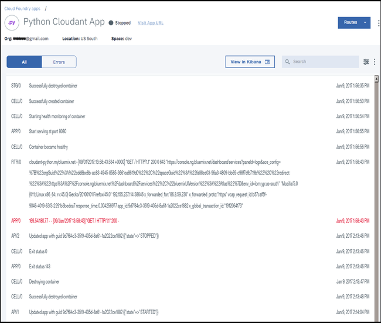

---

copyright:
  years: 2017, 2018
lastupdated: "2018-06-07"

---

{:new_window: target="_blank"}
{:shortdesc: .shortdesc}
{:screen: .screen}
{:codeblock: .codeblock}
{:pre: .pre}

<!-- Acrolinx: 2017-01-11 -->

# Einfache {{site.data.keyword.cloud_notm}}-Anwendung für den Zugriff auf eine {{site.data.keyword.cloudant_short_notm}}-Datenbank erstellen: Wartung und Fehlerbehebung

In diesem Lernprogramm erfahren Sie, wie Sie eine
{{site.data.keyword.cloud}}-Anwendung, die in Ihrer {{site.data.keyword.cloud_notm}}-Serviceinstanz gehostet ist, warten.
{:shortdesc}

## Grundlegende Anwendungswartungstasks ausführen

In diesem Abschnitt des Lernprogramms wird erläutert, wie Sie Ihre Python-Anwendungen unter {{site.data.keyword.cloud_notm}} aktualisieren,
starten und stoppen.

### Status Ihrer Anwendung herausfinden

Der Status von Anwendungen in Ihrer {{site.data.keyword.cloud_notm}}-Serviceinstanz wird im Dashboard angezeigt.

Im folgenden Beispiel wird die `Cloudant Python`-Anwendung nicht ausgeführt und hat den Status `Gestoppt`: 

### Anwendung starten

>   **Hinweis**: Wenn Sie versuchen, die Lernprogrammanwendung zu starten,
    ohne zunächst die Beispieldatenbank des Lernprogramms zu löschen,
    kann die Anwendung nicht ordnungsgemäß funktionieren.
    Die Anwendung versucht, zu starten, schlägt fehl, weil die Datenbank vorhanden ist,
    wird gestoppt und versucht dann erneut, zu starten usw.
    Beheben Sie dieses Problem, indem Sie die
    [Anwendung stoppen](#stopping-your-application)
    und dann die Beispieldatenbank des Lernprogramms löschen.
    Anschließend kann die Anwendung erfolgreich gestartet werden.

Um eine gestoppte Anwendung zu starten, klicken Sie zunächst auf das Symbol für das Anwendungsmenü im Dashboard: 

Klicken Sie dann auf die Option `App starten` im Menü: 

### Anwendung stoppen

Um eine aktive Anwendung zu stoppen, klicken Sie zunächst auf das Symbol für das Anwendungsmenü im Dashboard: 

Klicken Sie dann auf die Option `App stoppen` im Menü: 

### Neue Version Ihrer Anwendung hochladen

Um eine neue Version Ihrer Anwendung hochzuladen,
befolgen Sie einfach den [Uploadprozess](create_bmxapp_upload.html).
Die neue Version überschreibt die ältere Version der Anwendung.

>   **Hinweis**: Wenn die ältere Version der Anwendung bereits aktiv ist, wenn Sie den Upload starten,
    stoppt {{site.data.keyword.cloud_notm}} die Anwendung zuerst automatisch.

## Probleme diagnostizieren und beheben

In diesem Abschnitt des Lernprogramms finden Sie grundlegende Tipps zur Fehlerbehebung, die
es Ihnen erleichtern, Probleme zu erkennen, zu diagnostizieren und zu beheben, die beim
Entwickeln und Implementieren Ihrer ersten {{site.data.keyword.cloud_notm}}-Anwendungen auftreten können.

Eine gute Quelle für Ratschläge bezüglich Best Practices für die Erstellung von {{site.data.keyword.cloud_notm}}- oder
Cloud Foundry-Anwendungen finden Sie [hier ](https://docs.cloudfoundry.org/devguide/deploy-apps/prepare-to-deploy.html){:new_window}.

Insbesondere der Vorschlag,
[Schreibvorgänge in das lokale Dateisystem zu vermeiden ](https://docs.cloudfoundry.org/devguide/deploy-apps/prepare-to-deploy.html#filesystem){:new_window},
ist sinnvoll.

>   **Hinweis**: Aus Gründen der Einfachheit
    schreibt dieses Lernprogramm Inhalte in das lokale Dateisystem.
    Aber die Menge der Daten ist klein.
    Sie sind nicht dafür gedacht, dauerhaft erhalten zu bleiben,
    und sie sind nicht geschäftskritisch.

### Anwendungsprotokoll verwenden

Die nützlichste Ressource für die Diagnose und Behebung von Problemen mit
der {{site.data.keyword.cloud_notm}}-Anwendung ist die Protokolldatei.

Die Protokolldatei für eine {{site.data.keyword.cloud_notm}}-Anwendung finden Sie auf der Informationsseite `Protokolle`: 

Wie bei den meisten Protokolldateien enthält ein {{site.data.keyword.cloud_notm}}-Anwendungsprotokoll Details dazu, welche Ereignisse wann und wo aufgetreten sind.

Das Protokoll gibt auch an, welche Komponenten an dem aufgezeichneten Ereignis beteiligt waren.
In der folgenden Tabelle sind Schlüsselkomponenten aufgeführt:

Bezeichnung der Komponente | Komponente
----------------|----------
`API`           | Cloud Foundry-System.
`APP`           | Ihre Anwendung.
`CELL`          | Container, in dem Ihre Anwendung in {{site.data.keyword.cloud_notm}} gespeichert ist.
`RTR`           | Netzkomponenten übertragen Nachrichten an oder von Ihrer Anwendung.

Der folgende Screenshot enthält beispielsweise eine Reihe von typischen Ereignissen: 

Sehen Sie sich die Ereignisse an den folgenden Zeitpunkten an:

-   Um 1:56:56 PM wurde die Anwendung erfolgreich gestartet.
-   Um 1:58:43 PM hat das Netz eine einfache HTTP-Anforderung `GET /` empfangen.
-   Wenige Augenblicke später hat die Anwendung die HTTP-Anforderung empfangen und darauf geantwortet.
-   Um 2:13:46 PM wurde eine Anforderung empfangen, die Anwendung zu stoppen.
-   Um 2:13:48 PM hat die Anwendung den Stopp-Prozess abgeschlossen.

Die in diesem Lernprogramm beschriebene Anwendung ist absichtlich klein und unkompliziert gehalten.
Es wird beispielsweise kein Versuch unternommen, festzustellen, ob die Zieldatenbank vorhanden ist,
und falls ja, eine erneute Erstellung zu vermeiden.
Wenn Sie die Lernprogrammanwendung folglich mehr als einmal ausführen, ohne zunächst die Datenbank zu entfernen,
schlägt die Anwendung wiederholt fehl und wird neu gestartet.

Diesen Effekt sehen Sie im folgenden Screenshot: 

Um 2:31:23 PM hat die Anwendung ein Problem erkannt: 
`"Database {0} already exists".format(dbname)`

Die übrigen Nachrichten sind typisch für alle Python-Anwendungen, die ein Problem feststellen.

Tatsächlich zeigt das Protokoll, welche Komponente ein Problem festgestellt hat,
und gibt möglichst viele Details.
Beheben Sie das Problem mithilfe der üblichen Prozeduren zur Fehlerbehebung in Anwendungen.

## Ende des Lernprogramms

Das Lernprogramm ist abgeschlossen.
