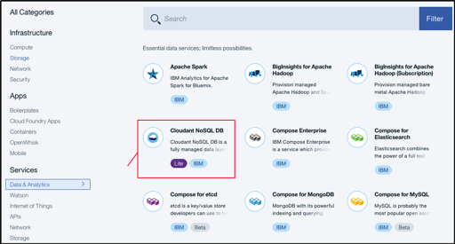

---

copyright:
  years: 2015, 2018
lastupdated: "2018-06-07"

---

{:new_window: target="_blank"}
{:shortdesc: .shortdesc}
{:screen: .screen}
{:codeblock: .codeblock}
{:pre: .pre}

<!-- Acrolinx: 2017-02-23 -->

# Instanz eines dedizierten {{site.data.keyword.cloudant_short_notm}}-Hardwareplans unter {{site.data.keyword.Bluemix_notm}} erstellen und nutzen

In diesem Lernprogramm erfahren Sie, wie Sie eine Instanz eines dedizierten {{site.data.keyword.cloudantfull}}-Hardwareplans mit dem {{site.data.keyword.Bluemix}}-Dashboard erstellen und anschließend mindestens eine Standardplaninstanz bereitstellen können, die unter dieser Hardwareplaninstanz ausgeführt werden kann. 

Durch das Erstellen einer dedizierten {{site.data.keyword.cloudant_short_notm}}-Hardwareplaninstanz wird eine {{site.data.keyword.cloudant_short_notm}}-Umgebung auf dedizierter Hardware bereitgestellt, die nur Sie verwenden können. Dabei wird eine Serviceinstanz im {{site.data.keyword.Bluemix_notm}}-Dashboard erstellt, doch es ist zu beachten,
dass Sie weder direkt auf die dedizierte Hardwareplaninstanz zugreifen können noch über zugehörige
Serviceberechtigungsnachweise für diese Instanz verfügen. Um eine dedizierte {{site.data.keyword.cloudant_short_notm}}-Hardwareplaninstanz nach ihrer Erstellung zu verwenden, müssen Sie mindestens eine Standardplaninstanz unter der Hardwareplaninstanz bereitstellen.

## Dedizierte {{site.data.keyword.cloudant_short_notm}}-Hardwareplaninstanz erstellen

1.  Melden Sie sich bei Ihrem {{site.data.keyword.Bluemix_notm}}-Konto an. 
    Das {{site.data.keyword.Bluemix_notm}}-Dashboard finden Sie hier:
    [http://bluemix.net ](http://bluemix.net){:new_window}.
    Nach der Authentifizierung mit Ihrem Benutzernamen und Ihrem Kennwort wird das {{site.data.keyword.Bluemix_notm}}-Dashboard geöffnet: 
    

2.  Klicken Sie auf den Link `Katalog`: 
     
    Eine Liste der verfügbaren Services, die unter {{site.data.keyword.Bluemix_notm}} verfügbar sind, wird angezeigt.

3.  Klicken Sie auf den Eintrag `Daten und Analysen` unter der Überschrift `Services`: 
     
    Es wird eine Liste der Daten- und Analyseservices angezeigt,
    die unter {{site.data.keyword.Bluemix_notm}} verfügbar sind.

4.  Klicken Sie auf den {{site.data.keyword.cloudant_short_notm}}-Service: 
     
    Die Seite zum Erstellen eines Service wird geöffnet. 

5.  Wählen Sie den Hardwareplan `Dedizierte Hardware` in der Liste der Preistarife unten auf der Seite aus: 
    
    
6.  Geben Sie oben auf der Seite die folgenden Parameter an:  
    -   Geben Sie einen Servicenamen ein. 
    -   Geben Sie die Region und den Bereich für die Bereitstellung an. 
    -   Wählen Sie einen Standort für die Bereitstellung aus. 
    -   Beantworten Sie die Frage, ob HIPAA erforderlich ist, mit 'Ja' oder 'Nein'. Beachten Sie, dass HIPAA nur für Standorte in den Vereinigten Staaten gilt.  
     
    **Hinweis**: Standardplaninstanzen werden in derselben Region und im selben Bereich bereitgestellt und eingerichtet.    
     
    Starten Sie den Bereitstellungsprozess. 
    
7.  Klicken Sie auf die Schaltfläche `Erstellen` unten auf der Seite, um mit der Bereitstellung zu beginnen.  
    **Hinweis**: Die Abrechnung erfolgt anteilmäßig pro Tag. Stellen Sie daher sicher, dass Sie die angegebene Umgebung
    kostenpflichtig bereitstellen möchten, bevor Sie auf die Schaltfläche **Erstellen** klicken. 
     
    **Hinweis**: Während der Bereitstellung wird ein sich drehendes Rad neben der Instanz in Ihrem
    {{site.data.keyword.Bluemix_notm}}-Dashboard angezeigt. Eine Anforderung zum Bereitstellen einer dedizierten Hardwareplaninstanz auf
    Bare-Metal-Servern wird gesendet. Die Bereitstellungszeit ist asynchron und kann bis 5 Tage dauern.
     
    
## Standardplaninstanz in einer dedizierten Hardwareumgebung bereitstellen

1.  Melden Sie sich bei Ihrem {{site.data.keyword.Bluemix_notm}}-Konto an. 
    Das {{site.data.keyword.Bluemix_notm}}-Dashboard finden Sie hier:
    [http://bluemix.net ](http://bluemix.net){:new_window}.
    Nach der Authentifizierung mit Ihrem Benutzernamen und Ihrem Kennwort wird das {{site.data.keyword.Bluemix_notm}}-Dashboard geöffnet: 
    

2.  Klicken Sie auf den Link `Katalog`: 
     
    Eine Liste der verfügbaren Services, die unter {{site.data.keyword.Bluemix_notm}} verfügbar sind, wird angezeigt.

3.  Klicken Sie auf den Eintrag `Daten und Analysen` unter der Überschrift `Services`: 
     
    Es wird eine Liste der Daten- und Analyseservices angezeigt,
    die unter {{site.data.keyword.Bluemix_notm}} verfügbar sind.

4.  Klicken Sie auf den {{site.data.keyword.cloudant_short_notm}}-Service: 
     
    Die Seite zum Erstellen eines Service wird geöffnet.  

5.  Klicken Sie in den Preistarifen unten auf der Seite auf `Standard`.  
    **Hinweis**: In einer dedizierten Hardwareumgebung kann keine Lite-Planinstanz bereitgestellt werden. 
    
    
6.  Geben Sie die Parameter oben auf der Seite an, indem Sie einen Servicenamen, einen Berechtigungsnachweisnamen usw. wie für eine Standardplaninstanz eingeben. Legen Sie fest, ob die Bereitstellung in der standardmäßigen regionalen
    Multi-Tenant-Umgebung erfolgen soll oder in der dedizierten Hardwareumgebung, indem Sie in der Dropdown-Liste `Umgebung auswählen` den entsprechenden Eintrag auswählen. 
    
    
7.  Klicken Sie auf die Schaltfläche `Erstellen` unten auf der Seite. 
    Nach einigen Sekunden wird die Instanz in der ausgewählten Umgebung bereitgestellt. 
    
    
8.  Rufen Sie Ihren Serviceberechtigungsnachweis ab und greifen Sie auf das {{site.data.keyword.cloudant_short_notm}}-Dashboard zu wie bei einer {{site.data.keyword.cloudant_short_notm}}-Multi-Tenant-Instanz. 
    Weitere Informationen zum Abrufen Ihres Serviceberechtigungsnachweises finden Sie [hier ](https://console.bluemix.net/docs/services/Cloudant/tutorials/create_service.html#locating-your-service-credentials){:new_window}. 
     
