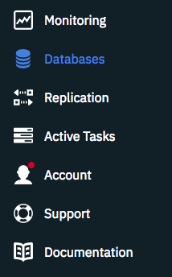

---

copyright:
  years: 2017, 2018
lastupdated: "2018-06-20"

---
{:new_window: target="_blank"}
{:shortdesc: .shortdesc}
{:screen: .screen}
{:codeblock: .codeblock}
{:pre: .pre}
{:tip: .tip}

<!-- Acrolinx: 2018-06-13 -->

# {{site.data.keyword.cloudant_short_notm}}-Abfrage erstellen

In diesem Lernprogramm erfahren Sie, wie Sie eine Datenbank erstellen, mit Dokumenten
füllen, einen Index erstellen und mit diesem die Datenbank abfragen.

Es werden Übungen für die  _Befehlszeile_
und für das  _{{site.data.keyword.Bluemix_notm}}-Dashboard_ zur Verfügung gestellt. Die
Übungen für das {{site.data.keyword.Bluemix}}-Dashboard liefern Ihnen ein visuelles Beispiel für jede Task. Im gesamten Lernprogramm können Sie auf die Links klicken, um
weitere Informationen zu erhalten.

Sie beginnen, indem Sie die Datenbank `query-demo` erstellen, sowie ein paar Dokumente, die
die Daten für diese Übungen enthalten.

## Voraussetzungen

Führen Sie zunächst die folgenden Schritte aus, um sich auf das Lernprogramm vorzubereiten:

1.  [Erstellen Sie ein {{site.data.keyword.Bluemix}}-Konto ](https://console.ng.bluemix.net/registration/){:new_window}.
2.  Melden Sie sich beim
  [{{site.data.keyword.Bluemix_notm}}-Dashboard ](https://console.ng.bluemix.net/catalog/services/cloudant-nosql-db){:new_window} an.
3.  [Erstellen Sie eine {{site.data.keyword.cloudant_short_notm}}-Instanz unter {{site.data.keyword.Bluemix_notm}}](create_service.html#creating-a-service-instance).
4.  (Optional) [Erstellen Sie einen Alias 'acurl'](../guides/acurl.html#authorized-curl-acurl-), um einfacher und schneller Befehle über die Befehlszeile ausführen zu können.
5.  Ersetzen Sie die Variable `$ACCOUNT` in den Befehlen, die in den Übungen enthalten sind, durch den Benutzernamen, den Sie verwenden, um sich beim {{site.data.keyword.cloudant_short_notm}}-Dashboard anzumelden.
  Wenn Sie sich entscheiden, `acurl` nicht einzurichten,
  verwenden Sie die folgende URL statt eine der in den Übungen angegebenen:
  ``` sh
  curl https://$USERNAME:$PASSWORD@$ACCOUNT.cloudant.com/query-demo
  ```
  {:codeblock}

## Datenbank erstellen

In diesem Abschnitt erstellen Sie die [Datenbank](../api/database.html#create) `query-demo`. Dabei handelt
es sich um die Datenbank, die wir in diesem Lernprogramm verwenden.

> **Hinweis:** In diesem Lernprogramm
  verwenden wir den Alias `acurl` anstelle des Befehls `curl`.
  Der Alias `acurl` wird mithilfe der [hier](../guides/acurl.html#authorized-curl-acurl-) beschriebenen Schritte erstellt.
  Wenn Sie lieber den Befehl `curl`
  oder eine andere Methode zum Aufrufen von API-Endpunkten verwenden möchten,
  geben Sie Ihren Befehl im Lernprogramm an,
  ebenso wie die für Ihren Befehl erforderlichen Parameter
  wie Benutzername und Kennwort.

 _Befehlszeile_

1.  Erstellen Sie eine Datenbank, indem Sie diesen Befehl ausführen:
  ``` sh
  acurl https://$ACCOUNT.cloudant.com/query-demo -X PUT
  ```
  {:codeblock}
2.  Überprüfen Sie die Ergebnisse:
  ```json
  {
    "ok": true
  }
  ```
  {:codeblock}

 _{{site.data.keyword.Bluemix_notm}}-Dashboard_

1.  Öffnen Sie die {{site.data.keyword.cloudant_short_notm}}-Serviceinstanz, die Sie erstellt haben.
2.  Klicken Sie auf der {{site.data.keyword.cloudant_short_notm}}-Serviceseite auf **Starten**.
    Die Registerkarte mit den Datenbanken wird geöffnet.
    
  
4.  Klicken Sie auf **Datenbank erstellen**.
5.  Geben Sie `query-demo` ein und klicken Sie auf **Erstellen**.

  Die Datenbank `query-demo` wird automatisch geöffnet.

## Dokumente in der Datenbank erstellen

Die [Dokumente](../api/document.html#documents),
die Sie in dieser Übung erstellen, enthalten die Daten, mit denen Sie die Datenbank `query-demo` in späteren Übungen abfragen.

 _Befehlszeile_

1.  Kopieren Sie den Beispieltext in eine Datendatei namens `bulkcreate.dat`, um fünf Dokumente zu erstellen:
  ```json
  {
    "docs":
    [
      {
        "_id": "doc1",
        "firstname": "Sally",
        "lastname": "Brown",
        "age": 16,
        "location": "New York City, NY"
      },
      {
        "_id": "doc2",
        "firstname": "John",
        "lastname": "Brown",
        "age": 21,
        "location": "New York City, NY"
      },
      {
        "_id": "doc3",
        "firstname": "Greg",
        "lastname": "Greene",
        "age": 35,
        "location": "San Diego, CA"
      },
      {
        "_id": "doc4",
        "firstname": "Anna",
        "lastname": "Greene",
        "age": 44,
        "location": "Baton Rouge, LA"
      },
      {
        "_id": "doc5",
        "firstname": "Lois",
        "lastname": "Brown",
        "age": 33,
        "location": "Syracuse, NY"
      }
    ]
  }
  ```
  {:codeblock}

2.  Führen Sie diesen Befehl aus, um die Dokumente zu erstellen:
  ```sh
  acurl https://$ACCOUNT.cloudant.com/query-demo/_bulk_docs -X POST -H "Content-Type: application/json" -d \@bulkcreate.dat
  ```
  {:codeblock}

  **Hinweis:** Beachten Sie, dass das Symbol `@`, das angibt, dass die Daten in einer Datei enthalten sind, durch den bereitgestellten Namen ergänzt wird.
3.  Überprüfen Sie die Ergebnisse:
  ```json
  [
    {
      "ok":true,
      "id":"doc1",
      "rev":"1-57a08e644ca8c1bb8d8931240427162e"
    },
    {
      "ok":true,
      "id":"doc2",
      "rev":"1-bf51eef712165a9999a52a97e2209ac0"
    },
    {
      "ok":true,
      "id":"doc3",
      "rev":"1-9c9f9b893fcdd1cbe09420bc4e62cc71"
    },
    {
      "ok":true,
      "id":"doc4",
      "rev":"1-6aa4873443ddce569b27ab35d7bf78a2"
    },
    {
      "ok":true,
      "id":"doc5",
      "rev":"1-d881d863052cd9681650773206c0d65a"
    }
  ]
  ```
  {:codeblock}

 _{{site.data.keyword.Bluemix_notm}}-Dashboard_

1.  Klicken Sie auf **`+`** und wählen Sie **Neues Dokument** aus. Das Fenster 'Neues Dokument' wird geöffnet.
2.  Um ein Dokument zu erstellen, kopieren Sie den folgenden Beispieltext und ersetzen den vorhandenen Text in dem neuen Dokument.

  _Erstes Beispieldokument_:
  ```json
  {
    "firstname": "Sally",
    "lastname": "Brown",
    "age": 16,
    "location": "New York City, NY",
    "_id": "doc1"
  }
  ```
  {:codeblock}

3.  Wiederholen Sie Schritt 2, um die restlichen Dokumente zur Datenbank hinzuzufügen.

  _Zweites Beispieldokument_:
  ```json
  {
    "firstname": "John",
    "lastname": "Brown",
    "age": 21,
    "location": "New York City, NY",
    "_id": "doc2"
  }
  ```
  {:codeblock}

  _Drittes Beispieldokument_:
  ```json
  {
    "firstname": "Greg",
    "lastname": "Greene",
    "age": 35,
    "location": "San Diego, CA",
    "_id": "doc3"
  }
  ```
  {:codeblock}

  _Viertes Beispieldokument_:
  ```json
  {
    "firstname": "Anna",
    "lastname": "Greene",
    "age": 44,
    "location": "Baton Rouge, LA",
    "_id": "doc4"
  }
  ```
  {:codeblock}

  _Fünftes Beispieldokument_:
  ```json
  {
    "firstname": "Lois",
    "lastname": "Brown",
    "age": 33,
    "location": "New York City, NY",
    "_id": "doc5"
  }
  ```
  {:codeblock}

  Die Datenbank `query-demo` wurde mit fünf Datensätzen gefüllt. Diese Datensätze werden in der Tabellenansicht im folgenden Screenshot angezeigt:

       

## Index erstellen

{{site.data.keyword.cloudant_short_notm}} stellt Ansichten und Indizes zum Abfragen der Datenbank bereit. Eine Ansicht führt eine Abfrage aus, die in der Datenbank gespeichert ist, und das Ergebnis wird Ergebnismenge genannt. Wenn Sie eine Abfrage an die Ansicht übergeben, durchsucht Ihre Abfrage die Ergebnismenge. Ein Index ist eine Möglichkeit, Daten zu strukturieren, um die Abrufzeit zu verbessern.

Sie können den Primärindex, der mit {{site.data.keyword.cloudant_short_notm}} bereitgestellt wird, oder die sekundären Indizes
wie Ansichten (MapReduce), Suchindizes, {{site.data.keyword.cloudant_short_notm}}-Geospatial-Abfragen oder
{{site.data.keyword.cloudant_short_notm}} Query wie in der folgenden Liste beschrieben verwenden:

*	Primärindex – Suche nach einem Dokument oder einer Liste von Dokumenten nach ID.  
*	[Ansicht](../api/creating_views.html#views-mapreduce-) – Suche nach Informationen in der Datenbank, die den angegebenen Suchkriterien entsprechen, z. B. Anzahlen, Summen, Durchschnitte und andere mathematische Funktionen. Die Kriterien, nach den Sie suchen können, sind in der Definition der Ansicht angegeben. Ansichten verwenden das MapReduce-Konzept.
*	[Suchindex](../api/search.html#search) – Suche nach mindestens einem Feld bzw. nach großen Mengen von Text oder Verwendung von Platzhaltern, unscharfer Suche oder Facetten mit [Lucene QueryParsers-Syntax ](http://lucene.apache.org/core/4_3_0/queryparser/org/apache/lucene/queryparser/classic/package-summary.html#Overview){:new_window}.
*	[{{site.data.keyword.cloudant_short_notm}} Geospatial](../api/cloudant-geo.html#cloudant-geospatial) – Suche nach Dokumenten auf der Basis einer räumlichen Beziehung.
*	[{{site.data.keyword.cloudant_short_notm}} Query](../api/cloudant_query.html#query) – Verwendung einer Abfragesyntax im Mongo-Stil für die Suche nach Dokumenten mithilfe logischer Operatoren. {{site.data.keyword.cloudant_short_notm}} Query ist eine Kombination aus einer Ansicht und einem Suchindex. In diesem Lernprogramm wird {{site.data.keyword.cloudant_short_notm}} Query verwendet.

> **Hinweis:** Wenn es keinen verfügbaren definierten Index gibt, der mit der angegebenen Abfrage übereinstimmt, dann verwendet {{site.data.keyword.cloudant_short_notm}}
> den Index `_all_docs`.


 _Befehlszeile_

1.  Kopieren Sie die folgenden JSON-Beispieldaten in eine Datei namens `query-index.dat`.
  ```json
{
	"index": {
		"fields": [
			"age",
			"lastname"
		],
		"partial_filter_selector": {
			"age": {
				"$gte": 30
			},
			"lastname": {
				"$eq": "Greene"
			}
		}
	},
  		"ddoc": "partial-index",
		"type": "json"
}
  ```
  {:codeblock}

2.  Führen Sie den folgenden Befehl aus, um einen Index zu erstellen:
  ```sh
  acurl https://$ACCOUNT.cloudant.com/query-demo/_index -X POST -H "Content-Type: application/json" -d \@query-index.dat
  ```
  {:codeblock}

3.  Überprüfen Sie die Ergebnisse:
  ```json
  {
    "result":"created",
    "id":"_design/752c7031f3eaee0f907d18e1424ad387459bfc1d",
    "name":"query-index"
  }
  ```
  {:codeblock}


 _{{site.data.keyword.Bluemix_notm}}-Dashboard_

1.  Klicken Sie auf **`+` > Abfrageindizes** auf der Registerkarte **Alle Dokumente** oder auf der Registerkarte **Entwurfsdokumente**.
2.  Fügen Sie die folgenden JSON-Beispieldaten in das Feld **Index** ein:
  ```json
{
	"index": {
		"fields": [
			"age",
			"lastname"
		],
		"partial_filter_selector": {
			"age": {
				"$gte": 30
			},
			"lastname": {
				"$eq": "Greene"
			}
		}
	},
  		"ddoc": "partial-index",
		"type": "json"
}
  ```
  {:codeblock}

  Der Index wurde erstellt. Der Index wird im folgenden Screenshot angezeigt:

  


## Abfrage erstellen

Mithilfe von Abfragen können Sie Ihre Daten aus {{site.data.keyword.cloudant_short_notm}} extrahieren. Eine gut formulierte
[Abfrage](../api/cloudant_query.html#query) kann Ihre Suche und die zurückgegebenen Ergebnisse eingrenzen,
damit nur die gewünschten Daten enthalten sind.

In dieser Übung wird gezeigt, wie Sie eine einfache Abfrage, eine Abfrage mit zwei Feldern und eine Abfrage mit zwei [Operatoren](../api/cloudant_query.html#cloudant_query.html#operators) schreiben und ausführen können.
Sie führen eine Abfrage mit einem Operator aus, indem Sie mindestens ein Feld und den zugehörigen Wert angeben.
Die Abfrage führt dann diesen Wert aus, um in der Datenbank nach Übereinstimmungen zu suchen.

Bei allen außer den einfachsten Abfragen fügen Sie die JSON zu einer Datendatei hinzu und führen sie über die Befehlszeile aus.

### Einfache Abfrage ausführen

In diesem Beispiel wird veranschaulicht, wie {{site.data.keyword.cloudant_short_notm}} Query `query-index` verwendet,
um das Element `lastname` zu suchen, und die Ergebnisse im Speicher filtert, um das Element `firstname` zu suchen.   

 _Befehlszeile_

1.  Kopieren Sie die folgende Beispiel-JSON in eine Datendatei namens `query1.dat`.
  ```json
    {
      "selector": {
            "lastname" : "Greene",
            "firstname" : "Anna"            
         }        
    }       
  ```    
  {:codeblock}

2.  Führen Sie den folgenden Befehl aus, um die Datenbank abzufragen:
  ```sh
  acurl https://$ACCOUNT.cloudant.com/query-demo/_find -X POST -H "Content-Type: application/json" -d \@query1.dat
  ```
  {:codeblock}

3.  Überprüfen Sie die Abfrageergebnisse:
  ```json
  {
    "docs": [
      {
        "_id":"doc4",
        "_rev":"3-751ab049e8b5dd1ba045cea010a33a72",
            "firstname":"Anna",
            "lastname":"Greene",
            "age":44,
            "location":"Baton Rouge, LA"
      }
    ]
  }
  ```
  {:codeblock}

 _{{site.data.keyword.Bluemix_notm}}-Dashboard_

1.  Klicken Sie auf die Registerkarte **Abfrage**.
2.  Kopieren Sie die folgenden JSON-Beispieldaten und fügen Sie sie in das {{site.data.keyword.cloudant_short_notm}} Query-Fenster ein:
  ```json
   {
      "selector": {
            "lastname" : "Greene",
            "firstname" : "Anna"            
         }        
   }
  ```
  {:codeblock}

3.  Klicken Sie auf **Abfrage ausführen**.

  Die Abfrageergebnisse werden angezeigt. Diese werden in der Tabellenansicht im folgenden Screenshot angezeigt:

  

### Abfrage mit zwei Feldern ausführen

In diesem Beispiel werden zwei Felder verwendet, um alle Personen namens `Brown` zu finden, die in `New York City, NY` leben.

Wir beschreiben die Suche anhand eines [Selektorausdrucks](../api/cloudant_query.html#selector-syntax) ähnlich dem folgenden Beispiel:
```json
  {
    "selector": {
      "lastname": "Brown",
      "location": "New York City, NY"
    }
  }
```
{:codeblock}

Wir können die Ergebnisse so anpassen, dass sie unsere Anforderungen erfüllen, indem wir weitere Details im Selektorausdruck angeben.
Der Parameter `fields` gibt die Felder an, die in die Ergebnisse eingeschlossen werden sollen. In unserem Beispiel enthalten die
Ergebnisse den Vornamen, den Nachnamen und den Standort. Die Ergebnisse werden in aufsteigender Reihenfolge nach Vorname sortiert, basierend auf den Werten im Parameter `sort`.
Die zusätzlichen Details entsprechen dem folgenden Beispiel:
```json
{
  ...
  "fields" : [
    "firstname",
      "lastname",
      "location"
  ]
}
```  
{:codeblock}

 _Befehlszeile_

1.  Kopieren Sie die Beispiel-JSON in eine Datendatei namens `query2.dat`.
  ```json
  {
    "selector": {
      "lastname": "Brown",
      "location": "New York City, NY"
    },
    "fields": [
     "firstname",
     "lastname",
     "location"
  ]
  }
  ```
  {:codeblock}

2.  Führen Sie den folgenden Befehl aus, um die Datenbank abzufragen:
  ```sh
  acurl https://$ACCOUNT.cloudant.com/query-demo/_find -X POST -H "Content-Type: application/json" -d \@query2.dat
  ```
  {:codeblock}

3.  Überprüfen Sie die Abfrageergebnisse:
  ```json
  {
    "docs": [
      {
        "firstname": "Sally",
        "lastname": "Brown",
        "location": "New York City, NY"
      },
      {
        "firstname": "John",
        "lastname": "Brown",
        "location": "New York City, NY"
      },
      {
        "firstname": "Lois",
        "lastname": "Brown",
        "location": "New York City, NY"
      }
    ]
  }
  ```
  {:codeblock}

 _{{site.data.keyword.Bluemix_notm}}-Dashboard_

1.  Klicken Sie auf die Registerkarte **Abfrage**.
2.  Kopieren Sie die folgenden JSON-Beispieldaten und fügen Sie sie in das {{site.data.keyword.cloudant_short_notm}} Query-Fenster ein:
  ```json
  {
    "selector": {
      "lastname": "Brown",
      "location": "New York City, NY"
    },
    "fields": [
      "firstname",
      "lastname",
      "location"
    ] 
  }
  ```
  {:codeblock}

3.  Klicken Sie auf **Abfrage ausführen**.

  Die Abfrageergebnisse werden angezeigt. Diese werden in der Tabellenansicht im folgenden Screenshot angezeigt:

  

### Abfrage mit Operatoren ausführen

In diesem Beispiel werden die Operatoren `$eq` (gleich) und `$gt` (größer als) verwendet, um nach
Dokumenten zu suchen, die den Nachnamen `Greene` und eine Altersangabe größer als `30` enthalten.

Wir verwenden einen Selektorausdruck wie im folgenden Beispiel:
```json
{
  "selector": {
    "age": {
      "$gt": 30
    },
    "lastname": {
      "$eq": "Greene"
    }
  }
}
``` 
{:codeblock}

Die Ergebnisse werden in aufsteigender Reihenfolge nach Alter sortiert, basierend auf den Werten im Parameter `sort`.

```json
    "sort": [
      {
        "age": "asc"
      }
    ] 
```  
{:codeblock}

 _Befehlszeile_

1.  Kopieren Sie die folgende Beispiel-JSON in eine Datei namens `query3.dat`.
  ```json
{
   "selector": {
      "age": {
         "$gt": 30
      },
      "lastname": {
         "$eq": "Greene"
      }
   },
    "fields": [
      "age",
      "firstname"
   ],
    "sort": [
      {
         "age": "asc"
      }
   ],
   "use_index": "_design/partial-index"
}
  ```
  {:codeblock}

2. Führen Sie diese Abfrage aus:
  ```sh
  acurl https://$ACCOUNT.cloudant.com/query-demo/_find -X POST -H "Content-Type: application/json" -d \@query3.dat
  ```
  {:codeblock}

3.  Überprüfen Sie die Abfrageergebnisse:
  ```json
{"docs":[
     {"age":35,"firstname":"Greg"},
     {"age":44,"firstname":"Anna"}
   ],
"bookmark": "g1AAAABCeJzLYWBgYMpgSmHgKy5JLCrJTq2MT8lPzkzJBYqzAFkmIDkOmFwOSHWiDkiSzb0oNTUvNSsLAEsmEeQ"
}
  ```
  {:codeblock}

 _{{site.data.keyword.Bluemix_notm}}-Dashboard_

1.  Klicken Sie auf die Registerkarte **Abfrage**.
2.  Kopieren Sie die folgenden JSON-Beispieldaten und fügen Sie sie in das {{site.data.keyword.cloudant_short_notm}} Query-Fenster ein:
  ```json
{
   "selector": {
      "age": {
         "$gt": 30
      },
      "lastname": {
         "$eq": "Greene"
      }
   },
    "fields": [
      "age",
      "firstname"
   ],
    "sort": [
      {
         "age": "asc"
      }
   ],
   "use_index": "_design/partial-index"
}
  ```
  {:codeblock}

3.  Klicken Sie auf **Abfrage ausführen**.

  Die Abfrageergebnisse werden angezeigt. Diese werden in der Tabellenansicht im folgenden Screenshot angezeigt:

  

Weitere Informationen zu {{site.data.keyword.cloudant_short_notm}} finden Sie in der [{{site.data.keyword.cloudant_short_notm}}-Dokumentation](../cloudant.html#overview).
