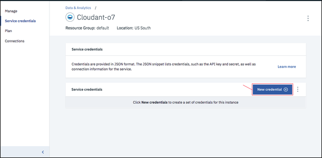

---

copyright:
  years: 2017, 2019
lastupdated: "2019-06-12"

keywords: create service instance, service credentials, locate service credentials

subcollection: cloudant

---

{:new_window: target="_blank"}
{:shortdesc: .shortdesc}
{:screen: .screen}
{:codeblock: .codeblock}
{:pre: .pre}
{:tip: .tip}
{:note: .note}
{:important: .important}
{:deprecated: .deprecated}

<!-- Acrolinx: 2018-09-19 -->

# {{site.data.keyword.cloudant_short_notm}}-Instanz unter {{site.data.keyword.cloud_notm}} erstellen
{: #creating-an-ibm-cloudant-instance-on-ibm-cloud}

In diesem Lernprogramm erfahren Sie, wie Sie eine {{site.data.keyword.cloudantfull}}-Serviceinstanz
mithilfe des {{site.data.keyword.cloud}}-Dashboards erstellen und wo Sie die für die Zusammenarbeit
Ihrer Anwendungen mit der Datenbank wichtigen Informationen finden.
{: shortdesc} 

## Serviceinstanz erstellen
{: #creating-a-service-instance}

1.  Melden Sie sich bei Ihrem {{site.data.keyword.cloud_notm}}-Konto an. 
    Das {{site.data.keyword.cloud_notm}}-Dashboard finden Sie hier:
    [https://cloud.ibm.com/](https://cloud.ibm.com/){: new_window}.
    Nach der Authentifizierung mit Ihrem Benutzernamen und Ihrem Kennwort wird das
    {{site.data.keyword.cloud_notm}}-Dashboard angezeigt. Klicken Sie auf die Schaltfläche `Ressource erstellen`.  
    

2.  Klicken Sie im Menü auf `Datenbanken` und in der Liste der Datenbankservices auf `Cloudant`: 
     

3.  Geben Sie im Servicekonfigurationsfenster einen Servicenamen ein. Überprüfen Sie, dass Servicename, Region/Standort, Ressourcengruppe und Authentifizierungsmethoden korrekt sind. Fügen Sie einen Tag hinzu, falls gewünscht. Die verfügbaren Authentifizierungsmethoden sind `Nur IAM verwenden` und `Traditionelle Berechtigungsnachweise und IAM-Berechtigungsnachweise verwenden`. Weitere Informationen hierzu finden Sie im Abschnitt zu den [Authentifizierungsmethoden](/docs/services/Cloudant?topic=cloudant-ibm-cloud-identity-and-access-management-iam-#ibm-cloud-identity-and-access-management-iam-){: new_window}. 
    In diesem Beispiel lautet der Servicename `Cloudant-o7`: 
    
    
Das {{site.data.keyword.cloudant_short_notm}}-Team empfiehlt die Verwendung der IAM-Zugriffssteuerung anstelle der traditionellen {{site.data.keyword.cloudant_short_notm}}-Authentifizierung, soweit möglich.
{: important}

4.  Standardmäßig wird der Service mithilfe des Preisstrukturplans 'Lite' erstellt, der kostenlos ist, aber nur eine begrenzte Durchsatzkapazität und einen begrenzten Datenspeicher bereitstellt. Wenn Sie über ein gebührenpflichtiges {{site.data.keyword.cloud_notm}}-Konto verfügen, dann können Sie außerdem den gebührenpflichtigen Plan 'Standard' auswählen und damit die bereitgestellte Durchsatzkapazität ändern und Ihr Datennutzungsvolumen nach Bedarf skalieren. Weitere Informationen zu den Preisstrukturplänen finden Sie im Abschnitt zu den [Plänen](/docs/services/Cloudant?topic=cloudant-ibm-cloud-public#plans){: new_window}. Klicken Sie auf die Schaltfläche `Erstellen`, um den Service zu erstellen: 
    

5.  Eine Serviceseite wird angezeigt, auf der bestätigt wird, dass Ihr neuer
    {{site.data.keyword.cloudant_short_notm}}-Service verfügbar ist.
    Klicken Sie auf die Registerkarte `Serviceberechtigungsnachweise`, um die Verbindungsinformationen zu erstellen,
    die Ihre Anwendung für eine Verbindung mit dem Service benötigt: 
    

6.  Erstellen Sie einen neuen {{site.data.keyword.cloudant_short_notm}}-Serviceberechtigungsnachweis:
   a. Klicken Sie auf die Schaltfläche `Neuer Berechtigungsnachweis`.
   
   b. Geben Sie im Fenster 'Neuen Berechtigungsnachweis hinzufügen' einen Namen für den neuen Berechtigungsnachweis ein. Siehe hierzu die Abbildung.
   c. Akzeptieren Sie die Rolle 'Manager'.
   d. (Optional) Erstellen Sie eine neue Service-ID oder lassen Sie eine Service-ID automatisch generieren. 
   d. (Optional) Fügen Sie Inline-Konfigurationsparameter hinzu. Beachten Sie hierbei, dass dieser Parameter momentan für {{site.data.keyword.cloudant_short_notm}}-Serviceberechtigungsnachweise nicht verwendet wird und ignoriert werden kann. 
   e. e. Klicken Sie auf die Schaltfläche `Hinzufügen`. 
   
   Ihr neuer Berechtigungsnachweis wird im Anschluss an die Tabelle angezeigt. 
   f. Klicken Sie unter 'Aktionen' auf `Berechtigungsnachweise anzeigen`.
   

7.  Daraufhin werden die Details zu den Serviceberechtigungsnachweisen angezeigt: 
    

Die Serviceberechtigungsnachweise in diesen Beispielen wurden definiert, als eine Demonstrationsversion des {{site.data.keyword.cloudant_short_notm}}-Service unter {{site.data.keyword.cloudant_short_notm}} erstellt wurde. Die Berechtigungsnachweise werden hier reproduziert, um zu zeigen, wie sie im Dashboard angezeigt werden. Die Demonstrationsversion des {{site.data.keyword.cloudant_short_notm}}-Service wurde jedoch entfernt, sodass diese Berechtigungsnachweise nicht mehr gültig sind. Sie _müssen_ eigene Serviceberechtigungsnachweise angeben und verwenden.
{: note}

## Serviceberechtigungsnachweise
{: #the-service-credentials}

Serviceberechtigungsnachweise sind wertvoll. Wenn Benutzer oder Anwendungen Zugriff auf die Berechtigungsnachweise haben, können sie die Serviceinstanz in beliebiger Weise nutzen. Sie können beispielsweise gefälschte Daten erstellen oder wertvolle Informationen löschen. Schützen Sie diese Berechtigungsnachweise sorgfältig.
    
{{site.data.keyword.cloudant_short_notm}} verfügt während der Bereitstellung über zwei Authentifizierungsmethoden, und zwar `Nur IAM verwenden` und `Traditionelle Berechtigungsnachweise und IAM-Berechtigungsnachweise verwenden`. Die Details zu Ihren traditionellen Berechtigungsnachweisen können nur dann angezeigt werden, wenn die Authentifizierungsmethode `Traditionelle Berechtigungsnachweise und IAM-Berechtigungsnachweise verwenden` ausgewählt wird. Die Berechtigungsnachweise werden auf der Registerkarte 'Serviceberechtigungsnachweise' Ihrer Instanz angezeigt. Weiterführende detaillierte Informationen zur Verwendung der beiden Authentifizierungsoptionen finden Sie im
[IAM-Leitfaden](/docs/services/Cloudant?topic=cloudant-ibm-cloud-identity-and-access-management-iam-#ibm-cloud-identity-and-access-management-iam-) und im Dokument zur [traditionellen Authentifizierung](/docs/services/Cloudant?topic=cloudant-authentication#authentication).

Die Serviceberechtigungsnachweise beinhalten die folgenden Felder:

Feld | Zweck
------|--------
`username` | Der Servicename des Benutzers der Serviceinstanz in der URL. Dieses Feld dient auch als Administratorbenutzername. 
`password` | Das Kennwort für die traditionellen Berechtigungsnachweise, das für Anwendungen für den Zugriff auf die Serviceinstanz benötigt wird. Dieses Feld wird nur angezeigt, wenn die Option `Traditionelle Berechtigungsnachweise und IAM-Berechtigungsnachweise verwenden` ausgewählt wird. 
`host` | Von Anwendungen verwendeter Hostname zum Suchen der Serviceinstanz. Dieses Feld wird nur angezeigt, wenn die Option `Traditionelle Berechtigungsnachweise und IAM-Berechtigungsnachweise verwenden` ausgewählt wird. 
`port` | Die HTTPS-Portnummer für den Zugriff auf die Serviceinstanz auf dem Host. Sie lautet '443', da von {{site.data.keyword.cloudant_short_notm}} nur der HTTPS-Zugriff zugelassen wird. Dieses Feld wird nur angezeigt, wenn die Option `Traditionelle Berechtigungsnachweise und IAM-Berechtigungsnachweise verwenden` ausgewählt wird. 
`url`	| Die HTTPS-URL für den Zugriff auf die {{site.data.keyword.cloudant_short_notm}}-Instanz. Wenn die Option `Traditionelle Berechtigungsnachweise und IAM-Berechtigungsnachweise verwenden` ausgewählt wird, dann umfasst sie auch den eingebetteten traditionellen Benutzernamen und das zugehörige Kennwort. 
`apikey` | Der IAM-API-Schlüssel. 
`iam_apikey_description` | Die Beschreibung des IAM-API-Schlüssels. 
`iam_apikey_name` | Die ID des IAM-API-Schlüssels.
`iam_role_crn` | Die IAM-Rolle, die dem IAM-API-Schlüssel zugeordnet wurde.
`iam_serviceid_crn`	| Der CRN der Service-ID.

Um eine Anwendung zu erstellen, die auf Ihre Serviceinstanz zugreifen kann, benötigen Sie diese Berechtigungsnachweise.

## Serviceberechtigungsnachweise suchen
{: #locating-your-service-credentials}

Sie können die Berechtigungsnachweise für einen Service, der Ihrem Konto zugeordnet ist, jederzeit abrufen.

1.  Melden Sie sich dafür zunächst bei {{site.data.keyword.cloud_notm}} an.
    Das {{site.data.keyword.cloud_notm}}-Dashboard finden Sie hier:
    [https://cloud.ibm.com/](https://cloud.ibm.com/){: new_window}.
    Nach der Authentifizierung mit Ihrem Benutzernamen und Ihrem Kennwort wird das {{site.data.keyword.cloud_notm}}-Dashboard geöffnet: 
    

2.  In diesem Beispiel wird nach den Serviceberechtigungsnachweisen für die {{site.data.keyword.cloudant_short_notm}}-Serviceinstanz
    gesucht, die zu einem früheren Zeitpunkt in diesem Lernprogramm erstellt wurde und `Cloudant-o7` heißt. Klicken Sie auf **Menüsymbol** > **Ressourcenliste** und auf die entsprechende Zeile: 
    

3.  Klicken Sie auf `Berechtigungsnachweise anzeigen`, um die Berechtigungsnachweise anzuzeigen, die für den Zugriff auf den Service erforderlich sind: 
    

4.  Daraufhin werden die Details zu den Serviceberechtigungsnachweisen angezeigt: 
    

Die Serviceberechtigungsnachweise in diesen Beispielen wurden definiert, als eine Demonstrationsversion des {{site.data.keyword.cloudant_short_notm}}-Service unter {{site.data.keyword.cloudant_short_notm}} erstellt wurde. Die Berechtigungsnachweise werden hier reproduziert, um zu zeigen, wie sie im Dashboard angezeigt werden. Die Demonstrationsversion des {{site.data.keyword.cloudant_short_notm}}-Service wurde jedoch entfernt, sodass diese Berechtigungsnachweise nicht mehr gültig sind. Sie _müssen_ eigene Serviceberechtigungsnachweise angeben und verwenden.
{: note}

