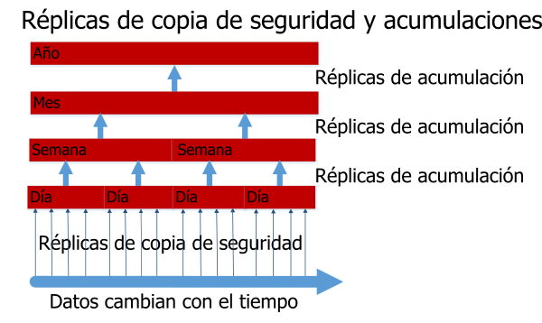

---

copyright:
  years: 2015, 2017
lastupdated: "2017-05-04"

---

{:new_window: target="_blank"}
{:shortdesc: .shortdesc}
{:screen: .screen}
{:codeblock: .codeblock}
{:pre: .pre}

# Copia de seguridad de los datos

>   **Nota**: En esta guía se hace referencia a una función de copia de seguridad incremental diaria *que ha quedado en desuso*
    y que antes estaba disponible solo bajo demanda para los clientes de la versión de empresa. Para ver una guía actualizada sobre la copia de seguridad, consulte la guía de [Recuperación en caso de error y copia de seguridad](disaster-recovery-and-backup.html).
Esta función: 
-   No está habilitada de forma predeterminada. 
-   Solo está disponible para los clientes de empresa, que la deben solicitar de forma específica. 
-   Se debe configurar explícitamente para que esté operativa. 
-   Está sujeta a [limitaciones conocidas](#known-limitations).
-   No se aplica a [Cloudant Local ](https://www.ibm.com/support/knowledgecenter/SSTPQH_1.0.0/com.ibm.cloudant.local.doc/SSTPQH_1.0.0_welcome.html){:new_window}.
Para obtener más información, póngase en contacto con el [equipo de soporte de IBM Cloudant ](mailto:support@cloudant.com){:new_window}.

>   **Nota**: La función de copia de seguridad incremental diaria no se aplica a
    [Cloudant Local ](https://www.ibm.com/support/knowledgecenter/SSTPQH_1.0.0/com.ibm.cloudant.local.doc/SSTPQH_1.0.0_welcome.html){:new_window}.
    Para una copia de seguridad de los datos de Cloudant Local, utilice la [réplica](../api/replication.html) para hacer una copia de la base de datos.Para garantizar la alta disponibilidad, {{site.data.keyword.cloudant}} crea tres copias de cada documento y las guarda en tres servidores distintos de un clúster.
Esta práctica es el valor predeterminado para todos los usuarios de Cloudant. Aunque haya una réplica por triplicado de los datos, sigue siendo importante hacer una copia de seguridad de los mismos. 

¿Por qué es tan importante hacer una copia de seguridad?
En líneas generales, el acceso a los datos se puede perder de varias maneras.
Por ejemplo, si un huracán destruyera el centro de datos y los tres nodos estuvieran en esta ubicación, perdería sus datos.
Puede evitar la pérdida de los datos en caso de desastre realizando una réplica de los datos en un clúster (dedicado o multiarrendatario) en una ubicación geográfica. Sin embargo, si una aplicación defectuosa suprime o sobrescribe los datos de la base de datos, el hecho de tener los datos duplicados no resulta de ayuda. 

Disponer de una copia de seguridad completa y comprobada le permite contestar a la siguiente pregunta: "¿Cómo puedo restaurar los datos si se pierden o resultan dañados?"

Con Cloudant,
los clientes de empresa puede tener copias de seguridad incrementales diarias. 

Si no es un cliente de empresa o si desea crear su propio mecanismo de copia de seguridad, tenga en cuenta el [uso de la réplica para realizar copias de seguridad](disaster-recovery-and-backup.html).

>   **Nota**: La copia de seguridad incremental diaria para los clientes de empresa es una función *Beta* en estos momentos. 
No está habilitada de forma predeterminada.
Las copias de seguridad incrementales diarias o 'deltas' permiten comparar documentos y facilitan la restauración de un solo documento.
A intervalos regulares, que se pueden configurar, las versiones delta diarias pequeñas se acumulan en deltas semanales. Asimismo, las versiones delta semanales se acumulan en deltas mensuales, y las mensuales en deltas anuales. Este proceso de acumulación de versiones delta supone un equilibrio entre poder restaurar exactamente la versión correcta de un documento y necesitan mucho espacio de almacenamiento. 

El recurso de copia de seguridad le permite restaurar manualmente documentos individuales. Si desea restaurar una base de datos entera, por ejemplo como parte de un escenario de recuperación en caso de error, puede ponerse en contacto con el equipo de soporte para que restauren los datos correspondientes a un día, semana, mes o año específico, en función de los deltas que tenga disponibles. 

Encontrará más información sobre la forma en que Cloudant realiza copias de seguridad en el resto de este tema.
Si desea más ayuda o quiere solicitar que se habilite la copia de seguridad de datos, póngase en contacto con el equipo de soporte de Cloudant: [support@cloudant.com ](mailto:support@cloudant.com){:new_window}.

>   **Nota**: El recurso de copia de seguridad de Cloudant solo está disponible para los clientes de empresa. 

>   **Nota**: De forma predeterminada, 
    no se hace copia de seguridad de los documentos `_design`, de modo
    que los índices _no_ se incluyen en las bases de datos de copia de seguridad incremental.
    Si necesita copias de seguridad de los documentos `_design`,
    debe mantenerlos en la herramienta de control de origen que desee.

## Conceptos

Le resultará útil estar familiarizado con los siguientes términos relacionados con el concepto de copia de seguridad: 

Término              | Significado
---------------------|--------
Limpieza de copia de seguridad| Cuando una base de datos delta se ha acumulado, la base de datos delta se elimina transcurrido un periodo de tiempo que se puede configurar. Esto le permite equilibrar la retención de datos con granularidad alta frente al coste del almacenamiento. 
Acumulación de copia de seguridad | Las copias de seguridad diarias se combinan en bases de datos acumuladas semanalmente. Estas combinan las versiones delta diarias en una copia de seguridad más tosca (menos granular). Asimismo, las bases de datos semanales se acumulan en bases de datos mensuales, y las bases de datos mensuales en bases de datos anuales. 
Ejecución de copia de seguridad| Para un periodo de copia de seguridad, se hace una réplica de la base de datos de origen utilizando valores de secuencia para determinar los documentos que se han modificado durante el periodo de copia de seguridad. Al finalizar, esta réplica se denomina copia de seguridad diaria. 
Copia de seguridad de línea base| Una colección de documentos con la que se compara la base de datos delta. 
Copia de seguridad diaria| Consulte Ejecución de copia de seguridad. 
Delta diaria | Otro nombre que recibe la copia de seguridad diaria. 
Base de datos delta | La colección de documentos que han cambiado durante un periodo de tiempo ('delta').
Granularidad alta/baja| Indica el nivel de precisión con que puede especificar el periodo de cambio para un documento. Una acumulación de granularidad alta tiene una escala de tiempo más corta para el periodo de tiempo, por ejemplo un día en el caso de una copia de seguridad diaria. Una acumulación de granularidad baja tiene una escala de tiempo larga para el periodo de tiempo, por ejemplo un año en el caso de una copia de seguridad anual. 
Copia de seguridad incremental | La colección de documentos que se han modificado en la base de datos desde la última copia de seguridad. 
Acumular | Agregar una colección de copias de seguridad incrementales en una copia de seguridad de granularidad inferior, por ejemplo para agregar las copias de seguridad diarias correspondientes a una semana en una sola copia de seguridad 'semanal'. 

## Copias de seguridad incrementales

El primer paso para habilitar las copias de seguridad incrementales consiste en realizar una copia de seguridad completa de toda la base de datos.
Esto ofrece una 'línea base' para las siguientes copias de seguridad incrementales. 

Cada día, después de la primera copia de seguridad de 'línea base', se realiza una copia de seguridad incremental diaria.
Esta copia de seguridad incremental diaria contiene los datos que se han modificado en la base de datos desde la última copia de seguridad. La copia de seguridad diaria es la 'delta diaria'.

Como parte de la solicitud de habilitar copias de seguridad de datos, puede especificar la hora del día en la que se ejecutará la copia de seguridad. La delta diaria se crea cada día, a la hora que especifique. 

## Acumulaciones

Una acumulación combina copias de seguridad diarias en bases de datos acumuladas semanales.
Estas bases de datos acumuladas combinan las versiones delta diarias en una copia de seguridad más tosca o 'menos granular'. Las bases de datos semanales se acumulan en bases de datos mensuales, y las bases de datos mensuales se acumulan en bases de datos anuales. 



Cuando solicite que se habiliten las copias de seguridad, debe especificar el número de deltas diarias que desea conservar.
Una vez alcanzado dicho número, la versión delta diaria más antigua se acumula en la base de datos semanal más reciente.
Posteriormente, las bases de datos semanales se acumulan para crear las bases de datos mensuales, y así sucesivamente.

Una vez acumuladas las bases de datos delta, se eliminan para liberar espacio de almacenamiento. 

## Restauraciones

Si tiene copias de seguridad de una base de datos, puede ver documentos individuales de dicha base de datos y puede ver los cambios realizados en cada documento.
También puede restaurar la versión de un documento de una determinada fecha, si está disponible dentro de la granularidad de la versión delta. 

>   **Nota**: Los documentos deben estar estáticos para poderlos restaurar de una copia de seguridad. 
    Es decir, el documento no debe estar recibiendo constantemente cambios y actualizaciones.

En el caso de restauraciones más complejas, como una restauración de una base de datos entera, solicite ayuda del [equipo de soporte de Cloudant ](mailto:support@cloudant.com){:new_window}.

## Utilización del panel de control

Los clientes de empresa pueden revisar el estado y el historial de copias utilizando el panel de control de Cloudant.

Puede realizar las siguientes funciones: 

-   Ver el estado de la última copia de seguridad, incluidas su fecha y hora. 
-   Ver una lista de las versiones del documento de copia de seguridad por fecha y hora. 
-   Ver un documento actual y la diferencia entre este y cualquier versión de copia de seguridad.
-   Restaurar un documento desde una versión de copia de seguridad.

### Visualización del estado de la copia de seguridad de una base de datos


Cuando se selecciona el separador Base de datos en el panel de control de Cloudant, se ve una columna de estado copia de seguridad para cada base de datos.

### Visualización del estado de la copia de seguridad de un documento


Dentro de una base de datos, puede ver el estado de la copia de seguridad de un documento específico. Para ello, primero compruebe si hay un icono de copia de seguridad () correspondiente al documento.
Verá si el documento específico está incluido dentro de la tarea de copia de seguridad.

Cuando seleccione el documento, podrá ver un separador de copia de seguridad. 


### Visualización de las diferencias entre versiones de copia de seguridad de un documento y restauración


Si pulsa el separador de copia de seguridad correspondiente a un documento, puede ver las diferencias entre la versión actual del documento y cualquier otra versión de copia de seguridad.

Si decide que desea restaurar una versión de copia de seguridad específica de dicho documento, simplemente seleccione la fecha de la copia de seguridad que desea restaurar y pulse el botón 'Restaurar'.

>   **Nota**: Los documentos deben estar en un estado estable para poderlos restaurar de una copia de seguridad. 
    Es decir, el documento no debe estar recibiendo constantemente cambios y actualizaciones.

## Utilización de la API

Dispone de varias llamadas de API REST para trabajar con el recurso de copia de seguridad de Cloudant. 

### Configuración de la tarea

La llamada `task` obtiene la configuración de la tarea de copia de seguridad para el usuario. 

Puede especificar el formato utilizado en la respuesta mediante el parámetro `format`. 

_Ejemplo de solicitud de una configuración de tarea de copia de seguridad para el usuario, que devuelve los resultados en formato de lista (valor predeterminado), mediante HTTP:_

```http
GET /_api/v2/backup/task HTTP/1.1
```
{:codeblock}

_Ejemplo de solicitud de una configuración de tarea de copia de seguridad para el usuario, que devuelve los resultados en formato de lista (valor predeterminado), mediante la línea de mandatos:_

```sh
curl https://$ACCOUNT.cloudant.com/_api/v2/backup/task \
    -X GET
```
{:codeblock}

_Ejemplo de solicitud de una configuración de tarea de copia de seguridad para el usuario, que devuelve los resultados en formato de correlación, mediante HTTP:_

```http
GET /_api/v2/backup/task?format=mapping HTTP/1.1
```
{:codeblock}

_Ejemplo de solicitud de una configuración de tarea de copia de seguridad para el usuario, que devuelve los resultados en formato de correlación, mediante la línea de mandatos:_

```sh
curl https://$ACCOUNT.cloudant.com/_api/v2/backup/task?format=mapping \
     -X GET
```
{:codeblock}

El formato predeterminado de una respuesta es una lista.
Puede solicitar este formato directamente con el parámetro `...backup/task?format=list`.
La respuesta contiene una lista sencilla de las tareas de copia de seguridad definidas para el usuario. 

Por ejemplo, puede solicitar una respuesta en formato de lista utilizando con uno de estos mandatos: 

```http
https://$ACCOUNT.cloudant.com/_api/v2/backup/task

https://$ACCOUNT.cloudant.com/_api/v2/backup/task?format=list
```
{:codeblock}

_Ejemplo de respuesta tras una solicitud en formato de lista:_

```json
{
    "rows": [
        {
            "username": "$ACCOUNT",
            "task": "backup-0d0b0cf1b0ea42179f9c082ddc5e07cb",
            "source_db": "backmeup",
            "latest_completion": null
        },
        {
            "username": "$ACCOUNT",
            "task": "backup-d0ea6e8218074699a562af543db66615",
            "source_db": "backuptest",
            "latest_completion": "2016-01-17T05:57:44+00:00"
        },
        {
            "username": "$ACCOUNT",
            "task": "backup-24cd8359b94640be85b7d4071921e781",
            "source_db": "taskdb",
            "latest_completion": "2016-01-17T00:01:04+00:00"
        }
    ]
}
```
{:codeblock}

Dispone de una respuesta más completa en formato de correlación. Puede solicitar este formato directamente con el parámetro `...backup/task?format=mapping`.


Por ejemplo, puede solicitar una respuesta en formato de correlación utilizando el siguiente mandato: 

```http
https://$ACCOUNT.cloudant.com/_api/v2/backup/task?format=mapping
```
{:codeblock}

_Ejemplo de respuesta tras una solicitud en formato de correlación: _

```json
{
    "backmeup": {
        "username": "$ACCOUNT",
        "task": "backup-0d0b0cf1b0ea42179f9c082ddc5e07cb",
        "source_db": "backmeup",
        "latest_completion": null
    },
    "backuptest": {
        "username": "$ACCOUNT",
        "task": "backup-d0ea6e8218074699a562af543db66615",
        "source_db": "backuptest",
        "latest_completion": "2016-01-17T05:57:44+00:00"
    },
    "taskdb": {
        "username": "$ACCOUNT",
        "task": "backup-24cd8359b94640be85b7d4071921e781",
        "source_db": "taskdb",
        "latest_completion": "2016-01-17T00:01:04+00:00"
    }
}
```
{:codeblock}

### Determinación de las tareas de copia de seguridad para bases de datos específicas

El parámetro `databases` de la solicitud `task` sirve para buscar las tareas de copia de seguridad que están asociadas a una base de datos especificada. 

La respuesta muestra los detalles de la tarea de copia de seguridad la base de datos identificada en el campo `source_db`. El valor `tarea` identificado se puede utilizar en otras llamadas a la API de copia de seguridad, como por ejemplo para obtener un [listado de bases de datos](#list-of-databases).

_Ejemplo de mandato para encontrar las tareas de copia de seguridad para la base de datos `backuptest` y `taskdb`, utilizando HTTP:_

```http
GET /_api/v2/backup/task?databases=backuptest,taskdb HTTP/1.1
```
{:codeblock}

_Ejemplo de mandato para encontrar las tareas de copia de seguridad para la base de datos `backuptest` y `taskdb`, utilizando la línea de mandatos:_

```sh
curl https://$ACCOUNT.cloudant.com/_api/v2/backup/task?databases=backuptest,taskdb \
    -X GET
```
{:codeblock}

_Ejemplo de respuesta para buscar las tareas de copia de seguridad correspondientes a bases de datos específicas:_

```json
{
    "rows": [
        {
            "username": "$ACCOUNT",
            "task": "backup-d0ea6e8218074699a562af543db66615",
            "source_db": "backuptest",
            "latest_completion": "2016-01-17T05:57:44+00:00"
        },
        {
            "username": "$ACCOUNT",
            "task": "backup-24cd8359b94640be85b7d4071921e781",
            "source_db": "taskdb",
            "latest_completion": "2016-01-17T00:01:04+00:00"
        }
    ]
}
```
{:codeblock}

### Lista de bases de datos

La solicitud `monitor` obtiene una lista de las bases de datos que ha creado la tarea de copia de seguridad `$TASKNAME`,
que también contiene el documento `$DOCID`.

La solicitud admite un argumento opcional: `include_docs`. El valor predeterminado es `false`.
 Si se establece en `true`, la solicitud `monitor` devuelve el contenido completo del documento para cada base de datos de copia de seguridad que contiene `$DOCID`.

_recuperación de la lista de bases de datos creadas por una tarea de copia de seguridad, que contienen un documento específico, utilizando HTTP:_

```http
GET /_api/v2/backup/monitor/$TASKNAME/$DOCID?include_docs=true HTTP/1.1
```
{:codeblock}

_recuperación de la lista de bases de datos creadas por una tarea de copia de seguridad, que contienen un documento específico, utilizando la línea de mandatos:_

```sh
curl https://$ACCOUNT.cloudant.com/_api/v2/backup/monitor/$TASKNAME/$DOCID?include_docs=true \
    -X GET
```
{:codeblock}

### Restaurar un documento

La llamada `restore` sustituye un documento, identificado por `$DOCID`,
de una base de datos de origen.
La base de datos de origen se identifica mediante `$TASKNAME`. El valor de `$TASKDATE` es una indicación de fecha y hora correspondiente a la base de datos específica e indica cuándo se ha realizado la copia de seguridad.
El valor `$FREQUENCY` puede tener uno de los siguientes valores: 
-   `"daily"`
-   `"weekly"`
-    `"monthly"`
-   `"yearly"`

>   **Nota**: Los documentos deben estar en un estado estable para poderlos restaurar de una copia de seguridad. 
    Es decir, el documento no debe estar recibiendo cambios ni actualizaciones mientras se procesa la restauración.

_Ejemplo de solicitud para restaurar un documento, mediante HTTP:_

```http
POST /_api/v2/backup/restore/document --data=@RESTORE.json HTTP/1.1
Content-Type: application/json
```
{:codeblock}

_Ejemplo de solicitud para restaurar un documento de la versión más reciente mantenida en una base de datos de copia de seguridad específica mediante la línea de mandatos:_

```sh
curl https://$ACCOUNT.cloudant.com/_api/v2/backup/restore/document --data=@RESTORE.json \
    -X POS \
    -H "Content-Type: application/json" \
    -d "$JSON"
```
{:codeblock}

_Ejemplo de un documento JSON que solicita que se restaure un documento de la versión más reciente mantenida en una base de datos de copia de seguridad específica:_

```json
{
    "doc_id": $DOCID,
    "task_name": $TASKNAME,
    "task_date": $TASKDATE,
    "frequency": $FREQUENCY
}
```
{:codeblock}

## Funcionamiento de la copia de seguridad que utiliza una réplica incremental

Una forma muy sencilla de realizar una copia de seguridad consiste en realizar una [réplica](../api/replication.html) de la base de datos en una base de datos de copia de seguridad antigua.

Este método funciona y es muy sencillo.
Peri si la base de datos es grande y necesita copias de seguridad correspondientes a varios puntos en el tiempo, por ejemplo, siete copias de seguridad diarias y cuatro semanales, acaba guardando una copia de seguridad completa de todos los documentos en cada nueva base de datos de copia de seguridad.
Para ello necesitará probablemente mucho espacio de almacenamiento. 

Las copias de seguridad incrementales constituyen una buena solución para almacenar solo los documentos que han cambiado desde la última copia de seguridad.

Inicialmente, debe realizar una copia de seguridad de toda la base de datos. Tras la primera copia de seguridad, puede ejecutar copias de seguridad incrementales a intervalos regulares, en las que solo se copia lo que se ha modificado en la base de datos desde la última copia de seguridad. Generalmente estas copias de seguridad incrementales se realizan una vez al día, de modo que la réplica es una copia de seguridad diaria. 

Las copias de seguridad incrementales solo guardan la versión delta entre copias de seguridad.
A intervalos regulares, se realiza una réplica de la base de datos de origen en una base de datos de destino. La réplica utiliza valores de secuencia para identificar los documentos modificados durante el periodo del intervalo.

La operación de copia de seguridad utiliza la réplica para obtener y almacenar un punto de comprobación. Este punto de comprobación es otra base de datos con un nombre interno.

El proceso de réplica para una base de datos empieza por encontrar el valor del parámetro `since_seq`. El parámetro indica dónde ha terminado la última réplica. 

>   **Nota**: Por definición, el uso de la opción `since_seq` inhabilita el recurso normal de establecimiento de un punto de comprobación de la réplica. Utilice `since_seq` con cuidado.  

En los pasos siguientes se indica cómo se crean las copias de seguridad incrementales:

1.  [Busque el ID del documento de punto de comprobación correspondiente a la última réplica.](#find-the-id-of-the-checkpoint-document-for-the-last-replication)
2.  [Obtenga el valor de `recorded_seq`. ](#get-the-recorded_seq-value)
3.  [Ejecute una copia de seguridad incremental.](#run-an-incremental-backup)

### Busque el ID del documento de punto de comprobación correspondiente a la última réplica

El valor del ID de punto de comprobación se almacena en el campo `_replication_id` del documento de réplica en la base de datos `_replicator`. 

_Ejemplo de solicitud para obtener el ID de punto de comprobación de la última copia de seguridad incremental para una base de datos denominada `original`, mediante HTTP:_

```http
GET /_replicator/original HTTP/1.1
```
{:codeblock}

_Ejemplo de solicitud para obtener el ID de punto de comprobación de la última copia de seguridad incremental para una base de datos denominada `original`, mediante la línea de mandatos:_

```sh
replication_id=$(curl "${url}/_replicator/original" | jq -r '._replication_id')
```
{:pre}

### Obtenga el valor de `recorded_seq`

Después de obtener el ID del punto de comprobación, utilícelo para obtener el valor de `recorded_seq` del primer elemento de la matriz del historial del documento `/_local/${replication_id}` en la base de datos original.

_Ejemplo de cómo obtener el valor de `recorded_seq` de una base de datos denominada `original`, mediante HTTP:_

```http
GET /original/_local/${replication_id} HTTP/1.1
```
{:codeblock}

_Ejemplo de cómo obtener el valor de `recorded_seq` de una base de datos denominada `original`, mediante la línea de mandatos:_

```sh
recorded_seq=$(curl "${url}/original/_local/${replication_id}" | jq -r '.history[0].recorded_seq')
```
{:pre}

### Ejecute una copia de seguridad incremental

Ahora que tiene el ID de punto de comprobación y `recorded_seq`, puede comenzar la nueva copia de seguridad incremental. 

_Ejemplo de cómo comenzar una nueva copia de seguridad incremental en una base de datos incremental denominada `newbackup`, mediante HTTP:_

```http
PUT /_replicator/newbackup HTTP/1.1
Content-Type: application/json
```
{:codeblock}

_Ejemplo de cómo comenzar una nueva copia de seguridad incremental en una base de datos incremental denominada `newbackup`, mediante la línea de mandatos:_

```sh
curl -X PUT "${url}/_replicator/newbackup" -H "${ct}" -d @newbackup.json
```
{:codeblock}

_Ejemplo de archivo JSON que especifica una copia de seguridad incremental:_

```json
{
    "_id": "newbackup",
    "source": "${url}/original",
    "target": "${url}/newbackup",
    "since_seq": "${recorded_seq}"
}
```
{:codeblock}

## Limitaciones conocidas

>   **Nota**: La copia de seguridad incremental diaria para los clientes de empresa es una función Beta en estos momentos. 
No está habilitada de forma predeterminada.
-   IBM Cloudant Backup, y las funciones de restauración asociadas, se basan en la tecnología de réplica subyacente. Los factores que afecten, o incluso que interrumpan, la réplica afectarán, o incluso pueden bloquear, a los procesos de copia de seguridad y restauración. 
-   Los procesos de copia de seguridad y restauración pueden tardar un periodo de tiempo considerable para bases de datos grandes, por ejemplo de más de 100 GB. Esto se aplica a la copia de seguridad inicial, que podría tardar unos días en ejecutarse para una base de datos grande. Asimismo, el proceso de restauración podría tardar entre unas pocas horas y varios días, de nuevo en función del tamaño de la base de datos.
-   Para copias de seguridad diarias grandes, es posible que el proceso de copia de seguridad no finalice en un día (24 horas). El proceso de copia de seguridad suele ejecutarse hasta que finaliza, por lo que incluiría cambios incrementales durante más de un día.
-   Actualmente no hay soporte para la copia de seguridad de una cuenta de usuario completa. Puede, en su lugar, especificar cada una de las bases de datos de la cuenta del usuario que desea habilitar para el proceso de copia de seguridad o restauración. Actualmente existe un límite de 50 bases de datos habilitadas para copia de seguridad en una cuenta de usuario.
-   El recurso IBM Cloudant Backup no admite actualmente la copia de seguridad ni la restauración de los [documentos de diseño](../api/design_documents.html).
    Si necesita copias de seguridad de documentos de diseño, debe mantenerlos en la herramienta de control de origen que desee.
-   Actualmente, la base de datos de destino para realizar una restauración de base de datos debe ser diferente de la base de datos de origen original.
