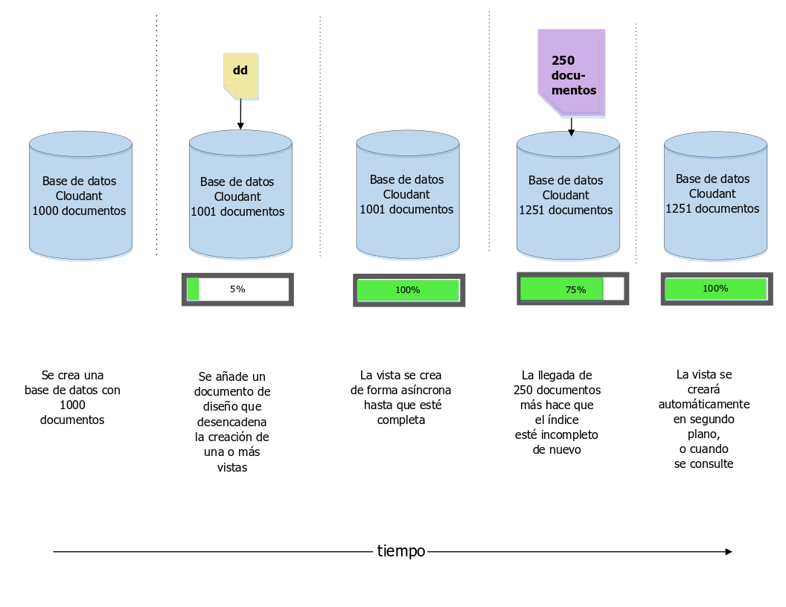
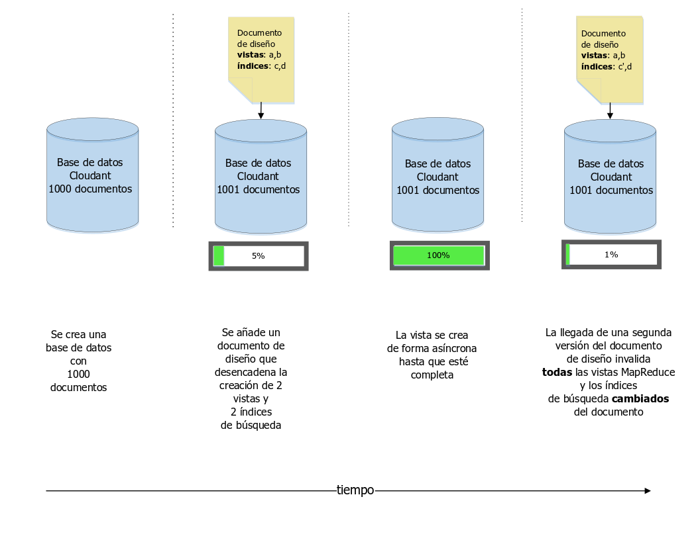
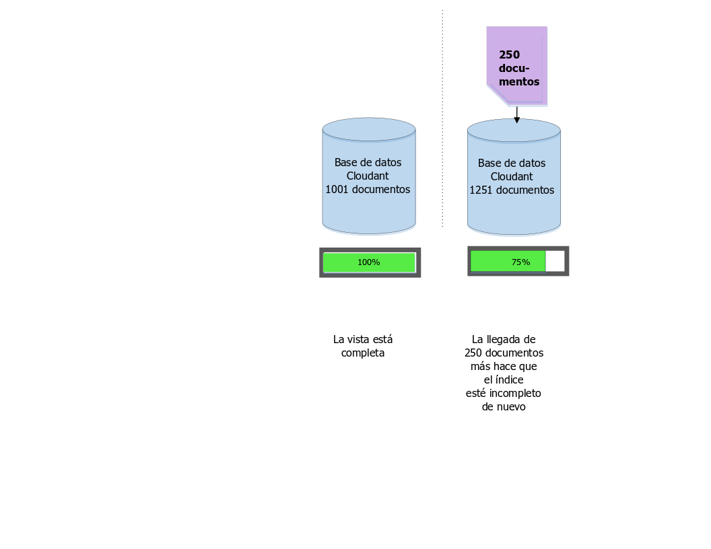

---

copyright:
  years: 2015, 2018
lastupdated: "2018-06-07"

---

{:new_window: target="_blank"}
{:shortdesc: .shortdesc}
{:screen: .screen}
{:codeblock: .codeblock}
{:pre: .pre}

# Gestión de los documentos de diseño

*Artículo de Glynn Bird, especialista en desarrollo de IBM Cloudant,
[glynn@cloudant.com ](mailto:glynn@cloudant.com){:new_window}*

El almacén de datos JSON escalable de {{site.data.keyword.cloudantfull}} tiene varios mecanismos de consultas, que generan índices que se crean y mantienen por separado de los datos principales.
La indexación no se realiza de inmediato cuando se guarda un documento.
Se planifica para que se genere más tarde, lo que ofrece un mejor rendimiento de escritura sin bloqueos.

-   Las vistas MapReduce son índices del conjunto de datos con pares de valores claves que se guardan
en un BTree para que se puedan recuperar de forma eficiente mediante una clave o rango de claves
-   Los índices de búsqueda se crean con Apache Lucene para permitir la búsqueda de texto libre, la creación de facetas y consultas ad-hoc complejas

Los [índices de búsqueda](../api/search.html) y las [vistas MapReduce ](../api/creating_views.html) de {{site.data.keyword.cloudant_short_notm}} se configuran mediante la adición de documentos de diseño a una base de datos.
Los documentos de diseño son documentos JSON que contienen las instrucciones sobre cómo se debe crear la vista o el índice.
Vamos a examinar un ejemplo sencillo.
Supongamos que tiene una colección simple de documentos de datos, parecida a la del siguiente ejemplo.

_Ejemplo de un documento de datos sencillo: _

```json
{
    "_id": "23966717-5A6F-E581-AF79-BB55D6BBB613",
    "_rev": "1-96daf2e7c7c0c277d0a63c49b57919bc",
    "doc_name": "Markdown Reference",
    "body": "Lorem Ipsum",
    "ts": 1422358827
}
```
{:codeblock}

Cada documento de datos incluye un nombre, un cuerpo y una indicación de fecha y hora.
Deseamos crear una [vista MapReduce](../api/creating_views.html) para clasificar nuestros documentos por indicación de fecha y hora.

Para ello creamos una función de correlación (Map), parecida a la del siguiente ejemplo.

_Ejemplo de función de correlación que devuelve el campo de indicación de fecha y hora del documento, si existe: _

```javascript
function(doc) {
    if (doc.ts) {
        emit( doc.ts, null);
    }
}
```
{:codeblock}

La función emite la indicación de fecha y hora del documento, así que podemos utilizar esta información como clave del índice; como no nos interesa el valor del índice, se emite `null`.
Como resultado proporcionamos un índice ordenado por hora en el conjunto de documentos.

Vamos a llamar a esta vista "`by_ts`"
y la vamos a colocar en un documento de diseño llamado "`fetch`", como en el siguiente ejemplo.

_Ejemplo de documento de diseño que define una vista mediante una función de correlación (map):_

```json
{
    "_id": "_design/fetch",
    "views": {
      "by_ts": {
        "map": "function(doc) {
          if (doc.ts) {
            emit( doc.ts, null);
          }
        }"
      }
    },
    "language": "javascript"
}
```
{:codeblock}

El resultado es que nuestro código de correlación se ha convertido en una serie compatible con JSON y se ha incluido en un documento de diseño.

Una vez guardado el documento de diseño, {{site.data.keyword.cloudant_short_notm}} activa procesos del servidor para crear la vista `fetch/by_ts`.
Para ello realiza una iteración sobre cada documento de la base de datos y envía cada uno a la función de correlación de Javascript.
La función devuelve el par clave/valor emitido.
A media que continúa la iteración, cada par clave/valor se guarda en un índice B-Tree.
Una vez creado el índice por primera vez, las siguientes reindexaciones se realizan solo sobre los documentos nuevos y actualizados.
Los documentos suprimidos se eliminan de la indexación.
Este proceso de ahorro de tiempo se conoce como *MapReduce incremental*, tal como se muestra en el siguiente diagrama:



En este punto vale la pena recordar lo siguiente:

-   La construcción de un índice se produce de forma asíncrona.
    {{site.data.keyword.cloudant_short_notm}} confirma que el documento de diseño se ha guardado, pero para comprobar el progreso de creación del índice tenemos que sondear el punto final [`_active_tasks`](../api/active_tasks.html) de {{site.data.keyword.cloudant_short_notm}}.
-   Cuantos más datos tengamos, más tardará el índice en estar listo.
-   Mientras se procesa la creación del índice inicial, _las consultas realizadas sobre dicho índice quedan bloqueadas_.
-   La consulta de una vista activa la 'correlación' de los documentos que aún no se han indexado de forma incremental.
    Esto garantiza que obtenemos una vista actualizada de los datos.
    Consulte el apartado sobre el [parámetro '`stale`'](#stale) para ver las excepciones a esta regla.

## Varias vistas en el mismo documento de diseño

Si definimos varias vistas en el mismo documento de diseño, se crean de forma eficiente al mismo tiempo.
Cada documento solo se lee una vez y se pasa por la función Map de cada vista.
El inconveniente de este enfoque es que, si se modifica un documento de diseño, _se invalidan todas las vistas MapReduce existentes_ definidas en dicho documento, aunque algunas de las vistas no se modifiquen. 

Si las vistas MapReduce se tienen que modificar independientemente unas de otras, coloque sus definiciones en distintos documentos de diseño. 

>   **Nota**: Este comportamiento no se aplica a los índices de búsqueda de Lucene.
    Se pueden modificar dentro del mismo documento de diseño sin invalidar otros índices no modificados del mismo documento.



## Gestión de cambios en un documento de diseño

Supongamos que en el futuro decidimos cambiar el diseño de nuestra vista.
Ahora, en lugar de devolver el resultado de indicación de fecha y hora real, solo nos interesa el recuento del número de documentos que se ajustan a los criterios.
Para lograrlo, la función de correlación no se modifica, pero ahora utilizamos una función _reduce_ de "`_count`".
Obtenemos como resultado un documento de diseño parecido al del ejemplo siguiente.

_Ejemplo de documento de diseño que utiliza una función reduce_

```json
{
    "_id": "_design/fetch",
    "_rev": "2-a2324c9e74a76d2a16179c56f5315dba",
    "views": {
        "by_ts": {
            "map": "function(doc) {
                if (doc.ts) {
                  emit( doc.ts, null);
                }
            }
        }",
        "reduce": "_count"
    },
    "language": "javascript"
}
```
{:codeblock}

Cuando se guarda este documento de diseño, {{site.data.keyword.cloudant_short_notm}} invalida totalmente el índice antiguo y empieza a crear el nuevo índice desde cero, realizando iteraciones sobre cada documento.
Al igual que sucede con la construcción original, el tiempo que tarda depende del número de documentos de la base de datos y se bloquean las consultas entrantes en la vista hasta que termina.

Pero hay un problema...

Si tenemos una aplicación que está accediendo a esta vista _en tiempo real_, nos podríamos encontrar con un dilema de despliegue:

-   Es posible que la versión 1 de nuestro código, que se basa en el documento de diseño original, deje de funcionar porque la vista antigua se ha invalidado.
-   La versión 2 de nuestro código, que utiliza el nuevo documento de diseño, no se puede utilizar de inmediato porque la nueva vista no se ha acabado de crear, especialmente si hay muchos documentos en la base de datos.
-   Un problema más sutil que afecta a nuestro código es que las versiones 1 y 2 esperan de la vista distintos datos de resultados: la versión 1 espera una lista de documentos coincidentes, mientras que la versión 2 espera un número 'reducido' de resultados.

## Coordinación de cambios en documentos de diseño

Hay dos formas de gestionar este problema de control de cambios.

### Documentos de diseño con versiones 

Una solución consiste en utilizar nombres de documentos de diseño con versiones:

-   Nuestro código se ha escrito inicialmente para que utilice una vista llamada `_design/fetchv1`.
-   Cuando creamos una nueva versión, generamos una nueva vista denominada `_design/fetchv2` y consultamos la vista para asegurarnos de que empieza a crearse.
-   Sondeamos `_active_tasks` hasta que finaliza la tarea de crear el nuevo índice.
-   Ahora estamos listos para utilizar el código que depende de la segunda vista.
-   Suprima `_design/fetchv1` cuando esté seguro de que ya no lo necesita.

La utilización de documentos de diseño con versiones es una forma sencilla de gestionar el control de cambios en los documentos de diseño, siempre que no olvide eliminar las versiones antiguas en una fecha posterior.

### 'Mover y conmutar' documentos de diseño

Otro enfoque, documentado [aquí ](http://wiki.apache.org/couchdb/How_to_deploy_view_changes_in_a_live_environment){:new_window},
se basa en el hecho de que {{site.data.keyword.cloudant_short_notm}} reconoce cuándo tiene dos documentos de diseño idénticos y no pierde tiempo ni recursos volviendo a crear vistas que ya tiene.
Es decir, si tomamos nuestro documento de diseño `_design/fetch` y creamos un duplicado exacto `_design/fetch_OLD`, ambos puntos finales funcionarán de forma intercambiable sin tener que activar la reindexación.

El procedimiento para conmutar a la nueva vista es el siguiente:

1.  Cree una copia duplicada del documento de diseño que desea modificar, añadiendo por ejemplo `_OLD` a su nombre:
    `_design/fetch_OLD`.
2.  Coloque el documento de diseño nuevo o 'entrante' en la base de datos utilizando un nombre con el sufijo `_NEW`: `_design/fetch_NEW`.
3.  Consulte la vista `fetch_NEW` para asegurarse de que ha empezado a crearse.
4.  Sondee el punto final `_active_tasks` y espere hasta que el índice se haya terminado de crear.
5.  Coloque una copia duplicada del nuevo documento de diseño en `_design/fetch`.
6.  Suprima el documento de diseño `_design/fetch_NEW`.
7.  Suprima el documento de diseño `_design/fetch_OLD`.

## Herramientas para mover y conmutar

Existe un script Node.js de línea de mandatos denominado '`couchmigrate`' que automatiza el procedimiento de 'mover y conmutar'.
Se puede instalar del siguiente modo.

_Mandato para instalar el script Node.js `couchmigrate`:_

```sh
npm install -g couchmigrate
```
{:codeblock}

Para utilizar el script `couchmigrate`,
primero defina el URL de la instancia CouchDB/{{site.data.keyword.cloudant_short_notm}} estableciendo una variable de entorno denominada `COUCH_URL`.

_Definición del URL de la instancia de {{site.data.keyword.cloudant_short_notm}}:_

```sh
export COUCH_URL=http://127.0.0.1:5984
```
{:codeblock}

El URL puede ser HTTP o HTTPS,
y puede incluir credenciales de autenticación.

_Definición del URL de la instancia de {{site.data.keyword.cloudant_short_notm}} con credenciales de autenticación:_

```sh
export COUCH_URL=https://$ACCOUNT:$PASSWORD@$HOST.cloudant.com
```
{:codeblock}

Suponiendo se tengamos un documento de diseño en formato JSON almacenado en un archivo, podemos ejecutar el siguiente
mandato migrate.

En este ejemplo,
`db` especifica el nombre de la base de datos que se va a modificar y `dd` especifica la vía de acceso a nuestro archivo de documento de diseño.

_Ejecución del mandato `couchmigrate`: _

```sh
couchmigrate --db mydb --dd /path/to/my/dd.json
```
{:pre}

El script coordina el procedimiento de 'mover y conmutar' y espera hasta que la vista se haya creado antes de devolver información.
Si el documento de diseño entrante es el mismo que el que le corresponde, el script devuelve información de inmediato.

Aquí encontrará el código fuente del script:
[https://github.com/glynnbird/couchmigrate ](https://github.com/glynnbird/couchmigrate){:new_window}.

<div id="stale"></div>

## El parámetro '`stale`'

Si un índice está completo pero se añaden nuevos registros a la base de datos, se planifica la actualización del índice como proceso de fondo.
Este es el estado de la base de datos que se muestra en el diagrama siguiente:



Cuando se consulta la vista, existen tres opciones:

-   El comportamiento predeterminado consiste en garantizar que el índice está actualizado con los últimos documentos de la base de datos antes de devolver la respuesta.
    Cuando consultamos la vista, {{site.data.keyword.cloudant_short_notm}} indexa primero los 250 documentos nuevos y luego devuelve la respuesta.
-   Una alternativa consiste en añadir el parámetro "`stale=ok`" a la llamada a la API.
    Este parámetro significa "devolverme los datos que ya se han indexado, no me importan las últimas actualizaciones".
    Es decir,
    cuando consulta la vista con "`stale=ok`",
    {{site.data.keyword.cloudant_short_notm}} devuelve la respuesta de inmediato,
    sin realizar ninguna reindexación adicional.
-   Una segunda alternativa consiste en añadir el parámetro "`stale=update_after`" a la llamada a la API.
    Este parámetro significa "devolverme los datos que ya se han indexado _y_ luego reindexar los documentos nuevos".
    Es decir,
    cuando consulta la vista con "`stale=update_after`",
    {{site.data.keyword.cloudant_short_notm}} devuelve la respuesta de inmediato y luego planifica una tarea de fondo para indexar los datos nuevos.

La adición de "`stale=ok`" o "`stale=update_after`" puede ser una buena manera de obtener respuestas de una vista con mayor rapidez, pero a costa de que los datos no estén tan actualizados. 

>   **Nota**: El comportamiento predeterminado distribuye la carga equitativamente entre los nodos del clúster de {{site.data.keyword.cloudant_short_notm}}.
    Si utiliza las opciones alternativas `stale=ok` o `stale=update_after`, se puede favorecer un subconjunto de nodos del clúster para devolver resultados coherentes de entre el conjunto finalmente coherente.
    Esto significa que el parámetro '`stale`' no es la solución perfecta para todos los casos.
    Sin embargo, puede resultar útil para proporcionar respuestas rápidas en conjuntos de datos que se modifican constantemente si la aplicación acepta resultados no tan actualizados.
    Si los datos no cambian a gran velocidad, la adición de "`stale=ok`" o "`stale=update_after`" no supondrá una ventaja en cuanto a rendimiento y puede distribuir la carga de forma poco equitativa en clústeres de gran tamaño.

Evite utilizar `stale=ok` o `stale=update_after` siempre que sea posible.
El motivo es que el comportamiento predeterminado ofrece los datos más actualizados y distribuye los datos dentro del clúster.
Si se puede advertir a la app cliente de que hay una tarea de proceso de gran cantidad de datos en curso (por ejemplo, durante una actualización de datos en masa regular), la app puede conmutar temporalmente a `stale=ok` durante ese tiempo y luego volver a adoptar el comportamiento predeterminado.

>   **Nota**: La opción `stale` sigue estando disponible,
    pero dispone de las opciones `stable` y `update` que son más útiles y se recomienda utilizar en lugar de la primera.
    Para obtener más información, consulte [Acceso a una vista obsoleta](../api/using_views.html#accessing-a-stale-view).
