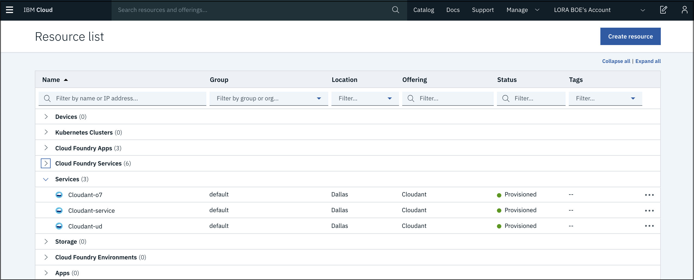
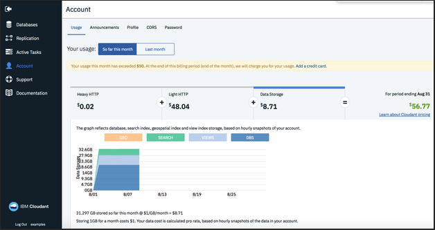

---

copyright:
  years: 2015, 2019
lastupdated: "2019-03-18"

keywords: curl and jq basics, monitor view builds and search indexes, estimate time to complete task, monitor replication, troubleshooting

subcollection: cloudant

---

{:new_window: target="_blank"}
{:shortdesc: .shortdesc}
{:screen: .screen}
{:codeblock: .codeblock}
{:pre: .pre}
{:tip: .tip}
{:note: .note}
{:important: .important}
{:deprecated: .deprecated}

<!-- Acrolinx: 2018-08-14 -->

# Migración a {{site.data.keyword.cloudant_short_notm}} en {{site.data.keyword.cloud_notm}}
{: #migrating-to-ibm-cloudant-on-ibm-cloud}

La oferta de base de datos como servicio de [{{site.data.keyword.cloudantfull}}](https://www.ibm.com/cloud/cloudant) es un almacén de documentos JSON que se ejecuta en clústeres de varios arrendatarios. El servicio está disponible con ubicaciones geográficas con costes predecibles, escalabilidad y un acuerdo a nivel de servicio (SLA).

Este documento describe cómo migrar a una instancia del plan Lite o Estándar de {{site.data.keyword.cloudant_short_notm}} en {{site.data.keyword.cloud_notm}} desde uno de los planes siguientes:

Plan | Descripción
-----|------------
{{site.data.keyword.cloudant_short_notm}} Enterprise | Dedicado, clústeres de un solo arrendatario
Plan compartido de {{site.data.keyword.cloudant_short_notm}} | Un servicio heredado de {{site.data.keyword.cloudant_short_notm}} multiarrendatario de pago según uso. El plan compartido de `cloudant.com` se retiró en marzo de 2018. El plan compartido de {{site.data.keyword.cloudant_short_notm}} se quedó en desuso para nuevos registros en octubre de 2016 y se retirará durante el cuarto trimestre de 2018.
{{site.data.keyword.cloudant_localfull}} | La instalación autoalojada y empaquetada de {{site.data.keyword.cloudant_short_notm}}.
Apache CouchDB | La base de datos de código abierto y autoalojada en la que se basa {{site.data.keyword.cloudant_short_notm}}.

## ¿Cuáles son los beneficios de los planes Estándar y Lite de {{site.data.keyword.cloudant_short_notm}}?
{: #what-are-the-benefits-of-the-ibm-cloudant-lite-and-standard-plans-}

El plan estándar le permite *reservar capacidad de rendimiento* para el servicio de base de datos, es decir, especificar cuánto rendimiento necesitará la base de datos de la aplicación para manejar la demanda. El plan Estándar también carga la cantidad de almacenamiento que utiliza. La capacidad se mide utilizando las métricas siguientes:

Métrica | Descripción
-------|------------
Lecturas por segundo | La velocidad a la que se realizan captaciones de documento simples como, por ejemplo, la recuperación de un documento mediante `_id`, o consultas sobre una base de datos particionada utilizando una clave de partición.
Escrituras por segundo | La velocidad en la que los datos se escriben en la base de datos. Las llamadas de API que tratan con la creación, actualización o supresión de documentos cuentan como 'escrituras'.
Consultas globales por segundo | La velocidad a la que se consulta la base de datos usando índices globales, normalmente accediendo al punto final `_find` o utilizando índices geoespaciales, de búsqueda o de MapReduce secundarios.
Almacenamiento | La cantidad de espacio de disco ocupado por los datos JSON, los adjuntos y los índices secundarios.

Como ejemplo, el plan Lite ofrece 20 lecturas por segundo, 10 escrituras por segundo, 5 consultas globales por segundo y 1 GB de almacenamiento de forma gratuita. Este plan es ideal cuando revisa el producto y durante el desarrollo del mismo. Cuando la aplicación pasa a control de calidad o producción, debe cambiar al plan Estándar para escalar la instancia. La capacidad más pequeña del plan Estándar dispone de 100 lecturas por segundo, 50 escrituras por segundo, 5 consultas globales por segundo y 20 GB de almacenamiento (el almacenamiento extra se carga por GB) por unos 76,65 dólares al mes. 

Al utilizar el graduador en el panel de control de {{site.data.keyword.cloudant_short_notm}}, puede reservar una capacidad más grande o más pequeña del servicio {{site.data.keyword.cloudant_short_notm}} siempre que lo necesite:

La cantidad a la que puede cambiar la capacidad de rendimiento se limita a un máximo de 10 unidades por cambio (observe el punto 'límite de cambios' en el graduador) con un máximo de un cambio por hora. Los cambios descendentes no tienen límite de magnitud, pero están sujetos al límite de tiempo.
{: tip}

Se le facturará sobre la capacidad más alta seleccionada en cualquier ventana por hora determinada. El rendimiento de la base de datos puede aumentar para tratar con demandas estacionales y disminuir durante los momentos de tranquilidad. En todo momento, la factura mensual es predecible, las actualizaciones son automáticas y el acuerdo de nivel de servicio es [99.95%](http://www-03.ibm.com/software/sla/sladb.nsf/sla/bm?OpenDocument).

Si supera la cuota de lecturas, escrituras y consultas globales en un segundo determinado, la API de {{site.data.keyword.cloudant_short_notm}} responderá con una respuesta `HTTP 429 Demasiadas solicitudes`. La aplicación puede intentar realizar la solicitud de nuevo más tarde; nuestras bibliotecas oficiales ofrecen la opción de reintentar realizar tales solicitudes con una interrupción exponencial. 

## ¿De qué tipo de plan de {{site.data.keyword.cloudant_short_notm}} dispongo?
{: #which-type-of-ibm-cloudant-plan-do-i-have-}

Si utiliza {{site.data.keyword.cloudant_short_notm}}, vaya al panel de control de {{site.data.keyword.cloud_notm}} y pulse el icono
**Menú** > **Lista de recursos** para ver todas las instancias de servicio. 

También puede descender a mayor nivel de detalle en una instancia específica y ver el separador Plan para obtener más información. Las instancias de {{site.data.keyword.cloudant_short_notm}} del plan Compartido en desuso no tienen un plan destacado. Una instancia del plan Estándar de {{site.data.keyword.cloudant_short_notm}} es similar a la siguiente: 

También puede abrir el panel de control de {{site.data.keyword.cloudant_short_notm}} y pulsar el separador **Cuenta**. Un plan Lite tiene un aspecto similar al del ejemplo siguiente:

Si utiliza una cuenta de `cloudant.com` heredada, puede iniciar sesión en el panel de control de {{site.data.keyword.cloudant_short_notm}} e ir al separador Cuenta. Un plan compartido de `cloudant.com` dispone del separador Uso con gráficos y estimaciones de facturación del mes actual, como en el ejemplo siguiente:

Un usuario de `cloudant.com` Enterprise en un clúster dedicado no tiene el separador Uso en el separador Cuenta. Es parecido al ejemplo siguiente:

Si el separador Cuenta ya indica que se encuentra en el plan estándar, no es necesario que siga leyendo. Ya se encuentra en un servicio de {{site.data.keyword.cloudant_short_notm}} con soporte a los acuerdos de nivel de servicio (SLA). No se necesita ninguna otra acción.

## Migración desde {{site.data.keyword.cloudant_short_notm}} Lite a {{site.data.keyword.cloudant_short_notm}} Estándar
{: #migrating-from-ibm-cloudant-lite-to-ibm-cloudant-standard}

Realice la migración del plan Lite gratuito al plan Estándar siguiendo estos pasos: 

1.  Vaya al panel de control de {{site.data.keyword.cloud_notm}}.
2.  Vaya al icono **Menú** > **Lista de recursos** para ver todas las instancias de servicio. 
3.  Seleccione la instancia de {{site.data.keyword.cloudant_short_notm}} que desea migrar. 
4.  Seleccione el separador **Plan** en la navegación de la izquierda. 
5.  De la lista de planes de precios, seleccione el recuadro de selección **Estándar**.

6.  Pulse **Actualizar** en la parte inferior de la página.
Se conservan todos los datos existentes.

Ajuste la capacidad utilizando el graduador Capacidad de rendimiento para aumentar o disminuir la capacidad según sea necesario.
{: tip} 
 
Ya está listo para empezar.

## Migración de todo lo demás al plan Estándar o Lite de {{site.data.keyword.cloudant_short_notm}}
{: #migrating-everything-else-to-ibm-cloudant-lite-or-standard-plan}

La migración de los planes Empresa y Compartido a los planes Estándar o Lite de {{site.data.keyword.cloudant_short_notm}} incluye estas tareas, que se describen en los pasos siguientes. 

No puede cambiar directamente una instancia del plan Compartido a una instancia del plan Lite o Estándar. La migración requiere que cree una nueva instancia del plan Lite o Estándar y que replique los datos de la instancia del plan compartido. 
{: tip}

### Paso 1: Regístrese en {{site.data.keyword.cloud_notm}}
{: #step-1-sign-up-for-ibm-cloud}

Si todavía no se ha registrado, [registre una cuenta de {{site.data.keyword.cloud_notm}}](https://www.ibm.com/cloud/). 

### Paso 2: Cree una instancia de {{site.data.keyword.cloudant_short_notm}}
{: #step-2-create-an-ibm-cloudant-instance}

Después de iniciar sesión en su cuenta de {{site.data.keyword.cloud_notm}}, añada un servicio de {{site.data.keyword.cloudant_short_notm}}. Pulse el botón `Crear recurso` en el panel de control y, a continuación, pulse `Bases de datos` y `Cloudant`. Para obtener más información, consulte [cómo crear una instancia de {{site.data.keyword.cloudant_short_notm}} en {{site.data.keyword.cloud_notm}}](/docs/services/Cloudant?topic=cloudant-creating-an-ibm-cloudant-instance-on-ibm-cloud#creating-an-ibm-cloudant-instance-on-ibm-cloud). 

### Paso 3: Descubra si la aplicación está lista para {{site.data.keyword.cloudant_short_notm}}
{: #step-3-find-out-whether-your-application-is-ready-for-ibm-cloudant}

Si se cambia de un servicio de {{site.data.keyword.cloudant_short_notm}} Enterprise o un plan compartido de {{site.data.keyword.cloudant_short_notm}}, debe revisar el uso de la aplicación de {{site.data.keyword.cloudant_short_notm}} para asegurarse de que está listo para manejar los límites de capacidad del plan Estándar. Para obtener más información, consulte [cómo funciona la API de {{site.data.keyword.cloudant_short_notm}}](/docs/services/Cloudant?topic=cloudant-ibm-cloud-public#provisioned-throughput-capacity). Sobre todo debe asegurarse de que la aplicación puede manejar una respuesta HTTP `429: demasiadas solicitudes` si supera la capacidad de rendimiento suministrada. 

Es posible reintentar realizar solicitudes que obtienen una respuesta `429` para los picos de tráfico ocasionales que superan la capacidad del plan. Si el tráfico de aplicación genera de forma rutinaria respuestas `429`, es muy probable que deba actualizar a un plan más grande.

Además, cabe señalar que el tamaño de documento individual máximo es 1 MB en {{site.data.keyword.cloudant_short_notm}}, y que recibirá el mensaje `413: la entidad de la solicitud es demasiado grande` si se supera el límite. Para obtener más información, consulte [límites de tamaño de documento y solicitud](/docs/services/Cloudant?topic=cloudant-ibm-cloud-public#request-and-document-size-limits). 

### Paso 4: Migre datos del servicio antiguo al nuevo 
{: #step-4-migrate-data-from-the-old-service-to-the-new-service}

Configure réplicas continuas desde el servicio existente a la cuenta de {{site.data.keyword.cloudant_short_notm}}. Para obtener más información, consulte la [Guía de réplica](/docs/services/Cloudant?topic=cloudant-replication-api#replication-api) y la [documentación de API](/docs/services/Cloudant?topic=cloudant-ibm-cloudant-basics#ibm-cloudant-basics) acerca de cómo configurar y supervisar las tareas de réplica.

De forma alternativa, compruebe la herramienta [`couchreplicate`](https://www.npmjs.com/package/couchreplicate), que es un programa de utilidad de línea de mandatos que le ayuda a coordinar la transferencia de datos de una cuenta de {{site.data.keyword.cloudant_short_notm}} a otra. Configura varios trabajos de réplica entre las cuentas de origen y destino, lo que garantiza que se ejecuten muchos trabajos de réplica al mismo tiempo. Si tiene que migrar cientos de bases de datos, `couchreplicate` puede ayudar a coordinar los trabajos de réplica.

Compruebe que todos los datos se replican en el nuevo servicio y que se crean los índices.

### Paso 5: Prueba
{: #step-5-testing}

Realice pruebas de carga y de funcionamiento en la aplicación para asegurarse de que no hay problemas antes de migrar a la producción.

### Paso 6: ¿Está preparado para trasladarse a la nueva instancia?
{: #step-6-ready-to-move-to-the-new-instance-}

Cuando esté preparado para pasar a la nueva instancia, actualice la aplicación para que utilice el nuevo URL de cuenta y las credenciales para la instancia de {{site.data.keyword.cloudant_short_notm}}. Para obtener más información, consulte la [guía de aprendizaje de suministro](/docs/services/Cloudant?topic=cloudant-creating-an-ibm-cloudant-instance-on-ibm-cloud#creating-an-ibm-cloudant-instance-on-ibm-cloud) sobre cómo obtener las credenciales de servicio de una instancia de {{site.data.keyword.cloudant_short_notm}}.

### Paso 7: Desactivar el servicio antiguo
{: #step-7-turn-off-the-old-service}

 Cuando la aplicación se haya migrado completamente a la instancia Estándar o Lite de {{site.data.keyword.cloudant_short_notm}}, podrá suprimir la instancia del plan Compartido de {{site.data.keyword.cloudant_short_notm}} antigua de la consola de {{site.data.keyword.cloud_notm}} para asegurarse de que no se le cobre por el servicio.

## Preguntas más frecuentes
{: #faq-frequently-asked-questions}

Las preguntas más frecuentes las publica la organización {{site.data.keyword.cloudant_short_notm}} para ayudar a los clientes de {{site.data.keyword.IBM_notm}} a migrar a una instancia del plan Estándar o Lite de {{site.data.keyword.cloudant_short_notm}} en {{site.data.keyword.cloud_notm}}.

## ¿Puedo hacer una copia de seguridad de mis datos antes de realizar alguna acción?
{: #can-i-back-up-my-data-before-doing-anything-}

{{site.data.keyword.cloudant_short_notm}} recomienda utilizar el programa de utilidad [couchbackup](/docs/services/Cloudant?topic=cloudant-ibm-cloudant-backup-and-recovery#ibm-cloudant-backup-and-recovery) para exportar datos al disco. [{{site.data.keyword.cloud_notm}} Object Storage](https://www.ibm.com/cloud/object-storage) es una solución escalable y barata para almacenar los archivos exportados. 

## ¿Puedo conservar mi dominio `nombreusuario.cloudant.com` y redirigirlo al nuevo servicio en {{site.data.keyword.cloudant_short_notm}}?
{: #can-i-keep-my-username-cloudant-com-domain-and-redirect-it-to-the-new-service-on-ibm-cloudant-}

No, no es posible conservar el dominio. Debe planificar la actualización de la aplicación para utilizar las credenciales y el URL de la nueva cuenta generados para las instancias de {{site.data.keyword.cloudant_short_notm}}.

## ¿Con quién me pongo en contacto si tengo preguntas?
{: #who-do-i-contact-if-i-have-questions-}

Póngase en contacto con el soporte de [{{site.data.keyword.cloudant_short_notm}}](mailto:support@cloudant.com) o abra una incidencia desde el panel de control de {{site.data.keyword.cloudant_short_notm}} si tiene preguntas acerca de la migración. El soporte de {{site.data.keyword.cloudant_short_notm}} estará encantado de proporcionar más detalles.
