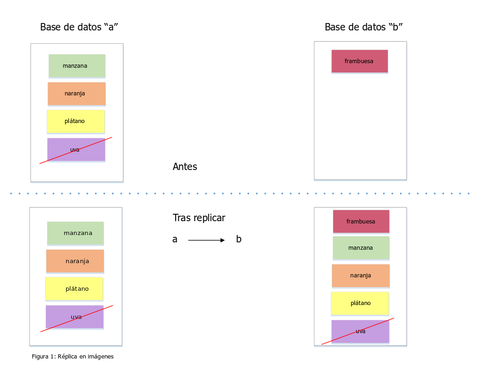
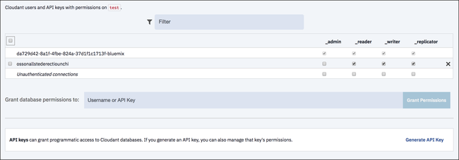
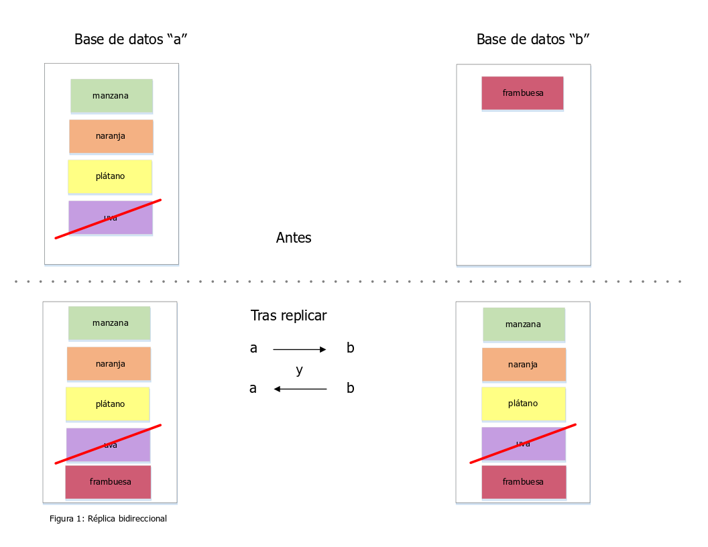

---

copyright:
  years: 2015, 2019
lastupdated: "2019-06-12"

keywords: start replicating with dashboard, run replication across different accounts, run replication on source or destination, start replication with api, checkpoints, permissions, two-way replication, continuous replication, monitoring replication, canceling replication, filtered replication, changes feed, pitfalls, tuning replication speed

subcollection: cloudant

---

{:new_window: target="_blank"}
{:shortdesc: .shortdesc}
{:screen: .screen}
{:codeblock: .codeblock}
{:pre: .pre}
{:tip: .tip}
{:note: .note}
{:important: .important}
{:deprecated: .deprecated}

<!-- Acrolinx: 2017-05-10 -->

# Guía de réplica
{: #replication-guide}

Los datos se pueden copiar de una base de datos en otra en la misma cuenta de {{site.data.keyword.cloudantfull}}, entre cuentas y entre centros de datos.
{: shortdesc}

Incluso se puede realizar una réplica de los datos entre una cuenta de {{site.data.keyword.cloudant_short_notm}} y un dispositivo móvil y entre este y aquella mediante [{{site.data.keyword.cloudant_short_notm}} Sync ](https://cloudant.com/product/cloudant-features/sync/){: new_window}
o [PouchDB ](http://pouchdb.com/){: new_window}.
La réplica se puede ejecutar en una dirección o en ambas, como una 'instantánea única' o como operación continua y se puede ajustar detalladamente mediante parámetros.

El protocolo de réplica de {{site.data.keyword.cloudant_short_notm}} es compatible con diversas bases de datos y bibliotecas, lo que lo convierte en una solución perfecta para Internet de las cosas (IoT) y para aplicaciones móviles.

Esta guía contiene una introducción a las funciones de réplica de {{site.data.keyword.cloudant_short_notm}}, analiza algunos casos comunes de uso y muestra cómo hacer que la aplicación realice réplicas correctamente.

## ¿Qué es la réplica?
{: #what-is-replication}

{{site.data.keyword.cloudant_short_notm}} es un almacén de datos JSON distribuidos con una API HTTP.
{{site.data.keyword.cloudant_short_notm}} se puede ejecutar como un servicio en varias nubes o en un bastidor de servidores.
Los documentos se guardan en bases de datos y pueden alcanzar el tamaño deseado a medida que {{site.data.keyword.cloudant_short_notm}} fragmenta sus datos entre varios nodos.
La réplica es la copia de los datos de la base de datos de origen en una base de datos de destino.
No es necesario que las bases de datos de origen y de destino estén en la misma cuenta de {{site.data.keyword.cloudant_short_notm}} ni en el mismo centro de datos.



La réplica finaliza cuando la versión más actualizada de cada documento del origen se transfiere a la base de datos de destino.
Las transferencias incluyen documentos nuevos, actualizaciones de documentos existentes y supresiones.
Solo la versión más reciente de un documento permanece tras la réplica; las versiones más antiguas se omiten.

La réplica no modifica la base de datos de origen, sin contar los datos de punto de comprobación que se escriben en la misma para permitir que las réplicas parciales se reanuden desde la última posición conocida.
Los datos preexistentes en la base de datos de destino permanecen.

## Cómo iniciar la réplica utilizando el panel de control
{: #how-to-start-replication-by-using-the-dashboard}

El panel de control de {{site.data.keyword.cloudant_short_notm}} proporciona una interfaz de usuario adecuada para activar la réplica.
Pulse el separador `Réplica` en el panel de control de {{site.data.keyword.cloudant_short_notm}} y pulse `Iniciar réplica`.
Complete el formulario:


Por motivos de seguridad, el equipo de {{site.data.keyword.cloudant_short_notm}} recomienda el uso de claves de API de IAM o
[claves de API](/docs/services/Cloudant?topic=cloudant-authorization#api-keys){: new_window} de la autenticación heredada de {{site.data.keyword.cloudant_short_notm}} en lugar de credenciales a nivel de cuenta para los trabajos de réplica. Para obtener más información, consulte la [guía de IAM](/docs/services/Cloudant?topic=cloudant-ibm-cloud-identity-and-access-management-iam-#ibm-cloud-identity-and-access-management-iam-){: new_window} o el [documento de la API de autenticación](/docs/services/Cloudant?topic=cloudant-authentication#authentication){: new_window} heredada y el [documento de la API de autorización](/docs/services/Cloudant?topic=cloudant-authorization#authorization){: new_window} heredada.
{: important}

Utilizando el formulario, defina las bases de datos de origen y destino y, a continuación, pulse `Iniciar réplica`.


El estado de cada tarea de réplica se puede ver pulsando el separador `Réplica`.
Cada job modifica el estado de `En ejecución` a `Completado` a medida que se procesa.


## Cómo ejecutar réplicas entre distintas cuentas de {{site.data.keyword.cloudant_short_notm}}
{: #how-to-run-replication-across-different-ibm-cloudant-accounts}

El origen y el destino de una réplica son los URL de las bases de datos de {{site.data.keyword.cloudant_short_notm}}, tal como se muestra en el siguiente ejemplo.

*Ejemplo de definición de los URL de origen y de destino para la réplica:*

```json
{
    "source": "https://myfirstaccount.cloudant.com/a",
    "target": "https://mysecondaccount.cloudant.com/b"
}
```
{: codeblock}

No es necesario que el origen y el destino estén en la misma cuenta.
No es necesario que los nombres de la base de datos de origen y de destino coincidan.
Debe tener autorización para acceder al origen y al destino y debe tener autorización para escribir en el destino.

## ¿La réplica se ejecuta en el origen o en el destino?
{: #is-replication-run-on-the-source-or-the-destination}

La réplica se puede iniciar en el extremo de origen o en el de destino.
Esta opción significa que puede decidir si la cuenta A envía por push los datos a la cuenta B o si la cuenta B toma los datos de la cuenta A.
En algunos casos, puede que sea imposible ejecutar la réplica en ninguna configuración, por ejemplo cuando una cuenta está detrás de un cortafuegos.
La réplica se produce sobre HTTP o HTTPS por lo que no es necesario abrir puertos no estándares.
La decisión sobre qué dispositivo inicia la réplica es suya.

## Cómo iniciar la réplica mediante la API de {{site.data.keyword.cloudant_short_notm}}
{: #how-to-start-replication-by-using-the-ibm-cloudant-api}

Cada cuenta de {{site.data.keyword.cloudant_short_notm}} tiene una base de datos especial denominada `_replicator`,
en la que se pueden insertar trabajos de réplica.
Añada un documento a la base de datos `_replicator` para iniciar la réplica.
El documento describe la réplica deseada y contiene los campos siguientes:

Campo           | Finalidad
----------------|--------
`_id`           | El hecho de suministrar un campo `_id` es opcional, pero puede ser útil para identificar las tareas de réplica. {{site.data.keyword.cloudant_short_notm}} genera automáticamente un valor si no especifica ninguno.
`source`        | El URL de la base de datos de {{site.data.keyword.cloudant_short_notm}}, incluidas las credenciales de inicio de sesión.
`target`        | El URL de la base de datos de {{site.data.keyword.cloudant_short_notm}} de destino, incluidas las credenciales de inicio de sesión.
`create_target` | (Opcional) Determine si desea crear la base de datos de destino si aún no existe.

*Ejemplo de utilización de HTTP para iniciar un trabajo de réplica:*

```http
POST /_replicator HTTP/1.1
Content-Type: application/json
Host: $ACCOUNT.cloudant.com
Authorization: ...
```
{: codeblock}

*Ejemplo de utilización de la línea de mandatos para iniciar un trabajo de réplica:*

```sh
curl -X POST \
    -H 'Content-type: application/json' \
    'https://$ACCOUNT.cloudant.com/_replicator' \
    -d '@replication.json'
```
{: codeblock}

*Ejemplo de documento JSON que describe la réplica deseada:*

```json
{
    "_id": "weekly_backup",
    "source": "https://$ACCOUNT:$PASSWORD@$ACCOUNT1.cloudant.com/source",
    "target": "https://$ACCOUNT:$PASSWORD@$ACCOUNT2.cloudant.com/destination",
    "create_target": true
}
```
{: codeblock}

## ¿Cómo afectará la réplica a la lista de cambios?
{: #how-does-replication-affect-the-list-of-changes-}

Puede obtener una lista de los cambios realizados en un documento mediante el punto final [`_changes`](/docs/services/Cloudant?topic=cloudant-databases#get-changes).
Sin embargo, la naturaleza distribuida de las
bases de datos de {{site.data.keyword.cloudant_short_notm}} implica que la respuesta que ofrece el canal de información `_changes` no puede ser una simple lista de los cambios producidos después de una determinada fecha y hora.

En el tema que trata sobre el [teorema de CAP](/docs/services/Cloudant?topic=cloudant-cap-theorem#cap-theorem) se explica que {{site.data.keyword.cloudant_short_notm}} utiliza un modelo 'finalmente coherente'.
Este modelo significa que si ha solicitado dos réplicas diferentes de una base de datos para un documento al mismo tiempo, es posible que obtenga resultados diferentes si una de las copias de la base de datos está a la espera de que finalice la réplica.
Finalmente, las copias de base de datos completan su réplica, de modo que todos los cambios en un documento aparecen en cada copia.

Este modelo de 'coherencia final' tiene dos características que afectan a una lista de cambios:

1.  Es casi seguro que un cambio que afecta a un documento se produce en distintos momentos en las diferentes copias de la base de datos.
2.  El orden en el que los cambios afectan a los documentos puede diferir entre distintas copias de la base de datos, en función de cuándo y desde dónde se haya realizado la réplica.

Una consecuencia de la primera característica es que, cuando solicita una lista de cambios, no tiene sentido solicitar una lista de cambios posteriores a un determinado punto en el tiempo.
El motivo es que puede suministrar la lista de cambios una copia diferente de la base de datos, lo que da lugar a actualizaciones en el documento en distintos momentos.
Sin embargo, _sí_ que tiene sentido solicitar una lista de cambios después de un determinado cambio, que se especifica mediante un identificador de secuencia.

Una consecuencia adicional de la primera característica es que es posible que se tenga que
'mirar atrás' en los cambios anteriores para aceptar la lista de cambios.
Es decir, para obtener una lista de cambios, debe comenzar por el cambio más reciente aceptado por las copias de la base de datos.
El punto de aceptación entre copias de la base de datos se identifica en
{{site.data.keyword.cloudant_short_notm}} mediante el uso del mecanismo de [punto de comprobación](#checkpoints) que permite la sincronización de la réplica entre copias de la base de datos.

Por último, una consecuencia de la segunda característica es que los cambios individuales que aparecen en la lista de cambios podrían presentarse en un orden diferente en solicitudes posteriores a las que responde otra copia de la base de datos.
Es decir, una lista inicial de cambios puede notificar los cambios `A`,
`B` y luego `C`, en este orden.
Pero una lista de cambios posterior puede notificar los cambios `C`,
`A` y luego `B` en este orden.
Todos los cambios aparecen en la lista, pero en distinto orden.
Esta diferencia se debe a que la secuencia de cambios que se reciben durante la réplica puede variar entre dos copias distintas de la base de datos.

### Significado de la 'coherencia final' para la lista de cambios
{: #what-eventual-consistency-means-for-the-list-of-changes}

Cuando se solicita una lista de cambios, la respuesta que se obtiene puede variar dependiendo de la copia de base de datos que proporciona la lista.

Si utiliza la opción `since` para obtener una lista de cambios después de un determinado identificador de secuencia de actualización, siempre se obtiene la lista de cambios después de dicha actualización _y_ también se pueden obtener algunos cambios anteriores a la actualización.
El motivo es que la copia de la base de datos que responde a la solicitud de lista debe asegurarse de que ofrece una lista de los cambios coherente con todas las réplicas.
Para lograr esta coherencia, es posible que la copia de la base de datos que tenga que iniciar la lista de cambios desde el punto en el que todas las copias coinciden.
Este punto se identifica mediante puntos de comprobación.

Por lo tanto, una aplicación que utilice el canal de información `_changes`
debe ser ['idempotente' ](http://www.eaipatterns.com/IdempotentReceiver.html){: new_window}.
La idempotencia significa que la aplicación debe ser capaz de recibir de forma segura los mismos datos varias veces y en potencia si hay un orden distinto para las solicitudes repetidas.

## Puntos de comprobación
{: #checkpoints}

Internamente, el proceso de réplica escribe su estado en documentos "de punto de comprobación" que se almacenan en las bases de datos de origen y de destino.
Los puntos de comprobación permiten reanudar una tarea de réplica desde el punto en el que se detuvo, sin tener que empezar desde el principio.
La creación de puntos de comprobación se puede evitar con la opción [`"use_checkpoints": false`](/docs/services/Cloudant?topic=cloudant-replication-api#replication-document-format) cuando se solicita la réplica.
Resulta útil dejar esta característica activada si la réplica se debe reanudar eficientemente desde su última posición conocida.

## Permisos
{: #permissions}

Se necesita acceso de administración para insertar un documento en la base de datos `_replicator`.
Las credenciales de inicio de sesión que se suministran en los parámetros de origen y de destino no requieren permisos completos de administración.
Es suficiente si las credenciales son capaces de:

-   Escribir documentos en el extremo de destino.
-   Escribir documentos de punto de comprobación en ambos extremos.

{{site.data.keyword.cloudant_short_notm}} tiene un permiso de usuario `_replicator` especial.
Este permiso permite crear documentos de punto de comprobación, pero no permite crear documentos comunes en una base de datos.
En general, [cree claves de API](/docs/services/Cloudant?topic=cloudant-authorization#creating-api-keys) que tenga:

-   Acceso `_reader` y `_replicator` en la parte de origen.
-   Acceso `_reader` y `_writer` en la parte de destino.

Las claves de API se pueden crear y configurar en el panel de control de {{site.data.keyword.cloudant_short_notm}}, base de datos a base de datos.



También se pueden crear [mediante programación](/docs/services/Cloudant?topic=cloudant-authorization#creating-api-keys) con la API de {{site.data.keyword.cloudant_short_notm}}.

Por motivos de seguridad, el equipo de {{site.data.keyword.cloudant_short_notm}} recomienda el uso de claves de API de IAM o
[claves de API](/docs/services/Cloudant?topic=cloudant-authorization#creating-api-keys){: new_window} de la autenticación heredada de {{site.data.keyword.cloudant_short_notm}} en lugar de credenciales a nivel de cuenta para los trabajos de réplica. Para obtener más información, consulte la [guía de IAM](/docs/services/Cloudant?topic=cloudant-ibm-cloud-identity-and-access-management-iam-#ibm-cloud-identity-and-access-management-iam-){: new_window} o el [documento de la API de autenticación](/docs/services/Cloudant?topic=cloudant-authentication#authentication){: new_window} heredada y el [documento de la API de autorización](/docs/services/Cloudant?topic=cloudant-authorization#authorization){: new_window} heredada.
{: important}

## Réplica bidireccional
{: #two-way-replication}

Los datos se pueden copiar en ambas direcciones en un proceso que se conoce como sincronización o réplica bidireccional.
Para habilitar esta sincronización, configure dos procesos de réplica: uno que tome los datos de A en B y otro que tome los datos de B en A.
Ambos procesos de réplica funcionan de forma independiente y los datos se mueven continuamente en ambas direcciones.



## Réplica continua
{: #discussion-about-continuous-replication}

Hasta ahora, solo se ha tratado el tema de la réplica única, que finaliza cuando todos los datos de origen se han escrito en la base de datos de destino.
En una réplica continua, los datos fluyen constantemente.
Los cambios siguientes en la base de datos de origen se transmiten a la base de datos de destino en tiempo real.

La réplica continua se activa pulsando el recuadro de selección `Convertir esta réplica en continua` cuando se define una tarea de réplica en el panel de control de {{site.data.keyword.cloudant_short_notm}} o estableciendo el distintivo [`continuous`](/docs/services/Cloudant?topic=cloudant-replication-api#replication-document-format) en la API de {{site.data.keyword.cloudant_short_notm}} API.

La réplica bidireccional se puede convertir en continua en una o en ambas direcciones mediante el distintivo `continuous`.

*Ejemplo de utilización de HTTP para iniciar una réplica continua:*

```http
POST /_replicator HTTP/1.1
Content-Type: application/json
Host: $ACCOUNT.cloudant.com
Authorization: ...
```
{: codeblock}

*Ejemplo de utilización de la línea de mandatos para iniciar una réplica continua:*

```sh
curl -X POST \
    -H "Content-type: application/json" \
    https://$ACCOUNT.cloudant.com/_replicator \
    -d @continuous-replication.json
```
{: codeblock}

*Ejemplo de un documento JSON que define una réplica continua:*

```json
{
    "_id": "weekly_continuous_backup",
    "source": "https://$ACCOUNT:$PASSWORD@$ACCOUNT1.cloudant.com/source",
    "target": "https://$ACCOUNT:$PASSWORD@$ACCOUNT2.cloudant.com/destination",
    "continuous": true
}
```
{: codeblock}

## Supervisión del estado de réplica
{: #monitoring-replication-status}

Puede verificar el estado de la base de datos `_replicator` de {{site.data.keyword.cloudant_short_notm}} en cualquier momento mediante el panel de control o la API.

Si la réplica ha fallado, por ejemplo si las credenciales de autenticación son eran válidas, se registra el estado de error en el documento `_replicator`.
También se puede utilizar el
[punto final `/_active_tasks`](/docs/services/Cloudant?topic=cloudant-active-tasks#active-tasks) de la cuenta de {{site.data.keyword.cloudant_short_notm}} para ver el progreso de la réplica.

*Ejemplo de utilización de HTTP para supervisar un proceso de réplica:*

```http
GET /_replicator/weekly_backup HTTP/1.1
HOST: $ACCOUNT.cloudant.com
Authorization: ...
```
{: codeblock}

*Ejemplo de utilización de la línea de mandatos para supervisar un proceso de réplica:*

```sh
curl 'https://$ACCOUNT.cloudant.com/_replicator/weekly_backup'
```
{: codeblock}

*Ejemplo de respuesta a una solicitud del estado de una réplica:*

```json
{
    "_id": "weekly_backup",
    "_rev": "22-c57c18f7e761f1a76fa977caa03cd098",
    "source": "https://u:p@myaccount.cloudant.com/a",
    "create_target": false,
    "target": "https://u:p@myaccount.cloudant.com/b",
    "continuous": true,
    "_replication_state": "triggered",
    "_replication_state_time": "2014-12-01T15:19:01+00:00",
    "_replication_id": "4514b08cb4c2ded7da9ab04a87182ceb"
}
```
{: codeblock}

Al realizar la réplica, si hay documentos o archivos adjuntos que superan el límite máximo en el destino, la réplica fallará. Cada error de escritura de documento aumenta el recuento de estadísticas de réplica de `doc_write_failures`. Por este motivo, es importante que supervise dicho campo.

## Cancelación de una réplica
{: #canceling-replication}

Para detener un trabajo de réplica en curso, suprima el documento de réplica de la base de datos `_replicator` mediante el panel de control o la API.

*Ejemplo de utilización de HTTP para cancelar una réplica:*

```http
DELETE /_replicator/weekly_backup?rev=22-c57c18f7e761f1a76fa977caa03cd098 HTTP/1.1
Host: $ACCOUNT.cloudant.com
Authorization:
```
{: codeblock}

*Ejemplo de utilización de la línea de mandatos para cancelar una réplica:*

```sh
curl -X DELETE 'https://$ACCOUNT.cloudant.com/_replicator/weekly_backup?rev=22-c57c18f7e761f1a76fa977caa03cd098'
```
{: codeblock}

## Otros casos de uso de la réplica
{: #other-replication-use-cases}

El protocolo de réplica de {{site.data.keyword.cloudant_short_notm}} es compatible con otras bases de datos y bibliotecas correspondientes a diversas aplicaciones reales.

### Apache CouchDB
{: #apache-couchdb}

[Apache CouchDB ](http://couchdb.apache.org/){: new_window} es una base de datos de código abierto que se puede comunicar con {{site.data.keyword.cloudant_short_notm}} y que requiere una configuración mínima.
Las aplicaciones incluyen:

-   Copia de seguridad: replique los datos de {{site.data.keyword.cloudant_short_notm}} en sus propias bases de datos CouchDB y tome instantáneas nocturnas de los datos para archivarlos.
    Envíe los datos a un servicio de copia de seguridad como [Glaciar Amazon ](https://aws.amazon.com/glacier/){: new_window} para mantenerlos seguros.
-   Recopilación de datos locales primero: escriba los datos primero en Apache CouchDB y luego realice una réplica en {{site.data.keyword.cloudant_short_notm}} para su almacenamiento a largo plazo, agregación y análisis.

### PouchDB
{: #pouchdb}

[PouchDB ](http://pouchdb.com/){: new_window} es una base de datos de código abierto de navegador que permite realizar réplicas de los datos en ambas direcciones entre el navegador y {{site.data.keyword.cloudant_short_notm}}.
El hecho de almacenar los datos en un navegador web en la parte del cliente permite que las aplicaciones web funcionen incluso sin una conexión a Internet.
PouchDB puede sincronizar los datos modificados con {{site.data.keyword.cloudant_short_notm}} cuando hay una conexión a Internet.
Para configurar la réplica desde la parte cliente se requieren unas pocas líneas de JavaScript.

*Ejemplo de JavaScript que utiliza PouchDB para habilitar la réplica:*

```javascript
var db = new PouchDB("myfirstdatabase");
var URL = "https://u:p@username.cloudant.com/my_database");
db.sync(URL, { live: true });
```
{: codeblock}

### CloudantSync
{: #cloudantsync}

[CloudantSync ](https://cloudant.com/cloudant-sync-resources/){: new_window} es un conjunto de bibliotecas para iOS y Android que permite almacenar los datos localmente en un dispositivo móvil y sincronizarlos con {{site.data.keyword.cloudant_short_notm}} cuando la conectividad móvil lo permite.
Al igual que sucede con [PouchDB](#pouchdb),
para configurar la réplica se requieren unas pocas líneas de código.

*Ejemplo de JavaScript que utiliza CloudantSync para habilitar la réplica:*

```javascript
URI uri = new URI("https://u:p@username.cloudant.com/my_database");
Datastore ds = manager.openDatastore("my_datastore");
// Realizar réplica de la base de datos local en la remota
Replicator replicator = ReplicatorFactory.oneway(ds, uri);
// Activar y olvidarse (también hay métodos sencillos de supervisar el estado )
replicator.start();
```
{: codeblock}

CloudantSync se utiliza ampliamente en aplicaciones móviles, como juegos para iPhone y Android, donde el estado de la aplicación se conserva en {{site.data.keyword.cloudant_short_notm}} mediante la réplica, pero los datos también están disponibles en el dispositivo para utilizarlos fuera de línea.

## Réplicas filtradas
{: #filtered-replications}

Resulta útil poder eliminar algunos de los datos durante el proceso de réplica, cuando se realiza una réplica de una base de datos en otra.
A continuación se ofrecen algunos ejemplos:

-   Eliminación de todos los rastreos de documentos suprimidos, para que la base de datos sea menor que la de origen.
-   Segregación de datos en porciones más pequeñas, como por ejemplo almacenar datos correspondientes al Reino Unido en una base de datos y datos de Estados Unidos en otra.

### Funciones del filtro de réplica
{: #replication-filter-functions}

La réplica filtrada de {{site.data.keyword.cloudant_short_notm}} permite definir una función JavaScript que utiliza el valor de retorno para determinar si cada documento de una base de datos se ha filtrado o no.
Las [funciones de filtro](/docs/services/Cloudant?topic=cloudant-design-documents#filter-functions) se guardan en [documentos de diseño](/docs/services/Cloudant?topic=cloudant-design-documents#design-documents).

En el siguiente ejemplo se muestra una función de filtro que permite realizar una réplica únicamente de los documentos no suprimidos.

*Ejemplo de función de filtro para realizar una réplica de los documentos no suprimidos:*

```javascript
function(doc, req) {
    if (doc._deleted) {
        return false;
    }
    return true;
}
```
{: codeblock}

Cuando se inicia un trabajo de réplica, se especifica el nombre de una función de filtro como una combinación del documento de diseño en el que se almacenan los datos y el nombre de la función de filtro.
También puede especificar un valor `query_params`.
Este valor es un objeto que contiene propiedades que se pasan a la función de filtro en el campo `consulta` de su segundo argumento (`req`).

*Ejemplo de utilización de HTTP para iniciar una réplica filtrada:*

```http
POST /_replicator HTTP/1.1
Content-Type: application/json
Host: $ACCOUNT.cloudant.com
Authorization: ...
```
{: codeblock}

*Ejemplo de utilización de la línea de mandatos para iniciar una réplica filtrada:*

```sh
curl -X POST \
    -H "Content-type: application/json" \
    https://$ACCOUNT.cloudant.com/_replicator \
    -d @filtered-replication.json
```
{: codeblock}

*Ejemplo de un documento JSON que define una réplica filtrada:*

```json
{
    "_id": "weekly_backup",
    "source": "https://$ACCOUNT:$PASSWORD@$ACCOUNT1.cloudant.com/source",
    "target": "https://$ACCOUNT:$PASSWORD@$ACCOUNT2.cloudant.com/destination",
    "filter": "mydesigndoc/myfilter",
    "query_params": {
        "foo": "bar",
        "baz": 5
    }
}
```
{: codeblock}

## Canal de alimentación de cambios
{: #changes-feed}

{{site.data.keyword.cloudant_short_notm}} publica las adiciones, ediciones y supresiones que afectan a una base de datos a través de un solo canal de información HTTP desde el punto final [`_changes`](/docs/services/Cloudant?topic=cloudant-databases#get-changes).
La aplicación puede utilizar este canal de información para activar sucesos.
Puede acceder al canal de información mediante HTTP o `curl`,
tal como se muestra en los ejemplos.
El uso de la opción `feed=continuous` significa que la corriente de datos le ofrece cada cambio necesario para obtener la versión más reciente de cada documento de la base de datos.

*Ejemplo de utilización de HTTP para consultar el canal de información de cambios:*

```http
GET /$DATABASE/_changes?feed=continuous HTTP/1.1
Host: $ACCOUNT.cloudant.com
Authorization: ...
```
{: codeblock}

*Ejemplo de utilización de la línea de mandatos para consultar el canal de información de cambios:*

```sh
curl "https://$ACCOUNT.cloudant.com/$DATABASE/_changes?feed=continuous"
```
{: codeblock}

Los cambios se describen mediante una línea por cambio.
Cada cambio consta de:

1.  Una serie de caracteres que contiene un número de secuencia (`seq`).
2.  Una serie de caracteres que contiene el ID del documento que se ha modificado.
3.  Una matriz de cambios.

Para ver propio cuerpo del documento, añada `&include_docs=true` al mandato curl.

Cada cambio se describe utilizando el formato que se muestra en el siguiente ejemplo (abreviado).

*Ejemplo de canal `_changes`:*

```json
{
    "seq":"11-g1A...c1Q",
    "id":"6f8ab9fa52c117eb76240daa1a55827f",
    "changes":[
        {
          "rev":"1-619d7981d7027274a4b88810d318a7b1"
        }
    ]
}
```
{: codeblock}

Para unir el canal de información de cambios a partir de una posición conocida, pase un [argumento `since`](/docs/services/Cloudant?topic=cloudant-databases#the-since-argument) con el número de secuencia por el que desea comenzar.

*Ejemplo (abreviado) de utilización de HTTP para especificar la opción `since` para unir un canal de información `_changes` en una posición conocida:*

```http
GET /$DATABASE/_changes?feed=continuous&include_docs=true&since=11-g1A...c1Q HTTP/1.1
HOST: $ACCOUNT.cloudant.com
Authorization: ...
```
{: codeblock}

*Ejemplo (abreviado) de utilización de la línea de mandatos para especificar la opción `since` para unir un canal de información `_changes` en una
posición conocida:*

```sh
curl "https://$ACCOUNT.cloudant.com/$DATABASE/_changes?feed=continuous&include_docs=true&since=11-g1A...c1Q"
```
{: codeblock}

Para volver a unir el canal de información de cambios desde el momento actual, defina `since=now`.

*Ejemplo de utilización de HTTP para especificar `since=now` para unir un canal de información `_changes` en el momento actual:*

```http
GET /$DATABASE/_changes?feed=continuous&include_docs=true&since=now HTTP/1.1
Host: $ACCOUNT.cloudant.com
Authorization: ...
```
{: codeblock}

*Ejemplo de utilización de la línea de mandatos para especificar `since=now` para unir un canal de información `_changes` en el momento actual:*

```sh
curl "https://$ACCOUNT.cloudant.com/$DATABASE/_changes?feed=continuous&include_docs=true&since=now"
```
{: codeblock}

*Ejemplo de utilización de JavaScript para especificar `since=now` para unir un canal de información `_changes` en el momento actual:*

```javascript
var feed = db.follow({since: "now", include_docs: true})
feed.on('change', function (change) {
    console.log("change: ", change);
})
feed.follow();
```
{: codeblock}

El acceso a los datos `_changes` mediante programación es muy sencillo.
Por ejemplo, puede utilizar la [Biblioteca Node.js de {{site.data.keyword.cloudant_short_notm}}](/docs/services/Cloudant?topic=cloudant-supported-client-libraries#node-js-supported) para seguir los cambios con unas pocas líneas de código.

Estos son algunos casos de uso de ejemplo:

-   Adición de elementos a una cola de mensajes para activar acciones dentro de la aplicación, como por ejemplo el envío de un correo electrónico al cliente.
-   Actualización de una base de datos en memoria para registrar recuentos dinámicos de actividad.
-   Escritura de datos en un archivo de texto para enviar datos por push a una base de datos SQL.

El canal de información de cambios se puede filtrar con una función de filtro, utilizando una técnica parecida a la de [filtrado durante la réplica](#filtered-replications).

*Ejemplo de utilización de HTTP para filtrar el canal de información de cambios:*

```http
GET /$DATABASE/_changes?feed=continuous&include_docs=true&since=now&filter=mydesigndoc/myfilter HTTP/1.1
Host: $ACCOUNT.cloudant.com
Authorization: ...
```
{: codeblock}

*Ejemplo de utilización de la línea de mandatos para filtrar el canal de información de cambios:*

```sh
curl "https://$ACCOUNT.cloudant.com/$DATABASE/_changes?feed=continuous&include_docs=true&since=now&filter=mydesigndoc/myfilter"
```
{: codeblock}

El orden de los documentos dentro del canal de información `_changes` no siempre es el mismo. Es decir, es posible que los cambios no aparezcan en estricto orden cronológico. El motivo es que los datos se devuelven desde varios nodos de {{site.data.keyword.cloudant_short_notm}},
y se aplican reglas de coherencia final.
{: tip}

## Inconvenientes de la réplica
{: #replication-pitfalls}

Para realizar la réplica correctamente, la suma del tamaño de documento y el tamaño de todos los archivos adjuntos debe ser menor que el tamaño máximo de solicitud del clúster de destino. Por ejemplo, si el tamaño máximo de solicitud HTTP es de 11 MB, se aplicarán los casos de ejemplo siguientes:

Tamaño de documento | Tamaño de archivo adjunto | Tamaño total | ¿Se replica?
--------------|----------------------|------------|------------
1 MB | Cinco archivos adjuntos de 2 MB | 11 MB | sí
1 MB | Un archivo adjunto de 10 MB | 11 MB | sí
0 MB | Cien archivos adjuntos de 1 MB | 100 MB | no

Debe tener en cuenta varias consideraciones cuando utilice la réplica.

### Permisos de usuario incorrectos
{: #incorrect-user-permissions}

Para que la réplica se ejecute de forma óptima cuando se realiza una réplica de la base de datos "a" en la base de datos "b", las credenciales que se especifiquen deben tener:

*   Los permisos `_reader` y `_replicator` sobre la base de datos "a".
*   Los permisos `_writer` sobre la base de datos "b".

Se generan claves de API en el panel de control de {{site.data.keyword.cloudant_short_notm}} o a través de la
[API](/docs/services/Cloudant?topic=cloudant-authorization#creating-api-keys).
Se pueden otorgar a cada clave derechos individuales con relación a una determinada base de datos de {{site.data.keyword.cloudant_short_notm}}.
{{site.data.keyword.cloudant_short_notm}} debe poder escribir sus documentos de punto de comprobación en el extremo "de lectura" de la réplica; de lo contrario no se guarda ningún estado y la réplica no se puede reanudar desde donde se detuvo.
Si el estado no se guarda, pueden producirse problemas de rendimiento cuando se reanuda una réplica de grandes conjuntos de datos.
El motivo es que, sin puntos de comprobación, el proceso de réplica se reinicia desde el principio cada vez que se reanuda.

### El documento de réplica es conflictivo
{: #replication-document-is-conflicted}

Otra consecuencia de establecer incorrectamente los permisos de usuario es que el documento `_replicator` se convierte en conflictivo.
El documento `_replicator` registra el estado actual del proceso de réplica.
En un caso extremo, el documento puede llegar a ser inmenso porque contiene muchos conflictos sin resolver.
Este tipo de documentos muy grandes utilizan gran parte del espacio disponible y generan una carga adicional en el servidor.

Puede comprobar el tamaño de la base de datos `_replicator` enviando una solicitud `GET` al punto final `/_replicator`:

```http
GET https://$ACCOUNT.cloudant.com/_replicator
```
{: codeblock}

En el documento JSON que se devuelve,
busque el valor de `disk_size`.
Si el valor indica un tamaño superior a 1 GB, póngase en contacto con el [equipo de soporte de {{site.data.keyword.cloudant_short_notm}} ](mailto:support@cloudant.com){: new_window} para obtener más información.

Puede comprobar si existen conflictos en un documento `_replicator` individual, tal como se muestra en el siguiente ejemplo:

```http
GET https://$ACCOUNT.cloudant.com/_replicator/<<docid>>?conflicts=true
```
{: codeblock}

Si desea cancelar todas las réplicas y empezar con una base de datos `_replicator` nueva, suprima y vuelva a crear la base de datos `replicator`.

*Ejemplo de utilización de HTTP para eliminar y volver a crear la base de datos `_replicator`:*

```http
DELETE /_replicator HTTP/1.1
HOST: $ACCOUNT.cloudant.com
Authorization: ...

PUT /_replicator HTTP/1.1
HOST: $ACCOUNT.cloudant.com
Authorization: ...
```
{: codeblock}

*Ejemplo de utilización de la línea de mandatos para eliminar y volver a crear la base de datos `_replicator`:*

```sh
curl -X DELETE 'https://$ACCOUNT.cloudant.com/_replicator'
curl -X PUT 'https://$ACCOUNT.cloudant.com/_replicator'
```
{: codeblock}

### Muchas réplicas simultáneas
{: #many-simultaneous-replications}

Es fácil olvidar que anteriormente se ha configurado una réplica entre dos bases de datos y crear erróneamente procesos de réplica adicionales.
Cada trabajo de réplica es independiente de los demás, de modo que {{site.data.keyword.cloudant_short_notm}} no impide que cree procesos de réplica adicionales.
Sin embargo, cada tarea de réplica utiliza recursos del sistema.

Puede comprobar sus "réplicas activas" en el panel de control de {{site.data.keyword.cloudant_short_notm}} para asegurarse de que no hay tareas de réplica no deseadas en curso.
Suprima los documentos `_replicator` que ya no necesite.

## Ajuste de la velocidad de réplica
{: #tuning-replication-speed}

De forma predeterminada, la réplica de {{site.data.keyword.cloudant_short_notm}} se ejecuta en un ritmo adecuado para obtener datos del origen en el destino sin que ello afecte negativamente el rendimiento.
Lo ideal es encontrar el equilibrio entre ritmo de réplica y rendimiento del clúster para otras tareas.
En algunos casos quizás sea preferible una réplica más rápida a costa de otros servicios de {{site.data.keyword.cloudant_short_notm}}.
También es posible que tenga que dar prioridad al rendimiento del clúster y tratar la réplica como proceso de fondo.

Hay [opciones de API de réplica avanzadas](/docs/services/Cloudant?topic=cloudant-advanced-replication#advanced-replication) disponibles, que permiten un aumento o una reducción de la cantidad de potencia de cálculo que se utiliza durante la réplica. Por ejemplo:

*   Si los documentos contienen archivos adjuntos, tenga en cuenta la posibilidad de reducir el valor de batch_size y de aumentar el valor de worker_processes para dar cabida a documentos mayores en lotes más pequeños.
*   Si tiene muchos documentos pequeños, tenga en cuenta la posibilidad de aumentar los valores de [`worker_process`](/docs/services/Cloudant?topic=cloudant-advanced-replication#performance-related-options) y [`http_connections`](/docs/services/Cloudant?topic=cloudant-advanced-replication#performance-related-options).
*   Si desea ejecutar la réplica con un impacto mínimo, establecer `worker_processes` y `http_connections` en 1 puede ser lo adecuado.

Para obtener más ayuda sobre la mejor configuración para su caso, póngase en contacto con el [equipo de soporte de {{site.data.keyword.cloudant_short_notm}} ](mailto:support@cloudant.com){: new_window}.
