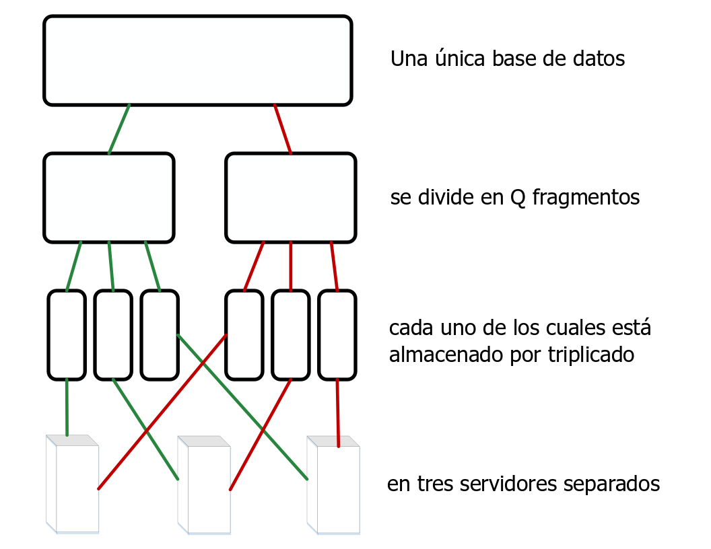
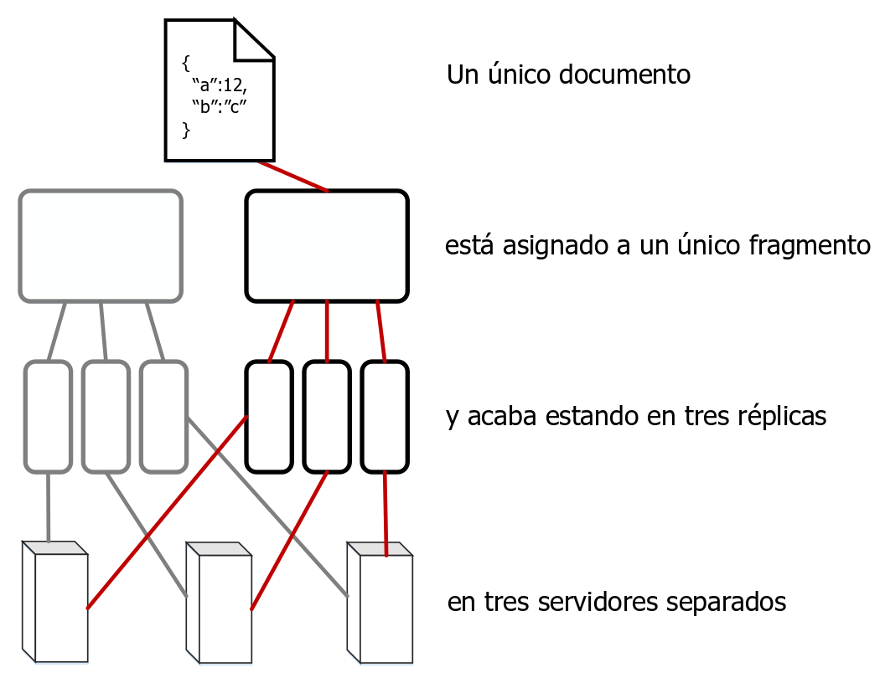

---

copyright:
  years: 2017, 2019
lastupdated: "2019-02-27"

keywords: how data is stored, sharding and performance, work with shards, shard count, replica count

subcollection: cloudant

---

{:new_window: target="_blank"}
{:shortdesc: .shortdesc}
{:screen: .screen}
{:codeblock: .codeblock}
{:pre: .pre}
{:tip: .tip}
{:note: .note}
{:important: .important}
{:deprecated: .deprecated}

<!-- Acrolinx: 2017-05-10 -->

# ¿Cómo se almacenan los datos en {{site.data.keyword.cloudant_short_notm}}?
{: #how-is-data-stored-in-ibm-cloudant-}

## Conceptos
{: #concepts}

Cada base de datos de {{site.data.keyword.cloudantfull}} está formada por uno o varios _fragmentos_ distintos; el número de fragmentos recibe el nombre de _Q_.
Un fragmento es un subconjunto diferenciado de documentos de la base de datos.
Todos los fragmentos _Q_ fragmentos juntos contienen los datos de la base de datos.
Cada fragmento se almacena en tres copias separadas.
Cada copia de fragmento se denomina una _réplica_ del fragmento.
Cada réplica del fragmento se almacena en un servidor distinto.
Los servidores están disponibles en un centro de datos de una ubicación única.
La colección de servidores de un centro de datos se denomina un clúster.



Un documento se asigna a un determinado fragmento utilizando un hash coherente de su ID.
Esta asignación significa que un documento siempre está almacenado en un fragmento conocido y en un conjunto de servidores conocido.



En ocasiones, los fragmentos se _reequilibran_.
Este reequilibrio implica mover réplicas a otros servidores.
Esto sucede por varios motivos: por ejemplo, cuando la supervisión de servidores sugiere que un servidor se utiliza mucho más o mucho menos que otros servidores, o cuando un servidor se debe desactivar temporalmente para realizar el mantenimiento.
El número de fragmentos y réplicas es el mismo y los documentos siguen asignados al mismo fragmento, pero la ubicación de almacenamiento del servidor correspondiente a una réplica de fragmento cambia.

El valor predeterminado de _Q_ varía para los distintos clústeres.
El valor se puede ajustar a lo largo del tiempo.

El número de réplicas (copias de un fragmento) también se puede configurar.
En la práctica, la observación y medición de muchos sistemas sugiere que tres réplicas es un número pragmático en la mayoría de los casos para lograr un buen equilibrio entre rendimiento y seguridad de los datos.
Sería excepcional y poco habitual que un sistema {{site.data.keyword.cloudant_short_notm}} utilizara otro recuento de réplicas.

## ¿Cómo afecta la fragmentación al rendimiento?
{: #how-does-sharding-affect-performance-}

El número de fragmentos correspondientes a una base de datos se puede configurar ya que afecta al rendimiento de la base de datos de varias formas.

Cuando llega una solicitud a la base de datos procedente de una aplicación cliente, se asigna un servidor o 'nodo' del clúster como _coordinador_ de la solicitud.
Este coordinador realiza solicitudes internas a los nodos que contienen los datos relevantes para la solicitud, determina la respuesta a la solicitud, y devuelve esta respuesta al cliente.

El número de fragmentos correspondientes a una base de datos afecta al rendimiento de dos formas:

1.	Cada documento de la base de datos se almacenan en un solo fragmento.
	Por lo tanto, el hecho de tener muchos fragmentos aumenta el paralelismo para una solicitud de documento única.
	Esto se debe a que el coordinador envía solicitudes solo a los nodos que contienen el documento.
	Por lo tanto, si la base de datos tiene muchos fragmentos, es probable que haya muchos otros nodos que no necesiten responder a la solicitud.
	Estos nodos pueden seguir trabajando en otras tareas sin interrupción de la solicitud del coordinador.
2.	Para responder a una solicitud de consulta, una base de datos debe procesar los resultados procedentes de todos los fragmentos.
	Por lo tanto, el hecho de tener muchos fragmentos aumenta la demanda de proceso.
	Esto se debe a que el coordinador debe realizar una solicitud por fragmento y luego combinar los resultados antes de devolver la respuesta al cliente.

Para ayudar a determinar un número adecuado de fragmentos para la base de datos, empiece por identificar los tipos de solicitudes más comunes que realizan las aplicaciones.
Por ejemplo, piense si las solicitudes van destinadas principalmente a operaciones de documentos únicos o si básicamente son consultas.
¿Hay operaciones que dependan del tiempo?

Para todas las consultas, el coordinador envía solicitudes de lectura a todas las réplicas.
Este enfoque se utiliza porque cada réplica mantiene su propia copia de los índices que ayudan a responder a las consultas.
Una consecuencia importante de esta configuración es que el hecho de tener más fragmentos permite la creación de índices paralelos _si_ las escrituras en documentos tienden a distribuirse equitativamente entre los fragmentos del clúster.

En la práctica no resulta fácil predecir la carga de indexación probable entre los nodos del clúster.
Además, la predicción de la carga de indexación suele resultar menos útil que las soluciones destinadas a patrones de solicitudes.
Esto se debe a que la indexación puede ser necesaria tras una escritura en un documento, pero no después de una solicitud de documento.
Por lo tanto, la indexación sola no ofrece información suficiente para estimar un número adecuado de fragmentos.

Cuando considere el tamaño de los datos, tenga en cuenta el número de documentos por fragmento.
Cada fragmento contiene sus documentos en un gran [B-tree ](https://en.wikipedia.org/wiki/B-tree){: new_window} en disco.
Los índices se almacenan del mismo modo.
A medida que se añaden más documentos a un fragmento, aumenta el número de pasos que se necesitan para recorrer el B-tree durante una consulta o búsqueda típica de documentos.
Este 'aumento de profundidad' ralentiza las solicitudes porque se deben leer más datos de la memoria caché o del disco.

En general, evite tener más de 10 millones de documentos por fragmento.
En términos de tamaño general de fragmento, resulta útil
mantener los fragmentos por debajo de los 10 GB por motivos operativos.
Por ejemplo, los fragmentos de menor tamaño resultan más fáciles de trasladar sobre la red durante una operación de reequilibrio.

Dados los requisitos en cuanto a conflictos de evitar tener demasiados documentos y de mantener un tamaño reducido de los fragmentos, un solo valor de _Q_ no puede funcionar de forma óptima para todos los casos.
{{site.data.keyword.cloudant_short_notm}} ajusta los valores predeterminados para los clústeres con el tiempo a medida que cambian los patrones de uso.

Sin embargo, para una base de datos específica, suele resultar útil observar detenidamente los patrones de solicitudes y los tamaños y utilizar esta información como guía para seleccionar el número adecuado de fragmentos.
Es básico realizar pruebas con datos y patrones de solicitudes representativos para ayudar a estimar valores correctos de _Q_.
Esté preparado para ver modificadas sus expectativas en entornos de producción.

Las siguientes directrices puede ayudarle durante las primeras etapas de la planificación.
Recuerde validar la configuración propuesta realizando pruebas con datos representativos, especialmente para bases de datos grandes:

*	Si el tamaño de los datos es insignificante, como decenas o cientos de
MB, o bien miles de documentos, no necesita más que un fragmento.
*	Para bases de datos de unos cuantos GB o unos cuantos millones de documentos, es probable que un número de fragmentos de un solo dígito, como por ejemplo 8, resulte adecuado.
*	Para grandes bases de datos o decenas de cientos de millones de documentos o decenas de GB, tenga en cuenta la posibilidad de configurar la base de datos para que utilice 16 fragmentos.
*	Para bases de datos incluso mayores, quizás deba fragmentar los datos en varias bases de datos.
	Para bases de datos de semejante tamaño, póngase en contacto con el [equipo de soporte de {{site.data.keyword.cloudant_short_notm}} ](mailto:support@cloudant.com){: new_window} para obtener consejo.

Los números que aparecen en estas directrices proceden de la observación y la experiencia, no de un cálculo preciso.
{: tip}

## Cómo trabajar con fragmentos
{: #working-with-shards}

### Configuración del número de fragmentos
{: #setting-shard-count}

El número de fragmentos, _Q_, para una base de datos se establece cuando se crea la base de datos.
El valor _Q_ no se puede cambiar posteriormente.

Para especificar el valor de _Q_ cuando cree una base de datos, utilice el parámetro de la serie de consulta `q`.

En el ejemplo siguiente, se crea una base de datos llamada `mynewdatabase`.
El parámetro `q` especifica que se crean ocho fragmentos para la base de datos.

```sh
curl -X PUT -u myusername https://myaccount.cloudant.com/mynewdatabase?q=8
```
{: codeblock}

El establecimiento de _Q_ para bases de datos no está habilitado para bases de datos de {{site.data.keyword.cloudant_short_notm}} en {{site.data.keyword.cloud}}. El valor _Q_ no está disponible en la mayoría de los clústeres multiarrendatario de `cloudant.com`.
{: note}

Si intenta establecer el valor de _Q_ donde no está disponible, el resultado es una [respuesta `403`](/docs/services/Cloudant/api/http.html#http-status-codes) con un cuerpo JSON similar al del ejemplo siguiente:

```json
{
	"error": "forbidden",
	"reason": "q is not configurable"
}
```
{: codeblock}

### Establecimiento del número de réplicas
{: #setting-the-replica-count}

En CouchDB versión 2 y posteriores,
puede [especificar el número de réplicas ](http://docs.couchdb.org/en/2.0.0/cluster/databases.html?highlight=replicas#creating-a-database){: new_window}
cuando crea una base de datos.
Sin embargo, no puede cambiar el valor predeterminado de número de réplicas, 3.
En particular, no se puede especificar un valor de número de réplicas cuando se crea una base de datos.
Para obtener más ayuda, póngase en contacto con el [equipo de soporte de {{site.data.keyword.cloudant_short_notm}} ](mailto:support@cloudant.com){: new_window}.

### ¿Qué son los argumentos _R_ y _W_?
{: #what-are-the-_r_-and-_w_-arguments-}

Algunas solicitudes pueden tener argumentos que afecten el comportamiento del coordinador cuando responde a la solicitud.
Estos argumentos se conocen como _R_ y _W_ después de sus nombres en la serie de consulta de la solicitud.
Solo se pueden utilizarse para operaciones de documento único.
No afectan a las solicitudes generales 'tipo consulta'.

En la práctica, rara vez resulta útil especificar los valores _R_ y _W_.
Por ejemplo, especificar _R_ o _W_ no modifica la coherencia de la lectura o escritura.

#### ¿Qué es _R_?
{: #what-is-_r_-}

El argumento _R_ solo se puede especificar en las solicitudes de documento único.
_R_ afecta al número de respuestas que debe recibir el coordinador antes de que responda al cliente.
Las respuestas deben proceder de los nodos que contienen las réplicas del fragmento que contiene el documento. 

Establecer _R_ en _1_ puede mejorar el tiempo de respuesta general porque el coordinador puede devolver una respuesta más rápidamente.
La razón es que el coordinador solo debe esperar una respuesta de cualquiera de las réplicas que contienen el fragmento adecuado.

Si reduce el valor de _R_, aumentará la probabilidad de que la respuesta que se devuelve no se base en los datos más recientes, debido al modelo de [coherencia final](/docs/services/Cloudant/guides/cap_theorem.html) utilizado por
{{site.data.keyword.cloudant_short_notm}}. Utilizar el valor predeterminado de _R_ ayuda a mitigar este efecto.
{: note}

El valor predeterminado de _R_ es _2_.
Este valor corresponde a la mayoría de las réplicas de una base de datos típica que utiliza tres fragmentos de réplica.
Si la base de datos tiene más o menos de 3 réplicas, el valor predeterminado de _R_ cambia en consecuencia.

#### ¿Qué es _W_?
{: #what-is-_w_-}

_W_ solo se puede especificar en las solicitudes de escritura de un solo documento.

_W_ se parece a _R_, ya que afecta al número de respuestas que debe recibir el coordinador antes de responder al cliente.

_W_ no afecta de ningún modo al comportamiento real de la escritura.
{: note}

El valor de _W_ no afecta a si el documento se escribe o no en la base de datos.
Mediante el valor _W_, el cliente puede inspeccionar el código de estado de HTTP como respuesta a determinar si las réplicas _W_ han respondido al coordinador.
El coordinador espera hasta alcanzar el tiempo de espera predeterminado para respuestas de _W_ de los nodos que contienen copias del documento antes de devolver la respuesta al cliente.
