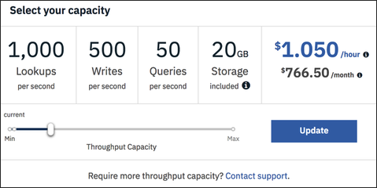

---

copyright:
  years: 2015, 2019
lastupdated: "2019-06-12"

keywords: pricing examples, data usage, ibm cloud usage dashboard

subcollection: cloudant

---

{:new_window: target="_blank"}
{:shortdesc: .shortdesc}
{:screen: .screen}
{:codeblock: .codeblock}
{:pre: .pre}
{:note: .note}
{:important: .important}
{:deprecated: .deprecated}

<!-- Acrolinx: 2019-01-11 -->

# Precios
{: #pricing}

El precio de {{site.data.keyword.cloudantfull}} se basa en la capacidad de rendimiento suministrada que asigne a su instancia y en la cantidad de almacenamiento de datos consumida. {{site.data.keyword.cloudant_short_notm}} le permite tanto aumentar como reducir la escala de su capacidad de rendimiento suministrada y pagar por horas de manera prorrateada. La capacidad de rendimiento suministrada es un número reservado de lecturas por segundo, escrituras por segundo y consultas globales por segundo asignadas a una instancia. El valor de capacidad de rendimiento es el nivel máximo de uso durante un segundo determinado. Si intenta
exceder la capacidad reservada para las lecturas, escrituras o consultas globales, obtendrá un código de estado HTTP 429 que indica que la
aplicación está intentando exceder su concesión de capacidad de rendimiento suministrada.

En la tabla siguiente se muestra un ejemplo de cálculo del precio por hora para diversos valores de capacidad de rendimiento suministrada. Puede alternar la capacidad en bloques granulares de 100 lecturas/segundo, 50 escrituras/segundo y 5 consultas globales/segundo en cada hora. También se muestra el coste mensual aproximado para cada valor suponiendo un uso de 730 horas al mes. Los precios se muestran en USD. Puede utilizar la calculadora de precios de {{site.data.keyword.cloud_notm}} para ver el coste estimado en otras divisas pulsando sobre el botón
`Añadir a estimación` del mosaico del catálogo de {{site.data.keyword.cloudant_short_notm}}.

Puede iniciar el separador **Panel de control** > **Cuenta** > **Capacidad** de {{site.data.keyword.cloudant_short_notm}} para ver y cambiar la capacidad de rendimiento suministrada y ver los costes mensuales aproximados y por horas: 

## Ejemplos de precios 
{: #pricing-examples}

Supongamos que está creando una app móvil con {{site.data.keyword.cloudant_short_notm}} y que aún no conoce la capacidad que puede necesitar. En este caso, le recomendamos empezar con la menor capacidad de rendimiento suministrada
y aumentarla tal como sea necesario mediante el uso de la aplicación en el tiempo. {{site.data.keyword.cloudant_short_notm}} factura por horas prorrateadas y cambiar la capacidad de rendimiento suministrada no incurre en el tiempo de inactividad. 

Para el ejemplo de app móvil, empiece con la capacidad de rendimiento mínimo suministrada para el plan Estándar que es de 100 lecturas/segundo, 50 escrituras/segundo y 5 consultas globales/segundo. El coste de esta capacidad es de 0,105 dólares por hora. Las 100 lecturas/segundo,
50 escrituras/segundo y 5 consultas globales/segundo son un bloque de capacidad de rendimiento suministrada. Cuando tenga que aumentar (o disminuir), puede
escalar en incrementos de estos bloques de capacidad. Suponiendo que la instancia tenga menos de
los 20 GB de almacenamiento que se incluye en el plan Estándar, no se incurrirá en costes de almacenamiento. En el
Panel de control de {{site.data.keyword.cloudant_short_notm}} > Cuenta > separador Capacidad, el
valor de capacidad de rendimiento suministrado tiene el aspecto de esta captura de pantalla:

El graduador de capacidad muestra el coste por hora de la capacidad de rendimiento de suministro de 100 lecturas/segundo, 50 escrituras/segundo y 5 consultas globales/segundo en USD de $0,105/hora. El graduador muestra un coste aproximado al mes de 76,65 dólares. La cantidad mensual es una estimación basada en un promedio de 730 horas al mes. El coste en cualquier mes puede ser ligeramente diferente en función del número de horas del mes.

Ecuación de ejemplo: 

- 0,105 dólares por hora * 1 bloque (de 100 lecturas/segundo, 50 escrituras/segundo y 5 consultas globales/segundo de capacidad de rendimiento suministrada) * 730 horas (horas aproximadas en un mes)
- Total = 76,65 dólares

Las lecturas, las escrituras y las consultas globales no se pueden escalar de forma independiente. Utilice el graduador para seleccionar el número de bloques de capacidad de rendimiento suministrada en función del límite máximo de lecturas/segundo, escrituras/segundo o consultas globales/segundo necesarias para la aplicación. Por ejemplo, si la aplicación requiere 1000 lecturas/segundo, utilice el graduador para seleccionar la capacidad que ofrece 1000 lecturas/segundo, 500 escrituras/segundo y 50 consultas globales/segundo, aunque no necesite el número correspondiente de escrituras o consultas globales.

¿Cómo se calcula el coste total de la capacidad de rendimiento suministrada al mes de 1000 lecturas, 500 escrituras y 50 consultas globales? 

- 0,105 dólares por hora * 10 bloques (de 100 lecturas/segundo, 50 escrituras/segundo y 5 consultas globales/segundo de capacidad de rendimiento suministrada) * 730 horas (horas aproximadas en un mes)
- Como alternativa, el graduador muestra que la capacidad de rendimiento suministrada de 1000 lecturas/segundo, 500 escrituras/segundo y 50 consultas globales/segundo cuesta 1,050 dólares/hora * 730 horas
- Total = 766,50 dólares

## Precios de uso de datos
{: #data-usage-pricing}

¿Qué hay de la fijación de precios para el exceso de datos? ¿Cómo funciona?

Plan | Almacenamiento incluido | Límite de excedente
-----|------------------|--------------
Lite | 1 GB |  La cuenta se bloquea y no se pueden escribir datos nuevos hasta que suprima los datos suficientes para estar por debajo del límite de 1 GB, o bien hasta que actualice a un plan superior.
Estándar | 20 GB | El almacenamiento adicional cuesta 0,0014 dólares por GB por hora, que es aproximadamente 1 dólares/GB por mes.

## Panel de control de uso de {{site.data.keyword.cloud_notm}} 
{: #usage-dashboard}

¿Cómo se visualizan los datos en el panel de control de uso de {{site.data.keyword.cloud_notm}}?

Las facturas de uso actual e histórico se pueden ver en el panel de control de
{{site.data.keyword.cloud_notm}}, en Gestionar -> Facturación y uso -> Uso. Esta vista muestra los totales de uso que se han acumulado durante un mes concreto a nivel de servicio, plan o instancia.  El Total estimado refleja la factura en lo que va de mes o para meses completos anteriores. Solo mostrará los costes por horas acumulados hasta ese punto para el mes actual. A final de mes, podrá ver el promedio de capacidad de rendimiento suministrada del mes reflejado en los campos `LOOKUPS_PER_MONTH`, `WRITES_PER_MONTH` y `QUERIES_PER_MONTH`. (Tenga en cuenta que las búsquedas ahora se denominan lecturas y que las consultas ahora se denominan consultas globales). El campo `STORAGE_MANAGED_PER_MONTH` solo muestra el almacenamiento facturado y no incluye los 20 GB incluidos en el plan Estándar. En el ejemplo siguiente, una cantidad de más de 20 GB refleja que había un promedio de 40 GB de datos en la instancia durante el mes. Cuando se utiliza menos de 20 GB de almacenamiento, la pantalla muestra 0 GB, ya que no ha sobrepasado el límite.   

