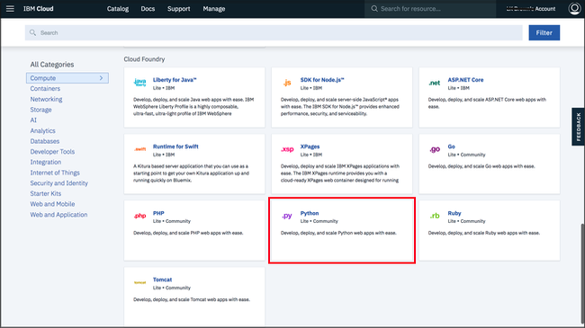
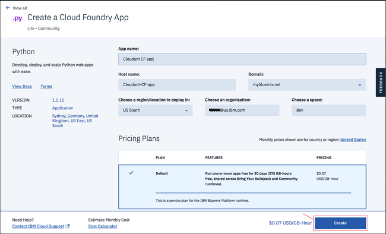

---

copyright:
  years: 2017, 2018
lastupdated: "2018-06-07"

---

{:new_window: target="_blank"}
{:shortdesc: .shortdesc}
{:screen: .screen}
{:codeblock: .codeblock}
{:pre: .pre}

<!-- Acrolinx: 2017-01-10 -->

# Creación de una aplicación sencilla de {{site.data.keyword.cloud_notm}} para acceder a una base de datos de {{site.data.keyword.cloudant_short_notm}}: el entorno de aplicación

En esta sección de la guía de aprendizaje se describe cómo configurar el entorno de aplicación que debe tener para crear una aplicación de {{site.data.keyword.cloud}}.
{:shortdesc}

<div id="creating"></div>

## Creación de un entorno de aplicación de {{site.data.keyword.cloud_notm}}

1.  Inicie una sesión en su cuenta de {{site.data.keyword.cloud_notm}}.
    Encontrará el panel de control de {{site.data.keyword.cloud_notm}} en: [http://bluemix.net ](http://bluemix.net){:new_window}.
    Después de autenticarse con su nombre de usuario y contraseña, aparece el panel de control de {{site.data.keyword.cloud_notm}}:<br/>
    

2.  Pulse el enlace '`Catálogo`':<br/>
    <br/>
    Aparecerá una lista de los servicios disponibles en {{site.data.keyword.cloud_notm}}.

3.  Pulse la entrada '`Apps de Cloud Foundry`' bajo la cabecera `Apps`:<br/>
    <br/>
    Aparecerán las aplicaciones de Cloud Foundry disponibles en {{site.data.keyword.cloud_notm}}.

4.  Pulse la entrada '`Python`':<br/>
    <br/>
    Aparece un formulario '`Crear una app de Cloud Foundry`'.

5.  Utilice el formulario '`Crear una app de Cloud Foundry`' para especificar y crear el entorno para la aplicación Python Cloud Foundry.
    Especifique un nombre para la aplicación, por ejemplo '`Cloudant Python`'.
    El nombre de host se genera automáticamente, pero se puede personalizar:<br/>
    <br/>
    >   **Nota**: El nombre de host debe ser exclusivo dentro del dominio de {{site.data.keyword.cloud_notm}}. En este ejemplo, el dominio es '`mybluemix.net`', lo que da lugar al nombre completo de host '`Cloudant-Python.mybluemix.net`'.

6.  Pulse '`Crear`' para crear el entorno de aplicación:<br/>
    

7.  Después de una breve pausa, aparece la ventana '`Iniciación`' para el nuevo entorno de aplicación.
    Dentro del entorno se crea automáticamente una aplicación de prueba.
    La aplicación se inicia automáticamente, tal como muestra el icono verde y el estado `La app se está ejecutando`.
    La aplicación es un programa de 'latido', suficiente para mostrar que el nuevo entorno de aplicación está listo para que lo utilice.
    Pulse el enlace `Panel de control` para volver al panel de control de su cuenta de {{site.data.keyword.cloud_notm}}.<br/>
    

8.  Ahora el panel de control incluye el entorno de aplicación recién creado:<br/>
    

Ahora tiene un entorno de aplicación de {{site.data.keyword.cloud_notm}} Python, listo para ser utilizado.

Para trabajar con una instancia de base de datos de {{site.data.keyword.cloudant_short_notm}}, el siguiente paso consiste en crear una 'conexión' entre el entorno de aplicación y la instancia de la base de datos.

<div id="connecting"></div>

## Conexión de aplicaciones y servicios de {{site.data.keyword.cloud_notm}}

En esta sección de la guía de aprendizaje se explica cómo conectar entornos de aplicación y servicios de {{site.data.keyword.cloud_notm}} mediante el área de configuración y gestión de la aplicación.

1.  En el panel de control de {{site.data.keyword.cloud_notm}}, pulse la entrada correspondiente a la aplicación.<br/>
    <br/>
    >   **Nota**: Evite la columna '`Ruta`', ya que si se pulsa el enlace asociado a la aplicación, se invoca la aplicación en lugar de ir al área de configuración. Es mejor pulsar en el nombre de la aplicación.

    Aparece el área de visión general de configuración y gestión correspondiente a la aplicación.

2.  Para conectar el entorno de aplicación a otro servicio, pulse el enlace '`Conexiones`':<br/>
    <br/>
    Aparece un área para configurar una conexión entre la aplicación y otros servicios disponibles en la cuenta.

3.  Un [requisito previo](create_bmxapp_prereq.html#prerequisites) de esta guía de aprendizaje es una instancia de base de datos de {{site.data.keyword.cloudant_short_notm}} existente.
    Pulse '`Conectar existente`' para establecer una conexión entre la instancia de base de datos y la aplicación:<br/>
    <br/>
    Aparece una lista de las instancias de servicio existentes.

4.  Pulse la instancia de base de datos de {{site.data.keyword.cloudant_short_notm}} que desea utilizar.
    En esta guía de aprendizaje se utiliza la instancia '`Cloudant Service 2017`':<br/>
    

5.  Se le solicitará que confirme que realmente desea conectar la instancia de base de datos a la aplicación.
    Pulse '`Conectar`' para conectar la conexión:<br>
    

6.  La modificación de las conexiones de servicio de una aplicación afecta a su configuración general.
    La modificación requiere que se 'vuelva a transferir' la aplicación, lo que también fuerza la detención de una aplicación en ejecución.
    Aparece una ventana para que confirme que está listo para 'volver a transferir' para continuar.
    Pulse '`Volver a transferir`' para continuar:<br/>
    

7.  Vuelve a aparecer la página de conexiones de servicio.
    Ahora incluye la instancia de base de datos recién conectada:<br/>
    

Ahora el entorno de aplicación y la instancia de la base de datos están conectadas.
El paso siguiente consiste en asegurarse de que se instalan automáticamente las herramientas necesarias para trabajar con aplicaciones {{site.data.keyword.cloud_notm}}.

<div id="toolkits"></div>

## Los kits de herramientas de mandatos de Cloud Foundry y {{site.data.keyword.cloud_notm}}

En esta sección de la guía de aprendizaje se describen los kits de herramientas que deben estar instalados para trabajar con el entorno, las aplicaciones y los servicios de {{site.data.keyword.cloud_notm}}.

El kit de herramientas de [Cloud Foundry ](https://en.wikipedia.org/wiki/Cloud_Foundry){:new_window} es una colección de herramientas para trabajar con aplicaciones que se despliegan en un entorno compatible con Cloud Foundry.
Utilice estas herramientas para tareas como actualizar una aplicación desplegada o para iniciar y detener una aplicación en ejecución.

El kit de herramientas de {{site.data.keyword.cloud_notm}} proporciona funciones adicionales, que se necesitan para trabajar con aplicaciones alojadas y en ejecución en un entorno de {{site.data.keyword.cloud_notm}}.

> **Nota**: Asegúrese de instalar los kits de herramientas de Cloud Foundry _y_ de {{site.data.keyword.cloud_notm}}.

La descarga e instalación de los kits de herramientas es una tarea única.
Si los kits de herramientas ya están instalados y en funcionamiento en el sistema, no es necesario que los vuelva a descargar, a menos que se hayan actualizado.

Encontrará información general sobre los kits de herramientas [aquí ](../getting-started.html#getting-started-with-cloudant){:new_window}.

### Instalación del kit de herramientas de Cloud Foundry

Algunas distribuciones de sistemas operativos ya tienen una versión del kit de herramientas de Cloud Foundry disponible.
Si la versión admitida es 6.11 o mejor, es compatible con {{site.data.keyword.cloud_notm}} y se puede utilizar.
Para comprobar la versión instalada, ejecute [esta prueba](#checkCFversion).

Como alternativa, siga los pasos siguientes para descargar e instalar el kit de herramientas de Cloud Foundry en el sistema: 

1.  Encontrará un enlace para descargar el kit de herramientas de Cloud Foundry en la ventana '`Iniciación`' del entorno de aplicación:<br/>
    

2.  Si pulsa en el enlace, aparecerá en la [página de descargas de GitHub ](https://github.com/cloudfoundry/cli/releases){:new_window}:<br/>
    

3.  Descargue y ejecute la versión más reciente del instalador correspondiente a su sistema.

4.  <div id='checkCFversion'></div>Para comprobar que tiene un kit de herramientas de Cloud Foundry que funciona, ejecute el siguiente mandato en un indicador:

    ```sh
    cf --version
    ```
    {:pre}
    
    El resultado se debería parecer al siguiente:
    
    ```
    cf version 6.20.0+25b1961-2016-06-29
    ```
    {:codeblock}
    
    >   **Nota**: La versión del kit de herramientas de Cloud Foundry debe ser 6.11 o más reciente por motivos de compatibilidad con {{site.data.keyword.cloud_notm}}.

### Instalación del kit de herramientas de {{site.data.keyword.cloud_notm}}

Siga los pasos siguientes para descargar e instalar el kit de herramientas de {{site.data.keyword.cloud_notm}} en el sistema.

1.  Encontrará un enlace para descargar el kit de herramientas de {{site.data.keyword.cloud_notm}} en la ventana '`Iniciación`' de la aplicación:<br/>
    

2.  Si pulsa en el enlace, aparecerá en la [página de descargas ](https://console.bluemix.net/docs/cli/reference/bluemix_cli/get_started.html#getting-started){:new_window}:<br/>
    


3.  Descargue y ejecute el instalador adecuado para el sistema.

    El instalador realiza una comprobación para asegurarse de que tiene instalada una versión adecuada del kit de herramientas de Cloud Foundry.
    Si todo es correcto, el kit de herramientas de {{site.data.keyword.cloud_notm}} se instala en el sistema.

4.  Para comprobar que tiene un kit de herramientas de {{site.data.keyword.cloud_notm}} que funciona, ejecute el mandato siguiente en un indicador:
    
    ```sh
    bluemix --version
    ```
    {:pre}
    
    El resultado se debería parecer al siguiente:
    
    ```
    bluemix version 0.4.5+03c29de-2016-12-08T07:01:01+00:00
    ```
    {:codeblock}
    
Ahora ya dispone de las herramientas para trabajar con aplicaciones {{site.data.keyword.cloud_notm}}.
El siguiente paso consiste en obtener el material de 'inicio' para ayudarle a crear una aplicación {{site.data.keyword.cloud_notm}}.

<div id="starter"></div>

## La aplicación 'de inicio'

En esta sección de la guía de aprendizaje se describe una aplicación de inicio de {{site.data.keyword.cloud_notm}} y se explica cómo personalizarla para acceder a una instancia de base de datos de {{site.data.keyword.cloudant_short_notm}}.

Una aplicación de inicio de {{site.data.keyword.cloud_notm}} es la mínima colección posible de archivos de origen y de configuración necesarios para crear una aplicación {{site.data.keyword.cloud_notm}} que funcione.
En algunos casos, se parece a una [aplicación 'Hello World' ](https://en.wikipedia.org/wiki/%22Hello,_World!%22_program){:new_window};
solo sirve para mostrar que el sistema básico y la configuración funcionan correctamente.

Una aplicación de inicio de {{site.data.keyword.cloud_notm}} es un archivador de archivos de ejemplo que debe modificar o ampliar a medida que desarrolla su aplicación {{site.data.keyword.cloud_notm}}.

En concreto hay tres archivos esenciales:

-   ['`Procfile`'](#procfile)
-   ['`manifest.yml`'](#manifest)
-   ['`requirements.txt`'](#requirements)

<div id="procfile"></div>

### El archivo '`Procfile`'

El archivo '`Procfile`' contiene los detalles que necesita {{site.data.keyword.cloud_notm}} para ejecutar la aplicación.

En concreto, un archivo
'`Procfile`' es un artefacto de Cloud Foundry que define el tipo de proceso de una aplicación y el mandato para ejecutar la aplicación.
Encontrará más información sobre '`Procfile`' [aquí ](https://docs.cloudfoundry.org/buildpacks/prod-server.html#procfile){:new_window}.

El archivo '`Procfile`' correspondiente a una aplicación de inicio de {{site.data.keyword.cloud_notm}} Python se parece al del siguiente ejemplo:

```
web: python server.py
```
{:codeblock}

En este ejemplo se indica que la aplicación es una aplicación web Python y que se inicia mediante la ejecución del siguiente mandato:

```sh
python server.py
```
{:codeblock}

Se incluye un archivo de origen de Python '`server.py`' de inicio en el archivador de la aplicación de inicio.
El archivo '`server.py`' se modifica para la aplicación.
También puede crear un archivo de origen de Python completamente nuevo.
A continuación, actualice el archivo
'`Procfile`' para que se utilice el archivo nuevo cuando se inicie la aplicación.

<div id="manifest"></div>

### El archivo '`manifest.yml`'

El archivo '`manifest.yml`' es una descripción completa de la aplicación y del entorno que necesita para ejecutarse.

El archivo correspondiente a una aplicación de inicio de Python de {{site.data.keyword.cloud_notm}} se parece al del siguiente ejemplo:

```
applications:
- path: .
  memory: 128M
  instances: 1
  domain: mybluemix.net
  name: Cloudant Python
  host: Cloudant-Python
  disk_quota: 1024M
  services:
  - Cloudant Service 2017
```
{:codeblock}

Vale la pena resaltar tres puntos:

-   Los valores '`domain`',
    '`name`', y '`host`' corresponden a los valores especificados cuando se [creó](#creating) la aplicación {{site.data.keyword.cloud_notm}}.
-   El kit de herramientas de Cloud Foundry utiliza el valor '`name`' para identificar la aplicación que va a administrar.
-   El valor '`services`' confirma que la instancia '`Cloudant Service 2017`' de la base de datos de {{site.data.keyword.cloudant_short_notm}} está conectada al entorno de aplicación.

Normalmente no es necesario modificar el archivo '`manifest.yml`', pero resulta útil para comprender por qué debe estar presente para que la aplicación funcione.

<div id="requirements"></div>

### El archivo '`requirements.txt`'

El archivo '`requirements.txt`' especifica los componentes adicionales necesarios para que la aplicación funcione.

En la aplicación de inicio, el archivo '`requirements.txt`' está vacío.

Sin embargo, en esta guía de aprendizaje la aplicación
Python accede a una instancia de base de datos de {{site.data.keyword.cloudant_short_notm}}.
Por lo tanto, la aplicación debe ser capaz de utilizar la biblioteca de cliente de [{{site.data.keyword.cloudant_short_notm}} correspondiente a las aplicaciones Python](../libraries/supported.html#python).

Para habilitar la biblioteca de cliente de Python, modifique el archivo
'`requirements.txt`' para que quede así:
```
cloudant==2.3.1
```
{:codeblock}

## El paso siguiente

El siguiente paso de esta guía de aprendizaje es [crear la aplicación](create_bmxapp_createapp.html).
