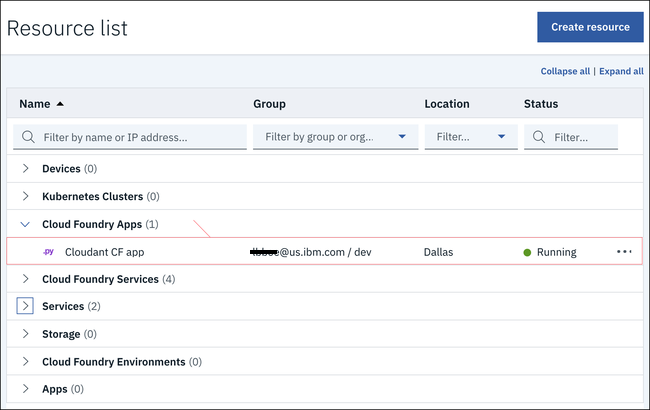
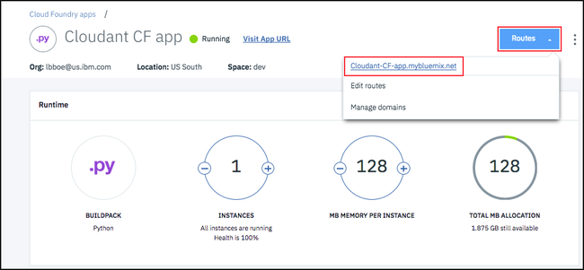

---

copyright:
  years: 2017, 2018
lastupdated: "2017-11-07"

---

{:new_window: target="_blank"}
{:shortdesc: .shortdesc}
{:screen: .screen}
{:codeblock: .codeblock}
{:pre: .pre}

<!-- Acrolinx: 2017-01-11 -->

# Creación de una aplicación sencilla de {{site.data.keyword.Bluemix_notm}} para acceder a una base de datos de {{site.data.keyword.cloudant_short_notm}}: carga de la aplicación

En esta sección de la guía de aprendizaje se describe cómo cargar una aplicación de {{site.data.keyword.Bluemix}}.
{:shortdesc}

<div id="uploading"></div>

## Conexión a {{site.data.keyword.Bluemix_notm}}

La primera tarea es conectarse a {{site.data.keyword.Bluemix_notm}}.

El [kit de herramientas de {{site.data.keyword.Bluemix_notm}}](create_bmxapp_appenv.html#toolkits) le ayuda a realizar la conexión.

Cloud Foundry necesita saber el URL que debe utilizar para realizar llamadas de API, por ejemplo cuando carga una aplicación.
El kit de herramientas de {{site.data.keyword.Bluemix_notm}} utiliza el mandato '`cf api`' para gestionar el punto final de la API.
Para ver más información sobre el mandato'`cf api`', consulte
[aquí ](https://console.ng.bluemix.net/docs/cli/reference/cfcommands/index.html#cf_api){:new_window}.

Utilice el siguiente mandato para indicar a Cloud Foundry el URL que debe utilizar:

```sh
bluemix api https://api.ng.bluemix.net
```
{:pre}

El resultado se debería parecer al siguiente:

```
Invoking 'cf api https://api.ng.bluemix.net'...

Setting api endpoint to https://api.ng.bluemix.net...
OK

API endpoint:   https://api.ng.bluemix.net
API version:    2.54.0
Not logged in. Use 'bluemix login' to log in.
```
{:codeblock}

Ahora Cloud Foundry sabe dónde enviar las llamadas de API para gestionar aplicaciones.

El siguiente paso consiste en iniciar una sesión en el entorno de aplicación de {{site.data.keyword.Bluemix_notm}}.
Debe proporcionar los siguientes detalles de la cuenta:

-   El nombre de usuario, que se especifica en el parámetro '`-u`'.
-   El nombre de la organización, que se especifica en el parámetro '`-o`'.
-   El espacio, que se especifica en el parámetro '`-s`'.

>   **Nota**: Los detalles de la cuenta están disponibles en el panel de control de {{site.data.keyword.Bluemix_notm}},
    cuando se inicia una sesión mediante un navegador web, tal como se muestra en el siguiente ejemplo:<br/>
    

Utilice un mandato parecido al del siguiente ejemplo para iniciar una sesión en el entorno de aplicación de {{site.data.keyword.Bluemix_notm}}.
Tenga en cuenta que se le solicitará que especifique la contraseña de su cuenta.

```sh
bluemix login -u Adrian.Warman@uk.ibm.com -o Adrian.Warman@uk.ibm.com -s dev
```
{:pre}

El resultado se debería parecer al siguiente:

```
Invoking 'cf login -u Adrian.Warman@uk.ibm.com -o Adrian.Warman@uk.ibm.com -s dev'...

API endpoint: https://api.ng.bluemix.net

Password>
Authenticating...
OK

Targeted org Adrian.Warman@uk.ibm.com

Targeted space dev
                
API endpoint:   https://api.ng.bluemix.net (API version: 2.54.0)
User:           adrian.warman@uk.ibm.com
Org:            Adrian.Warman@uk.ibm.com
Space:          dev
```
{:codeblock}

## Carga de la aplicación

Ahora, el kit de herramientas de {{site.data.keyword.cloudant_short_notm}} Foundry sabe cómo conectar con el entorno de {{site.data.keyword.Bluemix_notm}}.

El siguiente paso consiste en cargar la aplicación propiamente dicha.
Encontrará los detalles de una aplicación de {{site.data.keyword.Bluemix_notm}} en el [archivo de manifiesto](create_bmxapp_appenv.html#manifest).

El archivo de manifiesto correspondiente a la aplicación de la guía de aprendizaje se ha actualizado tal como se describe [aquí](create_bmxapp_createapp.html#essential-files)

Utilice un mandato parecido al del siguiente ejemplo para iniciar una sesión para cargar la aplicación de {{site.data.keyword.Bluemix_notm}}.

```sh
cf push "Cloudant Python"
```
{:pre}

Se muestra una secuencia de mensajes de resultados.

```
Using manifest file /..../BMXDemo/manifest.yml

Updating app {{site.data.keyword.cloudant_short_notm}} Python in org Adrian.Warman@uk.ibm.com / space dev as Adrian.Warman@uk.ibm.com...
OK
```
{:codeblock}

El kit de herramientas de Cloud Foundry ha localizado el archivo de manifiesto y se prepara para cargar la aplicación utilizando los detalles de la conexión y de identificación que ha especificado [anteriormente](#uploading).

```
Using route Cloudant-Python.mybluemix.net
Uploading Cloudant Python...
Uploading app files from: /..../BMXDemo
Uploading 1.5K, 3 files
Done uploading               
OK
Binding service {{site.data.keyword.cloudant_short_notm}} Service 2017 to app {{site.data.keyword.cloudant_short_notm}} Python in org Adrian.Warman@uk.ibm.com / space dev as Adrian.Warman@uk.ibm.com...
OK
```
{:codeblock}

La aplicación se ha cargado correctamente y se ha establecido una conexión con la instancia de base de datos de {{site.data.keyword.cloudant_short_notm}}.

```
Starting app {{site.data.keyword.cloudant_short_notm}} Python in org Adrian.Warman@uk.ibm.com / space dev as Adrian.Warman@uk.ibm.com...
-----> Downloaded app package (4.0K)
-----> Downloaded app buildpack cache (29M)
-------> Buildpack version 1.5.5
     $ pip install -r requirements.txt
DEPRECATION: --allow-all-external has been deprecated and will be removed in the future. Due to changes in the repository protocol, it no longer has any effect.
       Collecting cloudant==2.3.1 (from -r requirements.txt (line 1))
         Downloading cloudant-2.3.1-py2-none-any.whl (63kB)
       Collecting requests<3.0.0,>=2.7.0 (from cloudant==2.3.1->-r requirements.txt (line 1))
         Downloading requests-2.12.4-py2.py3-none-any.whl (576kB)
       Installing collected packages: requests, cloudant
       Successfully installed cloudant-2.3.1 requests-2.12.4
You are using pip version 8.1.1, however version 9.0.1 is available.
You should consider upgrading via the 'pip install --upgrade pip' command.
You are using pip version 8.1.1, however version 9.0.1 is available.
You should consider upgrading via the 'pip install --upgrade pip' command.
-----> Uploading droplet (30M)

0 of 1 instances running, 1 starting
1 of 1 instances running

App started


OK

App {{site.data.keyword.cloudant_short_notm}} Python was started using this command `python server.py`
```
{:codeblock}

La aplicación se inicia automáticamente.
Como parte del inicio, se realiza una comprobación para garantizar que se cumplen todos los requisitos, mediante la evaluación del contenido del [archivo requirements.txt](create_bmxapp_appenv.html#requirements).
La aplicación necesita acceso a la biblioteca de {{site.data.keyword.cloudant_short_notm}}, que se [ha especificado](create_bmxapp_createapp.html#essential-files) cuando se ha creado la aplicación.

Después de cargar e iniciar la aplicación, se ejecutan algunas comprobaciones sencillas del sistema para confirmar que la aplicación se ejecuta correctamente en lo referente a {{site.data.keyword.Bluemix_notm}}.

```
Showing health and status for app {{site.data.keyword.cloudant_short_notm}} Python in org Adrian.Warman@uk.ibm.com / space dev as Adrian.Warman@uk.ibm.com...
OK

requested state: started
instances: 1/1
usage: 128M x 1 instances
urls: Cloudant-Python.mybluemix.net
last uploaded: Thu Dec 22 15:58:18 UTC 2016
stack: cflinuxfs2
buildpack: python 1.5.5

     state     since                    cpu    memory          disk           details
#0   running   2016-12-22 03:59:21 PM   0.0%   49.9M of 128M   110.6M of 1G
```
{:codeblock}

## Prueba de la aplicación de ejemplo

Cuando se ha creado por primera vez el entorno de aplicación de {{site.data.keyword.Bluemix_notm}}, el panel de control ha incluido un enlace en la columna `Ruta` correspondiente a la aplicación:<br/>


Si se pulsa el enlace, se abre una ventana del navegador que solicita ciertos datos de la aplicación que está a la escucha en el puerto correspondiente.
La aplicación responde devolviendo el contenido del archivo de registro que se ha generado cuando se ha iniciado la aplicación:<br/>


El contenido de este archivo de registro es interesante.
Se muestra claramente la hora de inicio y de finalización.
Entre medio, el registro registra cada uno de los detalles a medida que se va recuperando la información de conexión correspondiente a {{site.data.keyword.cloudant_short_notm}}.
Los valores reales de la conexión no son importantes.
El registro muestra que la aplicación de la guía de aprendizaje ha podido localizar, recuperar y utilizar esos valores para crear un nuevo documento en la base de datos de {{site.data.keyword.cloudant_short_notm}}.

### Confirmación de los detalles de la base de datos

Empiece por abrir el panel de control de {{site.data.keyword.cloudant_short_notm}}.
Pulse el icono `Iniciar` del separador `Gestionar` de la página de servicio de {{site.data.keyword.cloudant_short_notm}}:<br/>


> **Nota**: Para encontrar la página de servicio de {{site.data.keyword.cloudant_short_notm}}, consulte los detalles de la guía de aprendizaje ['Creación de una instancia de {{site.data.keyword.cloudant_short_notm}}'](create_service.html#locating-your-service-credentials).

Cuando se abra el panel de control, verá que la aplicación ha creado la base de datos '`databasedemo`':<br/>


La base de datos contiene un único documento, creado por la aplicación.
Para verificar la presencia del documento, pulse el nombre de la base de datos en el panel de control.
Aparece una lista de opciones para la base de datos.
Cuando se selecciona el separador `Todos los documentos`, aparecen los detalles de un solo documento:<br/>


Para ver el contenido del documento, pulse el icono `Editar`, que aparece como la imagen de un lápiz:<br/>


Cuando aparezca el contenido del documento, podrá ver cada uno de los campos que ha creado la aplicación de la guía de aprendizaje.<br/>
<br/>
En concreto, el campo `rightNow` contiene la fecha y hora en que se ha creado el documento.
Este valor corresponde a la hora que se ha registrado en el [archivo de registro de la aplicación](#testing-the-sample-application).

## El paso siguiente

El siguiente paso de esta guía de aprendizaje es [utilizar y mantener la aplicación](create_bmxapp_maintain.html), por ejemplo cuando se inicia, se detiene o se depura la aplicación.
