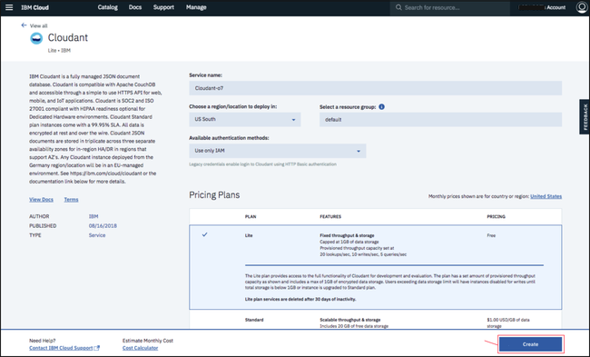
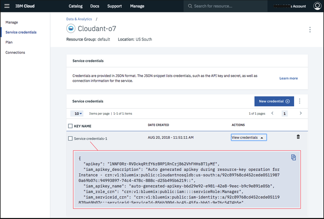

---

copyright:
  years: 2017, 2018
lastupdated: "2017-11-07"

---

{:new_window: target="_blank"}
{:shortdesc: .shortdesc}
{:screen: .screen}
{:codeblock: .codeblock}
{:pre: .pre}

# Creación de una instancia de {{site.data.keyword.cloudant_short_notm}} en {{site.data.keyword.Bluemix_notm}}

En esta guía de aprendizaje se muestra cómo crear una instancia de servicio de {{site.data.keyword.cloudantfull}} mediante el panel de control de {{site.data.keyword.Bluemix}} y se muestra dónde encontrar la información básica para permitir que las aplicaciones funcionen con la base de datos.
{:shortdesc}

Para acceder a una instancia de servicio de {{site.data.keyword.cloudant_short_notm}}, necesita un conjunto de [credenciales de servicio](#the-service-credentials).
Las credenciales se generan como parte del proceso cuando se crea una instancia de servicio.

También puede encontrar estas credenciales en cualquier momento, accediendo a su cuenta de {{site.data.keyword.cloudant_short_notm}}.

## Creación de una instancia de servicio

1.  Inicie una sesión en su cuenta de {{site.data.keyword.Bluemix_notm}}. 
    Encontrará el panel de control de {{site.data.keyword.Bluemix_notm}} en: [http://bluemix.net ](http://bluemix.net){:new_window}.
    Después de autenticarse con su nombre de usuario y contraseña, aparecerá el panel de control de {{site.data.keyword.Bluemix_notm}}: 
    

2.  Pulse el enlace `Catálogo`: 
     
    Aparecerá una lista de los servicios disponibles en {{site.data.keyword.Bluemix_notm}}.

3.  Pulse la entrada `Datos y análisis` bajo la cabecera `Servicios`: 
     
    Aparece una lista de los servicios de datos y análisis disponibles en {{site.data.keyword.Bluemix_notm}}.

4.  Pulse el servicio {{site.data.keyword.cloudant_short_notm}}: 
    

5.  En la ventana de configuración del servicio, especifique un nombre de servicio.
    En este ejemplo, el nombre del servicio es `Cloudant Service 2017`: 
    

6.  De forma predeterminada, el servicio se crea utilizando el plan de precios 'Lite', que es gratuito pero ofrece una capacidad limitada.
    [Están disponibles](../offerings/bluemix.html) otros planes de precios con mayor capacidad. 
    Para crear el servicio, pulse el botón `Crear`: 
    

7.  Aparece una página de servicio, que confirma que el nuevo servicio de {{site.data.keyword.cloudant_short_notm}} está disponible.
    Para acceder a la información de conexión que necesita la aplicación para conectar con el servicio, pulse el separador `Credenciales de servicio`: 
    

8.  Aparece la ventana Credenciales de servicio.
    Para ver las credenciales necesarias para acceder al servicio, pulse el menú desplegable `Ver credenciales`: 
    

9.  Aparecen los detalles de las credenciales de servicio: 
    

>   **Nota**: Las credenciales de servicio de estos ejemplos
    se han definido durante la creación del servicio {{site.data.keyword.cloudant_short_notm}} de demostración en {{site.data.keyword.cloudant_short_notm}}.
    Aquí se reproducen las credenciales para mostrar cómo deben aparecer en el panel de control.
    Sin embargo, el servicio de {{site.data.keyword.cloudant_short_notm}} de demostración se ha eliminado, por lo que estas credenciales ya no son válidas; _debe_ especificar y utilizar sus propias credenciales de servicio.

## Las credenciales de servicio

>   **Nota**: Las credenciales de servicio son muy valiosas.
    Si alguna persona o alguna aplicación tiene acceso a las credenciales, puede hacer lo que quiera con la instancia de servicio; por ejemplo, podría crear datos falsos o suprimir información importante.
    Proteja bien estas credenciales.

Las credenciales de servicio constan de cinco campos:

Campo      | Finalidad
-----------|--------
`host`     | El nombre de host que utilizan las aplicaciones para localizar la instancia de servicio.
`username` | El nombre de usuario que necesitan las aplicaciones para acceder a la instancia de servicio.
`password` | La contraseña que necesitan las aplicaciones para acceder a la instancia de servicio.
`port`     | El número de puerto HTTP para acceder a la instancia de servicio en el host. Normalmente es 443 para forzar el acceso HTTPS.
`url`      | Una serie que agrega la otra información de credenciales en un URL único, adecuado para que lo utilicen las aplicaciones.

Para crear una aplicación que pueda acceder a la instancia de servicio, necesita estas credenciales.

## Localización de las credenciales de servicio

En cualquier momento, puede encontrar las credenciales correspondientes a un servicio que está asociado a su cuenta.

1.  Empiece por iniciar una sesión en {{site.data.keyword.cloudant_short_notm}}.
    Encontrará el panel de control de {{site.data.keyword.Bluemix}} en: [http://bluemix.net ](http://bluemix.net){:new_window}.
    Después de autenticarse con su nombre de usuario y contraseña, aparecerá el panel de control de {{site.data.keyword.Bluemix_notm}}: 
    

2.  Desplácese hacia abajo por el panel de control hasta llegar a la sección que contiene una lista de todos los servicios: 
    

3.  En este ejemplo, queremos encontrar las credenciales de servicio para la instancia del servicio {{site.data.keyword.cloudant_short_notm}} que se ha creado anteriormente en la guía de aprendizaje, denominada `Cloudant Service 2017`.
    Pulse la fila correspondiente: 
    

3.  Aparece la ventana Credenciales de servicio.
    Para ver las credenciales necesarias para acceder al servicio, pulse el menú desplegable `Ver credenciales`: 
    

4.  Aparecen los detalles de las credenciales de servicio: 
    

>   **Nota**: Las credenciales de servicio de estos ejemplos
    se han definido durante la creación del servicio {{site.data.keyword.cloudant_short_notm}} de demostración en {{site.data.keyword.cloudant_short_notm}}.
    Aquí se reproducen las credenciales para mostrar cómo deben aparecer en el panel de control.
    Sin embargo, el servicio de {{site.data.keyword.cloudant_short_notm}} de demostración se ha eliminado, por lo que estas credenciales ya no son válidas; _debe_ especificar y utilizar sus propias credenciales de servicio.
