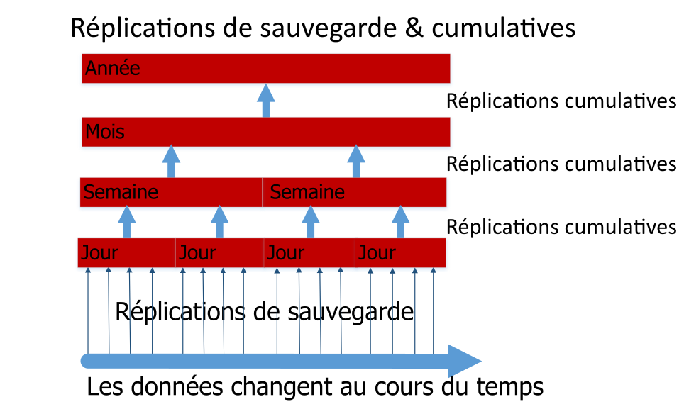

---

copyright:
  years: 2015, 2017
lastupdated: "2017-05-04"

---

{:new_window: target="_blank"}
{:shortdesc: .shortdesc}
{:screen: .screen}
{:codeblock: .codeblock}
{:pre: .pre}

# Sauvegarde de vos données

>   **Remarque** : Le présent guide fait référence à une option de sauvegarde incrémentielle quotidienne *obsolète*,
    auparavant disponible uniquement sur demande des clients d'entreprise.
    Pour obtenir les dernières recommandations en matière de sauvegarde, consultez le guide [Reprise après incident et sauvegarde](disaster-recovery-and-backup.html).

Cette fonction :
-   N'est pas activée par défaut.
-   Est disponible uniquement pour les clients d'entreprise qui en font la demande expresse.
-   Doit être explicitement configurée avant qu'elle ne soit opérationnelle.
-   Est soumise à des [limitations connues](#known-limitations).
-   Ne s'applique pas [Cloudant Local ](https://www.ibm.com/support/knowledgecenter/SSTPQH_1.0.0/com.ibm.cloudant.local.doc/SSTPQH_1.0.0_welcome.html){:new_window}.
Pour plus d'informations, contactez [l'équipe de support d'IBM Cloudant ](mailto:support@cloudant.com){:new_window}.

>   **Remarque** : La fonction de sauvegarde incrémentielle quotidienne ne s'applique pas à
    [Cloudant Local ](https://www.ibm.com/support/knowledgecenter/SSTPQH_1.0.0/com.ibm.cloudant.local.doc/SSTPQH_1.0.0_welcome.html){:new_window}.
    Pour sauvegarder les données de Cloudant Local,
    utilisez la [réplication](../api/replication.html) pour créer une copie de votre base de données.

Pour garantir la haute disponibilité,
{{site.data.keyword.cloudant}} crée trois exemplaires de chaque document,
et les stocke sur trois serveurs différents dans un cluster.
Il s'agit de la pratique par défaut pour tous les utilisateurs de Cloudant.
Même lorsque vos données sont répliquées en trois exemplaires, il est important de les sauvegarder.

Pourquoi la sauvegarde est-elle si importante ?
Vous pouvez perdre l'accès à vos données de multiples façons.
Par exemple, si une tempête détruit votre centre de données et que les trois noeuds sont à cet endroit, vous perdez vos données.
Vous pouvez prévenir ces catastrophes en répliquant vos données dans un cluster (dédié ou à service partagé) installé dans un lieu géographique différent.
Toutefois, si une application défectueuse supprime ou écrase les données de votre base de données, les copies de données ne sont guère utiles.

Lorsque vous disposez d'une solution de sauvegarde complète dont le fonctionnement a été testé, vous pouvez répondre à la question suivante en toute confiance :
"Comment restaurer nos données en cas de perte ou d'altération ?"

Sous Cloudant,
les clients d'entreprise peuvent effectuer des sauvegardes incrémentielles quotidiennes.

Si vous n'êtes pas un client d'entreprise ou si vous souhaitez créer votre propre mécanisme de sauvegarde, envisagez d'[utiliser la réplication pour effectuer les sauvegardes](disaster-recovery-and-backup.html).

>   **Remarque** : La sauvegarde incrémentielle quotidienne pour les clients d'entreprise n'est actuellement disponible que sous la version *bêta*.
    Cette option n'est pas activée par défaut.

Les sauvegardes incrémentielles quotidiennes ou "deltas" permettent d'effectuer des comparaisons entre les documents et de restaurer plus facilement un document unique.
A intervalles réguliers, configurables selon vos besoins, les plus petits deltas quotidiens sont cumulés aux deltas hebdomadaires.
De la même manière, les deltas hebdomadaires sont cumulés aux deltas mensuels et les deltas mensuels aux deltas annuels.
Ce processus de cumul des deltas représente un compromis pragmatique entre la capacité à restaurer exactement la version d'un document et la demande d'un espace de stockage important.

La fonction de sauvegarde vous permet de restaurer manuellement des documents individuels.
Si vous souhaitez restaurer la base de données dans son intégralité, par exemple dans le cadre d'un scénario de reprise après incident, contactez l'équipe du support technique pour pouvoir restaurer vos données un jour, un mois ou une année spécifique, en fonction de vos deltas disponibles.

Vous trouverez davantage d'informations sur la façon dont Cloudant sauvegarde les données dans le reste de cette rubrique.
Si vous avez besoin d'aide ou si vous avez besoin d'activer la sauvegarde de données, contactez l'équipe de support de Cloudant à l'adresse :
[support@cloudant.com ](mailto:support@cloudant.com){:new_window}.

>   **Remarque** : La fonction de sauvegarde de Cloudant est disponible uniquement pour les clients d'entreprise.

>   **Remarque** : Par défaut,
    les documents `_design` ne sont pas sauvegardés,
    de sorte que les index ne sont _pas_ générés d'après les bases de données de sauvegarde incrémentielle.
    Si vous avez besoin de sauvegardes des documents `_design`,
    conservez-les dans votre outil de contrôle des sources préféré.

## Concepts

Il est primordial de bien comprendre les termes suivants lorsque l'on fait référence aux concepts de sauvegarde :

Terme                 | Signification
---------------------|--------
Nettoyage de sauvegarde       | Lorsqu'une base de données delta est cumulative, elle est supprimée après une période de temps configurable. Ceci permet d'équilibrer la conservation des données à un niveau de granularité élevé par rapport au coût de stockage.
Sauvegarde cumulative       | Les sauvegardes quotidiennes sont combinées dans des bases de données cumulées hebdomadaires. Les deltas quotidiens sont ainsi combinés à une sauvegarde plus grossière (à savoir moins granulaire). De la même manière, les bases de données hebdomadaires sont cumulées dans des bases de données mensuelles, et les bases de données mensuelles dans des bases de données annuelles.
Exécution de sauvegarde           | Pendant une période de sauvegarde donnée, la base de données source est répliquée à l'aide de valeurs de séquence pour déterminer les documents qui ont été modifiés au cours de la période de sauvegarde. A l'issue de cette période, la réplication est appelée sauvegarde quotidienne.
Sauvegarde de référence      | Collection de documents, avec laquelle peut être comparée une base de données delta.
Sauvegarde quotidienne         | Voir Exécution de sauvegarde.
Delta quotidien          | Autre nom de la sauvegarde quotidienne.
Base de données delta       | Collection de documents ayant été modifiés au cours d'une période donnée (le 'delta').
Granularité élevée/faible | Indique le niveau de précision que vous pouvez définir pour la période de modification d'un document. Un cumul à granularité élevée est associé à un délai de modification court, par exemple un jour dans le cadre d'une sauvegarde quotidienne. Un cumul à granularité faible est associé à un délai de modification long, par exemple une année dans le cadre d'une sauvegarde annuelle.
Sauvegarde incrémentielle   | Collection de documents ayant été modifiés dans la base de données depuis la dernière sauvegarde.
Cumul              | Agrégation d'une collection de sauvegardes incrémentielles dans une sauvegarde à granularité plus faible, par exemple pour agréger les sauvegardes quotidiennes d'une semaine dans une même sauvegarde de type "hebdomadaire".

## Sauvegardes incrémentielles

La première étape de l'activation des sauvegardes incrémentielles consiste à effectuer une sauvegarde intégrale de votre base de données.
Vous obtenez alors une "base de référence" pour les sauvegardes incrémentielles ultérieures.

Chaque jour, après la première sauvegarde de référence, une sauvegarde incrémentielle est réalisée.
La sauvegarde incrémentielle quotidienne contient uniquement les données qui ont été modifiées dans la base de données depuis la dernière sauvegarde.
La sauvegarde quotidienne représente le "delta quotidien".

Dans le cadre de la demande d'activation des sauvegardes de données, vous pouvez indiquer l'heure à laquelle exécuter la sauvegarde.
Le delta quotidien est créé chaque jour, à l'heure que vous avez spécifiée.

## Cumuls

Un cumul combine des sauvegardes quotidiennes en bases de données cumulatives hebdomadaires.
Ces bases de données cumulées combinent les deltas quotidiens en une tranche de temps plus grossière ou "moins granulaire".
Les bases de données hebdomadaires fusionnent en bases de données mensuelles et les bases de données mensuelles en bases de données annuelles.



Lors de la demande d'activation des sauvegardes, indiquez le nombre de deltas à conserver.
Une fois ce nombre atteint, le delta quotidien le plus ancien est cumulé à la base de données hebdomadaire la plus récente.
Par la suite, les bases de données hebdomadaires sont cumulées afin de créer des bases de données mensuelles, et ainsi de suite.

Une fois que les bases de données delta ont été cumulées, elles sont supprimées afin de libérer de l'espace de stockage.

## Restaurations

Lorsque vous possédez des sauvegardes d'une base de données, vous pouvez consulter un document individuel de cette base de données et voir les modifications qui lui ont été apportées.
Vous pouvez également restaurer un document en utilisant la version d'une date donnée, si celle-ci est disponible pour la granularité du delta.

>   **Remarque** : Les documents doivent être statiques pour pouvoir être restaurés à partir d'une sauvegarde.
    Autrement dit,
    le document ne doit pas continuellement recevoir de modifications ni de mises à jour.

Pour les restaurations plus complexes,
telles que des restaurations de bases de données intégrales,
demandez assistance au [support de Cloudant ](mailto:support@cloudant.com){:new_window}.

## Utilisation du tableau de bord

Les clients d'entreprise ont la possibilité d'examiner le statut et l'historique des sauvegardes à l'aide du tableau de bord de Cloudant.

Les tâches que vous pouvez accomplir sont les suivantes :

-   Afficher le statut de la dernière sauvegarde, y compris la date et l'heure de son exécution.
-   Afficher la liste des versions du document de sauvegarde par date et heure.
-   Afficher un document actuel et le comparer avec une version sauvegardée.
-   Restaurer un document à partir d'une version sauvegardée. 

### Affichage du statut de sauvegarde d'une base de données


Lorsque vous sélectionnez l'onglet Base de données sur le tableau de bord de Cloudant,
vous voyez la colonne de statut de sauvegarde pour chacune de vos bases de données.

### Affichage du statut de sauvegarde d'un document


Dans une base de données,
vous pouvez consulter le statut de sauvegarde d'un document particulier.
Pour ce faire, commencez par vérifier s'il existe une icône de sauvegarde
()
pour votre document.
Celle-ci indique si le document en question est inclus dans la tâche de sauvegarde.

Lorsque vous sélectionnez le document,
vous pouvez voir l'onglet de sauvegarde.


### Affichage des différences entre les versions de sauvegarde d'un document, et restauration


Lorsque vous cliquez sur l'onglet de sauvegarde d'un document, vous pouvez voir les différences entre la version actuelle du document et des versions plus anciennes.

Si vous choisissez de restaurer une version de sauvegarde spécifique de ce document, sélectionnez simplement la date de la version à restaurer et cliquez sur le bouton "Restaurer".

>   **Remarque** : Les documents doivent être stables pour pouvoir être restaurés à partir d'une sauvegarde.
    Autrement dit,
    le document ne doit pas continuellement recevoir de modifications ni de mises à jour.

## Utilisation de l'interface de programmation (API)

Un certain nombre d'appels d'API REST sont compatibles avec la fonction de sauvegarde de Cloudant.

### Configuration des tâches

L'appel `task` récupère la configuration des tâches de sauvegarde pour l'utilisateur.

Vous pouvez spécifier le format utilisé dans la réponse à l'aide du paramètre `format`.

_Exemple d'interrogation de configuration des tâches de sauvegarde pour l'utilisateur,
avec les résultats au format de liste (par défaut), en utilisant HTTP :_

```http
GET /_api/v2/backup/task HTTP/1.1
```
{:codeblock}

_Exemple d'interrogation de configuration des tâches de sauvegarde pour l'utilisateur,
renvoyant les résultats au format de liste (par défaut), en utilisant la ligne de commande :_

```sh
curl https://$ACCOUNT.cloudant.com/_api/v2/backup/task \
    -X GET
```
{:codeblock}

_Exemple d'interrogation de configuration des tâches de sauvegarde pour l'utilisateur,
avec les résultats au format de mappage, en utilisant HTTP :_

```http
GET /_api/v2/backup/task?format=mapping HTTP/1.1
```
{:codeblock}

_Exemple d'interrogation de configuration des tâches de sauvegarde pour l'utilisateur,
avec les résultats au format de mappage, en utilisant la ligne de commande :_

```sh
curl https://$ACCOUNT.cloudant.com/_api/v2/backup/task?format=mapping \
     -X GET
```
{:codeblock}

Le format de réponse par défaut est le format liste.
Vous pouvez demander ce format directement en utilisant le paramètre `...backup/task?format=list`.
La réponse contient une simple liste des tâches de sauvegarde définies pour l'utilisateur.

Par exemple,
vous pouvez exiger une réponse au format liste en utilisant l'une ou l'autre des commandes ci-dessous :

```http
https://$ACCOUNT.cloudant.com/_api/v2/backup/task

https://$ACCOUNT.cloudant.com/_api/v2/backup/task?format=list
```
{:codeblock}

_Exemple de réponse à la demande de format liste :_

```json
{
    "rows": [
        {
            "username": "$ACCOUNT",
            "task": "backup-0d0b0cf1b0ea42179f9c082ddc5e07cb",
            "source_db": "backmeup",
            "latest_completion": null
        },
        {
            "username": "$ACCOUNT",
            "task": "backup-d0ea6e8218074699a562af543db66615",
            "source_db": "backuptest",
            "latest_completion": "2016-01-17T05:57:44+00:00"
        },
        {
            "username": "$ACCOUNT",
            "task": "backup-24cd8359b94640be85b7d4071921e781",
            "source_db": "taskdb",
            "latest_completion": "2016-01-17T00:01:04+00:00"
        }
    ]
}
```
{:codeblock}

Une réponse plus complète est disponible dans le format de mappage.
Vous pouvez demander ce format directement en utilisant le paramètre `...backup/task?format=mapping`.

Par exemple, vous pouvez exiger une réponse au format de mappage en utilisant la commande suivante :

```http
https://$ACCOUNT.cloudant.com/_api/v2/backup/task?format=mapping
```
{:codeblock}

_Exemple de réponse à la demande de format de mappage :_

```json
{
    "backmeup": {
        "username": "$ACCOUNT",
        "task": "backup-0d0b0cf1b0ea42179f9c082ddc5e07cb",
        "source_db": "backmeup",
        "latest_completion": null
    },
    "backuptest": {
        "username": "$ACCOUNT",
        "task": "backup-d0ea6e8218074699a562af543db66615",
        "source_db": "backuptest",
        "latest_completion": "2016-01-17T05:57:44+00:00"
    },
    "taskdb": {
        "username": "$ACCOUNT",
        "task": "backup-24cd8359b94640be85b7d4071921e781",
        "source_db": "taskdb",
        "latest_completion": "2016-01-17T00:01:04+00:00"
    }
}
```
{:codeblock}

### Définition des tâches de sauvegarde pour les bases de données spécifiques

Le paramètre `databases` associé à la demande `task` est utilisé pour déterminer quelles sont les tâches de sauvegarde associées à une base de données spécifique.

La réponse dresse la liste des détails relatifs aux tâches de sauvegarde pour la base de données identifiée dans la zone `source_db`.
La `task` identifiée peut être utilisée dans d'autres appels API de sauvegarde, tels que [database listing](#list-of-databases).

_Exemple de commande permettant d'identifier les tâches de sauvegarde pour la base de données `backuptest` et `taskdb` à l'aide du protocole HTTP :_

```http
GET /_api/v2/backup/task?databases=backuptest,taskdb HTTP/1.1
```
{:codeblock}

_Exemple de commande permettant d'identifier les tâches de sauvegarde pour la base de données `backuptest` et `taskdb` à l'aide de la ligne de commande :_

```sh
curl https://$ACCOUNT.cloudant.com/_api/v2/backup/task?databases=backuptest,taskdb \
    -X GET
```
{:codeblock}

_Exemple de réponse permettant d'identifier les tâches de sauvegarde associées à des bases de données spécifiques :_

```json
{
    "rows": [
        {
            "username": "$ACCOUNT",
            "task": "backup-d0ea6e8218074699a562af543db66615",
            "source_db": "backuptest",
            "latest_completion": "2016-01-17T05:57:44+00:00"
        },
        {
            "username": "$ACCOUNT",
            "task": "backup-24cd8359b94640be85b7d4071921e781",
            "source_db": "taskdb",
            "latest_completion": "2016-01-17T00:01:04+00:00"
        }
    ]
}
```
{:codeblock}

### Liste des bases de données

La demande `monitor` obtient la liste des bases de données ayant été créées par la tâche de sauvegarde `$TASKNAME`, qui contient également le document `$DOCID`.

La demande prend en charge un argument supplémentaire : `include_docs`.
La valeur par défaut est `false`.
Si elle est définie sur `true`,
la demande `monitor` renvoie l'intégralité du contenu du document pour chaque base de données de sauvegarde qui contient `$DOCID`.

_Récupération de la liste des bases de données ayant été créées par une tâche de sauvegarde, contenant un document spécifique, à l'aide du protocole HTTP :_

```http
GET /_api/v2/backup/monitor/$TASKNAME/$DOCID?include_docs=true HTTP/1.1
```
{:codeblock}

_Récupération de la liste des bases de données ayant été créées par une tâche de sauvegarde, contenant un document spécifique, à l'aide de la ligne de commande :_

```sh
curl https://$ACCOUNT.cloudant.com/_api/v2/backup/monitor/$TASKNAME/$DOCID?include_docs=true \
    -X GET
```
{:codeblock}

### Restauration d'un document

L'appel `restore` remplace un document,
identifié par `$DOCID`,
d'une base de données source.
La base de données source est identifiée par `$TASKNAME`.
Le paramètre `$TASKDATE` correspond à l'horodatage de la sauvegarde spécifique,
et précise quand a été effectuée la sauvegarde.
Le paramètre `$FREQUENCY` accepte l'une des quatre valeurs suivantes :
-   `"daily"`
-   `"weekly"`
-    `"monthly"`
-   `"yearly"`

>   **Remarque** : Les documents doivent être stables pour pouvoir être restaurés à partir d'une sauvegarde.
    Autrement dit,
    le document ne doit pas recevoir de modifications ni de mises à jours pendant le déroulement de la restauration.

_Exemple de demande de restauration d'un document à l'aide du protocole HTTP :_

```http
POST /_api/v2/backup/restore/document --data=@RESTORE.json HTTP/1.1
Content-Type: application/json
```
{:codeblock}

_Exemple de demande de restauration d'un document à partir de la version la plus récente conservée dans une base de données de sauvegarde spécifique, à l'aide de la ligne de commande :_

```sh
curl https://$ACCOUNT.cloudant.com/_api/v2/backup/restore/document --data=@RESTORE.json \
    -X POS \
    -H "Content-Type: application/json" \
    -d "$JSON"
```
{:codeblock}

_Exemple d'un document JSON demandant qu'un document soit restauré à partir de la version la plus récente conservée dans une base de données de sauvegarde spécifique :_

```json
{
    "doc_id": $DOCID,
    "task_name": $TASKNAME,
    "task_date": $TASKDATE,
    "frequency": $FREQUENCY
}
```
{:codeblock}

## Fonctionnement de la sauvegarde à l'aide de la réplication incrémentielle

Une forme de sauvegarde très simple consiste à [répliquer](../api/replication.html) la base de données vers une base de données horodatée.

Cette méthode est efficace et facile à utiliser.
Toutefois, si la base de données est volumineuse et que vous avez besoin de sauvegardes pour plusieurs points dans le temps, par exemple sept sauvegardes quotidiennes et quatre sauvegardes hebdomadaires, vous finissez par stocker une copie complète de tous les documents dans chaque nouvelle base de données de sauvegarde.
Cela nécessitera probablement beaucoup d'espace de stockage.

Les sauvegardes incrémentielles sont une bonne solution consistant à stocker uniquement les documents ayant été modifiés depuis la dernière sauvegarde.

Au départ,
vous sauvegardez la totalité de votre base de données.
Après la première sauvegarde,
vous effectuez des sauvegardes incrémentielles
régulières,
visant à sauvegarder uniquement les documents ayant été modifiés dans la base de données depuis sa dernière sauvegarde.
En général, ces sauvegardes incrémentielles ont lieu une fois par jour,
c'est pourquoi on les appelle des sauvegardes quotidiennes.

Les sauvegardes incrémentielles ne sauvegardent que le delta des différences entre les sauvegardes.
La base de données source est répliquée à intervalles réguliers vers une base de données cible.
La réplication utilise des valeurs de séquence pour identifier les documents ayant été modifiés pendant l'intervalle.

L'opération de sauvegarde utilise la réplication pour obtenir et stocker un point de contrôle.
Ce point de contrôle est une autre base de données avec un nom interne.

Le processus de réplication d'une base de données débute par l'identification de la valeur du paramètre `since_seq`.
Celui-ci indique la dernière réplication.

>   **Remarque** : Par définition, l'utilisation de l'option `since_seq` désactive l'option d'utilisation de point de contrôle de la réplication normale. Utilisez le paramètre `since_seq` avec prudence. 

Les étapes ci-dessous décrivent la façon dont les sauvegardes incrémentielles sont créées :

1.  [Recherche de l'ID correspondant au document de point de contrôle de la dernière réplication](#find-the-id-of-the-checkpoint-document-for-the-last-replication)
2.  [Obtention de la valeur `recorded_seq`](#get-the-recorded_seq-value)
3.  [Exécution d'une sauvegarde incrémentielle](#run-an-incremental-backup)

### Recherche de l'ID correspondant au document de point de contrôle de la dernière réplication

La valeur d'ID du point de contrôle est située dans la zone `_replication_id` du document de réplication de la base de données `_replicator`.

_Exemple de demande d'obtention de l'ID de point de contrôle de la dernière sauvegarde incrémentielle,
pour une base de données `original`, à l'aide du protocole HTTP :_

```http
GET /_replicator/original HTTP/1.1
```
{:codeblock}

_Exemple de demande d'obtention de l'ID de point de contrôle de la dernière sauvegarde incrémentielle,
pour une base de données `original`, à l'aide de la ligne de commande :_

```sh
replication_id=$(curl "${url}/_replicator/original" | jq -r '._replication_id')
```
{:pre}

### Obtention de la valeur `recorded_seq`

Une fois l'ID de point de contrôle récupéré,
utilisez-le pour obtenir la valeur `recorded_seq` à partir du
premier élément du tableau d'historique dans le document `/_local/${replication_id}` de la base de données d'origine.

_Exemple d'obtention de la valeur `recorded_seq` à partir d'une base de données `original` à l'aide du protocole HTTP :_

```http
GET /original/_local/${replication_id} HTTP/1.1
```
{:codeblock}

_Exemple d'obtention de la valeur `recorded_seq` à partir d'une base de données `original` à l'aide de la ligne de commande :_

```sh
recorded_seq=$(curl "${url}/original/_local/${replication_id}" | jq -r '.history[0].recorded_seq')
```
{:pre}

### Exécution d'une sauvegarde incrémentielle

Maintenant que vous connaissez l'ID de point de contrôle et la valeur `recorded_seq`, vous pouvez démarrer la nouvelle sauvegarde incrémentielle.

_Exemple de démarrage d'une nouvelle sauvegarde incrémentielle, vers une base de données incrémentielle `newbackup`, à l'aide du protocole HTTP :_

```http
PUT /_replicator/newbackup HTTP/1.1
Content-Type: application/json
```
{:codeblock}

_Exemple de démarrage d'une nouvelle base de données incrémentielle vers une base de données incrémentielle `newbackup`, à l'aide de la ligne de commande :_

```sh
curl -X PUT "${url}/_replicator/newbackup" -H "${ct}" -d @newbackup.json
```
{:codeblock}

_Exemple de fichier JSON indiquant une base de données incrémentielle :_

```json
{
    "_id": "newbackup",
    "source": "${url}/original",
    "target": "${url}/newbackup",
    "since_seq": "${recorded_seq}"
}
```
{:codeblock}

## Limitations connues

>   **Remarque** : La sauvegarde incrémentielle quotidienne pour les clients d'entreprise n'est actuellement disponible que sous la version bêta.
    Cette option n'est pas activée par défaut.

-   IBM Cloudant Backup,
    et les fonctions de restauration associées,
    sont basées sur la technologie de réplication sous-jacente.
    Les facteurs susceptibles d'affecter,
    voire d'interrompre,
    la réplication peuvent altérer, voire bloquer les processus de sauvegarde ou de restauration.
-   Les processus de sauvegarde et de restauration peuvent prendre beaucoup de temps avec des bases de données importantes,
    dépassant par exemple 100 Go.
    Ceci s'applique à la sauvegarde initiale,
    qui pourrait durer plusieurs jours en cas de base de données volumineuse.
    De même,
    le processus de restauration peut prendre de quelques heures à plusieurs jours,
    toujours selon la taille de la base de données.
-   Pour les sauvegardes quotidiennes importantes,
    il se peut que le processus de sauvegarde ne se termine pas en une journée (24 heures).
    Le processus de sauvegarde s'exécute normalement sans interruption,
    ce qui peut entraîner des modifications incrémentielles pendant plus d'un jour.
-   La sauvegarde complète d'un compte utilisateur n'est actuellement pas prise en charge.
    A la place,
    précisez toutes les bases de données d'un compte utilisateur pour lesquelles vous souhaitez activer la sauvegarde ou la restauration.
    Pour l'instant, il existe une limite de 50 sauvegardes de bases de données par compte utilisateur.
-   La fonction IBM Cloudant Backup ne prend pas actuellement en charge la sauvegarde ni la restauration des [documents de conception](../api/design_documents.html).
    Si vous avez besoin de sauvegardes pour des documents de conception, conservez-les dans votre outil de contrôle des sources préféré.
-   Actuellement,
    la base de données cible utilisée pour effectuer une restauration de base de données doit être différente de la base de données source d'origine.
