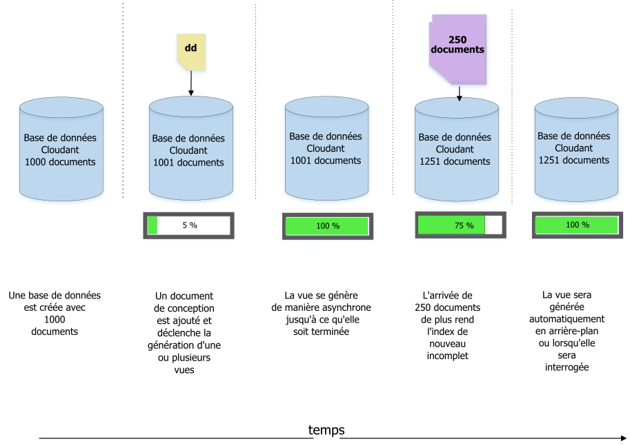
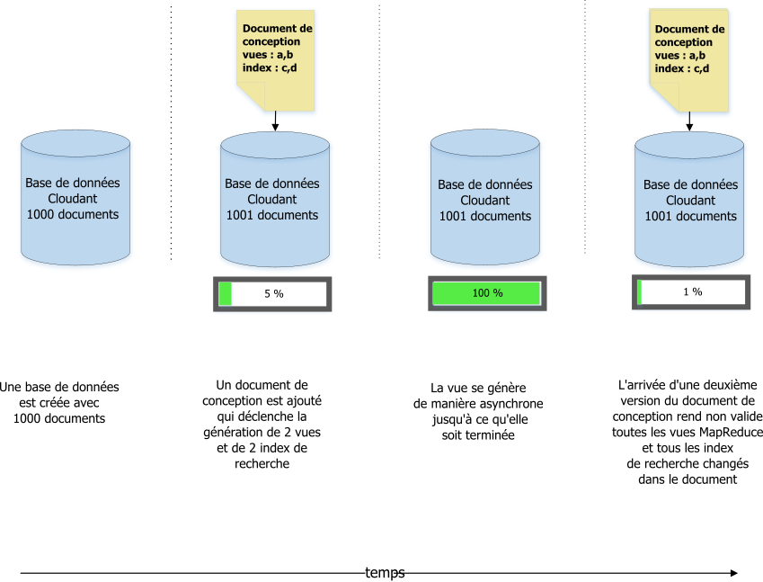
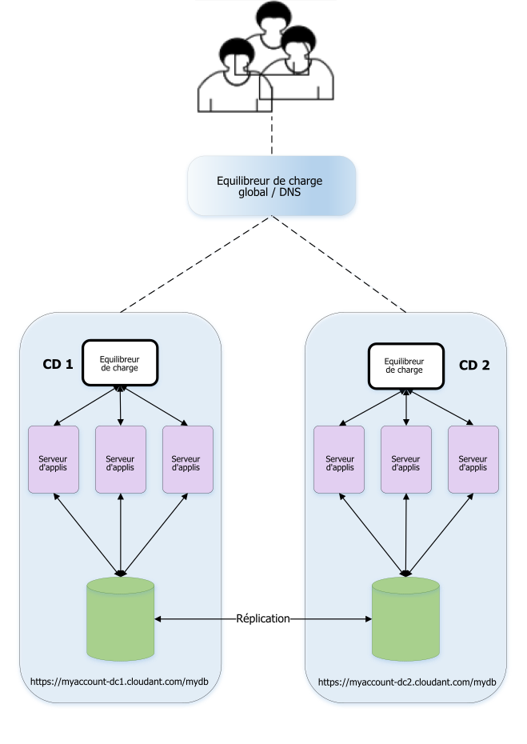

---

copyright:
  years: 2015, 2018
lastupdated: "2017-11-06"

---

{:new_window: target="_blank"}
{:shortdesc: .shortdesc}
{:screen: .screen}
{:codeblock: .codeblock}
{:pre: .pre}

# Gestion des documents de conception

*Article signé par Glynn Bird, responsable des produits développeurs chez IBM Cloudant,
[glynn@cloudant.com ](mailto:glynn@cloudant.com){:new_window}*

Le magasin de données JSON évolutif de {{site.data.keyword.cloudantfull}} possède plusieurs mécanismes d'interrogation, chacun générant des index qui sont créés et conservés séparément dans les données coeur.
L'indexation n'est pas réalisée immédiatement lorsque le document est sauvegardé.
Elle est prévue pour plus tard afin d'offrir un débit d'écriture non-bloquant plus rapide.

-   Les vues MapReduce sont des index dans l'ensemble de données avec des paires clé-valeur stockées dans un arbre B afin d'être plus rapidement extraites par la clé ou la plage de clés
-   Les index de recherche sont construits à l'aide d'Apache Lucene pour permettre la recherche de texte libre, la création de facettes et les requêtes ad hoc complexes

Les [index de recherche](../api/search.html) et les [vues MapReduce](../api/creating_views.html) de {{site.data.keyword.cloudant_short_notm}} sont configurés en ajoutant des documents de conception à une base de données.
Les documents de conception sont des documents JSON qui contiennent des instructions sur la façon dont la vue ou l'index doivent être créés.
Prenons un exemple simple.
Supposons que nous disposons d'une simple collection de documents de données, similaire à l'exemple suivant.

_Exemple d'un simple document de données :_

```json
{
    "_id": "23966717-5A6F-E581-AF79-BB55D6BBB613",
    "_rev": "1-96daf2e7c7c0c277d0a63c49b57919bc",
    "doc_name": "Markdown Reference",
    "body": "Lorem Ipsum",
    "ts": 1422358827
}
```
{:codeblock}

Chaque document de données comporte un nom, un corps de texte et un horodatage.
Nous voulons créer une [vue MapReduce](../api/creating_views.html) pour trier les documents par horodatage.

Pour ce faire, nous pouvons créer une fonction de mappe, similaire à l'exemple suivant.

_Exemple de fonction de mappe renvoyant une zone d'horodatage du document, le cas échéant :_

```javascript
function(doc) {
    if (doc.ts) {
        emit( doc.ts, null);
    }
}
```
{:codeblock}

La fonction émet l'horodatage du document pour que nous puissions l'utiliser comme clé d'index.
Sachant que la valeur de l'index ne nous intéresse pas,
la valeur `null` est émise.
L'objectif est de fournir un index ordonné chronologiquement dans l'ensemble du document.

Nous allons appeler cette vue "`by_ts`" et nous allons la placer dans un document de conception "`fetch`", comme illustré dans l'exemple ci-dessous.

_Exemple de document de conception définissant une vue à l'aide d'une fonction de mappage :_

```json
{
    "_id": "_design/fetch",
    "views": {
      "by_ts": {
        "map": "function(doc) {
          if (doc.ts) {
            emit( doc.ts, null);
          }
        }"
      }
    },
    "language": "javascript"
}
```
{:codeblock}

Le résultat est que notre code de mappage a été converti en une chaîne compatible JSON, puis il a été inclus dans un document de conception.

Une fois le document de conception sauvegardé, {{site.data.keyword.cloudant_short_notm}} déclenche des processus côté serveur pour générer la vue `fetch/by_ts`.
Pour ce faire, il procède à l'itération de chaque document dans la base de données, puis il envoie chacun d'eux vers la fonction de mappage Javascript.
La fonction renvoie alors la paire clé-valeur correspondante.
Au fur et à mesure que l'itération se poursuit, chaque paire clé-valeur est stockée dans un index B-tree.
Lorsque l'index est généré pour la première fois, la réindexation suivante s'applique uniquement aux documents nouveaux et mis à jour.
Les documents supprimés ne sont plus indexés.
Ce processus rapide est appelé *incremental MapReduce*, tel qu'illustré dans le diagramme ci-dessous :



Il convient à ce stade de rappeler les points suivants :

-   La construction d'un index est asynchrone.
    {{site.data.keyword.cloudant_short_notm}} confirme l'enregistrement du document de conception,
    mais si nous voulons vérifier l'avancement de la construction de notre index,
    nous devons interroger le noeud final [`_active_tasks`](../api/active_tasks.html) de {{site.data.keyword.cloudant_short_notm}}.
-   Plus nous avons de données,
    et plus long sera le délai avant que l'index ne soit prêt.
-   Pendant le procédé de génération d'index initial,
    _toutes les requêtes sur cet index seront bloquées_.
-   L'interrogation d'une vue déclenche le "mappage" des documents qui n'ont pas encore été indexés de manière incrémentielle.
    De cette façon, la vue des données est à jour.
    Consultez la discussion suivante sur le paramètre d'expiration ['`stale`'](#stale) pour en savoir plus sur les exceptions à cette règle.

## Vues multiples dans un même document de conception

Si nous définissons plusieurs vues dans un même document de conception,
celles-ci sont générées efficacement et en même temps.
Chaque document est lu une seule fois,
avant de se soumettre à la fonction de mappage.
Le point négatif de cette approche est que la modification d'un document de conception
_invalide toutes les vues MapReduce existantes_ définies dans ce document et ce, même si certaines vues restent inchangées. 

Si les vues MapReduce doivent être modifiées indépendamment les unes des autres,
placez leurs définitions dans des documents de conception séparés. 

>   **Remarque** : Ce comportement ne s'applique pas aux index de recherche Lucene.
    Ces derniers peuvent être modifiés dans le même document de conception
    sans invalider d'autres index qui, eux, n'ont pas été modifiés au sein du même document.



## Gestion des changements dans un document de conception

Imaginons que nous souhaitions un jour changer la conception de notre vue.
Au lieu de retourner le résultat de l'horodatage actuel, nous allons exclusivement nous intéresser au nombre de documents remplissant les critères.
Pour ce faire, la fonction de mappage reste la même,
mais nous allons maintenant utiliser une fonction _reduce_ de "`_count`".
Notre document de conception ressemblera alors à l'exemple ci-dessous.

_Exemple de document de conception utilisant une fonction de réduction :_

```json
{
    "_id": "_design/fetch",
    "_rev": "2-a2324c9e74a76d2a16179c56f5315dba",
    "views": {
        "by_ts": {
            "map": "function(doc) {
                if (doc.ts) {
                  emit( doc.ts, null);
                }
            }
        }",
        "reduce": "_count"
    },
    "language": "javascript"
}
```
{:codeblock}

Lorsque ce document de conception est sauvegardé,
{{site.data.keyword.cloudant_short_notm}} invalide totalement l'ancien index et commence à générer le nouvel index à partir de zéro,
itérant chaque document à son tour.
Comme pour la génération initiale,
le délai dépend du nombre de documents dans la base de données,
et les requêtes entrantes sont bloquées sur cette vue tant que le procédé n'est pas terminé.

Mais il y a un hic...

Si une application accède à cette vue _en temps réel_,
une difficulté peut surgir au niveau du déploiement :

-   La version 1 de notre code,
    qui s'appuie sur le document de conception original,
    risque de ne plus fonctionner, car l'ancienne vue a été invalidée.
-   La version 2 de notre code,
    qui utilise le nouveau document de conception,
    ne peut pas être publiée immédiatement,
    car la nouvelle vue n'est pas encore générée,
    en particulier si la base de données contient un grand nombre de documents.
-   Un problème plus subtil peut également affecter notre code, à savoir que les versions 1 et 2 s'attendent à des résultats différents de cette vue :
    la version 1 s'attend à avoir une liste de documents correspondants,
    tandis que la version 2 s'attend à avoir un nombre de résultats "réduit".

## Coordination des changements dans les documents de conception

Il existe deux façons de traiter ce problème de contrôle des changements.

### Documents de conception avec version 

Une solution consiste à utiliser des noms de documents de conception avec version :

-   Notre code est initialement créé pour utiliser une vue appelée `_design/fetchv1`.
-   Lorsqu'une nouvelle version est publiée,
    nous créons une vue appelée `_design/fetchv2`,
    et nous interrogeons la vue pour vérifier que sa génération démarre.
-   Nous interrogeons `_active_tasks` jusqu'à ce que la génération du nouvel index soit terminée.
-   Nous sommes maintenant prêt à publier le code qui dépend de la seconde vue.
-   Nous pouvons supprimer `_design/fetchv1` lorsque nous sommes sûr de ne plus en avoir besoin.

L'utilisation de documents de conception avec version constitue une manière simple de gérer le contrôle des changements dans vos documents de conception,
tant que vous pensez à supprimer les anciennes versions ultérieurement !

### Documents de conception "Move and Switch" (Progresser et basculer)

Une autre approche, documentée [ici ](http://wiki.apache.org/couchdb/How_to_deploy_view_changes_in_a_live_environment){:new_window}, repose sur le fait que {{site.data.keyword.cloudant_short_notm}} reconnaît lorsque deux documents de conception sont identiques, et ne perd pas de temps ni de ressources inutilement à reconstruire des vues qu'il possède déjà.
En d'autres termes,
si nous prenons notre document de conception `_design/fetch` et que nous créons une réplique exacte `_design/fetch_OLD`, les deux noeuds finaux fonctionnent de manière interchangeable sans déclencher de réindexation.

La procédure de basculement vers la nouvelle vue est la suivante :

1.  Créez une copie du document de conception que vous souhaitez modifier,
    par exemple en ajoutant `_OLD` à son nom :
    `_design/fetch_OLD`.
2.  Placez le nouveau document de conception, ou document "entrant", dans la base de données,
    en lui attribuant le suffixe `_NEW` : `_design/fetch_NEW`.
3.  Interrogez la vue `fetch_NEW`,
    afin de vous assurer que sa génération démarre.
4.  Interrogez le noeud final `_active_tasks` et patientez jusqu'à la fin de la génération d'index.
5.  Placez une copie du nouveau document de conception dans `_design/fetch`.
6.  Supprimez le document de conception `_design/fetch_NEW`.
7.  Supprimez le document de conception `_design/fetch_OLD`.

## Outils conçus pour la procédure "Move and Switch" (Progresser et basculer)

Un script de ligne commande Node.js appelé '`couchmigrate`' permet d'automatiser la procédure "Move and Switch".
Pour l'installer, suivez la procédure ci-dessous.

_Commande permettant d'installer le script `couchmigrate` Node.js :_

```sh
npm install -g couchmigrate
```
{:codeblock}

Pour utiliser le script `couchmigrate`,
définissez tout d'abord l'adresse URL de l'instance CouchDB/{{site.data.keyword.cloudant_short_notm}} en déterminant la variable d'environnement appelée `COUCH_URL`.

_Définition de l'adresse URL de l'instance {{site.data.keyword.cloudant_short_notm}} :_

```sh
export COUCH_URL=http://127.0.0.1:5984
```
{:codeblock}

L'URL peut être de type HTTP ou HTTPS,
et peut inclure les données d'authentification.

_Définition de l'adresse URL de l'instance {{site.data.keyword.cloudant_short_notm}} avec les données d'authentification :_

```sh
export COUCH_URL=https://$ACCOUNT:$PASSWORD@$HOST.cloudant.com
```
{:codeblock}

En admettant que nous disposions d'un document de conception au format JSON,
stocké dans un fichier,
nous pouvons ensuite exécuter la commande de migration.

Dans ce exemple,
`db` indique le nom de la base de données à modifier,
et `dd` désigne le chemin d'accès à notre fichier de document de conception.

_Exécution de la commande `couchmigrate` :_

```sh
couchmigrate --db mydb --dd /path/to/my/dd.json
```
{:pre}

Le script coordonne la procédure "move and switch" (déplacer et basculer) en attendant que la vue soit générée avant le retour.
Si le document de conception entrant est identique à celui d'origine,
le script est retourné presque immédiatement.

Le code source du script est disponible ici :
[https://github.com/glynnbird/couchmigrate ](https://github.com/glynnbird/couchmigrate){:new_window}.

<div id="stale"></div>

## Paramètre '`stale`'

Si un index est terminé,
mais que de nouveaux enregistrements sont ajoutés à la base de données,
la mise à jour de l'index en arrière-plan est planifiée.
C'est le cas de la base de données illustrée dans le diagramme ci-dessous :



Lorsque nous interrogeons la vue, trois choix s'offrent à nous :

-   Le comportement par défaut consiste à vérifier que l'index est à jour,
    et que la base de données contient les documents les plus récents,
    avant que la réponse ne soit renvoyée.
    Lorsque nous interrogeons la vue,
    {{site.data.keyword.cloudant_short_notm}} indexe d'abord les 250 nouveaux documents,
    puis renvoie la réponse.
-   Une deuxième solution consiste à ajouter le paramètre "`stale=ok`" à l'appel API.
    Ce paramètre signifie "renvoie-moi les données qui sont déjà indexées,
    je n'ai pas besoin des dernières mises à jour".
    En d'autres termes, lorsque vous interrogez la vue avec le paramètre "`stale=ok`",
    {{site.data.keyword.cloudant_short_notm}} renvoie immédiatement la réponse,
    sans réindexation supplémentaire.
-   Une troisième solution consiste à ajouter le paramètre "`stale=update_after`" à l'appel API.
    Ce paramètre signifie "renvoie-moi les données qui sont déjà indexées,
    _et_ réindexe ensuite les nouveaux documents".
    En d'autres termes, lorsque vous interrogez la vue avec le paramètre "`stale=update_after`",
    {{site.data.keyword.cloudant_short_notm}} renvoie la réponse immédiatement,
    et planifie une tâche en arrière-plan pour indexer les nouvelles données.

L'ajout du paramètre "`stale=ok`" ou "`stale=update_after`" peut être un bon moyen d'obtenir une réponse rapide de la vue, mais au détriment de données actualisées. 

>   **Remarque** : Le comportement par défaut répartit équitablement la charge entre les noeuds du cluster de {{site.data.keyword.cloudant_short_notm}}.
    Si vous utilisez l'option `stale=ok` ou `stale=update_after`,
    celle-ci peut favoriser un sous-ensemble de noeuds du cluster,
    afin de renvoyer des résultats cohérents depuis l'ensemble de cohérence finale.
    Cela signifie que le paramètre '`stale`' n'est pas adapté à tous les cas d'utilisation.
    Il peut toutefois se révéler utile pour obtenir des réponses rapides sur des ensembles de données en perpétuel changement, si votre application accepte des résultats périmés.
    Si le taux de changement de vos données est faible,
    l'ajout du paramètre `stale=ok`" ou "`stale=update_after`" ne présente aucun avantage,
    et risque même de répartir inégalement la charge sur des clusters plus importants.

Evitez d'utiliser le paramètre `stale=ok` ou `stale=update_after` dans la mesure du possible.
La raison en est que le comportement par défaut fournit les données les plus récentes,
et les distribue au sein du cluster.
S'il est possible d'indiquer à une application client qu'une longue tâche de traitement de données est en cours d'exécution (pendant une mise à jour de données non formatées, par exemple), l'application peut  basculer temporairement vers le paramètre `stale=ok` pendant ces périodes, puis revenir au comportement par défaut par la suite.

>   **Remarque** : L'option `stale` est toujours disponible,
    mais les options les plus utiles `stable` et `update` sont aussi disponibles et doivent être privilégiées.
    Pour plus de détails, voir [Accès à une vue périmée](../api/using_views.html#accessing-a-stale-view).
