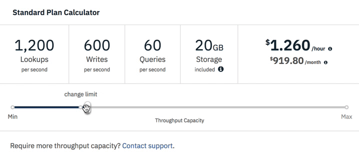

---

copyright:
  years: 2015, 2018
lastupdated: "2018-10-24"

---

{:new_window: target="_blank"}
{:shortdesc: .shortdesc}
{:screen: .screen}
{:codeblock: .codeblock}
{:pre: .pre}
{:tip: .tip}

<!-- Acrolinx: 2018-08-14 -->

# Migration à {{site.data.keyword.cloudant_short_notm}} sur {{site.data.keyword.cloud_notm}}
 
L'offre DaaS de [{{site.data.keyword.cloudantfull}}](https://www.ibm.com/cloud/cloudant) est un magasin de documents JSON qui s'exécute sur des clusters à service partagé. Le service est disponible dans plusieurs régions géographiques avec des coûts prévisibles, une possibilité d'évolution et un accord de niveau de service (SLA).

Ce document décrit comment migrer vers une instance de plan {{site.data.keyword.cloudant_short_notm}} Lite ou Standard sur {{site.data.keyword.cloud_notm}} depuis l'un des plans suivants :

Plan | Description
-----|------------
{{site.data.keyword.cloudant_short_notm}} Enterprise | Clusters dédiés à service exclusif 
{{site.data.keyword.cloudant_short_notm}} Shared | Service partagé existant de {{site.data.keyword.cloudant_short_notm}} avec paiement à l'utilisation. Le plan partagé de `cloudant.com` a été retiré en mars 2018. Le plan {{site.data.keyword.cloudant_short_notm}} Shared a été rayé des nouvelles inscriptions en octobre 2016 et sera retiré au cours du quatrième trimestre 2018.
{{site.data.keyword.cloudant_localfull}} | Installation packagée auto-hébergée de {{site.data.keyword.cloudant_short_notm}}.
Apache CouchDB | Base de données open source auto-hébergée sur laquelle repose {{site.data.keyword.cloudant_short_notm}}.

## Quels sont les avantages des plans {{site.data.keyword.cloudant_short_notm}} Lite et Standard ?

Le plan Standard vous permet de *réserver la capacité de traitement* de votre service de base de données, c'est-à-dire, de spécifier le débit dont votre base de données d'application aura besoin pour gérer la demande. Le plan Standard vous facture également la quantité d'espace de stockage que vous utilisez. La capacité est mesurée à l'aide des métriques suivantes :

Métrique | Description
-------|------------
Consultations par seconde |  Vitesse à laquelle des extractions de documents simples sont effectuées, par exemple, l'extraction d'un document au moyen de son `_id`.
Ecritures par seconde  | Vitesse à laquelle les données sont écrites dans la base de données. Les appels API en relation avec la création, la mise à jour ou la suppression de documents sont considérés comme des 'écritures'.
Requêtes par seconde | Vitesse à laquelle la base de données est interrogée, généralement en accédant au point final `_find` ou en utilisant des index secondaires MapReduce.
Stockage | Quantité d'espace disque occupé par vos données JSON, vos annexes et vos index secondaires.

A titre d'exemple, le plan Lite offre 20 consultations par seconde, 10 écritures par seconde, 5 requêtes par seconde et 1 Go de stockage gratuit. Ce plan est idéal pour tester le produit et durant le développement du produit. Lorsque votre application passe en production, vous devez passer au plan Standard. Le forfait de ~76,65 USD/mois, qui est le forfait minimum du plan Standard, offre 100 consultations par seconde, 50 écritures par seconde, 5 requêtes par seconde et 20 Go de stockage (tout stockage supplémentaire est facturé par Go). 

Le curseur qui se trouve dans le tableau de bord de {{site.data.keyword.cloudant_short_notm}} vous permet de réserver à tout moment une capacité plus ou moins grande pour votre service {{site.data.keyword.cloudant_short_notm}} :

La capacité de traitement que vous pouvez modifier est limitée à un maximum de 10 unités par changement (notez le point 'limite de changement' sur le curseur) avec un maximum d'un changement par heure. Les changements à la baisse sont illimités dans leur ampleur, mais toujours soumis à la limite de temps.
{: tip}

Vous êtes facturé sur la capacité la plus élevée qui est sélectionnée dans une fenêtre horaire donnée. Le débit de votre base de données peut être augmenté pour répondre aux demandes saisonnières, puis diminué à nouveau durant les périodes de calme. Votre facture mensuelle est prévisible à tout moment, les mises à niveau sont automatiques et votre SLA est de [99.95%](http://www-03.ibm.com/software/sla/sladb.nsf/sla/bm-6627-03).

Si vous avez dépassé votre quota de consultations, d'écritures et de requêtes à une seconde donnée, le cluster {{site.data.keyword.cloudant_short_notm}} renvoie une réponse `HTTP 429`. Votre application peut tenter de renouveler la requête plus tard (nos bibliothèques officielles offrent l'option de renouveler ce type de requêtes avec un temps de réponse exponentiel). 

## Quel est mon type de plan {{site.data.keyword.cloudant_short_notm}} ?

Si vous utilisez {{site.data.keyword.cloudant_short_notm}}, le tableau de bord {{site.data.keyword.cloud_notm}} affiche toutes vos instances {{site.data.keyword.cloudant_short_notm}} avec une colonne Plan. Les plans Lite, Standard et Dedicated Hardware sont décrits en détail. Si une instance {{site.data.keyword.cloudant_short_notm}} affiche le plan "Shared Dedicated", cela signifie qu'elle appartient à un environnement {{site.data.keyword.cloudant_short_notm}} dédié et non à un plan public partagé. Si une instance {{site.data.keyword.cloudant_short_notm}} affiche le plan "Shared" avec un nom de plan partagé ou sans nom de plan dans cette colonne, cela signifie qu'elle utilise le plan Shared déprécié. Dans l'exemple suivant, les instances 'Cloudant NoSQL DB-ix' et 'Cloudant_NewConsole' utilisent le plan Shared déprécié.  

Vous pouvez également examiner une instance spécifique et consulter l'onglet Plan. Les instances {{site.data.keyword.cloudant_short_notm}} du plan Shared déprécié n'ont pas de plan mis en évidence. Les instances du plan Standard {{site.data.keyword.cloudant_short_notm}} ressemblent à cet exemple : 

Vous pouvez également ouvrir le tableau de bord {{site.data.keyword.cloudant_short_notm}} et cliquer sur l'onglet **Compte**. Le plan Lite ressemble à l'exemple suivant :

Si vous utilisez un compte `cloudant.com` existant, vous pouvez vous connecter à votre tableau de bord {{site.data.keyword.cloudant_short_notm}} et accéder à l'onglet Compte. Un plan `cloudant.com` partagé existant possède un onglet Utilisation contenant des graphiques et des estimations de facturation pour le mois en cours, comme dans l'exemple suivant :

Un utilisateur `cloudant.com` Enterprise sur un cluster dédié ne voit pas l'onglet Utilisation sur son onglet Compte. L'affichage ressemble à l'exemple suivant :

Si votre onglet Compte indique déjà que vous appartenez au plan Standard, vous n'avez pas besoin de lire ce qui suit. Vous avez déjà opté pour un service {{site.data.keyword.cloudant_short_notm}} payant reposant sur un accord de niveau de service. Aucune action supplémentaire n'est requise.

## Migration du plan {{site.data.keyword.cloudant_short_notm}} Lite au plan {{site.data.keyword.cloudant_short_notm}} Standard

Pour migrer du plan Lite gratuit au plan Standard, procédez comme suit : 

1.  Accédez au tableau de bord {{site.data.keyword.cloud_notm}}.
2.  Sélectionnez l'instance {{site.data.keyword.cloudant_short_notm}} que vous souhaitez faire migrer. 
3.  Sélectionnez l'onglet **Plan** sur la zone de navigation de gauche. 
4.  Dans la liste des plans de tarification, sélectionnez la case **Standard**.

5.  Cliquez sur **Mettre à jour** au bas de la page.
Toutes vos données existantes sont conservées.

Ajustez votre capacité à l'aide du curseur Capacité de débit pour augmenter ou diminuer la capacité en fonction de vos besoins.
{: tip} 
 
Ça y est, vous êtes enfin prêt !

## Migration de tout autre plan au plan {{site.data.keyword.cloudant_short_notm}} Lite ou Standard

La migration des plans Shared ou Enterprise aux plans {{site.data.keyword.cloudant_short_notm}} Lite ou Standard inclut les tâches décrites ci-dessous. 

Vous ne pouvez pas directement changer une instance de plan Shared à une instance de plan Lite ou Standard. Pour la migration, vous devez créer une nouvelle instance de plan Lite ou Standard et répliquer les données sur l'instance de plan Shared.
{: tip}

### Etape 1 : Inscrivez-vous à {{site.data.keyword.cloud_notm}}

Si vous n'êtes pas déjà inscrit, [inscrivez-vous pour obtenir un compte {{site.data.keyword.cloud_notm}}](https://www.ibm.com/cloud/). 

### Etape 2 : Créez une instance {{site.data.keyword.cloudant_short_notm}} 

Après vous être connecté à votre compte {{site.data.keyword.cloud_notm}}, ajoutez un service {{site.data.keyword.cloudant_short_notm}}. Cliquez sur le bouton `Créer une ressource` sur le tableau de bord, puis cliquez sur `Bases de données` et `Cloudant`. Pour plus d'informations, voir [Comment créer une instance {{site.data.keyword.cloudant_short_notm}} sur {{site.data.keyword.cloud_notm}}](../tutorials/create_service.html#creating-an-ibm-cloudant-instance-on-ibm-cloud). 

### Etape 3 : Déterminez si votre application est prête pour {{site.data.keyword.cloudant_short_notm}}

Si vous venez d'un service {{site.data.keyword.cloudant_short_notm}} Enterprise ou d'un plan {{site.data.keyword.cloudant_short_notm}} Shared, consultez l'utilisation de {{site.data.keyword.cloudant_short_notm}} faite par votre application pour vous assurer qu'elle est prête à gérer les limites de capacité du plan Standard. Pour plus d'informations, voir [Comment fonctionne l'API {{site.data.keyword.cloudant_short_notm}}](../offerings/bluemix.html#provisioned-throughput-capacity). Plus important encore, vous devez vous assurer que votre application peut gérer une réponse HTTP `429: too many requests` si vous avez dépassé la capacité de débit mise à disposition. 

Il est acceptable de réessayer des demandes qui obtiennent une réponse `429` pour des pics de trafic occasionnels qui dépassent la capacité de votre plan. Cependant, si le trafic de votre application génère régulièrement des réponses `429`, il y a de fortes chances que vous ayez besoin d'une mise à niveau vers un plan supérieur.

De plus, il convient de noter que la taille maximale d'un document individuel est de 1 Mo sur {{site.data.keyword.cloudant_short_notm}}, et que vous recevrez un message `413: request entity too large` en cas de dépassement de la limite. Pour plus d'informations, voir [Tailles limites des demandes et des documents](../offerings/bluemix.html#request-and-document-size-limits). 

### Etape 4 : Faites migrer les données de l'ancien service au nouveau service 

Configurez des réplications continues de votre service existant vers votre compte {{site.data.keyword.cloudant_short_notm}}. Pour plus d'informations, voir le [guide de réplication](../guides/replication_guide.html#replication) et la [documentation des API](../api/replication.html#replication) pour savoir comment configurer et surveiller les tâches de réplication.

Vous pouvez également vous servir de l'outil [`couchreplicate`](https://www.npmjs.com/package/couchreplicate), qui est un utilitaire de ligne de commande qui vous aide à coordonner le transfert des données d'un compte {{site.data.keyword.cloudant_short_notm}} à un autre. Cet outil met en place plusieurs travaux de réplication entre les comptes source et cible, et limite ainsi le nombre de travaux de réplication exécutés en même temps. Si vous devez migrer des centaines de bases de données, `couchreplicate` peut vous aider à coordonner les travaux de réplication.

Vérifiez que toutes vos données sont répliquées vers le nouveau service et que les index sont créés.

### Etape 5 : Testez

Effectuez des tests de charge et de fonctionnement sur votre application pour vous assurer qu'il n'y a aucun problème avant de procéder à la migration vers l'environnement de production.

### Etape 6 : Prêt à passer à la nouvelle instance?

Lorsque vous êtes prêt à passer à la nouvelle instance, mettez à jour votre application avec l'URL et les informations d'identification du nouveau compte généré automatiquement pour l'instance {{site.data.keyword.cloudant_short_notm}}. Pour plus d'informations, consultez le [tutoriel de mise à disposition](../tutorials/create_service.html#creating-a-cloudant-instance-on-bluemix) et découvrez comment obtenir les informations d'identification du service pour une instance {{site.data.keyword.cloudant_short_notm}}.

### Etape 7 : Désactivez l'ancien service

 Une fois que votre application a été entièrement migrée vers l'instance {{site.data.keyword.cloudant_short_notm}} Lite ou Standard, vous pouvez supprimer l'ancienne instance du plan {{site.data.keyword.cloudant_short_notm}} Shared pour votre console {{site.data.keyword.cloud_notm}} pour vous assurer de ne plus payer le service.

## FAQ - Foire aux questions

Les questions fréquentes sont publiées par l'organisation {{site.data.keyword.cloudant_short_notm}} pour aider les clients {{site.data.keyword.IBM_notm}} lors de la migration vers une instance de plan {{site.data.keyword.cloudant_short_notm}} Lite ou Standard sur {{site.data.keyword.cloud_notm}}.

## Puis-je sauvegarder mes données avant de faire quoi que ce soit ? 

{{site.data.keyword.cloudant_short_notm}} recommande d'utiliser l'utilitaire [couchbackup](../guides/backup-cookbook.html#cloudant-nosql-db-backup-and-recovery) pour exporter les données sur disque. [{{site.data.keyword.cloud_notm}} Object Storage](https://www.ibm.com/cloud/object-storage) est une solution économique et évolutive pour stocker les fichiers exportés. 

## Puis-je conserver mon domaine `username.cloudant.com` et le rediriger vers le nouveau service sur {{site.data.keyword.cloudant_short_notm}} ?

Non, vous ne pouvez pas conserver votre domaine. Vous devez prévoir de mettre à jour vos applications pour utiliser l'URL et les données d'identification du nouveau compte qui sont générées pour les instances {{site.data.keyword.cloudant_short_notm}}.

## Qui dois-je contacter en cas de questions ?

Si vous avez des questions sur la migration, contactez le [support {{site.data.keyword.cloudant_short_notm}}](mailto:support@cloudant.com) ou ouvrez un ticket de demande de service sur le tableau de bord {{site.data.keyword.cloudant_short_notm}}. L'équipe de support de {{site.data.keyword.cloudant_short_notm}} sera heureuse de vous fournir des renseignements supplémentaires.
