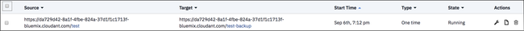
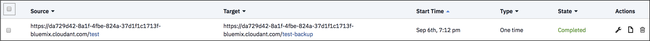
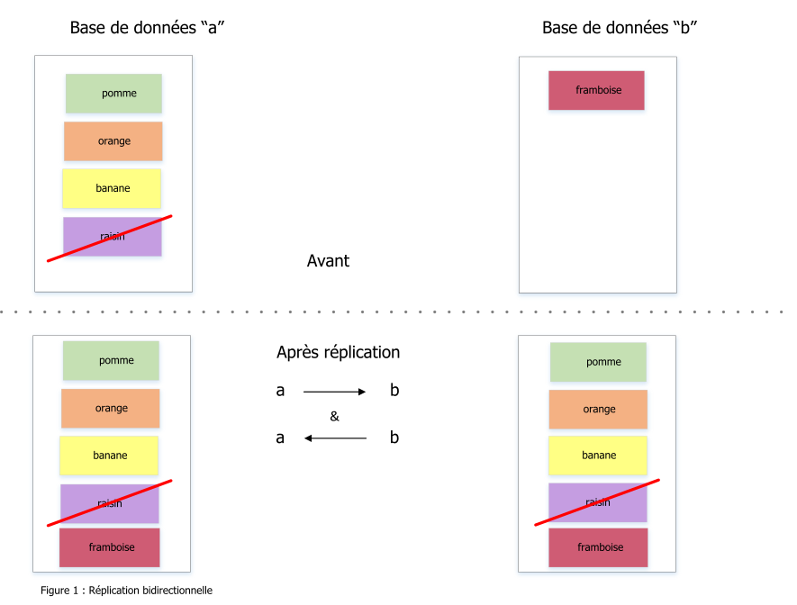

---

copyright:
  years: 2015, 2018
lastupdated: "2018-06-07"

---

{:new_window: target="_blank"}
{:shortdesc: .shortdesc}
{:screen: .screen}
{:codeblock: .codeblock}
{:pre: .pre}

<!-- Acrolinx: 2017-04-20 -->

# Réplication

Les données peuvent être copiées entre différentes bases de données dans le même compte {{site.data.keyword.cloudantfull}} ainsi
que dans des comptes et des centres de données différents.
{:shortdesc}

Les données peuvent même être répliquées entre un compte {{site.data.keyword.cloudant_short_notm}} et un appareil mobile en utilisant [{{site.data.keyword.cloudant_short_notm}} Sync ](https://cloudant.com/product/cloudant-features/sync/){:new_window}
ou [PouchDB ](http://pouchdb.com/){:new_window}.
La réplication peut s'exécuter dans un sens ou dans les deux sens,
en tant qu'opération unique ou opération continue,
et peut être optimisée en utilisant des paramètres.

Le protocole de réplication de {{site.data.keyword.cloudant_short_notm}} est compatible avec plusieurs autres bases de données et bibliothèques,
ce qui fait qu'il est totalement adapté à IoT (Internet of Things) et aux applications mobiles.

Ce guide présente les fonctions de réplication de {{site.data.keyword.cloudant_short_notm}},
décrit les cas d'utilisation communs et indique comment effectuer
la réplication de votre application.

## Qu'est-ce que la réplication ?

{{site.data.keyword.cloudant_short_notm}} est un magasin de données JSON réparti incluant une API HTTP.
{{site.data.keyword.cloudant_short_notm}} peut être exécuté en tant que service sur plusieurs clouds, ou dans votre armoire de serveurs.
Les documents sont stockés dans les base de données et peuvent atteindre n'importe quelle taille car {{site.data.keyword.cloudant_short_notm}} fragmente ses données dans un grand nombre de noeuds.
La réplication est le processus de copie de données entre une base de données source et une base de données cible.
Il n'est pas nécessaire que ces bases de données se trouvent sur le même compte {{site.data.keyword.cloudant_short_notm}},
ou même dans le même centre de données.


La réplication est terminée lorsque la dernière version de chaque document de la source est transférée vers la base de données cible.
Les transferts incluent les nouveaux documents,
les mises à jour apportées aux documents existants
et les suppressions.
Seule la version la plus récente d'un document est conservée après la réplication et
non les versions plus anciennes.

La base de données source n'est pas modifiée par la réplication,
à l'exception des données de point de contrôle qui y sont placées afin que des réplications partielles puissent reprendre à partir du dernier emplacement connu.
Toutes les données pré-existantes dans la base de données cible sont conservées.

<div id="how-do-i-initiate-replication-via-the-dashboard-"></div>

## Comment démarrer la réplication en utilisant le tableau de bord ?

Le tableau de bord {{site.data.keyword.cloudant_short_notm}} inclut une interface permettant de déclencher la réplication.
Ouvrez l'onglet Replication du tableau de bord {{site.data.keyword.cloudant_short_notm}} puis cliquez sur le bouton `New Replication`.
Renseignez le formulaire suivant :


A l'aide du formulaire,
définissez les bases de données source et cible
puis cliquez sur "`Replicate`".



Le statut de chaque tâche de réplication s'affiche dans la section "`All Replications`" du tableau de bord.
Chaque travail passe de l'état "`Triggered`" à l'état "`Complete`" lors de sa progression.



<div id="how-do-i-run-replication-across-different-cloudant-accounts-"></div>

## Comment exécuter la réplication dans différents comptes {{site.data.keyword.cloudant_short_notm}} ?

La source et la cible d'une réplication sont les URL des bases de données {{site.data.keyword.cloudant_short_notm}},
comme cela est présenté dans l'exemple suivant.

_Définition d'URL source et cible pour la réplication - Exemple :_

```json
{
    "source": "https://myfirstaccount.cloudant.com/a",
    "target": "https://mysecondaccount.cloudant.com/b"
}
```
{:codeblock}

Il n'est pas nécessaire que l'élément source et l'élément cible se trouvent sur le même compte.
De plus, il n'est pas non plus nécessaire que les noms des bases de données source et cible soient identiques.
Vous devez être autorisé à accéder à la source et à la cible et
à écrire dans la cible.

<div id="do-i-run-replication-on-the-source-or-the-destination-"></div>

## La réplication s'exécute-t-elle sur la source ou la cible ?

La réplication peut être démarrée sur l'élément source ou cible.
Autrement dit, vous pouvez décider si le compte A transmet des données au compte B
ou si le compte B extrait des données du compte A.
Dans certains cas,
il peut ne pas être possible d'exécuter la réplication,
par exemple lorsqu'un des comptes se trouve derrière un pare-feu.
La réplication s'effectue via HTTP ou HTTPS et il est donc nécessaire d'ouvrir des ports non standard.
Il vous revient de choisir quel appareil démarre la réplication.

<div id="how-do-i-initiate-replication-via-the-cloudant-api-"></div>

## Comment démarrer la réplication en utilisant l'API {{site.data.keyword.cloudant_short_notm}} ?

Chaque compte {{site.data.keyword.cloudant_short_notm}} a une base de données spéciale appelée `_replicator`,
dans laquelle les travaux de réplication peuvent être insérés.
Ajoutez un document dans la base de données `_replicator` pour démarrer la réplication.
Le document décrit la réplication souhaitée et
contient les zones suivantes :

Zone           | Objectif
----------------|--------
`_id`           | Le fait de renseigner une zone `_id` est facultatif mais cela peut être utile pour l'identification des tâches de réplication. {{site.data.keyword.cloudant_short_notm}} génère une valeur pour vous si vous n'en indiquez pas.
`source`        | URL de la base de données {{site.data.keyword.cloudant_short_notm}} source, incluant les données d'identification de connexion.
`target`        | URL de la base de données {{site.data.keyword.cloudant_short_notm}} cible, incluant les données d'identification de connexion.
`create_target` | (Facultatif) Déterminez s'il est nécessaire de créer la base de données cible si elle n'existe pas encore.

_Utilisation de HTTP pour démarrer un travail de réplication - Exemple :_

```http
POST /_replicator HTTP/1.1
Content-Type: application/json
Host: $ACCOUNT.cloudant.com
Authorization: ...
```
{:codeblock}

_Utilisation de la ligne de commande pour démarrer un travail de réplication - Exemple :_

```sh
curl -X POST \
    -H 'Content-type: application/json' \
    'https://$ACCOUNT.cloudant.com/_replicator' \
    -d '@replication.json'
```
{:codeblock}

_Document JSON exemple décrivant la réplication souhaitée :_

```json
{
    "_id": "weekly_backup",
    "source": "https://$ACCOUNT:$PASSWORD@$ACCOUNT1.cloudant.com/source",
    "target": "https://$ACCOUNT:$PASSWORD@$ACCOUNT2.cloudant.com/destination",
    "create_target": true
}
```
{:codeblock}

## Comment la réplication affecte-t-elle la liste des modifications ?

Vous pouvez obtenir une liste des modifications apportées à un document en utilisant
le noeud final [`_changes`](../api/database.html#get-changes).
Toutefois,
le fait que les bases de données {{site.data.keyword.cloudant_short_notm}} soient réparties
implique que la réponse fournie par le flux `_changes`
ne peut pas être une simple liste des modifications survenues après une date et heure spécifiques.

La section [CAP Theorem](cap_theorem.html) met en évidence que
{{site.data.keyword.cloudant_short_notm}} utilise un modèle de 'cohérence finale'.
Ce modèle implique que si vous avez demandé en même temps deux différentes répliques d'une base de données pour un
document, vous pouvez obtenir des résultats différents si la réplication d'une des copies de base de données
n'est toujours pas terminée.
_Pour finir_,
les copies de base de données terminent leur réplication,
afin que toutes les modifications apportées à un document soient présentes dans chaque copie.

Ce modèle de 'cohérence finale' a deux caractéristiques affectant une liste de modifications :

1.  Une modification affectant un document a certainement lieu à différents moments dans différentes copies de la base de données.
2.  L'ordre dans lequel les modifications affectent les documents peut différer entre les différentes copies de la base de données,
    selon l'emplacement et le moment de la réplication.

Conséquence de la première caractéristique :
il est inutile de demander une liste de modifications
après un moment défini.
Cela est dû au fait que la liste de modifications peut être fournie par une autre copie de base de données,
ce qui génère des mises à jour de document à des moments différents.
Toutefois,
il _est_ important de demander une liste de modifications suite à une modification spécifique,
définie à l'aide d'un identificateur de séquence.

Conséquence supplémentaire de la première caractéristique : il
peut être nécessaire de 'consulter' les modifications précédentes afin de valider la liste des modifications.
Autrement dit,
pour obtenir une liste des modifications,
vous commencez à partir de la modification la plus récente validée par les copies de base de données.
Le point de concordance entre les copies de base de données est identifié dans
{{site.data.keyword.cloudant_short_notm}} en utilisant le mécanisme de [point de contrôle](#checkpoints) qui
permet la synchronisation de la réplication entre les copies de base de données.

Pour finir, conséquence
de la deuxième caractéristique : les modifications individuelles apparaissant dans la
liste des modifications peuvent être présentées dans un ordre différent
dans les demandes suivantes auxquelles une réponse est apportée par une autre copie de base de données.
Autrement dit,
une liste initiale de modifications peut signaler les modifications de rapport `A`,
`B` et
`C` dans cet ordre.
Mais une liste suivante de modifications peut signaler les modifications `C`,
`A`
et `B` dans cet ordre.
Toutes les modifications sont répertoriées,
mais dans un ordre différent.
Cette différence est due au fait que l'ordre des modifications reçues lors de la réplication
peut être différent dans deux copies de la base de données.

<div id="what-this-means-for-the-list-of-changes"></div>

### A quoi correspond la 'cohérence finale' pour la liste de modifications ?

Lorsque vous demandez une liste de modifications,
la réponse obtenue peut varier en fonction de la copie de base de données fournissant la liste.

Si vous utilisez l'option `since` pour obtenir une liste de modifications après un identificateur de séquence de mise à jour spécifique,
vous obtenez toujours la liste des modifications après cette mise à jour _et_ il est également possible que vous receviez des modifications survenues avant cette mise à jour.
Cela est dû au fait que la copie de base de données qui répond à la demande de liste doit s'assurer qu'elle
répertorie les modifications,
en cohérence avec toutes les répliques.
Pour atteindre cette cohérence,
la copie de base de données peut se voir dans l'obligation de démarrer la liste des modifications à partir
du point de concordance de toutes les copies.
Ce dernier est déterminé via l'utilisation de points de contrôle.

C'est pourquoi,
une application qui utilise le flux `_changes` doit
être ['idempotent' ](http://www.eaipatterns.com/IdempotentReceiver.html){:new_window}.
L'idempotence implique que l'application doit pouvoir recevoir en toute sécurité les mêmes données plusieurs fois,
même si l'ordre est différent pour les demandes répétées.

## Points de contrôle

En interne,
le processus de réplication écrit son état dans les documents de "point de contrôle" stockés
dans les bases de données source et cible.
Les points de contrôle permettent de reprendre l'exécution d'une tâche de réplication là où elle en était restée,
sans qu'il soit nécessaire de revenir au début.
Pour empêcher la création de point de contrôle, il suffit d'indiquer l'option
[`"use_checkpoints": false`](../api/replication.html#checkpoints) lorsque vous demandez la réplication.
Il est utile d'activer cette fonction si votre réplication doit reprendre à partir de son dernier emplacement connu.

## Droits d'accès

Pour pouvoir insérer un document dans la base de données `_replicator`, l'accès admin est requis.
Les droits admin complets ne sont pas requis pour les données d'identification fournies dans les paramètres source et cible.
Il suffit que les données d'identification permettent d'effectuer les actions suivantes :

-   Ecrire des documents à l'extrémité cible.
-   Ecrire des documents de points de contrôle aux deux extrémités.

{{site.data.keyword.cloudant_short_notm}} dispose d'un droit utilisateur `_replicator` spécial.
Ce droit permet la création de documents de point de contrôle mais ne
permet pas la création de documents ordinaires dans une base de données.
En général,
vous [créez des clés d'API](../api/authorization.html#creating-api-keys) ayant :

-   un accès `_reader` et `_replicator` au niveau de la source.
-   un accès `_reader` et `_writer` au niveau de la cible.

Les clés d'API peuvent être créées et configurées dans le tableau de bord {{site.data.keyword.cloudant_short_notm}},
pour chaque base de données.


Il est également possible de les créer [à l'aide d'un programme](../api/authorization.html#creating-api-keys) en utilisant l'API {{site.data.keyword.cloudant_short_notm}}.

## Réplication bidirectionnelle

Les données peuvent être copiées dans les deux sens lors d'un processus appelé réplication bidirectionnelle ou synchronisation.
Vous activez cette synchronisation en configurant deux processus de réplication distincts,
l'un d'entre eux transférant les données de A à B et
l'autre de B à A.
Les deux processus de réplication fonctionnent indépendamment,
avec les données transférées en toute transparence dans les deux sens.



## Réplication continue

Jusqu'à présent,
nous avons présenté uniquement la réplication ponctuelle,
qui se termine lorsque toutes les données source sont placées dans la base de données cible.
Avec la réplication continue,
les données transitent de manière continue.
Toutes les modifications ultérieures apportées à la base de données source sont transmises à la base de données cible en temps réel.

Pour déclencher la réplication continue, il suffit de cliquer sur la case à cocher
"`Make this replication continuous`" lorsque vous définissez une tâche de réplication dans le tableau de bord {{site.data.keyword.cloudant_short_notm}},
ou en définissant l'indicateur ["`continuous`"](../api/replication.html#checkpoints) dans l'API {{site.data.keyword.cloudant_short_notm}}.

La réplication bidirectionnelle peut devenir continue dans un sens ou les deux,
en définissant l'indicateur "`continuous`".

_Utilisation de HTTP pour démarrer une réplication continue - Exemple :_

```http
POST /_replicator HTTP/1.1
Content-Type: application/json
Host: $ACCOUNT.cloudant.com
Authorization: ...
```
{:codeblock}

_Utilisation de la ligne de commande pour démarrer une réplication continue - Exemple :_

```sh
curl -X POST \
    -H "Content-type: application/json" \
    https://$ACCOUNT.cloudant.com/_replicator \
    -d @continuous-replication.json
```
{:codeblock}

_Exemple de document JSON définissant une réplication continue :_

```json
{
    "_id": "weekly_continuous_backup",
    "source": "https://$ACCOUNT:$PASSWORD@$ACCOUNT1.cloudant.com/source",
    "target": "https://$ACCOUNT:$PASSWORD@$ACCOUNT2.cloudant.com/destination",
    "continuous": true
}
```
{:codeblock}

## Surveillance de la réplication

Vous pouvez vérifier le statut de la base de données `_replicator` de {{site.data.keyword.cloudant_short_notm}} à tout moment,
en utilisant le tableau de bord ou l'API.

Si la réplication échoue,
par exemple lorsque les données d'authentification ne sont pas valides,
l'état d'erreur est enregistré dans le document `_replicator`.
De plus,
Le noeud final `/_active_tasks` du compte {{site.data.keyword.cloudant_short_notm}} peut être utilisé afin de voir la progression de la réplication.
Des détails supplémentaires sont disponibles [ici](../api/active_tasks.html).

_Utilisation de HTTP pour surveiller un processus de réplication - Exemple :_

```http
GET /_replicator/weekly_backup HTTP/1.1
HOST: $ACCOUNT.cloudant.com
Authorization: ...
```
{:codeblock}

_Utilisation de la ligne de commande pour surveiller un processus de réplication - Exemple :_

```sh
curl 'https://$ACCOUNT.cloudant.com/_replicator/weekly_backup'
```
{:codeblock}

_Réponse suite à la demande du statut d'une réplication - Exemple :_

```json
{
    "_id": "weekly_backup",
    "_rev": "22-c57c18f7e761f1a76fa977caa03cd098",
    "source": "https://u:p@myaccount.cloudant.com/a",
    "create_target": false,
    "target": "https://u:p@myaccount.cloudant.com/b",
    "continuous": true,
    "_replication_state": "triggered",
    "_replication_state_time": "2014-12-01T15:19:01+00:00",
    "_replication_id": "4514b08cb4c2ded7da9ab04a87182ceb"
}
```
{:codeblock}

## Annulation de la réplication

Pour arrêter un travail de réplication en cours,
supprimez le document de réplication dans la base de données `_replicator`,
en utilisant le tableau de bord ou l'API.

_Utilisation de HTTP pour annuler une réplication - Exemple :_

```http
DELETE /_replicator/weekly_backup?rev=22-c57c18f7e761f1a76fa977caa03cd098 HTTP/1.1
Host: $ACCOUNT.cloudant.com
Authorization:
```
{:codeblock}

_Utilisation de la ligne de commande pour annuler une réplication - Exemple :_

```sh
curl -X DELETE 'https://$ACCOUNT.cloudant.com/_replicator/weekly_backup?rev=22-c57c18f7e761f1a76fa977caa03cd098'
```
{:codeblock}

## Autres cas d'utilisation de réplication

La réplication ne concerne pas uniquement le transfert de données de {{site.data.keyword.cloudant_short_notm}} vers {{site.data.keyword.cloudant_short_notm}}.
Le protocole de réplication de {{site.data.keyword.cloudant_short_notm}} est compatible avec d'autres bases de données et bibliothèques pour différentes applications du monde réel.

### Apache CouchDB

[Apache CouchDB ](http://couchdb.apache.org/){:new_window} est une base de données à source ouverte
pouvant communiquer avec {{site.data.keyword.cloudant_short_notm}},
et nécessitant une configuration minimale.
Les applications incluent les fonctions suivantes :

-   Sauvegarde : Répliquez vos données à partir de {{site.data.keyword.cloudant_short_notm}} vers vos propres bases de données CouchDB
    et effectuez la nuit des instantanés de vos données à des fins d'archivage.
    Envoyez vos données à un service de sauvegarde, tel
    [Amazon Glacier ](https://aws.amazon.com/glacier/){:new_window}.
-   Collecte de données locales en priorité : Placez tout d'abord vos données sur la version locale d'Apache CouchDB,
    puis répliquez-les dans {{site.data.keyword.cloudant_short_notm}} pour un stockage à long terme, l'agrégation
    et l'analyse.

### PouchDB

[PouchDB ](http://pouchdb.com/){:new_window} est une base de données
sur navigateur à source ouverte qui permet la réplication bidirectionnelle des données entre le navigateur et {{site.data.keyword.cloudant_short_notm}}.
Le stockage des données dans un navigateur Web au niveau client permet aux applications Web de fonctionner,
même sans connexion Internet.
PouchDB peut synchroniser les données modifiées depuis ou vers {{site.data.keyword.cloudant_short_notm}} lorsqu'une connexion Internet est disponible.
La configuration de la réplication côté client nécessite quelques lignes de JavaScript.

_Code JavaScript utilisant PouchDB pour activer la réplication - Exemple :_

```javascript
var db = new PouchDB("myfirstdatabase");
var URL = "https://u:p@username.cloudant.com/my_database");
db.sync(URL, { live: true });
```
{:codeblock}

### CloudantSync

[CloudantSync ](https://cloudant.com/cloudant-sync-resources/){:new_window} est un ensemble de bibliothèques
pour iOS et Android permettant aux données d'être stockées localement sur un appareil mobile
et synchronisées avec {{site.data.keyword.cloudant_short_notm}} lorsque la connectivité mobile le permet.
Comme pour [PouchDB](#pouchdb),
la configuration de la réplication nécessite quelques lignes de code.

_Code JavaScript utilisant CloudantSync pour activer la réplication - Exemple :_

```javascript
URI uri = new URI("https://u:p@username.cloudant.com/my_database");
Datastore ds = manager.openDatastore("my_datastore");
// Replicate from the local to remote database
Replicator replicator = ReplicatorFactory.oneway(ds, uri);
// Fire-and-forget (there are easy ways to monitor the state too)
replicator.start();
```
{:codeblock}

CloudantSync est largement utilisé dans les applications mobiles,
(jeux iPhone et Android, par exemple)
où l'état de l'application est conservé dans {{site.data.keyword.cloudant_short_notm}} par réplication,
mais les données sont également disponibles sur l'appareil pour une utilisation hors ligne.

## Réplication filtrée

Il est utile de pouvoir retirer certaines données pendant le processus de réplication,
lorsque vous répliquez une base de données dans une autre.
En voici quelques exemples :

-   Suppression de toutes les traces des documents supprimés,
    ce qui fait que la base de données cible est plus petite que la base de données source.
-   Répartition des données dans des blocs de plus petite taille,
    comme le stockage des données concernant le Royaume-Uni dans une base de données et le stockage des données concernant les Etats-Unis d'Amérique dans une autre.

<div id="replication-filter-function"></div>

### Fonctions de filtrage de réplication

La réplication filtrée de {{site.data.keyword.cloudant_short_notm}} permet la définition d'une fonction JavaScript utilisant la valeur de retour
pour déterminer si chaque document d'une base de données doit être filtré ou non.
Les [fonctions de filtrage](../api/design_documents.html#filter-functions) sont stockées
dans les [documents de conception](../api/design_documents.html).

L'exemple suivant est une fonction de filtrage qui permet uniquement la réplication des documents non filtrés.

_Fonction de filtrage pour la réplication des documents non supprimés - Exemple :_

```javascript
function(doc, req) {
    if (doc._deleted) {
        return false;
    }
    return true;
}
```
{:codeblock}

Lorsqu'un travail de réplication commence,
un nom de fonction de filtrage est indiqué, combinant le document de conception dans lequel il est stocké
et le nom de la fonction de filtrage.
Vous pouvez également indiquer une valeur `query_params`.
Cette valeur est un objet qui contient les propriétés transmises à la
fonction de filtrage dans la zone `query` de son deuxième argument (`req`).

_Utilisation de HTTP pour démarrer une réplication filtrée - Exemple :_

```http
POST /_replicator HTTP/1.1
Content-Type: application/json
Host: $ACCOUNT.cloudant.com
Authorization: ...
```
{:codeblock}

_Utilisation de la ligne de commande pour démarrer une réplication filtrée - Exemple :_

```sh
curl -X POST \
    -H "Content-type: application/json" \
    https://$ACCOUNT.cloudant.com/_replicator \
    -d @filtered-replication.json
```
{:codeblock}

_Exemple de document JSON définissant une réplication filtrée :_

```json
{
    "_id": "weekly_backup",
    "source": "https://$ACCOUNT:$PASSWORD@$ACCOUNT1.cloudant.com/source",
    "target": "https://$ACCOUNT:$PASSWORD@$ACCOUNT2.cloudant.com/destination",
    "filter": "mydesigndoc/myfilter",
    "query_params": {
        "foo": "bar",
        "baz": 5
    }
}
```
{:codeblock}

## Flux de modifications

{{site.data.keyword.cloudant_short_notm}} publie les ajouts,
les éditions
et les suppressions affectant une base de données via un flux HTTP unique à partir
du noeud final [`_changes`](../api/database.html#get-changes).
Ce flux peut être utilisé par votre application pour déclencher des événements.
Vous pouvez y accéder en utilisant HTTP ou `curl`,
comme cela est présenté dans les exemples.
Si vous utilisez l'option `feed=continuous`, le flux inclut toutes
les modifications requises pour obtenir la version la plus récente de chaque document de la base de données.

_Utilisation de HTTP pour interroger le flux de modifications - Exemple :_

```http
GET /$DATABASE/_changes?feed=continuous HTTP/1.1
Host: $ACCOUNT.cloudant.com
Authorization: ...
```
{:codeblock}

_Utilisation de la ligne de commande pour interroger le flux de modifications - Exemple :_

```sh
curl "https://$ACCOUNT.cloudant.com/$DATABASE/_changes?feed=continuous"
```
{:codeblock}

Pour chaque modification, une ligne est créée indiquant sa description.
Chaque modification inclut :

1.  une chaîne contenant un numéro de séquence (`seq`).
2.  une chaîne contenant l'ID du document modifié.
3.  un tableau de modifications.

Pour voir le corps du document lui-même,
ajoutez `&include_docs=true` à la commande curl.

Chaque modification est décrite en utilisant le format présenté dans l'exemple suivant (abrégé).

_Flux de `_modifications` - Exemple :_

```json
{
    "seq":"11-g1A...c1Q",
    "id":"6f8ab9fa52c117eb76240daa1a55827f",
    "changes":[
        {
          "rev":"1-619d7981d7027274a4b88810d318a7b1"
        }
    ]
}
```
{:codeblock}

<div id="changes-feed-since"></div>

Pour rejoindre le flux de modifications à partir d'un emplacement connu,
indiquez un argument [`since`](../api/database.html#the-since-argument) avec le numéro de séquence correspondant à l'endroit où vous souhaitez commencer.

_Utilisation de HTTP afin d'indiquer l'option `since` pour rejoindre un flux de `_modifications` à un emplacement connu - Exemple (abrégé) :_

```http
GET /$DATABASE/_changes?feed=continuous&include_docs=true&since=11-g1A...c1Q HTTP/1.1
HOST: $ACCOUNT.cloudant.com
Authorization: ...
```
{:codeblock}

_Utilisation de la ligne de commande afin d'indiquer l'option `since` pour rejoindre un flux de `_modifications` à un emplacement connu - Exemple (abrégé) :_

```sh
curl "https://$ACCOUNT.cloudant.com/$DATABASE/_changes?feed=continuous&include_docs=true&since=11-g1A...c1Q"
```
{:codeblock}

<div id="changes-feed-since-now"></div>

Pour rejoindre le flux de modifications à partir du moment actuel,
indiquez `since=now`.

_Utilisation de HTTP afin d'indiquer `since=now` pour rejoindre un flux de `_modifications` à partir du moment actuel - Exemple :_

```http
GET /$DATABASE/_changes?feed=continuous&include_docs=true&since=now HTTP/1.1
Host: $ACCOUNT.cloudant.com
Authorization: ...
```
{:codeblock}

_Utilisation de la ligne de commande afin d'indiquer `since=now` pour rejoindre un flux de `_modifications` à partir du moment actuel :_

```sh
curl "https://$ACCOUNT.cloudant.com/$DATABASE/_changes?feed=continuous&include_docs=true&since=now"
```
{:codeblock}

_Utilisation de JavaScript afin d'indiquer `since=now` pour rejoindre un flux de `_modifications` à partir du moment actuel :_

```javascript
var feed = db.follow({since: "now", include_docs: true})
feed.on('change', function (change) {
    console.log("change: ", change);
})
feed.follow();
```
{:codeblock}

L'accès aux données `_changes` à l'aide d'un programme est direct.
Par exemple,
utilisez la [bibliothèque Node.js {{site.data.keyword.cloudant_short_notm}} ](../libraries/supported.html#node-js)
pour suivre les modifications avec quelques lignes de code.

Voici quelques exemples de cas d'utilisation :

-   Ajout d'éléments à une file d'attente de messages afin de déclencher des actions dans votre application,
    telles l'envoi d'un message électronique.
-   Mise à jour d'une base de données en mémoire afin d'enregistrer le nombre d'activités en cours.
-   Placement de données dans un fichier de texte afin de transmettre les données dans une base de données SQL.

<div id="changes-feed-filtering"></div>

Le flux de modifications peut être filtré,
en utilisant une technique similaire au [filtrage lors de la réplication](#filtered-replication).

_Utilisation de HTTP pour filtrer le flux de modifications - Exemple :_

```http
GET /$DATABASE/_changes?feed=continuous&include_docs=true&since=now&filter=mydesigndoc/myfilter HTTP/1.1
Host: $ACCOUNT.cloudant.com
Authorization: ...
```
{:codeblock}

_Utilisation de la ligne de commande pour filtrer le flux de modifications - Exemple :_

```sh
curl "https://$ACCOUNT.cloudant.com/$DATABASE/_changes?feed=continuous&include_docs=true&since=now&filter=mydesigndoc/myfilter"
```
{:codeblock}

>   **Remarque** : L'ordre des documents dans le flux `_changes` n'est pas toujours le même.
    Autrement dit, les modifications peuvent ne pas apparaître dans un ordre temporel strict.
    Cela est dû au fait que les données sont renvoyés à partir de plusieurs noeuds {{site.data.keyword.cloudant_short_notm}} et
    que les règles de cohérence finale s'appliquent.

## Inconvénients de la réplication

Lors de l'utilisation de la réplication, plusieurs éléments sont à prendre en compte.

### Droits utilisateur incorrects

Pour que la réplication fonctionne de manière optimale lorsque vous répliquez de la base de données "a" vers la base de données "b",
les données d'identification fournies doivent avoir :

*   les droits `_reader` et `_replicator` pour la base de données "a".
*   les droits `_writer` pour la base de données "b".

Les clés d'API sont générées dans le tableau de bord {{site.data.keyword.cloudant_short_notm}} ou [via l'API](../api/authorization.html#creating-api-keys).
Chaque clé peut disposer de droits individuels concernant une base de données {{site.data.keyword.cloudant_short_notm}} spécifique.
{{site.data.keyword.cloudant_short_notm}} doit pouvoir écrire ses documents de point de contrôle à la fin de la "lecture" de la réplication.
Sinon, aucun état n'est sauvegardé et la réplication ne peut pas reprendre à partir de son emplacement d'arrêt.
Si l'état n'est pas sauvegardé,
cela peut générer des problèmes de performances lorsque la réplication d'une grande quantité de données reprend.
Effectivement, sans point de contrôle,
le processus de réplication recommence au début à chaque reprise.

### Le document de réplication est en conflit

Une autre conséquence d'une définition incorrecte des droits utilisateur fait que le document `_replicator` est en conflit.
Le document `_replicator` enregistre l'état en cours du processus de réplication.
Dans une situation extrême,
le document peut devenir énorme car il contient un grand nombre de conflits non résolus.
Un document de cette taille utilise une grand quantité de l'espace disponible et provoque un chargement supplémentaire du serveur.

Vous pouvez vérifier la taille de votre base de données `_replicator` en envoyant une demande `GET` au noeud final `/_replicator` :

```http
GET https://$ACCOUNT.cloudant.com/_replicator
```
{:codeblock}

Dans l'élément JSON,
recherchez la valeur `disk_size`.
Si la valeur indique une taille supérieure à 1 Go,
contactez l'[équipe de support {{site.data.keyword.cloudant_short_notm}} ](mailto:support@cloudant.com){:new_window} pour obtenir des conseils supplémentaires.

Vous pouvez rechercher des conflits dans un document `_replicator`,
comme cela est présenté dans l'exemple suivant :

```http
GET https://$ACCOUNT.cloudant.com/_replicator/<<docid>>?conflicts=true
```
{:codeblock}

<div id="resetting-replicator-database"></div>

Si vous souhaitez annuler toutes les réplications et en commencer une nouvelle,
nettoyez la base de données `_replicator`,
supprimez puis recréez la base de données `replicator`.

_Utilisation de HTTP afin de supprimer et recréer la base de données `_replicator` - Exemple :_

```http
DELETE /_replicator HTTP/1.1
HOST: $ACCOUNT.cloudant.com
Authorization: ...

PUT /_replicator HTTP/1.1
HOST: $ACCOUNT.cloudant.com
Authorization: ...
```
{:codeblock}

_Utilisation de la ligne de commande pour supprimer et recréer la base de données `_replicator` - Exemple :_

```sh
curl -X DELETE 'https://$ACCOUNT.cloudant.com/_replicator'
curl -X PUT 'https://$ACCOUNT.cloudant.com/_replicator'
```
{:codeblock}

### Nombre de réplications simultanées élevé

Il est facile d'oublier que vous avez précédemment configuré la réplication entre deux bases de données,
et donc de créer par erreur des processus de réplication supplémentaires.
Chaque travail de réplication est indépendant des autres,
{{site.data.keyword.cloudant_short_notm}} ne vous empêche donc pas de créer des processus de réplication supplémentaires.
Toutefois, chaque tâche de réplication utilise des ressources système.

Vous pouvez vérifier les "réplications actives" dans le tableau de bord {{site.data.keyword.cloudant_short_notm}}
afin de vous assurer qu'il n'existe aucune tâche de réplication non souhaitée en cours.
Supprimez tous les documents `_replicator` qui ne sont plus requis.

## Optimisation de la vitesse de réplication

Par défaut, la réplication
{{site.data.keyword.cloudant_short_notm}} s'exécute à une vitesse appropriée afin de transférer les données entre la source et la cible
sans conséquence sur les performances.
Le fait de choisir entre la vitesse de réplication et les performances du cluster pour d'autres tâches constitue un compromis.
Votre cas d'utilisation peut exiger une réplication plus rapide au détriment des autres services {{site.data.keyword.cloudant_short_notm}}.
Il peut
également être nécessaire que les performances du cluster soient prioritaires.
La réplication est alors traitée en processus d'arrière-plan.

Des options avancées d'API de réplication sont [disponibles](../api/advanced_replication.html).
Elle vous permettent d'augmenter ou de réduire la puissance de calcul utilisée lors de la réplication.
Par exemple :

*   Si vos documents comportent des pièces jointes,
    il peut être nécessaire de réduire batch_size et d'augmenter worker_processes,
    afin de prendre en charge des documents plus importants sous forme de lots plus petits.
*   Si vous avez un grand nombre de documents minuscules,
    pensez à augmenter les valeurs
    [`worker_process`](../api/advanced_replication.html#performance-related-options) et
    [`http_connections`](../api/advanced_replication.html#performance-related-options).
*   Si vous souhaitez exécuter la réplication avec un faible impact,
    attribuer la valeur 1 à `worker_processes` et `http_connections` peut être approprié.

Pour obtenir de l'aide supplémentaire sur la meilleure configuration à utiliser pour votre scénario d'utilisation,
contactez l'[équipe de support {{site.data.keyword.cloudant_short_notm}}](mailto:support@cloudant.com){:new_window}.
