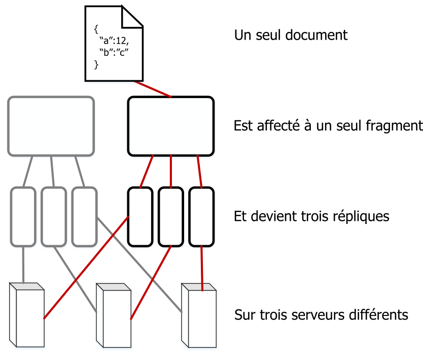

---

copyright:
  years: 2017
lastupdated: "2017-05-15"

---

{:new_window: target="_blank"}
{:shortdesc: .shortdesc}
{:screen: .screen}
{:codeblock: .codeblock}
{:pre: .pre}

<!-- Acrolinx: 2017-05-15 -->

# Comment les données sont-elles stockées dans Cloudant ?

## Concepts

Chaque base de données dans Cloudant se compose d'un ou de plusieurs _fragments_ distincts,
le nombre de fragments est appelé _Q_.
Un fragment est un sous-ensemble distinct de la base de données.
Tous les fragments _Q_ rassemblés contiennent l'ensemble des données de la base de données.
Chaque fragment est stocké dans trois copies séparées.
Chaque copie de fragment est appelée _réplique_ de fragment.
Chaque réplique est stockée sur un serveur différent.
Les serveurs sont disponibles dans un centre de données à emplacement unique.
L'ensemble des serveurs d'un centre de données est appelé un cluster.


Un document est affecté à un fragment spécifique en utilisant le hachage cohérent de son ID.
Cette affectation implique qu'un document est toujours stocké sur un fragment connu et un ensemble connu de serveurs.



Les fragments sont
_rééquilibrés_ ponctuellement.
Le rééquilibrage implique le déplacement de répliques vers différents serveurs.
Cette opération a lieu pour plusieurs raisons,
par exemple lorsque la surveillance de serveur indique qu'un serveur est plus ou moins utilisé que d'autres serveurs,
ou lorsqu'un serveur doit être arrêté de manière temporaire pour maintenance.
Le nombre de fragments et de répliques reste identique
et les documents restent affectés au même fragment mais
l'emplacement de stockage de serveur pour une réplique de fragment est modifié.

La valeur par défaut de _Q_ varie en fonction des différents clusters.
Elle peut être optimisée au fil du temps.

Le nombre de répliques (copies d'un fragment) est également configurable.
En pratique,
l'observation et la mesure d'un grand nombre de systèmes indiquent qu'il est judicieux dans la plupart des cas d'utiliser trois répliques
pour atteindre un équilibre entre les performances et la sécurité des données.
Il est exceptionnel et inhabituel que le système Cloudant utilise un autre nombre de répliques.

## En quoi la fragmentation affecte-t-elle les performances ?

Le nombre de fragments d'une base de données est configurable car
il affecte les performances de cette dernière de plusieurs manières.

Lorsqu'une demande provenant d'une application client arrive dans la base de données,
un serveur ou 'noeud' du cluster est défini comme _coordinateur_ de la demande.
Ce coordinateur effectue des demandes internes auprès des noeuds qui incluent les données relatives à la demande,
détermine la réponse à cette dernière et
renvoie cette réponse au client.

Le nombre de fragments pour une base de données peut affecter les performances de deux manières :

1.	Chaque document de la base de données est stocké dans un fragment unique.
	C'est pourquoi, le fait d'avoir
	un grand nombre de fragments permet un meilleur parallélisme pour une demande de document unique.
	Cela est dû au fait que le coordinateur envoie des demandes uniquement aux noeuds incluant le document.
	C'est pourquoi,
	si la base de données inclut une quantité importante de fragments,
	il est possible qu'il existe un grand nombre d'autres noeuds n'ayant pas besoin de répondre à la demande.
	Ces noeuds peuvent continuer de fonctionner pour les autres tâches sans interruption à la demande du coordinateur.
2.	Pour répondre à une demande de requête,
	une base de données doit traiter les résultats de tous les fragments.
	C'est pourquoi,
	le fait d'avoir plus de fragments génère une demande de traitement supplémentaire.
	Cela est dû au fait que le coordinateur doit effectuer une demande par fragment,
	puis associer les résultats avant de renvoyer la réponse au client.

Pour déterminer plus facilement le nombre de fragments approprié pour votre base de données,
commencez par identifier les types les plus répandus de demandes effectuées par les applications.
Par exemple,
définissez si les demandes concernent principalement les opérations de document unique ou
si elles sont principalement des requêtes ?
Ces opérations sont-elles urgentes ?

Pour toutes les requêtes,
le coordinateur émet des demandes de lecture sur toutes les répliques.
Cette approche est utilisée car chaque réplique conserve sa propre copie des index, ce qui permet de répondre plus facilement aux requêtes.
Une des principales conséquences de cette configuration réside dans le fait qu'un grand nombre de fragments permet la génération d'index parallèles _si_
les écritures de document sont réparties équitablement dans les différents fragments du cluster.

En pratique,
il est difficile de prévoir la charge d'indexation probable dans les noeuds du cluster.
De plus,
cette prédiction tend à être moins utile que l'adressage des modèles de demande.
Cela est dû au fait que cette indexation peut être requise après une écriture de document,
mais non après une demande de document.
C'est pourquoi,
l'utilisation de l'indexation seule ne fournit pas suffisamment d'informations
pour estimer un nombre de fragments approprié.

Lors de l'estimation de la taille des données, il est important
de prendre en compte le nombre de documents par fragment.
Les documents de chaque fragment se trouvent dans une
[arborescence B ](https://en.wikipedia.org/wiki/B-tree){:new_window}
de grande taille sur disque.
Les index sont stockés de la même manière.
Plus le nombre de documents ajoutés à un fragment est important,
plus le nombre d'étapes utilisées pour traverser l'arborescence B lors
d'une requête ou d'une recherche de document standard augmente,
ce qui a tendance à ralentir les demandes car le nombre de données à lire
dans les caches ou sur le disque est plus important.

En règle générale,
évitez d'avoir plus de 10 millions de documents par fragment.
Il est recommandé de conserver la taille des fragments inférieure
à 10 Go pour des raisons de fonctionnement.
Par exemple,
il est plus facile de déplacer des fragments de petite taille pendant le rééquilibrage.

En prenant en compte les exigences en conflit pour éviter un nombre trop élevé de documents et pour faire en sorte que la taille de fragment soit basse,
une valeur _Q_ unique ne peut pas fonctionner de manière optimale dans toutes les situations.
Cloudant optimise les valeurs par défaut pour les clusters au fur et à mesure que les schémas d'utilisation évoluent.

Cependant,
pour une base de données spécifique,
il est souvent judicieux de prendre le temps d'examiner la taille et les schémas de demande
et d'utiliser ces informations lors de la sélection ultérieure du nombre approprié de fragments.
Pour une meilleure estimation des valeurs _Q_ appropriées, il est primordial d'effectuer des tests avec des données représentatives et des schémas de demande.
Attendez-vous à ce qu'une expérience en production réelle produise des résultats différents.

<div id="summary"></div>

Les instructions simples suivantes peuvent vous être utiles lors des premières étapes de planification.
Pensez à valider votre configuration proposée en la testant avec des données représentatives,
particulièrement pour les bases de données de grande taille :

*	Si la taille de vos données est faible
	(quelques dizaines ou centaines de Mo ou
	des milliers de documents),
	un seul fragment peut être suffisant.
*	Pour les bases de données de quelques Go ou incluant quelques millions de documents,
	un nombre de fragments à un seul chiffre, 8 par exemple, est acceptable.
*	Pour les bases de données plus importantes incluant des dizaines de millions, voire des centaines de millions de documents ou des dizaines de Go,
	configurez votre base de données de telle sorte qu'elle utilise 16 fragments.
*	Pour les bases de données encore plus importantes,
	fragmentez manuellement vos données dans plusieurs bases de données.
	Pour de telles bases de données,
	contactez le [support Cloudant ](mailto:support@cloudant.com){:new_window} pour obtenir des conseils.

>	**Remarque :** Les chiffres proposés dans ces instructions sont dérivés de l'observation et de l'expérience
	et non de calculs précis.

<div id="API"></div>

## Utilisation de fragments

### Définition du nombre de fragments

Le nombre de fragments,
_Q_,
d'une base de données est défini lors de la création de cette dernière.
La valeur _Q_ ne peut pas être modifiée ultérieurement.

Pour définir la valeur _Q_ lors de la création d'une base de données,
utilisez le paramètre de la chaîne de requête `q`.

Dans l'exemple suivant,
une base de données nommée `mynewdatabase` est créée.
Le paramètre `q` indique que huit fragments sont créés pour la base de données.

```sh
curl -X PUT -u myusername https://myaccount.cloudant.com/mynewdatabase?q=8
```
{:codeblock}

>	**Remarque :** La définition de _Q_ pour les bases de données n'est pas activée pour les bases de données Cloudant sur Bluemix.
	La valeur _Q_ n'est pas disponible sur la plupart des clusters à service partagé `cloudant.com`.

Si vous tentez de définir la valeur _Q_ alors qu'elle est indisponible,
une réponse [`403` est générée](../api/http.html#403) avec un corps JSON
similaire à l'exemple suivant :

```json
{
	"error": "forbidden",
	"reason": "q is not configurable"
}
```
{:codeblock}

### Définition du nombre de répliques

Depuis la version 2 de CouchDB,
vous êtes autorisé à [spécifier le nombre de répliques ](http://docs.couchdb.org/en/2.0.0/cluster/databases.html?highlight=replicas#creating-a-database){:new_window}
lorsque vous créez une base de données.
Toutefois,
vous n'êtes pas autorisé à changer la valeur par défaut du nombre de répliques qui est égale à 3.
Plus particulièrement,
il n'est pas possible d'indiquer un nombre de répliques différent lorsque vous créez une base de données.
Pour obtenir de l'aide supplémentaire, contactez le [support Cloudant ](mailto:support@cloudant.com){:new_window}.

### Que sont les arguments _R_ et _W_ ?

Certaines demandes peuvent avoir des arguments qui affectent le comportement du coordinateur lorsqu'il répond à la demande.
Ces arguments sont appelés _R_ et _W_ d'après leurs noms dans la chaîne de requête de demande.
Ils peuvent être utilisés uniquement pour les opérations de document unique.
Ils n'ont aucune conséquence sur les demandes de 'style de requête' générales.

En pratique,
il est rarement utile de spécifier les valeurs _R_ et _W_.
Par exemple,
le fait de spécifier _R_ ou _W_ ne modifie en rien la cohérence pour la lecture ou l'écriture.

#### Qu'est-ce que l'argument _R_ ?

L'argument _R_ peut être spécifié uniquement pour les demandes de document unique.
_R_ définit le nombre de réponses devant être reçues par le coordinateur avant qu'il ne réponde au client.
Les réponses doivent provenir des noeuds qui hébergent les répliques du fragment contenant le document. 

Attribuer la valeur _1_ à _R_ peut améliorer le temps de réponse général car
le coordinateur peut renvoyer une réponse plus rapidement.
Cela est dû au fait que le coordinateur doit attendre une réponse d'une des
répliques qui hébergent le fragment approprié.

>	**Remarque :** Le fait de réduire la valeur _R_ augmente la probabilité que la réponse
	renvoyée ne s'appuie pas sur les dernières données en raison du
	modèle de [cohérence finale](cap_theorem.html) utilisé par Cloudant.
	L'utilisation de la valeur _R_ par défaut permet d'atténuer cet effet.

La valeur par défaut de _R_ est _2_.
Cette valeur correspond à la plupart des répliques pour une base de données standard qui utilise trois répliques de fragment.
Si la base de données a un nombre de répliques supérieur ou inférieur à 3,
la valeur par défaut de _R_ change en fonction.

#### Qu'est-ce que l'argument _W_ ?

_W_ peut être uniquement spécifié pour les demandes d'écriture de document unique.

_W_ est similaire à _R_,
car il définit le nombre de réponses devant être reçues par le coordinateur avant qu'il ne réponde au client.

>	**Remarque :** _W_ n'a aucune conséquence sur les comportements réels d'écriture.

La valeur _W_ n'a aucune conséquence sur le fait que le document soit placé dans la base de données ou non.
En spécifiant une valeur _W_,
le client peut inspecter le code de statut HTTP dans la réponse afin de déterminer si les répliques _W_ ont répondu au coordinateur.
Le coordinateur attend les réponses _W_ des noeuds qui hébergent les copies du document pendant une période prédéfinie,
avant de renvoyer la réponse au client.
