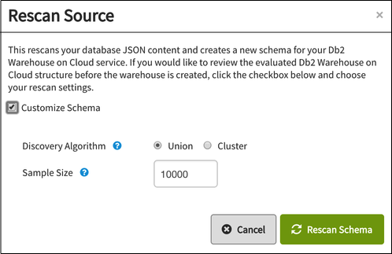

---

copyright:
  years: 2015, 2018
lastupdated: "2018-03-06"

---

{:new_window: target="_blank"}
{:shortdesc: .shortdesc}
{:screen: .screen}
{:codeblock: .codeblock}
{:pre: .pre}

# Entreposage

## Dépréciation de la fonctionnalité {{site.data.keyword.dashdbshort_notm}} de {{site.data.keyword.cloudant_short_notm}} (7 février 2018)
{: #deprecating-cloudant-nosql-db-s-db2-warehouse-on-cloud-feature-february-7-2018-}

La fonctionnalité {{site.data.keyword.dashdblong}} de {{site.data.keyword.cloudantfull}} est obsolète et sera retirée selon le calendrier ci-dessous. Les données ne seront pas supprimées des systèmes, mais la synchronisation s'arrêtera.  

Date d'obsolescence	 | Fonctionnalités obsolètes 
-----------------|--------------------------
16 janvier 2018	 | L'onglet Entrepôt n'est disponible que pour les instances de service {{site.data.keyword.cloudant_short_notm}} ayant déjà créé des tâches {{site.data.keyword.dashdbshort_notm}} dans l'onglet Entrepôt. Si vous n'avez pas créé de tâche {{site.data.keyword.dashdbshort_notm}}, vous ne pourrez pas accéder à cette fonctionnalité. 
31 mars 2018	 | Les nouveaux travaux {{site.data.keyword.dashdbshort_notm}} ne peuvent pas être créés par les clients qui ont commencé à utiliser la fonctionnalité {{site.data.keyword.dashdbshort_notm}} avant le 16 janvier. 
5 mai 2018	 | Les tâches {{site.data.keyword.dashdbshort_notm}} existantes sont arrêtées. Le statut final peut toujours être visualisé sur le tableau de bord. 
31 mai 2018	 | L'interface utilisateur de la fonctionnalité {{site.data.keyword.dashdbshort_notm}} a été supprimée. Le statut des tâches {{site.data.keyword.dashdbshort_notm}} devient indisponible. 
 
Les données qui auront été transférées à {{site.data.keyword.dashdbshort_notm}} d'ici le 30 avril 2018 resteront dans {{site.data.keyword.dashdbshort_notm}} et les données {{site.data.keyword.cloudant_short_notm}} ne seront pas affectées non plus. 

### Alternatives à la fonctionnalité {{site.data.keyword.dashdbshort_notm}} 

Recherchez dans le [référentiel data-flow-examples ](https://github.com/cloudant-labs/data-flow-examples){:new_window} des tutoriels sur l'extraction de documents {{site.data.keyword.cloudant_short_notm}} et l'écriture des données dans une table {{site.data.keyword.dashdbshort_notm}}. 

## Présentation de l'entreposage de données 

Une base de données est essentielle pour le stockage des données.
Cependant, pouvoir appliquer ces données à des fins professionnelles permet de valoriser une base de données :
possibilité d'extraire les données appropriées,
rapidement et facilement,
et mise en production des données dans vos applications.
{:shortdesc}

La plupart des tâches de stockage,
de traitement et
d'analyse effectuées avec les données sont très souvent utilisées dans vos applications.
Elles peuvent constituer de bons exemples de meilleures pratiques du secteur.

Ainsi,
il est judicieux d'améliorer les fonctions de base de données standard en intégrant des fonctions supplémentaires,
prenant en charge les tâches, telles que la génération de rapports
ou l'analyse.

Pendant presque 30 ans,
les 'entrepôts de données' s'appuyant sur la technologie de base de données relationnelle
ont été la norme en matière de stockage de données,
de génération de rapports
et d'analyse.
Généralement,
un [entrepôt de données est ](https://en.wikipedia.org/wiki/Data_warehouse){:new_window} :
un référentiel central de données intégrées provenant d'une de plusieurs sources.
Il stocke les données en cours et les données historiques.
De plus, vous pouvez l'utiliser pour effectuer l'analyse et créer des rapports pour les travailleurs intellectuels de l'entreprise.

Les technologies de stockage de données, de génération de rapports et d'analyse se sont développées au cours des dernières années en réponse au besoin de traiter les données '[Big Data ](https://en.wikipedia.org/wiki/Big_data){:new_window}'. Big data est un terme désignant les ensembles de données tellement importants ou complexes que les applications de traitement de données standard ne sont pas appropriées.

De plus, les propriétés et les caractéristiques des entrepôts de données et des produits liés mettent en avant le fait que l'utilisation de technologie de base de données relationnelle en vue d'activer les entrepôts de données est un choix répandu, même pour les tâches Big Data.

Il existe un grand nombre de cas d'utilisation qui illustrent les avantages de l'intégration des fonctions {{site.data.keyword.cloudant_short_notm}} à un entrepôt de données relationnelles, comme les exemples suivants.

## Cette intégration est-elle adaptée à mon cas d'utilisation ? 

L'intégration de l'entreposage de données de {{site.data.keyword.cloudant_short_notm}} est un processus rationalisé qui permet de découvrir automatiquement les schémas de vos documents et d'importer les données intelligemment dans {{site.data.keyword.dashdbshort_notm}} ou {{site.data.keyword.Db2_on_Cloud_short}}. Lorsque vous créez un entrepôt sur {{site.data.keyword.cloudant_short_notm}}, le schéma est d'abord détecté automatiquement, puis les données sont importées dans la base de données {{site.data.keyword.dashdbshort_notm}} connectée.  

L'intégration est appropriée lorsque vos données ont les caractéristiques suivantes : 

* Elles comportent un ensemble de schémas principalement statique. Un schéma modifié nécessite le redémarrage de l'entrepôt, ce qui réimporte vos données à partir de zéro. 
* Les schémas peuvent être découverts en numérisant relativement peu de documents - jusqu'à quelques dizaines de milliers. Une fois les schémas découverts, des millions de documents peuvent être importés dans votre entrepôt, bien sûr. 
* L'entreposage de données ne doit pas nécessairement avoir lieu en temps réel. Les documents mis à jour apparaissent généralement dans un entrepôt en quelques secondes, mais cela n'est pas garanti et varie en fonction de la charge de votre base de données. 
* {{site.data.keyword.Db2_on_Cloud_short}} limite les schémas à 1 012 champs. Les documents JSON comportant un grand nombre de champs, y compris des objets imbriqués et des tableaux volumineux, peuvent dépasser cette limite. 

## Association de données

Associer des données provenant de plusieurs magasins de données pour l'analyse interdomaine
est une tâche qui peut être effectuée facilement et de manière efficace en utilisant un entrepôt de données relationnelles.

Les données provenant de différentes sources sont préparées et converties en un format commun pendant le chargement d'un entrepôt de données.
Les enregistrements sont stockés dans des tables
et des opération sont disponibles pour joindre ces dernières afin de permettre une analyse combinée.

Effectuer des opérations de jointure dans un entrepôt de données relationnelles est particulièrement utile
si certaines des données sont déjà disponibles dans une représentation relationnelle,
par exemple les données maître ou les données de référence.

## Flexibilité

Les bases de données {{site.data.keyword.cloudant_short_notm}} sont flexibles en matière de représentation de données.
Par exemple, elles n'imposent pas de schéma lors de la lecture ou de l'écriture.

En revanche, un modèle correctement défini et rigoureusement appliqué est
requis pour les tâches de génération de rapports et d'analyse.

Lorsque vos documents sont disponibles dans un entrepôt relationnel, vous pouvez créer votre modèle en fonction d'un ensemble fixe de définitions de table.
Seuls les documents adaptés au schéma de table peuvent être chargés alors que les violations sont rejetées.
Vous pouvez tester vos modèles avec des données cohérentes utilisant un schéma relationnel fixe.

## Vérification de l'intégrité des données

Les entrepôts de données peuvent utiliser des contraintes pour vérifier l'intégrité des données.
Par exemple :

-   Deux enregistrements ne peuvent pas avoir la même clé primaire.
-   Les clés externes garantissent que les enregistrements sont terminés.
-   Des fonctions sont disponibles pour valider les enregistrements par rapport aux règles métier.

Il est essentiel que les services d'entreprise soient uniques,
corrects
et terminés.
Le chargement des documents {{site.data.keyword.cloudant_short_notm}} dans un entrepôt de données permet de respecter ces exigences.

## {{site.data.keyword.cloudant_short_notm}} et entreposage de données

Les entrepôts de données constituent une technologie évoluée et importante.
{{site.data.keyword.cloudant_short_notm}} permet une intégration étroite avec des entrepôts de données relationnels, vous
permettant de bénéficier des avantages de cette technologie.

{{site.data.keyword.cloudant_short_notm}} inclut une fonction d'entreposage de base,
sous la forme de [vues MapReduce](../api/using_views.html)
qui vous permettent d'effectuer différentes tâches d'analyse standard.

Pour des tâches d'entreposage plus avancées, vous pouvez optimiser les fonctions fournies par le service d'entreposage sur Cloud [{{site.data.keyword.IBM}} {{site.data.keyword.dashdbshort_notm}} ](https://www.ibm.com/analytics/us/en/data-management/data-warehouse/){:new_window}.

Lorsque vous utilisez {{site.data.keyword.cloudant_short_notm}}, vous bénéficiez
d'un accès intégré et facile aux fonctions d'entreposage avancées,
telles :

-   Affichage de vos données JSON à un format de base de données relationnelle.
-   Exécution de requêtes SQL sur vos données.
-   Génération d'analyses à partir de vos données.

Ces fonctions d'entreposage avancées sont activées via des services, tels {{site.data.keyword.dashdbshort_notm}},
qui est un complément de {{site.data.keyword.cloudant_short_notm}}.

De plus, si vous avez besoin uniquement d'un magasin de données relationnelles pour vos documents, sans les fonctions d'entreposage, vous pouvez charger vos documents {{site.data.keyword.cloudant_short_notm}} dans le service [{{site.data.keyword.Db2_on_Cloud_short}}](#ibm-db2-on-cloud).

## {{site.data.keyword.dashdblong_notm}}

{{site.data.keyword.dashdbshort_notm}} est un service d'entreposage de données sur Cloud,
conçu pour les tâches d'analyse.
Tout en étant particulièrement adapté aux données JSON {{site.data.keyword.cloudant_short_notm}},
{{site.data.keyword.dashdbshort_notm}} peut accepter des données provenant de différentes sources en
examinant la structure des données lors de leur chargement.

Pour plus d'informations, consultez la documentation [{{site.data.keyword.dashdblong_notm}}](https://www.ibm.com/support/knowledgecenter/SS6NHC/com.ibm.swg.im.dashdb.kc.doc/welcome.html){:new_window}.

## {{site.data.keyword.Db2Hosted_notm}}

[{{site.data.keyword.Db2Hosted_full}} ](https://console.ng.bluemix.net/catalog/services/ibm-db2-on-cloud){:new_window}
met à votre disposition une base de données sur l'infrastructure de cloud globale IBM SoftLayer®.
Ainsi, vous bénéficiez des fonctions avancées d'un déploiement Db2 sur site,
mais sans les coûts,
la complexité
et les risques liés à la gestion de votre propre infrastructure.

Pour plus d'informations, reportez-vous à la [ documentation {{site.data.keyword.Db2Hosted_short}} ](https://console.ng.bluemix.net/docs/services/DB2OnCloud/index.html#DB2OnCloud){:new_window}.

## Création d'un entrepôt

Il existe deux méthodes de création d'entrepôt :

1.  [Utilisation de {{site.data.keyword.cloudant_short_notm}} pour créer un entrepôt {{site.data.keyword.dashdbshort_notm}}](#use-cloudant-to-create-a-db2-warehouse-on-cloud-warehouse)
2.  [Connexion de {{site.data.keyword.cloudant_short_notm}} à un entrepôt existant](#connect-cloudant-to-an-existing-warehouse)

### Utilisation de {{site.data.keyword.cloudant_short_notm}} pour créer un entrepôt {{site.data.keyword.dashdbshort_notm}} 

Pour {{site.data.keyword.cloudant_short_notm}}, la méthode la plus simple de création d'un entrepôt consiste à créer en votre nom une instance d'entrepôt
{{site.data.keyword.dashdbshort_notm}} dans {{site.data.keyword.Bluemix}}.
Pour cela, cliquez sur le bouton `Create Warehouse` de la tâche `Warehouse` dans l'onglet
`Integrations` de votre tableau de bord {{site.data.keyword.cloudant_short_notm}}.

Si vous n'êtes pas encore connecté à {{site.data.keyword.Bluemix_notm}},
un message vous demande de le faire.

>   **Remarque** : par défaut, {{site.data.keyword.cloudant_short_notm}} crée une instance {{site.data.keyword.dashdbshort_notm}} sur {{site.data.keyword.Bluemix_notm}} pour votre entrepôt.

Une fois l'authentification effectuée,
vous pouvez demander qu'une nouvelle instance {{site.data.keyword.dashdbshort_notm}} soit créée à l'aide de votre compte {{site.data.keyword.Bluemix_notm}}.

Pour cela :

1.  Indiquez le nom à utiliser pour l'entrepôt dans la zone `Warehouse Name`.
2.  Indiquez le nom de votre base de données dans {{site.data.keyword.cloudant_short_notm}}, dans la zone `Data Sources`.
3.  Vérifiez que l'option `Create new {{site.data.keyword.dashdbshort_notm}} instance` est sélectionnée dans le formulaire.
4.  Cliquez sur le bouton `Create Warehouse`.

### Connexion {{site.data.keyword.cloudant_short_notm}} à un entrepôt existant

Au lieu d'utiliser {{site.data.keyword.cloudant_short_notm}} pour créer la base de données d'entrepôt {{site.data.keyword.dashdbshort_notm}},
vous pouvez vous connecter à une instance {{site.data.keyword.dashdbshort_notm}} existante.

Ce processus est similaire à l'[utilisation de {{site.data.keyword.cloudant_short_notm}} pour créer un entrepôt {{site.data.keyword.dashdbshort_notm}}](#use-cloudant-to-create-a-db2-warehouse-on-cloud-warehouse).
Toutefois au lieu de sélectionner l'option `Create new {{site.data.keyword.dashdbshort_notm}} instance`,
vous sélectionnez l'instance de service `{{site.data.keyword.dashdbshort_notm}}` et choisissez l'entrepôt {{site.data.keyword.dashdbshort_notm}} existant déjà dans {{site.data.keyword.Bluemix_notm}}.

### Utilisation d'une instance d'entrepôt {{site.data.keyword.Db2_on_Cloud_short}} 

Si vous préférez,
vous pouvez vous connecter à une instance d'entrepôt {{site.data.keyword.Db2_on_Cloud_short}} existante et non à {{site.data.keyword.dashdbshort_notm}}.
Pour cela, sélectionnez l'option `Db2` dans votre tableau de bord {{site.data.keyword.cloudant_short_notm}} pour vous connecter à une instance {{site.data.keyword.Db2_on_Cloud_short}} existante.

Si vous souhaitez vous connecter à une instance {{site.data.keyword.Db2_on_Cloud_short}},
vous devez indiquer les informations suivantes :

-   Adresse de l'hôte
-   Numéro de port
-   Nom de base de données 
-   ID utilisateur pour la base de données
-   Mot de passe de l'ID utilisateur.

>   **Remarque** : aa suite de cette rubrique fait référence à {{site.data.keyword.dashdbshort_notm}} en tant qu'instance d'entrepôt.
    Toutefois, la rubrique s'applique également si vous utilisez une instance de {{site.data.keyword.Db2_on_Cloud_short}}. Il existe un tutoriel décrivant comment [charger des données JSON à partir de {{site.data.keyword.cloudant_short_notm}} dans {{site.data.keyword.dashdbshort_notm}} ](https://developer.ibm.com/clouddataservices../dashdb/get/load-json-from-cloudant-database-in-to-dashdb/){:new_window} et incluant des exemples d'utilisation de {{site.data.keyword.Db2_on_Cloud_short}} en tant que base de données d'entrepôt. 

## Schéma d'entrepôt

Lors de la première création d'un entrepôt à partir de {{site.data.keyword.cloudant_short_notm}}, {{site.data.keyword.dashdbshort_notm}} crée le meilleur schéma possible pour les données de la base de données, ce qui permet de garantir que chaque zone de vos documents JSON a une entrée correspondante dans le nouveau schéma. Lors de la
création de l'entrepôt,
vous pouvez choisir, si vous le souhaitez, de [personnaliser le schéma](#customizing-the-warehouse-schema) manuellement.

Une fois le schéma créé, l'entrepôt peut
conserver vos données à un format relationnel.
{{site.data.keyword.cloudant_short_notm}} effectue ensuite la [réplication](../api/replication.html) en vue
d'un 'chargement initial' des documents de base de données dans l'entrepôt.
Vous disposez alors d'une collection opérationnelle de vos données dans la base de données relationnelle {{site.data.keyword.dashdbshort_notm}}.

Au fil du temps,
le contenu de votre base de données {{site.data.keyword.cloudant_short_notm}} peut changer.
Vous pouvez modifier le schéma d'un entrepôt existant.

>   **Remarque** : Si vous modifiez le schéma d'un entrepôt existant,
    les données de votre base de données {{site.data.keyword.cloudant_short_notm}} doivent être répliquées à nouveau dans la base de données de l'entrepôt.
    En effet,
    la modification du schéma provoque un nouveau 'chargement initial' dans l'entrepôt.

## Utilisation de votre entrepôt

Avec l'entreposage {{site.data.keyword.cloudant_short_notm}},
vous pouvez exécuter des requêtes SQL 'standard'
et afficher les résultats
à partir de la console {{site.data.keyword.dashdbshort_notm}}.

Les applications externes peuvent interagir avec les données comme elles le feraient avec toute autre base de données relationnelle.
L'avantage de {{site.data.keyword.dashdbshort_notm}} est que vous pouvez effectuer d'autres tâches d'entreposage,
telles le chargement de données supplémentaires à partir d'autres sources,
et l'analyse de données à l'aide d'outils d'analyse intégrés.
{{site.data.keyword.dashdbshort_notm}} prend en charge le langage de programmation
[`'R'` ](https://en.wikipedia.org/wiki/R_%28programming_language%29){:new_window}
et l'environnement logiciel pour les graphiques et les calculs statistiques.
Autrement dit, vous avez accès à des algorithmes qui vous permettent d'effectuer des tâches d'analyse de données, telles que la régression linéaire,
la mise en cluster 'k moyenne'
et l'analyse géospatiale.

L'outil `RStudio` vous permet de créer des scripts `'R'` qui sont ensuite téléchargés dans {{site.data.keyword.dashdbshort_notm}},
puis exécutés en utilisant vos données.

Pour plus d'informations sur l'utilisation de {{site.data.keyword.dashdbshort_notm}}, consultez la documentation [{{site.data.keyword.dashdblong_notm}}](https://www.ibm.com/support/knowledgecenter/SS6NHC/com.ibm.swg.im.dashdb.kc.doc/welcome.html){:new_window}.

## Tenue à jour des données et de la structure

Les données sont chargées à partir de {{site.data.keyword.cloudant_short_notm}} dans {{site.data.keyword.dashdbshort_notm}} via un processus de [réplication](../api/replication.html).
Cela signifie que si vos données {{site.data.keyword.cloudant_short_notm}} sont mises à jour ou modifiées,
la réplication des documents dans {{site.data.keyword.dashdbshort_notm}} doit avoir lieu à nouveau
pour garantir que vos tâches d'analyse continuent de fonctionner en utilisant les informations les plus récentes.

Comme avec la réplication {{site.data.keyword.cloudant_short_notm}} standard,
les données sont transférées dans un sens uniquement :
pour un entrepôt, le transfert s'effectue de {{site.data.keyword.cloudant_short_notm}} vers {{site.data.keyword.dashdbshort_notm}}.
Après le chargement initial des données,
l'entrepôt s'abonne aux modifications de contenu de données dans la base de données {{site.data.keyword.cloudant_short_notm}}.
Les modifications sont répliquées de la source {{site.data.keyword.cloudant_short_notm}} vers la cible {{site.data.keyword.dashdbshort_notm}}.
Cela signifie que l'entreposage est une forme de réplication continue entre {{site.data.keyword.cloudant_short_notm}} et {{site.data.keyword.dashdbshort_notm}}.

Au fil du temps,
des modifications structurelles peuvent également être effectuées dans votre base de données {{site.data.keyword.cloudant_short_notm}}, notamment l'ajout ou la suppression de zones dans les documents JSON.
Lorsque cela se produit,
le schéma utilisé par l'entrepôt peut devenir non valide,
générant des erreurs signalées lorsque de nouvelles données sont répliquées entre {{site.data.keyword.cloudant_short_notm}} et {{site.data.keyword.dashdbshort_notm}}.

Pour résoudre ce problème,
l'entreposage {{site.data.keyword.cloudant_short_notm}} inclut une fonction de 'réexamen'.
Ainsi, la structure de la base de données {{site.data.keyword.cloudant_short_notm}} est réexaminée
et le nouveau schéma requis dans {{site.data.keyword.dashdbshort_notm}} est déterminé.
Les anciennes tables dans {{site.data.keyword.dashdbshort_notm}} créées lors de l'examen précédent sont ensuite supprimées,
de nouvelles tables sont créées à l'aide du nouveau schéma puis
pour finir, les données {{site.data.keyword.cloudant_short_notm}} en cours sont chargées en tant que nouveau 'chargement initial'.

Pour utiliser la fonction de réexamen,
vérifiez tout d'abord que votre entrepôt n'est pas en cours d'exécution.
Pour cela, procédez comme suit :

1.  Sélectionnez l'onglet `Integrations` dans le tableau de bord {{site.data.keyword.cloudant_short_notm}}.
2.  Recherchez le nom de l'entrepôt à réexaminer dans la tâche `Warehouse` : 
3.  Cliquez sur le nom de l'entrepôt.
    Il s'agit d'un lien
    qui permet d'afficher une vue détaillée de l'entrepôt : 
4.  Vérifiez le statut en cours de l'entrepôt.
    Un cercle vert tournant indique que l'entrepôt est en cours d'exécution.
    Pour arrêter l'entrepôt,
    cliquez sur l'icône `Stop Database` dans la colonne Actions : 
5.  Lorsque la base de données d'entrepôt n'est pas en cours d'exécution,
    l'icône `Rescan` de la colonne Action est activée : 

### Réexamen de la base de données source

Lorsque vous cliquez sur l'icône `Rescan`,
deux choix s'offrent à vous :

-   Un réexamen direct de votre base de données.
    Il s'agit de l'action par défaut
    qui est similaire à l'examen d'origine de votre base de données effectué lors de la création d'origine de l'entrepôt.
-   Personnalisation du schéma de l'entrepôt.

Si vous choisissez l'action par défaut,
votre base de données source est inspectée et un nouveau schéma de base de données d'entrepôt est généré.
Dès que le réexamen est terminé,
l'entrepôt de données est démarré.

Si vous souhaitez personnaliser le schéma d'entrepôt,
activez la case à cocher `Customize Schema` avant de
cliquer sur le bouton `Rescan`.

La case à cocher `Customize Schema` active deux options.

1.  Algorithme de reconnaissance utilisé.
2.  Taille d'échantillon

### Algorithme de reconnaissance

L'option par défaut pour le réexamen est l'algorithme `Union`.
Tous les attributs de tous les documents de base de données {{site.data.keyword.cloudant_short_notm}} échantillonnés sont utilisés
pour créer un ensemble de tables dans la base de données d'entrepôt.
Suite à cela, tous les documents de la base de données {{site.data.keyword.cloudant_short_notm}} peuvent être stockés dans la base de données d'entrepôt
mais des zones de certaines lignes de la base de données peuvent être vides.

Pour le réexamen, vous pouvez également utiliser l'algorithme `Cluster`.
Il permet d'identifier les documents dans la base de données {{site.data.keyword.cloudant_short_notm}} ayant le même ensemble d'attributs
puis de créer les schémas de table de base de données d'entrepôt correspondants.

### Taille d'échantillon

Cette option permet de déterminer le nombre de documents de la base de données {{site.data.keyword.cloudant_short_notm}}
inspectés lors de la détermination de schéma.

La valeur par défaut est de 10 000 documents.

Indiquer une valeur trop faible présente le risque que des attributs ne soient pas détectés dans certains documents {{site.data.keyword.cloudant_short_notm}},
et soient donc omis de la structure de la base de données d'entrepôt.

Si vous indiquez une valeur trop élevée, le processus de réexamen
permettant de déterminer la structure de la base de données d'entrepôt dure plus longtemps.

### Après le réexamen

Une fois le réexamen de base de données {{site.data.keyword.cloudant_short_notm}} terminé,
l'entrepôt n'est pas automatiquement démarré.
Il reste à
l'état arrêté
afin que la base de données d'entrepôt puisse être personnalisée.

## Personnalisation du schéma d'entrepôt

Il est possible de modifier le schéma de base de données déterminé automatiquement lors du processus de création d'entrepôt initial ou après un réexamen.
Pour cela, assurez-vous d'avoir sélectionné l'option `Customize Schema` lors du processus de création :

L'entrepôt est créé dans {{site.data.keyword.dashdbshort_notm}}.
Toutefois, il n'est pas démarré immédiatement.
A la place, vous avez la possibilité de personnaliser le schéma avant de continuer.

Pour cela, cliquez sur le lien correspondant à votre entrepôt :

La page qui s'affiche inclut un bouton vous permettant de personnaliser le schéma utilisé pour votre base de données source.
Si vous souhaitez avoir une confirmation que le schéma est prêt pour la personnalisation, survolez l'indicateur Status :

Le fait de cliquer sur le bouton 'Customize' affiche un panneau dans lequel vous pouvez modifier les zones du schéma de base de données :

Pour restaurer les valeurs par défaut pour le schéma,
cliquez sur le bouton `Rescan` :

Lorsque vous êtes satisfait du schéma de base de données pour l'entrepôt, cliquez sur le bouton `Run` :

Le schéma est sauvegardé et
l'entrepôt est démarré.

### Personnalisation d'un schéma d'entrepôt existant

Si le schéma de base de données pour votre entrepôt existe déjà,
vous avez la [possibilité de le personnaliser](#keeping-the-data-and-structure-fresh).

## Traitement des incidents

Occasionnellement,
des problèmes peuvent survenir lors de l'utilisation de la fonction d'entreposage.
Des informations sur certains de ces problèmes sont présentées ultérieurement dans cette rubrique.

De plus,
des erreurs ou des problèmes communs ainsi
que des informations détaillées indiquant comment les résoudre
sont présentés sur la page [Stack Overflow ](http://stackoverflow.com/questions/tagged/cloudant+dashdb){:new_window}.

Si vous avez besoin d'aide supplémentaire
et que vous ne pouvez pas trouver de solutions sur cette page,
contactez le [support {{site.data.keyword.cloudant_short_notm}} ](mailto:support@cloudant.com){:new_window}.

### Exceptions visibles dans le tableau de bord

Parfois,
une erreur peut survenir dans l'entrepôt.
Par exemple, si vous tentez de créer un entrepôt en utilisant une base de données {{site.data.keyword.Db2_on_Cloud_short}} existante, mais n'arrivez pas entrer les informations de base de données correctes,
la création de l'entrepôt ne peut pas aboutir.

Lorsqu'il existe une erreur,
le statut de l'entrepôt est changé en cercle rouge,
indiquant qu'il existe un problème nécessitant votre attention :

Si vous survolez l'indicateur,
des informations supplémentaires s'affichent :

Lorsque vous cliquez sur l'indicateur,
une fenêtre s'affiche fournissant des détails supplémentaires décrivant précisément le problème.
Dans cet exemple,
les informations sur l'hôte entrées pour la connexion {{site.data.keyword.Db2_on_Cloud_short}} ne sont pas valides :

### Avertissements et erreurs

Les modifications apportées à la base de données {{site.data.keyword.cloudant_short_notm}} sont répliquées dans la base de données d'entrepôt.
Il est possible qu'une modification ne soit pas adaptée à l'entrepôt ou à son schéma.
Les problèmes de ce type sont détectés et consignés dans la table `OVERFLOW` de la base de données d'entrepôt.

Par exemple,
si le schéma d'entrepôt inclut une zone `Movie_earnings_rank` de type `VARCHAR`
pouvant comporter jusqu'à 32 caractères mais qu'une
modification dans la base de données {{site.data.keyword.cloudant_short_notm}} nécessite le stockage de 40 caractères,
alors un 'dépassement' de zone a lieu.
Une condition d'avertissement est générée,
qui est indiquée dans l'icône de statut du tableau de bord d'entrepôt :

En parcourant la table de dépassement indiquée dans la base de données d'entrepôt,
vous accédez à des détails supplémentaires sur l'avertissement :

Dans cet exemple,
l'avertissement indique qu'une troncature s'est produite,
affectant la zone `Movie_earnings_rank` du document {{site.data.keyword.cloudant_short_notm}} ayant un élément `_ID` dont la valeur est `70f6284d2a395396dbb3a60b4cf1cac2`.

Il existe deux solutions possibles :

-   Dans le document {{site.data.keyword.cloudant_short_notm}}, corrigez la zone dans laquelle un dépassement a eu lieu.
-   [Mettez à jour le schéma d'entrepôt](#customizing-the-warehouse-schema).

Selon que le contenu supplémentaire dans la zone est intentionnel ou non, l'option choisie varie.
Si vous avez besoin du contenu supplémentaire pour votre application,
il est alors nécessaire de
[mettre à jour le schéma d'entrepôt](#customizing-the-warehouse-schema) pour résoudre la condition d'avertissement.

Un problème plus important survient lorsqu'une zone entièrement nouvelle est intégrée dans un document de la base de données {{site.data.keyword.cloudant_short_notm}},
mais que la zone n'a pas d'équivalent dans le schéma de base de données d'entrepôt.
Cela provoque une condition d'erreur.

Par exemple,
un document dans la base de données {{site.data.keyword.cloudant_short_notm}} peut avoir une zone supplémentaire appelée `my key`
n'existant pas dans le schéma de base de données d'entrepôt :

Une erreur est alors générée,
qui est indiquée dans l'icône de statut du tableau de bord d'entrepôt :

En parcourant la table de dépassement indiquée dans la base de données d'entrepôt,
vous accédez à des détails supplémentaires sur l'erreur :

Dans cet exemple,
l'erreur indique qu'une zone a été détectée qui
n'était pas présente lors de la création du schéma de base de données d'entrepôt.
La zone elle-même a été détectée dans le document {{site.data.keyword.cloudant_short_notm}} dans lequel `_ID` a la valeur `70f6284d2a395396dbb3a60b4cf1cac2`.

Il existe deux solutions possibles :

-   Retirez la zone supplémentaire du document {{site.data.keyword.cloudant_short_notm}}.
-   [Mettez à jour le schéma d'entrepôt](#customizing-the-warehouse-schema).

Selon que la zone supplémentaire est intentionnelle ou non, l'option choisie varie.
Si vous avez besoin de la zone supplémentaire pour votre application,
il est alors nécessaire de [mettre à jour le schéma d'entrepôt](#customizing-the-warehouse-schema) pour résoudre la condition d'erreur.
