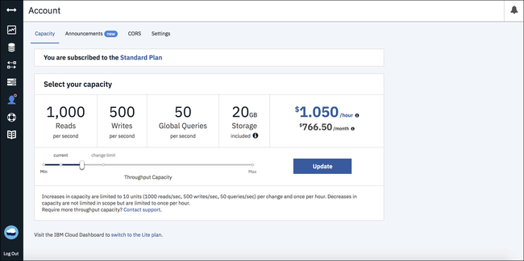

---

copyright:
  years: 2015, 2019
lastupdated: "2019-03-26"

keywords: standard plan, lite plan, dedicated hardware plan, event type, provisioned throughput capacity, consumption, capacity, monitor usage, data usage, size limits, locations, tenancy, authentication methods, high availability, disaster recovery, backup, support

subcollection: cloudant

---

{:new_window: target="_blank"}
{:shortdesc: .shortdesc}
{:screen: .screen}
{:codeblock: .codeblock}
{:pre: .pre}
{:tip: .tip}
{:note: .note}
{:important: .important}
{:deprecated: .deprecated}

<!-- Acrolinx: 2017-05-10 -->

# Plans et mise à disposition
{: #ibm-cloud-public}

{{site.data.keyword.cloudantfull}} Public est l'offre la plus riche en fonctionnalités de {{site.data.keyword.cloudant_short_notm}} qui reçoit en premier lieu les mises à jour et les nouvelles fonctionnalités. La tarification est basée sur la capacité de débit mise à disposition allouée et le stockage de données utilisé, ce qui la rend adaptée à toute charge requise.
{: shortdesc}

Le [plan Lite](#lite-plan) gratuit offre un montant fixe de capacité de débit et de données destiné au développement et à l'évaluation. Le [plan Standard](#standard-plan) payant offre une tarification configurable pour le débit et le stockage des données mis à disposition qui évolue en fonction de l'évolution des exigences de vos applications.  Un [plan Dedicated Hardware](#dedicated-hardware-plan) en option est également disponible moyennant des frais mensuels supplémentaires pour exécuter une ou plusieurs de vos instances de plan Standard dans un environnement Dedicated Hardware. L'environnement Dedicated Hardware est pour votre utilisation exclusive et si une instance du plan Dedicated Hardware est mise à disposition dans un emplacement américain, vous pouvez éventuellement sélectionner une configuration conforme à la [loi HIPAA (Health Insurance Portability Accountability Act)](https://en.wikipedia.org/wiki/Health_Insurance_Portability_and_Accountability_Act){: new_window}.

## Plans
{: #plans}

Vous pouvez sélectionner le plan à employer lors de la
[mise à disposition de votre instance de service {{site.data.keyword.cloudant_short_notm}}](#provisioning-a-cloudant-nosql-db-instance-on-ibm-cloud).
Par défaut, le [plan Lite](#lite-plan) est sélectionné.

Sélection du plan de l'instance de service 

### Plan Lite
{: #lite-plan}

Le plan Lite est gratuit et est conçu à des fins de développement et d'évaluation. Toutes les fonctionnalités de {{site.data.keyword.cloudant_short_notm}} sont incluses mais les instances du plan Lite ont une capacité de débit et de stockage de données fixe. La capacité de débit mise à disposition est fixée à 20 lectures/sec, 10 écritures/sec et 5 requêtes/sec, le stockage des données étant limité à 1 Go. 

Une vérification de l'utilisation du stockage a lieu tous les jours. Si vous dépassez votre limite de stockage de 1 Go, les demandes adressées à l'instance {{site.data.keyword.cloudant_short_notm}} reçoivent un code d'état 402 avec le message d'erreur "Account has exceeded its data usage quota. An upgrade to a paid plan is required."
Une bannière apparaît également sur le tableau de bord {{site.data.keyword.cloudant_short_notm}}. Vous avez toujours la possibilité de lire et de supprimer des données. Toutefois, pour écrire de nouvelles données, vous avez deux options. La première est de passer à un plan payant, le [plan Standard](#standard-plan), qui supprime immédiatement la limitation en écriture. La seconde est de supprimer des données pour que votre capacité de stockage totale tombe sous la limite de 1 Go et attendre jusqu'à ce que le prochain contrôle quotidien de stockage soit exécuté pour votre instance afin d'autoriser à nouveau les écritures. 

Si vous souhaitez stocker une quantité de données supérieure à 1 Go ou disposer d'une capacité de débit plus élevée, passez au [plan Standard](#standard-plan).

Vous êtes limité à une seule instance de plan Lite {{site.data.keyword.cloudant_short_notm}} par compte {{site.data.keyword.cloud_notm}}. Si vous avez déjà une instance de plan Lite, toute tentative de créer une nouvelle instance de plan Lite, ou de changer une instance de plan Standard en une instance de plan Lite, renvoie le message : "Vous ne pouvez disposer que d'une seule instance d'un plan Lite par service. Pour créer une nouvelle instance, supprimez votre instance de plan Lite existante ou sélectionnez un plan payant". 
{: note}

### Plan Standard
{: #standard-plan}

Le plan {{site.data.keyword.cloudant_short_notm}} Standard est disponible pour tous les comptes payants {{site.data.keyword.cloud}}, que ce soit sous forme de paiement à l'utilisation ou d'abonnement, et peut évoluer pour répondre aux besoins de votre application. Le prix du plan Standard est basé sur deux facteurs : la capacité de débit allouée et la quantité de données stockées dans l'instance. 

La tarification est calculée au prorata horaire avec une capacité de débit de départ mise à disposition de 100 lectures/sec, 50 écritures/sec, et 5 requêtes globales/sec équivalant à un coût de départ de 0,105 USD/heure. Vous pouvez augmenter ou diminuer la capacité de débit fournie par incréments de 100 lectures/sec, 50 écritures/sec et 5 requêtes globales/sec dans le tableau de bord {{site.data.keyword.cloudant_short_notm}}. Les coûts sont calculés en fonction de la capacité de débit allouée et non en fonction du volume de demandes mesuré. Le plan Standard inclut 20 Go de stockage de données. Si vous stockez plus de 20 Go, vous êtes facturé sur la base d'un coût défini par Go par heure. 

Voir le Calculateur de prix {{site.data.keyword.cloud_notm}} pour calculer les prix pour les différentes capacités et dans les différentes devises et les informations de [tarification](/docs/services/Cloudant?topic=cloudant-pricing#pricing){: new_window} pour voir des exemples d'estimation de coûts.

### Plan Dedicated Hardware
{: #dedicated-hardware-plan}

Une instance de plan {{site.data.keyword.cloudant_short_notm}} Dedicated Hardware est un environnement {{site.data.keyword.cloudant_short_notm}} bare metal qui est mis à disposition pour l'usage exclusif de vos instances de plan {{site.data.keyword.cloudant_short_notm}} Standard. Un environnement de plan {{site.data.keyword.cloudant_short_notm}} Dedicated Hardware peut être fourni dans n'importe quel centre de données [{{site.data.keyword.IBM}} ](https://www.ibm.com/cloud-computing/bluemix/data-centers). Ce plan est nécessaire pour la conformité à HIPAA et doit être sélectionné au moment de la mise à disposition. Les utilisateurs d'un environnement de plan {{site.data.keyword.cloudant_short_notm}} Dedicated Hardware peuvent employer la mise sur liste blanche des adresses IP et des clés de chiffrement BYOK (Bring-Your-Own-key) gérées par les clients avec {{site.data.keyword.IBM_notm}} Key Protect. De plus, les environnements Dedicated Hardware mis à disposition après le 1er janvier incluent des noeuds finaux internes pour toutes les instances de plan Standard qui y sont déployées. L'utilisation de noeuds finaux internes permet aux clients de se connecter à une instance {{site.data.keyword.cloudant_short_notm}} via le réseau {{site.data.keyword.cloud}} interne pour éviter que le trafic d'application en amont vienne empiéter sur le réseau public, ce qui aurait un effet sur la bande passante facturée. Pour plus d'informations, voir [Documentation IBM Cloud Service Endpoint](https://cloud.ibm.com/docs/services/service-endpoint/getting-started.html#about){:new_window} pour plus de détails sur l'activation des noeuds finaux de service pour votre compte {{site.data.keyword.cloud}}.

Vous pouvez mettre à disposition une ou plusieurs instances de plan Standard et l'environnement Dedicated Hardware se développe ou se contracte en fonction de la capacité et des données utilisées par les instances du plan Standard. Une instance de plan {{site.data.keyword.cloudant_short_notm}} Dedicated Hardware est proposée à un prix fixe qui vient s'ajouter à la facturation de la consommation relevée sur toutes les instances de plan Standard qui y sont déployées. La facturation est calculée au prorata sur une base quotidienne et il y a une durée minimale d'un mois à facturer pour l'environnement. La mise à disposition d'un plan {{site.data.keyword.cloudant_short_notm}} Dedicated Hardware est asynchrone et peut prendre entre 5 et 7 jours ouvrables. Pour créer une instance de plan {{site.data.keyword.cloudant_short_notm}} Dedicated Hardware et y mettre à disposition une instance de plan Standard, suivez les instructions du tutoriel [Création et exploitation d'une instance de plan {{site.data.keyword.cloudant_short_notm}} Dedicated Hardware sur {{site.data.keyword.cloud_notm}} ](/docs/services/Cloudant?topic=cloudant-creating-and-leveraging-an-ibm-cloudant-dedicated-hardware-plan-instance-on-ibm-cloud#creating-and-leveraging-an-ibm-cloudant-dedicated-hardware-plan-instance-on-ibm-cloud){: new_window}. 

Le plan Dedicated Hardware n'est pas disponible pour les clients {{site.data.keyword.cloud_notm}} Dedicated. Il est uniquement disponible pour les clients {{site.data.keyword.cloud_notm}} Public.
{: important}

## Types d'événement
{: #event-types}

La mise à disposition de la capacité de débit est identifiée et mesurée grâce à l'un des trois types d'événement suivants :

1.	_Lectures_,
    (appelées auparavant consultations), qui sont :
    1. Une lecture d'un document spécifique, basée sur la valeur `_id` du document.
    2. Une requête _partitionnée_, qui est une demande effectuée sur un noeud final de requête {{site.data.keyword.cloudant_short_notm}} dans l'espace de nom `_partition` du chemin de requête, incluant les types suivants :
        -	Index primaire ([`_all_docs`](/docs/services/Cloudant?topic=cloudant-databases#get-documents))
        -	Vue MapReduce ([`_view`](/docs/services/Cloudant?topic=cloudant-using-views#using-views))
        -	Index de recherche ([`_search`](/docs/services/Cloudant?topic=cloudant-search#queries))
        -	Requête {{site.data.keyword.cloudant_short_notm}} ([`_find`](/docs/services/Cloudant?topic=cloudant-query#finding-documents-using-an-index))
    
        Le nombre d'opérations de lecture consommées par une demande de requête partitionnée varie en fonction des résultats retournés.
2.	_Ecritures_, qui correspondent à une création, une modification ou une suppression de documents individuels.
3.	_Requêtes globales_ dans des index globaux (appelées auparavant requêtes), qui sont des demandes effectuées  sur un noeud final de requête {{site.data.keyword.cloudant_short_notm}} qui ne se trouve **pas** dans l'espace de nom `_partition`, incluant les types suivants :
	-	Index primaire ([`_all_docs`](/docs/services/Cloudant?topic=cloudant-databases#get-documents))
	-	Vue MapReduce ([`_view`](/docs/services/Cloudant?topic=cloudant-using-views#using-views))
	-	Index de recherche ([`_search`](/docs/services/Cloudant?topic=cloudant-search#queries))
	-	Index géospatial ([`_geo`](/docs/services/Cloudant?topic=cloudant-cloudant-nosql-db-geospatial#querying-a-cloudant-geo-index))
	-	Requête {{site.data.keyword.cloudant_short_notm}} ([`_find`](/docs/services/Cloudant?topic=cloudant-query#finding-documents-using-an-index))

## Capacité de débit mise à disposition
{: #provisioned-throughput-capacity}

La mise à disposition de la capacité de débit est identifiée et mesurée en tant qu'événements de l'un des types suivants : _Lecture_, _Ecriture_, _Requête globale_.

La mesure du débit consiste simplement à compter le nombre d'événements de chaque type, par seconde, la seconde étant une fenêtre _glissante_.
Si votre compte connaît un dépassement du nombre d'événements de débit mis à disposition
pour le plan, les demandes sont rejetées jusqu'à ce que le nombre d'événements au sein de
la fenêtre glissante ne dépasse plus le nombre mis à disposition.
Pour plus de facilité, vous pouvez considérer la fenêtre d'une seconde glissante comme une période de 1 000 millisecondes consécutives.

Ainsi, le plan Standard est mis à disposition pour 200 lectures par seconde. Votre compte peut consommer un maximum de 200 événements de lecture au cours d'une période de 1 000 millisecondes consécutives (1 seconde). Les demandes de lecture suivantes effectuées au cours de la période glissante de 1 000 millisecondes sont rejetées jusqu'à ce que le nombre de demandes de lecture dans cette période devienne à nouveau inférieur à 200.

Lorsqu'une demande est rejetée en raison du dépassement du nombre d'événements, les applications reçoivent une réponse [`429` Too Many Requests](/docs/services/Cloudant?topic=cloudant-http#http-status-codes).

Les versions récentes des bibliothèques client prises en charge (pour les langages
[Java](/docs/services/Cloudant?topic=cloudant-supported-client-libraries#java), [Node.js](/docs/services/Cloudant?topic=cloudant-supported-client-libraries#node-js) et
[Python](/docs/services/Cloudant?topic=cloudant-supported-client-libraries#python-supportedn)) vous aident à traiter les réponses `429`.
Par exemple, la bibliothèque Java génère une réponse [`TooManyRequestsException` ](http://static.javadoc.io/com.cloudant/cloudant-client/2.5.1/com/cloudant/client/org/lightcouch/TooManyRequestsException.html){: new_window}.

Par défaut, les bibliothèques client prises en charge ne tentent pas
automatiquement d'effectuer une nouvelle demande en cas de réception d'une réponse
`429`.

Il est préférable de vous assurer que votre application gère correctement les réponses `429`.
En effet, le nombre de nouvelles tentatives est limité ; la violation régulière du nombre
de demandes est un mauvais indicateur pour le passage à une configuration de plan différente.

Si vous portez une application existante, elle risque de ne pas pouvoir gérer une réponse `429`. Dans le cadre de la vérification de la migration, vérifiez que votre application
traite correctement les réponses `429`.
{: note}

En résumé, vous devez vous assurer que votre application peut gérer correctement
les réponses [`429`](/docs/services/Cloudant?topic=cloudant-http#http-status-codes).

### Consommation d'opérations de lecture par requêtes partitionnées
{: #consumption-of-lookup-operations-by-partitioned-queries}

Les demandes de requête partitionnée consomment un nombre variable d'opérations de lecture dépendant des résultats retournés. La consommation repose sur deux axes :

1. Nombre de lignes lues à partir de l'index impliqué dans la requête.
1. Nombre de documents lus depuis la base de données, le cas échéant, lors de l'exécution de la requête.
    
#### `_all_docs`, requêtes de recherche et de vue

Chaque bloc de 100 lignes lues depuis l'index consomme 1 opération de lecture. De plus, chaque lecture de document depuis la base de données lors de l'exécution d'une requête consomme une unité de lecture.

Le nombre de lignes lues à partir de l'index est le même que le nombre de résultats retournés. Le documents ne sont lus depuis la base de données que lorsque `include_docs=true` est passé en tant que paramètre de chaîne de requête lors de la demande de requête.

Des exemples de coûts sont présentés dans le tableau ci-dessous.

| Nombre de résultats | include_docs=true | Total consommation en lecture  | Consommation pour lignes lues | Consommation pour documents lus |
|--------------|----------------|-------------|---------------------| --- |
| 199      | Non     | **2** | 2 | 0 |
| 199      | Oui     | **201** | 2 | 199 |
| 301      | Non     | **4** | 4 | 0 |
| 301      | Oui     | **305** | 4 | 301 |

Une réduction de l'utilisation d'`include_docs=true` est essentielle pour réduire la consommation en lecture pour les requêtes de recherche, de vue et `_all_docs` partitionnées.

#### Requête {{site.data.keyword.cloudant_short_notm}}

Pour les demandes de requête {{site.data.keyword.cloudant_short_notm}}, le nombre d'opérations de lecture consommées pour une lecture de ligne d'index porte sur les lignes lues depuis l'index sous-jacent _avant_ qu'un filtrage ne se produise sur les parties du sélecteur qui ne peuvent pas être satisfaites par l'index.
Ceci signifie que la valeur pour les lignes lues (et donc les unités de lecture consommée) peut être supérieure au chiffre des résultats finaux que vous recevez.

De plus, la requête {{site.data.keyword.cloudant_short_notm}} doit lire le document pour chaque ligne retournée par l'index sous-jacent afin d'être en mesure d'exécuter un filtrage plus poussé requis par le sélecteur passé à la requête.

| Nombre de résultats | Nombre de lignes retournées par l'index | Total consommation en lecture  | Consommation pour lignes lues | Consommation pour documents lus |
|--------------|----------------|-------------|---------------------| --- |
| 5      | 199 | **201** | 2 | 199 |
| 199      | 199 | **201** | 2 | 199 |
| 5      | 301 | **305** | 4 | 301 |
| 301      | 301 | **305** | 4 | 301 |

L'utilisation des index appropriés est essentielle pour réduire la consommation en lecture pour les requêtes {{site.data.keyword.cloudant_short_notm}} partitionnées.

### Affichage et modification de la capacité
{: #viewing-and-changing-capacity}

Vous pouvez voir les détails de la capacité de débit des plans disponibles pour votre compte.
Vous pouvez sélectionner le niveau de mise à disposition que vous souhaitez utiliser via l'onglet Compte du tableau de bord de votre compte {{site.data.keyword.cloudant_short_notm}}.

Pour passer à une capacité de débit différente, sélectionnez la mise à disposition souhaitée, puis cliquez sur le bouton `Update`. Vous devez confirmer la modification et vous êtes informé que la modification de la mise à disposition peut
prendre jusqu'à 24 heures.

La taille de l'augmentation de capacité est limitée à 10 unités (1000 lectures/sec, 500 écritures/sec et et 50 requêtes globales/sec) par changement. Les diminutions ne sont pas limitées par le nombre d'unités. Tout changement de capacité, qu'il s'agisse d'une augmentation ou d'une diminution, est limité à une fois par heure. Si vous avez besoin d'une capacité supérieure à celle disponible sur le tableau de bord {{site.data.keyword.cloudant_short_notm}}, contactez le [support {{site.data.keyword.cloudant_short_notm}} ](mailto:support@cloudant.com){: new_window}.
{: note}

### Surveillance de l'utilisation 
{: #monitoring-usage}

Des informations sur votre utilisation sont disponibles dans le panneau Opérations en cours de l'onglet Surveillance de votre tableau de bord {{site.data.keyword.cloudant_short_notm}}. 

Vous y trouverez des détails sur votre [débit](#provisioned-throughput-capacity) en cours, ainsi que sur la quantité de [données stockées](#disk-space-included).

La surveillance vous aide à prendre conscience qu'un changement de mise à
disposition de votre plan pourrait être à envisager.
Ainsi, si vous approchez régulièrement le nombre maximal de lectures dans la base de données, vous pouvez modifier la mise à disposition via le panneau [Capacité](#viewing-and-changing-capacity) de l'onglet Compte du tableau de bord.

## Utilisation des données
{: #data-usage}

### Espace disque inclus
{: #disk-space-included}

Cette valeur représente la capacité de stockage incluse dans le plan.
Elle est indiquée pour le stockage des données et des index.

### Excédent de disque
{: #disk-overage}

Tous les plans Standard et Lite incluent un espace disque qui
est utilisé pour les données JSON, les annexes et les index. Tous les plans Standard et Lite sont surveillés pour vérifier l'espace disque utilisé. Lorsque la quantité de données utilisées dépasse la quantité allouée par le plan, vous pouvez vous attendre à ce que les conditions décrites dans le tableau suivant s'appliquent :

<table>

<tr>
<th id="disk-overage-plan">Plan</th><th id="description">Description</th>
</tr>
<tr>
<th headers="standard-plan">Standard</td>
<td headers="description">

<ul><li>Si le compte utilise plus que la quantité de stockage allouée dans la configuration de votre
plan, il est considéré comme étant en "dépassement". Le dépassement entraîne la facturation du compte au tarif indiqué pour chaque Go supplémentaire utilisé au-delà de l'allocation du plan.</li>
<li>La somme supplémentaire que vous devez payer pour dépasser l'espace disque fourni dans le plan est appelé 'excédent'. Un excédent est calculé sur une base horaire.</li></ul>
</td>
</tr>
<tr>
<th headers="lite-plan">Lite</td>
<td headers="description">

<ul><li>L'utilisation du disque est plafonnée sur le plan Lite. Une fois le plafond atteint, vous ne pouvez plus écrire de nouvelles données. Pour écrire de nouvelles données, vous devez soit passer au plan Standard, soit supprimer des données et attendre que le prochain contrôle soit exécuté pour que votre compte soit réactivé.

</li></ul></td>
</tr>
</table>

Par exemple, supposons que votre plan Standard augmente l'utilisation du disque à 107 Go pendant une demi-journée (12 heures). Cela signifie que votre instance a entraîné un dépassement de 87 Go par rapport aux 20
Go fournis par l'allocation du plan pendant 12 heures.
Vous seriez donc facturé de frais en excédent basés sur 87 Go x 12 heures = 1044 Go heures pour cet espace supplémentaire.

L'excédent est calculé selon le nombre maximal de Go supplémentaire utilisé par rapport à l'allocation du plan pendant une heure en spécifique au cours du cycle de facturation.

### Exemple d'excédent de disque
{: #disk-overage-example}

Supposons que vous commencez un mois de 30 jours avec une instance de service de Plan standard qui utilise 9 Go de stockage.
Votre stockage augmente ensuite pour atteindre 21,5 Go pendant 15 minutes au cours de l'heure commençant à 02h00 du jour 3.
L'instance revient ensuite à 9,5 Go pendant les 10 minutes qui suivent, puis augmente à
nouveau pour atteindre 108 Go pendant les 25 minutes suivantes, toujours dans l'heure commençant à 02h00.
Finalement, votre instance termine l'heure et le reste du mois avec un stockage revenu à 28 Go.

Ce schéma signifie que le nombre maximal de Go supplémentaire par rapport à l'allocation du plan est de 88 Go pendant l'heure 2 du jour 3.
Pendant l'heure commençant à 03h00 du jour 3 et le reste du mois, votre instance était supérieure de
8 Go par rapport à l'allocation du plan.

Par conséquent, pour l'heure 02h00 du jour 3, votre facture comprend un excédent de 88 Go x 1 heure = 88 Go heures.

Pour l'heure 03h00 du jour 3 et jusqu'à la fin du jour 3, votre facture comprend un excédent de 8 Go x 21 heures = 168 Go heures.

Pour l'heure 00h00 du jour 4 et jusqu'à la fin du mois (de 30 jours), votre facture comprend un excédent de 8 Go x 24 heures x 27 jours = 5184 Go heures.

La facture de l'excédent total du mois indique un total de 88 + 168 + 5184 = 5440 Go heures.

## Limites de taille pour les demandes et les documents
{: #request-and-document-size-limits}

Les limites de taille qui s'appliquent aux demandes et aux documents JSON {{site.data.keyword.cloudant_short_notm}} sont les suivantes : 

Limite | Taille maximale
------|-------------
Taille de document individuel | 1 Mo
Taille de pièce jointe unique | 10 Mo
Taille de corps de demande | 11 Mo

Lorsque l'une de ces limites de taille est dépassée, un [réponse 413](/docs/services/Cloudant?topic=cloudant-http#http-status-codes) est générée.

Il est recommandé de stocker des pièces jointes binaires ou des objets BLOB JSON volumineux dans un espace de stockage d'objets et de sauvegarder un lien vers l'emplacement dans un document JSON {{site.data.keyword.cloudant_short_notm}}.   

Lorsque vous effectuez des réplications, les documents ou les pièces jointes dont la taille est supérieure à ces limites ne sont pas répliqués dans la base de données cible. Vous trouverez [ici](/docs/services/Cloudant?topic=cloudant-replication-api#replication-errors) davantage d'informations sur la procédure à suivre pour détecter des erreurs de réplication.

## Emplacements et service
{: #locations-and-tenancy}

Par défaut, tous les plans Lite et Standard sont déployés dans des environnements à service partagé. Lorsque vous sélectionnez un plan, vous pouvez choisir l'une des régions suivantes de {{site.data.keyword.cloud_notm}} Public :

-   Washington DC
-   Dallas
-   Londres
-   Sydney
-   Francfort&Dagger;
-   Tokyo

Les instances du plan Dedicated Hardware peuvent être déployées dans la plupart
[ des emplacements de centre de données {{site.data.keyword.IBM_notm}} ](https://www.ibm.com/cloud-computing/bluemix/data-centers). 
Voir le menu déroulant dans le catalogue {{site.data.keyword.cloud_notm}} pour consulter la liste actualisée des emplacements disponibles.

&Dagger;Toutes les instances {{site.data.keyword.cloudant_short_notm}} qui sont déployées dans la région Francfort pour {{site.data.keyword.cloud_notm}} Public sont déployées dans des environnements gérés par l'UE. Tout compte {{site.data.keyword.cloudant_short_notm}} ou toute clé d'API qui est généré en dehors de l'environnement géré par l'UE ne peut pas se voir accorder un accès à une instance {{site.data.keyword.cloudant_short_notm}} gérée par l'UE.

## Méthodes d'authentification
{: #authentication-methods}

L'accès à {{site.data.keyword.cloudant_short_notm}} s'effectue à l'aide d'une API HTTPS. Lorsque le noeud final d'API l'exige, l'utilisateur est authentifié pour chaque requête HTTPS reçue par {{site.data.keyword.cloudant_short_notm}}. Pendant la mise à disposition, les méthodes d'authentification disponibles sont : 'Use both legacy credentials and IAM' (Utiliser les données d'identification existantes et IAM) ou 'Use only IAM' (Utiliser uniquement IAM). Pour plus d'informations, consultez le [guide IAM](/docs/services/Cloudant?topic=cloudant-ibm-cloud-identity-and-access-management-iam-#ibm-cloud-identity-and-access-management-iam-l){: new_window} ou le document [API d'authentification](/docs/services/Cloudant?topic=cloudant-authentication#authentication){: new_window}.

Une fois qu'une instance {{site.data.keyword.cloudant_short_notm}} a été mise à disposition, l'URL de connexion et les détails d'autorisation de l'IAM peuvent être trouvés en générant de nouvelles données d'identification dans l'onglet Données d'identification pour le service du tableau de bord {{site.data.keyword.cloud_notm}}. Si vous choisissez cette option durant la mise à disposition, le nom d'utilisateur {{site.data.keyword.cloudant_short_notm}} existant et le mot de passe sont également inclus.

L'équipe {{site.data.keyword.cloudant_short_notm}} recommande l'utilisation des contrôles d'accès IAM pour l'authentification à chaque fois que c'est possible. Si vous vous servez de l'authentification {{site.data.keyword.cloudant_short_notm}} existante, il vous est conseillé d'utiliser les [clés d'API](/docs/services/Cloudant?topic=cloudant-authorization#api-keys){: new_window} plutôt que les données d'identification au niveau du compte pour l'accès par programme et les travaux de réplication.
{: important}

## Haute disponibilité, reprise après incident et sauvegarde dans un centre de données
{: #high-availability-disaster-recovery-and-backup-in-a-data-center}

Dans le but de fournir la haute disponibilité et la reprise après incident au sein d'un centre de données, toutes les données sont stockées en trois exemplaires sur trois serveurs physiques distincts d'un cluster. Vous pouvez mettre à disposition des comptes dans plusieurs centres de données, puis
faire appel à la réplication de données en continu pour fournir les fonctions de haute
disponibilité et de reprise après incident sur ces différents centres de données. Les données {{site.data.keyword.cloudant_short_notm}} ne sont pas automatiquement sauvegardées, mais des outils pris en charge sont fournis pour gérer les sauvegardes. Consultez le guide [Reprise après incident et sauvegarde ](/docs/services/Cloudant?topic=cloudant-authorization#api-keys) pour explorer toutes les considérations relatives à la haute disponibilité, à la reprise après sinistre et à la sauvegarde afin de répondre aux exigences de votre application. 

## {{site.data.keyword.cloud_notm}} Support
{: #ibm-cloud-support}

Le support des instances de service des plans Standard et Dedicated est facultatif.
Il est fourni si vous achetez le *support standard {{site.data.keyword.cloud_notm}}*. Le support n'est pas disponible pour le plan Lite.

Pour plus d'informations sur les plans de support, voir [{{site.data.keyword.cloud_notm}} IBM Cloud support - Three plans. One integrated client experience. ](https://www.ibm.com/cloud/support#944376){: new_window}. Pour plus d'informations sur le support, voir [{{site.data.keyword.IBM_notm}} Support Guide
Product support details ](https://www.ibm.com/support/home/pages/support-guide/){: new_window}.

Les systèmes de support utilisés pour {{site.data.keyword.cloudant_short_notm}} n'offrent pas de fonction pour la protection des contenus comportant des informations de soins de santé, des données de santé, des informations de santé protégées ou des données soumises à des exigences réglementaires supplémentaires. A ce titre, le client ne doit pas fournir ou saisir ce type de données.
{: note}

## Mise à disposition d'une instance {{site.data.keyword.cloudant_short_notm}} sur {{site.data.keyword.cloud_notm}}
{: #provisioning-a-cloudant-nosql-db-instance-on-ibm-cloud}

Vous pouvez mettre à disposition une instance de plan Lite ou Standard {{site.data.keyword.cloudant_short_notm}} sur {{site.data.keyword.cloud_notm}} de deux manières :

- A l'aide du tableau de bord. Un tutoriel qui décrit ce processus est disponible [ici](/docs/services/Cloudant?topic=cloudant-creating-an-ibm-cloudant-instance-on-ibm-cloud#creating-an-ibm-cloudant-instance-on-ibm-cloud){: new_window}.
- A l'aide de l'outil de ligne de commande Cloud Foundry. Un tutoriel qui décrit ce processus est disponible [ici](/docs/services/Cloudant?topic=cloudant-creating-an-ibm-cloudant-instance-on-ibm-cloud-by-using-the-ibm-cloud-cli#creating-an-ibm-cloudant-instance-on-ibm-cloud-by-using-the-ibm-cloud-cli){: new_window}.
 
Pour créer et optimiser une instance de plan {{site.data.keyword.cloudant_short_notm}} Dedicated Hardware, suivez le tutoriel qui décrit le processus [ici ](/docs/services/Cloudant?topic=cloudant-creating-and-leveraging-an-ibm-cloudant-dedicated-hardware-plan-instance-on-ibm-cloud#creating-and-leveraging-an-ibm-cloudant-dedicated-hardware-plan-instance-on-ibm-cloud){: new_window}.

