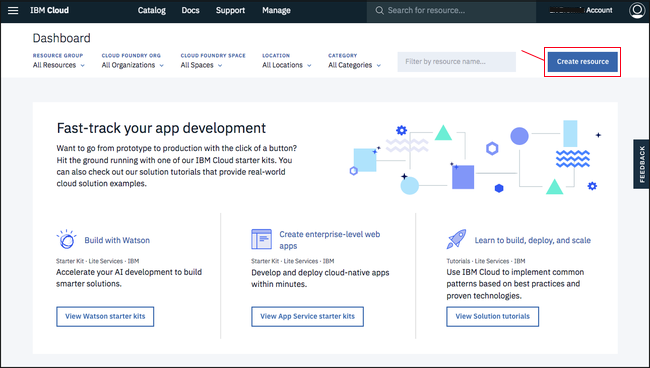
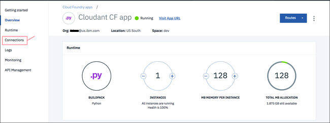

---

copyright:
  years: 2017
lastupdated: "2017-08-25"

---

{:new_window: target="_blank"}
{:shortdesc: .shortdesc}
{:screen: .screen}
{:codeblock: .codeblock}
{:pre: .pre}

<!-- Acrolinx: 2017-01-10 -->

# Création d'une application Bluemix simple permettant d'accéder à une base de données Cloudant : l'environnement d'application 

Cette section du tutoriel décrit comment configurer l'environnement d'application dont vous devez disposer pour créer une application {{site.data.keyword.Bluemix}}.
{:shortdesc}

<div id="creating"></div>

## Création d'un environnement d'application Bluemix

1.  Connectez-vous à votre compte {{site.data.keyword.Bluemix_notm}}.
    Le tableau de bord {{site.data.keyword.Bluemix_notm}} est disponible à l'adresse :
    [http://bluemix.net ](http://bluemix.net){:new_window}.
    Une fois que vous vous êtes authentifié avec votre nom d'utilisateur et votre mot de passe, le tableau de bord {{site.data.keyword.Bluemix_notm}} apparaît :<br/>
    

2.  Cliquez sur le lien '`Catalogue`' :<br/>
    <br/>
    La liste des services disponibles sur {{site.data.keyword.Bluemix_notm}} s'affiche. 

3.  Cliquez sur l'entrée '`Applications Cloud Foundry`' sous l'en-tête `Applications` :<br/>
    <br/>
    La liste des applications Cloud Foundry disponibles sur {{site.data.keyword.Bluemix_notm}} apparaît.

4.  Cliquez sur l'entrée '`Python`' :<br/>
    <br/>
    Un formulaire '`Créez une application Cloud Foundry`' apparaît.

5.  Utilisez le formulaire '`Créez une application Cloud Foundry`' pour spécifier et créer l'environnement de votre application Python Cloud Foundry.
    Nommez votre application, par exemple, '`Cloudant Python`'.
    Le nom d'hôte est automatiquement généré pour vous, même si vous avez la possibilité de le personnaliser.<br/>
    <br/>
    >   **Remarque** : Le nom d'hôte doit être unique au sein du domaine {{site.data.keyword.Bluemix_notm}}. Dans cet exemple, le domaine est '`mybluemix.net`', ce qui donne le nom d'hôte complet '`Cloudant-Python.mybluemix.net`'.

6.  Cliquez sur '`Créer`' pour créer l'environnement d'application : <br/>
    

7.  Après une courte pause, la fenêtre '`Initiation`' de votre nouvel environnement d'application s'affiche.
    Une application de test est automatiquement créée dans l'environnement. Cette application est démarrée automatiquement, comme indiqué par l'icône verte et le statut `Votre application est en cours d'exécution`.
    L'application est un programme à 'pulsations' suffisant pour montrer que le nouvel environnement d'application est prêt à être utilisé.
    Cliquez sur le lien `Tableau de bord`' pour revenir au tableau de bord de votre compte {{site.data.keyword.Bluemix_notm}}.<br/>
    

8.  Votre tableau de bord inclut désormais l'environnement d'application nouvellement créé : <br/>
    

Vous disposez maintenant d'un environnement d'application {{site.data.keyword.Bluemix_notm}} Python, prêt à être utilisé. 

Si vous souhaitez utiliser une instance de base de données {{site.data.keyword.cloudant_short_notm}}, vous devez maintenant créer une 'connexion' entre l'environnement d'application et l'instance de base de données. 

<div id="connecting"></div>

## Connexion des services et des applications Bluemix

Cette section du tutoriel explique comment connecter des services et des environnements d'application {{site.data.keyword.Bluemix_notm}} en utilisant la zone de configuration et de gestion de votre application.

1.  A partir de votre tableau de bord {{site.data.keyword.Bluemix_notm}}, cliquez sur l'entrée correspondant à votre application.<br/>
    <br/>
    >   **Remarque** : Evitez la colonne '`Route`' car le fait de cliquer sur le lien associé à votre application appelle l'application au lieu de vous amener dans la zone de configuration. Il est préférable de cliquer sur le nom de votre application.

    La zone d'aperçu de la configuration et de la gestion de votre application s'affiche. 

2.  Pour connecter l'environnement d'application à un autre service, cliquez sur le lien '`Connexions`' :<br/>
    <br/>
    Une zone permettant de configurer une connexion entre votre application et tout autre service disponible dans votre compte apparaît. 

3.  Ce tutoriel [requiert](create_bmxapp_prereq.html#prerequisites) une instance de base
de données {{site.data.keyword.cloudant_short_notm}} existante.
    Cliquez sur '`Connecter un existant`' pour établir une connexion entre cette instance de base de données et votre application:<br/>
    <br/>
    La liste des instances de service existantes de votre compte s'affiche. 

4.  Cliquez sur l'instance de base de données {{site.data.keyword.cloudant_short_notm}} que vous souhaitez utiliser.
    Ce tutoriel utilise l'instance '`Cloudant Service 2017`' : <br/>
    

5.  Vous êtes invité à confirmer que vous souhaitez réellement connecter l'instance de base de données à votre application.
    Cliquez sur '`Connecter`' pour confirmer la connexion : <br>
    

6.  La modification des connexions de service d'une application affecte sa configuration globale.
    Une modification requiert une 'reconstitution' de l'application, ce qui entraîne
l'arrêt forcé de l'application en cours d'exécution.
    Une fenêtre s'affiche et vous invite à confirmer que vous êtes prêt à effectuer le
processus de 'reconstitution'.
    Cliquez sur '`Reconstituer`' pour continuer :<br/>
    

7.  La page des connexions de service apparaît à nouveau.
Elle inclut désormais l'instance de base de données nouvellement connectée :<br/>
    

L'environnement d'application et l'instance de base de données sont maintenant connectés.
L'étape suivante consiste à vérifier que les outils requis sont installés et prêts à fonctionner avec les applications {{site.data.keyword.Bluemix_notm}}.

<div id="toolkits"></div>

## Kits d'outils de ligne de commande Cloud Foundry et Bluemix

Cette section du tutoriel décrit les kits d'outils qui doivent être installés pour fonctionner avec votre environnement {{site.data.keyword.Bluemix_notm}}, vos applications et vos services.

Le kit d'outils [Cloud Foundry ](https://en.wikipedia.org/wiki/Cloud_Foundry){:new_window} est une collection d'outils destinés à
être utilisés avec des applications déployées dans un environnement compatible avec Cloud Foundry.
Employez ces outils pour effectuer des tâches telles que la mise à jour d'une application
déployée, ou pour démarrer et arrêter une application en cours d'exécution. 

Le kit d'outils {{site.data.keyword.Bluemix_notm}} offre des fonctions
supplémentaires requises pour une utilisation avec des applications hébergées et exécutées dans un environnement {{site.data.keyword.Bluemix_notm}}.

> **Remarque** : Assurez-vous de bien installer les deux kits d'outils Cloud Foundry _et_ {{site.data.keyword.Bluemix_notm}}.

Le téléchargement et l'installation des kits d'outils est une tâche ponctuelle.
S'ils sont déjà installés et en fonctionnement sur votre système, il n'est pas nécessaire
de les télécharger à nouveau, sauf s'ils ont fait l'objet d'une mise à jour. 

Des informations générales sur les kits d'outils sont disponibles [ici ](https://console.ng.bluemix.net/docs/cli/index.html){:new_window}.

### Installation du kit d'outils Cloud Foundry

Certaines distributions de système d'exploitation disposent déjà d'une version disponible du kit d'outils Cloud Foundry.
S'il s'agit de la version 6.11 ou ultérieure, la version prise en charge est compatible avec {{site.data.keyword.Bluemix_notm}} et peut être utilisée.
Pour vérifier le niveau de la version installée, exécutez [ce test](#checkCFversion).

Vous pouvez également suivre les étapes ci-après pour télécharger et installer le kit d'outils Cloud Foundry sur votre système : 

1.  Un lien permettant de télécharger le kit d'outils Cloud Foundry est
disponible dans la fenêtre '`Initiation`' de votre environnement d'application :<br/>
    

2.  Cliquez sur ce lien pour accéder à la [page de téléchargement sur GitHub ](https://github.com/cloudfoundry/cli/releases){:new_window} :<br/>
    

3.  Téléchargez et exécutez la version la plus récente du programme d'installation correspondant à votre système. 

4.  <div id='checkCFversion'></div>Pour vérifier que vous disposez d'un kit d'outils Cloud Foundry compatible, exécutez la commande suivante à l'invite : 

    ```sh
    cf --version
    ```
    {:pre}
    
    Vous devez obtenir un résultat similaire à la sortie suivante : 
    
    ```
    cf version 6.20.0+25b1961-2016-06-29
    ```
    {:codeblock}
    
    >   **Remarque** : Seules les versions 6.11 ou ultérieures du kit d'outils Cloud Foundry sont compatibles avec {{site.data.keyword.Bluemix_notm}}.

### Installation du kit d'outils Bluemix

Procédez comme suit pour télécharger et installer l' kit d'outils {{site.data.keyword.Bluemix_notm}} sur votre système.

1.  Un lien permettant de télécharger le kit d'outils {{site.data.keyword.Bluemix_notm}} est disponible dans la fenêtre '`Initiation`' de votre application :<br/>
    

2.  Cliquez sur ce lien pour accéder à la [page de téléchargement ](http://clis.ng.bluemix.net/ui/home.html){:new_window} :<br/>
    

3.  Téléchargez et exécutez le programme d'installation approprié correspondant à votre système.

    Le programme d'installation vérifie que la version installée du kit d'outils Cloud Foundry est appropriée.
    Si tout est correct, le kit d'outils {{site.data.keyword.Bluemix_notm}} est installé sur votre système.

4.  Pour vérifier que vous disposez d'un kit d'outils {{site.data.keyword.Bluemix_notm}} approprié, exécutez la commande suivante à l'invite :
    
    ```sh
    bluemix --version
    ```
    {:pre}
    
    Vous devez obtenir un résultat similaire à la sortie suivante : 
    
    ```
    bluemix version 0.4.5+03c29de-2016-12-08T07:01:01+00:00
    ```
    {:codeblock}
    
Les outils destinés à être utilisés avec les applications {{site.data.keyword.Bluemix_notm}} sont désormais disponibles.
L'étape suivante consiste à obtenir les éléments de démarrage pour créer une application {{site.data.keyword.Bluemix_notm}}.

<div id="starter"></div>

## Application de démarrage

Cette section du tutoriel décrit une application de démarrage {{site.data.keyword.Bluemix_notm}} et explique comment la personnaliser afin qu'elle accède à une instance de base de données {{site.data.keyword.cloudant_short_notm}}.

Une application de démarrage {{site.data.keyword.Bluemix_notm}} est la
collection la plus petite possible de fichiers source et de configuration nécessaires à la
création d'une application {{site.data.keyword.Bluemix_notm}} pouvant être exécutée.
Par certains aspects, elle est similaire à une [application 'Hello World' ](https://en.wikipedia.org/wiki/%22Hello,_World!%22_program){:new_window} ; elle suffit à montrer que le système et la configuration de base fonctionnent correctement.

Une application de démarrage {{site.data.keyword.Bluemix_notm}} est une archive de fichiers exemples que vous devez modifier ou étendre au fur et à mesure que vous développez votre application {{site.data.keyword.Bluemix_notm}}.

Trois fichiers en particulier sont essentiels :

-   ['`Procfile`'](#procfile)
-   ['`manifest.yml`'](#manifest)
-   ['`requirements.txt`'](#requirements)

<div id="procfile"></div>

### Fichier '`Procfile`'

Le fichier '`Procfile`' contient les détails requis par {{site.data.keyword.Bluemix_notm}} pour l'exécution de votre application.

Plus spécifiquement, un fichier '`Procfile`' est un artefact Cloud Foundry qui définit un type de processus applicatif et la commande permettant d'exécuter l'application.
Vous trouvez plus d'informations sur '`Procfile`' [ici ](https://docs.cloudfoundry.org/buildpacks/prod-server.html#procfile){:new_window}.

Le fichier '`Procfile`' d'une application de démarrage {{site.data.keyword.Bluemix_notm}} Python est similaire à l'exemple suivant : 

```
web: python server.py
```
{:codeblock}

Cet exemple indique que l'application est une application Web Python et qu'elle est démarrée via la commande :

```sh
python server.py
```
{:codeblock}

Un fichier source Python de démarrage '`server.py`' est inclus dans l'archive de l'application de démarrage.
Le fichier '`server.py`' est modifié par votre application.
Vous pouvez également créer un fichier source Python entièrement nouveau.
Vous devez alors mettre à jour le fichier '`Procfile`' de telle sorte qu'il utilisé le nouveau fichier au démarrage de votre application.

<div id="manifest"></div>

### Fichier '`manifest.yml`'

Le fichier '`manifest.yml`' est une description complète de l'application et de l'environnement qu'elle requiert pour s'exécuter. 

Le fichier d'une application de démarrage {{site.data.keyword.Bluemix_notm}} Python ressemble à l'exemple suivant : 

```
applications:
- path: .
  memory: 128M
  instances: 1
  domain: mybluemix.net
  name: Cloudant Python
  host: Cloudant-Python
  disk_quota: 1024M
  services:
  - Cloudant Service 2017
```
{:codeblock}

Il est important de noter les trois points suivants :

-   Les valeurs de '`domain`', '`name`' et '`host`' correspondent aux valeurs saisies lors de la [création](#creating) de votre application {{site.data.keyword.Bluemix_notm}}.
-   La valeur de '`name`' est utilisée par le kit d'outils Cloud Foundry pour identifier l'application que vous administrez.
-   La valeur de '`services`' confirme que l'instance de base de données {{site.data.keyword.cloudant_short_notm}} '`Cloudant Service 2017`' est connectée à l'environnement d'application. 

Il n'est normalement pas nécessaire de modifier le fichier '`manifest.yml`'. Il est cependant utile de comprendre la raison de sa présence et son utilité au fonctionnement de votre application.

<div id="requirements"></div>

### Fichier '`requirements.txt`'

Le fichier '`requirements.txt`' spécifie les éventuels composants supplémentaires requis pour le fonctionnement de votre application.

Dans l'application de démarrage, le fichier '`requirements.txt`' est vide.

Toutefois, dans ce tutoriel, l'application Python accède à une instance de base de données {{site.data.keyword.cloudant_short_notm}}.
L'application doit donc pouvoir utiliser la [bibliothèque client {{site.data.keyword.cloudant_short_notm}} pour les applications Python](../libraries/supported.html#python).

Pour activer la bibliothèque client Python, modifiez le fichier '`requirements.txt`' de la manière suivante :
```
cloudant==2.3.1
```
{:codeblock}

## Etape suivante

L'étape suivante du tutoriel consiste à [créer l'application](create_bmxapp_createapp.html).
