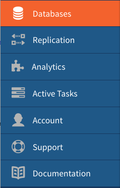
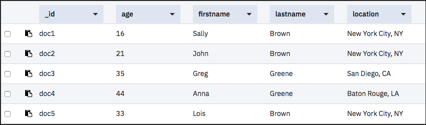

---

copyright:
  years: 2017, 2018
lastupdated: "2018-10-24"

---

{:new_window: target="_blank"}
{:shortdesc: .shortdesc}
{:screen: .screen}
{:codeblock: .codeblock}
{:pre: .pre}
{:tip: .tip}

<!-- Acrolinx: 2017-05-10 -->

# Création d'une requête {{site.data.keyword.cloudant_short_notm}}

Ce tutoriel indique comment créer une base de données, la remplir de documents, créer un index et utiliser ce dernier pour interroger la base de données.

Des exercices sont fournis pour la _ligne de commande_  et le _tableau de bord {{site.data.keyword.cloud}}_ . Les
exercices du tableau de bord {{site.data.keyword.cloud_notm}} vous donnent un exemple visuel de chaque
tâche. Pour plus d'informations, vous pouvez suivre les liens tout au long du tutoriel.

Commencez par créer la base de données `query-demo` et certains documents qui contiennent les données nécessaires à ces exercices.

## Hypothèses

Avant de commencer, effectuez les étapes de préparation en vue du tutoriel en procédant comme suit :

1.  [Créez un compte {{site.data.keyword.cloud_notm}} ](https://console.ng.bluemix.net/registration/){:new_window}.
2.  Connectez-vous au [tableau de bord {{site.data.keyword.cloud_notm}} ](https://console.ng.bluemix.net/catalog/services/cloudant-nosql-db){:new_window}.
3.  [Créez une instance {{site.data.keyword.cloudant_short_notm}} sur {{site.data.keyword.cloud_notm}}](create_service.html#creating-a-service-instance).
4.  (Facultatif) [Créez un alias acurl](../guides/acurl.html#authorized-curl-acurl-) pour faciliter et accélérer l'exécution des commandes à partir de la ligne de commande.
5.  Remplacez la variable `$ACCOUNT` dans les commandes incluses dans les exercices par le nom d'utilisateur employé pour la connexion au tableau de bord {{site.data.keyword.cloudant_short_notm}}.
  Si vous décidez de ne pas configurer `acurl`, utilisez l'URL suivante au lieu de celle fournie dans les exercices :
  ``` sh
  curl https://$USERNAME:$PASSWORD@$ACCOUNT.cloudant.com/query-demo
  ```
  {:codeblock}

## Création d'une base de données

Dans cette section, vous allez créer la [base de données](../api/database.html#create)
`query-demo` qui est la base de données employée dans ce tutoriel.

> **Remarque :** Dans ce tutoriel, l'alias `acurl` est utilisé plutôt que la commande `curl`.
  Pour créer l'alias `acurl`, suivez les étapes décrites [ici](../guides/acurl.html#authorized-curl-acurl-).
  Si vous préférez utiliser la commande `curl` ou une autre méthode pour
appeler les noeuds finaux d'API, indiquez votre commande dans le tutoriel, ainsi que les
paramètres qu'elle requiert, comme le nom d'utilisateur et le mot de passe.

 _Ligne de commande_

1.  Créez une base de données en exécutant la commande suivante :
  ``` sh
  acurl https://$ACCOUNT.cloudant.com/query-demo -X PUT
  ```
  {:codeblock}
2.  Examinez les résultats :
  ```json
  {
    "ok": true
  }
  ```
  {:codeblock}

 _{{site.data.keyword.cloud_notm}}Tableau de bord _

1.  Ouvrez l'instance de service {{site.data.keyword.cloudant_short_notm}} que vous avez créée.
2.  Sur la page de service {{site.data.keyword.cloudant_short_notm}}, cliquez sur **Lancer**.
    L'onglet Bases de données s'ouvre.
    
  
4.  Cliquez sur **Créer une base de données**.
5.  Entrez `query-demo` et cliquez sur **Créer**.

  La base de données `query-demo` s'ouvre automatiquement.

## Création de documents dans la base de données

Les [documents](../api/document.html#documents) que vous créez
dans cet exercice contiennent les données que vous utiliserez pour interroger la base de
données `query-demo` dans les exercices suivants.

 _Ligne de commande_

1.  Copiez le texte exemple dans un fichier de données nommé `bulkcreate.dat` afin de créer cinq documents :
  ```json
  {
    "docs":
    [
      {
        "_id": "doc1",
        "firstname": "Sally",
        "lastname": "Brown",
        "age": 16,
        "location": "New York City, NY"
      },
      {
        "_id": "doc2",
        "firstname": "John",
        "lastname": "Brown",
        "age": 21,
        "location": "New York City, NY"
      },
      {
        "_id": "doc3",
        "firstname": "Greg",
        "lastname": "Greene",
        "age": 35,
        "location": "San Diego, CA"
      },
      {
        "_id": "doc4",
        "firstname": "Anna",
        "lastname": "Greene",
        "age": 44,
        "location": "Baton Rouge, LA"
      },
      {
        "_id": "doc5",
        "firstname": "Lois",
        "lastname": "Brown",
        "age": 33,
        "location": "Syracuse, NY"
      }
    ]
  }
  ```
  {:codeblock}

2.  Exécutez cette commande pour créer les documents :
  ```sh
  acurl https://$ACCOUNT.cloudant.com/query-demo/_bulk_docs -X POST -H "Content-Type: application/json" -d \@bulkcreate.dat
  ```
  {:codeblock}

  **Remarque :** Le symbole '`@`', utilisé
pour indiquer que les données sont incluses dans un fichier, est identifié par le nom fourni.
3.  Examinez les résultats :
  ```json
  [
    {
      "ok":true,
      "id":"doc1",
      "rev":"1-57a08e644ca8c1bb8d8931240427162e"
    },
    {
      "ok":true,
      "id":"doc2",
      "rev":"1-bf51eef712165a9999a52a97e2209ac0"
    },
    {
      "ok":true,
      "id":"doc3",
      "rev":"1-9c9f9b893fcdd1cbe09420bc4e62cc71"
    },
    {
      "ok":true, "id":"doc4",
      "rev":"1-6aa4873443ddce569b27ab35d7bf78a2"
    },
    {
      "ok":true,
      "id":"doc5",
      "rev":"1-d881d863052cd9681650773206c0d65a"
    }
  ]
  ```
  {:codeblock}

 _{{site.data.keyword.cloud_notm}}Tableau de bord _

1.  Cliquez sur **`+`** et sélectionnez **New Doc**. La fenêtre 'New Document' apparaît.
2.  Pour créer un document, copiez le texte exemple suivant et remplacez le texte existant dans le nouveau document.

  _Premier modèle de document_ :
  ```json
  {
    "firstname": "Sally",
    "lastname": "Brown",
    "age": 16,
    "location": "New York City, NY",
    "_id": "doc1"
  }
  ```
  {:codeblock}

3.  Répétez l'étape 2 pour ajouter les documents restants à la base de données.

  _Deuxième modèle de document_ :
  ```json
  {
    "firstname": "John",
    "lastname": "Brown",
    "age": 21,
    "location": "New York City, NY",
    "_id": "doc2"
  }
  ```
  {:codeblock}

  _Troisième modèle de document_ :
  ```json
  {
    "firstname": "Greg",
    "lastname": "Greene",
    "age": 35,
    "location": "San Diego, CA",
    "_id": "doc3"
  }
  ```
  {:codeblock}

  _Quatrième modèle de document_ :
  ```json
  {
    "firstname": "Anna",
    "lastname": "Greene",
    "age": 44,
    "location": "Baton Rouge, LA",
    "_id": "doc4"
  }
  ```
  {:codeblock}

  _Cinquième modèle de document_ :
  ```json
  {
    "firstname": "Lois",
    "lastname": "Brown",
    "age": 33,
    "location": "New York City, NY",
    "_id": "doc5"
  }
  ```
  {:codeblock}

  La base de données `query-demo` a été remplie avec cinq enregistrements. Ils sont visibles dans la vue Table dans la capture d'écran suivante :

       

## Création d'un index

{{site.data.keyword.cloudant_short_notm}} fournit des vues et des index permettant d'interroger la base de données. Une
vue exécute une requête qui est sauvegardée sur la base de données et dont le résultat est appelé ensemble de résultats. Lorsque
vous soumettez une requête sur la vue, votre requête recherche l'ensemble de
résultats. Un index permet de structurer les données et d'améliorer ainsi la durée nécessaire à l'extraction.

Vous pouvez utiliser l'index primaire fourni avec {{site.data.keyword.cloudant_short_notm}}, ou les index secondaires comme les vues
(MapReduce), les index de recherche, les requêtes {{site.data.keyword.cloudant_short_notm}}
Geospatial ou {{site.data.keyword.cloudant_short_notm}} Query comme indiqué dans la liste suivante :

*	Index primaire : recherchez un document ou une liste de documents par ID.  
*	[Vue](../api/creating_views.html#views-mapreduce-) : recherchez les informations de la base de données qui correspondent aux critères de recherche que vous indiquez, comme les comptages, les sommes, les moyennes et d'autres fonctions mathématiques. Les critères que vous recherchez sont spécifiés dans la définition de la vue. Les vues utilisent le paradigme MapReduce.
*	[Index de recherche](../api/search.html#search) : recherchez une ou plusieurs zones, de grandes quantités de texte ou utilisez des caractères génériques, des correspondances partielles ou des facettes avec la [syntaxe de Lucene Query Parser ](http://lucene.apache.org/core/4_3_0/queryparser/org/apache/lucene/queryparser/classic/package-summary.html#Overview){:new_window}.
*	[{{site.data.keyword.cloudant_short_notm}} Geospatial](../api/cloudant-geo.html#cloudant-geospatial) : recherchez des documents en fonction d'une relation spatiale.
*	[{{site.data.keyword.cloudant_short_notm}} Query](../api/cloudant_query.html#query) : utilisez la syntaxe de requête de style Mongo pour rechercher des documents à l'aide d'opérateurs logiques. {{site.data.keyword.cloudant_short_notm}} Query combine une vue et un index de recherche. Ce tutoriel utilise {{site.data.keyword.cloudant_short_notm}} Query.

> **Remarque :** Si aucun index défini correspondant à la requête spécifiée n'est disponible, {{site.data.keyword.cloudant_short_notm}}
> utilise l'index `_all_docs`.


 _Ligne de commande_

1.  Copiez l'exemple de données JSON suivant dans un fichier nommé `query-index.dat`.
  ```json
{
	"index": {
		"fields": [
			"age",
			"lastname"
		],
		"partial_filter_selector": {
			"age": {
				"$gte": 30
			},
			"lastname": {
				"$eq": "Greene"
			}
		}
	},
  		"ddoc": "partial-index",
		"type": "json"
}
  ```
  {:codeblock}

2.  Exécutez la commande suivante pour créer un index :
  ```sh
  acurl https://$ACCOUNT.cloudant.com/query-demo/_index -X POST -H "Content-Type: application/json" -d \@query-index.dat
  ```
  {:codeblock}

3.  Examinez les résultats :
  ```json
  {
    "result":"created",
    "id":"_design/752c7031f3eaee0f907d18e1424ad387459bfc1d",
    "name":"query-index"
  }
  ```
  {:codeblock}


 _{{site.data.keyword.cloud_notm}}Tableau de bord _

1.  Cliquez sur **`+` > Query Indexes** sur l'onglet **All Documents** ou **Design Documents**.
2.  Collez l'exemple de données JSON suivant dans la zone **Index** :
  ```json
{
	"index": {
		"fields": [
			"age",
			"lastname"
		],
		"partial_filter_selector": {
			"age": {
				"$gte": 30
			},
			"lastname": {
				"$eq": "Greene"
			}
		}
	},
  		"ddoc": "partial-index",
		"type": "json"
}
  ```
  {:codeblock}

  L'index a été créé. La capture d'écran suivante illustre cet index :

  


## Création d'une requête

Les requêtes vous permettent d'extraire les données de {{site.data.keyword.cloudant_short_notm}}. Une [requête](../api/cloudant_query.html#query) bien rédigée peut affiner
votre recherche et ses résultats et n'y inclure que les données dont vous avez besoin.

Cet exercice indique comment écrire et exécuter une requête simple, une
requête avec deux zones et une requête avec deux [opérateurs](../api/cloudant_query.html#cloudant_query.html#operators).
Pour procéder à une requête avec un opérateur, spécifiez au moins une zone et sa valeur
correspondante.
La requête utilise ensuite cette valeur pour rechercher des correspondances dans la base
de données.

Pour obtenir la requête la plus simple possible, ajoutez le code JSON à un fichier de données et exécutez-le à partir de la ligne de commande.

### Exécution d'une requête simple

Cet exemple indique comment {{site.data.keyword.cloudant_short_notm}} Query utilise `query-index` pour rechercher
`lastname` et filtrer les résultats en mémoire afin de rechercher `firstaname`.   

 _Ligne de commande_

1.  Copiez l'exemple JSON suivant dans un fichier de données nommé `query1.dat`.
  ```json
    {
      "selector": {
            "lastname" : "Greene",
            "firstname" : "Anna"
         }
    }       
  ```    
  {:codeblock}

2.  Exécutez la commande suivante pour interroger la base de données :
  ```sh
  acurl https://$ACCOUNT.cloudant.com/query-demo/_find -X POST -H "Content-Type: application/json" -d \@query1.dat
  ```
  {:codeblock}

3.  Examinez les résultats de la requête :
  ```json
  {
    "docs": [
      {
        "_id":"doc4",
        "_rev":"3-751ab049e8b5dd1ba045cea010a33a72",
            "firstname":"Anna",
            "lastname":"Greene",
            "age":44,
            "location":"Baton Rouge, LA"
      }
    ]
  }
  ```
  {:codeblock}

 _{{site.data.keyword.cloud_notm}}Tableau de bord _

1.  Cliquez sur l'onglet **Query**.
2.  Copiez et collez l'exemple JSON suivant dans la fenêtre {{site.data.keyword.cloudant_short_notm}} Query :
  ```json
   {
      "selector": {
            "lastname" : "Greene",
            "firstname" : "Anna"
         }
   }
  ```
  {:codeblock}

3.  Cliquez sur **Run Query**.

  Les résultats de la requête s'affichent. Ils sont visibles dans la vue Table dans la capture d'écran suivante :

  

### Exécution d'une requête avec deux zones

Cet exemple utilise deux zones pour rechercher toutes les personnes nommées `Brown` et habitant à `New York City, NY`.

La recherche est effectuée via une [expression 'selector'](../api/cloudant_query.html#selector-syntax)
similaire à l'exemple suivant :
```json
  {
    "selector": {
      "lastname": "Brown",
      "location": "New York City, NY"
    }
  }
```
{:codeblock}

Vous pouvez personnaliser les résultats en fonction de vos besoin en ajoutant plus
de détails dans l'expression selector.
Le paramètre `fields` indique les zones à inclure dans les
résultats. Dans cet exemple, les résultats comprennent le prénom, le nom de famille et
l'emplacement. Il sont triés par le prénom dans l'ordre croissant des valeurs du paramètre `sort`.
Les détails supplémentaires sont similaires à l'exemple suivant :
```json
{
  ...
  "fields": [
    "firstname",
      "lastname",
      "location"
  ]
}
```  
{:codeblock}

 _Ligne de commande_

1.  Copiez l'exemple JSON dans un fichier de données nommé `query2.dat`.
  ```json
  {
    "selector": {
      "lastname": "Brown",
      "location": "New York City, NY"
    },
    "fields": [
     "firstname",
     "lastname",
     "location"
  ]
  }
  ```
  {:codeblock}

2.  Exécutez la commande suivante pour interroger la base de données :
  ```sh
  acurl https://$ACCOUNT.cloudant.com/query-demo/_find -X POST -H "Content-Type: application/json" -d \@query2.dat
  ```
  {:codeblock}

3.  Examinez les résultats de la requête :
  ```json
  {
    "docs": [
      {
        "firstname": "Sally",
        "lastname": "Brown",
        "location": "New York City, NY"
      },
      {
        "firstname": "John",
        "lastname": "Brown",
        "location": "New York City, NY"
      },
      {
        "firstname": "Lois",
        "lastname": "Brown",
        "location": "New York City, NY"
      }
    ]
  }
  ```
  {:codeblock}

 _{{site.data.keyword.cloud_notm}}Tableau de bord _

1.  Cliquez sur l'onglet **Query**.
2.  Copiez et collez l'exemple JSON suivant dans la fenêtre {{site.data.keyword.cloudant_short_notm}} Query :
  ```json
  {
    "selector": {
      "lastname": "Brown",
      "location": "New York City, NY"
    },
    "fields": [
      "firstname",
      "lastname",
      "location"
    ] 
  }
  ```
  {:codeblock}

3.  Cliquez sur **Run Query**.

  Les résultats de la requête s'affichent. Ils sont visibles dans la vue Table dans la capture d'écran suivante :

  

### Exécution d'une requête avec des opérateurs

Dans cet exemple, les opérateurs `$eq` (égal à) et `$gt` (supérieur à) sont employés pour rechercher des documents qui
contiennent le nom de famille `Greene` et un âge supérieur à `30`.

Utilisez une expression selector similaire à l'exemple suivant :
```json
{
  "selector": {
    "age": {
      "$gt": 30
    },
    "lastname": {
      "$eq": "Greene"
    }
  }
}
``` 
{:codeblock}

Il sont triés par âge dans l'ordre croissant des valeurs spécifiées au paramètre `sort`.

```json
    "sort": [
      {
        "age": "asc"   
      }
    ] 
```  
{:codeblock}

 _Ligne de commande_

1.  Copiez l'exemple JSON suivant dans un fichier nommé `query3.dat`.
  ```json
{
   "selector": {
      "age": {
         "$gt": 30
      },
    "lastname": {
         "$eq": "Greene"
    }
   },
    "fields": [
      "age",
      "firstname"
   ],
    "sort": [
      {
         "age": "asc"   
      }
   ],
   "use_index": "_design/partial-index"
}
  ```
  {:codeblock}

2. Exécutez cette requête :
  ```sh
  acurl https://$ACCOUNT.cloudant.com/query-demo/_find -X POST -H "Content-Type: application/json" -d \@query3.dat
  ```
  {:codeblock}

3.  Examinez les résultats de la requête :
  ```json
{"docs":[
     {"age":35,"firstname":"Greg"},
     {"age":44,"firstname":"Anna"}
   ],
"bookmark": "g1AAAABCeJzLYWBgYMpgSmHgKy5JLCrJTq2MT8lPzkzJBYqzAFkmIDkOmFwOSHWiDkiSzb0oNTUvNSsLAEsmEeQ"
}
  ```
  {:codeblock}

 _{{site.data.keyword.cloud_notm}}Tableau de bord _

1.  Cliquez sur l'onglet **Query**.
2.  Copiez et collez l'exemple JSON suivant dans la fenêtre {{site.data.keyword.cloudant_short_notm}} Query :
  ```json
{
   "selector": {
      "age": {
         "$gt": 30
      },
    "lastname": {
         "$eq": "Greene"
    }
   },
    "fields": [
      "age",
      "firstname"
   ],
    "sort": [
      {
         "age": "asc"   
      }
   ],
   "use_index": "_design/partial-index"
}
  ```
  {:codeblock}

3.  Cliquez sur **Run Query**.

  Les résultats de la requête s'affichent. Ils sont visibles dans la vue Table dans la capture d'écran suivante :

  

Pour plus d'informations sur {{site.data.keyword.cloudant_short_notm}}, reportez-vous à la [documentation {{site.data.keyword.cloudant_short_notm}}](../cloudant.html#overview).
