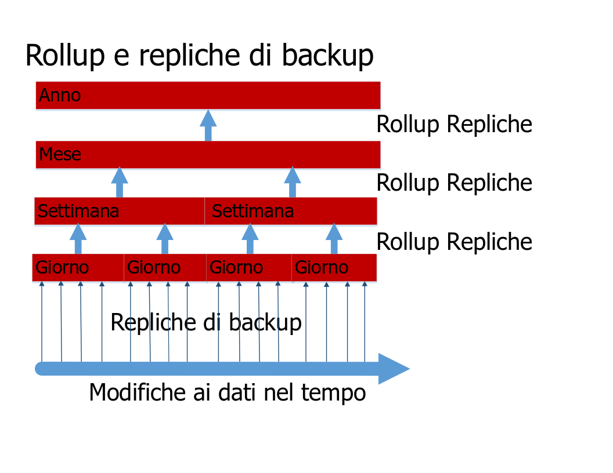

---

copyright:
  years: 2015, 2017
lastupdated: "2017-05-04"

---

{:new_window: target="_blank"}
{:shortdesc: .shortdesc}
{:screen: .screen}
{:codeblock: .codeblock}
{:pre: .pre}

# Backup dei dati

>   **Nota**: questa guida fa riferimento a una funzionalità di backup incrementale giornaliera *obsoleta*,
    precedentemente disponibile solo su richiesta per i clienti aziendali.
    Per le istruzioni di backup aggiornate,
    consulta la guida [Ripristino di emergenza e backup](disaster-recovery-and-backup.html).

Questa funzionalità:
-   Non è abilitata per impostazione predefinita.
-   È disponibile solo per i clienti aziendali, che devono specificamente farne richiesta.
-   Deve essere configurata esplicitamente prima che sia operativa.
-   È soggetta a [limitazioni note](#known-limitations).
-   Non è applicabile a [Cloudant Local ](https://www.ibm.com/support/knowledgecenter/SSTPQH_1.0.0/com.ibm.cloudant.local.doc/SSTPQH_1.0.0_welcome.html){:new_window}.
Per ulteriori informazioni,
contatta il [team di supporto di IBM Cloudant ](mailto:support@cloudant.com){:new_window}.

>   **Nota**: la funzionalità di backup incrementale giornaliero non è applicabile per
    [Cloudant Local ](https://www.ibm.com/support/knowledgecenter/SSTPQH_1.0.0/com.ibm.cloudant.local.doc/SSTPQH_1.0.0_welcome.html){:new_window}.
    Per eseguire il backup dei dati in Cloudant Local,
    utilizza la [replica](../api/replication.html) per creare una copia del tuo database.

Per garantire l'alta disponibilità,
{{site.data.keyword.cloudant}} crea tre copie di ogni documento
e le memorizza su tre diversi server in un cluster.
Questa procedura è predefinita per tutti gli utenti di Cloudant.
Anche quando i tuoi dati vengono replicati in triplice copia,
è comunque importante eseguirne il backup.

Perché è importante il backup?
In generale,
potresti perdere l'accesso ai dati in molti modi.
Ad esempio,
se un uragano distruggesse il tuo data center e tutti e tre i nodi sono in quella posizione,
perderesti i tuoi dati.
Puoi impedire la perdita dei dati in caso di calamità replicando i tuoi dati in un
cluster (dedicato o a più tenant) in una posizione geografica differente.
Tuttavia,
se un'applicazione malfunzionante elimina o sovrascrive i tuo dati nel database,
i dati duplicati non sono utili.

Avere un backup
completo e testato consente di rispondere con sicurezza alla seguente domanda:
"Come possiamo ripristinare i dati in caso di perdita o danneggiamento?"

Con Cloudant,
i clienti aziendali possono avere backup incrementali giornalieri.

Se non sei un cliente aziendale
o desideri creare il tuo proprio meccanismo di backup,
valuta la possibilità di [utilizzare la replica per eseguire i backup](disaster-recovery-and-backup.html).

>   **Nota**: il backup incrementale giornaliero per i clienti aziendali è attualmente una funzionalità *Beta*.
    Tale funzione non è abilitata per impostazione predefinita.

I backup incrementali giornalieri o 'delta' consentono il confronto dei documenti
e un ripristino più semplice dei singoli documenti.
A intervalli regolari,
che possono essere configurati,
i delta giornalieri più piccoli vengono riepilogati in delta settimanali.
Allo stesso modo,
i delta settimanali sono riepilogati in delta mensili e
i delta mensili in quelli annuali.
Questo processo di rollup dei delta è un compromesso pragmatico tra
la capacità di ripristinare esattamente la versione corretta di un documento
e la richiesta di molto spazio di archiviazione.

La funzione di backup ti consente di ripristinare singoli documenti manualmente.
Nel caso in cui volessi ripristinare un intero database,
ad esempio come parte di uno scenario di ripristino di emergenza,
puoi contattare il team di supporto e ripristinare i dati per un determinato giorno,
settimana,
mese o anno,
in base ai delta che hai a disposizione.

Ulteriori informazioni su come Cloudant esegue il backup dei dati sono fornite nel resto di questo argomento.
Per ulteriore assistenza
o per richiedere l'abilitazione del backup dei dati,
contatta il team di supporto Cloudant:
[support@cloudant.com ](mailto:support@cloudant.com){:new_window}.

>   **Nota**: la funzione di backup di Cloudant è disponibile solo per i clienti aziendali.

>   **Nota**: per impostazione predefinita,
    non viene eseguito il backup dei documenti `_design`
    pertanto gli indici _non_ vengono creati sui database di backup incrementale.
    Se hai bisogno di eseguire i backup dei documenti `_design`,
    devi mantenerli nel tuo strumento di controllo origine preferito.

## Concetti

È utile comprendere i seguenti termini quando si riferiscono a concetti di backup:

Termine                 | Significato
---------------------|--------
Cleanup del backup       | Una volta che un database delta è stato riepilogato, questo database viene rimosso dopo un periodo di tempo configurabile. Ciò ti consente di bilanciare la conservazione dei dati ad una granularità superiore rispetto al costo di archiviazione.
Rollup di backup        | I backup giornalieri vengono combinati in database riepilogativi settimanali. Questi combinano i delta giornalieri in un backup più grande (meno granulare). Allo stesso modo, i database settimanali vengono riepilogati in database mensili e i database mensili in database annuali.
Esecuzione di backup           | Per un periodo di backup, il database di origine viene replicato utilizzando i valori di sequenza per determinare i documenti che sono stati modificati durante il periodo di backup. Al completamento, questa replica viene detta backup giornaliero.
Backup base di riferimento      | Una raccolta di documenti rispetto a cui è possibile confrontare un database delta.
Backup giornaliero         | Vedi Esecuzione di backup.
Delta giornaliero          | Un altro nome per un backup giornaliero.
Database delta       | La raccolta dei documenti che sono stati modificati nel corso di un periodo di tempo (il 'delta').
Granularità alta/bassa | Indica con quanta precisione puoi specificare il periodo di modifica per un documento. Un rollup con granularità alta ha una scadenza breve per il periodo di modifica, ad esempio un giorno nel caso di un backup giornaliero. Un rollup con granularità bassa ha una scadenza lunga per il periodo di modifica, ad esempio un anno nel caso di un backup annuale.
Backup incrementale   | La raccolta dei documenti che sono stati modificati nel database dall'ultimo backup.
Rollup              | Aggregare una raccolta di backup incrementali in un backup con granularità inferiore, ad esempio aggregare i backup giornalieri per una settimana in un unico backup 'settimanale'.

## Backup incrementali

Il primo passo per abilitare i backup incrementali è quello di eseguire un backup completo dell'intero database.
Questo fornisce una 'base di riferimento' per i successivi backup incrementali.

Ogni giorno,
dopo il primo backup della 'base di riferimento',
viene effettuato un
backup incrementale giornaliero.
Questo backup incrementale giornaliero contiene solo i dati che sono stati modificati nel database dall'ultimo backup.
Il backup giornaliero è il 'delta giornaliero'.

Come parte della richiesta per abilitare i backup dei dati,
puoi specificare un'ora del giorno per eseguire il backup.
Il delta giornaliero viene creato ogni giorno,
all'ora specificata.

## Rollup

Un rollup combina i backup giornalieri in database riepilogativi
settimanali.
Questi database riepilogativi combinano i delta giornalieri in
intervalli di tempo più grandi o
'meno granulari'.
I database settimanali vengono riepilogati in database mensili
e i database mensili vengono riepilogati in database annuali.



Quando richiedi che i backup vengano abilitati,
devi specificare il numero di delta giornalieri da conservare.
Una volta raggiunto questo numero,
il delta giornaliero più vecchio viene riepilogato nel database settimanale più recente.
Successivamente,
i database settimanali vengono riepilogati per creare database mensili e
così via.

Una volta che i database delta sono stati riepilogati,
vengono rimossi per liberare spazio di archiviazione.

## Ripristini

Se hai dei backup relativi a un database,
puoi visualizzare i singoli documenti all'interno di tale database
e puoi vedere anche le modifiche apportate a un determinato documento.
Puoi anche ripristinare il documento alla versione che era corrente in una data particolare,
se è disponibile all'interno della granularità del delta.

>   **Nota**: i documenti devono essere statici prima del ripristino dal backup.
    In altre parole,
    i documenti non devono ricevere costantemente modifiche e aggiornamenti.

Per i ripristini più complessi,
come un ripristino completo del database,
richiedi assistenza al [supporto Cloudant ](mailto:support@cloudant.com){:new_window}.

## Utilizzo del dashboard

I clienti aziendali possono riesaminare lo stato e la cronologia dei backup utilizzando il dashboard Cloudant.

Le attività che puoi eseguire comprendono:

-   Visualizzare lo stato dell'ultimo backup,
    incluso la data e ora.
-   Visualizzare un elenco di versioni del documento di backup per data e ora.
-   Visualizzare un documento corrente e la differenza tra questo e qualsiasi versione di backup.
-   Ripristinare un documento da una versione di backup.

### Visualizzazione dello stato di backup del database


Quando selezioni la scheda Database all'interno del dashboard Cloudant,
puoi visualizzare una colonna degli stati di backup per ognuno dei tuoi database.

### Visualizzazione dello stato di backup dei documenti


All'interno di un database,
puoi visualizzare lo stato di backup di uno specifico documento.
Per farlo,
devi prima verificare che sia presente un'icona di backup
()
per il tuo documento.
Ciò mostra se il documento specifico è incluso nell'attività di backup.

Quando selezioni il documento,
puoi vedere una scheda di backup.


### Visualizzazione delle differenze tra le versioni di backup dei documenti e ripristino


Quando fai clic sulla scheda di backup per un documento,
puoi vedere le differenze tra la versione corrente del documento
e qualsiasi altra versione di backup.

Se decidi di ripristinare una specifica versione di backup di tale documento,
seleziona semplicemente la data del backup da ripristinare
e fai clic sul pulsante 'Ripristina'.

>   **Nota**: i documenti devono essere in uno stato stabile prima del ripristino dal backup.
    In altre parole,
    i documenti non devono ricevere costantemente modifiche e aggiornamenti.

## Utilizzo dell'API

È disponibile un certo numero di chiamate API REST per lavorare con la funzione di backup di Cloudant.

### Configurazione di attività

La chiamata `task` richiama la configurazione dell'attività di backup per l'utente.

Puoi specificare il formato utilizzato nella risposta utilizzando il parametro `format`.

_Esempio di richiesta della configurazione dell'attività di backup per l'utente,
che restituisce i risultati in un formato elenco (predefinito), utilizzando HTTP:_

```http
GET /_api/v2/backup/task HTTP/1.1
```
{:codeblock}

_Esempio di richiesta della configurazione dell'attività di backup per l'utente,
che restituisce i risultati in un formato elenco (predefinito), utilizzando la riga di comando:_

```sh
curl https://$ACCOUNT.cloudant.com/_api/v2/backup/task \
    -X GET
```
{:codeblock}

_Esempio di richiesta della configurazione dell'attività di backup per l'utente,
che restituisce i risultati in un formato di mappatura, utilizzando HTTP:_

```http
GET /_api/v2/backup/task?format=mapping HTTP/1.1
```
{:codeblock}

_Esempio di richiesta della configurazione dell'attività di backup per l'utente,
che restituisce i risultati in un formato di mappatura, utilizzando la riga di comando:_

```sh
curl https://$ACCOUNT.cloudant.com/_api/v2/backup/task?format=mapping \
     -X GET
```
{:codeblock}

Il formato predefinito della risposta è un elenco.
Puoi richiedere questo formato direttamente utilizzando il parametro `...backup/task?format=list`.
La risposta contiene un semplice elenco di attività di backup definite per l'utente.

Ad esempio,
puoi richiedere una risposta in formato elenco utilizzando uno dei seguenti comandi:

```http
https://$ACCOUNT.cloudant.com/_api/v2/backup/task

https://$ACCOUNT.cloudant.com/_api/v2/backup/task?format=list
```
{:codeblock}

_Esempio di risposta in seguito a una richiesta di formato elenco:_

```json
{
    "rows": [
        {
            "username": "$ACCOUNT",
            "task": "backup-0d0b0cf1b0ea42179f9c082ddc5e07cb",
            "source_db": "backmeup",
            "latest_completion": null
        },
        {
            "username": "$ACCOUNT",
            "task": "backup-d0ea6e8218074699a562af543db66615",
            "source_db": "backuptest",
            "latest_completion": "2016-01-17T05:57:44+00:00"
        },
        {
            "username": "$ACCOUNT",
            "task": "backup-24cd8359b94640be85b7d4071921e781",
            "source_db": "taskdb",
            "latest_completion": "2016-01-17T00:01:04+00:00"
        }
    ]
}
```
{:codeblock}

Una risposta più completa è disponibile nel formato di mappatura.
Puoi richiedere questo formato direttamente utilizzando il parametro `...backup/task?format=mapping`.

Ad esempio, puoi richiedere una risposta in formato di mappatura utilizzando il seguente comando:

```http
https://$ACCOUNT.cloudant.com/_api/v2/backup/task?format=mapping
```
{:codeblock}

_Esempio di risposta in seguito a una richiesta di formato di mappatura:_

```json
{
    "backmeup": {
        "username": "$ACCOUNT",
        "task": "backup-0d0b0cf1b0ea42179f9c082ddc5e07cb",
        "source_db": "backmeup",
        "latest_completion": null
    },
    "backuptest": {
        "username": "$ACCOUNT",
        "task": "backup-d0ea6e8218074699a562af543db66615",
        "source_db": "backuptest",
        "latest_completion": "2016-01-17T05:57:44+00:00"
    },
    "taskdb": {
        "username": "$ACCOUNT",
        "task": "backup-24cd8359b94640be85b7d4071921e781",
        "source_db": "taskdb",
        "latest_completion": "2016-01-17T00:01:04+00:00"
    }
}
```
{:codeblock}

### Determinazione delle attività di backup per specifici database

Il parametro `databases` per la richiesta `task` viene utilizzato
per individuare quali attività di backup sono associate a un database specificato.

La risposta elenca i dettagli dell'attività di backup per il database identificato nel campo `source_db`.
Il `task` identificato può essere utilizzato in altre chiamate API di backup,
come la [creazione dell'elenco di database](#list-of-databases).

_Comando di esempio per individuare le attività di backup per il database `backuptest` e `taskdb`, utilizzando HTTP:_

```http
GET /_api/v2/backup/task?databases=backuptest,taskdb HTTP/1.1
```
{:codeblock}

_Comando di esempio per individuare le attività di backup per il database `backuptest` e `taskdb`, utilizzando la riga di comando:_

```sh
curl https://$ACCOUNT.cloudant.com/_api/v2/backup/task?databases=backuptest,taskdb \
    -X GET
```
{:codeblock}

_Riposta di esempio alla ricerca di attività di backup per specifici database:_

```json
{
    "rows": [
        {
            "username": "$ACCOUNT",
            "task": "backup-d0ea6e8218074699a562af543db66615",
            "source_db": "backuptest",
            "latest_completion": "2016-01-17T05:57:44+00:00"
        },
        {
            "username": "$ACCOUNT",
            "task": "backup-24cd8359b94640be85b7d4071921e781",
            "source_db": "taskdb",
            "latest_completion": "2016-01-17T00:01:04+00:00"
        }
    ]
}
```
{:codeblock}

### Elenco di database

La richiesta `monitor` richiama un elenco dei database creati dall'attività di backup `$TASKNAME`,
che contengono inoltre il documento `$DOCID`.

La richiesta supporta un argomento facoltativo: `include_docs`.
Il valore predefinito è `false`.
Se il valore è impostato su `true`,
la richiesta `monitor` restituisce il contenuto completo del documento per ogni database di backup che contiene `$DOCID`.

_Recupero dell'elenco dei database creati da un'attività di backup, che contengono uno specifico documento, utilizzando HTTP:_

```http
GET /_api/v2/backup/monitor/$TASKNAME/$DOCID?include_docs=true HTTP/1.1
```
{:codeblock}

_Recupero dell'elenco dei database creati da un'attività di backup, che contengono uno specifico documento, utilizzando la riga di comando:_

```sh
curl https://$ACCOUNT.cloudant.com/_api/v2/backup/monitor/$TASKNAME/$DOCID?include_docs=true \
    -X GET
```
{:codeblock}

### Ripristino di un documento

La chiamata `restore` sostituisce un documento,
identificato da `$DOCID`,
da un database di origine.
Il database di origine è identificato da `$TASKNAME`.
`$TASKDATE` è la data/ora del backup specificato
e indica quando è stato eseguito il backup.
`$FREQUENCY` è uno dei seguenti quattro valori:
-   `"daily"`
-   `"weekly"`
-    `"monthly"`
-   `"yearly"`

>   **Nota**: i documenti devono essere in uno stato stabile prima del ripristino dal backup.
    In altre parole,
    i documenti non devono ricevere modifiche e aggiornamenti mentre il ripristino è in corso.

_Esempio di richiesta per ripristinare un documento, utilizzando HTTP:_

```http
POST /_api/v2/backup/restore/document --data=@RESTORE.json HTTP/1.1
Content-Type: application/json
```
{:codeblock}

_Esempio di richiesta per ripristinare un documento dalla versione più recente contenuta in uno specifico database di backup, utilizzando la riga di comando:_

```sh
curl https://$ACCOUNT.cloudant.com/_api/v2/backup/restore/document --data=@RESTORE.json \
    -X POS \
    -H "Content-Type: application/json" \
    -d "$JSON"
```
{:codeblock}

_Esempio di un documento JSON che richiede il ripristino di un documento
dalla versione più recente contenuta in uno specifico database di backup:_

```json
{
    "doc_id": $DOCID,
    "task_name": $TASKNAME,
    "task_date": $TASKDATE,
    "frequency": $FREQUENCY
}
```
{:codeblock}

## Come funziona il backup utilizzando la replica incrementale

Una forma molto semplice di backup è quella di [replicare](../api/replication.html) il database in un database di backup datato.

Questo metodo funziona ed è facile da usare.
Ma se il database è grande e hai bisogno di backup per più punti nel tempo,
ad esempio sette backup giornalieri e quattro settimanali,
finirai per memorizzare una copia completa di tutti i documenti in ogni nuovo database di backup.
Ciò richiede molto spazio di archiviazione.

I backup incrementali sono una buona soluzione per memorizzare solo i documenti che sono stati modificati dall'ultimo backup.

Inizialmente,
esegui un backup dell'intero database.
Dopo il primo backup,
esegui dei regolari backup
incrementali,
copiando solo ciò che è stato modificato nel database dall'ultimo backup.
In genere questi backup incrementali avvengono una volta al giorno,
quindi questa replica è un backup giornaliero.

I backup incrementali salvano solo il delta tra i backup.
A intervalli regolari,
il database di origine viene replicato in un database di destinazione.
La replica utilizza i valori di sequenza per identificare i documenti modificati durante il periodo dell'intervallo.

L'operazione di backup utilizza la replica per ottenere e memorizzare un checkpoint.
Questo checkpoint è un altro database con un nome interno.

Il processo di replica per un database inizia ricercando il valore del parametro `since_seq`.
Il parametro indica dove è terminata l'ultima replica.

>   **Nota**: per definizione, l'utilizzo dell'opzione `since_seq` disabilita la normale funzione di checkpoint della replica. Utilizza `since_seq` con cautela. 

La seguente procedura descrive come vengono creati i backup incrementali:

1.  [Trova l'ID del documento di checkpoint per l'ultima replica.](#find-the-id-of-the-checkpoint-document-for-the-last-replication)
2.  [Ottieni il valore `recorded_seq`.](#get-the-recorded_seq-value)
3.  [Esegui un backup incrementale.](#run-an-incremental-backup)

### Trova l'ID del documento di checkpoint per l'ultima replica

Il valore ID checkpoint è memorizzato nel campo `_replication_id`
del documento di replica nel database `_replicator`.

_Richiesta di esempio per ottenere l'ID checkpoint dell'ultimo backup incrementale,
per un database chiamato `original`, utilizzando HTTP:_

```http
GET /_replicator/original HTTP/1.1
```
{:codeblock}

_Richiesta di esempio per ottenere l'ID checkpoint dell'ultimo backup incrementale,
per un database chiamato `original`, utilizzando la riga di comando:_

```sh
replication_id=$(curl "${url}/_replicator/original" | jq -r '._replication_id')
```
{:pre}

### Ottieni il valore `recorded_seq`

Dopo aver ottenuto l'ID checkpoint,
lo utilizzi per acquisire il valore `recorded_seq` dal
primo elemento dell'array di cronologia nel documento `/_local/${replication_id}` del database originale.

_Esempio di acquisizione del valore `recorded_seq` da un database chiamato `original`, utilizzando HTTP:_

```http
GET /original/_local/${replication_id} HTTP/1.1
```
{:codeblock}

_Esempio di acquisizione del valore `recorded_seq` da un database chiamato `original`, utilizzando la riga di comando:_

```sh
recorded_seq=$(curl "${url}/original/_local/${replication_id}" | jq -r '.history[0].recorded_seq')
```
{:pre}

### Esegui un backup incrementale

Ora che hai l'ID checkpoint e il valore `recorded_seq`,
puoi avviare il nuovo backup incrementale.

_Esempio di avvio di un nuovo backup incrementale, in un database incrementale chiamato `newbackup`, utilizzando HTTP:_

```http
PUT /_replicator/newbackup HTTP/1.1
Content-Type: application/json
```
{:codeblock}

_Esempio di avvio di un nuovo backup incrementale, in un database incrementale chiamato `newbackup`, utilizzando la riga di comando:_

```sh
curl -X PUT "${url}/_replicator/newbackup" -H "${ct}" -d @newbackup.json
```
{:codeblock}

_Esempio di file JSON che specifica un backup incrementale:_

```json
{
    "_id": "newbackup",
    "source": "${url}/original",
    "target": "${url}/newbackup",
    "since_seq": "${recorded_seq}"
}
```
{:codeblock}

## Limitazioni note

>   **Nota**: il backup incrementale giornaliero per i clienti aziendali è attualmente una funzionalità Beta.
    Tale funzione non è abilitata per impostazione predefinita.

-   Il backup di IBM Cloudant
    e le funzionalità di ripristino associate
    si basano sulla tecnologia di replica sottostante.
    I fattori che influenzano
    o che interrompono
    la replica influenzeranno o bloccheranno i processi di backup o ripristino.
-   I processi di backup e ripristino potrebbero richiedere una quantità significativa di tempo per database di grandi dimensioni,
    ad esempio di oltre 100 GB.
    Questo vale per il backup iniziale,
    il cui completamento potrebbe richiedere alcuni giorni per un database di grandi dimensioni.
    Allo stesso modo,
    il processo di ripristino potrebbe richiedere da poche ore a diversi giorni,
    sempre in base alla dimensione del database.
-   Per i grandi backup giornalieri,
    è possibile che il processo di backup non venga completato in un giorno (24 ore).
    Il processo di backup viene eseguito normalmente fino al completamento,
    quindi potrebbe includere modifiche incrementali per più di un giorno.
-   Attualmente non esiste alcun supporto per eseguire il backup di un account utente completo.
    Invece,
    devi specificare ogni database all'interno di un account utente che vuoi abilitare per il backup o il ripristino..
    Attualmente,
    esiste un limite di 50 database abilitati per il backup all'interno di un account utente.
-   La funzione di backup di IBM Cloudant non supporta attualmente
    il backup o il ripristino per i [documenti di progettazione](../api/design_documents.html).
    Se hai bisogno di eseguire i backup dei documenti di progettazione,
    devi mantenerli nel tuo strumento di controllo origine preferito.
-   Attualmente,
    il database di destinazione per effettuare un ripristino di database deve essere diverso dal database di origine originale.
