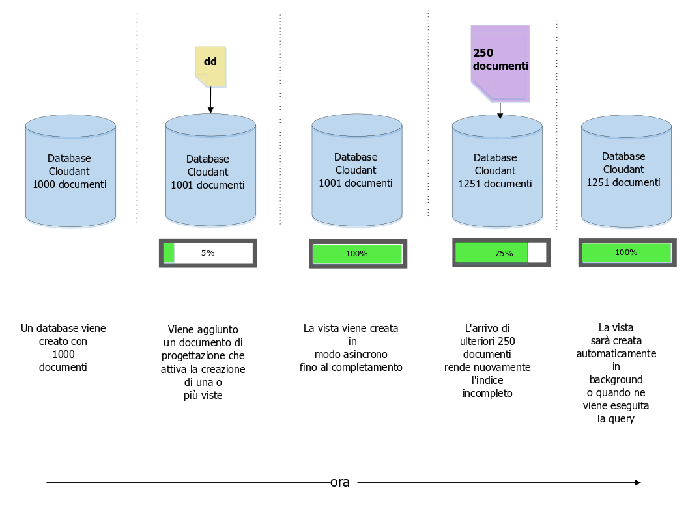
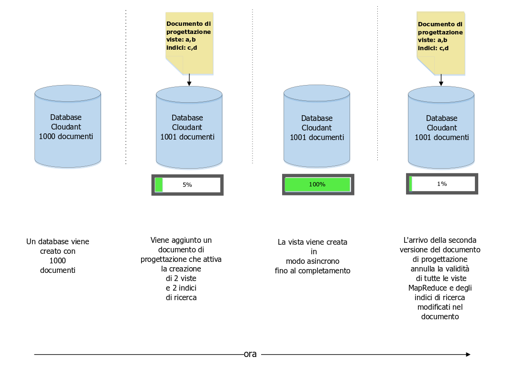
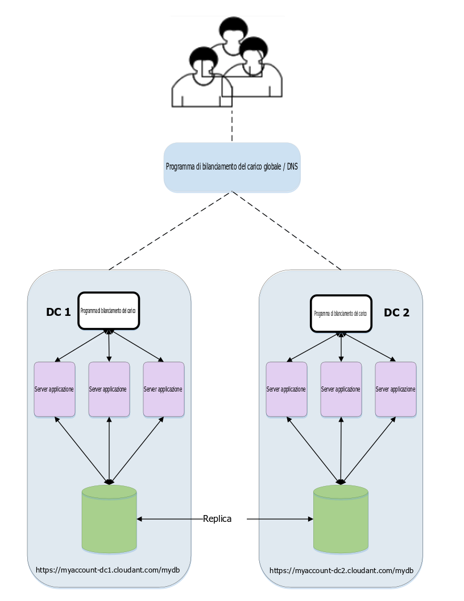

---

copyright:
  years: 2015, 2019
lastupdated: "2019-03-15"

keywords: multiple views, changes, versioned design documents, move and switch, the stale parameter

subcollection: cloudant

---

{:new_window: target="_blank"}
{:shortdesc: .shortdesc}
{:screen: .screen}
{:codeblock: .codeblock}
{:pre: .pre}
{:tip: .tip}
{:note: .note}
{:important: .important}
{:deprecated: .deprecated}

<!-- Acrolinx: 2017-05-10 -->

# Gestione dei documenti di progettazione
{: #design-document-management}

*Articolo fornito da Glynn Bird, Developer Advocate presso IBM Cloudant,
[glynn@cloudant.com ](mailto:glynn@cloudant.com){: new_window}*

L'archivio dati JSON scalabile di {{site.data.keyword.cloudantfull}} ha diversi meccanismi di query,
ognuno dei quali genera degli indici creati e gestiti separatamente dai dati principali.
L'indicizzazione non viene eseguita immediatamente quando viene salvato un documento.
Invece,
viene pianificata affinché accada in seguito offrendo un rendimento di scrittura
non bloccante più veloce.

-   Le viste MapReduce sono degli indici nel dataset
    con coppie chiave-valore memorizzate in un BTree per un recupero efficiente tramite chiave o intervallo di chiavi
-   Gli indici di ricerca sono costruiti utilizzando Apache Lucene per consentire la ricerca a testo libero,
    sfaccettatura e query ad hoc complesse

Gli [indici di ricerca](/docs/services/Cloudant?topic=cloudant-search#search) e le [viste MapReduce](/docs/services/Cloudant?topic=cloudant-views-mapreduce#views-mapreduce) di {{site.data.keyword.cloudant_short_notm}}
vengono configurati aggiungendo documenti di progettazione a un database.
I documenti di progettazione sono documenti JSON che contengono istruzioni su come costruire la vista o l'indice.
Facciamo un semplice esempio.
Supponiamo di avere una semplice raccolta di documenti di dati,
simile al seguente esempio.

_Esempio di un semplice documento di dati:_

```json
{
    "_id": "23966717-5A6F-E581-AF79-BB55D6BBB613",
    "_rev": "1-96daf2e7c7c0c277d0a63c49b57919bc",
    "doc_name": "Markdown Reference",
    "body": "Lorem Ipsum",
    "ts": 1422358827
}
```
{: codeblock}

Ogni documento di dati include un nome,
un corpo
e una data/ora.
Vogliamo creare una [vista MapReduce](/docs/services/Cloudant?topic=cloudant-views-mapreduce#views-mapreduce) per ordinare i nostri documenti per data/ora.

Possiamo farlo creando una funzione di mappa,
simile al seguente esempio.

_Funzione di mappa di esempio che restituisce il campo data/ora di un documento, se presente_

```javascript
function(doc) {
    if (doc.ts) {
        emit( doc.ts, null);
    }
}
```
{: codeblock}

La funzione emette la data/ora del documento in modo che possiamo utilizzarla come chiave dell'indice;
poiché non siamo interessati al valore dell'indice,
viene emesso `null`.
L'effetto è quello di fornire un indice ordinato per ora nella serie di documenti.

Chiameremo questa vista "`by_ts`"
e la inseriremo in un documento di progettazione chiamato "`fetch`",
come nel seguente esempio.

_Documento di progettazione di esempio che definisce una vista utilizzando una funzione di mappa:_

```json
{
    "_id": "_design/fetch",
    "views": {
      "by_ts": {
        "map": "function(doc) {
          if (doc.ts) {
            emit( doc.ts, null);
          }
        }"
      }
    },
    "language": "javascript"
}
```
{: codeblock}

Il risultato è che il nostro codice della mappa è stato restituito in una stringa compatibile con JSON
e incluso in un documento di progettazione.

Una volta salvato il documento di progettazione,
{{site.data.keyword.cloudant_short_notm}} attiva i processi lato server per creare la vista `fetch/by_ts`.
Esegue questa operazione iterando ogni documento nel database
e inviando ognuno di questi alla funzione di mappa Javascript.
La funzione restituisce la coppia chiave/valore emessa.
Mentre l'iterazione continua,
ogni coppia chiave/valore viene memorizzata in un indice B-Tree.
Dopo che l'indice viene costruito per la prima volta,
la successiva reindicizzazione viene eseguita solo per i documenti nuovi e aggiornati.
I documenti eliminati vengono deindicizzati.
Questo processo di risparmio di tempo è conosciuto come *MapReduce incrementale*,
come mostrato nel seguente diagramma:



A questo punto, è bene ricordare che:

-   La costruzione di un indice avviene in modo asincrono:
    {{site.data.keyword.cloudant_short_notm}} conferma che il nostro documento di progettazione è stato salvato,
    ma per controllare l'avanzamento della costruzione del nostro indice,
    dobbiamo eseguire il polling dell'endpoint [`_active_tasks`](/docs/services/Cloudant?topic=cloudant-active-tasks#active-tasks) di {{site.data.keyword.cloudant_short_notm}}.
-   Più dati abbiamo,
    più tempo richiederà il completamento dell'indice.
-   Mentre la creazione dell'indice iniziale è in corso,
    _qualsiasi query eseguita in tale indice verrà bloccata_.
-   L'esecuzione di query in una vista attiva la 'mappatura' dei documenti che non sono stati ancora indicizzati in modo incrementale.
    Ciò garantisce di ottenere una vista aggiornata dei dati.
    Vedi la seguente discussione sul [parametro '`stale`'](#the-stale-parameter)
    per le eccezioni a questa regola.

## Più viste nello stesso documento di progettazione
{: #multiple-views-in-the-same-design-document}

Se definiamo più viste nello stesso documento di progettazione,
queste vengono create in modo efficiente nello stesso momento.
Ogni documento viene letto solo una volta
e passato attraverso la funzione di mappa di ogni vista.
Lo svantaggio di questo approccio è che la modifica di un documento di progettazione
_invalida tutte le viste MapReduce esistenti_ definite in tale documento,
anche se alcune delle viste rimangono inalterate. 

Se le viste MapReduce devono essere modificate indipendentemente l'una dall'altra,
inserisci le loro definizioni in documenti di progettazione separati. 

Questo comportamento non si applica a indici di ricerca Lucene. Questi possono essere modificati all'interno dello stesso documento di progettazione
    senza invalidare altri indici non modificati nello stesso documento.
{: note}



## Gestione delle modifiche a un documento di progettazione
{: #managing-changes-to-a-design-document}

Immagina che in un prossimo futuro decidiamo di modificare la progettazione della nostra vista.
Adesso,
invece di restituire il risultato effettivo di data/ora,
siamo interessati solo al numero di documenti che corrispondono ai criteri.
Per ottenerlo,
la funzione di mappa rimane la stessa,
ma utilizziamo una _riduzione_ di "`_count`".
L'effetto è che il nostro documento di progettazione sarà simile al seguente esempio.

_Documento di progettazione di esempio che utilizza una funzione di riduzione:_

```json
{
    "_id": "_design/fetch",
    "_rev": "2-a2324c9e74a76d2a16179c56f5315dba",
    "views": {
        "by_ts": {
            "map": "function(doc) {
                if (doc.ts) {
                  emit( doc.ts, null);
                }
            }
        }",
        "reduce": "_count"
    },
    "language": "javascript"
}
```
{: codeblock}

Quando questo documento di progettazione viene salvato,
{{site.data.keyword.cloudant_short_notm}} invalida completamente il vecchio indice e inizia a creare il nuovo indice da zero,
iterando a turno ogni documento.
Come con la creazione originale,
il tempo impiegato dipende da quanti documenti sono presenti nel database
e blocca le query in entrata su tale vista finché non viene completata.

Ma c'è un problema...

Se abbiamo un'applicazione che accede a questa vista _in tempo reale_,
potremmo rilevare un dilemma di distribuzione:

-   La versione 1 del nostro codice,
    che si basava sul documento di progettazione originale,
    potrebbe non funzionare più perché la vista precedente è stata invalidata.
-   La versione 2 del nostro codice,
    che utilizza il nuovo documento di progettazione,
    non può essere rilasciata immediatamente
    perché la vista non avrà ancora terminato la creazione,
    soprattutto se nel database sono presenti molti documenti.
-   Un problema più insidioso che interessa il nostro codice è che le versioni 1 e 2 prevedono risultati diversi dalla vista:
    la versione 1 prevede un elenco di documenti corrispondenti,
    mentre la versione 2 prevede un numero 'ridotto' di risultati.

## Coordinamento delle modifiche ai documenti di progettazione
{: #coordinating-changes-to-design-documents}

Ci sono due modi per affrontare questo problema di controllo delle modifiche.

### Documenti di progettazione forniti di versione
{: #versioned-design-documents}

Una soluzione consiste nell'utilizzare nomi di documenti di progettazione forniti di versione:

-   Il nostro codice viene scritto inizialmente per utilizzare una vista chiamata `_design/fetchv1`.
-   Quando arriviamo a rilasciare una nuova versione,
    creiamo una nuova vista denominata `_design/fetchv2`
    ed eseguiamo una query sulla vista per assicurarci che inizi la creazione.
-   Eseguiamo il polling di `_active_tasks` finché il lavoro di creazione del nuovo indice non sarà completato.
-   Siamo ora pronti a rilasciare il codice che dipende dalla seconda vista.
-   Eliminiamo `_design/fetchv1` quando siamo sicuri non serve più.

L'utilizzo dei documenti di progettazione forniti di versione è un modo semplice per gestire il controllo delle modifiche nei tuoi documenti di progettazione,
purché ti ricordi di rimuovere successivamente le versioni precedenti.

### 'Sposta e passa' i documenti di progettazione
{: #-move-and-switch-design-documents}

Un altro approccio si basa sul fatto che {{site.data.keyword.cloudant_short_notm}} riconosce quando dispone di
due documenti di progettazione identici e non sprecherà tempo e risorse per ricostruire le viste già esistenti.
In altre parole,
se prendiamo il nostro documento di progettazione `_design/fetch` e creiamo un duplicato esatto `_design/fetch_OLD`,
entrambi gli endpoint funzioneranno in modo intercambiabile senza attivare alcuna reindicizzazione.

La procedura per passare alla nuova vista è la seguente:

1.  Crea una copia duplicata del documento di progettazione che vogliamo modificare,
    ad esempio aggiungendo `_OLD` al suo nome:
    `_design/fetch_OLD`.
2.  Inserisci nel database il documento di progettazione nuovo o 'in entrata',
    utilizzando un nome con il suffisso `_NEW`: `_design/fetch_NEW`.
3.  Esegui una query sulla vista `fetch_NEW`,
    per assicurarti che inizi la creazione.
4.  Esegui il polling dell'endpoint `_active_tasks` e attendi finché la creazione dell'indice non sarà completata.
5.  Inserisci una copia duplicata del nuovo documento di progettazione in `_design/fetch`.
6.  Elimina il documento di progettazione `_design/fetch_NEW`.
7.  Elimina il documento di progettazione `_design/fetch_OLD`.

## Strumenti per lo spostamento e il passaggio
{: #move-and-switch-tooling}

Esiste uno script Node.js della riga di comando che automatizza la procedura di 'sposta e passa'
chiamato'`couchmigrate`'.
Può essere installato come segue.

_Comando per installare lo script Node.js `couchmigrate`:_

```sh
npm install -g couchmigrate
```
{: codeblock}

Per utilizzare lo script `couchmigrate`,
per prima cosa definisci l'URL dell'istanza CouchDB/{{site.data.keyword.cloudant_short_notm}} impostando una variabile di ambiente denominata `COUCH_URL`.

_Definizione dell'URL di una istanza {{site.data.keyword.cloudant_short_notm}}_

```sh
export COUCH_URL=http://127.0.0.1:5984
```
{: codeblock}

L'URL può essere HTTP o HTTPS
e può includere le credenziali di autenticazione.

_Definizione dell'URL dell'istanza {{site.data.keyword.cloudant_short_notm}} con le credenziali di autenticazione:_

```sh
export COUCH_URL=https://$ACCOUNT:$PASSWORD@$HOST.cloudant.com
```
{: codeblock}

Supponendo di avere un documento di progettazione in formato JSON,
memorizzato in un file,
possiamo eseguire il comando di migrazione.

In questo esempio,
`db` specifica il nome del database da modificare
e `dd` specifica il percorso del nostro file del documento di progettazione.

_Esecuzione del comando `couchmigrate`:_

```sh
couchmigrate --db mydb --dd /path/to/my/dd.json
```
{: pre}

Lo script coordina la procedura di 'sposta e passa'
e attende che la vista venga creata prima di restituire il risultato.
Se il documento di progettazione in entrata è uguale a quello precedente,
allora lo script restituisce immediatamente il risultato.

Il codice sorgente per lo script è disponibile qui:
[https://github.com/glynnbird/couchmigrate ](https://github.com/glynnbird/couchmigrate){: new_window}.

## Parametro '`stale`'
{: #the-stale-parameter}

Se un indice è completo
ma nel database vengono aggiunti nuovi record,
l'indice viene programmato per l'aggiornamento in background.
Questo è lo stato del database mostrato nel seguente diagramma:



Quando si eseguono query nella vista, abbiamo tre scelte:

-   Il comportamento predefinito è quello di garantire che l'indice sia aggiornato,
    con gli ultimi documenti nel database,
    prima di restituire la risposta.
    Quando eseguiamo una query nella vista,
    {{site.data.keyword.cloudant_short_notm}} prima indicizza 250 nuovi documenti
    e poi restituisce la risposta.
-   Un'alternativa consiste nell'aggiungere il parametro "`stale=ok`" alla chiamata API.
    Il parametro significa " restituiscimi i dati già indicizzati,
    non mi interessano gli ultimi aggiornamenti".
    In altre parole,
    quando esegui la query nella vista con "`stale=ok`",
    {{site.data.keyword.cloudant_short_notm}} restituisce la risposta immediatamente
    senza alcuna ulteriore indicizzazione.
-   Una seconda alternativa è quella di aggiungere il parametro "`stale=update_after`" alla chiamata API.
    Il parametro significa " restituiscimi i dati già indicizzati,
    _e _ poi reindicizza i nuovi documenti".
    In altre parole,
    quando esegui la query nella vista con "`stale=update_after`",
    {{site.data.keyword.cloudant_short_notm}} restituisce la risposta immediatamente
    e poi pianifica un'attività in background per indicizzare i nuovi dati.

L'aggiunta di "`stale=ok`" o "`stale=update_after`" può essere un buon modo per ottenere le risposte più rapidamente da una vista,
ma a scapito dell'aggiornamento. 

Il comportamento predefinito distribuisce il carico uniformemente tra i nodi nel cluster {{site.data.keyword.cloudant_short_notm}}. Se utilizzi le opzioni alternative `stale=ok` o `stale=update_after`,
    questo potrebbe favorire un sottoinsieme di nodi del cluster
    al fine di restituire risultati consistenti da tutta la serie con consistenza eventuale. Questo significa che il parametro '`stale`' non è una soluzione perfetta per tutti i casi di utilizzo. Tuttavia,
    può essere utile per fornire risposte tempestive sulle serie di dati che cambiano velocemente,
    se la tua applicazione accetta favorevolmente i risultati obsoleti. Se la frequenza di modifica dei tuoi dati è bassa,
    l'aggiunta di "`stale=ok`" o "`stale=update_after`" non porterà un miglioramento delle prestazioni
    e potrebbe distribuire in modo non uniforme il carico su cluster più grandi.
{: note}

Evita di utilizzare `stale=ok` o `stale=update_after` dove possibile.
Il motivo è che il comportamento predefinito fornisce i dati più recenti
e distribuisce i dati all'interno del cluster.
Se è possibile far sapere a un'applicazione client che è in corso un'attività di elaborazione di grandi quantità di dati
(ad esempio, durante un normale aggiornamento dei dati di massa),
l'applicazione potrebbe passare temporaneamente a `stale=ok` durante quei momenti
e quindi tornare al comportamento predefinito in seguito.

L'opzione `stale` è ancora disponibile, ma sono disponibili anche le opzioni più utili `stable` e `update` che devono essere utilizzate al suo posto. Per ulteriori informazioni, vedi [Accesso a una vista obsoleta](/docs/services/Cloudant?topic=cloudant-using-views#view-freshness).
{: note}
