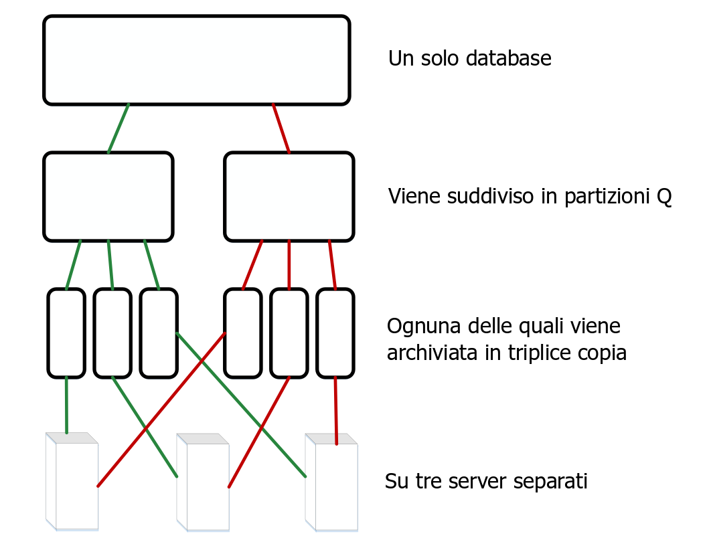
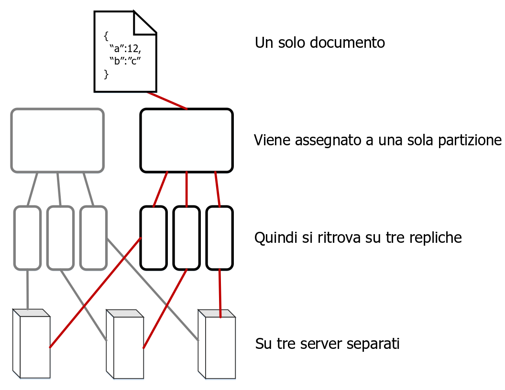

---

copyright:
  years: 2017, 2018
lastupdated: "2018-06-07"

---

{:new_window: target="_blank"}
{:shortdesc: .shortdesc}
{:screen: .screen}
{:codeblock: .codeblock}
{:pre: .pre}

<!-- Acrolinx: 2017-05-15 -->

# Come vengono memorizzati i dati in {{site.data.keyword.cloudant_short_notm}}?

## Concetti

Ogni database in {{site.data.keyword.cloudantfull}} è formato da uno o più _frammenti_ distinti,
dove il numero di frammenti è indicato come _Q_.
Un frammento è un sottoinsieme distinto di documenti dal database.
Tutti i _Q_ frammenti insieme contengono i dati all'interno del database.
Ogni frammento viene memorizzato in tre copie separate.
Ogni copia di frammento è detta _replica_ del frammento.
Ogni replica del frammento viene memorizzata su un server diverso.
I server sono disponibili all'interno di un unico data center di ubicazione.
La raccolta di server in un data center è chiamata cluster.



Un documento viene assegnato a un particolare frammento utilizzando un hashing coerente del suo ID.
Questa assegnazione significa che un documento viene sempre memorizzato su un frammento noto e su una serie nota di server.



Alcune volte,
i frammenti vengono _ribilanciati_.
Il ribilanciamento implica lo spostamento delle repliche in server diversi.
Questo si verifica per diversi motivi,
ad esempio quando il monitoraggio del server indica che un server è utilizzato di più o di meno rispetto agli altri server
o quando un server deve essere temporaneamente messo fuori servizio per la manutenzione.
Il numero di frammenti e repliche rimane lo stesso
e i documenti restano assegnati allo stesso frammento,
ma l'ubicazione dello storage di server per una replica del frammento cambia.

Il valore predefinito per _Q_ cambia a seconda dei cluster.
Il valore può essere regolato nel corso del tempo.

Il numero di repliche (copie di un frammento) è anche configurabile.
In pratica,
l'osservazione e la misurazione di molti sistemi suggeriscono che tre repliche sono un numero pragmatico nella maggior parte dei casi
per ottenere un buon equilibrio tra prestazioni e sicurezza dei dati.
Sarebbe del tutto eccezionale e insolito che un sistema {{site.data.keyword.cloudant_short_notm}} utilizzasse un numero di repliche diverso.

## Come influisce la frammentazione sulle prestazioni?

Il numero di frammenti per un database è configurabile
perché influisce sulle prestazioni del database in diversi modi.

Quando nel database arriva una richiesta da un'applicazione client,
un server o 'nodo' nel cluster viene designato come _coordinatore_ della richiesta.
Questo coordinatore effettua richieste interne ai nodi che contengono i dati relativi alla richiesta,
determina la risposta alla richiesta
e restituisce questa risposta al client.

Il numero di frammenti per un database può influire sulle prestazioni in due modi:

1.	Ogni documento nel database è memorizzato su un singolo frammento.
	Pertanto,
	avere molti frammenti consente un maggiore parallelismo per qualsiasi richiesta di singoli documenti.
	Il motivo è che il coordinatore invia le richieste solo ai nodi che contengono il documento.
	Quindi,
	se il database ha molti frammenti,
	è probabile che ci siano molti altri nodi che non devono rispondere alla richiesta.
	Questi nodi possono continuare a lavorare su altre attività senza interruzioni dalla richiesta del coordinatore.
2.	Per rispondere a una richiesta di query,
	un database deve elaborare i risultati da tutti i frammenti.
	Pertanto,
	avere più frammenti introduce una maggiore richiesta di elaborazione.
	Il motivo è che il coordinatore deve effettuare una richiesta per ogni frammento
	e quindi combinare i risultati prima di restituire la risposta al client.

Per determinare un numero di frammenti adeguato per il tuo database,
inizia identificando i tipi di richieste più comuni effettuate dalle applicazioni.
Ad esempio,
considera se le richieste sono principalmente per operazioni sui singoli documenti
o se sono soprattutto richieste di query.
Ci sono delle operazioni urgenti?

Per tutte le query,
il coordinatore emette richieste di lettura a tutte le repliche.
Questo approccio viene utilizzato perché ogni replica mantiene la propria copia degli indici che aiutano a rispondere alle query.
Un'importante conseguenza di questa configurazione è che avere più frammenti abilita la creazione di indici in parallelo _se_
le scritture dei documenti tendono ad essere distribuite in modo uniforme tra i frammenti del cluster.

In pratica,
è difficile prevedere il probabile carico di indicizzazione nei nodi del cluster.
Inoltre,
la previsione del carico di indicizzazione tende ad essere meno utile che affrontare i modelli di richiesta.
Il motivo è che l'indicizzazione potrebbe essere richiesta dopo una scrittura del documento,
ma non dopo una richiesta del documento.
Pertanto,
l'indicizzazione da sola non fornisce informazioni sufficienti
per stimare un numero di frammenti adeguato.

Quando consideri la dimensione dei dati,
una considerazione importante è il numero di documenti per frammento.
Ogni frammento contiene i suoi documenti in un grande
[B-tree ](https://en.wikipedia.org/wiki/B-tree){:new_window}
sul disco.
Gli indici vengono memorizzati nello stesso modo.
Più documenti vengono aggiunti a un frammento,
maggiore sarà il numero di passi utilizzati per attraversare il B-tree
durante una tipica ricerca o query del documento.
Questo 'aumento di profondità' tende a rallentare le richieste
perché più dati devono essere letti dalle cache o dal disco.

In generale,
evita di avere più di 10 milioni di documenti per frammento.
In termini di dimensioni complessive del frammento,
mantenere i frammenti al di sotto di 10 GB è utile per motivi operativi.
Ad esempio,
i frammenti più piccoli sono più facili da spostare sulla rete durante il ribilanciamento.

Dati i requisiti contrastanti per evitare di avere troppi documenti e mantenere minime le dimensioni dei frammenti,
un unico valore _Q_ non può funzionare in modo ottimale per tutti i casi.
{{site.data.keyword.cloudant_short_notm}} regola i valori predefiniti per i cluster al cambiare dei modelli di utilizzo.

Tuttavia,
per un database specifico,
è spesso utile prendere tempo per considerare i modelli di richiesta osservati e il dimensionamento
e utilizzare queste informazioni per guidare la selezione futura di un appropriato numero di frammenti.
Il test con dati rappresentativi e modelli di richiesta è essenziale per una migliore stima dei valori _Q_ adeguati.
Preparati per un'esperienza di produzione per modificare tali aspettative.

<div id="summary"></div>

Le seguenti semplici linee guida potrebbero essere utili durante le fasi di pianificazione iniziali.
Ricorda di convalidare la tua configurazione proposta eseguendo un test con i dati rappresentativi,
in particolare per i database più grandi:

*	Se la dimensione dei tuoi dati è irrilevante,
	come poche decine o centinaia di MB
	o migliaia di documenti,
	non c'è bisogno di più di un singolo frammento.
*	Per i database di pochi GB o pochi milioni di documenti,
	un numero di frammenti a cifra singola come 8 può essere accettabile.
*	Per database più grandi di decine e centinaia di milioni di documenti o decine di GB,
	potresti configurare il tuo database per utilizzare 16 frammenti.
*	Per i database ancora più grandi,
	potresti frammentare manualmente i tuoi dati in più database.
	Per i database così grandi,
	contatta il [supporto {{site.data.keyword.cloudant_short_notm}} ](mailto:support@cloudant.com){:new_window} per assistenza.

>	**Nota:** i numeri indicati in queste linee guida derivano dall'osservazione e dall'esperienza
	piuttosto che da un calcolo preciso.

<div id="API"></div>

## Utilizzo dei frammenti

### Impostazione del numero di frammenti

Il numero di frammenti,
_Q_,
per un database viene impostato quando si crea il database.
Il valore _Q_ non può essere modificato in seguito.

Per specificare _Q_ quando crei un database,
utilizza il parametro della stringa di query `q`.

Nel seguente esempio,
viene creato un database chiamato `mynewdatabase`.
Il parametro `q` specifica che vengono creati otto frammenti per il database.

```sh
curl -X PUT -u myusername https://myaccount.cloudant.com/mynewdatabase?q=8
```
{:codeblock}

>	**Note:** l'impostazione _Q_ per i database non è abilitata per i database {{site.data.keyword.cloudant_short_notm}} su {{site.data.keyword.cloud}}.
	Il valore _Q_ non è disponibile nella maggior parte dei cluster a più tenant di `cloudant.com`.

Se tenti di impostare il valore _Q_ dove non è disponibile,
il risultato è una [risposta `403`](../api/http.html#403) con un corpo JSON
simile al seguente esempio:

```json
{
	"error": "forbidden",
	"reason": "q is not configurable"
}
```
{:codeblock}

### Impostazione del numero di repliche

A partire da CouchDB versione 2,
puoi [specificare il numero di repliche ](http://docs.couchdb.org/en/2.0.0/cluster/databases.html?highlight=replicas#creating-a-database){:new_window}
quando crei un database.
Tuttavia,
non puoi modificare il valore del numero di repliche dall'impostazione predefinita di 3.
In particolare,
non è possibile specificare un valore del numero di repliche diverso quando crei un database.
Per ulteriore assistenza, contatta il [supporto {{site.data.keyword.cloudant_short_notm}} ](mailto:support@cloudant.com){:new_window}.

### Cosa sono gli argomenti _R_ e _W_?

Alcune richieste possono avere argomenti che influenzano il comportamento del coordinatore quando risponde alla richiesta.
Questi argomenti sono noti come _R_ e _W_ dopo i loro nomi nella stringa di query della richiesta.
Possono essere utilizzati solo per le operazioni sui singoli documenti.
Non hanno alcun effetto sulle richieste generali in 'stile query'.

In pratica
non è molto utile specificare i valori _R_ e _W_.
Ad esempio,
la specifica di _R_ o _W_ non modifica la consistenza per la lettura o la scrittura.

#### Cos'è _R_?

L'argomento _R_ può essere specificato solo sulle richieste di singoli documenti.
_R_ influisce sul numero di risposte che devono essere ricevute dal coordinatore prima di rispondere al client.
Le risposte devono provenire dai nodi che ospitano le repliche del frammento contenente il documento. 

L'impostazione di _R_ su _1_ potrebbe migliorare il tempo di risposta complessivo
perché il coordinatore può restituire una risposta più rapidamente.
Il motivo è che il coordinatore deve attendere solo un'unica risposta
da una delle repliche che ospita il frammento appropriato.

>	**Nota:** la riduzione del valore _R_ aumenta la probabilità che la risposta che viene
	restituita non sia basata sui dati più recenti
	a causa del modello di [consistenza eventuale](cap_theorem.html) utilizzato da {{site.data.keyword.cloudant_short_notm}}.
	L'utilizzo del valore _R_ aiuta a mitigare questo effetto.

Il valore predefinito per _R_ è _2_.
Questo valore corrisponde alla maggior parte delle repliche per un tipico database che utilizza tre repliche di frammento.
Se il database ha un numero di repliche superiore o inferiore a 3,
il valore predefinito per _R_ cambia di conseguenza.

#### Cos'è _W_?

_W_ può essere specificato solo sulle richieste di scrittura dei singoli documenti.

_W_ è simile a _R_,
perché influisce sul numero di risposte che devono essere ricevute dal coordinatore prima di rispondere al client.

>	**Nota:** _W_ non influisce in alcun modo sul comportamento effettivo della scrittura.

Il valore di _W_ non influisce sul fatto che il documento sia scritto nel database o meno.
Specificando un valore _W_,
il client può esaminare il codice di stato HTTP nella risposta per determinare se le repliche _W_ hanno risposto al coordinatore.
Il coordinatore attende le risposte _W_ dai nodi che ospitano le copie del documento fino a un timeout prestabilito
prima di restituire la risposta al client.
