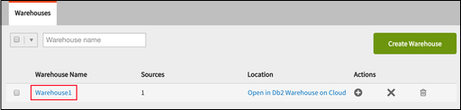
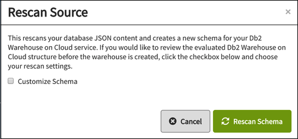

---

copyright:
  years: 2015, 2017
lastupdated: "2017-01-06"

---

{:new_window: target="_blank"}
{:shortdesc: .shortdesc}
{:screen: .screen}
{:codeblock: .codeblock}
{:pre: .pre}

# Data Warehousing

Un database è essenziale per la memorizzazione dei dati.
Ma ciò che rende valido un database è la capacità di applicare tali dati per finalità commerciali:
la capacità di recuperare dati rilevanti,
in modo rapido e semplice,
e di rendere i dati funzionali all'interno delle tue applicazioni.
{:shortdesc}

Ma molte delle attività di archiviazione,
elaborazione e
analisi che esegui con i dati vengono utilizzate ripetutamente nelle tue applicazioni.
Oppure potrebbero essere dei buoni esempi di procedure ottimali del settore.

Pertanto,
è opportuno estendere le funzionalità del database standard con funzioni aggiuntive,
supportando attività come il reporting
o l'analisi.

Per circa 30 anni,
i 'Data Warehouse' sono stati lo standard di settore per l'archiviazione dei dati,
il reporting e
l'analisi,
basati sulla tecnologia del database relazionale.
In generale,
un [data warehouse è ](https://en.wikipedia.org/wiki/Data_warehouse){:new_window}:
"... un repository centrale di dati integrati da una o più origini.
Memorizza dati attuali e cronologici.
Può essere utilizzato per eseguire l'analisi e creare i report per i lavoratori della conoscenza all'interno dell'azienda.

Le tecnologie che consentono l'archiviazione dei dati,
il reporting
e l'analisi sono emerse negli ultimi anni come risposta alla necessità di
elaborare i [Big Data ](https://en.wikipedia.org/wiki/Big_data){:new_window}':
"Big data è un termine per indicare una raccolta di insiemi di dati così grande e complessa
da non poter essere elaborata con le tradizionali applicazioni di analisi dei dati".

Allo stesso tempo,
le proprietà e le caratteristiche dei data warehouse e dei prodotti correlati
indicano che l'utilizzo della tecnologia del database relazionale per abilitare i data warehouse è una scelta popolare,
anche per le attività dei big data.

Esistono molti casi di utilizzo che illustrano bene i vantaggi
dell'integrazione delle funzionalità di Cloudant con un data warehouse relazionale,
ad esempio i seguenti esempi:

## Unione dei dati

L'unione dei dati da più archivi dati per l'analisi in più domini
è un'attività che può essere eseguita in modo semplice ed efficiente utilizzando un data warehouse relazionale.

I dati provenienti da diverse origini vengono preparati e trasformati in un formato comune durante il caricamento di un data warehouse.
I record vengono memorizzati in tabelle
e sono disponibili operazioni per unire queste tabelle e consentire quindi l'analisi combinata.

L'esecuzione dell'unione in un data warehouse relazionale è particolarmente utile
se alcuni dei dati sono già disponibili nella rappresentazione relazionale,
come i dati master o i dati di riferimento.

## Flessibilità

I database Cloudant sono flessibili alla rappresentazione dei dati.
Ad esempio,
non impongono uno schema durante la lettura o la scrittura.

Al contrario,
è richiesto un modello ben definito e rigorosamente applicato per le attività di reporting e analisi.

Con i tuoi documenti disponibili nel warehouse relazionale puoi basare il tuo modello su un insieme fisso di definizioni della tabella.
Possono essere caricati solo i documenti che si adattano allo schema della tabella, mentre le violazioni vengono rifiutate.
Puoi preparare i tuoi modelli con dati consistenti utilizzando uno schema relazionale fisso.

## Asserzione di integrità dei dati

I Data Warehouse possono utilizzare dei vincoli per asserire l'integrità dei dati.
Ad esempio:

-   Due record non possono avere la stessa chiave primaria.
-   Le chiavi esterne garantiscono che i record siano completi.
-   Sono disponibili funzioni per convalidare i record con le regole di business.

Unicità,
correttezza
e completezza sono requisiti essenziali per qualsiasi servizio aziendale.
Il caricamento dei documenti Cloudant in un data warehouse ti consente di soddisfare questi requisiti.

## Cloudant and Data Warehousing

I Data Warehouse rappresentano una tecnologia evoluta e importante.
Cloudant fornisce una solida integrazione con i data warehouse relazionali,
offrendoti il vantaggio di questa tecnologia.

IBM Cloudant ha una funzionalità di warehousing di base integrata,
sotto forma di [viste MapReduce](../api/using_views.html)
che ti consentono di eseguire una serie di attività analitiche di base.

Per attività di warehousing più avanzate,
puoi sfruttare tutte le funzionalità fornite dal
servizio di warehousing basato sul cloud di IBM [IBM dashDB ](http://www-01.ibm.com/software/data/dashdb/){:new_window}.

Quando utilizzi IBM Cloudant,
hai un accesso facile e integrato alle funzionalità di warehousing avanzate,
come ad esempio:

-   Visualizzazione dei tuoi dati JSON in un formato di database relazionale.
-   Esecuzione di query basate su SQL sui tuoi dati.
-   Creazione di analisi dai tuoi dati.

Queste funzionalità di warehousing avanzate vengono abilitate attraverso servizi come IBM dashDB,
che è un complemento naturale a Cloudant.

In alternativa,
se hai bisogno solo di un archivio dati relazionale per i tuoi documenti,
senza le funzionalità di warehousing,
puoi caricare i documenti Cloudant nel servizio [IBM DB2 on Cloud](#ibm-db2-on-cloud).

## IBM dashDB

IBM dashDB è un servizio di data warehouse basato sul cloud,
progettato appositamente per il lavoro analitico.
Sebbene sia particolarmente adatto per i dati JSON Cloudant,
dashDB può accettare dati provenienti da una varietà di origini,
esaminando la struttura dei dati quando vengono caricati.

Per ulteriori informazioni,
consulta la [documentazione di IBM dashDB Cloud Data Warehouse ](https://www.ibm.com/support/knowledgecenter/SS6NHC/com.ibm.swg.im.dashdb.kc.doc/welcome.html){:new_window}.

## IBM DB2 on Cloud

[IBM DB2 on Cloud ](https://console.ng.bluemix.net/catalog/services/ibm-db2-on-cloud){:new_window}
ti fornisce un database sull'infrastruttura cloud globale SoftLayer® di IBM.
Ti offre le piene funzionalità di una distribuzione DB2 in loco,
ma senza i costi,
la complessità
e il rischio di gestire la tua propria infrastruttura.

Per ulteriori informazioni, consulta la [documentazione di IBM DB2 on Cloud ](https://console.ng.bluemix.net/docs/services/DB2OnCloud/index.html#DB2OnCloud){:new_window}.

## Creazione di un warehouse

Puoi creare un warehouse in due modi:

1.  [Utilizza Cloudant per creare un warehouse dashDB](#use-cloudant-to-create-a-dashdb-warehouse)
2.  [Connetti Cloudant a un warehouse esistente](#connect-cloudant-to-an-existing-warehouse)

### Utilizza Cloudant per creare un warehouse dashDB

Il metodo più semplice per creare un warehouse è utilizzare Cloudant per creare un'istanza del warehouse dashDB all'interno
di Bluemix per tuo conto.
Per eseguire questa operazione, fai clic sul pulsante `Crea warehouse` sull'attività `Warehouse`
all'interno della scheda `Integrazioni` del tuo dashboard Cloudant.

Se non sei già connesso a Bluemix,
ti verrà chiesto di farlo.

>   **Nota**: per impostazione predefinita,
    Cloudant crea un'istanza dashDB su Bluemix per il tuo warehouse.

Una volta autenticato,
puoi richiedere che venga creata una nuova istanza dashDB utilizzando il tuo account Bluemix.
Per effettuare questa operazione:

1.  Fornisci il nome che vuoi utilizzare per il Warehouse nel campo `Nome Warehouse`.
2.  Fornisci il nome del tuo database esistente in Cloudant, nel campo `Origini dati`.
3.  Assicurati che l'opzione `Crea nuova istanza dashDB` sia selezionata nel modulo.
4.  Fai clic sul pulsante `Crea warehouse`.

### Connetti Cloudant a un warehouse esistente

Invece di utilizzare Cloudant per creare il database warehouse dashDB,
puoi connetterti a un'istanza dashDB esistente.

Il processo è simile all'[utilizzo di Cloudant per creare un warehouse dashDB](#use-cloudant-to-create-a-dashdb-warehouse),
ma invece di selezionare l'opzione `Crea nuova istanza dashDB`,
selezioni `Istanza del servizio dashDB` e scegli il warehouse dashDB già esistente in Bluemix.

### Utilizzo di un'istanza del warehouse DB2

Se preferisci,
puoi connetterti a un'istanza esistente del warehouse DB2 anziché di dashDB.
Per eseguire questa operazione, seleziona l'opzione `DB2` nel tuo dashboard Cloudant per connetterti a un'istanza DB2 esistente.

Se vuoi connetterti a un'istanza DB2,
devi fornire i seguenti dettagli:

-   Indirizzo host.
-   Numero di porta.
-   Nome del database.
-   ID utente per il database.
-   Password per l'ID utente.

>   **Nota**: il resto di questo argomento fa riferimento a dashDB come istanza del warehouse.
    Tuttavia,
    l'argomento vale anche se utilizzi un'istanza di DB2.
    È disponibile anche un'esercitazione che descrive come
    [caricare i dati JSON da Cloudant in dashDB ](https://developer.ibm.com/clouddataservices../dashdb/get/load-json-from-cloudant-database-in-to-dashdb/){:new_window}
    e include esempi di utilizzo di DB2 come database warehouse.

## Schema del warehouse

Quando crei un warehouse da Cloudant,
dashDB crea il miglior schema possibile per i dati presenti nel database
in modo da garantire che ciascuno dei campi contenuti nei tuoi documenti JSON abbia una voce corrispondente all'interno del nuovo schema.
Facoltativamente,
durante la creazione del warehouse,
puoi scegliere di [personalizzare lo schema](#customizing-the-warehouse-schema) manualmente.

Una volta creato lo schema,
il warehouse è in grado di mantenere i tuoi dati in un formato relazionale.
Cloudant quindi [replica](../api/replication.html) per eseguire
un 'carico iniziale' dei documenti del database nel warehouse,
fornendoti una raccolta operativa dei tuoi dati nel database relazionale dashDB.

Con il tempo,
il contenuto del tuo database Cloudant potrebbe cambiare.
Puoi modificare lo schema di un warehouse esistente.

>   **Nota**: se modifichi lo schema di un warehouse esistente,
    i dati del tuo database Cloudant devono essere di nuovo replicati nel database warehouse.
    In effetti,
    la modifica dello schema provoca un nuovo 'carico iniziale' nel warehouse.

## Gestione del tuo warehouse

Con il warehousing di Cloudant,
puoi eseguire quey SQL 'tradizionali'
e visualizzare i risultati
dall'interno della console dashDB.

Le applicazioni esterne possono interagire con i dati allo stesso modo di qualsiasi altro database relazionale.

Il vantaggio di dashDB è che puoi eseguire altre attività di warehousing,
come caricare più dati da altre origini
e analizzare i dati mediante gli strumenti analitici integrati.
DashDB supporta il
[linguaggio di programmazione `'R'` ](https://en.wikipedia.org/wiki/R_%28programming_language%29){:new_window}
e l'ambiente software per il calcolo statistico e la grafica.
Questo significa che hai accesso ad algoritmi che ti consentono di eseguire attività analitiche del database come la regressione lineare,
il clustering 'k-means'
e l'analisi geospaziale.

Lo strumento `RStudio` ti consente di creare script `'R'` che vengono caricati in dashDB
ed quindi eseguiti utilizzando i tuoi dati.

Per ulteriori informazioni sull'utilizzo di dashDB,
consulta la [documentazione di IBM dashDB Cloud Data Warehouse ](https://www.ibm.com/support/knowledgecenter/SS6NHC/com.ibm.swg.im.dashdb.kc.doc/welcome.html){:new_window}.

## Aggiornamento costante dei dati e della struttura

I dati vengono caricati da Cloudant in dashDB utilizzando un processo di [replica](../api/replication.html).
Ciò significa che se i tuoi dati Cloudant vengono aggiornati o modificati in qualche modo,
è necessario effettuare di nuovo la replica dei documenti in dashDB
per garantire che le tue attività analitiche continuino a funzionare utilizzando le informazioni più aggiornate.

Come con la normale replica di Cloudant,
i dati vengono trasferiti in modo unidirezionale:
per un warehouse il trasferimento è da Cloudant a dashDB.
Dopo il carico iniziale dei dati,
il warehouse sottoscrive le modifiche del contenuto dei dati nel database Cloudant.
Tutte le modifiche vengono replicate dall'origine Cloudant alla destinazione dashDB.
Ciò significa che il warehousing è una forma di replica continua da Cloudant a dashDB.

Con il tempo,
il tuo database Cloudant potrebbe avere anche delle modifiche strutturali.
Queste includono l'aggiunta o la rimozione di campi dai documenti JSON.
Quando ciò accade,
lo schema utilizzato dal warehouse potrebbe non essere più valido,
causando errori segnalati quando i nuovi dati vengono replicati da Cloudant a dashDB.

Per risolvere questo problema,
il warehousing di Cloudant ha una funzione di 'ripetizione della scansione'.
Questa funzione esegue di nuovo la scansione della struttura del database Cloudant
e determina il nuovo schema richiesto in dashDB.
Le vecchie tabelle all'interno di dashDB che erano state create durante la scansione precedente vengono quindi eliminate,
vengono create nuove tabelle utilizzando il nuovo schema
e infine i dati Cloudant correnti vengono caricati come nuovo 'carico iniziale'.

Per utilizzare la funzione di ripetizione della scansione,
per prima cosa assicurati che il tuo warehouse non sia in esecuzione.
Segui questa procedura:

1.  Seleziona la scheda `Integrazioni` all'interno del dashboard Cloudant.
2.  Individua il nome del Warehouse in cui ripetere la scansione nell'attività `Warehouse`: 
3.  Fai clic sul nome del Warehouse.
    Questo è un link che,
    quando selezionato, apre la vista dei dettagli del warehouse: 
4.  Controlla lo stato corrente del warehouse.
    Un cerchio verde rotante indica che il warehouse è in esecuzione.
    Per arrestare il warehouse,
    fai clic sull'icona `Arresta database` nella colonna Azioni: 
5.  Quando il database warehouse non è in esecuzione,
    l'icona `Ripeti scansione` nella colonna Azioni è abilitata: 

### Ripetizione della scansione del database di origine

Quando fai clic sull'icona `Ripeti scansione`,
hai due scelte:

-   Una scansione immediata del tuo database.
    Questa è l'azione predefinita
    ed è molto simile alla scansione iniziale del tuo database eseguita quando il warehouse è stato creato per la prima volta.
-   Personalizzare lo schema del warehouse.

Se scegli l'azione predefinita di ripetere una semplice scansione,
il tuo database di origine viene analizzato e viene generato un nuovo schema del database warehouse.
Una volta terminata la nuova scansione,
il warehouse viene avviato.

Se vuoi personalizzare lo schema del warehouse,
abilita la casella di spunta `Personalizza schema`
prima di fare clic sul pulsante `Ripeti scansione`.

La casella di spunta `Personalizza schema` abilita due opzioni.

1.  L'algoritmo di rilevamento utilizzato.
2.  La dimensione campione.

### Algoritmo di rilevamento

L'opzione predefinita per la ripetizione della scansione è l'algoritmo `Union`.
Questo utilizza tutti gli attributi in tutti i documenti del database Cloudant campionati
per creare un singolo insieme di tabelle nel database warehouse.
Il risultato è che tutti i documenti del database Cloudant possono essere memorizzati nel database warehouse,
ma alcune righe nel database potrebbero non avere contenuti in alcuni campi.

L'opzione alternativa per la ripetizione della scansione è l'algoritmo `Cluster`.
Questo identifica i documenti all'interno del database Cloudant che hanno lo stesso insieme di attributi,
quindi crea schemi di tabella del database warehouse corrispondenti.

### Dimensione campione

Questa opzione determina quanti documenti del database Cloudant
vengono analizzati come parte della determinazione dello schema.

Il valore predefinito è 10.000 documenti.

L'impostazione di un valore troppo basso introduce il rischio che alcuni documenti Cloudant abbiano degli attributi non rilevati
e vengano quindi omessi dalla struttura del database warehouse.

L'impostazione di un valore troppo alto indica che il completamento del processo di scansione
per determinare la struttura del database warehouse richiederà più tempo.

### Dopo la nuova scansione

Una volta terminata la ripetizione della scansione del database Cloudant,
il warehouse non viene avviato automaticamente.
Al contrario,
rimane in stato di arresto,
in modo che il database warehouse possa essere personalizzato.

## Personalizzazione dello schema del warehouse

È possibile modificare lo schema del database che viene determinato automaticamente
durante il processo di creazione iniziale del warehouse
o dopo la ripetizione della scansione.
Per farlo,
assicurati di selezionare l'opzione `Personalizza schema` durante il processo di creazione:

Il warehouse viene creato in dashDB come al solito,
tuttavia non viene avviato immediatamente.
Hai invece
la possibilità di personalizzare lo schema prima di procedere.

Per farlo,
fai clic sul link per il tuo warehouse:

La visualizzazione risultante ti fornisce un pulsante per personalizzare lo schema utilizzato per il tuo database di origine.
Il passaggio del mouse sull'indicatore di stato conferma che lo schema è pronto per la personalizzazione:

Facendo clic sul pulsante 'Personalizza' viene visualizzato un pannello in cui puoi modificare i campi dello schema del database:

Per reimpostare lo schema sull'impostazione predefinita,
fai clic sul pulsante `Ripeti scansione`:

Quando hai terminato di personalizzare lo schema del database per il warehouse,
fai clic sul pulsante `Esegui`:

Lo schema viene salvato
e il warehouse avviato.

### Personalizzazione di uno schema del warehouse esistente

Se lo schema del database per il tuo warehouse esiste già,
hai la [possibilità di personalizzarlo](#keeping-the-data-and-structure-fresh).

## Risoluzione dei problemi

Ogni tanto,
potresti riscontrare dei problemi quando utilizzi la funzione di warehousing.
Informazioni su alcuni di questi problemi sono fornite in seguito in questo argomento.

Inoltre,
una discussione su alcuni errori o problemi comuni,
oltre ai dettagli su come risolverli,
è disponibile in [Stack Overflow ](http://stackoverflow.com/questions/tagged/cloudant+dashdb){:new_window}.

Se hai bisogno di ulteriore assistenza
e non riesci a trovare soluzioni in Stack Overflow,
contatta il [supporto Cloudant ](mailto:support@cloudant.com){:new_window}.

### Eccezioni visibili nel dashboard

A volte,
il warehouse rileva una condizione di errore.
Ad esempio,
se provi a creare un warehouse utilizzando un database DB2 esistente,
ma non immetti i dettagli corretti del database,
il warehouse non potrà essere creato correttamente.

Se esiste una condizione di errore,
lo stato del warehouse cambia e viene contrassegnato con un cerchio rosso,
che indica che c'è un problema che richiede la tua attenzione.

Se 'passi con il mouse' sull'indicatore,
viene fornita qualche altra informazione:

Quando fai clic sull'indicatore,
viene visualizzata una finestra che ti fornisce ulteriori dettagli sulla causa del problema.
In questo esempio,
i dettagli dell'host immessi per la connessione DB2 non erano validi:

### Avvertenze ed errori

Le modifiche nel database Cloudant vengono replicate nel database warehouse.
È possibile che una modifica non sia adatta per il warehouse o per il suo schema.
I problemi di questo tipo vengono rilevati e registrati nella tabella `OVERFLOW` del database warehouse.

Ad esempio,
se lo schema del warehouse ha un campo `Movie_earnings_rank` di tipo `VARCHAR`
e può contenere un massimo di 32 caratteri,
ma una modifica nel database Cloudant richiede l'archiviazione di 40 caratteri,
il campo verrà 'sovraccaricato'.
Questo provoca una condizione di 'avvertenza'
che viene indicata nell'icona di stato del dashboard warehouse:

Guardando nella tabella di overflow indicata nel database warehouse,
puoi visualizzare ulteriori dettagli sull'avvertenza:

In questo esempio,
l'avvertenza chiarisce che si è verificato un troncamento,
che interessa il campo `Movie_earnings_rank` del documento Cloudant che ha un `_ID` di `70f6284d2a395396dbb3a60b4cf1cac2`.

Ci sono due possibili opzioni di soluzione:

-   Correggere il campo sovraccaricato all'interno del documento Cloudant.
-   [Aggiornare lo schema del warehouse](#customizing-the-warehouse-schema).

L'opzione che scegli dipende se l'aggiunta del contenuto nel campo è intenzionale o meno.
Se ti serve del contenuto aggiuntivo per la tua applicazione,
è necessario
[aggiornare lo schema del warehouse](#customizing-the-warehouse-schema) per rimuovere la condizione di avvertenza.

Il problema è più significativo se un campo completamente nuovo viene introdotto in un documento nel database Cloudant,
ma il campo non ha una controparte nello schema del database warehouse.
Questo provoca una condizione di 'errore'.

Ad esempio,
un documento nel database Cloudant potrebbe 'acquisire' un campo aggiuntivo chiamato `my key`
che non esiste nello schema del database warehouse:

Il risultato è una condizione di errore,
che viene indicata nell'icona di stato del dashboard warehouse:

Guardando nella tabella di overflow indicata nel database warehouse,
puoi visualizzare ulteriori dettagli sull'errore:

In questo esempio,
l'errore chiarisce che è stato rilevato un campo
che non era presente quando è stato creato lo schema del database warehouse.
Il campo stesso è stato rilevato nel documento Cloudant con un `_ID` di  `70f6284d2a395396dbb3a60b4cf1cac2`.

Ci sono due possibili opzioni di soluzione:

-   Rimuovere il campo aggiuntivo dal documento Cloudant.
-   [Aggiornare lo schema del warehouse](#customizing-the-warehouse-schema).

L'opzione che scegli dipende se l'aggiunta del campo è intenzionale o meno.
Se ti serve un campo aggiuntivo per la tua applicazione,
è necessario [aggiornare lo schema del warehouse](#customizing-the-warehouse-schema) per rimuovere la condizione di errore.
