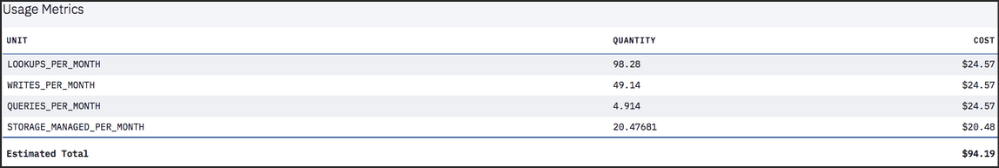

---

copyright:
  years: 2015, 2019
lastupdated: "2019-03-07"

keywords: pricing examples, data usage, ibm cloud usage dashboard

subcollection: cloudant

---

{:new_window: target="_blank"}
{:shortdesc: .shortdesc}
{:screen: .screen}
{:codeblock: .codeblock}
{:pre: .pre}
{:note: .note}
{:important: .important}
{:deprecated: .deprecated}

<!-- Acrolinx: 2019-01-11 -->

# Prezzi
{: #pricing}

Il prezzo di {{site.data.keyword.cloudantfull}} si basa sulla capacità produttiva fornita che assegni per la tua istanza e sulla quantità di archiviazione dati consumata. {{site.data.keyword.cloudant_short_notm}} ti consente di ampliare o ridurre la tua capacità produttiva fornita e di pagare su base oraria proporzionale. La capacità produttiva fornita è un numero riservato di letture al secondo, scritture al secondo e query globali al secondo assegnate a un'istanza. L'impostazione della capacità produttiva è il livello massimo di utilizzo per un dato secondo. Se tenti di superare la capacità riservata per letture, scritture o query globali, ottieni un codice di stato HTTP 429 che indica che l'applicazione sta tentando di superare la sua franchigia di capacità produttiva fornita. 

La seguente tabella mostra il prezzo orario di esempio per diverse impostazioni della capacità produttiva fornita. Puoi commutare la capacità in blocchi granulari di 100 letture/secondo, 50 scritture/secondo e 5 query globali/secondo su una base oraria. Viene mostrato anche un costo mensile approssimativo per ciascuna impostazione presupponendo una media di 730 ore al mese. I prezzi vengono mostrati in USD. Puoi utilizzare il calcolatore dei prezzi {{site.data.keyword.cloud_notm}} per vedere i costi stimati in altre valute facendo clic sul pulsante `Add to estimate` dal tile del catalogo {{site.data.keyword.cloudant_short_notm}}.

Puoi avviare la scheda {{site.data.keyword.cloudant_short_notm}} **Dashboard** > **Account** > **Capacità** per visualizzare e modificare la capacità effettiva fornita e vedere i costi orari e mensili approssimativi: 

## Esempi di prezzi 
{: #pricing-examples}

Supponiamo che stai creando un'applicazione mobile con {{site.data.keyword.cloudant_short_notm}} e non conosci ancora la capacità di cui potresti avere bisogno. In questo caso, ti consigliamo di iniziare con la capacità produttiva fornita più bassa e aumentarla come richiesto dall'utilizzo della tua applicazione nel corso del tempo. {{site.data.keyword.cloudant_short_notm}} esegue una fatturazione a base proporzionale oraria e la modifica della capacità produttiva fornita non comporta tempi di inattività. 

Per l'esempio di applicazione mobile, inizi con una capacità produttiva fornita minima per il piano Standard che è
100 letture/secondo, 50 scritture/sec e 5 query globali/secondo. Il costo per questa capacità è  $0,105 all'ora. Le 100 letture/secondo, 50 scritture/secondo e 5 query globali/secondo sono
un blocco di capacità produttiva fornita. Quando hai bisogno di ampliare (o ridurre), puoi farlo in incrementi di questi blocchi di capacità. Presumendo che l'istanza abbia meno dei 20 GB di archiviazione che sono inclusi nel piano Standard, non si incorre in alcun costo di archiviazione. Nella scheda
del Dashboard {{site.data.keyword.cloudant_short_notm}} > Account > Capacità, l'impostazione di capacità produttiva fornita si presenta simile a questa acquisizione di schermo:

Il dispositivo di scorrimento della capacità mostra il costo orario della capacità produttiva fornita di 100 letture/secondo, 50 scritture/secondo e 5 query globali/secondo in USD di $0,105/ora. Il dispositivo di scorrimento mostra un costo approssimativo al mese di $76,65. L'importo mensile è una stima basata su una media di 730 ore al mese. Il costo in qualsiasi mese più essere leggermente differente, a seconda del numero di ore nel mese.

Equazione di esempio: 

- $0,105 all'ora \* 1 blocco (di capacità produttiva fornita di 100 letture/secondo, 50 scritture/secondo e 5 query globali/secondo) \* 730 ore (ore approssimative in un mese)
- Totale = $76,65

Letture, scritture e query globali non possono essere ridimensionate indipendentemente. Utilizza il dispositivo di scorrimento per selezionare il numero di blocchi di capacità produttiva fornita in base al limite massimo di letture/secondo, scritture/secondo o query globali/secondo per la tua applicazione. Ad esempio, se la tua applicazione richiede 1.000 letture al secondo, utilizza il dispositivo di scorrimento per selezionare la capacità che offre 1.000 letture/secondo, 500 scritture/secondo e 50 query globali/secondo, anche se non hai bisogno del numero corrispondente di scritture o query globali. 

Come stimare il costo totale per la capacità produttiva fornita al mese di 1.000 letture, 500 scritture e 50 query globali? 

- $0,105 all'ora \* 10 blocchi (di capacità produttiva fornita di 100 letture/secondo, 50 scritture/secondo e 5 query globali/secondo) \* 730 ore (ore approssimative in un mese)
- In alternativa, il dispositivo di scorrimento ti mostra la capacità produttiva fornita di 1000 letture/secondo, 500 scritture/sec e 50 query globali/secondo costa $1,050/ora \* 730 ore
- Totale = $766,50

## Prezzi di utilizzo dei dati
{: #data-usage-pricing}

Come funzionano i prezzi per l'eccedenza dati?

Piano | Archiviazione inclusa | Limite eccedenza
-----|------------------|--------------
Lite | 1 GB |  Al tuo account non è consentito scrivere nuovi dati finché non elimini abbastanza dati da essere sotto al limite di 1 GB o esegui l'upgrade a un piano superiore. 
Standard | 20 GB | Dell'archiviazione aggiuntiva costa $0,0014 per GB all'ora, che è circa $1/GB al mese.

## Dashboard di utilizzo {{site.data.keyword.cloud_notm}} 
{: #usage-dashboard}

Come vengono visualizzati i dati nel dashboard di utilizzo di {{site.data.keyword.cloud_notm}}?

Le fatturazioni di utilizzo correnti e cronologiche possono essere esaminate nel dashboard {{site.data.keyword.cloud_notm}}, in Gestisci -> Fatturazione e utilizzo -> Utilizzo. Questa vista mostra i totali per l'utilizzo che sono maturati durante un particolare mese a livello di servizio, piano o istanza. Il totale stimato riflette la fatturazione fino a questo momento per il mese o per i mesi completi passati. Mostrerà solo i costi orari maturati fino a quel punto per il mese corrente. Entro la fine del mese, vedrai la tua capacità effettiva fornita media per il mese nei campi `LOOKUPS_PER_MONTH`, `WRITES_PER_MONTH` e `QUERIES_PER_MONTH`. (Tieni presente che ora le ricerche vengono chiamate letture e le query vengono chiamate query globali.) Il campo `STORAGE_MANAGED_PER_MONTH` mostra solo l'archiviazione addebitata e non include i 20 GB che sono inclusi nel piano Standard. Nel seguente esempio, una quantità superiore a 20 GB indica che c'è stata una media di 40 GB di dati nell'istanza per il mese. Quando utilizzi meno di 20 GB di archiviazione, la visualizzazione mostra 0 GB poiché non hai superato il limite.   

