---

copyright:
  years: 2017, 2018
lastupdated: "2018-06-07"

---

{:new_window: target="_blank"}
{:shortdesc: .shortdesc}
{:screen: .screen}
{:codeblock: .codeblock}
{:pre: .pre}

<!-- Acrolinx: 2017-01-10 -->

# Creazione di una semplice applicazione {{site.data.keyword.cloud_notm}} per accedere a un database {{site.data.keyword.cloudant_short_notm}}: l'ambiente dell'applicazione 

Questa sezione dell'esercitazione descrive come configurare l'ambiente dell'applicazione di cui devi disporre
per creare un'applicazione {{site.data.keyword.cloud}}.
{:shortdesc}

<div id="creating"></div>

## Creazione di un ambiente dell'applicazione {{site.data.keyword.cloud_notm}}

1.  Accedi al tuo account {{site.data.keyword.cloud_notm}}.
    Il dashboard {{site.data.keyword.cloud_notm}} può essere trovato all'indirizzo:
    [http://bluemix.net ](http://bluemix.net){:new_window}.
    Dopo l'autenticazione con i tuoi nome utente e password,
    viene visualizzato il dashboard {{site.data.keyword.cloud_notm}}:<br/>
    

2.  Fai clic sul link '`Catalogo`':<br/>
    <br/>
    Viene visualizzato un elenco dei servizi disponibili in {{site.data.keyword.cloud_notm}}.

3.  Fai clic sulla voce '`Applicazioni Cloud Foundry`' nell'intestazione `Applicazioni`:<br/>
    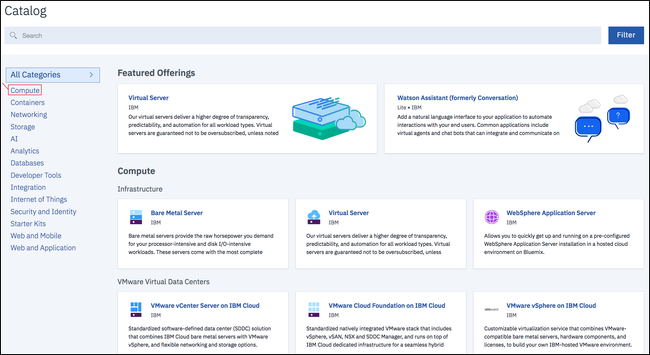<br/>
    Viene visualizzato un elenco di applicazioni Cloud Foundry
    disponibili in {{site.data.keyword.cloud_notm}}.

4.  Fai clic sulla voce '`Python`':<br/>
    <br/>
    Viene visualizzato un modulo '`Crea un'applicazione Cloud Foundry`'.

5.  Utilizza il modulo '`Crea un'applicazione Cloud Foundry`' per specificare e creare l'ambiente
    per la tua applicazione Python Cloud Foundry.
    Immetti un nome per la tua applicazione,
    ad esempio '`Cloudant Python`'.
    Il nome host viene generato automaticamente,
    sebbene tu possa personalizzarlo:<br/>
    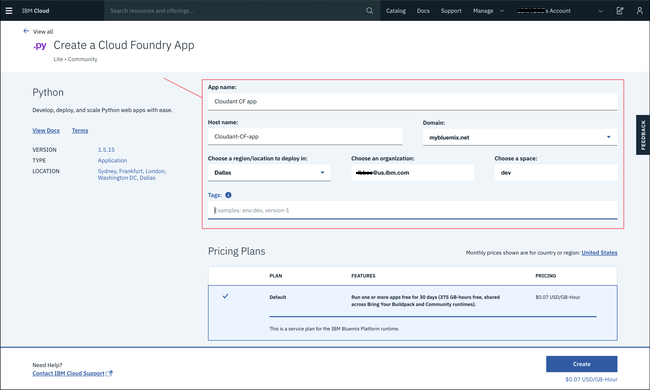<br/>
    >   **Nota**: il nome host deve essere univoco nel dominio {{site.data.keyword.cloud_notm}}. In questo esempio, il dominio è '`mybluemix.net`', fornendo un nome host completo di '`Cloudant-Python.mybluemix.net`'.

6.  Fai clic su '`Crea`' per creare l'ambiente dell'applicazione:<br/>
    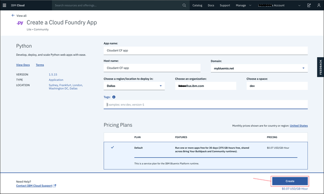

7.  Dopo una breve pausa,
    viene visualizzata la finestra '`Introduzione`' del tuo nuovo ambiente dell'applicazione.
    Viene automaticamente creata un'applicazione di test nell'ambiente.
    L'applicazione viene avviata automaticamente,
    come mostrato dall'icona verde e dallo stato `La tua applicazione è in esecuzione`.
    L'applicazione è un programma 'heartbeat',
    sufficiente a mostrare che il nuovo ambiente dell'applicazione è pronto per l'utilizzo.
    Fai clic su link `Dashboard`' per ritornare al tuo dashboard dell'account {{site.data.keyword.cloud_notm}}.<br/>
    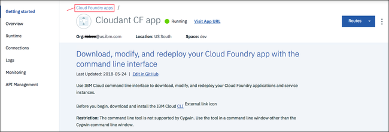

8.  Il tuo dashboard ora include l'ambiente dell'applicazione appena creato:<br/>
    

Ora disponi di un ambiente dell'applicazione {{site.data.keyword.cloud_notm}} Python, pronto per l'utilizzo.

Per utilizzare un'istanza del servizio {{site.data.keyword.cloudant_short_notm}},
il passo successivo consiste nel creare una 'connessione' tra l'ambiente dell'applicazione e l'istanza del database.

<div id="connecting"></div>

## Connessione dei servizi e delle applicazioni {{site.data.keyword.cloud_notm}}

Questa sezione dell'esercitazione illustra come connettere i servizi e gli ambienti dell'applicazione
{{site.data.keyword.cloud_notm}} utilizzando
l'area di gestione e configurazione della tua applicazione.

1.  Dal tuo dashboard {{site.data.keyword.cloud_notm}},
    fai clic sulla voce della tua applicazione.<br/>
    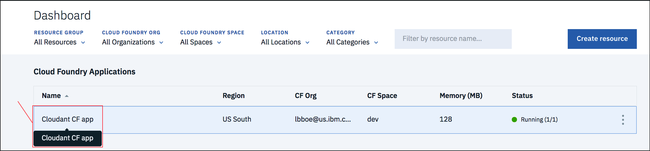<br/>
    >   **Nota**: evita la colonna '`Rotta`', facendo clic sul link associato alla tua applicazione si richiama l'applicazione piuttosto che andare all'area di configurazione. Un buon posto su cui fare clic è il nome della tua applicazione.

    Viene visualizzata l'area della panoramica di gestione e configurazione della tua applicazione.

2.  Per connettere l'ambiente dell'applicazione a un altro servizio,
    fai clic sul link '`Connessioni`':<br/>
    <br/>
    Viene visualizzata un'area per la configurazione di una connessione tra la tua applicazione e qualsiasi altro servizio disponibile nel tuo account.

3.  Un [prerequisito](create_bmxapp_prereq.html#prerequisites) per questa esercitazione è un'istanza del database
    {{site.data.keyword.cloudant_short_notm}} esistente.
    Fai clic su '`Connetti esistente`' per stabilire una connessione tra tale istanza del database e la tua applicazione:<br/>
    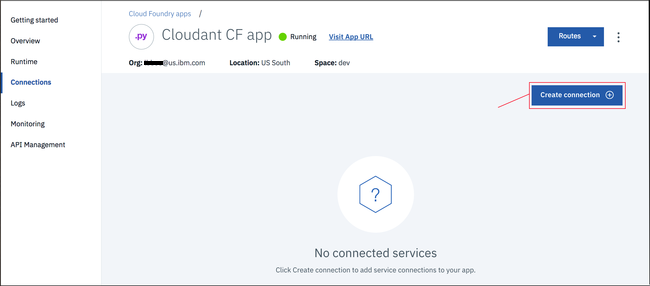<br/>
    Viene visualizzato un elenco di istanze del servizio esistenti nel tuo account.

4.  Fai clic sull'istanza del database {{site.data.keyword.cloudant_short_notm}} che desideri utilizzare.
    Questa esercitazione utilizza l'istanza '`Cloudant Service 2017`':<br/>
    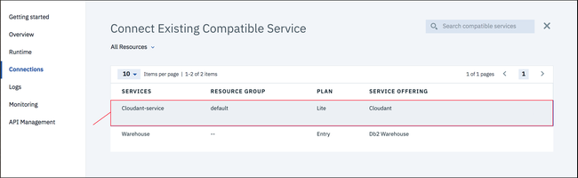

5.  Ti viene richiesto di confermare che realmente vuoi connettere l'istanza del database alla tua applicazione.
    Fai clic su '`Connetti`' per confermare la connessione:<br>
    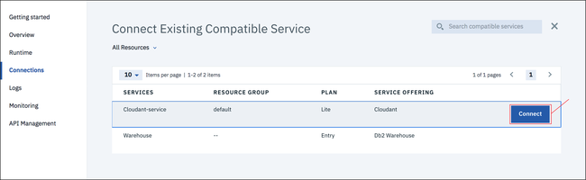

6.  Modificando le connessioni del servizio di un'applicazione se ne influenza la configurazione generale.
    La modifica richiede una 'ripreparazione' dell'applicazione,
    che inoltre forza l'arresto di un'applicazione in esecuzione.
    Viene visualizzata una finestra in cui confermare che sei pronto a procedere con la 'ripreparazione'.
    Fai clic su '`Riprepara`' per continuare:<br/>
    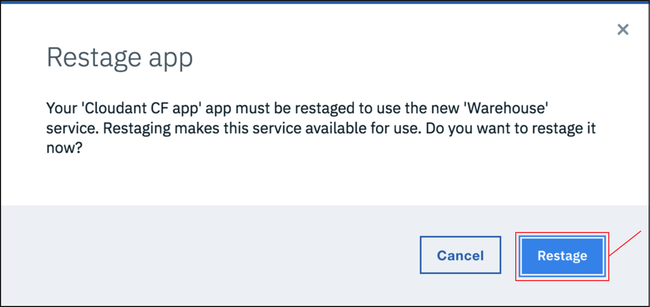

7.  Viene nuovamente visualizzata la pagina delle connessioni del servizio.
    Ora include l'istanza del database appena connessa:<br/>
    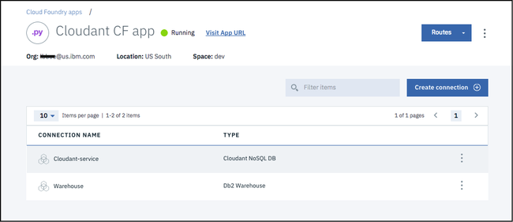

L'ambiente dell'applicazione e l'istanza del database sono ora connessi.
Il passo successivo consiste nell'assicurarti che gli strumenti necessari sano installati
per utilizzare le applicazioni {{site.data.keyword.cloud_notm}}.

<div id="toolkits"></div>

## Toolkit dei comandi Cloud Foundry e {{site.data.keyword.cloud_notm}}

Questa sezione dell'esercitazione illustra i toolkit che devono essere installati per utilizzare
i tuoi ambienti, applicazioni e servizi {{site.data.keyword.cloud_notm}}.

Il toolkit [Cloud Foundry ](https://en.wikipedia.org/wiki/Cloud_Foundry){:new_window}
è una raccolta di strumenti per utilizzare le applicazioni distribuite
in un ambiente compatibile con Cloud Foundry.
Utilizza questi strumenti per attività come l'aggiornamento di un'applicazione distribuita
o per avviare o arrestare un'applicazione in esecuzione.

Il toolkit {{site.data.keyword.cloud_notm}} fornisce ulteriori funzionalità,
necessarie per utilizzare le applicazioni ospitate e in esecuzione in un ambiente {{site.data.keyword.cloud_notm}}.

> **Nota**: assicurati di installare entrambi i toolkit Cloud Foundry _e_
  {{site.data.keyword.cloud_notm}}.

Scaricare e installare i toolkit è una sola azione.
Se i toolkit sono già installati e funzionanti nel tuo sistema,
non hai bisogno di scaricarli nuovamente,
a meno che non siano stati aggiornati.

Le informazioni generali sui toolkit sono disponibili
[qui ](../getting-started.html#getting-started-with-cloudant){:new_window}.

### Installazione del toolkit Cloud Foundry

Alcune distribuzioni del sistema operativo hanno già una versione del toolkit Cloud Foundry disponibile.
Se la versione supportata è 6.11 o meglio,
è compatibile con {{site.data.keyword.cloud_notm}} e può essere utilizzata.
Puoi verificare quale versione è installata eseguendo [questo test](#checkCFversion).

In alternativa,
utilizza i seguenti passi per scaricare e installare il toolkit Cloud Foundry nel tuo sistema: 

1.  Un link per scaricare il toolkit Cloud Foundry è disponibile nella finestra '`Introduzione`'
    del tuo ambiente dell'applicazione:<br/>
    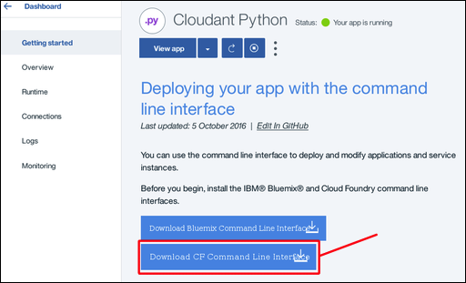

2.  Facendo clic sul link si viene indirizzati alla
    [pagina di scaricamento di GitHub ](https://github.com/cloudfoundry/cli/releases){:new_window}:<br/>
    

3.  Scarica ed esegui la versione più recente del programma di installazione per il tuo sistema.

4.  <div id='checkCFversion'></div>Per verificare che disponi di un toolkit Cloud Foundry funzionante,
    esegui il seguente comando quando richiesto:

    ```sh
    cf --version
    ```
    {:pre}
    
    È previsto un risultato simile al seguente output:
    
    ```
    cf version 6.20.0+25b1961-2016-06-29
    ```
    {:codeblock}
    
    >   **Nota**: la versione del toolkit Cloud Foundry deve essere 6.11 o più recente per la compatibilità con {{site.data.keyword.cloud_notm}}.

### Installazione del toolkit {{site.data.keyword.cloud_notm}}

Utilizza i seguenti passi per scaricare e installare il toolkit {{site.data.keyword.cloud_notm}} sul tuo sistema.

1.  Un link per scaricare il toolkit {{site.data.keyword.cloud_notm}} è disponibile
    ella finestra '`Introduzione`' della tua applicazione:<br/>
    

2.  Facendo clic sul link si viene indirizzati alla
    [pagina di scaricamento ](https://console.bluemix.net/docs/cli/reference/bluemix_cli/get_started.html#getting-started){:new_window}:<br/>
    


3.  Scarica ed esegui il programma di installazione appropriato per il tuo sistema

    Il programma di installazione esegue una verifica per garantire che disponi di una versione appropriata del toolkit Cloud Foundry installata.
    Se tutto è corretto,
    il toolkit {{site.data.keyword.cloud_notm}} viene installato nel tuo sistema.

4.  Per verificare che disponi di un toolkit {{site.data.keyword.cloud_notm}} funzionante,
    esegui il seguente comando quando richiesto:
    
    ```sh
    bluemix --version
    ```
    {:pre}
    
    È previsto un risultato simile al seguente output:
    
    ```
    bluemix version 0.4.5+03c29de-2016-12-08T07:01:01+00:00
    ```
    {:codeblock}
    
Gli strumenti per utilizzare le applicazioni {{site.data.keyword.cloud_notm}} sono ora disponibili.
Il passo successivo consiste nell'ottenere i materiali dello 'starter' per aiutarti nella creazione
di un'applicazione {{site.data.keyword.cloud_notm}}.

<div id="starter"></div>

## L'applicazione 'starter'

Questa sezione dell'esercitazione descrive un'applicazione starter {{site.data.keyword.cloud_notm}}
e spiega come puoi personalizzarla per accedere a un'istanza del database {{site.data.keyword.cloudant_short_notm}}.

Un'applicazione starter {{site.data.keyword.cloud_notm}} è la raccolta minima possibile di file
di configurazione e origine necessaria per creare un'applicazione {{site.data.keyword.cloud_notm}} funzionante.
Per alcuni motivi,
è simile a un'[applicazione 'Hello World'](https://en.wikipedia.org/wiki/%22Hello,_World!%22_program){:new_window};
sufficiente solo a mostrare che la configurazione e il sistema di base stiano funzionando correttamente.

Un'applicazione starter {{site.data.keyword.cloud_notm}} è un archivio di file di esempio che devi
modificare o estendere quando sviluppi la tua applicazione {{site.data.keyword.cloud_notm}}.

Tre file in particolare sono essenziali:

-   ['`Procfile`'](#procfile)
-   ['`manifest.yml`'](#manifest)
-   ['`requirements.txt`'](#requirements)

<div id="procfile"></div>

### Il file '`Procfile`'

'`Procfile`' contiene i dettagli di cui ha bisogno
{{site.data.keyword.cloud_notm}} per eseguire la tua applicazione.

In particolare,
un '`Procfile`' è una risorsa Cloud Foundry
che definisce un tipo di processo dell'applicazione
e il comando per eseguire l'applicazione.
Ulteriori informazioni sul '`Procfile`' sono disponibili
[qui ](https://docs.cloudfoundry.org/buildpacks/prod-server.html#procfile){:new_window}.

Il '`Procfile`' per un'applicazione starter {{site.data.keyword.cloud_notm}} Python
è simile al seguente esempio:

```
web: python server.py
```
{:codeblock}

Questo esempio indica che l'applicazione è un'applicazione web Python
e che viene avviata eseguendo il comando:

```sh
python server.py
```
{:codeblock}

Un file di origine '`server.py`' Python è incluso nell'archivio dell'applicazione starter.
Il file '`server.py`' viene modificato per la tua applicazione.
In alternativa,
crea un file di origine Python completamente nuovo.
Quindi,
aggiorna il '`Procfile`' in modo che venga utilizzato il nuovo file quando viene avviata la tua applicazione.

<div id="manifest"></div>

### Il file '`manifest.yml`'

Il file '`manifest.yml`' è una descrizione completa dell'applicazione
e dell'ambiente di cui ha bisogno per l'esecuzione.

Il file per un'applicazione starter {{site.data.keyword.cloud_notm}} Python è simile al seguente esempio:

```
applications:
- path: .
  memory: 128M
  instances: 1
  domain: mybluemix.net
  name: Cloudant Python
  host: Cloudant-Python
  disk_quota: 1024M
  services:
  - Cloudant Service 2017
```
{:codeblock}

Tre punti sono degni di nota:

-   I valori '`domain`',
    '`name`',
    e '`host`' corrispondono ai valori immessi
    quando la tua applicazione {{site.data.keyword.cloud_notm}} è stata [creata](#creating).
-   Il valore '`name`' viene utilizzato dal toolkit Cloud Foundry per identificare l'applicazione che stai gestendo.
-   Il valore '`services`' conferma che l'istanza del database '`Cloudant Service 2017`'
    {{site.data.keyword.cloudant_short_notm}} è connessa all'ambiente dell'applicazione.

Normalmente non hai bisogno di modificare il file '`manifest.yml`',
tuttavia è utile comprendere perché deve essere presente per far funzionare la tua applicazione.

<div id="requirements"></div>

### Il file '`requirements.txt`'

Il file '`requirements.txt`' specifica tutti i componenti aggiuntivi necessari al funzionamento della tua applicazione.

Nell'applicazione starter,
il file '`requirements.txt`' è vuoto.

Tuttavia, in questa esercitazione l'applicazione Python accede a un'istanza del database {{site.data.keyword.cloudant_short_notm}}.
Pertanto,
l'applicazione deve essere in grado di utilizzare la libreria client
[{{site.data.keyword.cloudant_short_notm}} per le applicazioni Python](../libraries/supported.html#python).

Per abilitare la libreria client Python,
modificare il file '`requirements.txt`' per leggere:
```
cloudant==2.3.1
```
{:codeblock}

## Passo successivo

Il passo successivo nell'esercitazione è di [creare l'applicazione](create_bmxapp_createapp.html).
