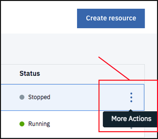

---

copyright:
  years: 2017, 2018
lastupdated: "2018-10-24"

---

{:new_window: target="_blank"}
{:shortdesc: .shortdesc}
{:screen: .screen}
{:codeblock: .codeblock}
{:pre: .pre}
{:tip: .tip}

<!-- Acrolinx: 2017-01-11 -->

# Creazione di una semplice applicazione {{site.data.keyword.cloud_notm}} per accedere a un database {{site.data.keyword.cloudant_short_notm}}: manutenzione e risoluzione dei problemi

Questa esercitazione illustra come conservare un'applicazione
{{site.data.keyword.cloud}},
ospitata nella tua istanza del servizio {{site.data.keyword.cloud_notm}}.
{:shortdesc}

## Esecuzione delle attività di manutenzione dell'applicazione di base

Questa sezione dell'esercitazione illustra come aggiornare,
avviare e arrestare la tua applicazione
Python in {{site.data.keyword.cloud_notm}}.

### Trovare lo stato della tua applicazione

Lo stato delle applicazioni nella tua istanza del servizio
{{site.data.keyword.cloud_notm}} viene visualizzato nel dashboard.

Nel seguente esempio, l'applicazione `Python Cloudant` non è in esecuzione e ha lo stato `Stopped`:

### Avvio della tua applicazione

Se provi ad avviare l'applicazione di esercitazione senza prima eliminare il database dimostrativo dell'esercitazione, l'applicazione non può funzionare correttamente. L'applicazione entra in un ciclo di tentativi di avvio,
    errore perché il database esiste,
    arresto,
    quindi un altro tentativo di avvio. Per risolvere il problema,
    [arresta l'applicazione](#stopping-your-application),
    quindi elimina il database dimostrativo dell'esercitazione. L'applicazione può quindi avviarsi correttamente.
{: tip}
    
Per avviare un'applicazione arrestata, fai prima clic sull'icona del menu dell'applicazione nel dashboard:

Successivamente,
fai clic sull'opzione `Start App` nel menu: 

### Arresto della tua applicazione

Per arrestare un'applicazione in esecuzione,
fai prima clic sull'icona del menu dell'applicazione nel dashboard: 

Successivamente,
fai clic sull'opzione `Stop App` nel menu: 

### Caricamento di una nuova versione della tua applicazione.

Per caricare una nuova versione della tua applicazione,
segui semplicemente il [processo di caricamento](create_bmxapp_upload.html).
La nuova versione sovrascrive la versione precedente dell'applicazione.

Se la versione meno recente dell'applicazione è già in esecuzione quando avvii il caricamento, {{site.data.keyword.cloud_notm}} prima arresta automaticamente l'applicazione.
{: tip}

## Diagnostica e risoluzione dei problemi

Questa sezione dell'esercitazione fornisce alcuni suggerimenti sulla risoluzione dei problemi di base per aiutarti
a identificare, diagnosticare
e risolvere alcuni problemi che potresti riscontrare quando sviluppi e distribuisci
le tue prime applicazioni {{site.data.keyword.cloud_notm}}.

Una buona fonte di consigli sulle procedure consigliate per la creazione delle applicazioni {{site.data.keyword.cloud_notm}} o
Cloud Foundry è
[qui
](https://docs.cloudfoundry.org/devguide/deploy-apps/prepare-to-deploy.html){:new_window}.

In particolare,
il consiglio per
[evitare le scritture sul file system locale
](https://docs.cloudfoundry.org/devguide/deploy-apps/prepare-to-deploy.html#filesystem){:new_window}
è cauto.

Per motivi di semplicità, questa esercitazione non scrive contenuto nel file system locale. Tuttavia,
    la quantità di materiale è piccola. Non è pensata per essere conservata
    e non è di 'importanza critica'.
{: tip}

### Utilizzo del log dell'applicazione

La risorsa più utile per la diagnostica e la risoluzione dei problemi con l'applicazione
{{site.data.keyword.cloud_notm}} è il file di log.

Il file di log per un'applicazione {{site.data.keyword.cloud_notm}} può essere trovato facendo clic sulla scheda `Logs` per aprire la pagina delle informazioni sulla registrazione nei log: 

Come la maggior parte dei file di log,
un log dell'applicazione {{site.data.keyword.cloud_notm}} contiene i dettagli su quali eventi si sono verificati e quando.

Il log inoltre identifica quale componente è stato coinvolto nell'evento registrato.
La seguente tabella identifica i componenti chiave:

Etichetta componente | Componente
----------------|----------
`API`           | Il sistema Cloud Foundry.
`APP`           | La tua applicazione.
`CELL`          | Il contenitore che ospita la tua applicazione in {{site.data.keyword.cloud_notm}}.
`RTR`           | I componenti di rete che trasportano i tuoi messaggi dalla/alla applicazione.

Ad esempio,
la seguente acquisizione schermo include un numero di eventi tipici: 

Prendi nota degli eventi ai seguenti orari:

-   Alle 13:56:56, l'applicazione è stata avvita correttamente.
-   Alle 13:58:43, la rete ha ricevuto una richiesta HTTP semplice, per `GET /`.
-   Pochi istanti dopo, l'applicazione ha ricevuto la richiesta HTTP e ha risposto.
-   Alle 14:13:46, è stata ricevuta una richiesta di arrestare l'applicazione.
-   Alle 14:13:48, l'applicazione ha completato il processo di arresto.

L'applicazione descritta in questa esercitazione è deliberatamente minima.
Come esempio specifico,
non è stato effettuato alcun tentativo di determinare se il database di destinazione esiste
e,
se non esiste,
di evitare di tentare di crealo nuovamente.
L'effetto è che se tenti di eseguire l'applicazione dell'esercitazione più di una volta,
senza rimuovere in anticipo il database,
l'applicazione ha ripetutamente esito negativo e si riavvia.

Puoi visualizzare questo effetto nella seguente acquisizione schermo: 

Alle 14:31:23,
l'applicazione ha rilevato un problema: 
`"Database {0} already exists".format(dbname)`

I rimanenti messaggi sono ciò che ti attendi da una qualsiasi applicazione Python che ha riscontrato un problema.

In effetti,
il log mostra quale componente ha riscontrato un problema
e fornisce più dettagli possibile.
Devi quindi applicare le normali procedure di risoluzione dei problemi per risolverlo.

## Fine dell'esercitazione

L'esercitazione è completa.
